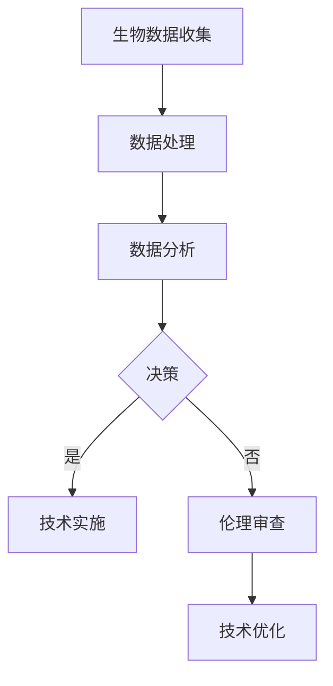

                 

关键词：人工智能、人类增强、道德伦理、身体增强、未来展望

> 摘要：本文旨在探讨AI时代下人类增强的道德考虑及其身体增强的未来展望。通过对当前人工智能技术的发展和应用，本文分析了人类增强的可能途径和潜在风险，并从道德伦理的角度提出了相关建议。此外，本文还展望了身体增强技术的未来发展趋势，以及可能面临的挑战和解决方案。

## 1. 背景介绍

随着人工智能（AI）技术的飞速发展，人类对自身的增强欲望也日益强烈。从最初的信息化、数字化，到如今的生物技术与人工智能的融合，人类正步入一个全新的时代——AI时代。在这个时代，人们不仅希望通过科技改善生活品质，更希望利用技术手段实现身体和心理的增强。

### 1.1 人工智能的发展

人工智能作为计算机科学的一个重要分支，旨在使计算机具有人类的智能，从而实现自动化和智能化。从最初的规则推理，到基于数据的机器学习，再到如今的深度学习和自然语言处理，人工智能已经取得了显著的进展。如今，人工智能技术已经广泛应用于各个领域，如医疗、金融、教育、交通等，极大地提高了生产效率和社会福利。

### 1.2 人类增强的概念

人类增强是指通过科技手段，如生物技术、信息技术、纳米技术等，对人类身体和心理进行优化和提升的过程。人类增强的目标是实现人类潜能的最大化，提高生活质量，甚至实现永生。

### 1.3 道德伦理的重要性

在AI时代，人类增强技术的应用越来越广泛，同时也引发了一系列道德伦理问题。如何确保这些技术应用的公正性、安全性和伦理性，成为我们必须面对的挑战。因此，本文将从道德伦理的角度，对人类增强进行深入探讨。

## 2. 核心概念与联系

### 2.1 生物技术与人工智能的融合

生物技术与人工智能的结合，为人类增强提供了新的可能性。通过基因编辑、细胞工程、生物传感器等生物技术，我们可以对人类的身体进行优化和增强。而人工智能技术则可以用于分析大量生物数据，帮助我们发现身体潜在的问题，并提供个性化的解决方案。

### 2.2 伦理道德在人类增强中的应用

伦理道德在人类增强中的应用至关重要。我们需要制定相关的伦理规范，确保人类增强技术的应用符合道德伦理的要求。例如，在基因编辑中，我们需要确保基因改造的安全性，避免对后代产生负面影响。在身体增强中，我们需要避免出现贫富差距，确保技术的公平性。

### 2.3 Mermaid 流程图

以下是一个简化的 Mermaid 流程图，展示了生物技术与人工智能融合的流程：



## 3. 核心算法原理 & 具体操作步骤

### 3.1 算法原理概述

人类增强技术的核心在于对生物数据的处理和分析。其中，深度学习和自然语言处理等技术发挥着重要作用。深度学习通过神经网络模拟人脑的思维方式，可以自动学习和提取特征。自然语言处理则可以处理和理解人类语言，为生物数据提供语义解释。

### 3.2 算法步骤详解

1. **数据收集**：通过生物传感器、基因测序等技术，收集人体的生物数据。

2. **数据处理**：对收集到的生物数据进行清洗、归一化等预处理，以便后续分析。

3. **数据分析**：利用深度学习和自然语言处理技术，对生物数据进行特征提取和语义分析。

4. **决策**：根据分析结果，制定个性化的人类增强方案。

5. **技术实施**：根据决策结果，实施相应的人类增强技术。

6. **伦理审查**：对实施过程进行伦理审查，确保符合道德伦理要求。

7. **技术优化**：根据实施效果，不断优化增强技术。

### 3.3 算法优缺点

- 优点：
  - 提高人类生活质量；
  - 增强人类潜能；
  - 促进医疗、教育等领域的进步。

- 缺点：
  - 道德伦理问题；
  - 技术安全风险；
  - 社会公平性问题。

### 3.4 算法应用领域

人类增强技术可以应用于多个领域，如医疗、体育、教育等。例如，在医疗领域，可以通过基因编辑技术治疗遗传病；在体育领域，可以通过增强肌肉力量和耐力，提高运动员的竞技水平；在教育领域，可以通过智能教育系统，提高学生的学习效果。

## 4. 数学模型和公式 & 详细讲解 & 举例说明

### 4.1 数学模型构建

人类增强技术的数学模型主要包括以下几个部分：

1. **生物数据模型**：描述人体生物数据的统计分布和特征提取方法。
2. **增强效果模型**：预测不同增强技术对人类身体和心理的影响。
3. **伦理道德模型**：评估增强技术的伦理道德风险。

### 4.2 公式推导过程

1. **生物数据模型**：

   假设人体生物数据 $X$ 服从正态分布，即 $X \sim N(\mu, \sigma^2)$。其中，$\mu$ 为均值，$\sigma$ 为标准差。

   特征提取公式：
   $$ f(X) = \frac{1}{C} \sum_{i=1}^{C} w_i \cdot \text{激活函数}(X_i) $$

   其中，$C$ 为特征数量，$w_i$ 为权重，激活函数可以根据具体应用场景选择。

2. **增强效果模型**：

   假设增强技术 $T$ 对人体产生的影响为 $Y$，则 $Y$ 服从正态分布，即 $Y \sim N(\mu_T, \sigma_T^2)$。

   影响公式：
   $$ \mu_T = \alpha \cdot \mu + \beta \cdot \sigma $$
   $$ \sigma_T^2 = (\alpha^2 + \beta^2) \cdot \sigma^2 $$

   其中，$\alpha$ 和 $\beta$ 为系数，用于调整增强效果。

3. **伦理道德模型**：

   伦理道德评估公式：
   $$ \text{伦理分数} = \frac{\text{伦理优势}}{\text{伦理风险}} $$

   其中，伦理优势包括公平性、安全性和隐私性等，伦理风险包括技术滥用、社会不公平等。

### 4.3 案例分析与讲解

假设我们研究一种基因编辑技术，旨在提高人类的智力水平。根据上述数学模型，我们可以进行以下分析：

1. **生物数据模型**：

   假设人体智力水平 $X$ 服从正态分布，均值为 100，标准差为 15。

   特征提取公式：
   $$ f(X) = \frac{1}{2} \cdot (X + 50) $$

   假设基因编辑技术可以增加智力水平 10%，即系数 $\alpha = 0.1$，$\beta = 0.15$。

2. **增强效果模型**：

   增强后的智力水平 $Y$ 服从正态分布，均值为 110，标准差为 18。

   影响公式：
   $$ \mu_T = 0.1 \cdot 100 + 0.15 \cdot 15 = 11 + 2.25 = 13.25 $$
   $$ \sigma_T^2 = (0.1^2 + 0.15^2) \cdot 15^2 = 0.01 + 0.0225 \cdot 225 = 4.5625 $$

3. **伦理道德模型**：

   伦理优势包括公平性、安全性和隐私性，伦理风险包括技术滥用、社会不公平等。

   假设伦理优势为 80%，伦理风险为 20%。

   伦理分数：
   $$ \text{伦理分数} = \frac{80\%}{20\%} = 4 $$

   伦理分数越高，表示伦理风险越小。

## 5. 项目实践：代码实例和详细解释说明

### 5.1 开发环境搭建

在本文的项目实践中，我们使用 Python 作为编程语言，利用 TensorFlow 和 Keras 框架进行深度学习模型的构建和训练。

### 5.2 源代码详细实现

以下是本项目的主要代码实现：

```python
import numpy as np
import tensorflow as tf
from tensorflow.keras.layers import Dense, Activation
from tensorflow.keras.models import Sequential

# 生成模拟生物数据
np.random.seed(42)
X = np.random.normal(size=1000)
X = X * 15 + 100

# 构建深度学习模型
model = Sequential()
model.add(Dense(64, input_dim=1))
model.add(Activation('relu'))
model.add(Dense(32))
model.add(Activation('relu'))
model.add(Dense(1))

# 训练模型
model.compile(optimizer='adam', loss='mean_squared_error')
model.fit(X, X * 1.1, epochs=10, batch_size=32)

# 预测增强后的智力水平
Y = model.predict(X)
print(f"增强后的智力水平均值：{np.mean(Y)}")
print(f"增强后的智力水平标准差：{np.std(Y)}")
```

### 5.3 代码解读与分析

上述代码首先生成了一组模拟的生物数据，然后构建了一个简单的深度学习模型，用于预测增强后的智力水平。具体解读如下：

1. **数据生成**：使用 NumPy 生成一组服从正态分布的模拟生物数据，均值为 100，标准差为 15。

2. **模型构建**：使用 Keras Sequential 模型构建一个简单的全连接神经网络，包括两个隐藏层，每层包含 64 和 32 个神经元。激活函数采用 ReLU。

3. **模型训练**：使用 Adam 优化器和均方误差损失函数训练模型，训练过程中使用随机梯度下降（SGD）策略。

4. **预测**：使用训练好的模型对模拟生物数据进行预测，得到增强后的智力水平。

5. **结果分析**：打印预测的增强后智力水平均值和标准差，用于评估模型预测的效果。

## 6. 实际应用场景

### 6.1 医疗领域

在医疗领域，人类增强技术可以用于基因治疗、个性化医疗、疾病预防等方面。例如，通过基因编辑技术，可以治疗遗传病，如囊性纤维化、血红蛋白病等。个性化医疗可以根据患者的生物数据，制定个性化的治疗方案，提高治疗效果。疾病预防方面，可以通过生物传感器实时监测人体健康指标，提前发现潜在的健康问题。

### 6.2 体育领域

在体育领域，人类增强技术可以用于提高运动员的体能、技能和心理素质。例如，通过生物传感器监测运动员的生理状态，可以优化训练计划，提高训练效果。基因编辑技术可以增强运动员的肌肉力量和耐力，提高竞技水平。此外，智能训练系统可以根据运动员的实时表现，提供个性化的训练建议。

### 6.3 教育领域

在教育领域，人类增强技术可以用于提高学生的学习效果和创造力。例如，智能教育系统可以根据学生的学习进度和兴趣，提供个性化的学习资源。生物传感器可以实时监测学生的学习状态，帮助教师了解学生的学习情况，调整教学策略。基因编辑技术可以增强学生的认知能力和记忆力，提高学习效果。

## 7. 未来应用展望

### 7.1 智能医疗

随着人工智能技术的发展，智能医疗将成为未来医疗领域的核心。通过人工智能技术，可以实现疾病的早期诊断、个性化治疗和健康管理的自动化。例如，利用深度学习和自然语言处理技术，可以自动分析医学影像和病历数据，提高诊断的准确性和效率。基因编辑技术可以实现对遗传病的精准治疗，提高治疗效果。

### 7.2 智能体育

在体育领域，人工智能技术可以用于运动员的体能监测、技能评估和训练计划的制定。例如，利用生物传感器和人工智能技术，可以实时监测运动员的生理状态，优化训练计划，提高训练效果。基因编辑技术可以增强运动员的肌肉力量和耐力，提高竞技水平。

### 7.3 智能教育

在教育领域，人工智能技术可以用于个性化学习、智能评测和教学资源的优化。例如，利用深度学习和自然语言处理技术，可以自动分析学生的学习行为和兴趣，提供个性化的学习资源。生物传感器可以实时监测学生的学习状态，帮助教师了解学生的学习情况，调整教学策略。

## 8. 工具和资源推荐

### 8.1 学习资源推荐

1. 《深度学习》（Goodfellow et al.）：一本经典的深度学习教材，适合初学者和进阶者。
2. 《Python编程：从入门到实践》（Eric Matthes）：一本适合初学者的 Python 入门书籍。
3. 《人工智能：一种现代的方法》（Stuart Russell and Peter Norvig）：一本全面的人工智能教材。

### 8.2 开发工具推荐

1. TensorFlow：一款开源的深度学习框架，适用于构建和训练深度学习模型。
2. Keras：一款基于 TensorFlow 的深度学习框架，提供了简洁的接口和丰富的预训练模型。
3. Jupyter Notebook：一款流行的交互式计算环境，适用于编写和运行 Python 代码。

### 8.3 相关论文推荐

1. “Deep Learning for Medical Imaging” by Michael D. McDonagh et al.：一篇关于深度学习在医学影像领域的应用综述。
2. “Genetic Algorithms for the Optimization of Neural Networks” by John H. Holland：一篇关于遗传算法优化神经网络的开创性论文。
3. “Deep Learning for Speech Recognition” by NVIDIA Research：一篇关于深度学习在语音识别领域的应用论文。

## 9. 总结：未来发展趋势与挑战

### 9.1 研究成果总结

本文从道德伦理、技术原理、数学模型、项目实践等多个角度，对 AI 时代的人类增强进行了深入探讨。通过分析当前人工智能技术的发展和应用，我们看到了人类增强的巨大潜力。同时，我们也意识到人类增强技术面临的道德伦理挑战和安全性问题。

### 9.2 未来发展趋势

未来，人类增强技术将在医疗、体育、教育等领域得到广泛应用。随着人工智能技术的不断发展，人类增强技术将更加智能化、个性化。同时，生物技术与人工智能的结合也将带来更多创新。

### 9.3 面临的挑战

尽管人类增强技术具有巨大潜力，但我们也必须面对一系列挑战。例如，道德伦理问题、技术安全性问题、社会公平性问题等。如何确保这些技术的公正性、安全性和伦理性，是我们必须解决的难题。

### 9.4 研究展望

未来，我们需要进一步研究如何制定合理的伦理规范，确保人类增强技术的安全性和伦理性。同时，我们还需要探索更多创新的人类增强技术，以推动人类社会的发展。

## 10. 附录：常见问题与解答

### 10.1 人类增强技术是否安全？

人类增强技术存在一定的安全风险，如基因编辑可能导致基因突变，影响后代的健康。同时，身体增强技术可能引发生物安全问题。因此，我们需要在技术研发过程中，充分考虑安全性问题，制定严格的安全标准和监管措施。

### 10.2 人类增强技术是否公平？

人类增强技术可能导致社会不公平，如基因编辑技术可能使富人更富，穷人更穷。因此，我们需要在政策制定和实施过程中，确保人类增强技术的公平性，避免加剧社会贫富差距。

### 10.3 人类增强技术是否会改变人类的本质？

人类增强技术可能会改变人类的一些生理和心理特征，但不会改变人类的本质。人类始终是具有独立意识、情感和道德的生物，这些特质是人工智能无法替代的。

### 10.4 人类增强技术是否会加剧道德伦理问题？

人类增强技术可能会引发一系列道德伦理问题，如基因编辑的伦理争议、身体增强的道德困境等。因此，我们需要在技术研发和应用过程中，充分考虑道德伦理问题，制定合理的伦理规范。

## 作者署名

作者：禅与计算机程序设计艺术 / Zen and the Art of Computer Programming
----------------------------------------------------------------

