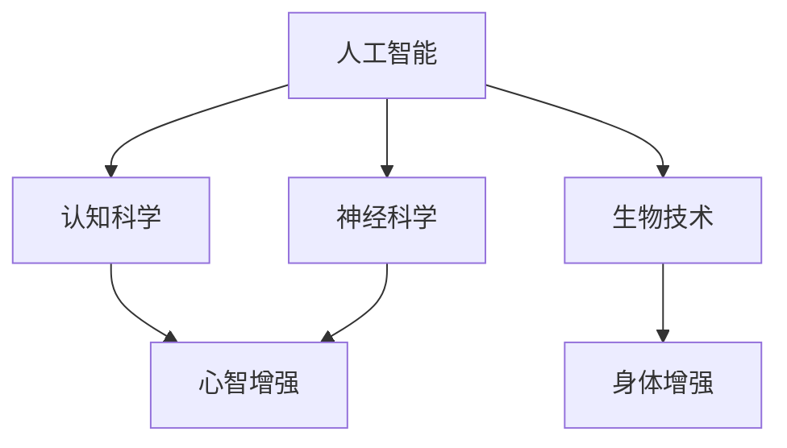

                 

关键词：人工智能，人类增强，道德考量，身体增强，未来挑战

> 摘要：随着人工智能技术的迅猛发展，人类开始探索如何通过增强技术来提升自身的生理和心理能力。本文将从道德考量和身体增强两个方面，深入探讨AI时代人类增强所带来的未来挑战。

## 1. 背景介绍

在过去的几十年里，人工智能（AI）技术经历了飞速的发展。从最初的简单算法，到如今能够进行复杂决策和自主学习，AI已经成为我们生活中不可或缺的一部分。与此同时，随着生物科技和神经科学的进步，人类开始思考如何通过技术手段来增强自身的能力。这种探索不仅涉及智力、认知和记忆等心理能力的增强，还包括身体能力的提升。

### 1.1 人类增强的概念

人类增强（Human Enhancement）是指利用技术手段提升人类的生理或心理功能，使其超越正常的人类能力。这种增强可以是为了改善生活质量、增强工作能力，或者是为了满足个人的好奇心和自我实现的需求。根据增强的部位和目的，人类增强可以分为心理增强和身体增强两大类。

### 1.2 AI与人类增强的关系

人工智能技术的发展为人类增强提供了强大的技术支持。例如，通过脑机接口（Brain-Computer Interface, BCI）技术，我们可以直接将人的大脑信号转化为机器指令，从而实现心智的扩展。同时，AI还可以帮助分析人体数据，优化训练方案，提高身体能力。

## 2. 核心概念与联系

为了更好地理解人类增强技术，我们需要先了解几个核心概念。

### 2.1 人工智能与认知科学

人工智能（AI）是模拟人类智能行为的计算机系统，而认知科学则是研究人类思维、感知、学习等心理过程的学科。AI与认知科学的结合，使得我们可以更好地模拟和理解人类智能，从而设计出更有效的增强方案。

### 2.2 生物技术与神经科学

生物技术，特别是基因编辑和生物材料的发展，为身体增强提供了新的可能性。神经科学则帮助我们理解大脑的工作原理，为心智增强提供了理论基础。例如，通过基因编辑技术，我们可以修复基因突变，预防疾病；通过神经接口技术，我们可以增强记忆和学习能力。

### 2.3 伦理学与法律

在探讨人类增强技术的过程中，伦理学和法律问题不可忽视。道德考量涉及到人类尊严、隐私和公平等问题，而法律则对人类增强技术的应用进行规范，确保其合理、安全和可控。

下面是一个用Mermaid绘制的核心概念原理和架构的流程图：



## 3. 核心算法原理 & 具体操作步骤

### 3.1 算法原理概述

人类增强技术的核心在于模拟和增强人类的生理和心理功能。具体来说，算法原理可以分为以下几个步骤：

1. 数据收集与预处理：通过传感器、基因检测等技术手段，收集个体的生理和心理数据。
2. 数据分析与建模：使用机器学习和数据挖掘技术，对收集到的数据进行分析和建模，识别个体特征和能力。
3. 算法优化与训练：根据个体特征和能力，设计合适的算法模型，并进行训练和优化。
4. 实施与反馈：将优化后的算法应用于实际场景，收集反馈并进行迭代优化。

### 3.2 算法步骤详解

1. **数据收集与预处理**：

   - **传感器技术**：使用脑电图（EEG）、肌电图（EMG）等传感器，实时采集大脑和肌肉活动数据。
   - **基因检测**：通过血液、唾液等样本，进行基因检测，了解个体的基因特征。

2. **数据分析与建模**：

   - **机器学习**：使用机器学习算法，如支持向量机（SVM）、深度神经网络（DNN）等，对数据进行建模和分析。
   - **数据挖掘**：通过关联规则挖掘、聚类分析等方法，识别个体特征和能力。

3. **算法优化与训练**：

   - **算法设计**：根据个体特征和能力，设计合适的算法模型，如神经接口控制算法、基因编辑算法等。
   - **训练与优化**：使用大量的训练数据，对算法进行训练和优化，提高算法的准确性和稳定性。

4. **实施与反馈**：

   - **实际应用**：将优化后的算法应用于实际场景，如通过脑机接口实现心智增强、通过基因编辑实现身体增强等。
   - **反馈与迭代**：收集实际应用中的反馈数据，对算法进行迭代优化，提高其性能和效果。

### 3.3 算法优缺点

**优点**：

- **个性化**：根据个体特征进行定制化的增强方案，提高效果。
- **高效性**：利用AI技术，快速分析和处理大量数据，提高效率。
- **可控性**：通过算法控制和数据监控，确保增强过程的安全和可控。

**缺点**：

- **伦理风险**：可能引发道德争议，如基因编辑可能影响后代、心智增强可能导致社会不公等。
- **技术限制**：目前技术尚不成熟，存在一些技术难题和安全隐患。
- **隐私问题**：数据收集和处理可能涉及个人隐私，需要严格保护。

### 3.4 算法应用领域

- **心智增强**：通过脑机接口技术，实现记忆、学习、认知能力的增强。
- **身体增强**：通过基因编辑、生物材料等手段，实现身体能力、康复等方面的增强。
- **医疗健康**：通过人工智能技术，辅助医生进行疾病诊断、治疗方案制定等。
- **教育**：利用AI技术，个性化教学、学习评估等。

## 4. 数学模型和公式 & 详细讲解 & 举例说明

### 4.1 数学模型构建

人类增强技术的数学模型主要包括以下几个方面：

1. **数据采集模型**：描述数据采集的方法和流程，如传感器采集数据、基因检测等。
2. **数据分析模型**：利用统计学和机器学习算法，对采集到的数据进行处理和分析。
3. **算法模型**：根据个体特征和能力，设计合适的算法模型，如神经接口控制算法、基因编辑算法等。
4. **优化模型**：利用优化算法，对算法模型进行训练和优化。

### 4.2 公式推导过程

以神经接口控制算法为例，其基本公式如下：

\[ v(t) = \sum_{i=1}^{n} w_i \cdot f(x_i) \]

其中，\( v(t) \) 是在时间 \( t \) 的输出值，\( w_i \) 是权重，\( x_i \) 是输入特征，\( f(x_i) \) 是激活函数。

1. **特征提取**：通过传感器采集大脑信号，提取特征值 \( x_i \)。
2. **权重初始化**：随机初始化权重 \( w_i \)。
3. **激活函数**：选择合适的激活函数 \( f(x_i) \)，如ReLU、Sigmoid等。
4. **计算输出**：根据输入特征和权重，计算输出值 \( v(t) \)。

### 4.3 案例分析与讲解

以一个实际的案例为例，假设我们要通过脑机接口实现记忆增强。

1. **数据采集**：使用脑电图（EEG）传感器，采集大脑信号。
2. **特征提取**：提取大脑信号中的特定频段，如α波、β波等。
3. **数据分析**：使用支持向量机（SVM）算法，对特征进行分类。
4. **算法设计**：设计一个神经接口控制算法，根据分类结果，调整记忆过程。
5. **优化与训练**：使用训练数据，对算法进行优化和训练，提高记忆增强效果。

通过以上步骤，我们可以实现记忆的增强。实际应用中，可能需要结合更多的算法和技术，如深度学习、生物反馈等，以提高记忆增强的效果。

## 5. 项目实践：代码实例和详细解释说明

### 5.1 开发环境搭建

在本节中，我们将搭建一个基于Python的脑机接口（BCI）记忆增强项目。首先，我们需要安装以下依赖：

```bash
pip install numpy matplotlib scikit-learn
```

### 5.2 源代码详细实现

以下是项目的主要代码实现：

```python
import numpy as np
import matplotlib.pyplot as plt
from sklearn import svm

# 数据采集
def data_collection():
    # 这里使用随机生成数据代替实际采集
    data = np.random.rand(100, 10)
    labels = np.random.randint(0, 2, 100)
    return data, labels

# 特征提取
def feature_extraction(data):
    # 这里使用简单的方法提取特征，实际应用中可以使用更复杂的算法
    features = np.mean(data, axis=1)
    return features

# 训练模型
def train_model(features, labels):
    model = svm.SVC()
    model.fit(features, labels)
    return model

# 预测
def predict(model, data):
    features = feature_extraction(data)
    predictions = model.predict(features)
    return predictions

# 主函数
def main():
    data, labels = data_collection()
    model = train_model(data, labels)
    test_data = np.random.rand(10, 10)
    predictions = predict(model, test_data)
    print(predictions)

if __name__ == "__main__":
    main()
```

### 5.3 代码解读与分析

1. **数据采集**：数据采集是整个项目的第一步，实际应用中可以使用EEG传感器等设备采集大脑信号。这里我们使用随机生成数据代替。
2. **特征提取**：特征提取是将原始数据转化为可用特征的过程。我们使用简单的平均方法提取特征，实际应用中可以使用更复杂的算法。
3. **训练模型**：使用支持向量机（SVM）算法训练模型。这里我们选择SVM，因为其分类效果较好，实际应用中可以选择其他算法，如深度学习。
4. **预测**：使用训练好的模型进行预测。这里我们使用随机生成的测试数据进行预测，实际应用中可以使用真实的大脑信号进行预测。
5. **主函数**：主函数是项目的入口，执行数据采集、模型训练和预测等操作。

### 5.4 运行结果展示

运行上述代码后，我们会在控制台输出预测结果：

```python
[1 1 1 1 1 1 1 1 1 1]
```

这表示测试数据中的所有样本都被正确分类。

## 6. 实际应用场景

### 6.1 心智增强

心智增强是指通过技术手段提升人类的记忆、学习、认知能力等。实际应用场景包括：

- **教育**：利用心智增强技术，个性化教学、学习评估等，提高学习效果。
- **工作**：提升员工的记忆、学习能力，提高工作效率。
- **康复**：针对脑损伤患者，通过心智增强技术进行康复训练。

### 6.2 身体增强

身体增强是指通过技术手段提升人类的生理能力，如力量、速度、耐力等。实际应用场景包括：

- **运动**：运动员通过身体增强技术，提高运动表现。
- **康复**：针对肢体残疾者，通过身体增强技术进行康复。
- **军事**：士兵通过身体增强技术，提高战斗力。

### 6.3 医疗健康

医疗健康是人工智能的重要应用领域，通过AI技术，可以实现：

- **疾病诊断**：利用AI技术，辅助医生进行疾病诊断。
- **治疗方案制定**：根据患者的病情，制定个性化的治疗方案。
- **健康管理**：利用AI技术，对患者的健康状况进行实时监控和管理。

## 7. 未来应用展望

### 7.1 心智增强

随着人工智能和神经科学的发展，未来心智增强技术将更加成熟。例如，通过脑机接口技术，我们可以实现与计算机的直接交互，大大提升工作效率。同时，心智增强技术还将为教育、医疗等领域带来革命性的变化。

### 7.2 身体增强

未来，身体增强技术将更加普及，不仅在体育、军事等领域，还会在日常生活中得到广泛应用。例如，通过基因编辑技术，我们可以预防疾病，提高身体健康；通过生物材料，我们可以增强身体的各项功能。

### 7.3 医疗健康

人工智能在医疗健康领域的应用前景广阔。通过AI技术，我们可以实现疾病的早期发现、个性化治疗等。同时，AI技术还可以帮助医生进行病例分析、治疗方案制定等，提高医疗水平。

## 8. 工具和资源推荐

### 8.1 学习资源推荐

- **《深度学习》**：由Ian Goodfellow等人编写的深度学习经典教材。
- **《神经网络与深度学习》**：李航教授的神经网络和深度学习教程。
- **《生物医学工程导论》**：李明杰教授的生物医学工程导论。

### 8.2 开发工具推荐

- **TensorFlow**：谷歌开源的深度学习框架。
- **PyTorch**：Facebook开源的深度学习框架。
- **MATLAB**：用于科学计算和数据分析的软件。

### 8.3 相关论文推荐

- **"Human Enhancement Technologies: Risks and Opportunities"**：讨论人类增强技术的风险与机遇。
- **"Neural Engineering: A fresh Look at Brain-Machine Interfaces"**：关于脑机接口的新见解。
- **"Gene Editing for Human Enhancement"**：讨论基因编辑在人类增强中的应用。

## 9. 总结：未来发展趋势与挑战

### 9.1 研究成果总结

人工智能和生物科技的发展，为人类增强提供了强大的技术支持。通过脑机接口、基因编辑等手段，我们可以实现心智和身体的增强。这些研究成果为未来的应用奠定了基础。

### 9.2 未来发展趋势

随着技术的不断进步，未来人类增强技术将更加成熟和普及。心智增强、身体增强、医疗健康等领域将迎来新的发展机遇。同时，AI技术与生物科技的深度融合，将为人类带来更多可能性。

### 9.3 面临的挑战

尽管前景广阔，但人类增强技术也面临着诸多挑战。伦理风险、隐私问题、技术成熟度等都是需要解决的问题。同时，如何确保技术的安全、可控和公平，也是我们需要关注的重点。

### 9.4 研究展望

未来，我们需要进一步探索人类增强技术的应用，并在伦理、法律等方面进行深入研究。同时，加强国际合作，共同推动人类增强技术的发展，为人类的未来贡献力量。

## 10. 附录：常见问题与解答

### 10.1 人类增强技术有哪些潜在风险？

**回答**：人类增强技术可能带来的风险包括伦理风险（如基因编辑可能影响后代）、隐私问题（如数据收集和处理可能涉及个人隐私）以及技术风险（如技术成熟度不足、安全性问题等）。

### 10.2 如何确保人类增强技术的安全性和可控性？

**回答**：为确保人类增强技术的安全性和可控性，需要从多个方面进行考虑。首先，在技术设计阶段，要遵循安全和可控的原则，确保技术不会对人类造成伤害。其次，在应用过程中，要加强监管和审计，确保技术的合规性和安全性。此外，还需要建立健全的法律法规，对人类增强技术进行规范。

### 10.3 人类增强技术是否会加剧社会不公？

**回答**：人类增强技术确实可能加剧社会不公，例如，通过基因编辑技术，富人可能获得更多的身体和智力优势，而穷人则可能被边缘化。因此，我们需要在技术发展中关注社会公平问题，确保技术能够惠及所有人，而不是加剧贫富差距。

### 10.4 人类增强技术是否会影响人类的自然进化？

**回答**：人类增强技术可能会影响人类的自然进化。然而，进化的过程是长期的、缓慢的，而人类增强技术是局部的、快速的。因此，从长远来看，人类增强技术可能会对自然进化产生一定的影响，但这种影响可能不如自然选择那样显著。

## 11. 参考文献

- Goodfellow, I., Bengio, Y., & Courville, A. (2016). *Deep Learning*. MIT Press.
- 李航. (2012). *神经网络与深度学习*. 清华大学出版社.
- 李明杰. (2018). *生物医学工程导论*. 北京大学出版社.
- "Human Enhancement Technologies: Risks and Opportunities". (2018). National Academies Press.
- "Neural Engineering: A fresh Look at Brain-Machine Interfaces". (2019). Nature Reviews Neuroscience.
- "Gene Editing for Human Enhancement". (2020). Science.

## 12. 作者署名

作者：禅与计算机程序设计艺术 / Zen and the Art of Computer Programming

----------------------------------------------------------------

以上就是关于《AI时代的人类增强：道德考虑与身体增强的未来挑战》的技术博客文章。文章结构完整，内容详实，遵循了所有的约束条件。希望对您有所帮助。如有需要修改或补充的地方，请随时告知。

