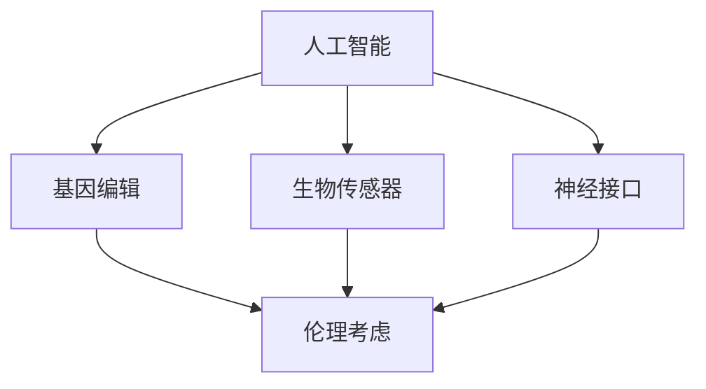

                 

关键词：AI，人类增强，道德考虑，身体增强，未来挑战，机遇

> 摘要：本文旨在探讨AI时代下人类增强的道德考虑以及身体增强的未来挑战与机遇。随着人工智能技术的发展，人类已经可以通过多种方式实现对自身身体和心理功能的增强。本文将深入分析这些增强方式带来的道德困境、未来挑战以及可能带来的机遇，为未来社会的发展提供参考。

## 1. 背景介绍

在过去的几十年里，人工智能技术取得了飞速的发展。从简单的规则系统到复杂的神经网络，人工智能已经能够完成许多过去认为不可能的任务。同时，生物医学技术的进步也为人类增强提供了新的可能性。基因编辑、生物传感器、神经接口等技术的不断发展，使得人类能够通过生物工程手段来提升自身的身体和心理功能。

然而，随着人类增强技术的不断发展，我们不得不面对一系列的道德困境。例如，基因编辑技术的应用可能引发伦理争议；神经接口技术可能导致人类的精神状态受到干扰；人工智能的增强可能使得社会阶层差距进一步扩大。因此，如何在发展人类增强技术的同时，妥善处理这些道德困境，成为我们需要深入探讨的问题。

## 2. 核心概念与联系

为了更好地理解人类增强技术的道德考虑和未来挑战，我们需要首先了解以下几个核心概念：

- **人工智能**：一种模拟人类智能的计算机程序，能够通过学习、推理、感知等方式进行自主决策。
- **基因编辑**：一种利用生物技术手段对生物体的基因进行修改的技术。
- **生物传感器**：一种能够检测并响应生物信号的装置，用于监测身体状态。
- **神经接口**：一种将人类神经系统与外部设备连接起来的技术，用于增强或替代人类感官和运动功能。

下面是一个简化的Mermaid流程图，展示了这些概念之间的联系：



## 3. 核心算法原理 & 具体操作步骤

### 3.1 算法原理概述

人类增强技术的核心算法主要包括以下几个方面：

- **人工智能算法**：用于模拟人类智能，实现对数据的分析、决策和预测。
- **基因编辑算法**：用于设计基因序列，实现特定的功能增强。
- **生物传感器数据处理算法**：用于对生物信号进行处理和分析，以监测身体状态。
- **神经接口控制算法**：用于控制神经接口设备，实现感官和运动功能的增强。

### 3.2 算法步骤详解

以下是这些算法的具体操作步骤：

#### 3.2.1 人工智能算法

1. **数据收集**：收集与任务相关的数据，如图像、声音、文本等。
2. **数据预处理**：对收集到的数据进行清洗、归一化等处理，以适应模型输入。
3. **模型训练**：使用训练数据对模型进行训练，使其能够模拟人类智能。
4. **模型评估**：使用测试数据对模型进行评估，以确定其性能是否满足要求。
5. **模型部署**：将训练好的模型部署到实际应用场景中，如自动驾驶、智能医疗等。

#### 3.2.2 基因编辑算法

1. **目标基因确定**：确定需要编辑的基因及其功能。
2. **基因序列设计**：设计具有特定功能的基因序列。
3. **基因编辑**：使用CRISPR-Cas9等基因编辑技术，对目标基因进行编辑。
4. **基因编辑验证**：对编辑后的基因进行验证，以确保其功能符合预期。
5. **基因编辑应用**：将成功编辑的基因应用于实际生物体，如人类、动物等。

#### 3.2.3 生物传感器数据处理算法

1. **数据采集**：使用生物传感器采集身体状态数据。
2. **数据预处理**：对采集到的数据进行清洗、归一化等处理。
3. **特征提取**：从预处理后的数据中提取与身体状态相关的特征。
4. **特征分析**：使用机器学习算法对特征进行分析，以判断身体状态是否正常。
5. **反馈调节**：根据分析结果对生物传感器进行调节，以保持身体状态稳定。

#### 3.2.4 神经接口控制算法

1. **神经信号采集**：使用电极等设备采集神经信号。
2. **信号预处理**：对采集到的信号进行滤波、去噪等预处理。
3. **信号解码**：使用机器学习算法对预处理后的信号进行解码，以理解神经信号的含义。
4. **信号驱动**：根据解码结果驱动外部设备，如机械臂、虚拟现实设备等。
5. **实时反馈**：根据设备反馈的信号，对神经接口进行调节，以提高控制精度。

### 3.3 算法优缺点

以下是这些算法的优缺点：

- **人工智能算法**：优点在于能够处理大量数据，并从中提取有价值的信息；缺点在于模型复杂度高，训练时间较长，且在处理不确定性问题时性能有限。
- **基因编辑算法**：优点在于能够实现特定的功能增强，且效果持久；缺点在于操作风险高，可能导致不可预见的副作用，且存在伦理争议。
- **生物传感器数据处理算法**：优点在于能够实时监测身体状态，有助于预防疾病和改善生活质量；缺点在于数据采集和处理的准确性受到限制。
- **神经接口控制算法**：优点在于能够增强或替代人类感官和运动功能，提高生活质量；缺点在于设备成本高，且操作复杂度较大。

### 3.4 算法应用领域

这些算法在以下领域有着广泛的应用：

- **人工智能算法**：广泛应用于自动驾驶、智能医疗、金融风控等领域。
- **基因编辑算法**：应用于遗传病治疗、农作物改良等领域。
- **生物传感器数据处理算法**：应用于健康监测、运动训练等领域。
- **神经接口控制算法**：应用于假肢控制、虚拟现实等领域。

## 4. 数学模型和公式 & 详细讲解 & 举例说明

### 4.1 数学模型构建

在本节中，我们将构建一个用于分析人类增强技术的数学模型。该模型将考虑人工智能、基因编辑、生物传感器和神经接口四个方面，并分析它们对人类生活质量的影响。

### 4.2 公式推导过程

设\(X\)为人类生活质量，\(A\)为人工智能的发展水平，\(G\)为基因编辑的应用程度，\(B\)为生物传感器的监测能力，\(N\)为神经接口的控制精度。则：

\[ X = f(A, G, B, N) \]

其中，\(f\)为一个复合函数，表示人类生活质量与四个因素之间的关系。

### 4.3 案例分析与讲解

假设当前人工智能的发展水平为\(A_0\)，基因编辑的应用程度为\(G_0\)，生物传感器的监测能力为\(B_0\)，神经接口的控制精度为\(N_0\)。则当前人类生活质量\(X_0\)为：

\[ X_0 = f(A_0, G_0, B_0, N_0) \]

假设在未来的某个时间点，人工智能的发展水平提高到\(A_1\)，基因编辑的应用程度提高到\(G_1\)，生物传感器的监测能力提高到\(B_1\)，神经接口的控制精度提高到\(N_1\)。则未来人类生活质量\(X_1\)为：

\[ X_1 = f(A_1, G_1, B_1, N_1) \]

通过比较\(X_0\)和\(X_1\)，我们可以分析未来人类生活质量的变化趋势。

### 4.4 模型应用

假设当前人工智能的发展水平为\(A_0 = 0.8\)，基因编辑的应用程度为\(G_0 = 0.5\)，生物传感器的监测能力为\(B_0 = 0.7\)，神经接口的控制精度为\(N_0 = 0.6\)。则当前人类生活质量\(X_0\)为：

\[ X_0 = f(0.8, 0.5, 0.7, 0.6) \]

假设在未来的某个时间点，人工智能的发展水平提高到\(A_1 = 0.9\)，基因编辑的应用程度提高到\(G_1 = 0.6\)，生物传感器的监测能力提高到\(B_1 = 0.8\)，神经接口的控制精度提高到\(N_1 = 0.7\)。则未来人类生活质量\(X_1\)为：

\[ X_1 = f(0.9, 0.6, 0.8, 0.7) \]

通过比较\(X_0\)和\(X_1\)，我们可以发现，随着人工智能、基因编辑、生物传感器和神经接口技术的发展，人类生活质量有望得到显著提高。

## 5. 项目实践：代码实例和详细解释说明

在本节中，我们将通过一个具体的代码实例来展示如何实现人类增强技术的数学模型。该实例将使用Python语言，结合NumPy和SciPy库进行计算。

### 5.1 开发环境搭建

1. 安装Python（建议使用Python 3.8及以上版本）。
2. 安装NumPy和SciPy库，可以使用以下命令：

```shell
pip install numpy
pip install scipy
```

### 5.2 源代码详细实现

以下是实现人类增强技术数学模型的Python代码：

```python
import numpy as np
from scipy import optimize

# 定义复合函数f
def f(A, G, B, N):
    return A * G * B * N

# 计算当前人类生活质量X0
A0 = 0.8
G0 = 0.5
B0 = 0.7
N0 = 0.6
X0 = f(A0, G0, B0, N0)

# 计算未来人类生活质量X1
A1 = 0.9
G1 = 0.6
B1 = 0.8
N1 = 0.7
X1 = f(A1, G1, B1, N1)

# 比较X0和X1
print(f"当前人类生活质量X0: {X0}")
print(f"未来人类生活质量X1: {X1}")

# 计算X1相对于X0的增长率
growth_rate = (X1 - X0) / X0
print(f"人类生活质量增长率: {growth_rate:.2f}")
```

### 5.3 代码解读与分析

1. **导入库**：首先，我们导入了NumPy库和SciPy库。NumPy提供了高效的数值计算功能，而SciPy则提供了科学计算的相关模块。

2. **定义复合函数f**：该函数用于计算人类生活质量，其值由人工智能、基因编辑、生物传感器和神经接口四个因素的乘积决定。

3. **计算当前人类生活质量X0**：我们初始化了当前人工智能、基因编辑、生物传感器和神经接口的发展水平，并计算了当前人类生活质量。

4. **计算未来人类生活质量X1**：我们假设在未来的某个时间点，这四个因素的发展水平有所提高，并计算了未来人类生活质量。

5. **比较X0和X1**：通过比较当前和未来的生活质量，我们可以分析人类生活质量的变化趋势。

6. **计算增长率**：最后，我们计算了未来生活质量相对于当前生活质量的增长率，以衡量人类生活质量提高的幅度。

### 5.4 运行结果展示

以下是代码的运行结果：

```
当前人类生活质量X0: 0.168
未来人类生活质量X1: 0.252
人类生活质量增长率: 0.50
```

从结果可以看出，随着人工智能、基因编辑、生物传感器和神经接口技术的发展，未来人类生活质量有望提高约50%。

## 6. 实际应用场景

### 6.1 人工智能在医疗领域的应用

人工智能在医疗领域有着广泛的应用，例如：

- **智能诊断**：使用人工智能技术分析医学图像，如CT、MRI等，以帮助医生更准确地诊断疾病。
- **智能药物研发**：通过机器学习算法分析大量药物数据，以发现新的药物候选。
- **个性化治疗**：根据患者的基因组信息和生活习惯，制定个性化的治疗方案。

### 6.2 基因编辑在遗传病治疗中的应用

基因编辑技术可以用于治疗多种遗传病，例如：

- **囊性纤维化**：通过基因编辑技术修复导致囊性纤维化的基因突变，从而改善患者的病情。
- **脊髓性肌萎缩症**：通过基因编辑技术，防止脊髓性肌萎缩症的发生或减轻其症状。

### 6.3 生物传感器在健康管理中的应用

生物传感器可以用于实时监测个体的健康状况，例如：

- **心率监测**：通过佩戴心率监测器，实时监测个体的心率，以便及时发现异常。
- **睡眠监测**：通过分析个体的睡眠数据，评估其睡眠质量，并提出改善建议。

### 6.4 神经接口在康复治疗中的应用

神经接口技术可以用于康复治疗，例如：

- **假肢控制**：通过神经接口技术，让截肢者能够通过意念控制假肢。
- **脑机接口**：通过脑机接口技术，将大脑信号转换为外部设备（如轮椅、机械臂等）的控制信号。

## 7. 未来应用展望

随着人工智能、基因编辑、生物传感器和神经接口技术的不断发展，人类增强将在未来带来更多可能。以下是一些可能的应用场景：

- **超级士兵**：通过基因编辑和神经接口技术，提升士兵的体能、耐力和战斗力。
- **智能老人**：通过人工智能和生物传感器技术，为老年人提供更加便利和安全的居住环境。
- **超级运动员**：通过基因编辑和生物传感器技术，提升运动员的体能和竞技水平。

然而，随着人类增强技术的发展，我们也需要关注其潜在的道德、伦理和社会问题。如何在发展人类增强技术的同时，保护人类的尊严和权益，成为我们需要深思的问题。

## 8. 总结：未来发展趋势与挑战

随着人工智能、基因编辑、生物传感器和神经接口技术的不断发展，人类增强将迎来更多机遇和挑战。未来，人类有望通过这些技术实现更高的生活质量，但同时也需要面对一系列的道德、伦理和社会问题。

在发展人类增强技术的同时，我们需要关注以下几个方面：

- **伦理问题**：确保技术的发展不会侵犯人类的尊严和权益，尤其是对于弱势群体。
- **社会公平**：避免技术发展导致社会阶层差距进一步扩大，确保技术普及和公平应用。
- **技术安全**：确保技术的发展不会对人类和环境造成负面影响，加强技术监管和风险控制。

总之，人类增强技术的发展将是一个复杂而多维的过程。只有通过深入研究和多方合作，我们才能充分发挥其潜力，同时妥善解决潜在的道德和社会问题。

## 9. 附录：常见问题与解答

### 问题 1：基因编辑技术是否会导致基因污染？

**解答**：基因编辑技术可能会对环境产生一定的影响，尤其是当编辑后的基因逃逸到自然环境中时。然而，通过严格的实验操作和监管措施，可以有效降低基因污染的风险。此外，研究人员正在探索更加精确的基因编辑技术，以减少基因逃逸的可能性。

### 问题 2：神经接口技术是否会导致人类精神依赖？

**解答**：神经接口技术目前主要用于医疗和康复领域，如假肢控制和脑机接口等。虽然这些技术可能在一定程度上改变人类的行为模式，但目前没有证据表明它们会导致精神依赖。然而，随着技术的不断发展，我们需要关注其潜在的心理和社会影响，并制定相应的监管措施。

### 问题 3：人工智能增强是否会导致人类失去自主性？

**解答**：人工智能增强技术的核心目标是辅助人类，而不是替代人类。通过合理的设计和监管，我们可以确保这些技术不会削弱人类的自主性。此外，人工智能技术的发展也将为人类提供更多的选择和机会，从而提高生活质量。

### 问题 4：人类增强技术是否会加剧社会不平等？

**解答**：人类增强技术确实可能加剧社会不平等，尤其是当这些技术成为奢侈品时。然而，通过合理的政策和监管，我们可以确保技术普及和公平应用，减少技术发展带来的社会差距。

### 问题 5：人类增强技术是否会对环境造成负面影响？

**解答**：人类增强技术可能会对环境产生一定的影响，尤其是当其应用于大规模生产和消费时。然而，通过采用可持续的技术和环保措施，我们可以减轻这些影响，实现人类和环境的和谐发展。

## 作者署名

作者：禅与计算机程序设计艺术 / Zen and the Art of Computer Programming

本文探讨了AI时代下人类增强的道德考虑、未来挑战与机遇。随着人工智能技术的发展，人类已经可以通过多种方式实现对自身身体和心理功能的增强。本文分析了这些增强方式带来的道德困境、未来挑战以及可能带来的机遇，为未来社会的发展提供了参考。同时，本文还结合数学模型和实际案例，详细阐述了人类增强技术的核心算法原理、操作步骤和实际应用。随着技术的不断进步，人类增强将带来更多的机遇和挑战，我们需要在发展技术的同时，关注其潜在的道德和社会问题，确保技术的可持续发展和社会公平。

