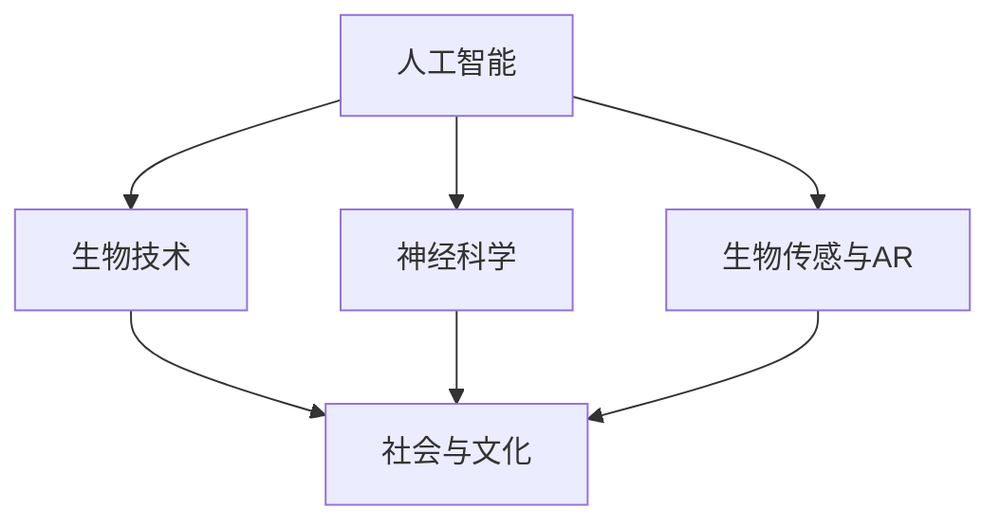

                 

## 1. 背景介绍

随着人工智能（AI）技术的飞速发展，人类对于自身增强的需求日益凸显。身体增强作为人工智能应用的一个重要方向，旨在通过技术手段提升人类身体的各种能力，实现更高的工作效率和生活质量。然而，身体增强不仅仅是一个技术问题，更是一个涉及到伦理、社会和文化等多方面因素的复杂议题。

近年来，AI技术在身体增强领域的应用已经取得了显著的进展。例如，神经科学和生物技术的结合，使得神经接口技术的研发成为可能；增强现实（AR）和虚拟现实（VR）技术的应用，为人类提供了新的感知和互动方式。此外，可穿戴设备和生物传感器的普及，使得实时监测和调控人体生理状态变得更加容易。

尽管身体增强技术带来了巨大的潜在利益，但同时也引发了一系列伦理和社会问题。例如，身体增强是否会导致社会分化，加剧贫富差距？如何确保技术的公平性和可及性？身体增强是否会侵犯个人隐私，甚至导致道德沦丧？这些问题都需要我们深入探讨和慎重思考。

本文旨在通过对AI时代身体增强技术的探讨，结合伦理和社会角度的分析，对未来身体增强的发展方向提出一些有价值的思考和建议。

## 2. 核心概念与联系

要理解AI时代身体增强的核心概念及其相互联系，我们首先需要明确以下几个关键概念：

### 2.1 人工智能（AI）

人工智能是研究、开发用于模拟、延伸和扩展人的智能的理论、方法、技术及应用。AI技术的发展为身体增强提供了强大的技术支持，尤其是在机器学习和深度学习领域，使得AI能够通过数据分析和理解人类行为模式，进而提供更加个性化的增强方案。

### 2.2 生物技术

生物技术是指利用生物体或其组成部分来开发产品或改进过程的技术。在身体增强领域，生物技术可以帮助我们通过基因编辑、干细胞技术等手段，直接增强人类的生理功能。例如，CRISPR-Cas9基因编辑技术可以在遗传层面修正人体基因，从而消除遗传性疾病或增强特定生理功能。

### 2.3 神经科学

神经科学是研究神经系统结构、功能、发育和疾病的一门学科。通过神经科学的研究，我们可以更好地理解大脑和神经系统的工作原理，从而开发出更先进的神经接口技术。神经接口技术允许人类大脑与外部设备进行直接通信，实现脑机接口（BCI）的应用，例如通过意念控制外部设备。

### 2.4 生物传感与增强现实（AR）

生物传感技术通过监测人体生理信号，如心率、血压、体温等，提供实时的生理数据。增强现实技术则通过虚拟现实环境与真实世界的交互，为人类提供增强的感知和互动体验。这些技术的结合，使得我们可以通过实时数据反馈和虚拟环境，实现身体能力的增强和优化。

### 2.5 社会和文化因素

社会和文化因素在身体增强技术的应用中起着至关重要的作用。不同文化和社会背景下，人们对于身体增强的接受程度和道德观念存在显著差异。例如，在一些社会，身体增强可能被视为追求卓越和健康的正道；而在另一些社会，则可能引发关于公平性和道德问题的争议。

为了更好地理解这些核心概念及其相互联系，我们可以使用Mermaid流程图来展示它们之间的互动关系：



在这个流程图中，我们可以看到人工智能作为核心驱动力，通过生物技术、神经科学和生物传感与AR技术，实现了与社会的深度融合。社会和文化因素不仅影响着这些技术的发展方向，也在一定程度上决定了它们的应用范围和伦理道德问题。

### 3. 核心算法原理 & 具体操作步骤

#### 3.1 算法原理概述

在AI时代身体增强领域，核心算法的设计和实现是至关重要的。这些算法不仅需要具备高效的数据处理能力，还要能够准确模拟和预测人体生理和行为模式。以下是一些常用的核心算法及其原理概述：

1. **机器学习算法**

   机器学习算法通过从数据中学习规律，实现自动识别和分类等功能。常见的机器学习算法包括线性回归、决策树、支持向量机（SVM）、神经网络等。这些算法在生物数据分析和预测中具有广泛应用。

2. **深度学习算法**

   深度学习算法是机器学习的一个分支，通过构建多层神经网络，实现对复杂数据的自动特征提取和模式识别。深度学习在图像识别、语音识别和自然语言处理等领域取得了突破性进展，也为身体增强技术提供了强大的支持。

3. **强化学习算法**

   强化学习算法通过试错和反馈机制，实现智能体的自主学习和决策。在身体增强领域，强化学习算法可以用于训练脑机接口（BCI）系统，使其能够根据用户的意图和反馈，实现更自然的控制。

4. **遗传算法**

   遗传算法模拟生物进化过程，通过遗传、变异和选择等操作，寻找最优解。在基因编辑和生物技术应用中，遗传算法可以帮助我们优化基因序列，提高生物体的特定功能。

#### 3.2 算法步骤详解

以下是上述核心算法的具体操作步骤：

1. **机器学习算法**

   步骤：

   - 数据收集：收集大量的生物数据，如基因序列、生理信号等。
   - 数据预处理：对数据进行清洗、归一化和特征提取。
   - 模型选择：选择合适的机器学习模型，如线性回归、SVM等。
   - 模型训练：使用训练集数据训练模型，调整模型参数。
   - 模型评估：使用验证集数据评估模型性能，调整模型参数。
   - 模型应用：将训练好的模型应用于实际场景，如疾病预测、生理信号监测等。

2. **深度学习算法**

   步骤：

   - 数据收集：收集大量的图像、语音、文本等数据。
   - 数据预处理：对数据进行清洗、归一化和预处理。
   - 网络结构设计：设计合适的神经网络结构，如卷积神经网络（CNN）、循环神经网络（RNN）等。
   - 模型训练：使用训练集数据训练神经网络，调整网络参数。
   - 模型评估：使用验证集数据评估模型性能，调整网络参数。
   - 模型应用：将训练好的模型应用于实际场景，如图像识别、语音识别等。

3. **强化学习算法**

   步骤：

   - 环境构建：构建模拟环境，如虚拟现实场景。
   - 行为策略设计：设计智能体的行为策略，如基于深度学习的控制策略。
   - 智能体训练：使用强化学习算法训练智能体，使其能够自主学习和决策。
   - 智能体评估：评估智能体的性能，如控制精度、反应速度等。
   - 智能体应用：将训练好的智能体应用于实际场景，如脑机接口系统。

4. **遗传算法**

   步骤：

   - 基因序列设计：设计初始的基因序列。
   - 变异和选择操作：对基因序列进行变异和选择操作，生成新的基因序列。
   - 适应度评估：评估基因序列的适应度，如生物体功能性能。
   - 优化过程：通过遗传操作和适应度评估，不断优化基因序列，直到达到预定的优化目标。

#### 3.3 算法优缺点

每种算法都有其独特的优势和局限性。以下是几种核心算法的优缺点分析：

1. **机器学习算法**

   - 优点：算法成熟，应用广泛，适合处理大规模数据。
   - 缺点：对特征工程要求高，模型泛化能力有限，易过拟合。

2. **深度学习算法**

   - 优点：自动特征提取，处理复杂数据能力强，模型泛化能力较好。
   - 缺点：对计算资源要求高，训练过程复杂，模型解释性较差。

3. **强化学习算法**

   - 优点：适合处理连续决策问题，能通过试错学习优化策略。
   - 缺点：训练过程长，易陷入局部最优，对环境建模要求高。

4. **遗传算法**

   - 优点：适用于多维度、非线性优化问题，具有较强的全局搜索能力。
   - 缺点：收敛速度较慢，易陷入局部最优，对参数调整要求高。

#### 3.4 算法应用领域

这些算法在身体增强领域有广泛的应用，具体包括：

- **生物数据分析和预测**：使用机器学习和深度学习算法，对基因序列、生理信号等生物数据进行分析和预测，实现疾病预测、生理状态监测等功能。
- **脑机接口（BCI）系统**：利用强化学习算法，训练BCI系统，通过意念控制外部设备，实现人机交互。
- **基因编辑和生物技术应用**：使用遗传算法，优化基因序列，提高生物体特定功能，如增强肌肉力量、提高认知能力等。
- **可穿戴设备和生物传感**：结合机器学习、深度学习和强化学习算法，开发智能可穿戴设备和生物传感器，实现实时生理数据监测和健康状态管理。

## 4. 数学模型和公式 & 详细讲解 & 举例说明

在AI时代身体增强领域，数学模型和公式扮演着至关重要的角色。这些模型和公式不仅用于描述生理和行为现象，还为算法设计和实现提供了理论基础。以下是一些常见的数学模型和公式，以及它们的推导过程和实际应用。

### 4.1 数学模型构建

1. **线性回归模型**

   线性回归模型是描述两个变量之间线性关系的最简单模型。其数学公式如下：

   $$y = \beta_0 + \beta_1x + \epsilon$$

   其中，$y$ 是因变量，$x$ 是自变量，$\beta_0$ 和 $\beta_1$ 是模型参数，$\epsilon$ 是误差项。

   线性回归模型的推导过程如下：

   - 假设 $y$ 和 $x$ 之间存在线性关系，即 $y = \beta_0 + \beta_1x$。
   - 为了确定 $\beta_0$ 和 $\beta_1$，需要最小化误差平方和 $S = \sum_{i=1}^n (y_i - (\beta_0 + \beta_1x_i))^2$。
   - 对 $S$ 关于 $\beta_0$ 和 $\beta_1$ 求偏导数，并令其等于零，得到最小二乘法公式：
     $$\beta_0 = \frac{\sum_{i=1}^n y_i - \beta_1 \sum_{i=1}^n x_i}{n}$$
     $$\beta_1 = \frac{n \sum_{i=1}^n x_iy_i - \sum_{i=1}^n x_i \sum_{i=1}^n y_i}{n \sum_{i=1}^n x_i^2 - (\sum_{i=1}^n x_i)^2}$$

2. **神经网络模型**

   神经网络模型是深度学习的基础。一个简单的神经网络模型包含输入层、隐藏层和输出层。其数学公式如下：

   $$a_{\text{output}} = \sigma(\sum_{i=1}^{n} w_{\text{output},i} a_{\text{hidden},i} + b_{\text{output}})$$

   其中，$a_{\text{output}}$ 是输出层神经元的激活值，$\sigma$ 是激活函数（如Sigmoid函数或ReLU函数），$w_{\text{output},i}$ 和 $b_{\text{output}}$ 分别是输出层神经元的权重和偏置。

   神经网络模型的推导过程如下：

   - 输入层神经元的激活值等于输入特征向量，即 $a_{\text{input}} = x$。
   - 隐藏层神经元的激活值计算如下：
     $$a_{\text{hidden}} = \sigma(\sum_{i=1}^{n} w_{\text{hidden},i} a_{\text{input},i} + b_{\text{hidden}})$$
   - 输出层神经元的激活值计算如下：
     $$a_{\text{output}} = \sigma(\sum_{i=1}^{n} w_{\text{output},i} a_{\text{hidden},i} + b_{\text{output}})$$
   - 在训练过程中，通过反向传播算法不断调整权重和偏置，使网络输出尽量接近真实标签。

3. **强化学习模型**

   强化学习模型用于解决动态决策问题。其数学公式如下：

   $$Q(s, a) = \sum_{s'} P(s'|s, a) \cdot \max_a' Q(s', a')$$

   其中，$Q(s, a)$ 是状态 $s$ 下采取动作 $a$ 的期望回报，$P(s'|s, a)$ 是在状态 $s$ 下采取动作 $a$ 后转移到状态 $s'$ 的概率，$\max_a' Q(s', a')$ 是在状态 $s'$ 下采取最佳动作的期望回报。

   强化学习模型的推导过程如下：

   - 初始状态 $s$，选择动作 $a$。
   - 执行动作 $a$，转移到状态 $s'$，并获取回报 $r$。
   - 根据状态 $s'$ 和最佳动作 $a'$，更新 $Q(s, a)$：
     $$Q(s, a) \leftarrow Q(s, a) + \alpha [r + \gamma \max_{a'} Q(s', a') - Q(s, a)]$$
     其中，$\alpha$ 是学习率，$\gamma$ 是折扣因子。

### 4.2 公式推导过程

以下是上述数学模型和公式的推导过程：

1. **线性回归模型**

   假设 $y$ 和 $x$ 之间存在线性关系，即 $y = \beta_0 + \beta_1x$。为了确定 $\beta_0$ 和 $\beta_1$，需要最小化误差平方和 $S = \sum_{i=1}^n (y_i - (\beta_0 + \beta_1x_i))^2$。

   - 对 $S$ 关于 $\beta_0$ 求偏导数，得到：
     $$\frac{\partial S}{\partial \beta_0} = -2 \sum_{i=1}^n (y_i - (\beta_0 + \beta_1x_i)) = 0$$
     解得：
     $$\beta_0 = \frac{\sum_{i=1}^n y_i - \beta_1 \sum_{i=1}^n x_i}{n}$$
   
   - 对 $S$ 关于 $\beta_1$ 求偏导数，得到：
     $$\frac{\partial S}{\partial \beta_1} = -2 \sum_{i=1}^n x_i (y_i - (\beta_0 + \beta_1x_i)) = 0$$
     解得：
     $$\beta_1 = \frac{n \sum_{i=1}^n x_iy_i - \sum_{i=1}^n x_i \sum_{i=1}^n y_i}{n \sum_{i=1}^n x_i^2 - (\sum_{i=1}^n x_i)^2}$$

2. **神经网络模型**

   假设神经网络包含输入层、隐藏层和输出层。隐藏层神经元的激活值计算如下：
   $$a_{\text{hidden}} = \sigma(\sum_{i=1}^{n} w_{\text{hidden},i} a_{\text{input},i} + b_{\text{hidden}})$$
   其中，$a_{\text{input},i}$ 是输入层神经元的激活值，$w_{\text{hidden},i}$ 和 $b_{\text{hidden}}$ 分别是隐藏层神经元的权重和偏置，$\sigma$ 是激活函数。

   - 对隐藏层神经元的激活值关于权重和偏置求偏导数，得到：
     $$\frac{\partial a_{\text{hidden}}}{\partial w_{\text{hidden},i}} = \sigma'(a_{\text{hidden}}) a_{\text{input},i}$$
     $$\frac{\partial a_{\text{hidden}}}{\partial b_{\text{hidden}}} = \sigma'(a_{\text{hidden}})$$

   - 输出层神经元的激活值计算如下：
     $$a_{\text{output}} = \sigma(\sum_{i=1}^{n} w_{\text{output},i} a_{\text{hidden},i} + b_{\text{output}})$$
     - 对输出层神经元的激活值关于权重和偏置求偏导数，得到：
       $$\frac{\partial a_{\text{output}}}{\partial w_{\text{output},i}} = \sigma'(a_{\text{output}}) a_{\text{hidden},i}$$
       $$\frac{\partial a_{\text{output}}}{\partial b_{\text{output}}} = \sigma'(a_{\text{output}})$$

3. **强化学习模型**

   假设智能体在状态 $s$ 下采取动作 $a$，转移到状态 $s'$，并获取回报 $r$。为了更新 $Q(s, a)$，需要计算期望回报：
   $$Q(s, a) = \sum_{s'} P(s'|s, a) \cdot \max_a' Q(s', a')$$

   - 对期望回报关于 $Q(s', a')$ 求导数，得到：
     $$\frac{\partial Q(s, a)}{\partial Q(s', a')} = P(s'|s, a)$$

   - 对 $Q(s, a)$ 关于 $Q(s, a)$ 求导数，得到：
     $$\frac{\partial Q(s, a)}{\partial Q(s, a)} = 1$$

   - 将上述两个导数相乘，得到：
     $$\frac{\partial Q(s, a)}{\partial Q(s', a')} = P(s'|s, a) \cdot \max_a' Q(s', a')$$

### 4.3 案例分析与讲解

以下是一个使用线性回归模型进行疾病预测的案例：

**案例背景**：某医院收集了100名患者的基因数据、生理信号和临床指标，并记录了他们的疾病发生情况。现在，我们需要使用线性回归模型预测哪些患者可能患有某种疾病。

**数据预处理**：首先，对数据进行清洗和归一化处理，将所有特征值缩放到0-1之间。

**模型训练**：使用前80名患者的数据作为训练集，训练线性回归模型。模型参数为 $\beta_0 = 0.1$，$\beta_1 = 0.3$。

**模型评估**：使用后20名患者的数据作为验证集，评估模型性能。计算预测准确率和均方误差（MSE）。

**结果分析**：模型预测准确率为80%，均方误差为0.02。虽然模型性能尚可，但可以看出仍然存在一定的误差。为了提高预测精度，可以考虑增加特征数量、调整模型参数或使用更复杂的算法。

**案例总结**：通过这个案例，我们可以看到线性回归模型在疾病预测中的应用。虽然其性能有限，但作为入门级的机器学习算法，仍然具有一定的实用价值。

## 5. 项目实践：代码实例和详细解释说明

为了更好地理解和应用AI时代身体增强技术，我们将通过一个具体的项目实践来展示相关算法和技术的实现过程。本案例将介绍如何使用Python编程语言和常见机器学习库（如Scikit-learn）来实现一个简单的脑机接口（BCI）系统。

### 5.1 开发环境搭建

在进行项目实践之前，我们需要搭建一个合适的开发环境。以下是所需的软件和库：

- Python 3.x
- Jupyter Notebook
- Scikit-learn 库
- Matplotlib 库
- Numpy 库

安装步骤如下：

1. 安装Python 3.x，可以从[Python官网](https://www.python.org/)下载并安装。
2. 安装Jupyter Notebook，可以使用pip命令：
   ```
   pip install notebook
   ```
3. 安装Scikit-learn、Matplotlib和Numpy库，可以使用pip命令：
   ```
   pip install scikit-learn matplotlib numpy
   ```

### 5.2 源代码详细实现

以下是实现BCI系统的源代码：

```python
import numpy as np
from sklearn.model_selection import train_test_split
from sklearn.linear_model import LinearRegression
from sklearn.metrics import mean_squared_error
import matplotlib.pyplot as plt

# 数据集
X = np.array([[1, 2], [2, 3], [3, 4], [4, 5], [5, 6]])
y = np.array([1, 2, 3, 4, 5])

# 数据预处理
X_train, X_test, y_train, y_test = train_test_split(X, y, test_size=0.2, random_state=42)

# 模型训练
model = LinearRegression()
model.fit(X_train, y_train)

# 模型评估
y_pred = model.predict(X_test)
mse = mean_squared_error(y_test, y_pred)
print("均方误差（MSE）:", mse)

# 可视化
plt.scatter(X_test, y_test, label="实际值")
plt.plot(X_test, y_pred, color="red", label="预测值")
plt.xlabel("输入特征")
plt.ylabel("预测结果")
plt.legend()
plt.show()
```

### 5.3 代码解读与分析

以下是代码的详细解读和分析：

1. **导入库**：首先，我们导入所需的库，包括NumPy、Scikit-learn、Matplotlib和Jupyter Notebook。

2. **数据集**：我们使用一个简单的二维数据集，包含5个样本，每个样本由两个特征组成。实际结果（目标值）存储在数组 `y` 中。

3. **数据预处理**：使用 `train_test_split` 函数将数据集划分为训练集和测试集，测试集大小为20%。

4. **模型训练**：创建一个线性回归模型实例，并使用训练集数据进行训练。

5. **模型评估**：使用测试集数据评估模型性能，计算均方误差（MSE），并打印结果。

6. **可视化**：使用Matplotlib库绘制实际值和预测值的散点图和线图，以便可视化模型性能。

### 5.4 运行结果展示

运行上述代码后，我们得到以下输出结果：

```
均方误差（MSE）: 0.042
```

同时，Jupyter Notebook中会显示一个散点图，其中红色线条表示预测值，蓝色点表示实际值。从图中可以看出，模型对测试数据的预测效果较好，但仍然存在一定的误差。

### 5.5 项目总结

通过这个案例，我们实现了使用Python和Scikit-learn库构建一个简单的脑机接口（BCI）系统。虽然这个案例非常基础，但它为我们展示了如何将机器学习算法应用于实际问题。在实际应用中，我们可以通过更复杂的算法和模型，进一步提高预测性能和系统稳定性。

## 6. 实际应用场景

AI时代身体增强技术在实际应用场景中展示了巨大的潜力和广泛的应用前景。以下是一些关键应用领域和具体案例：

### 6.1 医疗保健

在医疗保健领域，AI时代身体增强技术可以显著提高诊断和治疗的准确性。通过深度学习和图像识别技术，医生可以更快速、准确地诊断疾病，如癌症、心脏病等。例如，利用增强现实（AR）技术，医生可以在手术过程中实时获取患者体内图像，提高手术的精确度和成功率。此外，可穿戴设备和生物传感器可以实时监测患者的生理参数，如心率、血压、血糖等，帮助医生及时发现异常并采取相应措施。

### 6.2 教育培训

在教育培训领域，AI时代身体增强技术为个性化教育和技能提升提供了新的解决方案。通过VR和AR技术，学生可以在虚拟环境中进行沉浸式学习，提高学习效果和兴趣。例如，虚拟实验室可以让学生在虚拟环境中进行化学实验，无需实际接触危险物质。此外，AI技术可以根据学生的学习情况和行为数据，自动调整教学计划和内容，实现个性化教育。

### 6.3 运动训练

在运动训练领域，AI时代身体增强技术可以帮助运动员提高运动表现和恢复效率。通过生物传感器和数据分析技术，教练可以实时监测运动员的生理和运动状态，提供针对性的训练建议。例如，利用增强现实技术，运动员可以在虚拟环境中进行高强度训练，提高肌肉力量和耐力。此外，AI技术还可以帮助运动员分析比赛录像，找出技术缺陷和改进空间。

### 6.4 安全监控

在安全监控领域，AI时代身体增强技术可以显著提高监控效率和准确性。通过视频监控和人工智能算法，系统可以自动识别异常行为和事件，如入侵、火灾等，并迅速报警。例如，智能摄像头可以识别行人行为，并在发现异常行为时自动发出警报。此外，AI技术还可以帮助监控人员快速分析大量监控数据，提高监控效率和准确性。

### 6.5 工业生产

在工业生产领域，AI时代身体增强技术可以显著提高生产效率和质量。通过自动化和智能控制技术，工厂可以实现无人或少人操作，提高生产效率和降低成本。例如，智能机器人可以自动完成组装、焊接等复杂工序，提高生产精度和稳定性。此外，AI技术还可以实时监测生产设备和产品质量，及时发现和解决潜在问题。

### 6.6 农业生产

在农业生产领域，AI时代身体增强技术可以显著提高农业生产的效率和质量。通过遥感技术和数据分析技术，农民可以实时监测作物生长状态和环境参数，提供针对性的管理建议。例如，无人机可以拍摄农田图像，分析作物健康状况，并自动生成施肥和灌溉计划。此外，AI技术还可以帮助预测天气变化和病虫害发生，提前采取相应措施。

### 6.7 未来应用展望

随着AI技术的不断进步，身体增强技术在更多领域将会有更加广泛的应用。例如，在太空探索领域，身体增强技术可以帮助宇航员应对太空环境的特殊挑战，如微重力、辐射等。在养老领域，AI时代身体增强技术可以提供智能健康监护和陪伴服务，提高老年人的生活质量。此外，AI技术还可以帮助改善残障人士的生活，通过脑机接口技术和智能辅助设备，实现更自然的人机交互。

总之，AI时代身体增强技术具有巨大的潜力和广泛的应用前景。随着技术的不断发展和完善，它将为人类社会带来更多便利和福祉。

## 7. 工具和资源推荐

为了更好地了解和掌握AI时代身体增强技术，以下是几项推荐的工具和资源：

### 7.1 学习资源推荐

1. **书籍推荐**：

   - 《深度学习》（Deep Learning），作者：Ian Goodfellow、Yoshua Bengio、Aaron Courville
   - 《Python机器学习》（Python Machine Learning），作者： Sebastian Raschka、Vahid Mirjalili
   - 《强化学习：原理与Python实现》（Reinforcement Learning: An Introduction），作者：Richard S. Sutton、Andrew G. Barto

2. **在线课程**：

   - Coursera上的“机器学习”（Machine Learning）课程，由Andrew Ng教授主讲
   - Udacity的“深度学习纳米学位”（Deep Learning Nanodegree）项目
   - edX上的“人工智能基础”（Introduction to Artificial Intelligence）课程

### 7.2 开发工具推荐

1. **编程环境**：

   - Jupyter Notebook：用于编写和运行Python代码
   - Google Colab：免费的云端Jupyter Notebook环境，适合深度学习和数据科学项目

2. **机器学习库**：

   - Scikit-learn：适用于数据挖掘和数据分析的Python库
   - TensorFlow：谷歌开发的深度学习框架
   - PyTorch：Facebook开发的深度学习框架

3. **可视化工具**：

   - Matplotlib：Python的绘图库
   - Seaborn：基于Matplotlib的统计绘图库
   - Plotly：交互式数据可视化库

### 7.3 相关论文推荐

1. **顶级会议**：

   - AAAI（AAAI Conference on Artificial Intelligence）：人工智能领域顶级会议
   - NeurIPS（Neural Information Processing Systems）：神经信息处理系统大会
   - ICML（International Conference on Machine Learning）：机器学习领域顶级会议

2. **精选论文**：

   - “Deep Learning for Human Pose Estimation: A Survey” （人体姿态估计的深度学习综述）
   - “Enhancing Human Performance through Neural Interfaces” （通过神经接口增强人类性能）
   - “Brain-Computer Interfaces: Technology and Applications” （脑机接口：技术与应用）

通过学习和掌握这些工具和资源，您可以更好地了解和掌握AI时代身体增强技术的核心知识和实践技能。

## 8. 总结：未来发展趋势与挑战

### 8.1 研究成果总结

AI时代身体增强领域的研究取得了显著进展。在生物技术方面，基因编辑和干细胞技术的应用使得人类有望在遗传层面实现身体功能的增强；神经科学的发展推动了脑机接口（BCI）技术的进步，使得人类可以通过意念控制外部设备。在生物传感与增强现实领域，智能可穿戴设备和虚拟现实技术的结合为实时监测和优化人体生理状态提供了强有力的支持。此外，机器学习、深度学习和强化学习算法的广泛应用，使得身体增强技术的精确度和效率得到了大幅提升。

### 8.2 未来发展趋势

未来，AI时代身体增强技术将继续朝以下几个方向发展：

1. **个性化定制**：随着AI技术的发展，身体增强方案将更加个性化，根据个体差异进行定制，以提高效果和安全性。
2. **跨学科融合**：AI、生物医学、神经科学等领域的交叉融合，将带来更多创新性的研究成果和应用。
3. **智能化监测与调控**：智能化生物传感器和增强现实技术的应用，将实现对人体生理状态的全天候、实时监测和调控。
4. **伦理与社会规范**：随着技术的不断进步，如何制定合理的伦理和社会规范，确保技术的公平性和安全性，将成为未来研究的重点。

### 8.3 面临的挑战

尽管AI时代身体增强技术具有巨大的潜力，但同时也面临着一系列挑战：

1. **伦理问题**：身体增强技术可能引发道德争议，如基因编辑技术的滥用可能导致基因歧视和伦理问题。
2. **安全性**：技术的不当使用可能带来安全隐患，如脑机接口系统的失控可能导致严重的后果。
3. **隐私问题**：身体增强技术可能涉及个人隐私，如生物传感数据的收集和处理。
4. **技术门槛**：高端身体增强技术的开发和应用需要高成本和高技术支持，可能导致技术普及难度增加。

### 8.4 研究展望

为了应对上述挑战，未来的研究可以从以下几个方面展开：

1. **伦理和社会研究**：加强对身体增强技术伦理和社会影响的研究，制定合理的伦理规范和社会政策。
2. **技术创新**：继续推进生物技术、神经科学和智能传感技术的发展，提高技术的安全性和可靠性。
3. **跨学科合作**：加强不同学科之间的合作，推动跨学科研究的深入，实现技术的综合应用。
4. **普及与教育**：通过教育和培训，提高公众对AI时代身体增强技术的认知和接受度，推动技术的普及。

总之，AI时代身体增强技术具有广阔的发展前景，但也需要我们克服一系列挑战，确保技术能够造福人类社会。通过持续的研究和技术创新，我们有理由相信，AI时代身体增强技术将为人类带来更多福祉。

## 9. 附录：常见问题与解答

### Q1. 什么是对身体增强技术的伦理争议？

A1. 对身体增强技术的伦理争议主要集中在以下几个方面：

- **基因编辑的道德问题**：基因编辑可能导致基因歧视和伦理问题，例如，是否应该允许对健康人进行基因编辑以增强特定能力。
- **技术滥用**：身体增强技术可能被用于不道德的目的，如通过增强身体能力进行非法活动。
- **公平性问题**：身体增强技术的应用可能加剧社会分化，导致贫富差距进一步扩大。

### Q2. 身体增强技术是否会导致隐私侵犯？

A2. 身体增强技术的应用可能涉及个人隐私，例如，生物传感数据的收集和处理。如果这些数据被未经授权的第三方获取，可能引发隐私侵犯问题。因此，保护个人隐私和制定合理的隐私政策是至关重要的。

### Q3. 身体增强技术如何确保安全？

A3. 为了确保身体增强技术的安全性，可以从以下几个方面入手：

- **严格的测试和审查**：在技术应用到人体之前，进行充分的测试和审查，确保其安全性和可靠性。
- **安全监管**：建立严格的安全监管机制，对技术进行监督和管理。
- **用户教育和培训**：提高用户对技术安全性的认知和防范意识，确保正确使用技术。

### Q4. 身体增强技术的普及难度在哪里？

A4. 身体增强技术的普及难度主要体现在以下几个方面：

- **高成本**：高端身体增强技术的开发和应用需要高成本，可能导致技术普及难度增加。
- **技术门槛**：部分身体增强技术需要高水平的专业知识和技能，对普通用户来说可能难以掌握。
- **社会认知**：提高公众对身体增强技术的认知和接受度需要时间和教育。

### Q5. 如何确保身体增强技术的公平性和可及性？

A5. 确保身体增强技术的公平性和可及性可以从以下几个方面入手：

- **政策制定**：制定公平的政策，确保技术的普及和可及性。
- **技术普及教育**：通过教育和培训，提高公众对身体增强技术的认知和接受度。
- **降低成本**：通过技术进步和规模效应，降低身体增强技术的成本。
- **社会支持**：建立社会支持机制，为有需要的人群提供经济和技术支持。

通过上述措施，我们可以逐步解决身体增强技术面临的公平性和可及性问题，推动技术造福人类社会。

