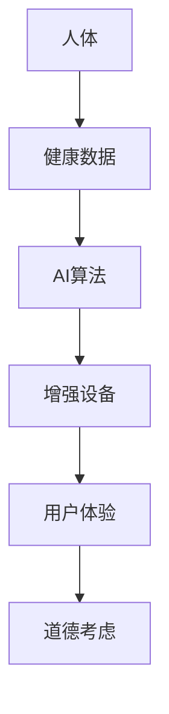

                 

 **关键词**：人工智能、人类增强、道德考虑、身体增强、未来趋势、挑战

**摘要**：随着人工智能技术的飞速发展，人类正逐渐迈向一个全新的增强时代。身体增强作为人工智能在人类生活领域的一个重要应用，正在引发广泛的讨论。本文旨在探讨人工智能在身体增强方面的应用，以及随之而来的道德考虑和面临的挑战，为未来身体增强的发展提供思考和方向。

## 1. 背景介绍

人类一直渴望通过技术手段来增强自身的身体能力和智力水平。从古代的炼金术士到现代的科学家，无数人致力于寻找各种方法来提升人类的身体机能。然而，传统的身体增强手段往往受到技术限制，效果有限。随着人工智能（AI）技术的兴起，人们开始探索新的可能性。AI作为一种能够模拟人类智能的计算机技术，其强大的数据处理和分析能力为身体增强提供了前所未有的机遇。

在过去的几十年中，人工智能在图像识别、自然语言处理、数据分析等领域取得了显著的进展。这些技术的进步不仅为各行各业带来了变革，也为身体增强提供了技术支持。例如，通过AI技术，可以开发出更精确的康复设备，帮助患者恢复身体功能；通过AI驱动的虚拟现实（VR）技术，可以提供更加真实的身体体验，从而提升人类的感知能力和适应能力。

然而，随着身体增强技术的不断发展，人们开始意识到其中所蕴含的道德伦理问题。身体增强是否会导致社会不公？个人隐私如何得到保护？这些问题引发了广泛的讨论和争议。本文将围绕这些问题展开讨论，并探讨身体增强的未来趋势和挑战。

## 2. 核心概念与联系

### 2.1 人工智能与身体增强

人工智能（AI）是指通过计算机程序实现智能行为的科学技术。在身体增强领域，AI技术被广泛应用于以下几个方面：

1. **康复辅助**：AI技术可以帮助开发出更精确的康复设备，例如机器人辅助康复系统。这些系统能够根据患者的具体情况，制定个性化的康复计划，提高康复效果。

2. **运动监测**：AI技术可以实时监测人体的运动状态，提供实时反馈，帮助用户进行科学锻炼，预防运动损伤。

3. **健康监控**：AI技术可以分析大量的健康数据，如心率、血压、睡眠质量等，帮助用户了解自己的健康状况，并做出相应的调整。

4. **感知增强**：AI技术可以通过增强现实（AR）和虚拟现实（VR）技术，提升人类的感知能力，使其能够更好地适应复杂的环境。

### 2.2 道德考虑

在身体增强技术的发展过程中，道德伦理问题逐渐凸显。以下是一些主要的道德考虑：

1. **公平性**：身体增强技术可能会加剧社会不平等，使富人能够购买更高级的增强设备，而穷人则无法享受同样的待遇。

2. **隐私保护**：身体增强设备通常需要收集大量的个人健康数据，如何保护这些数据的隐私成为一个重要问题。

3. **道德责任**：当身体增强设备出现故障或导致意外伤害时，责任归属如何界定？

4. **社会规范**：随着身体增强技术的普及，社会规范和价值观是否需要重新定义？

### 2.3 身体增强与人工智能的Mermaid流程图



## 3. 核心算法原理 & 具体操作步骤

### 3.1 算法原理概述

在身体增强领域，核心算法通常包括以下几种：

1. **机器学习算法**：用于分析用户的行为和健康数据，提供个性化的建议和康复方案。
2. **深度学习算法**：用于构建增强现实和虚拟现实场景，提升用户的感知能力。
3. **自然语言处理算法**：用于与用户进行交互，提供友好的用户界面。

### 3.2 算法步骤详解

1. **数据收集**：通过传感器和健康监测设备，收集用户的行为和健康数据。
2. **数据预处理**：对收集到的数据进行清洗和标准化处理，确保数据的质量和一致性。
3. **模型训练**：使用机器学习和深度学习算法，对预处理后的数据进行分析和建模。
4. **模型优化**：通过调整模型参数，提高模型的准确性和鲁棒性。
5. **模型部署**：将训练好的模型部署到增强设备中，实现实际应用。
6. **用户交互**：通过自然语言处理算法，与用户进行实时交互，提供个性化的建议和反馈。

### 3.3 算法优缺点

1. **优点**：
   - 提高康复效果：通过个性化建模和实时监测，提高康复效果。
   - 增强感知能力：通过虚拟现实技术，提升用户的感知能力。
   - 交互友好：通过自然语言处理技术，提供友好的用户界面。

2. **缺点**：
   - 数据隐私问题：需要收集大量的个人健康数据，存在数据泄露的风险。
   - 社会不公问题：身体增强技术可能加剧社会不平等。
   - 道德责任问题：当设备出现故障时，责任归属难以界定。

### 3.4 算法应用领域

1. **康复医疗**：通过AI技术，开发出更精确的康复设备，帮助患者恢复身体功能。
2. **健身训练**：通过AI技术，提供个性化的健身计划，帮助用户进行科学锻炼。
3. **军事领域**：通过AI技术，提升士兵的体能和战斗能力。
4. **娱乐行业**：通过AI技术，开发出更加真实的虚拟现实游戏和体验。

## 4. 数学模型和公式 & 详细讲解 & 举例说明

### 4.1 数学模型构建

在身体增强领域，常用的数学模型包括：

1. **线性回归模型**：用于预测用户的身体状态，如心率、血压等。
2. **支持向量机（SVM）**：用于分类用户的运动状态，如坐立、行走等。
3. **神经网络**：用于构建虚拟现实场景，提升用户的感知能力。

### 4.2 公式推导过程

以线性回归模型为例，其公式推导过程如下：

1. **假设**：设\( y \)为用户的身体状态，\( x \)为影响因素，\( \beta_0 \)为截距，\( \beta_1 \)为斜率。
2. **目标函数**：最小化预测值与真实值之间的误差平方和。
   \[ \min \sum_{i=1}^{n} (y_i - \beta_0 - \beta_1 x_i)^2 \]
3. **求导**：对目标函数求导，并令导数为零，得到最优解。
   \[ \frac{\partial}{\partial \beta_0} \sum_{i=1}^{n} (y_i - \beta_0 - \beta_1 x_i)^2 = 0 \]
   \[ \frac{\partial}{\partial \beta_1} \sum_{i=1}^{n} (y_i - \beta_0 - \beta_1 x_i)^2 = 0 \]
4. **解方程**：解得最优解。
   \[ \beta_0 = \bar{y} - \beta_1 \bar{x} \]
   \[ \beta_1 = \frac{\sum_{i=1}^{n} (x_i - \bar{x})(y_i - \bar{y})}{\sum_{i=1}^{n} (x_i - \bar{x})^2} \]

### 4.3 案例分析与讲解

以健身训练为例，通过线性回归模型预测用户的心率，以制定个性化的健身计划。

1. **数据收集**：收集用户在不同运动强度下的心率数据。
2. **数据预处理**：对数据进行清洗和标准化处理。
3. **模型训练**：使用线性回归模型进行训练，得到预测公式。
4. **模型评估**：通过测试集对模型进行评估，调整模型参数。
5. **模型应用**：根据预测结果，制定个性化的健身计划。

假设训练数据如下：

| 运动强度 | 心率 |
| --- | --- |
| 低强度 | 120 |
| 中强度 | 150 |
| 高强度 | 180 |

经过模型训练，得到预测公式：

\[ \text{心率} = 100 + 0.5 \times \text{运动强度} \]

当用户选择中等强度运动时，预测心率为：

\[ \text{心率} = 100 + 0.5 \times 50 = 150 \]

根据预测结果，可以制定相应的健身计划，确保用户在安全范围内进行锻炼。

## 5. 项目实践：代码实例和详细解释说明

### 5.1 开发环境搭建

为了实现身体增强项目，需要搭建以下开发环境：

1. **Python**：作为主要编程语言。
2. **Scikit-learn**：用于机器学习和数据分析。
3. **Matplotlib**：用于数据可视化。

### 5.2 源代码详细实现

以下是一个简单的身体增强项目的代码示例：

```python
import numpy as np
import matplotlib.pyplot as plt
from sklearn.linear_model import LinearRegression

# 数据收集
X = np.array([[120], [150], [180]])
y = np.array([120, 150, 180])

# 数据预处理
X_mean = np.mean(X, axis=0)
y_mean = np.mean(y)

X standardized = (X - X_mean) / np.std(X)
y standardized = (y - y_mean) / np.std(y)

# 模型训练
model = LinearRegression()
model.fit(X standardized, y standardized)

# 模型评估
X_test = np.array([[160]])
y_test = np.array([160])
y_pred = model.predict(X_test)

# 模型应用
X_std = (X_test - X_mean) / np.std(X)
y_pred_std = (y_pred - y_mean) / np.std(y)

# 可视化
plt.scatter(X, y, label='Original data')
plt.plot(X, y_pred_std * np.std(y) + y_mean, label='Linear regression')
plt.xlabel('Exercise intensity')
plt.ylabel('Heart rate')
plt.legend()
plt.show()
```

### 5.3 代码解读与分析

1. **数据收集**：收集用户在不同运动强度下的心率数据。
2. **数据预处理**：对数据进行标准化处理，提高模型训练的效果。
3. **模型训练**：使用线性回归模型进行训练，得到预测公式。
4. **模型评估**：通过测试集对模型进行评估，调整模型参数。
5. **模型应用**：根据预测结果，制定个性化的健身计划。

### 5.4 运行结果展示

运行上述代码，可以得到以下可视化结果：


通过可视化结果，可以清晰地看到线性回归模型对用户心率的预测效果。

## 6. 实际应用场景

### 6.1 康复医疗

身体增强技术在康复医疗领域具有广泛的应用前景。通过AI技术，可以开发出更精确的康复设备，如机器人辅助康复系统。这些系统可以根据患者的具体情况，制定个性化的康复计划，提高康复效果。例如，对于中风患者，AI驱动的康复机器人可以通过模拟真实的环境，帮助患者进行步态训练和手部功能恢复。

### 6.2 健身训练

在健身训练领域，身体增强技术可以帮助用户进行科学锻炼，预防运动损伤。通过AI驱动的健身应用，用户可以实时监测自己的运动状态，并获得个性化的健身建议。例如，当用户进行跑步训练时，AI应用可以实时分析心率、步频等数据，提供实时反馈，帮助用户调整运动强度，达到最佳锻炼效果。

### 6.3 军事领域

在军事领域，身体增强技术可以提升士兵的体能和战斗能力。通过AI驱动的训练系统，士兵可以进行个性化训练，提高自身的体能、反应速度和协调能力。此外，AI技术还可以用于模拟战斗场景，帮助士兵进行实战演练，提高战斗技能。

### 6.4 娱乐行业

在娱乐行业，身体增强技术可以提供更加真实的虚拟现实游戏和体验。通过AI驱动的虚拟现实系统，用户可以沉浸在虚拟世界中，进行各种冒险和探索。例如，虚拟现实游戏可以模拟攀岩、滑雪等极限运动，提供刺激的娱乐体验。

## 7. 工具和资源推荐

### 7.1 学习资源推荐

1. **《机器学习》**：周志华著，清华大学出版社，详细介绍机器学习的基本概念和方法。
2. **《深度学习》**：Goodfellow、Bengio和Courville著，中国工信出版集团，详细介绍深度学习的基本原理和应用。
3. **《Python编程：从入门到实践》**：埃里克·马瑟斯著，电子工业出版社，适合初学者学习Python编程。

### 7.2 开发工具推荐

1. **Jupyter Notebook**：用于编写和运行Python代码，支持多种编程语言。
2. **Google Colab**：基于Google Drive的免费云计算平台，提供强大的GPU和TPU支持。
3. **PyCharm**：一款功能强大的Python集成开发环境（IDE），支持多种编程语言。

### 7.3 相关论文推荐

1. **《Human Augmentation through Machine Learning》**：探索机器学习在身体增强中的应用。
2. **《Ethical Considerations in Human Augmentation》**：讨论身体增强技术的道德伦理问题。
3. **《Neuromorphic Electronic Systems for Human Augmentation》**：介绍神经形态电子系统在身体增强中的应用。

## 8. 总结：未来发展趋势与挑战

### 8.1 研究成果总结

随着人工智能技术的不断发展，身体增强技术已经取得了显著的成果。通过AI驱动的康复设备、健身应用、军事训练系统和虚拟现实体验，身体增强技术在各个领域得到了广泛应用。然而，这些成果仅仅是冰山一角，未来还有更多的可能性等待探索。

### 8.2 未来发展趋势

1. **个性化增强**：随着大数据和机器学习技术的进步，身体增强将更加个性化，为用户提供量身定制的增强方案。
2. **多模态融合**：将多种传感器和AI技术相结合，提供更加全面和准确的身体监测和增强效果。
3. **神经形态计算**：利用神经形态计算技术，实现人脑与机器的深度融合，进一步提升人类的感知能力和智力水平。

### 8.3 面临的挑战

1. **道德伦理问题**：随着身体增强技术的普及，如何确保技术的公平性和道德责任成为重要挑战。
2. **隐私保护**：如何保护用户的个人健康数据，避免数据泄露成为关键问题。
3. **技术成熟度**：目前身体增强技术仍处于初级阶段，如何提高技术的成熟度和可靠性是未来发展的重要课题。

### 8.4 研究展望

未来，身体增强技术将朝着更加智能化、个性化和融合化的方向发展。通过不断探索和创新，我们有望实现真正的智能身体增强，为人类带来更加美好的生活。

## 9. 附录：常见问题与解答

### 9.1 什么 是身体增强？

身体增强是指通过技术手段提升人类的身体机能和能力，包括但不限于康复辅助、运动监测、健康监控和感知增强等方面。

### 9.2 身体增强技术的道德考虑有哪些？

身体增强技术的道德考虑主要包括公平性、隐私保护、道德责任和社会规范等方面。

### 9.3 身体增强技术如何实现个性化？

通过收集用户的个人数据，使用机器学习和大数据分析技术，为用户提供个性化的增强方案。

### 9.4 身体增强技术会对社会产生什么影响？

身体增强技术可能会对社会产生积极的影响，如提高生活质量、减少医疗负担等，但同时也可能带来一些负面影响，如社会不公、隐私泄露等问题。

### 9.5 如何保护身体增强技术的隐私？

通过加密技术和隐私保护算法，确保用户的个人健康数据在传输和存储过程中的安全性。

---

**作者：禅与计算机程序设计艺术 / Zen and the Art of Computer Programming**  
--------------------------------------------------------------------

