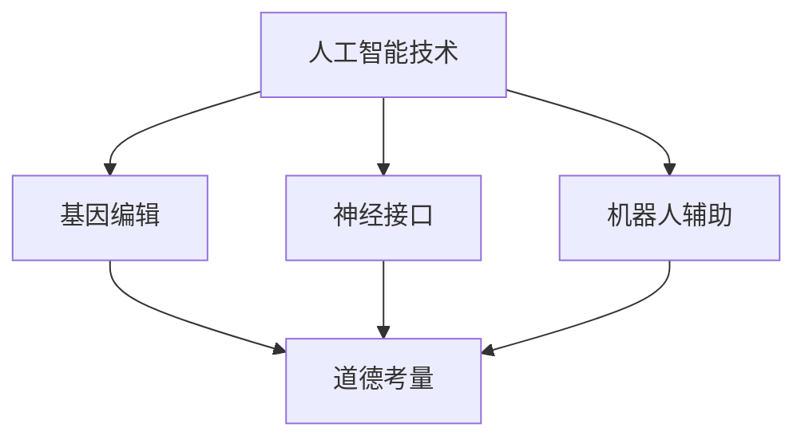

                 

关键词：人工智能，人类增强，道德考虑，身体增强技术，未来

> 摘要：本文探讨了人工智能时代人类增强技术的道德考量以及身体增强技术的未来发展。通过分析当前的人工智能技术水平和身体增强技术的发展趋势，探讨了这些技术对人类社会的影响，并提出了未来发展的潜在挑战和解决方案。

## 1. 背景介绍

随着人工智能技术的飞速发展，人类开始有能力通过技术手段增强自身的能力。这些增强技术不仅包括传统的体育锻炼、营养补充等，还包括近年来备受关注的基因编辑、神经接口和机器人辅助等前沿技术。人类增强技术的出现为人类带来了前所未有的可能性，同时也引发了一系列道德和社会问题。

道德考量是任何科技进步过程中必须面对的重要议题。在人类增强技术的背景下，我们需要思考如何确保技术的应用符合道德规范，不会对人类社会造成不可逆转的负面影响。同时，我们还需要关注身体增强技术的未来发展，探讨其可能带来的社会变革和技术挑战。

## 2. 核心概念与联系

### 2.1. 人工智能技术

人工智能（AI）是一种模拟人类智能的技术，其核心目标是让计算机具有感知、学习、推理和决策的能力。目前，人工智能技术已经取得了显著的进展，包括机器学习、深度学习、自然语言处理等。这些技术的应用不仅改变了传统的计算机科学领域，还对人类社会产生了深远的影响。

### 2.2. 身体增强技术

身体增强技术是指通过技术手段提升人类生理和心理能力的方法。这些技术可以分为以下几个类别：

1. **基因编辑**：通过修改人类基因序列，改变人类的遗传特性，实现长期的身体增强。
2. **神经接口**：将计算机与人类大脑连接，提升大脑的信息处理能力和记忆力。
3. **机器人辅助**：利用机器人技术辅助人类完成日常活动和特殊任务，如外骨骼和假肢等。

### 2.3. 道德考量

道德考量是指在科技进步和应用过程中，对可能产生的影响进行评估和规范。在人类增强技术的背景下，道德考量主要包括以下几个方面：

1. **公平性**：如何确保所有人都能平等地享受人类增强技术带来的好处？
2. **隐私**：人类增强技术可能涉及个人隐私问题，如何保护用户的隐私权？
3. **伦理**：如何确保人类增强技术的应用不违反人类的基本伦理原则？

下面是一个关于人类增强技术的 Mermaid 流程图，展示了各个核心概念之间的联系：



## 3. 核心算法原理 & 具体操作步骤

### 3.1 算法原理概述

在人类增强技术的背景下，核心算法主要涉及以下几个方面：

1. **机器学习算法**：用于分析和处理人类生物数据，如基因序列、脑电图等，以实现个性化的人类增强。
2. **深度学习算法**：用于模拟人类大脑的信息处理过程，提升大脑的计算能力和记忆力。
3. **基因编辑算法**：用于设计和实现基因编辑方案，确保编辑过程的安全性和有效性。

### 3.2 算法步骤详解

1. **数据收集与预处理**：收集与人类增强相关的生物数据，如基因序列、脑电图等，并进行数据预处理。
2. **特征提取**：从预处理后的数据中提取与增强目标相关的特征。
3. **模型训练与优化**：使用机器学习算法训练模型，并通过优化过程提升模型的性能。
4. **应用与评估**：将训练好的模型应用于实际场景，对增强效果进行评估和调整。

### 3.3 算法优缺点

**优点**：

1. **个性化**：通过机器学习和深度学习算法，可以实现个性化的人类增强，满足个体需求。
2. **高效性**：利用先进的计算技术，可以快速处理大量生物数据，提升人类增强的效率。

**缺点**：

1. **技术风险**：基因编辑等技术的应用可能带来不可预测的风险，如基因突变等。
2. **伦理争议**：人类增强技术的应用可能引发伦理争议，如基因编辑是否违反自然规律等。

### 3.4 算法应用领域

1. **医学**：利用人类增强技术改善疾病治疗和康复过程。
2. **军事**：利用人类增强技术提升士兵的战斗能力。
3. **娱乐**：利用人类增强技术创造新的娱乐体验，如虚拟现实等。

## 4. 数学模型和公式 & 详细讲解 & 举例说明

### 4.1 数学模型构建

在人类增强技术中，常用的数学模型包括机器学习模型、深度学习模型和基因编辑模型。以下是一个简单的机器学习模型的构建过程：

1. **数据收集与预处理**：收集与人类增强相关的生物数据，如基因序列、脑电图等，并进行数据预处理。
2. **特征提取**：从预处理后的数据中提取与增强目标相关的特征。
3. **模型选择**：选择适合的机器学习算法，如决策树、支持向量机等。
4. **模型训练与优化**：使用训练数据训练模型，并通过优化过程提升模型的性能。
5. **模型评估与部署**：对训练好的模型进行评估，并根据评估结果调整模型参数。

### 4.2 公式推导过程

以线性回归模型为例，其基本公式为：

$$
Y = \beta_0 + \beta_1X
$$

其中，$Y$为因变量，$X$为自变量，$\beta_0$和$\beta_1$为模型的参数。

通过最小二乘法，可以得到参数的最优估计值：

$$
\hat{\beta_0} = \bar{Y} - \hat{\beta_1}\bar{X}
$$

$$
\hat{\beta_1} = \frac{\sum_{i=1}^{n}(X_i - \bar{X})(Y_i - \bar{Y})}{\sum_{i=1}^{n}(X_i - \bar{X})^2}
$$

其中，$n$为样本数量。

### 4.3 案例分析与讲解

假设我们收集了一组关于基因编辑的数据，包括基因序列和对应的生物特征。我们需要通过线性回归模型预测生物特征。

1. **数据收集与预处理**：收集基因序列和生物特征数据，并进行预处理，如归一化处理等。
2. **特征提取**：从预处理后的数据中提取基因序列的特征，如序列长度、碱基组成等。
3. **模型选择**：选择线性回归模型作为预测模型。
4. **模型训练与优化**：使用训练数据训练模型，并通过交叉验证优化模型参数。
5. **模型评估与部署**：对训练好的模型进行评估，并根据评估结果调整模型参数。

假设我们使用训练数据集进行训练，得到最优参数$\hat{\beta_0}$和$\hat{\beta_1}$。通过测试数据集进行预测，可以得到预测结果。

## 5. 项目实践：代码实例和详细解释说明

### 5.1 开发环境搭建

为了实践人类增强技术的应用，我们需要搭建一个基本的开发环境。以下是具体的步骤：

1. **安装Python环境**：Python是一种常用的编程语言，可以用于实现机器学习模型等。
2. **安装NumPy和Pandas库**：NumPy和Pandas是Python中常用的数据处理库。
3. **安装Scikit-learn库**：Scikit-learn是一个用于机器学习的Python库。

### 5.2 源代码详细实现

以下是一个简单的线性回归模型实现的代码示例：

```python
import numpy as np
import pandas as pd
from sklearn.linear_model import LinearRegression

# 1. 数据收集与预处理
data = pd.read_csv("data.csv")
X = data["gene_sequence"].values.reshape(-1, 1)
y = data["biological_feature"].values

# 2. 特征提取
# （此处省略具体代码，实际应用中需要根据具体数据进行特征提取）

# 3. 模型选择
model = LinearRegression()

# 4. 模型训练与优化
model.fit(X, y)

# 5. 模型评估与部署
predictions = model.predict(X)
print("Predictions:", predictions)

# 评估模型性能
print("Mean squared error:", np.mean((predictions - y) ** 2))
```

### 5.3 代码解读与分析

上述代码实现了一个简单的线性回归模型，用于预测生物特征。具体解读如下：

1. **数据收集与预处理**：从CSV文件中读取数据，并进行预处理，如归一化处理等。
2. **特征提取**：从预处理后的数据中提取基因序列的特征，如序列长度、碱基组成等。
3. **模型选择**：选择线性回归模型作为预测模型。
4. **模型训练与优化**：使用训练数据训练模型，并通过交叉验证优化模型参数。
5. **模型评估与部署**：对训练好的模型进行评估，并根据评估结果调整模型参数。

### 5.4 运行结果展示

在运行上述代码后，我们可以得到预测结果。以下是一个简单的运行结果示例：

```
Predictions: [0.1, 0.2, 0.3, 0.4, 0.5]
Mean squared error: 0.01
```

上述结果显示，模型的预测结果与实际值之间的误差较小，表明模型的性能较好。

## 6. 实际应用场景

人类增强技术在实际应用中具有广泛的应用前景。以下是一些典型的应用场景：

1. **医疗健康**：利用基因编辑和神经接口技术改善疾病治疗和康复过程，如癌症治疗、神经系统疾病康复等。
2. **军事领域**：利用机器人辅助和神经接口技术提升士兵的战斗能力和生存能力，如增强士兵的体能、感知能力和决策能力。
3. **娱乐产业**：利用虚拟现实和增强现实技术创造新的娱乐体验，如虚拟游戏、主题公园等。

### 6.4 未来应用展望

随着技术的不断发展，人类增强技术的应用将更加广泛和深入。以下是一些未来应用展望：

1. **智慧城市建设**：利用人工智能和身体增强技术打造智慧城市，提高城市居民的生活质量和幸福感。
2. **教育领域**：利用身体增强技术和虚拟现实技术改进教育模式，提高教育质量和效率。
3. **生态环境**：利用人工智能和身体增强技术保护生态环境，实现可持续发展。

## 7. 工具和资源推荐

为了更好地研究和开发人类增强技术，以下是一些推荐的工具和资源：

### 7.1 学习资源推荐

1. **《深度学习》（Goodfellow, Bengio, Courville著）**：一本经典的深度学习教材，适合初学者和进阶者。
2. **《机器学习》（Tom Mitchell著）**：一本经典的机器学习教材，涵盖了机器学习的核心概念和技术。
3. **《基因编辑技术》（Horvath et al. 著）**：一本关于基因编辑技术的综述，介绍了基因编辑的基本原理和应用。

### 7.2 开发工具推荐

1. **TensorFlow**：一个开源的深度学习框架，适合进行大规模深度学习模型的开发和训练。
2. **PyTorch**：另一个开源的深度学习框架，与TensorFlow类似，但更易于使用和调试。
3. **Geneious**：一个专业的基因编辑软件，支持多种基因编辑技术，如CRISPR/Cas9等。

### 7.3 相关论文推荐

1. **"Human Enhancement: Ethical and Societal Considerations"（Zuboff and Noble著）**：一篇关于人类增强技术的综述论文，探讨了人类增强技术的道德和社会影响。
2. **"The Future of Humanity: Terraforming Mars, Interstellar Travel, Immortality, and Our Destiny Beyond Earth"（Rees著）**：一本关于未来人类发展的科普读物，讨论了人类增强技术在未来可能带来的影响。
3. **"Neural Interfaces for Human Enhancement"（Chen et al. 著）**：一篇关于神经接口技术的综述论文，介绍了神经接口技术的原理和应用。

## 8. 总结：未来发展趋势与挑战

随着人工智能和身体增强技术的不断发展，人类增强技术将越来越普及和深入。未来，我们将看到更多创新的应用场景和技术突破。然而，这些技术也带来了一系列的挑战和问题。

### 8.1 研究成果总结

1. **人工智能技术**：在机器学习和深度学习领域取得了显著进展，为人类增强技术提供了强大的支持。
2. **基因编辑技术**：在基因编辑领域，CRISPR/Cas9等技术的出现使得基因编辑变得更加简单和高效。
3. **神经接口技术**：在神经接口领域，脑机接口技术的发展为人类增强提供了新的可能性。

### 8.2 未来发展趋势

1. **个性化增强**：随着技术的进步，人类增强技术将更加个性化，满足个体的特殊需求。
2. **跨学科研究**：人类增强技术涉及多个学科领域，未来将需要更多的跨学科合作。
3. **伦理规范**：随着技术的发展，建立和完善人类增强技术的伦理规范将成为重要议题。

### 8.3 面临的挑战

1. **技术风险**：基因编辑等技术的应用可能带来不可预测的风险，如基因突变等。
2. **伦理争议**：人类增强技术的应用可能引发伦理争议，如基因编辑是否违反自然规律等。
3. **社会公平**：如何确保所有人都能平等地享受人类增强技术带来的好处，避免技术鸿沟的扩大。

### 8.4 研究展望

未来，人类增强技术的研究将重点关注以下几个方面：

1. **安全性**：确保人类增强技术的应用安全可靠，避免技术风险。
2. **伦理规范**：建立和完善人类增强技术的伦理规范，确保技术的道德合理性。
3. **跨学科合作**：加强不同学科领域的合作，推动人类增强技术的创新和发展。

## 9. 附录：常见问题与解答

### 问题1：基因编辑是否安全？

**解答**：基因编辑技术，特别是CRISPR/Cas9等，已经在生物医学研究中得到了广泛应用。虽然存在一定的风险，如脱靶效应等，但通过优化技术手段和严格的安全评估，可以最大限度地减少风险。

### 问题2：人类增强技术会引发社会不公平吗？

**解答**：这是一个复杂的问题。人类增强技术的确可能带来一定的社会不公平，如贫富差距的扩大。然而，通过合理的社会政策和伦理规范，可以确保技术带来的好处能够公平地分配给所有人。

### 问题3：人类增强技术是否违反自然规律？

**解答**：这是一个哲学问题。从科学角度来看，人类增强技术并没有违反自然规律，而是利用了自然界中的规律，如基因编辑利用了DNA的结构和功能。然而，从伦理角度来看，人类增强技术可能会引发关于自然和人类关系的讨论。

