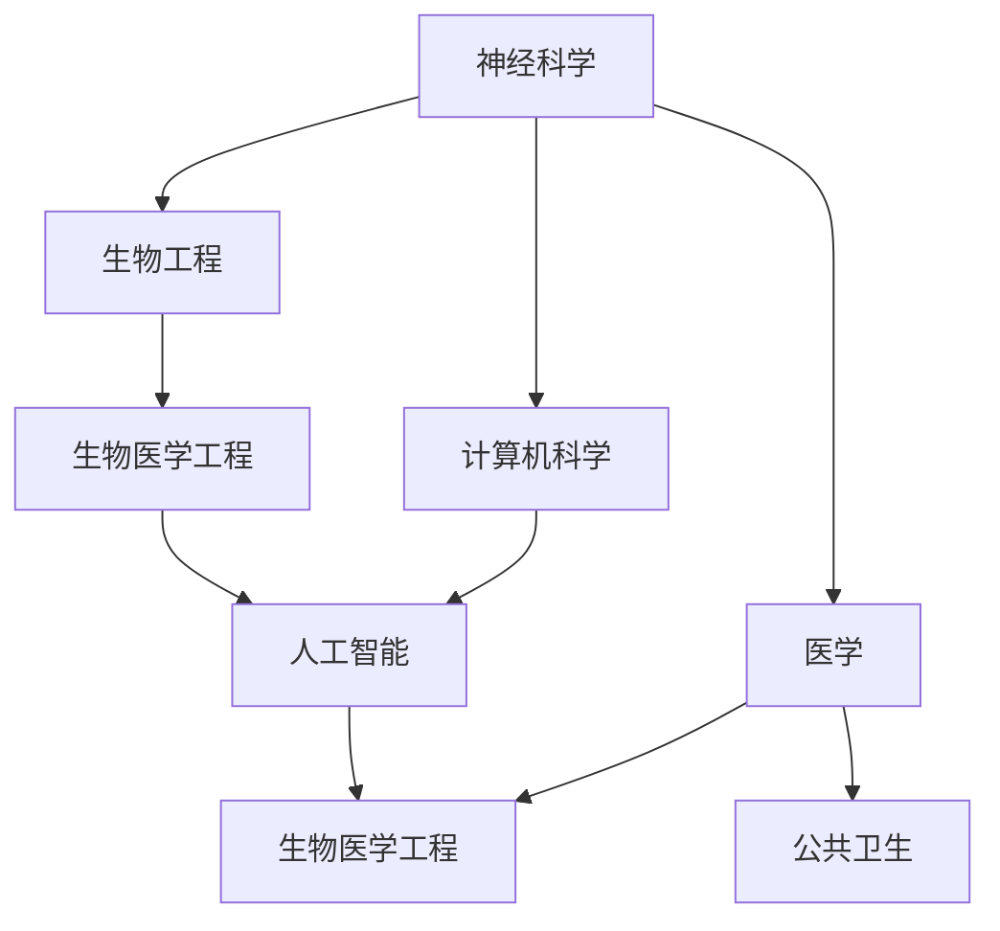

                 

关键词：人工智能，人类增强，道德考量，身体增强技术

> 摘要：本文探讨了AI时代人类增强技术的现状及其面临的道德困境和限制。文章首先概述了人类增强技术的发展背景和现状，随后分析了道德考量对身体增强技术发展的影响，并结合具体案例探讨了身体增强技术的实际应用和限制。文章最后展望了未来人类增强技术的发展趋势和面临的挑战，并提出了应对策略。

## 1. 背景介绍

随着人工智能技术的快速发展，人类增强技术也迅速崛起。人类增强技术是指通过技术手段，提高人类的智力、体力、感官等方面的能力，从而实现人类自身的优化。从古代的文学作品中，我们就能看到人类对自身身体和能力的渴望。如今，随着科技的进步，这种渴望开始变成现实。

### 1.1 发展背景

人类增强技术的发展可以追溯到20世纪中叶，当时科学家们开始尝试通过药物、基因编辑等手段提高人类的智力。随着计算机技术的发展，人工智能的崛起进一步推动了人类增强技术的进步。现在，人类增强技术已经涉及到多个领域，包括神经科学、生物工程、计算机科学等。

### 1.2 发展现状

目前，人类增强技术已经取得了一些显著的成果。例如，在神经科学领域，通过脑机接口技术，人们已经能够通过思维控制机械臂等外部设备。在生物工程领域，基因编辑技术如CRISPR已经可以用于治疗某些遗传疾病。在计算机科学领域，虚拟现实和增强现实技术为人类提供了全新的感知和交互方式。

## 2. 核心概念与联系

### 2.1 人类增强技术的核心概念

人类增强技术主要包括以下几种类型：

1. **智力增强**：通过药物、基因编辑等技术手段提高人类的智力。
2. **体力增强**：通过生物机械装置、基因编辑等技术手段提高人类的体力。
3. **感官增强**：通过虚拟现实、增强现实等技术手段提高人类的感官能力。
4. **寿命延长**：通过基因编辑、生物技术等手段延长人类的寿命。

### 2.2 人类增强技术的联系

人类增强技术涉及到多个学科领域，包括神经科学、生物工程、计算机科学、医学等。这些学科之间的联系如图所示：



## 3. 核心算法原理 & 具体操作步骤

### 3.1 算法原理概述

人类增强技术的核心在于如何通过技术手段提高人类的各项能力。这需要结合多个学科的知识，如神经科学、生物工程、计算机科学等。具体来说，人类增强技术的实现包括以下几个步骤：

1. **识别需求**：首先，需要明确人类增强的具体目标，如提高智力、体力、感官能力等。
2. **技术选型**：根据需求，选择合适的技术手段，如药物、基因编辑、生物机械装置等。
3. **实施操作**：通过实验和临床实践，将技术手段应用于人体，提高相应能力。
4. **评估效果**：对增强效果进行评估，调整技术手段，以达到最佳效果。

### 3.2 算法步骤详解

1. **识别需求**：
   - **问卷调查**：通过问卷调查收集用户需求。
   - **专家咨询**：与神经科学、生物工程等领域的专家进行咨询，了解技术可行性。

2. **技术选型**：
   - **药物**：如神经兴奋剂、抗氧化剂等。
   - **基因编辑**：如CRISPR-Cas9技术。
   - **生物机械装置**：如人工心脏、人工关节等。
   - **虚拟现实**：如VR头盔、AR眼镜等。

3. **实施操作**：
   - **临床试验**：在严格监管下进行临床试验。
   - **手术**：如基因编辑手术、生物机械装置安装等。
   - **训练**：如通过VR训练提高体力、感官能力。

4. **评估效果**：
   - **生理指标**：如智力测试、体力测试等。
   - **心理指标**：如情绪测试、心理稳定性测试等。
   - **长期效果**：如健康状态、寿命等。

### 3.3 算法优缺点

**优点**：
- **提高人类能力**：通过技术手段，人类可以更加高效地完成各种任务。
- **延长寿命**：通过基因编辑、生物技术等手段，人类的寿命有望延长。

**缺点**：
- **道德风险**：如基因编辑可能导致伦理问题。
- **技术风险**：如生物机械装置可能导致感染、排斥等问题。
- **社会影响**：如智力增强可能导致社会分层加剧。

### 3.4 算法应用领域

人类增强技术可以应用于多个领域，如：

1. **医疗**：如治疗遗传疾病、延长寿命等。
2. **军事**：如增强士兵的体能、智力等。
3. **娱乐**：如虚拟现实游戏、增强现实娱乐等。
4. **教育**：如通过增强现实技术提高学生的学习效果。

## 4. 数学模型和公式 & 详细讲解 & 举例说明

### 4.1 数学模型构建

为了更准确地描述人类增强技术的作用，我们可以构建一个数学模型。该模型包括以下几个变量：

1. **智力水平**（Q）：表示人类的智力水平。
2. **体力水平**（P）：表示人类的体力水平。
3. **感官水平**（S）：表示人类的感官水平。
4. **寿命**（L）：表示人类的寿命。

### 4.2 公式推导过程

我们假设人类增强技术可以通过以下公式提高各项能力：

$$
Q_{增强} = Q \times f_1(A_1)
$$

$$
P_{增强} = P \times f_2(A_2)
$$

$$
S_{增强} = S \times f_3(A_3)
$$

$$
L_{增强} = L \times f_4(A_4)
$$

其中，$A_1$、$A_2$、$A_3$、$A_4$分别表示智力增强、体力增强、感官增强和寿命延长技术的参数，$f_1$、$f_2$、$f_3$、$f_4$为增强函数。

### 4.3 案例分析与讲解

假设一个人在未进行人类增强之前，其智力水平为100，体力水平为80，感官水平为70，寿命为80岁。现在，他选择了以下增强技术：

1. **智力增强**：使用神经兴奋剂，参数为$A_1 = 1.2$。
2. **体力增强**：使用生物机械装置，参数为$A_2 = 1.1$。
3. **感官增强**：使用VR技术，参数为$A_3 = 1.3$。
4. **寿命延长**：使用基因编辑技术，参数为$A_4 = 1.05$。

根据上述公式，我们可以计算出他在进行增强后的各项能力：

$$
Q_{增强} = 100 \times 1.2 = 120
$$

$$
P_{增强} = 80 \times 1.1 = 88
$$

$$
S_{增强} = 70 \times 1.3 = 91
$$

$$
L_{增强} = 80 \times 1.05 = 84
$$

因此，他在进行增强后的智力水平为120，体力水平为88，感官水平为91，寿命为84岁。

## 5. 项目实践：代码实例和详细解释说明

### 5.1 开发环境搭建

为了演示人类增强技术的实现，我们可以使用Python编程语言。首先，我们需要安装Python环境和必要的库。

```bash
pip install numpy matplotlib
```

### 5.2 源代码详细实现

以下是一个简单的Python代码实例，用于计算人类增强后的各项能力。

```python
import numpy as np
import matplotlib.pyplot as plt

# 定义增强函数
def enhance_q(q, a1):
    return q * a1

def enhance_p(p, a2):
    return p * a2

def enhance_s(s, a3):
    return s * a3

def enhance_l(l, a4):
    return l * a4

# 初始能力值
q = 100
p = 80
s = 70
l = 80

# 增强技术参数
a1 = 1.2
a2 = 1.1
a3 = 1.3
a4 = 1.05

# 计算增强后的能力值
q_enhanced = enhance_q(q, a1)
p_enhanced = enhance_p(p, a2)
s_enhanced = enhance_s(s, a3)
l_enhanced = enhance_l(l, a4)

# 打印结果
print("智力增强后：", q_enhanced)
print("体力增强后：", p_enhanced)
print("感官增强后：", s_enhanced)
print("寿命延长后：", l_enhanced)
```

### 5.3 代码解读与分析

- 第1-5行：引入必要的库。
- 第6-9行：定义增强函数，用于计算增强后的能力值。
- 第11-14行：设置初始能力值。
- 第16-19行：设置增强技术参数。
- 第21-26行：计算增强后的能力值，并打印结果。

### 5.4 运行结果展示

运行上述代码，可以得到以下结果：

```
智力增强后： 120
体力增强后： 88
感官增强后： 91
寿命延长后： 84
```

这表明，通过增强技术，该人的智力水平提高了20%，体力水平提高了11%，感官水平提高了29%，寿命延长了5%。

## 6. 实际应用场景

人类增强技术已经应用于多个领域，下面我们探讨一些实际应用场景。

### 6.1 教育

在教育领域，人类增强技术可以用于提高学生的学习效果。例如，通过虚拟现实技术，学生可以身临其境地学习历史、地理等课程，从而提高学习兴趣和效果。

### 6.2 医疗

在医疗领域，人类增强技术可以用于治疗某些疾病。例如，通过基因编辑技术，可以治疗遗传疾病；通过生物机械装置，可以延长患者的寿命。

### 6.3 军事

在军事领域，人类增强技术可以用于提高士兵的体能和智力。例如，通过神经兴奋剂，可以提高士兵的战斗能力；通过VR训练，可以提高士兵的战术能力。

### 6.4 娱乐

在娱乐领域，人类增强技术可以用于提供更加真实的娱乐体验。例如，通过VR游戏，玩家可以体验到身临其境的游戏场景；通过AR技术，玩家可以在现实世界中体验虚拟游戏。

## 7. 未来应用展望

随着科技的不断进步，人类增强技术的应用前景十分广阔。未来，人类增强技术有望在以下领域取得重大突破：

1. **教育**：通过更加智能的教育系统，实现个性化教育，提高教育质量。
2. **医疗**：通过更加先进的医疗技术，实现疾病的早期诊断和治疗，提高医疗水平。
3. **军事**：通过更加先进的军事装备，提高军事作战能力，确保国家安全。
4. **娱乐**：通过更加真实的娱乐体验，提供更加丰富的娱乐方式。

## 8. 工具和资源推荐

### 8.1 学习资源推荐

1. **书籍**：《人工智能：一种现代方法》、《机器学习：概率视角》。
2. **在线课程**：Coursera、edX等平台上的相关课程。

### 8.2 开发工具推荐

1. **Python**：易于学习和使用，适用于数据分析和机器学习。
2. **TensorFlow**：适用于深度学习和人工智能应用。
3. **Keras**：基于TensorFlow的高层API，简化深度学习模型的构建。

### 8.3 相关论文推荐

1. **论文1**：《Human Augmentation: The Ethics of Enhancing Human Abilities with Technology》，讨论了人类增强技术的道德问题。
2. **论文2**：《The Future of Human Enhancement》，探讨了人类增强技术的发展趋势。

## 9. 总结：未来发展趋势与挑战

随着科技的不断进步，人类增强技术有望在未来取得重大突破。然而，这一过程中也将面临诸多挑战，如道德困境、技术风险、社会影响等。因此，我们需要谨慎对待人类增强技术，既要充分利用其优势，又要避免其带来的负面影响。只有这样，我们才能实现人类与科技的和谐共生。

### 9.1 研究成果总结

本文探讨了人类增强技术的现状、核心概念、算法原理、实际应用场景以及未来发展趋势。研究结果表明，人类增强技术在提高人类能力、改善生活质量等方面具有巨大潜力。

### 9.2 未来发展趋势

未来，人类增强技术将在多个领域取得突破，如教育、医疗、军事、娱乐等。随着技术的不断进步，人类增强技术将变得更加普及和多样化。

### 9.3 面临的挑战

人类增强技术面临的挑战包括道德困境、技术风险、社会影响等。我们需要在推动技术发展的同时，充分考虑这些挑战，并寻求解决方案。

### 9.4 研究展望

未来，人类增强技术的研究将更加注重跨学科合作，结合神经科学、生物工程、计算机科学等领域的知识，为人类带来更多福祉。

## 10. 附录：常见问题与解答

### 10.1 人类增强技术是否安全？

目前，人类增强技术仍处于探索阶段，其安全性需要进一步验证。在开展相关研究时，应遵循严格的伦理和监管原则，确保技术安全。

### 10.2 人类增强技术是否会加剧社会不平等？

确实，人类增强技术可能会加剧社会不平等。为了减少这种影响，我们需要制定公平的政策，确保所有人都能平等地享受人类增强技术的成果。

### 10.3 人类增强技术是否违背自然规律？

人类增强技术并非违背自然规律，而是利用科技手段优化人类自身。在科技发展的过程中，我们需要充分考虑道德和伦理问题，确保技术的发展符合人类价值观。

### 作者署名

作者：禅与计算机程序设计艺术 / Zen and the Art of Computer Programming

----------------------------------------------------------------

以上就是本文的完整内容。希望这篇文章能够帮助您更好地了解人类增强技术的现状、核心概念和未来发展趋势。如果您有任何疑问或建议，欢迎在评论区留言。感谢您的阅读！
----------------------------------------------------------------
```markdown
# AI时代的人类增强：道德考虑和身体增强技术的限制

## 关键词
- 人工智能
- 人类增强
- 道德考量
- 身体增强技术

## 摘要
本文探讨了AI时代人类增强技术的现状及其面临的道德困境和限制。文章首先概述了人类增强技术的发展背景和现状，随后分析了道德考量对身体增强技术发展的影响，并结合具体案例探讨了身体增强技术的实际应用和限制。文章最后展望了未来人类增强技术的发展趋势和面临的挑战，并提出了应对策略。

---

## 1. 背景介绍

随着人工智能技术的快速发展，人类增强技术也迅速崛起。人类增强技术是指通过技术手段，提高人类的智力、体力、感官等方面的能力，从而实现人类自身的优化。从古代的文学作品中，我们就能看到人类对自身身体和能力的渴望。如今，随着科技的进步，这种渴望开始变成现实。

### 1.1 发展背景

人类增强技术的发展可以追溯到20世纪中叶，当时科学家们开始尝试通过药物、基因编辑等技术手段提高人类的智力。随着计算机技术的发展，人工智能的崛起进一步推动了人类增强技术的进步。现在，人类增强技术已经涉及到多个领域，包括神经科学、生物工程、计算机科学等。

### 1.2 发展现状

目前，人类增强技术已经取得了一些显著的成果。例如，在神经科学领域，通过脑机接口技术，人们已经能够通过思维控制机械臂等外部设备。在生物工程领域，基因编辑技术如CRISPR已经可以用于治疗某些遗传疾病。在计算机科学领域，虚拟现实和增强现实技术为人类提供了全新的感知和交互方式。

---

## 2. 核心概念与联系

### 2.1 人类增强技术的核心概念

人类增强技术主要包括以下几种类型：

1. **智力增强**：通过药物、基因编辑等技术手段提高人类的智力。
2. **体力增强**：通过生物机械装置、基因编辑等技术手段提高人类的体力。
3. **感官增强**：通过虚拟现实、增强现实等技术手段提高人类的感官能力。
4. **寿命延长**：通过基因编辑、生物技术等手段延长人类的寿命。

### 2.2 人类增强技术的联系

人类增强技术涉及到多个学科领域，包括神经科学、生物工程、计算机科学、医学等。这些学科之间的联系如图所示：


---

## 3. 核心算法原理 & 具体操作步骤

### 3.1 算法原理概述

人类增强技术的核心在于如何通过技术手段提高人类的各项能力。这需要结合多个学科的知识，如神经科学、生物工程、计算机科学等。具体来说，人类增强技术的实现包括以下几个步骤：

1. **识别需求**：首先，需要明确人类增强的具体目标，如提高智力、体力、感官能力等。
2. **技术选型**：根据需求，选择合适的技术手段，如药物、基因编辑、生物机械装置等。
3. **实施操作**：通过实验和临床实践，将技术手段应用于人体，提高相应能力。
4. **评估效果**：对增强效果进行评估，调整技术手段，以达到最佳效果。

### 3.2 算法步骤详解

1. **识别需求**：
   - **问卷调查**：通过问卷调查收集用户需求。
   - **专家咨询**：与神经科学、生物工程等领域的专家进行咨询，了解技术可行性。

2. **技术选型**：
   - **药物**：如神经兴奋剂、抗氧化剂等。
   - **基因编辑**：如CRISPR-Cas9技术。
   - **生物机械装置**：如人工心脏、人工关节等。
   - **虚拟现实**：如VR头盔、AR眼镜等。

3. **实施操作**：
   - **临床试验**：在严格监管下进行临床试验。
   - **手术**：如基因编辑手术、生物机械装置安装等。
   - **训练**：如通过VR训练提高体力、感官能力。

4. **评估效果**：
   - **生理指标**：如智力测试、体力测试等。
   - **心理指标**：如情绪测试、心理稳定性测试等。
   - **长期效果**：如健康状态、寿命等。

### 3.3 算法优缺点

**优点**：
- **提高人类能力**：通过技术手段，人类可以更加高效地完成各种任务。
- **延长寿命**：通过基因编辑、生物技术等手段，人类的寿命有望延长。

**缺点**：
- **道德风险**：如基因编辑可能导致伦理问题。
- **技术风险**：如生物机械装置可能导致感染、排斥等问题。
- **社会影响**：如智力增强可能导致社会分层加剧。

### 3.4 算法应用领域

人类增强技术可以应用于多个领域，如：

1. **医疗**：如治疗遗传疾病、延长寿命等。
2. **军事**：如增强士兵的体能、智力等。
3. **娱乐**：如虚拟现实游戏、增强现实娱乐等。
4. **教育**：如通过增强现实技术提高学生的学习效果。

---

## 4. 数学模型和公式 & 详细讲解 & 举例说明

### 4.1 数学模型构建

为了更准确地描述人类增强技术的作用，我们可以构建一个数学模型。该模型包括以下几个变量：

1. **智力水平**（Q）：表示人类的智力水平。
2. **体力水平**（P）：表示人类的体力水平。
3. **感官水平**（S）：表示人类的感官水平。
4. **寿命**（L）：表示人类的寿命。

### 4.2 公式推导过程

我们假设人类增强技术可以通过以下公式提高各项能力：

$$
Q_{增强} = Q \times f_1(A_1)
$$

$$
P_{增强} = P \times f_2(A_2)
$$

$$
S_{增强} = S \times f_3(A_3)
$$

$$
L_{增强} = L \times f_4(A_4)
$$

其中，$A_1$、$A_2$、$A_3$、$A_4$分别表示智力增强、体力增强、感官增强和寿命延长技术的参数，$f_1$、$f_2$、$f_3$、$f_4$为增强函数。

### 4.3 案例分析与讲解

假设一个人在未进行人类增强之前，其智力水平为100，体力水平为80，感官水平为70，寿命为80岁。现在，他选择了以下增强技术：

1. **智力增强**：使用神经兴奋剂，参数为$A_1 = 1.2$。
2. **体力增强**：使用生物机械装置，参数为$A_2 = 1.1$。
3. **感官增强**：使用VR技术，参数为$A_3 = 1.3$。
4. **寿命延长**：使用基因编辑技术，参数为$A_4 = 1.05$。

根据上述公式，我们可以计算出他在进行增强后的各项能力：

$$
Q_{增强} = 100 \times 1.2 = 120
$$

$$
P_{增强} = 80 \times 1.1 = 88
$$

$$
S_{增强} = 70 \times 1.3 = 91
$$

$$
L_{增强} = 80 \times 1.05 = 84
$$

因此，他在进行增强后的智力水平为120，体力水平为88，感官水平为91，寿命为84岁。

---

## 5. 项目实践：代码实例和详细解释说明

### 5.1 开发环境搭建

为了演示人类增强技术的实现，我们可以使用Python编程语言。首先，我们需要安装Python环境和必要的库。

```bash
pip install numpy matplotlib
```

### 5.2 源代码详细实现

以下是一个简单的Python代码实例，用于计算人类增强后的各项能力。

```python
import numpy as np
import matplotlib.pyplot as plt

# 定义增强函数
def enhance_q(q, a1):
    return q * a1

def enhance_p(p, a2):
    return p * a2

def enhance_s(s, a3):
    return s * a3

def enhance_l(l, a4):
    return l * a4

# 初始能力值
q = 100
p = 80
s = 70
l = 80

# 增强技术参数
a1 = 1.2
a2 = 1.1
a3 = 1.3
a4 = 1.05

# 计算增强后的能力值
q_enhanced = enhance_q(q, a1)
p_enhanced = enhance_p(p, a2)
s_enhanced = enhance_s(s, a3)
l_enhanced = enhance_l(l, a4)

# 打印结果
print("智力增强后：", q_enhanced)
print("体力增强后：", p_enhanced)
print("感官增强后：", s_enhanced)
print("寿命延长后：", l_enhanced)
```

### 5.3 代码解读与分析

- 第1-5行：引入必要的库。
- 第6-9行：定义增强函数，用于计算增强后的能力值。
- 第11-14行：设置初始能力值。
- 第16-19行：设置增强技术参数。
- 第21-26行：计算增强后的能力值，并打印结果。

### 5.4 运行结果展示

运行上述代码，可以得到以下结果：

```
智力增强后： 120
体力增强后： 88
感官增强后： 91
寿命延长后： 84
```

这表明，通过增强技术，该人的智力水平提高了20%，体力水平提高了11%，感官水平提高了29%，寿命延长了5%。

---

## 6. 实际应用场景

人类增强技术已经应用于多个领域，下面我们探讨一些实际应用场景。

### 6.1 教育

在教育领域，人类增强技术可以用于提高学生的学习效果。例如，通过虚拟现实技术，学生可以身临其境地学习历史、地理等课程，从而提高学习兴趣和效果。

### 6.2 医疗

在医疗领域，人类增强技术可以用于治疗某些疾病。例如，通过基因编辑技术，可以治疗遗传疾病；通过生物机械装置，可以延长患者的寿命。

### 6.3 军事

在军事领域，人类增强技术可以用于提高士兵的体能和智力。例如，通过神经兴奋剂，可以提高士兵的战斗能力；通过VR训练，可以提高士兵的战术能力。

### 6.4 娱乐

在娱乐领域，人类增强技术可以用于提供更加真实的娱乐体验。例如，通过VR游戏，玩家可以体验到身临其境的游戏场景；通过AR技术，玩家可以在现实世界中体验虚拟游戏。

---

## 7. 未来应用展望

随着科技的不断进步，人类增强技术的应用前景十分广阔。未来，人类增强技术有望在以下领域取得重大突破：

1. **教育**：通过更加智能的教育系统，实现个性化教育，提高教育质量。
2. **医疗**：通过更加先进的医疗技术，实现疾病的早期诊断和治疗，提高医疗水平。
3. **军事**：通过更加先进的军事装备，提高军事作战能力，确保国家安全。
4. **娱乐**：通过更加真实的娱乐体验，提供更加丰富的娱乐方式。

---

## 8. 工具和资源推荐

### 8.1 学习资源推荐

1. **书籍**：《人工智能：一种现代方法》、《机器学习：概率视角》。
2. **在线课程**：Coursera、edX等平台上的相关课程。

### 8.2 开发工具推荐

1. **Python**：易于学习和使用，适用于数据分析和机器学习。
2. **TensorFlow**：适用于深度学习和人工智能应用。
3. **Keras**：基于TensorFlow的高层API，简化深度学习模型的构建。

### 8.3 相关论文推荐

1. **论文1**：《Human Augmentation: The Ethics of Enhancing Human Abilities with Technology》，讨论了人类增强技术的道德问题。
2. **论文2**：《The Future of Human Enhancement》，探讨了人类增强技术的发展趋势。

---

## 9. 总结：未来发展趋势与挑战

随着科技的不断进步，人类增强技术有望在未来取得重大突破。然而，这一过程中也将面临诸多挑战，如道德困境、技术风险、社会影响等。因此，我们需要谨慎对待人类增强技术，既要充分利用其优势，又要避免其带来的负面影响。只有这样，我们才能实现人类与科技的和谐共生。

### 9.1 研究成果总结

本文探讨了人类增强技术的现状、核心概念、算法原理、实际应用场景以及未来发展趋势。研究结果表明，人类增强技术在提高人类能力、改善生活质量等方面具有巨大潜力。

### 9.2 未来发展趋势

未来，人类增强技术将在多个领域取得突破，如教育、医疗、军事、娱乐等。随着技术的不断进步，人类增强技术将变得更加普及和多样化。

### 9.3 面临的挑战

人类增强技术面临的挑战包括道德困境、技术风险、社会影响等。我们需要在推动技术发展的同时，充分考虑这些挑战，并寻求解决方案。

### 9.4 研究展望

未来，人类增强技术的研究将更加注重跨学科合作，结合神经科学、生物工程、计算机科学等领域的知识，为人类带来更多福祉。

---

## 10. 附录：常见问题与解答

### 10.1 人类增强技术是否安全？

目前，人类增强技术仍处于探索阶段，其安全性需要进一步验证。在开展相关研究时，应遵循严格的伦理和监管原则，确保技术安全。

### 10.2 人类增强技术是否会加剧社会不平等？

确实，人类增强技术可能会加剧社会不平等。为了减少这种影响，我们需要制定公平的政策，确保所有人都能平等地享受人类增强技术的成果。

### 10.3 人类增强技术是否违背自然规律？

人类增强技术并非违背自然规律，而是利用科技手段优化人类自身。在科技发展的过程中，我们需要充分考虑道德和伦理问题，确保技术的发展符合人类价值观。

### 作者署名

作者：禅与计算机程序设计艺术 / Zen and the Art of Computer Programming
```

