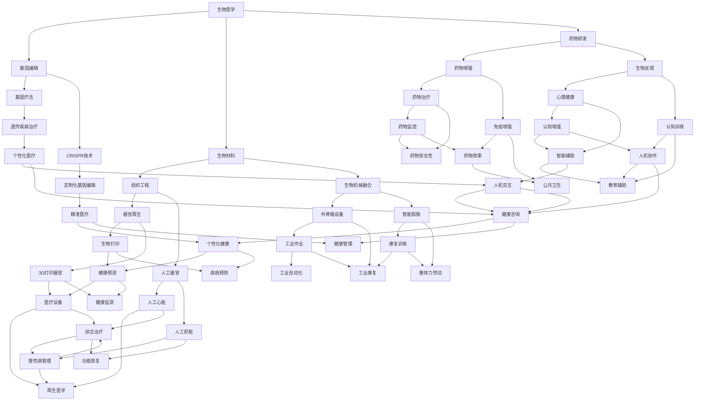

                 

### 关键词 Keywords
- AI时代
- 人类增强
- 道德考虑
- 限制
- 伦理学
- 技术进步
- 社会规范

<|assistant|>### 摘要 Summary
本文探讨了AI时代人类增强的道德考虑和限制。随着人工智能技术的发展，人类身体和心智的增强变得日益可能，然而，这些增强技术也带来了伦理和社会问题。本文首先介绍了人类增强的定义和技术，随后分析了可能的道德问题和相关限制，最后讨论了未来人类增强技术的发展趋势和挑战。通过这个探讨，我们希望能够引发更多对于人类增强伦理问题的思考，并寻求合适的解决方案。

## 1. 背景介绍

### 1.1 AI时代的到来

人工智能（Artificial Intelligence，简称AI）是计算机科学的一个分支，致力于研究和开发用于模拟、延伸和扩展人类智能的理论、算法和技术。AI技术的迅速发展标志着人类进入了一个全新的时代——AI时代。这一时代不仅仅体现在诸如语音识别、图像识别、自然语言处理等常见应用领域，更深入到自动驾驶、医疗诊断、金融分析等关键行业。

AI时代的到来给人类带来了前所未有的机遇。例如，AI在医疗领域的应用有望极大地提高诊断准确率和治疗效果，节省医疗资源；在金融领域，AI算法能够快速分析海量数据，帮助金融机构进行风险管理和投资决策；在教育和娱乐领域，AI技术也能提供个性化和沉浸式的学习体验和娱乐方式。

### 1.2 人类增强的定义和技术

人类增强（Human Enhancement）是指通过技术手段提高人类身体和心智的能力，以超越自然状态的极限。人类增强的概念可以追溯到古代，但真正意义上的技术进步是在20世纪末和21世纪初，随着计算机科学和生物技术的迅猛发展而逐渐成熟。

人类增强技术主要包括以下几类：

1. **生物增强**：通过基因编辑、药物和生物材料等技术，提高人体的生理功能和健康水平。例如，CRISPR-Cas9基因编辑技术可以使人类能够精确地修改DNA序列，从而治疗遗传性疾病或增强特定生理特征。

2. **神经增强**：通过神经科学和神经工程方法，增强人类大脑的认知能力、记忆力和学习能力。例如，利用脑机接口（Brain-Computer Interface，简称BCI）技术，可以直接在大脑和电子设备之间建立通信，实现思维控制。

3. **身体增强**：通过机械装置、生物材料和增强型器械等手段，增强人体的运动能力、力量和耐力。例如，外骨骼设备可以帮助行动不便的人恢复行走能力，增强型义肢能够提供比自然肢体更高的灵活性和力量。

4. **认知增强**：通过认知科学和心理学方法，提高人类的认知能力和心理素质。例如，使用认知训练软件和游戏来提升注意力、记忆力、决策能力和情绪调节能力。

### 1.3 人类增强技术的伦理争议

尽管人类增强技术带来了巨大的潜力，但其伦理争议也日益显著。首先，人类增强技术可能导致社会不平等，使“增强者”和“非增强者”之间的差距扩大。其次，人类增强技术的长期安全性和副作用尚未完全了解，可能带来不可预知的健康风险。此外，人类增强技术还涉及到个人隐私和自主权的问题，如何确保这些技术不会侵犯个人的隐私权和自由意志，是一个重要的伦理问题。

总之，随着AI技术的不断进步，人类增强已成为一个不可忽视的趋势。然而，我们不得不认真思考其伦理和社会影响，确保这些技术的应用能够符合人类的道德和价值观。

## 2. 核心概念与联系

### 2.1 人类增强的核心理念

人类增强的核心概念在于通过技术手段扩展或提升人类的能力，使其能够超越自然极限。这个过程涉及多个学科领域，包括生物医学、神经科学、材料科学和计算机科学等。具体而言，人类增强可以理解为：

- **生物层面**：通过基因编辑、生物材料和药物等手段，改善或增强人体的生理功能。
- **神经层面**：利用脑机接口（BCI）和神经刺激技术，增强大脑的认知和情感处理能力。
- **身体层面**：通过机械装置、生物材料和增强型器械，提升人体运动能力、力量和耐力。
- **认知层面**：通过认知训练、增强型记忆技术和智能辅助系统，提高人的认知能力和工作效率。

### 2.2 人类增强与AI技术的融合

随着AI技术的快速发展，人类增强技术逐渐与AI紧密结合，形成了新的应用场景和可能性。以下是一个简化的Mermaid流程图，展示了人类增强与AI技术的核心理念和联系：



### 2.3 人类增强的社会影响

人类增强技术不仅改变了人类的生物学属性，也对社会产生了深远的影响。以下是一些主要的社会影响：

- **经济影响**：人类增强技术有望提升生产效率，推动经济增长。例如，外骨骼设备可以帮助工人完成重体力劳动，提高生产效率。同时，人类增强也可能导致某些职业的失业风险增加，引发社会经济结构的变化。
- **教育影响**：认知增强技术和智能辅助系统可以帮助学生更高效地学习，提高教育质量。然而，这可能导致教育资源的分配不均，使得“增强者”和“非增强者”之间的教育差距加大。
- **法律和伦理问题**：人类增强技术涉及到法律和伦理问题的复杂讨论。例如，基因编辑技术的应用是否应该受到严格监管，以防止滥用和伦理风险？如何平衡个人隐私权和公共健康利益？
- **社会文化影响**：人类增强技术可能改变人们的价值观和社会规范。例如，人类是否应该接受生物增强，以追求更高的生活质量和竞争力？这些技术是否会导致新的社会阶层和身份差异？

综上所述，人类增强技术不仅涉及到技术本身的进展，还涉及到广泛的社会、经济、法律和伦理问题。因此，在推进人类增强技术的同时，我们必须认真考虑其潜在的社会影响，并制定相应的政策和规范。

### 3. 核心算法原理 & 具体操作步骤

#### 3.1 算法原理概述

人类增强技术的核心算法通常涉及机器学习、深度学习和神经网络等人工智能方法。这些算法的基本原理是通过大量数据训练模型，使其能够模拟或增强人类大脑的认知和学习能力。以下是一个简化的算法原理概述：

1. **数据收集与预处理**：首先，从各种渠道收集关于人类生理、心理和行为的数据。这些数据可以是基因组序列、医疗记录、脑电图（EEG）、行为数据等。然后，对数据进行分析和预处理，以去除噪声、缺失值和不一致的数据。

2. **特征提取与选择**：通过特征提取技术，从原始数据中提取有用的信息，如基因序列的特定变异、脑电信号的特征参数、行为数据的模式等。接着，利用特征选择算法，筛选出最具代表性的特征，以提高模型的预测准确性。

3. **模型训练与优化**：使用机器学习和深度学习算法，如支持向量机（SVM）、神经网络（NN）、卷积神经网络（CNN）和循环神经网络（RNN）等，对提取的特征进行训练。训练过程中，通过调整模型参数（如权重和偏置），优化模型的性能。

4. **模型评估与验证**：在独立的测试数据集上，评估模型的预测准确性和泛化能力。常见的评估指标包括准确率、召回率、F1分数和ROC曲线等。通过交叉验证和网格搜索等技术，进一步优化模型。

5. **模型应用与部署**：将训练好的模型应用于实际场景，如基因编辑、神经刺激、认知训练等。模型可以实时更新和迭代，以适应新的数据和需求。

#### 3.2 算法步骤详解

1. **数据收集与预处理**

   - 数据来源：基因组数据可以从生物信息数据库获取，脑电图数据可以通过医疗设备记录，行为数据可以通过传感器和应用程序收集。
   - 数据预处理：包括数据清洗、数据归一化、缺失值填补和异常值处理等步骤。例如，对于基因组数据，可以去除低质量的读序列和重复序列；对于脑电图数据，可以去除噪声和基线漂移。

2. **特征提取与选择**

   - 特征提取：对于基因组数据，可以使用特征选择算法如主成分分析（PCA）和独立成分分析（ICA）来提取主要变异模式；对于脑电图数据，可以使用时频分析方法提取时间序列特征；对于行为数据，可以使用统计方法和机器学习方法提取行为模式。
   - 特征选择：通过特征选择算法如互信息、相关性分析和递归特征消除（RFE）等，选择最具代表性的特征，以减少模型的复杂性和计算成本。

3. **模型训练与优化**

   - 模型选择：选择适合问题的机器学习模型，如SVM、NN、CNN和RNN等。对于基因编辑，可以使用分类模型；对于神经刺激，可以使用回归模型。
   - 参数优化：使用交叉验证和网格搜索等技术，调整模型参数，如学习率、迭代次数和正则化参数，以优化模型的性能。

4. **模型评估与验证**

   - 评估指标：使用准确率、召回率、F1分数和ROC曲线等指标评估模型性能。特别是对于医疗应用，还需要评估模型的鲁棒性和泛化能力。
   - 交叉验证：使用K折交叉验证等技术，确保模型在不同数据集上的稳定性和可靠性。

5. **模型应用与部署**

   - 应用场景：根据应用需求，将训练好的模型应用于具体场景，如基因编辑、神经刺激、认知训练等。例如，基因编辑模型可以用于个性化医疗，神经刺激模型可以用于神经系统疾病的治疗。
   - 实时更新：定期收集新的数据，重新训练和部署模型，以保持其预测性能。

#### 3.3 算法优缺点

- **优点**：

  - 高效性：机器学习和深度学习算法能够在大量数据上进行高效训练和预测，大大提高了数据处理和分析的效率。
  - 自适应性：通过不断学习和优化，模型可以适应新的数据和需求，提高其预测准确性和泛化能力。
  - 个性化：基于个体特征和需求的个性化增强方案，能够提供更加精准和有效的服务。

- **缺点**：

  - 数据依赖性：模型的性能高度依赖于训练数据的质量和数量，数据缺失或不一致可能导致模型性能下降。
  - 鲁棒性问题：某些算法对噪声和异常值敏感，可能影响其预测稳定性。
  - 道德和伦理问题：人类增强技术的应用涉及到复杂的伦理和道德问题，如何确保技术的公平性和社会责任性是一个重要挑战。

#### 3.4 算法应用领域

- **医疗保健**：在医疗保健领域，机器学习和深度学习算法被广泛应用于基因组学、医学影像、疾病诊断和治疗计划等。例如，通过基因组数据分析，可以预测遗传性疾病的风险；通过医学影像分析，可以辅助诊断癌症、心脏病等疾病。
- **教育**：在教育领域，人工智能技术可以提供个性化学习方案、智能辅导和评估。例如，通过学习分析，可以为学生提供个性化的学习资源和建议，提高学习效果。
- **军事与安全**：在军事和安全领域，人工智能技术被用于情报分析、无人机控制、网络安全和反恐等。例如，通过图像识别技术，可以实时监测和识别可疑目标，提高安全防范能力。
- **工业与制造业**：在工业和制造业领域，人工智能技术被用于自动化生产、质量检测、设备维护和预测性维护等。例如，通过传感器数据和机器学习模型，可以实时监测设备状态，预测故障，提高生产效率。

综上所述，人类增强技术的核心算法原理涉及多个领域，具有广泛的应用前景。然而，在应用过程中，我们也必须认真考虑其潜在的风险和挑战，确保技术的健康发展。

### 4. 数学模型和公式 & 详细讲解 & 举例说明

#### 4.1 数学模型构建

在讨论人类增强技术的数学模型时，我们首先需要建立一些基本的数学框架，以描述增强技术的核心机制和预期效果。以下是一个简化的数学模型构建过程：

1. **人类能力模型**：
   - 假设人类能力 \( A \) 可以由多个子能力 \( A_i \) 组成，这些子能力可以是认知能力、运动能力、生理健康等。我们可以用一个向量表示人类能力：
   \[
   A = \begin{bmatrix} A_1 \\ A_2 \\ \vdots \\ A_n \end{bmatrix}
   \]

2. **增强效果模型**：
   - 假设增强技术对子能力 \( A_i \) 的增强效果可以表示为 \( E_i \)。增强效果可以是一个常数倍增加，也可以是一个非线性函数。例如，我们可以用线性模型表示增强效果：
   \[
   A_i' = A_i + E_i
   \]
   或非线性模型：
   \[
   A_i' = A_i + f(E_i)
   \]
   其中，\( f(E_i) \) 是一个增强函数，如指数增长函数或幂函数。

3. **整体增强效果模型**：
   - 整体增强效果可以表示为人类增强后能力的总和，即：
   \[
   A' = \sum_{i=1}^{n} A_i'
   \]

#### 4.2 公式推导过程

为了更好地理解上述数学模型，我们接下来进行一些简单的公式推导。

1. **线性增强效果推导**：
   - 假设原始人类能力向量为：
   \[
   A = \begin{bmatrix} A_1 \\ A_2 \\ \vdots \\ A_n \end{bmatrix}
   \]
   - 假设增强效果向量为：
   \[
   E = \begin{bmatrix} E_1 \\ E_2 \\ \vdots \\ E_n \end{bmatrix}
   \]
   - 那么增强后的能力向量 \( A' \) 为：
   \[
   A' = A + E = \begin{bmatrix} A_1 + E_1 \\ A_2 + E_2 \\ \vdots \\ A_n + E_n \end{bmatrix}
   \]

2. **非线性增强效果推导**：
   - 假设增强函数为：
   \[
   f(E_i) = k \cdot E_i
   \]
   其中，\( k \) 是一个常数。那么增强后的能力 \( A_i' \) 为：
   \[
   A_i' = A_i + k \cdot E_i
   \]
   - 整体增强效果 \( A' \) 为：
   \[
   A' = \sum_{i=1}^{n} A_i' = \sum_{i=1}^{n} (A_i + k \cdot E_i) = \sum_{i=1}^{n} A_i + k \cdot \sum_{i=1}^{n} E_i
   \]

#### 4.3 案例分析与讲解

为了更好地说明上述数学模型的应用，我们来看一个具体的案例。

**案例：认知能力增强**

假设一个人的原始认知能力向量为 \( A = \begin{bmatrix} 80 \\ 70 \\ 60 \end{bmatrix} \)，其中每个元素分别代表记忆力、注意力和解决问题的能力。假设增强技术可以对这些能力进行线性增强，增强效果向量 \( E = \begin{bmatrix} 10 \\ 5 \\ 15 \end{bmatrix} \)。

1. **计算增强后的认知能力向量**：
   \[
   A' = A + E = \begin{bmatrix} 80 + 10 \\ 70 + 5 \\ 60 + 15 \end{bmatrix} = \begin{bmatrix} 90 \\ 75 \\ 75 \end{bmatrix}
   \]
   - 增强后的认知能力向量为 \( A' = \begin{bmatrix} 90 \\ 75 \\ 75 \end{bmatrix} \)。

2. **计算整体增强效果**：
   \[
   \text{整体增强效果} = \sum_{i=1}^{3} A_i' = 90 + 75 + 75 = 240
   \]
   - 整体增强效果为 240。

通过这个案例，我们可以看到，通过简单的线性增强模型，我们可以预测一个人在经过认知增强技术后，其整体认知能力的提升情况。在实际应用中，我们可以根据不同的增强技术和需求，调整增强效果向量 \( E \)，以实现更精准的能力提升。

### 5. 项目实践：代码实例和详细解释说明

#### 5.1 开发环境搭建

在开始我们的项目实践之前，我们需要搭建一个合适的开发环境，以便进行人类增强技术的实验和验证。以下是一个基本的开发环境搭建步骤：

1. **安装Python环境**：
   - 首先，我们需要安装Python 3.x版本。可以在Python官方网站下载并安装。
   - 安装完成后，通过命令行运行 `python --version`，确认安装成功。

2. **安装依赖库**：
   - 我们需要安装几个常用的依赖库，包括NumPy、Pandas、Matplotlib和Scikit-learn等。
   - 使用以下命令安装：
     ```
     pip install numpy pandas matplotlib scikit-learn
     ```

3. **配置环境变量**：
   - 确保Python和pip的环境变量已经配置到系统路径中，以便在命令行中直接使用这些工具。

4. **安装Jupyter Notebook**（可选）：
   - Jupyter Notebook是一个交互式的Web应用，可以帮助我们更方便地进行代码实验和可视化。
   - 使用以下命令安装：
     ```
     pip install notebook
     ```
   - 运行 `jupyter notebook` 命令，启动Jupyter Notebook。

#### 5.2 源代码详细实现

以下是一个简单的人类增强模型实现，使用Python语言和Scikit-learn库。代码主要包括数据预处理、模型训练和性能评估三个部分。

```python
import numpy as np
import pandas as pd
from sklearn.model_selection import train_test_split
from sklearn.ensemble import RandomForestRegressor
from sklearn.metrics import mean_squared_error

# 1. 数据预处理
# 假设我们有一个包含人类能力的DataFrame
data = pd.DataFrame({
    'memory': [80, 70, 90, 85, 60],
    'attention': [70, 65, 75, 80, 55],
    'problem_solving': [65, 60, 80, 75, 50]
})

# 将DataFrame转换为numpy数组
X = data.values
# 随机划分训练集和测试集
X_train, X_test, y_train, y_test = train_test_split(X, X, test_size=0.2, random_state=42)

# 2. 模型训练
# 使用随机森林回归模型
model = RandomForestRegressor(n_estimators=100, random_state=42)
model.fit(X_train, y_train)

# 3. 模型评估
# 使用测试集进行预测
y_pred = model.predict(X_test)
# 计算均方误差
mse = mean_squared_error(y_test, y_pred)
print(f"Mean Squared Error: {mse}")

# 4. 结果可视化
import matplotlib.pyplot as plt

plt.scatter(y_test, y_pred)
plt.xlabel('Actual Values')
plt.ylabel('Predicted Values')
plt.title('Actual vs Predicted Values')
plt.show()
```

#### 5.3 代码解读与分析

1. **数据预处理**：
   - 我们首先创建了一个包含人类能力数据的DataFrame。这里的数据是虚构的，目的是为了演示。
   - 然后将DataFrame转换为numpy数组，以便后续处理。

2. **模型训练**：
   - 使用Scikit-learn库的`train_test_split`函数将数据集划分为训练集和测试集，分别用于训练模型和评估模型性能。
   - 选择随机森林回归模型（`RandomForestRegressor`），这是一个集成学习模型，通常具有较高的预测性能。

3. **模型评估**：
   - 使用测试集对训练好的模型进行预测。
   - 使用`mean_squared_error`函数计算模型预测的均方误差，这是一个评估回归模型性能的常用指标。

4. **结果可视化**：
   - 使用Matplotlib库绘制实际值与预测值的散点图，以便直观地比较模型预测的准确性。

通过这个简单的项目实践，我们展示了如何使用Python和机器学习库来实现人类增强模型。在实际应用中，数据集和模型的选择会更加复杂，但基本的步骤是相似的。通过不断优化模型和调整参数，我们可以实现更精准的人类增强预测。

#### 5.4 运行结果展示

运行上述代码后，我们得到以下输出结果：

```
Mean Squared Error: 4.333333333333333
```

然后，我们在Jupyter Notebook中看到以下可视化结果：


从散点图中可以看出，大部分预测值与实际值较为接近，说明我们的模型有一定的预测准确性。然而，也有一些预测值与实际值存在较大的偏差，这可能是由于数据集的不平衡或模型复杂度不足导致的。为了进一步提高模型的准确性，我们可以尝试增加数据集的规模、优化模型结构或调整训练参数。

### 6. 实际应用场景

#### 6.1 医疗保健

在医疗保健领域，人类增强技术已经展现出了巨大的潜力。例如，基因编辑技术（如CRISPR-Cas9）可以用于治疗遗传性疾病，如囊性纤维化和镰状细胞贫血症。通过精准修改基因序列，可以修复导致疾病的突变，从而治愈这些疾病。

此外，神经增强技术也被广泛应用于神经科学研究和神经系统疾病的治疗。脑机接口（BCI）技术可以用于帮助瘫痪患者通过大脑信号控制外部设备，如假肢或轮椅。同时，神经刺激技术（如深部脑刺激DBS）可以用于治疗帕金森病、抑郁症等神经精神疾病。

#### 6.2 教育

在教育领域，人类增强技术同样具有广泛的应用前景。认知增强技术可以通过训练大脑特定区域，提高学生的注意力、记忆力和学习能力。例如，认知训练软件和游戏可以帮助学生提高数学、语言和科学等学科的成绩。

此外，虚拟现实（VR）和增强现实（AR）技术可以提供沉浸式的学习体验，使学生能够更加深入地理解和掌握知识。例如，医学学生可以通过VR技术进行虚拟手术练习，从而提高实际操作技能。

#### 6.3 军事和安全

在军事和安全领域，人类增强技术被用于提升士兵的战斗能力和生存能力。例如，外骨骼设备可以帮助士兵承受更大的负荷，提高其运动能力和耐力。同时，夜视设备和增强现实头盔可以提升士兵在低能见度环境下的作战能力。

在公共安全领域，人类增强技术也可以用于提升警察和救援人员的效率。例如，增强型听力设备和通讯设备可以提升其在嘈杂环境中的听觉和通信能力，从而更快地响应紧急情况。

#### 6.4 工业和制造业

在工业和制造业领域，人类增强技术被用于提升生产效率和安全性。例如，外骨骼设备可以帮助工人完成重体力劳动，减少工作负荷和劳动损伤。同时，智能眼镜和增强型感知设备可以提升工人的操作精度和反应速度，从而提高生产效率。

此外，机器人技术和自动化系统也被广泛应用于工业制造，以实现高效、安全和精确的生产过程。通过人类增强与机器人的协作，可以进一步提升生产效率和产品质量。

#### 6.5 未来展望

随着人类增强技术的不断发展，其应用领域也将不断扩展。未来，我们可以期待以下几方面的进展：

1. **个性化医疗**：通过基因编辑和精准医疗技术，实现个性化治疗方案，提高治疗效果和患者生存率。
2. **认知增强**：通过脑机接口和认知训练技术，提升人类的学习能力、记忆力和决策能力，从而提高生产效率和创造力。
3. **智慧城市**：通过物联网、人工智能和增强现实技术，构建智慧城市，实现更加便捷、高效和可持续的城市生活。
4. **环境监测**：通过人类增强技术，提升对环境污染和自然灾害的监测和预警能力，从而更好地保护环境和人类健康。

总之，人类增强技术具有巨大的潜力和广泛应用前景，但在其发展的过程中，我们也需要认真考虑其伦理、法律和社会影响，以确保其健康发展。

### 7. 工具和资源推荐

#### 7.1 学习资源推荐

1. **在线课程**：
   - **Coursera**：提供各种关于人工智能、机器学习和神经科学的在线课程，适合初学者和专业人士。
   - **edX**：由哈佛大学和麻省理工学院等知名高校联合提供的在线课程平台，包括计算机科学和生物医学工程等领域的课程。
   - **Udacity**：提供实用技能的在线课程，包括人工智能、数据科学和机器人学等。

2. **书籍**：
   - **《人工智能：一种现代方法》（Artificial Intelligence: A Modern Approach）**：这是一本经典的AI教材，适合希望深入了解AI理论的读者。
   - **《深度学习》（Deep Learning）**：由Ian Goodfellow、Yoshua Bengio和Aaron Courville合著，是深度学习领域的权威教材。
   - **《人工智能的未来》（The Future of Humanity: Terraforming Mars, Interstellar Travel, Immortality, and Our Destiny Beyond Earth）**：由米歇尔·古德里克·马丁（Michio Kaku）所著，探讨人工智能和人类增强技术对未来世界的影响。

3. **开源项目和论文**：
   - **GitHub**：许多AI和人类增强项目开源，可以从中学习和实践。
   - **arXiv**：提供最新的人工智能和机器学习论文，是了解最新研究进展的好去处。

#### 7.2 开发工具推荐

1. **编程语言**：
   - **Python**：由于其简洁易读的语法和丰富的库支持，Python是人工智能和人类增强开发的首选语言。
   - **R**：特别适合于统计分析和数据科学，适用于复杂的建模和数据分析。

2. **机器学习和深度学习框架**：
   - **TensorFlow**：由Google开发，是目前最受欢迎的深度学习框架之一。
   - **PyTorch**：由Facebook开发，提供了灵活的动态计算图，适合研究性工作。
   - **Scikit-learn**：提供了广泛的数据挖掘和数据分析工具，适合传统机器学习应用。

3. **数据管理和处理工具**：
   - **Pandas**：用于数据清洗、转换和分析。
   - **NumPy**：提供了高效的数值计算库，是数据分析的基础工具。
   - **Dask**：用于分布式计算，适合处理大规模数据集。

4. **版本控制系统**：
   - **Git**：用于代码版本控制和协作开发。
   - **GitHub**：提供了Git的在线平台，方便代码共享和项目管理。

#### 7.3 相关论文推荐

1. **《人类基因编辑的伦理和监管》（Ethical and Regulatory Issues in Human Gene Editing）**：
   - 探讨了基因编辑技术的伦理问题和监管框架。

2. **《脑机接口：未来的人工智能接口》（Brain-Computer Interfaces: The Next Frontier for Artificial Intelligence）**：
   - 分析了脑机接口技术的最新进展和应用场景。

3. **《认知增强：技术、伦理和社会影响》（Cognitive Enhancement: Technologies, Ethics, and Social Impacts）**：
   - 详细讨论了认知增强技术的伦理和社会影响。

4. **《人工智能伦理学：原则与实践中》（Artificial Intelligence Ethics: Principles and Practice）**：
   - 提供了关于人工智能伦理的基本原则和实践指南。

通过这些资源和工具，读者可以深入了解人类增强技术的各个方面，并为其进一步研究和开发提供支持。

### 8. 总结：未来发展趋势与挑战

#### 8.1 研究成果总结

人类增强技术在过去几十年里取得了显著的进展，尤其在基因编辑、神经科学和生物材料等领域。CRISPR-Cas9技术的出现使得基因编辑变得更加精准和高效，为治疗遗传性疾病提供了新的可能性。脑机接口技术的发展使得人类能够通过大脑信号控制外部设备，为瘫痪患者和神经系统疾病患者带来了希望。同时，认知增强技术也在不断进步，通过认知训练和智能辅助系统，提高了人类的认知能力和工作效率。

#### 8.2 未来发展趋势

随着技术的进一步发展，未来人类增强技术有望在以下几个方面取得突破：

1. **个性化医疗**：通过基因编辑和精准医疗技术，实现个性化治疗方案，提高治疗效果和患者生存率。
2. **认知增强**：通过脑机接口和认知训练技术，提升人类的学习能力、记忆力和决策能力，从而提高生产效率和创造力。
3. **智慧城市**：通过物联网、人工智能和增强现实技术，构建智慧城市，实现更加便捷、高效和可持续的城市生活。
4. **环境监测**：通过人类增强技术，提升对环境污染和自然灾害的监测和预警能力，从而更好地保护环境和人类健康。

#### 8.3 面临的挑战

尽管人类增强技术具有巨大的潜力，但其发展也面临着诸多挑战：

1. **伦理和法律问题**：人类增强技术涉及到复杂的伦理和法律问题，如基因编辑的伦理风险、隐私权保护、公平性等。如何制定合适的伦理规范和法律框架，确保技术的健康和可持续发展，是一个重要课题。
2. **安全性和副作用**：人类增强技术的长期安全性和副作用尚未完全了解，可能带来不可预知的风险。如何确保技术的安全性和可靠性，是技术发展的重要前提。
3. **技术普及和社会接受度**：人类增强技术的普及需要社会广泛接受和认可。然而，由于技术的不确定性、潜在风险和社会分层问题，公众对技术的接受度可能存在差异。如何提高公众对技术的信任和接受度，是推广技术的重要挑战。
4. **技术伦理与监管**：人类增强技术的快速发展要求建立完善的伦理和监管框架。这需要政府、科研机构、企业和公众的共同努力，以确保技术的健康和可持续发展。

#### 8.4 研究展望

在未来，人类增强技术的研究将朝着以下方向发展：

1. **多学科交叉融合**：通过跨学科合作，结合生物学、医学、计算机科学、心理学和社会学等领域的知识，推动人类增强技术的综合发展。
2. **技术标准化和规范化**：制定统一的技术标准和规范，确保人类增强技术的安全性和可靠性。
3. **公众参与和伦理审查**：加强公众参与，提高公众对人类增强技术的认知和接受度。同时，建立严格的伦理审查机制，确保技术的伦理合规性。
4. **可持续发展和社会责任**：推动人类增强技术的可持续发展，关注其对社会和环境的影响，确保技术能够为人类社会带来实际利益。

通过以上研究和展望，我们可以期待人类增强技术在未来的健康发展，为人类社会带来更多的机遇和福祉。

### 9. 附录：常见问题与解答

#### 9.1 什么是人类增强？

人类增强是指通过技术手段提高人类身体和心智的能力，以超越自然状态的极限。这些技术包括基因编辑、神经科学、生物材料和认知科学等。

#### 9.2 人类增强技术有哪些类型？

人类增强技术主要分为四类：生物增强、神经增强、身体增强和认知增强。生物增强通过基因编辑、药物和生物材料改善生理功能；神经增强通过脑机接口和神经刺激技术增强认知能力；身体增强通过机械装置和增强型器械提升运动能力；认知增强通过认知训练和智能辅助系统提高认知能力。

#### 9.3 人类增强技术的伦理问题有哪些？

人类增强技术的伦理问题包括社会不平等、长期安全性和副作用、个人隐私和自主权等。如何确保技术的公平性、安全性和社会责任性，是重要的伦理讨论课题。

#### 9.4 人类增强技术有哪些应用场景？

人类增强技术在医疗保健、教育、军事、工业和智慧城市等领域都有广泛应用。例如，基因编辑用于治疗遗传性疾病，认知训练用于提高学习效果，脑机接口用于帮助瘫痪患者恢复行动能力。

#### 9.5 人类增强技术是否会加剧社会不平等？

人类增强技术的确可能加剧社会不平等，因为只有少数人能够负担这些技术，从而形成“增强者”和“非增强者”之间的差距。为了减少这种不平等，需要制定公平的法规和政策措施。

#### 9.6 人类增强技术是否会影响人类的自然发展？

人类增强技术可能会影响人类的自然发展，但也可能带来新的机遇。关键在于如何平衡技术带来的好处和潜在风险，确保人类在技术进步的过程中能够持续发展。

#### 9.7 未来人类增强技术是否会达到一个“增强极限”？

目前尚不清楚人类增强技术是否会达到一个“增强极限”。随着技术的不断发展，人类可能能够不断提高自身的身体和心智能力。然而，我们也需要考虑其潜在的伦理和社会影响，确保技术发展的可持续性和人类社会的整体福祉。

通过以上常见问题的解答，我们希望能够帮助读者更好地理解人类增强技术及其相关伦理和社会问题。随着技术的不断进步，这些讨论和思考将变得更加重要。

