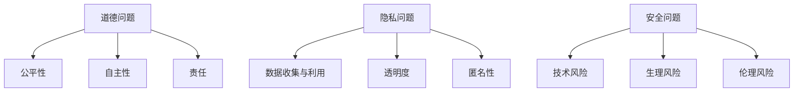

                 

关键词：人工智能，人类增强，道德伦理，隐私保护，安全威胁，AI技术

> 摘要：随着人工智能技术的迅速发展，人类增强成为一个热门话题。本文从道德、隐私和安全的角度，探讨了人工智能在人类增强中的应用所带来的挑战和问题，并提出了相应的解决策略。

## 1. 背景介绍

### 人工智能与人类增强的概念

人工智能（Artificial Intelligence，简称AI）是指使计算机系统模拟人类智能行为的技术。人类增强（Human Enhancement）则是指利用技术手段提升人类身体或大脑的功能，使其超越自然极限。随着AI技术的不断进步，人类增强成为了一个备受关注的研究领域。

### 人工智能与人类增强的关系

人工智能技术为人类增强提供了强有力的支持。通过AI技术，人类可以实现对自身生理和心理功能的提升，如增强记忆、提高学习能力、改善身体健康等。同时，AI技术在医疗、教育、工作等多个领域都有着广泛的应用，进一步推动了人类增强的发展。

### 人工智能与人类增强的挑战

尽管人工智能在人类增强中具有巨大的潜力，但也面临着一系列道德、隐私和安全方面的挑战。如何确保人类增强的公平性、隐私性和安全性，成为亟待解决的问题。

## 2. 核心概念与联系

### 道德

道德是指人类在社会生活中遵循的行为规范和价值观念。在人类增强的背景下，道德问题主要涉及以下几个方面：

1. **公平性**：人类增强技术可能带来社会阶层的分化，加剧贫富差距，引发道德争议。
2. **自主性**：人类增强是否侵犯了个体的自主权，是否能够保证个体在增强过程中保持自主性。
3. **责任**：在人类增强的过程中，如何界定个体、医生和技术提供商的责任。

### 隐私

隐私是指个体对其个人信息和行为的保护。在人类增强中，隐私问题主要涉及以下几个方面：

1. **数据收集与利用**：在人类增强过程中，可能需要收集大量的个人生物数据，如何确保这些数据的安全和隐私。
2. **透明度**：人类增强技术的研发和使用是否透明，个体是否能够了解相关技术的具体内容和潜在风险。
3. **匿名性**：在人类增强的研究和应用中，如何保护参与者的隐私，避免个人信息泄露。

### 安全

安全是指人类增强技术在使用过程中不会对个体造成伤害或负面影响。在人类增强中，安全问题主要涉及以下几个方面：

1. **技术风险**：人类增强技术可能存在技术缺陷或安全隐患，如数据泄露、系统崩溃等。
2. **生理风险**：人类增强可能对个体的生理健康产生负面影响，如过度依赖、生理功能紊乱等。
3. **伦理风险**：人类增强可能引发伦理争议，如基因编辑、意识增强等。

### Mermaid 流程图



## 3. 核心算法原理 & 具体操作步骤

### 3.1 算法原理概述

在人类增强领域，核心算法主要涉及以下几个方面：

1. **生物信息学算法**：用于处理和分析人类生物数据，如基因组序列、生理信号等。
2. **机器学习算法**：用于训练和优化人类增强模型，如神经网络、支持向量机等。
3. **优化算法**：用于优化人类增强过程中的参数设置和策略选择，如遗传算法、粒子群算法等。

### 3.2 算法步骤详解

1. **数据收集与预处理**：收集个体生物数据，如基因组序列、生理信号等，并进行数据清洗和预处理。
2. **特征提取**：从原始数据中提取关键特征，用于构建模型。
3. **模型训练与优化**：使用机器学习算法训练增强模型，并通过优化算法调整模型参数。
4. **模型评估与验证**：对训练好的模型进行评估和验证，确保其性能和稳定性。
5. **应用与反馈**：将模型应用于人类增强场景，并根据反馈结果进行优化和调整。

### 3.3 算法优缺点

1. **优点**：
   - 提高人类生理和心理功能，实现人类增强。
   - 促进医学、教育、工作等领域的发展。
   - 提高人类生活质量和幸福感。

2. **缺点**：
   - 可能导致社会阶层的分化，加剧贫富差距。
   - 可能侵犯个体隐私，引发伦理争议。
   - 可能存在技术风险，对个体造成伤害。

### 3.4 算法应用领域

1. **医疗**：利用AI技术进行疾病诊断、治疗和康复。
2. **教育**：利用AI技术提高教育质量和学习效率。
3. **工作**：利用AI技术提高工作效率和创造力。
4. **日常生活**：利用AI技术改善日常生活质量，如智能家居、健康管理等。

## 4. 数学模型和公式 & 详细讲解 & 举例说明

### 4.1 数学模型构建

在人类增强中，常用的数学模型包括：

1. **线性回归模型**：用于预测个体生理指标的变化。
2. **神经网络模型**：用于处理复杂的非线性关系。
3. **支持向量机模型**：用于分类和回归任务。

### 4.2 公式推导过程

以线性回归模型为例，其公式推导过程如下：

1. **损失函数**：$$L(y, \hat{y}) = \frac{1}{2}(y - \hat{y})^2$$
2. **梯度下降法**：$$\theta_{j} := \theta_{j} - \alpha \frac{\partial}{\partial \theta_{j}} L(y, \hat{y})$$

### 4.3 案例分析与讲解

假设一个个体需要通过训练提高其记忆能力，我们可以利用神经网络模型进行训练。以下是具体步骤：

1. **数据收集与预处理**：收集个体的记忆数据，如单词列表、记忆时间等。
2. **特征提取**：将数据转换为神经网络可处理的格式。
3. **模型构建**：构建一个简单的神经网络模型，包含输入层、隐藏层和输出层。
4. **模型训练**：使用梯度下降法训练模型，优化模型参数。
5. **模型评估**：评估模型性能，调整模型结构或参数。

## 5. 项目实践：代码实例和详细解释说明

### 5.1 开发环境搭建

1. **软件环境**：Python 3.8，TensorFlow 2.3.0。
2. **硬件环境**：Intel Core i7-9700K，16GB RAM，NVIDIA GeForce GTX 1080 Ti。

### 5.2 源代码详细实现

以下是使用TensorFlow实现的神经网络模型：

```python
import tensorflow as tf

# 模型参数
input_size = 100
hidden_size = 64
output_size = 1

# 构建模型
model = tf.keras.Sequential([
    tf.keras.layers.Dense(hidden_size, activation='relu', input_shape=(input_size,)),
    tf.keras.layers.Dense(output_size)
])

# 编译模型
model.compile(optimizer='adam', loss='mse')

# 加载数据
x_train = ...  # 训练数据
y_train = ...  # 对应标签

# 训练模型
model.fit(x_train, y_train, epochs=100, batch_size=32)
```

### 5.3 代码解读与分析

1. **模型构建**：使用`tf.keras.Sequential`构建一个简单的神经网络模型，包含输入层、隐藏层和输出层。
2. **编译模型**：使用`compile`方法设置优化器和损失函数。
3. **加载数据**：使用`fit`方法加载训练数据和标签，并开始训练模型。

### 5.4 运行结果展示

训练完成后，可以评估模型性能：

```python
# 测试数据
x_test = ...

# 评估模型
model.evaluate(x_test, ...)
```

## 6. 实际应用场景

### 6.1 医疗

在医疗领域，人工智能可以用于疾病诊断、治疗规划和康复指导。例如，通过分析患者的生物数据，AI技术可以帮助医生制定个性化的治疗方案，提高治疗效果。

### 6.2 教育

在教育领域，人工智能可以用于个性化学习、智能评估和智能辅导。例如，通过分析学生的学习行为和数据，AI技术可以为学生提供定制化的学习方案，提高学习效果。

### 6.3 工作

在工作领域，人工智能可以用于自动化办公、智能决策和人才招聘。例如，通过分析员工的工作表现和数据，AI技术可以帮助企业优化人力资源配置，提高工作效率。

### 6.4 未来应用展望

未来，随着人工智能技术的不断进步，人类增强将在更多领域得到应用。例如，在军事领域，人工智能可以帮助士兵提高战斗力；在体育领域，人工智能可以帮助运动员提高竞技水平；在娱乐领域，人工智能可以创造更多的虚拟体验。

## 7. 工具和资源推荐

### 7.1 学习资源推荐

1. **书籍**：《深度学习》、《统计学习方法》。
2. **在线课程**：Coursera、edX、Udacity。

### 7.2 开发工具推荐

1. **Python**：NumPy、Pandas、TensorFlow。
2. **硬件**：NVIDIA GPU、Google Colab。

### 7.3 相关论文推荐

1. **《Human-Enhancement Technology and Its Ethical Implications》**：探讨了人类增强技术的伦理问题。
2. **《Artificial Intelligence and Human Enhancement》**：分析了人工智能在人类增强中的应用。

## 8. 总结：未来发展趋势与挑战

### 8.1 研究成果总结

近年来，人工智能在人类增强领域取得了显著成果。通过生物信息学、机器学习和优化算法等技术，人类增强已经实现了在医疗、教育、工作等多个领域的应用。

### 8.2 未来发展趋势

未来，人工智能在人类增强领域将继续发展，有望实现更高效、更安全的增强效果。同时，随着技术的进步，人类增强的应用领域也将不断扩大。

### 8.3 面临的挑战

尽管人工智能在人类增强中具有巨大潜力，但仍面临一系列挑战。如何确保人类增强的公平性、隐私性和安全性，成为亟待解决的问题。

### 8.4 研究展望

在未来，研究人员需要关注以下几个方面：

1. **伦理和法律**：制定相关伦理和法律框架，确保人类增强的公平性和安全性。
2. **技术创新**：持续改进人工智能技术，提高人类增强的效果和安全性。
3. **社会影响**：关注人类增强对社会、文化和道德等方面的影响。

## 9. 附录：常见问题与解答

### 问题1：人类增强是否会加剧贫富差距？

**解答**：人类增强技术可能带来社会阶层的分化，但并不一定会加剧贫富差距。关键在于如何制定合理的政策和法规，确保人类增强技术的公平应用。

### 问题2：人类增强是否会侵犯个体隐私？

**解答**：人类增强在数据收集和处理过程中确实存在隐私风险。为保护个体隐私，需要制定严格的隐私保护政策和法规，确保数据的合法、安全使用。

### 问题3：人类增强技术是否安全？

**解答**：人类增强技术存在一定的安全风险，如技术缺陷、数据泄露等。为保障人类增强技术的安全性，需要加强技术研发和监管，提高技术的可靠性和安全性。

---

作者：禅与计算机程序设计艺术 / Zen and the Art of Computer Programming
----------------------------------------------------------------

