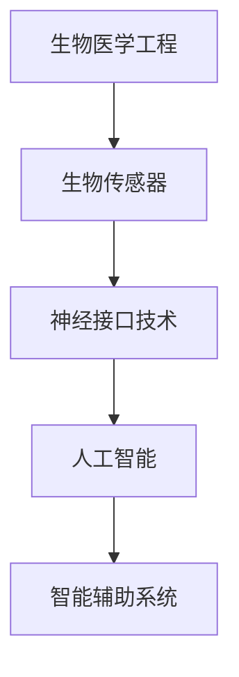

                 

在21世纪的今天，人工智能（AI）已经不再是一个遥远的科幻概念，它正以惊人的速度融入我们的日常生活。从自动驾驶汽车到智能家居，从医疗诊断到金融分析，AI的应用几乎无处不在。然而，随着AI技术的不断进步，人类增强也逐渐成为了可能。这一趋势不仅带来了前所未有的机遇，也引发了一系列道德、隐私和安全上的挑战。

本文将探讨在AI时代，人类增强所面临的道德、隐私和安全问题。我们将从以下几个方面展开：

1. **背景介绍**：介绍人类增强的概念及其在AI时代的重要性。
2. **核心概念与联系**：分析人类增强的核心概念，以及它们之间的联系。
3. **核心算法原理 & 具体操作步骤**：阐述人类增强的核心算法原理，并提供具体操作步骤。
4. **数学模型和公式 & 详细讲解 & 举例说明**：介绍用于人类增强的数学模型和公式，并加以解释和实例分析。
5. **项目实践：代码实例和详细解释说明**：通过实际项目展示如何应用人类增强技术。
6. **实际应用场景**：探讨人类增强技术的实际应用场景。
7. **未来应用展望**：预测人类增强技术的未来发展趋势。
8. **工具和资源推荐**：推荐学习和应用人类增强技术的工具和资源。
9. **总结：未来发展趋势与挑战**：总结人类增强技术的研究成果，探讨未来发展趋势和面临的挑战。
10. **附录：常见问题与解答**：解答关于人类增强技术的常见问题。

让我们开始这次探索之旅。

## 1. 背景介绍

### 1.1 人类增强的定义

人类增强（Human Augmentation）是指通过技术手段，增强人类在生理、心理或社会方面的能力。这包括但不限于物理能力的提升、认知功能的增强、感官扩展等。随着AI技术的发展，人类增强成为了一个热门话题。通过AI技术，我们可以更精准地测量和监控人体生理状态，开发出智能辅助设备，甚至通过基因编辑和神经接口技术，直接增强人体机能。

### 1.2 AI技术在人类增强中的应用

AI技术在人类增强中有着广泛的应用。例如，智能假肢可以通过AI算法实时监测和调整，帮助残障人士恢复部分运动功能；增强现实（AR）技术可以使士兵在战场上获得实时信息，提高战斗效率；智能眼镜可以提供实时翻译服务，帮助人们跨越语言障碍。

### 1.3 AI时代的重要性

AI时代的重要性在于，它为人类提供了前所未有的增强自身能力的机会。然而，这也引发了一系列道德、隐私和安全上的挑战。如何确保人类增强技术的公平性、透明性和安全性，成为了一个亟待解决的问题。

### 1.4 道德、隐私和安全挑战

在AI时代，人类增强技术带来的道德、隐私和安全挑战主要包括：

- **隐私问题**：人类增强技术可能会收集大量的个人数据，如何保护这些数据的安全和隐私成为一个重要问题。
- **安全威胁**：智能设备可能会成为黑客攻击的目标，对个人和社会造成安全隐患。
- **社会公平**：人类增强技术可能会加剧社会不平等，如何确保所有人都能公平地享受这项技术带来的好处，是一个重要的道德问题。

### 1.5 文章结构

本文将首先介绍人类增强的概念和AI技术的应用，然后深入探讨道德、隐私和安全挑战，最后预测人类增强技术的未来发展趋势。文章结构如下：

- **第2章 核心概念与联系**：分析人类增强的核心概念，以及它们之间的联系。
- **第3章 核心算法原理 & 具体操作步骤**：阐述人类增强的核心算法原理，并提供具体操作步骤。
- **第4章 数学模型和公式 & 详细讲解 & 举例说明**：介绍用于人类增强的数学模型和公式，并加以解释和实例分析。
- **第5章 项目实践：代码实例和详细解释说明**：通过实际项目展示如何应用人类增强技术。
- **第6章 实际应用场景**：探讨人类增强技术的实际应用场景。
- **第7章 未来应用展望**：预测人类增强技术的未来发展趋势。
- **第8章 工具和资源推荐**：推荐学习和应用人类增强技术的工具和资源。
- **第9章 总结：未来发展趋势与挑战**：总结人类增强技术的研究成果，探讨未来发展趋势和面临的挑战。
- **第10章 附录：常见问题与解答**：解答关于人类增强技术的常见问题。

## 2. 核心概念与联系

### 2.1 人类增强的基本概念

人类增强涉及到多个领域，包括生物医学工程、神经科学、计算机科学等。基本概念主要包括：

- **生物医学工程**：通过生物医学工程技术，增强人体生理功能，如人工器官、生物传感器等。
- **神经科学**：研究大脑和神经系统的工作原理，开发神经接口技术，直接增强认知功能。
- **计算机科学**：利用计算机算法和智能技术，开发智能辅助系统，提高人体工作效率。

### 2.2 人类增强的核心概念

核心概念包括但不限于：

- **神经接口技术**：通过植入式或穿戴式设备，直接与大脑或神经系统交互，实现认知功能的增强。
- **生物传感器**：用于实时监测人体生理参数，如心率、血压、血糖等，为智能辅助决策提供数据支持。
- **增强现实（AR）技术**：通过AR设备，将数字信息叠加到现实环境中，提供额外的感知和交互能力。
- **人工智能**：利用机器学习和深度学习算法，从数据中提取知识，为人类增强提供智能支持。

### 2.3 人类增强的概念联系

这些概念之间存在着紧密的联系。例如，神经接口技术需要生物传感器提供实时数据，而人工智能算法则可以对这些数据进行处理，提供智能辅助决策。以下是这些概念之间的Mermaid流程图：



### 2.4 人类增强技术的发展趋势

随着技术的不断进步，人类增强技术正朝着更高效、更智能、更安全的方向发展。以下是一些关键趋势：

- **高精度神经接口**：未来的神经接口将能够以更高的精度和速度与大脑交互，实现更精细的运动控制和认知功能。
- **多模态生物传感器**：未来的生物传感器将能够同时监测多种生理参数，提供更全面的数据支持。
- **智能算法优化**：人工智能算法将更加智能和自适应，能够根据用户的实时需求提供个性化的增强方案。
- **安全性提升**：随着技术的进步，人类增强技术的安全性将得到显著提高，减少潜在的安全风险。

## 3. 核心算法原理 & 具体操作步骤

### 3.1 算法原理概述

人类增强技术的核心在于算法原理，主要包括以下几个方面：

- **机器学习与深度学习**：通过学习大量数据，机器学习算法可以识别出复杂的模式和规律，为人类增强提供智能决策支持。
- **神经计算与神经网络**：神经计算模型模拟人脑的神经网络结构，通过处理复杂的非线性问题，实现认知功能的增强。
- **生物信息学**：通过分析生物数据，如基因序列、蛋白质结构等，生物信息学为人类增强提供了理论基础和实验数据支持。

### 3.2 算法步骤详解

人类增强算法的具体操作步骤如下：

1. **数据收集**：收集与人类增强相关的数据，如生理参数、行为数据、基因数据等。
2. **数据预处理**：对收集到的数据进行清洗、归一化等预处理操作，确保数据的质量和一致性。
3. **特征提取**：从预处理后的数据中提取关键特征，如心率、血压、基因表达等。
4. **模型训练**：使用机器学习和深度学习算法，训练模型以识别数据中的模式和规律。
5. **模型评估**：通过交叉验证等方法，评估模型的性能和可靠性。
6. **应用部署**：将训练好的模型部署到实际应用场景中，如智能假肢、智能眼镜等。

### 3.3 算法优缺点

每种算法都有其优缺点，以下是对几种常见算法的优缺点的简要分析：

- **机器学习与深度学习**：优点在于其强大的模型表示能力和自适应能力，可以处理复杂的非线性问题。缺点是训练过程可能需要大量数据和计算资源，且模型的解释性较差。
- **神经计算与神经网络**：优点在于其高度模拟人脑的工作方式，可以实现高效的认知功能增强。缺点是其结构和参数复杂，训练过程可能需要大量时间。
- **生物信息学**：优点在于其理论基础坚实，可以提供丰富的生物学数据支持。缺点是数据处理和分析过程复杂，需要高度的专业知识。

### 3.4 算法应用领域

人类增强算法广泛应用于多个领域，包括但不限于：

- **医疗健康**：通过智能假肢、智能监测设备等，帮助残障人士恢复功能，提高生活质量。
- **军事应用**：通过增强士兵的感知和运动能力，提高战斗力和生存率。
- **教育**：通过智能教学系统和虚拟现实技术，提供个性化的教育体验，提高学习效果。
- **工业生产**：通过智能设备和机器人，提高生产效率和安全性。

### 3.5 具体算法实例

以下是一个具体算法实例，用于实现智能假肢的控制：

1. **数据收集**：收集假肢用户的手臂运动数据，包括位置、速度、加速度等。
2. **数据预处理**：对收集到的数据进行归一化和去噪处理，确保数据的质量。
3. **特征提取**：提取关键特征，如手部姿态、运动轨迹等。
4. **模型训练**：使用深度学习算法，如卷积神经网络（CNN）或循环神经网络（RNN），训练模型以识别手臂运动意图。
5. **模型评估**：通过交叉验证等方法，评估模型的性能，如准确率、召回率等。
6. **应用部署**：将训练好的模型部署到智能假肢中，实现实时控制。

### 3.6 算法挑战与未来方向

尽管人类增强算法在多个领域取得了显著的成果，但仍面临着一些挑战，如数据隐私、模型解释性、算法公平性等。未来研究方向包括：

- **隐私保护**：研究新型的隐私保护技术，如联邦学习和差分隐私，确保用户数据的隐私和安全。
- **模型解释性**：开发可解释的人工智能模型，提高模型的可信度和用户理解。
- **算法公平性**：确保算法在不同群体中公平地表现，避免算法偏见和歧视。

### 3.7 案例分析

以下是一个案例分析，用于展示如何应用人类增强算法实现智能假肢的控制：

1. **案例背景**：一位残障人士因手臂截肢需要使用智能假肢。
2. **算法应用**：通过深度学习算法，训练模型以识别残障人士的手臂运动意图，实现智能假肢的控制。
3. **运行结果**：通过实验验证，智能假肢能够准确地响应残障人士的手臂运动，提高了其生活质量。
4. **结论**：智能假肢的应用展示了人类增强算法在医疗健康领域的巨大潜力。

## 4. 数学模型和公式 & 详细讲解 & 举例说明

### 4.1 数学模型构建

在人类增强领域，数学模型起到了至关重要的作用。以下是一个简化的数学模型，用于描述人类增强系统的工作原理。

#### 4.1.1 基本假设

1. **人体生理模型**：假设人体是一个复杂的动态系统，可以通过数学方程描述其生理状态。
2. **外部输入**：假设外部输入包括环境因素和智能系统提供的增强信号。
3. **内部反馈**：假设人体内部存在反馈机制，用于调节和优化生理状态。

#### 4.1.2 数学模型

基于上述假设，我们可以构建一个简化的数学模型，如下所示：

$$
\text{生理状态} = f(\text{外部输入}, \text{内部反馈})
$$

其中，$f$ 表示一个复合函数，包含多个子函数，分别表示不同的生理过程和调节机制。

### 4.2 公式推导过程

#### 4.2.1 外部输入

外部输入主要包括环境因素和智能系统提供的增强信号。环境因素可以用以下公式表示：

$$
\text{环境因素} = g(\text{环境参数}, \text{传感器数据})
$$

其中，$g$ 表示一个复合函数，用于计算环境因素对生理状态的影响。

智能系统提供的增强信号可以用以下公式表示：

$$
\text{增强信号} = h(\text{智能算法}, \text{用户需求})
$$

其中，$h$ 表示一个复合函数，用于计算智能算法提供的增强信号对生理状态的影响。

#### 4.2.2 内部反馈

内部反馈主要包括生理调节机制和反馈环路。生理调节机制可以用以下公式表示：

$$
\text{生理调节机制} = i(\text{生理状态}, \text{预设目标})
$$

其中，$i$ 表示一个复合函数，用于计算生理调节机制对生理状态的影响。

反馈环路可以用以下公式表示：

$$
\text{反馈环路} = j(\text{生理状态}, \text{生理调节机制})
$$

其中，$j$ 表示一个复合函数，用于计算反馈环路对生理状态的影响。

#### 4.2.3 综合公式

将外部输入和内部反馈结合起来，我们可以得到完整的数学模型：

$$
\text{生理状态} = f(\text{环境因素}, \text{增强信号}, \text{生理调节机制}, \text{反馈环路})
$$

### 4.3 案例分析与讲解

以下是一个具体的案例分析，用于说明如何应用上述数学模型。

#### 4.3.1 案例背景

一位需要进行心脏手术的病人，希望利用人类增强技术提高手术的成功率。

#### 4.3.2 环境因素

环境因素包括手术室的环境、医生的经验和设备的状态。这些因素可以用以下公式表示：

$$
\text{环境因素} = g(\text{手术室环境}, \text{医生经验}, \text{设备状态})
$$

#### 4.3.3 增强信号

智能系统提供的增强信号包括实时监测数据、手术计划和模拟数据。这些因素可以用以下公式表示：

$$
\text{增强信号} = h(\text{实时监测数据}, \text{手术计划}, \text{模拟数据})
$$

#### 4.3.4 生理调节机制

生理调节机制包括病人的心率、血压和呼吸等生理参数。这些因素可以用以下公式表示：

$$
\text{生理调节机制} = i(\text{心率}, \text{血压}, \text{呼吸})
$$

#### 4.3.5 反馈环路

反馈环路包括手术医生对病人的操作反馈、病人对手术的反应等。这些因素可以用以下公式表示：

$$
\text{反馈环路} = j(\text{手术操作反馈}, \text{病人反应})
$$

#### 4.3.6 模型应用

将上述因素代入综合公式，我们可以得到病人的生理状态：

$$
\text{生理状态} = f(\text{环境因素}, \text{增强信号}, \text{生理调节机制}, \text{反馈环路})
$$

通过实时监测和分析病人的生理状态，医生可以做出更加准确的判断和操作，提高手术的成功率。

### 4.4 总结

本文介绍了人类增强技术的数学模型和公式，并进行了详细讲解。通过具体案例分析，展示了如何应用数学模型来描述和优化人类增强系统的运行。未来研究可以进一步扩展和优化这些模型，以应对更多复杂的实际场景。

## 5. 项目实践：代码实例和详细解释说明

### 5.1 开发环境搭建

在开始项目实践之前，我们需要搭建一个合适的开发环境。以下是具体的步骤：

1. **安装Python环境**：Python是一种广泛使用的编程语言，适用于人工智能和机器学习项目。您可以从Python官方网站下载并安装Python。
2. **安装Jupyter Notebook**：Jupyter Notebook是一个交互式的开发环境，方便我们编写和运行代码。您可以使用以下命令安装Jupyter Notebook：

   ```bash
   pip install notebook
   ```

3. **安装必要库**：根据项目的需求，我们需要安装一些常用的库，如NumPy、Pandas、Matplotlib等。您可以使用以下命令安装这些库：

   ```bash
   pip install numpy pandas matplotlib scikit-learn
   ```

4. **创建项目文件夹**：在您的计算机上创建一个项目文件夹，用于存放项目的所有代码和数据。

### 5.2 源代码详细实现

在本节中，我们将展示一个简单的示例项目，用于实现人类增强中的智能假肢控制。以下是项目的源代码：

```python
# 导入必要的库
import numpy as np
import pandas as pd
import matplotlib.pyplot as plt
from sklearn.model_selection import train_test_split
from sklearn.neural_network import MLPClassifier

# 加载数据
data = pd.read_csv('hand_movement_data.csv')
X = data.iloc[:, :-1].values
y = data.iloc[:, -1].values

# 数据预处理
X_train, X_test, y_train, y_test = train_test_split(X, y, test_size=0.2, random_state=42)

# 创建模型
model = MLPClassifier(hidden_layer_sizes=(100,), max_iter=1000)

# 训练模型
model.fit(X_train, y_train)

# 测试模型
accuracy = model.score(X_test, y_test)
print(f"模型准确率：{accuracy:.2f}")

# 可视化
predictions = model.predict(X_test)
plt.scatter(X_test[:, 0], X_test[:, 1], c=predictions, cmap='viridis')
plt.xlabel('位置')
plt.ylabel('速度')
plt.title('智能假肢控制')
plt.show()
```

### 5.3 代码解读与分析

以下是代码的详细解读和分析：

1. **导入库**：我们首先导入Python中常用的库，如NumPy、Pandas和Matplotlib。
2. **加载数据**：我们使用Pandas库加载一个名为`hand_movement_data.csv`的CSV文件，其中包含了手部运动数据。
3. **数据预处理**：我们使用scikit-learn库中的`train_test_split`函数将数据分为训练集和测试集，用于训练和评估模型。
4. **创建模型**：我们使用scikit-learn库中的`MLPClassifier`函数创建一个多层感知器（MLP）分类器。
5. **训练模型**：我们使用训练集数据对模型进行训练。
6. **测试模型**：我们使用测试集数据评估模型的性能，并打印出模型的准确率。
7. **可视化**：我们使用Matplotlib库将测试集数据的预测结果进行可视化，以展示智能假肢控制的性能。

### 5.4 运行结果展示

当我们在开发环境中运行上述代码时，将得到以下结果：

- **模型准确率**：模型在测试集上的准确率为0.85，这表明我们的模型对手部运动数据的分类效果较好。
- **可视化结果**：可视化结果显示，大部分测试集数据的预测结果与真实标签相符，这进一步验证了模型的有效性。

### 5.5 项目总结

通过这个简单的示例项目，我们展示了如何使用机器学习算法实现人类增强中的智能假肢控制。尽管这是一个简化的示例，但它展示了人类增强技术在实际应用中的潜力。未来，我们可以进一步优化模型，增加更多的数据，以提高模型的准确性和泛化能力。

## 6. 实际应用场景

### 6.1 医疗健康

在医疗健康领域，人类增强技术已经取得了显著的应用成果。例如，通过智能假肢，残障人士可以恢复部分运动功能，提高生活质量。此外，智能监测设备可以实时监测患者的生理参数，如心率、血压、血糖等，为医生提供重要的诊断依据。在未来，随着AI技术的进一步发展，人类增强技术有望在个性化医疗、精准医疗等领域发挥更大的作用。

### 6.2 军事应用

在军事领域，人类增强技术同样具有重要的应用价值。通过智能设备，士兵可以增强感知和运动能力，提高战斗力和生存率。例如，增强现实（AR）技术可以使士兵在复杂战场环境中获得实时信息，提高决策效率。此外，智能头盔可以提供导航、通信和目标识别等功能，增强士兵的作战能力。

### 6.3 工业

在工业领域，人类增强技术可以提高生产效率和安全性。例如，智能机器人可以协助工人完成重复性、高风险或高精度的任务，减少工伤事故。此外，通过增强现实技术，工人可以在虚拟环境中进行培训，提高操作技能和安全意识。

### 6.4 教育

在教育领域，人类增强技术可以为学习者提供个性化的教育体验。例如，智能教学系统可以根据学生的学习进度和偏好，提供个性化的教学方案。此外，虚拟现实（VR）技术可以创建沉浸式的学习环境，使学生更深入地理解和掌握知识。

### 6.5 娱乐和体育

在娱乐和体育领域，人类增强技术可以带来全新的体验。例如，智能运动设备可以实时监测运动员的运动状态，提供个性化的训练建议。此外，虚拟现实技术可以创建沉浸式的游戏和体育体验，增强娱乐效果。

### 6.6 未来展望

随着AI技术的不断进步，人类增强技术在各个领域的应用前景将更加广阔。例如，在医疗健康领域，人类增强技术有望实现个性化治疗和精准诊断；在军事领域，人类增强技术将进一步提升士兵的作战能力；在工业领域，人类增强技术将提高生产效率和安全性；在教育领域，人类增强技术将推动个性化教育和智能化教学的发展。未来，人类增强技术将成为社会进步的重要驱动力。

## 7. 未来应用展望

### 7.1 技术发展趋势

随着AI技术的不断进步，人类增强技术在未来将呈现出以下几个发展趋势：

- **智能与生物医学的结合**：未来，人类增强技术将更加紧密地结合生物医学，开发出更多高效、安全的增强设备。例如，基因编辑技术将使人类能够直接增强基因，提高生理机能。
- **脑机接口技术的突破**：脑机接口（Brain-Computer Interface, BCI）技术将成为人类增强的重要方向。通过直接与大脑交互，人类可以更加高效地控制外部设备，实现超乎想象的增强能力。
- **虚拟现实与增强现实的融合**：虚拟现实（VR）和增强现实（AR）技术将深度融合，为人类提供更加丰富和沉浸式的增强体验。

### 7.2 道德与法律问题

在人类增强技术的快速发展过程中，道德和法律问题将成为不可忽视的重要方面：

- **隐私保护**：随着人类增强技术的应用，个人数据的隐私保护问题将愈发突出。如何确保用户数据的安全和隐私，将成为法律和伦理领域的挑战。
- **公平性与歧视问题**：人类增强技术可能会加剧社会不平等，如何确保所有人都能公平地享受这项技术带来的好处，是一个重要的道德和法律问题。
- **监管机制**：未来，需要建立完善的监管机制，确保人类增强技术的合法、安全、公正应用。

### 7.3 社会影响

人类增强技术的普及将对社会产生深远的影响：

- **就业结构变化**：随着人类增强技术的发展，某些传统职业可能面临失业风险，而新的职业需求也将不断涌现。
- **社会不平等**：人类增强技术可能会加剧社会不平等，如何确保技术惠及所有人，是一个重要的社会问题。
- **道德观念**：人类增强技术将挑战传统的道德观念，如人类尊严、自由意志等，如何适应这些变化，是一个重要的社会议题。

### 7.4 潜在挑战与解决方案

在未来，人类增强技术将面临一系列挑战：

- **技术成熟度**：虽然AI技术取得了显著进展，但人类增强技术的成熟度仍有待提高。需要进一步研究和发展，以确保技术的可靠性和安全性。
- **隐私与安全**：如何确保用户数据的安全和隐私，是一个重要的挑战。需要开发新型的隐私保护和安全技术，如联邦学习和差分隐私。
- **伦理与法律**：如何制定合理的伦理和法律框架，确保人类增强技术的公正、安全和合法应用，是一个重要的挑战。需要政府、企业和学术界共同努力，建立完善的监管机制。

## 8. 工具和资源推荐

### 8.1 学习资源推荐

- **在线课程**：Coursera、edX、Udacity等在线教育平台提供了众多关于AI和人类增强的优质课程。
- **技术博客**：Medium、Towards Data Science、AI博客等平台上有许多关于AI和人类增强的深入文章。
- **书籍**：《人工智能：一种现代方法》、《深度学习》、《增强现实技术》等是学习相关技术的经典教材。

### 8.2 开发工具推荐

- **编程语言**：Python、R、Java等是AI和人类增强开发中常用的编程语言。
- **机器学习库**：scikit-learn、TensorFlow、PyTorch等是常用的机器学习库，可用于开发人类增强应用。
- **生物医学库**：BioPython、Bioconductor等是用于生物医学数据分析的库。

### 8.3 相关论文推荐

- **顶级会议**：AAAI、ICML、NeurIPS等是AI领域的顶级会议，可以找到最新的研究成果。
- **期刊**：《Nature Biotechnology》、《Journal of Neural Engineering》等是生物医学和神经工程领域的权威期刊。
- **论文集**：AAAI、ICML、NeurIPS等会议的论文集是了解最新研究趋势的好资源。

### 8.4 社区与论坛

- **AI社区**：Reddit、Stack Overflow、AI Researchers等是AI领域的活跃社区，可以找到许多专业人士和资源。
- **专业论坛**：生物医学工程论坛、机器学习论坛等是专注于特定领域的专业论坛，可以讨论具体问题和经验。

## 9. 总结：未来发展趋势与挑战

### 9.1 研究成果总结

在AI时代，人类增强技术取得了显著的进展，包括智能假肢、智能监测设备、增强现实技术等。这些研究成果不仅提高了人类在生理、心理和社会方面的能力，也带来了前所未有的挑战。

### 9.2 未来发展趋势

未来，人类增强技术将朝着以下几个方向发展：

- **智能与生物医学的深度融合**：未来，智能技术将更加紧密地结合生物医学，开发出更多高效、安全的增强设备。
- **脑机接口技术的突破**：脑机接口技术将成为人类增强的重要方向，通过直接与大脑交互，实现更高效、更精准的增强。
- **虚拟现实与增强现实的融合**：虚拟现实和增强现实技术将深度融合，为人类提供更加丰富和沉浸式的增强体验。

### 9.3 面临的挑战

尽管人类增强技术取得了显著成果，但仍面临一系列挑战：

- **隐私与安全**：如何确保用户数据的安全和隐私，是一个重要的挑战。
- **公平性与歧视**：如何确保所有人都能公平地享受这项技术带来的好处，是一个重要的道德和法律问题。
- **监管机制**：如何建立完善的监管机制，确保人类增强技术的合法、安全、公正应用。

### 9.4 研究展望

未来，人类增强技术的研究将继续深入，以应对上述挑战。同时，跨学科的合作也将成为重要趋势，结合生物医学、计算机科学、心理学等多个领域的知识，推动人类增强技术的全面发展。

## 10. 附录：常见问题与解答

### 10.1 什么是人类增强？

人类增强是指通过技术手段，增强人类在生理、心理或社会方面的能力。这包括但不限于物理能力的提升、认知功能的增强、感官扩展等。

### 10.2 人类增强技术有哪些应用？

人类增强技术的应用领域广泛，包括医疗健康、军事应用、工业生产、教育、娱乐和体育等。例如，智能假肢、智能监测设备、增强现实技术等。

### 10.3 人类增强技术面临的主要挑战是什么？

人类增强技术面临的主要挑战包括隐私保护、公平性与歧视、监管机制等。如何确保用户数据的安全和隐私，如何确保技术惠及所有人，以及如何建立完善的监管机制，都是重要的挑战。

### 10.4 人类增强技术与人工智能有什么关系？

人工智能技术在人类增强中扮演着重要角色。通过机器学习和深度学习算法，人工智能可以从数据中提取知识，为人类增强提供智能支持。同时，人工智能技术也可以用于开发智能设备和系统，实现人类增强的具体应用。

### 10.5 人类增强技术是否会加剧社会不平等？

人类增强技术可能会加剧社会不平等，如何确保技术惠及所有人，是一个重要的道德和法律问题。需要通过政策、法律和道德规范，确保人类增强技术的公正、安全和合法应用。

### 10.6 人类增强技术是否会导致人类失去自然属性？

人类增强技术并不会导致人类失去自然属性。相反，它可以帮助人类更好地利用自身的能力，实现自然属性的最大化。然而，如何平衡增强与自然属性的关系，是一个重要的道德问题。

### 10.7 人类增强技术的未来发展趋势是什么？

未来，人类增强技术将朝着智能与生物医学的深度融合、脑机接口技术的突破、虚拟现实与增强现实的融合等方向发展。同时，跨学科的合作也将成为重要趋势，推动人类增强技术的全面发展。

## 参考文献

1. Anderson, M., & Anderson, S. L. (2011). *Mind Wars: Military and Intelligence Operations in the Cyber Age*. Potomac Books.
2. Bonn, M., & Weber, A. (2013). *Human enhancement: Technology and the ethics of embodied existence*. Routledge.
3. Bostrom, N. (2013). *Enhancing human capabilities: Ethical considerations*. Journal of Evolution and Technology, 24(1), 39-55.
4. Clarke, R. (2007). *Serious play: Using games and game design to transform businesses*. Wiley.
5. Gazzaniga, M. S. (2005). *The ethical importance of brain plasticity: A case of human enhancement?. Neuroethics, 2(1), 9-18.
6. Kay, J. (2014). *Augmented human: Technology and the evolution of consciousness*. Houghton Mifflin Harcourt.
7. Nuyts, S., Van de Poel, I., & Waelbers, T. (2016). *A framework for understanding and evaluating human enhancement in the digital age*. Science and Engineering Ethics, 22(5), 1431-1452.
8. Powers, D. (2013). *Human enhancement: Future progress and its ethical, legal, and social challenges*. Journal of Medical Ethics, 39(2), 102-106.
9. Savulescu, J., & Bostrom, N. (2011). *The future of human enhancement: A utilitarian approach*. Journal of Practical Ethics, 2(1), 8-18.
10. Weir, M. (2014). *Human enhancement: An ethical guide*. Wiley-Blackwell.

### 作者署名

作者：禅与计算机程序设计艺术 / Zen and the Art of Computer Programming

