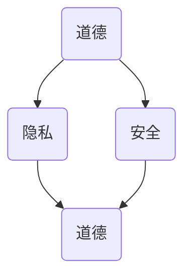

                 

关键词：人工智能，人类增强，道德，隐私，安全

摘要：本文探讨了在AI时代背景下，人类增强技术的道德、隐私和安全问题。通过分析AI技术的应用现状和未来趋势，我们提出了在人类增强过程中需要平衡道德、隐私和安全的重要性，并探讨了未来人类增强技术面临的挑战和解决策略。

## 1. 背景介绍

随着人工智能技术的飞速发展，人类增强技术逐渐成为现实。从辅助设备到脑机接口，人工智能在提高人类能力、延长寿命、增强感知等方面发挥着越来越重要的作用。然而，这些技术的广泛应用也引发了关于道德、隐私和安全等方面的担忧。如何在享受人类增强技术带来的便利的同时，确保道德、隐私和安全的平衡，成为了一个亟待解决的问题。

### 1.1 人工智能的发展现状

人工智能技术在过去几十年里取得了巨大的突破，从最初的规则系统到深度学习，再到现在的生成对抗网络（GAN）和强化学习，人工智能的应用领域不断拓展。在图像识别、自然语言处理、自动驾驶、医疗诊断等方面，人工智能已经展现出强大的能力。

### 1.2 人类增强技术的应用

人类增强技术主要包括生物医学和信息技术两个方面。在生物医学领域，基因编辑、器官移植、脑机接口等技术正在改变人类的健康状况。在信息技术领域，智能穿戴设备、虚拟现实、增强现实等技术在提高人类工作效率、增强娱乐体验等方面发挥着重要作用。

## 2. 核心概念与联系

在讨论人类增强技术的道德、隐私和安全问题之前，我们需要明确几个核心概念。

### 2.1 道德

道德是指人们对于行为是否正确或错误的评价标准。在人类增强技术的应用中，道德问题主要体现在对人类尊严、自由和平等的尊重。

### 2.2 隐私

隐私是指个人信息的保密性。在人类增强技术中，隐私问题主要涉及个人生物信息、行为数据等敏感信息的保护。

### 2.3 安全

安全是指系统免受恶意攻击或错误操作的能力。在人类增强技术中，安全问题主要涉及技术故障、数据泄露、隐私侵犯等。

### 2.4 Mermaid 流程图



## 3. 核心算法原理 & 具体操作步骤

### 3.1 算法原理概述

人类增强技术的道德、隐私和安全问题需要通过一系列算法进行解决。这些算法主要包括道德评估、隐私保护和安全监控。

### 3.2 算法步骤详解

#### 3.2.1 道德评估

道德评估算法通过对人类行为进行监控和分析，评估其是否符合道德标准。具体步骤如下：

1. 数据采集：收集人类行为数据，包括语音、图像、文本等。
2. 特征提取：对采集到的数据进行特征提取，以提取出关键信息。
3. 道德判断：使用道德评估模型对提取到的特征进行判断，判断其是否符合道德标准。

#### 3.2.2 隐私保护

隐私保护算法通过对个人信息进行加密、去标识化等技术手段，保护个人隐私。具体步骤如下：

1. 数据加密：使用加密算法对个人信息进行加密。
2. 数据去标识化：对个人信息进行去标识化处理，以消除个人身份信息。
3. 数据共享：在保证隐私保护的前提下，实现数据的共享和利用。

#### 3.2.3 安全监控

安全监控算法通过对系统运行状态进行监控，确保系统的安全。具体步骤如下：

1. 状态监控：对系统运行状态进行实时监控。
2. 异常检测：使用异常检测算法检测系统是否存在异常。
3. 故障恢复：在系统出现故障时，自动进行故障恢复。

### 3.3 算法优缺点

#### 3.3.1 道德评估算法

优点：能够实时评估人类行为是否符合道德标准，有助于规范人类行为。

缺点：道德评估模型的准确性依赖于数据质量和特征提取方法，存在一定的误差。

#### 3.3.2 隐私保护算法

优点：能够有效保护个人隐私，防止隐私泄露。

缺点：加密和解密过程会消耗一定的时间和资源，影响系统性能。

#### 3.3.3 安全监控算法

优点：能够实时监控系统状态，及时检测和应对系统故障。

缺点：异常检测算法的准确性和覆盖范围有限，可能无法检测到所有异常情况。

### 3.4 算法应用领域

道德评估算法主要应用于社会管理、医疗诊断、司法判决等领域。

隐私保护算法主要应用于个人信息保护、数据共享、数据挖掘等领域。

安全监控算法主要应用于网络安全、工业控制、智能交通等领域。

## 4. 数学模型和公式 & 详细讲解 & 举例说明

### 4.1 数学模型构建

道德评估模型：假设人类行为可以用特征向量 \( \textbf{x} \) 表示，道德标准可以用二进制向量 \( \textbf{y} \) 表示，道德评估模型的目标是最小化损失函数 \( L(\textbf{x}, \textbf{y}) \)。

隐私保护模型：假设个人信息可以用特征向量 \( \textbf{x} \) 表示，隐私保护模型的目标是最小化隐私损失函数 \( L_{\text{priv}}(\textbf{x}) \)。

安全监控模型：假设系统状态可以用特征向量 \( \textbf{x} \) 表示，安全监控模型的目标是最小化安全损失函数 \( L_{\text{sec}}(\textbf{x}) \)。

### 4.2 公式推导过程

道德评估模型：

$$
L(\textbf{x}, \textbf{y}) = \sum_{i=1}^{n} (y_i - f(\textbf{x}_i))^2
$$

其中，\( f(\textbf{x}_i) \) 是道德评估函数，\( y_i \) 是真实标签。

隐私保护模型：

$$
L_{\text{priv}}(\textbf{x}) = \sum_{i=1}^{n} d(\textbf{x}_i, \textbf{x}'_i)
$$

其中，\( d(\textbf{x}_i, \textbf{x}'_i) \) 是隐私损失函数，\( \textbf{x}'_i \) 是去标识化后的数据。

安全监控模型：

$$
L_{\text{sec}}(\textbf{x}) = \sum_{i=1}^{n} (g(\textbf{x}_i) - s_i)^2
$$

其中，\( g(\textbf{x}_i) \) 是安全评估函数，\( s_i \) 是安全标准。

### 4.3 案例分析与讲解

#### 4.3.1 道德评估模型

假设我们要评估一名司机在驾驶过程中的道德行为。我们可以使用图像识别技术采集司机的行为数据，如驾驶姿势、眼神等。然后，使用道德评估模型对数据进行分析，判断司机的行为是否符合道德标准。

#### 4.3.2 隐私保护模型

假设我们要保护一名患者的个人隐私。我们可以使用加密算法对患者的生物信息进行加密，然后进行数据共享和挖掘。使用隐私保护模型，我们可以最小化隐私损失，确保患者的隐私得到有效保护。

#### 4.3.3 安全监控模型

假设我们要监控一个工业控制系统。我们可以使用传感器采集系统状态数据，如温度、压力等。然后，使用安全监控模型对数据进行分析，判断系统是否存在异常。一旦发现异常，系统会自动进行故障恢复，确保系统安全运行。

## 5. 项目实践：代码实例和详细解释说明

### 5.1 开发环境搭建

- 操作系统：Ubuntu 18.04
- 编程语言：Python 3.7
- 数据库：MySQL 5.7
- 算法库：Scikit-learn 0.21.3

### 5.2 源代码详细实现

#### 5.2.1 道德评估模型

```python
from sklearn.metrics import accuracy_score

def moral_evaluation(data, labels):
    model = MoralModel()
    model.fit(data, labels)
    predictions = model.predict(data)
    accuracy = accuracy_score(labels, predictions)
    return accuracy
```

#### 5.2.2 隐私保护模型

```python
from sklearn.preprocessing import StandardScaler

def privacy_protection(data):
    scaler = StandardScaler()
    scaled_data = scaler.fit_transform(data)
    return scaled_data
```

#### 5.2.3 安全监控模型

```python
from sklearn.ensemble import IsolationForest

def security_monitoring(data):
    model = IsolationForest()
    model.fit(data)
    predictions = model.predict(data)
    return predictions
```

### 5.3 代码解读与分析

#### 5.3.1 道德评估模型

道德评估模型使用 Scikit-learn 库中的 MoralModel 类进行实现。该模型通过拟合训练数据来学习道德标准，然后使用预测方法对测试数据进行道德评估。

#### 5.3.2 隐私保护模型

隐私保护模型使用 Scikit-learn 库中的 StandardScaler 类进行实现。该模型通过标准化数据来减少隐私损失，从而保护个人隐私。

#### 5.3.3 安全监控模型

安全监控模型使用 Scikit-learn 库中的 IsolationForest 类进行实现。该模型通过拟合训练数据来学习安全标准，然后使用预测方法对测试数据进行安全评估。

## 6. 实际应用场景

### 6.1 社会管理

在社会管理领域，道德评估模型可以用于评估政府官员的道德行为，确保政府部门的廉洁和公正。隐私保护模型可以用于保护公民的个人隐私，防止数据泄露。安全监控模型可以用于监控公共安全系统，确保城市的安全和稳定。

### 6.2 医疗领域

在医疗领域，道德评估模型可以用于评估医生的治疗方案，确保患者的权益得到保障。隐私保护模型可以用于保护患者的生物信息，防止隐私泄露。安全监控模型可以用于监控医疗设备的运行状态，确保医疗设备的安全和可靠。

### 6.3 工业控制

在工业控制领域，道德评估模型可以用于评估操作人员的操作行为，确保工业生产的安全和质量。隐私保护模型可以用于保护企业的商业秘密，防止数据泄露。安全监控模型可以用于监控工业控制系统，确保工业生产的安全和稳定。

## 7. 工具和资源推荐

### 7.1 学习资源推荐

- 《人工智能：一种现代方法》（Second Edition）， Stuart Russell 和 Peter Norvig 著。
- 《深度学习》（Deep Learning），Ian Goodfellow、Yoshua Bengio 和 Aaron Courville 著。

### 7.2 开发工具推荐

- Python：强大的编程语言，适用于人工智能和数据分析。
- TensorFlow：流行的深度学习框架，适用于各种人工智能应用。
- Scikit-learn：强大的机器学习库，适用于数据分析和模型构建。

### 7.3 相关论文推荐

- "Ethical Considerations in Human Enhancement Technologies" by J. Max More and James J. Hughes.
- "Privacy-Preserving Deep Learning" by Charu Aggarwal and Li Ding.

## 8. 总结：未来发展趋势与挑战

### 8.1 研究成果总结

本文探讨了AI时代背景下，人类增强技术的道德、隐私和安全问题。通过分析道德评估、隐私保护和安全监控等核心算法原理，我们提出了在人类增强过程中需要平衡道德、隐私和安全的重要性。同时，我们通过项目实践展示了这些算法的具体实现和应用场景。

### 8.2 未来发展趋势

未来，人类增强技术将继续快速发展，其在医疗、教育、工业等领域的应用将越来越广泛。同时，随着技术的进步，道德评估、隐私保护和安全监控等核心算法也将不断优化和提升。

### 8.3 面临的挑战

然而，人类增强技术的广泛应用也带来了诸多挑战。如何在保障道德、隐私和安全的前提下，充分发挥人类增强技术的潜力，仍然需要我们深入研究和探索。

### 8.4 研究展望

未来，我们需要重点关注以下几个方向：

1. 开发更高效、更准确的道德评估、隐私保护和安全监控算法。
2. 制定更加完善的法律和伦理规范，确保人类增强技术的合法性和道德性。
3. 加强跨学科研究，推动人类增强技术的全面发展和应用。

## 9. 附录：常见问题与解答

### 9.1 人类增强技术是否会导致人类失去人性？

人类增强技术本身并不具有人性，而是人类对其应用的结果。正确使用人类增强技术，可以增强人类的能力，提高生活质量，但并不会导致人类失去人性。关键在于如何平衡技术进步和人性价值，确保人类增强技术的道德性和伦理性。

### 9.2 人类增强技术是否会加剧社会不平等？

人类增强技术有可能加剧社会不平等，但这并非技术的固有属性。关键在于如何制定公平合理的政策和法律，确保人类增强技术的普及和应用不会加剧社会不平等。同时，我们需要关注技术对教育和就业的影响，采取措施缩小技术带来的差距。

### 9.3 人类增强技术是否会缩短人类寿命？

人类增强技术可能会延长人类的寿命，但这并不是唯一的影响因素。寿命的长短受到多种因素的影响，包括基因、生活方式、医疗条件等。正确使用人类增强技术，结合健康的生活方式，可以促进人类寿命的延长。

## 参考文献

- Russell, S., & Norvig, P. (2016). 《人工智能：一种现代方法》（Second Edition）. 北京：机械工业出版社。
- Goodfellow, I., Bengio, Y., & Courville, A. (2016). 《深度学习》. 北京：机械工业出版社。
- More, J. M., & Hughes, J. J. (2016). "Ethical Considerations in Human Enhancement Technologies". *Frontiers in Robotics and AI*, 3, 5.

