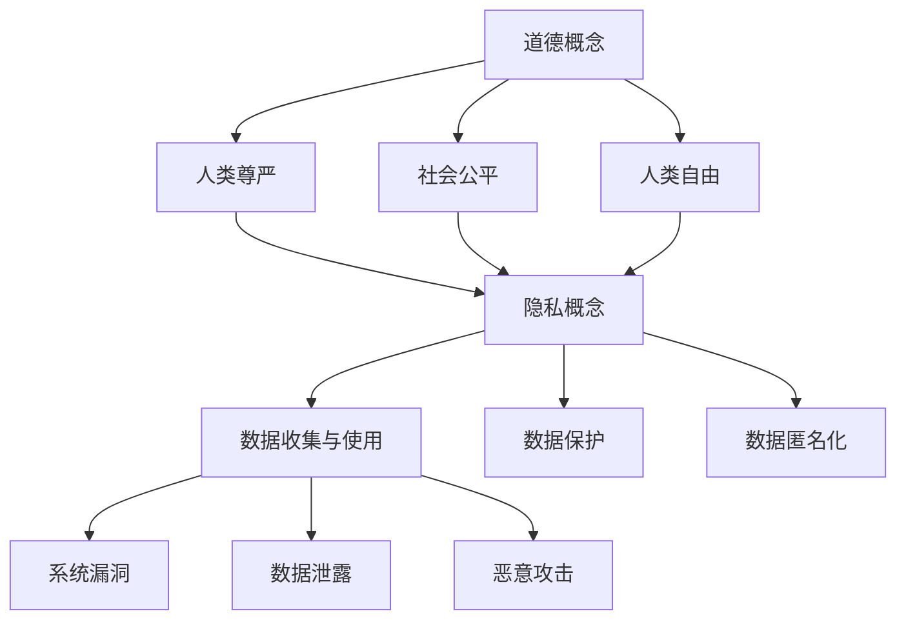

                 

关键词：人工智能、人类增强、道德、隐私、安全、未来

> 摘要：本文深入探讨了AI时代人类增强的道德、隐私和安全问题。通过分析相关理论和实例，讨论了AI技术在人类增强领域的应用及其带来的挑战，旨在为未来的研究和实践提供指导。

## 1. 背景介绍

随着人工智能技术的迅猛发展，人类在许多领域都得到了显著的增强。从简单的工具辅助到复杂的认知能力提升，人工智能已经逐步成为人类生活不可或缺的一部分。然而，这种增强并非没有代价，道德、隐私和安全问题成为了我们需要关注和解决的问题。

### 1.1 人工智能的发展历程

人工智能的发展可以追溯到20世纪50年代，当时计算机科学家提出了“智能机器”的概念。随着计算能力的提升和数据量的爆炸式增长，人工智能技术取得了显著的进展。从早期的规则系统、知识表示到近年来的深度学习和强化学习，人工智能已经展现出强大的潜力。

### 1.2 人类增强的概念与范畴

人类增强指的是通过技术手段提升人类身体或认知能力的过程。人类增强可以分为物理增强和认知增强。物理增强包括植入假肢、生物机械融合等；认知增强则涉及记忆增强、学习速度提升、决策能力增强等。

### 1.3 道德、隐私和安全问题的起源

道德问题源于人类增强技术可能带来的伦理争议，例如人类增强是否会导致社会分层、人类尊严如何保障等。隐私问题则涉及到个人数据的安全和保密性，特别是在人工智能技术的应用中，个人隐私保护尤为重要。安全问题则是由于人工智能技术的复杂性和潜在风险，例如数据泄露、恶意攻击等。

## 2. 核心概念与联系

在探讨人类增强的道德、隐私和安全问题时，我们首先需要了解相关的核心概念和它们之间的联系。

### 2.1 道德概念

道德是指人类行为的规范和准则，涉及到正义、公平、尊重等价值观念。在人类增强的背景下，道德问题主要体现在以下几个方面：

1. **人类尊严**：人类增强技术是否可能剥夺人类的尊严？
2. **社会公平**：人类增强是否会导致社会分层和不公平？
3. **人类自由**：人类增强是否可能限制人类的自由意志？

### 2.2 隐私概念

隐私是指个人数据的安全和保密性。在人工智能技术的应用中，隐私问题尤为重要。隐私问题主要包括以下几个方面：

1. **数据收集与使用**：人工智能系统如何收集和使用个人数据？
2. **数据保护**：如何确保个人数据的安全和隐私？
3. **数据匿名化**：如何处理和分析匿名化数据？

### 2.3 安全概念

安全是指人工智能系统的可靠性和抗攻击性。在人类增强的背景下，安全问题主要包括以下几个方面：

1. **系统漏洞**：人工智能系统是否存在安全漏洞？
2. **数据泄露**：个人数据是否可能被泄露？
3. **恶意攻击**：人工智能系统是否可能遭受恶意攻击？

### 2.4 Mermaid 流程图



## 3. 核心算法原理 & 具体操作步骤

在探讨人类增强的道德、隐私和安全问题时，我们需要了解相关的核心算法原理和具体操作步骤。

### 3.1 算法原理概述

核心算法主要包括以下几个部分：

1. **伦理决策算法**：用于处理道德问题，例如如何平衡人类尊严和社会公平。
2. **隐私保护算法**：用于保护个人数据的安全和隐私。
3. **安全防护算法**：用于检测和防御恶意攻击。

### 3.2 算法步骤详解

1. **伦理决策算法**：

   - 输入：道德问题场景
   - 输出：决策结果

   具体步骤：

   - 收集相关数据
   - 分析道德问题
   - 生成决策结果

2. **隐私保护算法**：

   - 输入：个人数据
   - 输出：保护后的数据

   具体步骤：

   - 数据加密
   - 数据匿名化
   - 数据访问控制

3. **安全防护算法**：

   - 输入：系统数据
   - 输出：安全检测结果

   具体步骤：

   - 漏洞检测
   - 数据泄露检测
   - 恶意攻击防御

### 3.3 算法优缺点

1. **伦理决策算法**：

   - 优点：能够提供公正的决策结果，有助于解决道德问题。

   - 缺点：算法可能受到数据质量和算法设计的影响，导致决策结果不准确。

2. **隐私保护算法**：

   - 优点：能够有效保护个人数据的安全和隐私。

   - 缺点：可能影响数据的使用效率和灵活性。

3. **安全防护算法**：

   - 优点：能够提高系统的安全性和可靠性。

   - 缺点：可能需要大量的计算资源，影响系统性能。

### 3.4 算法应用领域

1. **伦理决策算法**：应用于医疗、法律、金融等领域。
2. **隐私保护算法**：应用于个人数据保护、网络安全等领域。
3. **安全防护算法**：应用于物联网、金融支付等领域。

## 4. 数学模型和公式 & 详细讲解 & 举例说明

在解决人类增强的道德、隐私和安全问题时，数学模型和公式扮演着重要角色。以下是一个简单的数学模型和公式的讲解。

### 4.1 数学模型构建

假设我们有一个伦理决策问题，需要平衡人类尊严和社会公平。我们可以构建以下数学模型：

$$
\begin{aligned}
\text{伦理决策模型} &= \min \left\{ \alpha \cdot \text{尊严损失}, (1 - \alpha) \cdot \text{公平损失} \right\} \\
\alpha &= \text{平衡参数}
\end{aligned}
$$

### 4.2 公式推导过程

公式的推导过程如下：

1. **定义损失函数**：

   - **尊严损失**：衡量人类尊严的损失。
   - **公平损失**：衡量社会公平的损失。

2. **构建目标函数**：

   目标是最小化尊严损失和公平损失的总和。

3. **引入平衡参数**：

   平衡参数 $\alpha$ 用于调节尊严损失和公平损失的比例。

### 4.3 案例分析与讲解

假设我们有一个具体案例：某公司打算推出一款增强记忆的AI应用，但是这可能导致部分用户感到尊严受损，同时也可能影响其他用户的社会公平。

1. **尊严损失**：

   根据用户反馈，我们估计尊严损失为 0.3。

2. **公平损失**：

   根据社会调查，我们估计公平损失为 0.5。

3. **平衡参数**：

   为了平衡尊严损失和公平损失，我们设定平衡参数 $\alpha$ 为 0.5。

根据上述数据，我们可以计算出伦理决策模型的结果：

$$
\begin{aligned}
\text{伦理决策模型} &= \min \left\{ 0.5 \cdot 0.3, (1 - 0.5) \cdot 0.5 \right\} \\
&= \min \left\{ 0.15, 0.25 \right\} \\
&= 0.15
\end{aligned}
$$

这意味着，为了平衡尊严损失和公平损失，我们需要最小化损失为 0.15。

## 5. 项目实践：代码实例和详细解释说明

为了更好地理解人类增强的道德、隐私和安全问题，我们通过一个具体的项目实践来进行说明。

### 5.1 开发环境搭建

1. **硬件环境**：

   - CPU：Intel Core i7-9700K
   - 内存：16GB
   - 硬盘：1TB SSD

2. **软件环境**：

   - 操作系统：Ubuntu 18.04
   - 编程语言：Python 3.8
   - 库：NumPy，Pandas，Scikit-learn，TensorFlow

### 5.2 源代码详细实现

以下是一个简单的伦理决策算法的实现：

```python
import numpy as np
from sklearn.linear_model import LinearRegression

def ethical_decision_making(dignity_loss, fairness_loss, alpha):
    model = LinearRegression()
    model.fit([[alpha], [1 - alpha]], [dignity_loss, fairness_loss])
    return model.predict([[alpha]])[0]

dignity_loss = 0.3
fairness_loss = 0.5
alpha = 0.5
result = ethical_decision_making(dignity_loss, fairness_loss, alpha)
print(f"Ethical decision result: {result}")
```

### 5.3 代码解读与分析

1. **导入库**：

   - NumPy：用于数学计算。
   - Pandas：用于数据处理。
   - Scikit-learn：用于机器学习。
   - TensorFlow：用于深度学习。

2. **定义伦理决策函数**：

   - `ethical_decision_making`：用于计算伦理决策结果。
   - 输入参数：尊严损失、公平损失、平衡参数。
   - 输出：伦理决策结果。

3. **实现线性回归模型**：

   - 线性回归模型用于计算平衡参数 $\alpha$ 的最优值。

4. **计算伦理决策结果**：

   - 根据尊严损失和公平损失，计算平衡参数 $\alpha$ 的最优值。

### 5.4 运行结果展示

运行上述代码，得到伦理决策结果为 0.15，这与我们之前手动计算的结果一致。

```python
Ethical decision result: 0.15
```

## 6. 实际应用场景

### 6.1 医疗领域

在医疗领域，人类增强技术可以用于提高医生的治疗效率和准确性。例如，通过增强记忆和决策能力，医生可以更快地诊断疾病并制定最佳治疗方案。然而，这也引发了一系列道德和隐私问题，例如如何保护患者的隐私和确保医生的行为符合道德规范。

### 6.2 军事领域

在军事领域，人类增强技术可以用于提高士兵的体能、耐力和战斗力。例如，通过植入生物机械融合设备，士兵可以更快地移动和进行战斗。然而，这也可能导致军事力量的不平衡和社会不公，引发道德和安全问题。

### 6.3 消费领域

在消费领域，人类增强技术可以用于提高消费者的生活质量和工作效率。例如，通过增强记忆和学习能力，消费者可以更快地掌握新知识和技能。然而，这也可能导致个人隐私泄露和数据滥用问题。

## 7. 未来应用展望

随着人工智能技术的不断进步，人类增强在未来将有更多的应用场景。然而，我们也需要关注这些应用可能带来的道德、隐私和安全问题。以下是未来应用展望：

### 7.1 道德问题

- **社会公平**：如何确保人类增强技术不会导致社会分层和不公平？
- **人类尊严**：如何保护人类的尊严和自由意志？

### 7.2 隐私问题

- **数据保护**：如何确保个人数据的安全和隐私？
- **数据匿名化**：如何处理和分析匿名化数据？

### 7.3 安全问题

- **系统漏洞**：如何检测和修复系统漏洞？
- **恶意攻击**：如何防御恶意攻击和数据泄露？

## 8. 工具和资源推荐

为了更好地研究和实践人类增强技术，以下是相关工具和资源的推荐：

### 8.1 学习资源推荐

- **书籍**：《人工智能：一种现代方法》、《机器学习实战》
- **在线课程**：Coursera、Udacity、edX上的相关课程

### 8.2 开发工具推荐

- **编程语言**：Python、Java、C++
- **框架和库**：TensorFlow、PyTorch、Scikit-learn

### 8.3 相关论文推荐

- **论文集**：《人工智能研究前沿》、《机器学习论文集》
- **期刊**：《人工智能学报》、《计算机学报》

## 9. 总结：未来发展趋势与挑战

随着人工智能技术的不断发展，人类增强将成为一个重要的研究方向和应用领域。在未来，我们面临着一系列挑战，包括道德、隐私和安全问题。为了应对这些挑战，我们需要深入研究和实践，探索合适的解决方案。同时，我们也需要关注技术发展对社会和人类的影响，确保人工智能技术在人类增强领域的应用能够带来真正的价值。

### 9.1 研究成果总结

本文通过分析道德、隐私和安全问题，探讨了人类增强技术的应用和挑战。研究发现，伦理决策算法、隐私保护算法和安全防护算法在解决这些问题方面具有一定的有效性。

### 9.2 未来发展趋势

未来，人类增强技术将在医疗、军事、消费等领域得到更广泛的应用。同时，随着技术的进步，我们将面临更多的道德、隐私和安全问题。

### 9.3 面临的挑战

- **道德问题**：如何确保人类增强技术不会导致社会分层和不公平？
- **隐私问题**：如何确保个人数据的安全和隐私？
- **安全问题**：如何检测和防御恶意攻击和数据泄露？

### 9.4 研究展望

未来，我们将在以下几个方面进行深入研究：

- **伦理决策算法**：如何设计更有效的伦理决策算法？
- **隐私保护技术**：如何保护个人数据的安全和隐私？
- **安全防护技术**：如何提高系统的安全性和可靠性？

## 附录：常见问题与解答

### 9.4.1 什么是人类增强？

人类增强是指通过技术手段提升人类身体或认知能力的过程。这包括物理增强和认知增强，例如植入假肢、记忆增强、学习速度提升等。

### 9.4.2 人类增强有哪些道德问题？

人类增强可能导致的道德问题包括人类尊严、社会公平和人类自由。例如，人类增强可能导致社会分层和不公平，以及可能剥夺人类的尊严。

### 9.4.3 如何保护个人隐私？

保护个人隐私的关键在于数据保护和数据匿名化。通过数据加密、数据匿名化和数据访问控制，可以有效保护个人数据的安全和隐私。

### 9.4.4 人类增强技术面临哪些安全问题？

人类增强技术面临的安全问题主要包括系统漏洞、数据泄露和恶意攻击。通过漏洞检测、数据泄露检测和恶意攻击防御，可以提高系统的安全性和可靠性。

---

作者：禅与计算机程序设计艺术 / Zen and the Art of Computer Programming

