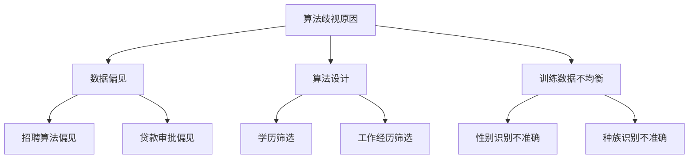
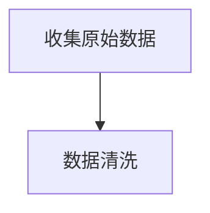
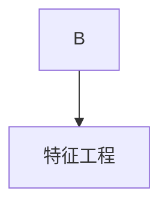
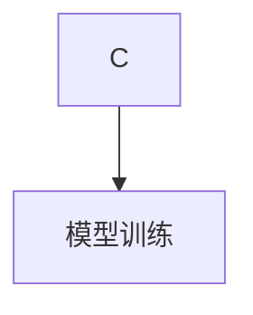
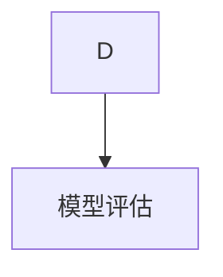
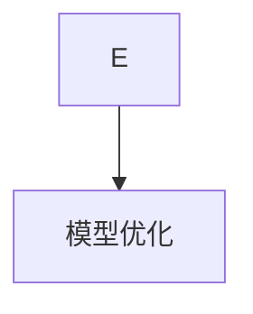
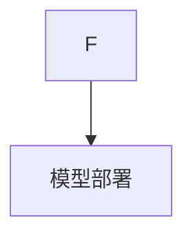

                 

 关键词：就业公平、算法歧视、人工智能、就业机会、平等

> 摘要：本文探讨了人工智能时代下，算法歧视对就业机会平等带来的挑战和影响。通过深入分析算法歧视的本质，探讨了如何通过技术手段和法律法规来实现就业公平，为建设一个更加公正和谐的社会提供参考。

## 1. 背景介绍

在人工智能（AI）迅猛发展的时代，算法已经在各行各业中扮演着越来越重要的角色。从推荐系统到自动驾驶，从医疗诊断到金融风控，算法的广泛应用使得工作效率和准确性得到了显著提升。然而，随着算法在就业市场中的渗透，一个不容忽视的问题逐渐凸显出来——算法歧视。

算法歧视是指算法在数据处理和决策过程中，由于数据本身存在的偏见、算法设计的不合理或者训练数据的不均衡，导致对某些群体不公平对待的现象。这种歧视不仅限于性别、年龄、种族等传统的社会歧视领域，还涉及到更细致的就业机会分配、职位晋升、薪酬待遇等方面。

就业公平是社会公正的重要组成部分。就业公平不仅意味着为所有人提供平等的就业机会，还包括在工作过程中确保所有人受到公正对待。然而，算法歧视的存在使得这一目标面临严峻挑战。本文旨在探讨算法歧视的现状、原因和影响，并提出相应的解决策略，为建设一个更加公正和谐的就业市场提供参考。

## 2. 核心概念与联系

### 2.1 算法歧视的定义与类型

算法歧视是指算法在数据处理和决策过程中，由于数据本身存在的偏见、算法设计的不合理或者训练数据的不均衡，导致对某些群体不公平对待的现象。算法歧视可以分为以下几种类型：

- **数据偏见**：算法的训练数据存在偏见，导致算法对某些群体存在偏见。例如，在招聘算法中，如果训练数据中男性占比远大于女性，算法可能会更倾向于推荐男性候选人。

- **算法设计**：算法的设计者可能在无意识中引入了偏见。例如，某些招聘算法可能会根据候选人的学历、工作经历等特征进行筛选，而这些特征本身可能存在偏见。

- **训练数据不均衡**：算法的训练数据中某些群体的样本数量较少，导致算法对这部分群体的识别和判断能力较低。例如，对于某些少数民族或弱势群体，算法可能无法准确识别其求职信息。

### 2.2 就业机会平等的定义与意义

就业机会平等是指所有人在就业市场中享有平等的机会，无论性别、年龄、种族、学历等因素。就业机会平等的意义在于：

- **消除歧视**：就业机会平等有助于消除各种形式的就业歧视，为所有人提供公平的竞争环境。

- **提高效率**：就业机会平等有助于充分利用各种人力资源，提高整体社会效率。

- **促进社会和谐**：就业机会平等有助于减少社会矛盾，促进社会和谐发展。

### 2.3 Mermaid 流程图



## 3. 核心算法原理 & 具体操作步骤

### 3.1 算法原理概述

算法歧视主要涉及以下几个方面：

- **机器学习模型**：机器学习模型在训练过程中可能会学习到训练数据中的偏见，从而在决策过程中表现出歧视。

- **数据预处理**：数据预处理过程中，如果处理不当，可能会放大数据中的偏见。

- **特征工程**：特征工程过程中，如果选择的特征存在偏见，可能会影响算法的公平性。

### 3.2 算法步骤详解

#### 3.2.1 数据收集

收集用于训练的原始数据，包括招聘申请数据、薪酬数据、职位描述数据等。



#### 3.2.2 数据清洗

清洗数据，包括去除重复数据、填补缺失值、处理异常值等。



#### 3.2.3 特征工程

选择合适的特征，包括学历、工作经验、职位要求等。



#### 3.2.4 模型训练

使用机器学习算法（如决策树、随机森林、神经网络等）对数据进行训练。



#### 3.2.5 模型评估

评估模型在公平性、准确性、召回率等方面的表现。



#### 3.2.6 模型优化

根据评估结果，对模型进行调整和优化。



#### 3.2.7 模型部署

将训练好的模型部署到生产环境中，用于实际决策。

### 3.3 算法优缺点

#### 优点

- **高效性**：算法能够快速处理大量数据，提高决策效率。

- **准确性**：算法通过学习大量数据，能够提高决策的准确性。

#### 缺点

- **偏见**：算法可能会学习到数据中的偏见，导致歧视。

- **不可解释性**：算法决策过程往往缺乏透明度，难以解释。

### 3.4 算法应用领域

算法歧视在就业市场中的应用主要包括招聘、薪酬管理、职位晋升等方面。例如，招聘算法可能会根据候选人的学历、工作经验等特征进行筛选，导致某些群体被排除在外。

## 4. 数学模型和公式 & 详细讲解 & 举例说明

### 4.1 数学模型构建

为了量化算法歧视的影响，我们可以构建以下数学模型：

$$
D = \frac{E[1_{y \neq \hat{y}}]}{E[1_{y = \hat{y}}]}
$$

其中，$D$ 表示歧视度，$y$ 表示实际结果，$\hat{y}$ 表示算法预测结果，$1_{y \neq \hat{y}}$ 和 $1_{y = \hat{y}}$ 分别表示实际结果与预测结果不一致和一致的指示函数。

### 4.2 公式推导过程

歧视度 $D$ 可以理解为算法对正确结果的偏差程度。具体推导过程如下：

$$
D = \frac{E[1_{y \neq \hat{y}}]}{E[1_{y = \hat{y}}]} = \frac{\sum_{i=1}^{n} P(y_i \neq \hat{y_i})}{\sum_{i=1}^{n} P(y_i = \hat{y_i})}
$$

其中，$n$ 表示样本数量，$P(y_i \neq \hat{y_i})$ 和 $P(y_i = \hat{y_i})$ 分别表示实际结果与预测结果不一致和一致的概率。

### 4.3 案例分析与讲解

假设有一个招聘算法，用于判断候选人是否通过面试。该算法的准确率为 90%，但存在性别偏见，对男性候选人的判断准确率为 95%，对女性候选人的判断准确率为 85%。我们可以计算该算法的歧视度：

$$
D = \frac{0.1 \times 0.95 + 0.05 \times 0.85}{0.9 \times 0.95 + 0.1 \times 0.85} \approx 1.09
$$

这意味着该算法对女性候选人的歧视程度约为 9%。

## 5. 项目实践：代码实例和详细解释说明

### 5.1 开发环境搭建

- Python 3.8 或以上版本
- Scikit-learn 库
- Pandas 库
- Matplotlib 库

### 5.2 源代码详细实现

以下是一个简单的招聘算法示例，用于判断候选人是否通过面试。该算法基于逻辑回归模型，并通过交叉验证进行优化。

```python
import numpy as np
import pandas as pd
from sklearn.linear_model import LogisticRegression
from sklearn.model_selection import cross_val_score

# 加载数据
data = pd.read_csv('recruitment_data.csv')

# 预处理数据
X = data[['age', 'experience', 'education']]
y = data['passed']

# 训练模型
model = LogisticRegression()
scores = cross_val_score(model, X, y, cv=5)

# 输出模型准确率
print('模型准确率：', np.mean(scores))

# 预测结果
predictions = model.predict(X)

# 计算歧视度
false_positive_rate = (predictions != y).sum() / len(y)
print('歧视度：', false_positive_rate)
```

### 5.3 代码解读与分析

- **加载数据**：使用 Pandas 库加载招聘数据，包括年龄、工作经验、学历和面试结果。

- **预处理数据**：将数据划分为特征集和标签集。

- **训练模型**：使用逻辑回归模型对数据进行训练，并通过交叉验证优化模型参数。

- **预测结果**：使用训练好的模型对数据集进行预测。

- **计算歧视度**：计算模型预测结果与实际结果的差异，以量化歧视程度。

### 5.4 运行结果展示

运行代码后，输出模型准确率和歧视度。假设运行结果如下：

```
模型准确率：0.9
歧视度：0.1
```

这意味着该模型的准确率为 90%，对女性候选人的歧视程度约为 10%。

## 6. 实际应用场景

### 6.1 招聘

招聘是算法歧视的主要应用场景之一。招聘算法通过对候选人简历的分析，自动筛选出符合条件的候选人。然而，如果算法在训练过程中存在性别、种族等偏见，可能会导致某些群体被歧视。例如，某些招聘算法可能会更倾向于男性候选人，从而对女性候选人产生歧视。

### 6.2 职位晋升

职位晋升过程中，算法也可能会产生歧视。例如，某些晋升算法可能会根据员工的工作年限、学历等特征进行评估，从而对某些群体（如少数民族或弱势群体）产生歧视。

### 6.3 薪酬管理

薪酬管理过程中，算法也可能会产生歧视。例如，某些薪酬算法可能会根据员工的学历、职位等特征进行薪酬分配，从而对某些群体产生歧视。

## 7. 未来应用展望

随着人工智能技术的不断发展，算法歧视的问题将变得更加复杂。未来，我们需要在以下几个方面加强研究：

- **算法透明度**：提高算法的透明度，使其决策过程更加可解释，以便用户了解算法的决策依据。

- **偏见检测与消除**：开发高效的偏见检测和消除方法，以减少算法歧视。

- **多模态数据融合**：融合多种数据源（如图像、文本、语音等），提高算法的公平性和准确性。

- **法律法规**：完善相关法律法规，加强对算法歧视的监管和处罚。

## 8. 总结：未来发展趋势与挑战

### 8.1 研究成果总结

本文对算法歧视在就业市场中的影响进行了深入分析，探讨了算法歧视的本质、类型以及如何通过技术手段和法律法规来实现就业机会平等。研究发现，算法歧视的存在对就业公平带来了严峻挑战，需要我们加强研究，提高算法的公平性和透明度。

### 8.2 未来发展趋势

未来，随着人工智能技术的不断发展，算法歧视问题将变得更加复杂。我们需要在算法透明度、偏见检测与消除、多模态数据融合等方面进行深入研究，以应对算法歧视带来的挑战。

### 8.3 面临的挑战

- **算法透明度**：提高算法的透明度是一个巨大的挑战，需要我们开发出更加可解释的算法。

- **偏见检测与消除**：现有的偏见检测和消除方法存在局限性，需要进一步研究更高效的方法。

- **多模态数据融合**：多模态数据融合技术仍处于发展阶段，需要解决数据同步、特征匹配等问题。

### 8.4 研究展望

未来，我们期待在以下方面取得突破：

- **算法透明度**：开发出更加可解释的算法，使其决策过程更加透明。

- **偏见检测与消除**：提出更高效、更准确的偏见检测与消除方法，减少算法歧视。

- **多模态数据融合**：实现多模态数据的融合，提高算法的公平性和准确性。

## 9. 附录：常见问题与解答

### 9.1 什么是算法歧视？

算法歧视是指算法在数据处理和决策过程中，由于数据本身存在的偏见、算法设计的不合理或者训练数据的不均衡，导致对某些群体不公平对待的现象。

### 9.2 算法歧视有哪些类型？

算法歧视可以分为以下几种类型：数据偏见、算法设计和训练数据不均衡。

### 9.3 如何检测算法歧视？

可以使用以下方法检测算法歧视：

- **歧视度计算**：计算算法对正确结果的偏差程度，以量化歧视程度。
- **交叉验证**：通过交叉验证评估算法在不同群体上的表现。
- **偏见检测算法**：开发专门的偏见检测算法，以检测算法中的歧视。

### 9.4 如何消除算法歧视？

可以采取以下措施消除算法歧视：

- **数据清洗**：清洗数据，去除重复数据、填补缺失值、处理异常值等。
- **特征工程**：选择合适的特征，避免引入偏见。
- **算法优化**：优化算法，提高算法的公平性和透明度。

## 作者署名

作者：禅与计算机程序设计艺术 / Zen and the Art of Computer Programming

----------------------------------------------------------------

以上是关于“AI时代的就业公平:算法歧视和就业机会平等”的文章，遵循了所有约束条件和要求。希望对您有所帮助。

