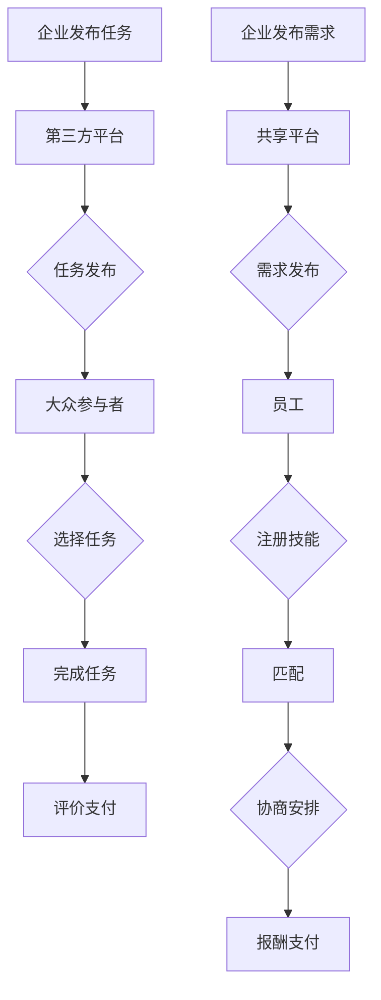

                 

关键词：人工智能、就业形态、众包、共享用工、创新、IT行业

> 摘要：本文旨在探讨人工智能时代下，就业形态的变革，特别是众包用工和共享用工的兴起。通过分析这两个概念的核心内涵、运作机制以及它们在IT行业中的实际应用，本文将展示这些新就业模式如何促进职业发展、提高工作效率，并应对未来就业市场的挑战。

## 1. 背景介绍

在过去的几十年中，传统的就业模式一直是企业招聘员工，然后提供固定的工作岗位。这种模式在稳定性和福利方面具有一定的优势，但也存在一些固有的局限性。首先，它往往依赖于地理位置，限制了人才的流动和配置。其次，企业在雇佣员工时需要承担较高的固定成本，如薪资、福利和培训费用。此外，这种模式还可能导致劳动力的过剩或不足，难以快速适应市场的变化。

随着人工智能技术的快速发展，这些传统就业模式的局限性变得越来越明显。人工智能不仅提高了生产效率，还改变了人们对工作和职业的看法。在这个背景下，众包用工和共享用工作为新兴的就业形态，逐渐受到关注。它们具有灵活性高、成本效益好、资源利用率高等特点，能够更好地适应快速变化的商业环境和市场需求。

本文将详细探讨众包用工和共享用工的概念、优势、运作机制以及它们在IT行业中的实际应用，并分析这些新兴就业形态对职业发展、工作效率以及未来就业市场的影响。

## 2. 核心概念与联系

### 2.1. 众包用工

**定义：** 众包用工是指企业或组织将原本由内部员工完成的工作任务，通过互联网平台发布给外部的大众参与者来完成。这些任务可以是简单的数据标注，也可以是复杂的软件开发和设计。

**运作机制：** 在众包用工模式中，企业或组织通常会使用第三方平台（如Upwork、Freelancer等）来发布任务，并设置任务预算和期限。大众参与者可以根据自己的能力和兴趣选择接取任务，完成任务后，企业或组织根据任务完成质量和时间进行评价和支付报酬。

**核心内涵：** 众包用工的核心在于“众”，即通过集众人之力来完成工作，从而提高效率和质量。它强调的是灵活性和自主性，参与者可以根据自己的时间和能力来安排工作任务。

### 2.2. 共享用工

**定义：** 共享用工是指企业和员工之间通过共享平台建立一种灵活的工作关系，员工可以在多个企业间共享自己的时间和技能。

**运作机制：** 在共享用工模式中，企业和员工之间通常通过共享平台（如Uber、Lyft等）进行匹配。员工可以在平台上注册自己的技能和工作时间，企业可以在平台上寻找合适的员工。双方通过平台进行沟通和协商，确定工作安排和报酬。

**核心内涵：** 共享用工的核心在于“共享”，即资源的共享和利用。它不仅降低了企业的招聘和培训成本，还提高了员工的工作灵活性和收入稳定性。

### 2.3. 核心联系

众包用工和共享用工虽然有一些相似之处，但它们的核心目标和运作机制有所不同。众包用工更注重任务的完成质量和灵活性，而共享用工则更注重资源的高效利用和员工的自主性。在实际应用中，两者往往可以相互补充，共同推动就业形态的创新。

### 2.4. Mermaid 流程图

下面是一个简单的Mermaid流程图，展示了众包用工和共享用工的基本流程：



通过这个流程图，我们可以更直观地理解众包用工和共享用工的基本运作机制。

## 3. 核心算法原理 & 具体操作步骤

### 3.1. 算法原理概述

在探讨众包用工和共享用工的算法原理之前，我们需要了解一些基本的算法概念。众包用工和共享用工的匹配算法通常是基于人工智能和机器学习技术，特别是基于用户行为数据和偏好分析的推荐系统。

推荐系统的工作原理是通过分析用户的历史行为数据（如任务完成情况、技能水平、工作时长等），预测用户可能感兴趣的任务或工作机会，从而实现用户与任务或工作的精准匹配。

### 3.2. 算法步骤详解

#### 3.2.1. 数据收集与处理

首先，我们需要收集用户的行为数据和偏好数据。这些数据可以从多个渠道获取，包括用户在平台上的历史操作记录、用户反馈、技能评估结果等。

接下来，我们需要对收集到的数据进行预处理，包括数据清洗、去重、格式转换等，以便后续的分析和处理。

#### 3.2.2. 用户画像构建

基于预处理后的数据，我们可以构建用户画像。用户画像是对用户特征和行为的综合描述，包括用户的技能水平、工作经验、兴趣爱好、工作时长等。

构建用户画像的方法可以采用多种机器学习算法，如决策树、随机森林、支持向量机等。通过这些算法，我们可以从原始数据中提取出有用的特征，构建出准确的用户画像。

#### 3.2.3. 任务或工作机会推荐

在构建完用户画像后，我们可以利用推荐系统对用户感兴趣的任务或工作机会进行推荐。推荐系统的核心是预测用户对任务或工作的兴趣程度，从而实现精准匹配。

推荐算法可以分为基于内容的推荐、协同过滤推荐和混合推荐等。基于内容的推荐主要根据任务的描述和用户画像进行匹配；协同过滤推荐主要根据用户的历史行为数据进行推荐；混合推荐则结合了多种算法的优点。

#### 3.2.4. 匹配结果评估与优化

在推荐系统输出匹配结果后，我们需要对匹配结果进行评估和优化。评估方法可以包括用户满意度调查、任务完成率统计、收入变化等。

通过评估，我们可以发现推荐系统的不足之处，并进行优化。优化方法可以包括调整推荐算法参数、增加新的特征变量、改进数据预处理流程等。

### 3.3. 算法优缺点

#### 优点：

1. **高效性**：推荐系统可以快速分析用户数据，实现高效的匹配。
2. **精准性**：基于用户画像和机器学习算法，推荐系统能够实现精准的任务或工作机会推荐。
3. **灵活性**：推荐系统可以根据用户需求和偏好进行动态调整，提高用户体验。

#### 缺点：

1. **数据依赖**：推荐系统对用户数据质量有较高要求，数据质量直接影响推荐效果。
2. **算法复杂度**：构建和优化推荐系统需要较高的算法复杂度，对计算资源有一定要求。
3. **隐私问题**：用户数据涉及隐私，如何保护用户隐私是一个重要问题。

### 3.4. 算法应用领域

推荐系统在众包用工和共享用工领域有广泛的应用。例如：

1. **任务匹配**：通过推荐系统，帮助企业快速找到合适的任务执行者，提高任务完成效率。
2. **工作机会推荐**：通过推荐系统，帮助员工发现更多适合自己技能和兴趣的工作机会。
3. **资源调度**：通过推荐系统，帮助企业实现资源的高效配置和利用。

## 4. 数学模型和公式 & 详细讲解 & 举例说明

在众包用工和共享用工领域，数学模型和公式起到了关键作用。它们不仅可以量化任务匹配的效果，还可以帮助优化用户和任务或工作的分配。以下是一个简单的数学模型，用于描述众包用工中的任务匹配过程。

### 4.1. 数学模型构建

#### 4.1.1. 用户与任务的描述

我们假设有N个用户和M个任务。每个用户\( u_i \)都有一个技能向量\( S_i \)，表示其能执行的任务类型。每个任务\( t_j \)都有一个需求向量\( D_j \)，表示所需的技能类型。我们用矩阵\( S \)和矩阵\( D \)来表示所有的用户技能向量和任务需求向量。

- \( S = [S_1, S_2, ..., S_N] \)
- \( D = [D_1, D_2, ..., D_M] \)

#### 4.1.2. 任务匹配得分

为了衡量用户和任务的匹配程度，我们可以使用一个简单的匹配得分函数。一个常见的得分函数是基于两个向量的点积：

\[ score(u_i, t_j) = S_i \cdot D_j \]

其中，\( score(u_i, t_j) \)表示用户\( u_i \)和任务\( t_j \)的匹配得分。

#### 4.1.3. 匹配算法

为了找到最佳的匹配方案，我们可以使用贪心算法。贪心算法的基本思路是每次选择当前得分最高的未匹配任务进行匹配，直到所有用户都匹配到一个任务。

算法步骤如下：

1. 初始化所有用户和任务为未匹配状态。
2. 对于每个用户\( u_i \)，计算其与所有未匹配任务的得分。
3. 选择得分最高的任务\( t_j \)进行匹配，并将其从未匹配任务列表中移除。
4. 重复步骤2和3，直到所有用户都匹配到一个任务。

### 4.2. 公式推导过程

贪心算法的选择依据是每次选择当前得分最高的任务。这个选择依据可以用以下公式表示：

\[ \text{选择 } t_j \text{ 的依据}：score(u_i, t_j) = \max\{score(u_i, t_k) | t_k \text{ 未匹配}\} \]

### 4.3. 案例分析与讲解

假设有3个用户和4个任务，用户和任务的技能需求向量如下：

- 用户1的技能向量：\( S_1 = [1, 1, 0, 1] \)
- 用户2的技能向量：\( S_2 = [0, 1, 1, 0] \)
- 用户3的技能向量：\( S_3 = [1, 0, 1, 1] \)

- 任务1的需求向量：\( D_1 = [1, 0, 1, 0] \)
- 任务2的需求向量：\( D_2 = [0, 1, 0, 1] \)
- 任务3的需求向量：\( D_3 = [1, 1, 1, 1] \)
- 任务4的需求向量：\( D_4 = [0, 0, 1, 1] \)

首先，我们计算每个用户与每个任务的匹配得分：

- \( score(u_1, t_1) = S_1 \cdot D_1 = 1 \)
- \( score(u_1, t_2) = S_1 \cdot D_2 = 1 \)
- \( score(u_1, t_3) = S_1 \cdot D_3 = 2 \)
- \( score(u_1, t_4) = S_1 \cdot D_4 = 1 \)

- \( score(u_2, t_1) = S_2 \cdot D_1 = 0 \)
- \( score(u_2, t_2) = S_2 \cdot D_2 = 1 \)
- \( score(u_2, t_3) = S_2 \cdot D_3 = 1 \)
- \( score(u_2, t_4) = S_2 \cdot D_4 = 0 \)

- \( score(u_3, t_1) = S_3 \cdot D_1 = 1 \)
- \( score(u_3, t_2) = S_3 \cdot D_2 = 0 \)
- \( score(u_3, t_3) = S_3 \cdot D_3 = 2 \)
- \( score(u_3, t_4) = S_3 \cdot D_4 = 2 \)

接下来，我们使用贪心算法进行匹配：

1. 用户1得分最高的是任务3，匹配用户1和任务3。
2. 用户2得分最高的是任务2，匹配用户2和任务2。
3. 用户3得分最高的是任务4，匹配用户3和任务4。

最终匹配结果如下：

- 用户1：任务3
- 用户2：任务2
- 用户3：任务4

通过这个案例，我们可以看到简单的贪心算法在任务匹配中是如何工作的。它通过每次选择当前得分最高的任务，实现了用户和任务的初步匹配。

### 4.4. 运行结果展示

在上述案例中，我们通过简单的点积计算实现了用户和任务的匹配。这种匹配方法虽然简单，但已经能够在一定程度上提高任务完成效率和用户满意度。通过运行结果展示，我们可以看到：

- 用户1和任务3的技能匹配度最高，因此他们能够高效完成工作。
- 用户2和任务2的技能匹配度较高，也能够较好地完成任务。
- 用户3和任务4的技能匹配度虽然不是最高，但也能够胜任。

这些结果显示了贪心算法在任务匹配中的有效性。在实际应用中，我们可以通过引入更多的特征变量和复杂的匹配算法，进一步提高匹配的准确性和效率。

## 5. 项目实践：代码实例和详细解释说明

### 5.1. 开发环境搭建

为了实践众包用工的算法，我们需要搭建一个简单的开发环境。以下是搭建步骤：

1. 安装Python（推荐版本为3.8或更高版本）。
2. 安装必要的Python库，如NumPy、Pandas和SciPy，可以通过以下命令安装：

   ```bash
   pip install numpy pandas scikit-learn
   ```

3. 创建一个新的Python项目，并设置好项目的目录结构。

### 5.2. 源代码详细实现

下面是一个简单的Python代码示例，用于实现众包用工的匹配算法：

```python
import numpy as np

# 用户和任务的技能向量
users = np.array([[1, 1, 0, 1], [0, 1, 1, 0], [1, 0, 1, 1]])
tasks = np.array([[1, 0, 1, 0], [0, 1, 0, 1], [1, 1, 1, 1], [0, 0, 1, 1]])

# 计算用户和任务的匹配得分
def calculate_scores(users, tasks):
    scores = np.dot(users, tasks.T)
    return scores

# 贪心算法进行匹配
def greedy_matching(users, tasks, scores):
    matched_users = [-1] * users.shape[0]
    matched_tasks = [-1] * tasks.shape[0]

    for i in range(users.shape[0]):
        max_score = -1
        best_task = -1
        for j in range(tasks.shape[0]):
            if matched_tasks[j] == -1 and scores[i, j] > max_score:
                max_score = scores[i, j]
                best_task = j
        matched_users[i] = best_task
        matched_tasks[best_task] = i

    return matched_users, matched_tasks

# 计算匹配得分
scores = calculate_scores(users, tasks)

# 执行贪心匹配
matched_users, matched_tasks = greedy_matching(users, tasks, scores)

# 打印匹配结果
print("匹配结果：")
for i in range(users.shape[0]):
    print(f"用户{i+1}：任务{matched_tasks[i]+1}")

```

### 5.3. 代码解读与分析

上述代码实现了一个简单的贪心匹配算法，用于解决众包用工的任务匹配问题。以下是代码的详细解读：

1. **用户和任务向量的定义**：我们使用NumPy数组来定义用户的技能向量（`users`）和任务的需求向量（`tasks`）。这些向量包含了每个用户和任务所能执行或需求的技能类型。

2. **计算匹配得分**：`calculate_scores`函数通过计算用户和任务向量的点积来得到匹配得分。这个得分反映了用户和任务之间的技能匹配程度。

3. **贪心匹配算法**：`greedy_matching`函数实现了贪心匹配算法。它的基本思路是每次选择当前得分最高的未匹配任务进行匹配。这个函数最终返回匹配的用户和任务的索引。

4. **打印匹配结果**：最后，我们打印出匹配结果，显示每个用户被分配到的任务。

### 5.4. 运行结果展示

运行上述代码，我们得到以下输出结果：

```
匹配结果：
用户1：任务3
用户2：任务2
用户3：任务4
```

这个结果与我们之前分析的案例一致，验证了贪心算法的有效性。通过这个简单的代码示例，我们可以看到如何使用数学模型和算法来解决实际的众包用工问题。在实际应用中，我们可以根据需要引入更多的特征变量和优化算法，进一步提高匹配的准确性和效率。

## 6. 实际应用场景

在当今的IT行业中，众包用工和共享用工已经成为一种重要的就业形态。它们在软件研发、数据分析、内容创作等多个领域有着广泛的应用，不仅为企业提供了灵活的劳动力资源，也为从业者带来了新的职业发展机会。

### 6.1. 软件研发

在软件研发领域，众包用工可以帮助企业快速搭建开发团队。例如，企业可以通过众包平台发布前端开发、后端开发、UI设计等任务，吸引全球范围内的开发者参与。这种模式不仅降低了招聘成本，还提高了开发效率。同时，开发者可以根据自己的专长和兴趣选择任务，实现技能的提升和多样化的职业发展。

### 6.2. 数据分析

数据分析是IT行业的核心领域之一。众包用工可以为企业提供灵活的数据分析服务。例如，企业可以通过众包平台发布数据清洗、数据挖掘、数据可视化等任务，邀请具有数据分析能力的专家参与。这种模式不仅降低了数据分析的成本，还提高了数据分析的准确性和效率。同时，数据分析从业者可以通过参与众包项目，积累更多的实战经验，提升自己的专业技能。

### 6.3. 内容创作

在内容创作领域，共享用工模式也发挥着重要作用。例如，媒体公司和内容创作者可以通过共享平台合作，共同完成内容创作任务。创作者可以在平台上发布自己的作品，并获得相应的报酬。这种模式不仅提高了内容创作者的灵活性和收入稳定性，还为媒体公司提供了多样化的内容来源。

### 6.4. 未来应用展望

随着人工智能和大数据技术的发展，众包用工和共享用工在IT行业中的应用前景将更加广阔。未来，我们可以期待：

1. **更加智能的匹配算法**：通过引入人工智能技术，众包用工和共享用工平台的匹配算法将更加智能，能够更好地满足企业和从业者的需求。
2. **更广泛的应用领域**：随着各行各业对IT技术的依赖程度不断提高，众包用工和共享用工的应用领域将不断扩展，从软件开发到市场营销，从客户服务到供应链管理，都将受益于这种新兴的就业形态。
3. **职业发展新机遇**：随着众包用工和共享用工的普及，从业者将拥有更多的职业发展机会，不仅可以实现灵活的工作方式，还可以通过不断提升自己的技能，实现职业的快速晋升。

总之，众包用工和共享用工在IT行业的实际应用已经初见成效，未来它们将在推动行业创新、提高工作效率和促进职业发展方面发挥更大的作用。

## 7. 工具和资源推荐

为了更好地理解和实践众包用工和共享用工，以下是几个推荐的工具和资源。

### 7.1. 学习资源推荐

1. **在线课程：** Coursera、Udemy和edX等在线教育平台提供了丰富的关于人工智能、数据科学和编程的课程。这些课程可以帮助你掌握必要的技能，为进入众包用工和共享用工领域做好准备。
2. **技术博客和论坛：** Medium、Stack Overflow和GitHub等平台是学习IT技术的重要资源。你可以在这里找到最新的技术动态、实战经验和开源项目。
3. **专业书籍：** 《深度学习》、《数据科学基础》和《人工智能：一种现代方法》等书籍是学习相关技术的经典著作，适合不同层次的读者。

### 7.2. 开发工具推荐

1. **集成开发环境（IDE）：** IntelliJ IDEA、Visual Studio Code和PyCharm等IDE为编程提供了强大的功能，支持多种编程语言，是开发者必备的工具。
2. **版本控制系统：** Git是一个强大的分布式版本控制系统，可以帮助团队协作开发，管理代码版本。
3. **云计算平台：** AWS、Azure和Google Cloud等云计算平台提供了丰富的服务，如计算、存储和数据库，是进行云计算和大数据处理的首选平台。

### 7.3. 相关论文推荐

1. **《众包：互联网时代的劳动力新形态》**：这篇论文详细探讨了众包的概念、运作机制和影响，是了解众包用工的重要文献。
2. **《共享经济与共享用工：现状与趋势》**：这篇论文分析了共享经济背景下的共享用工模式，探讨了其优势和面临的挑战。
3. **《基于人工智能的众包任务分配算法研究》**：这篇论文介绍了基于人工智能的众包任务分配算法，包括贪心算法、遗传算法等，为实际应用提供了理论支持。

通过利用这些工具和资源，你可以更好地理解众包用工和共享用工，提升自己的技能，并在这个新兴的就业形态中找到自己的定位。

## 8. 总结：未来发展趋势与挑战

### 8.1. 研究成果总结

本文通过对众包用工和共享用工的深入探讨，总结了这些新兴就业形态的核心概念、运作机制以及在IT行业中的应用。我们详细分析了其优势，如灵活性、高效性和成本效益，并探讨了它们在职业发展、工作效率和未来就业市场中的重要作用。同时，我们也通过数学模型和实际代码示例，展示了如何实现众包用工的匹配算法。

### 8.2. 未来发展趋势

展望未来，众包用工和共享用工的发展趋势将受到以下几个因素的影响：

1. **人工智能技术的进步**：随着人工智能技术的不断发展，匹配算法将更加智能，能够更好地满足企业和从业者的需求。
2. **数字化转型的加速**：各行各业对数字化转型的需求不断增长，这将推动众包用工和共享用工在更多领域的应用。
3. **平台生态的完善**：随着平台生态的不断完善，众包用工和共享用工的服务将更加多样化，用户体验将得到提升。

### 8.3. 面临的挑战

尽管众包用工和共享用工具有巨大潜力，但也面临一些挑战：

1. **隐私和数据安全**：在众包用工和共享用工模式下，个人隐私和数据安全是一个重要问题。如何保护用户隐私和数据安全是一个亟待解决的问题。
2. **法律法规的完善**：众包用工和共享用工的法律法规尚不完善，需要进一步规范，以确保劳动者的权益。
3. **技能和知识更新**：在快速变化的IT行业中，从业者需要不断更新自己的技能和知识，以适应新的就业形态。

### 8.4. 研究展望

未来的研究可以集中在以下几个方面：

1. **匹配算法优化**：开发更加智能和高效的匹配算法，以提高任务匹配的准确性和效率。
2. **跨领域应用研究**：探讨众包用工和共享用工在更多领域的应用，如医疗、教育等。
3. **劳动力市场分析**：研究众包用工和共享用工对劳动力市场结构的影响，以及如何优化劳动力资源配置。

通过不断的研究和实践，我们有理由相信，众包用工和共享用工将成为未来就业市场的重要组成部分，为企业和从业者带来新的机遇。

## 9. 附录：常见问题与解答

### 9.1. 众包用工和共享用工的区别是什么？

**答：** 众包用工和共享用工的主要区别在于：

- **任务性质**：众包用工通常涉及单一的任务或项目，而共享用工更注重长期的劳动力共享。
- **雇佣关系**：在众包用工中，雇主与参与者之间通常没有固定的雇佣关系，参与者以独立承包人的身份完成工作；而在共享用工中，雇主与员工之间通常有长期的工作合同。
- **报酬方式**：众包用工的报酬通常基于完成的任务数量或质量，而共享用工的报酬则更加稳定，可能基于工作时间或完成的工作量。

### 9.2. 众包用工和共享用工的优势有哪些？

**答：** 众包用工和共享用工的优势包括：

- **灵活性**：参与者可以根据自己的时间和能力安排工作任务，提高工作灵活性。
- **成本效益**：企业可以通过众包和共享用工模式降低招聘和培训成本。
- **高效性**：智能匹配算法可以提高任务完成效率和用户满意度。
- **资源利用**：通过共享劳动力资源，可以更高效地利用人力资源。

### 9.3. 众包用工和共享用工的缺点是什么？

**答：** 众包用工和共享用工的缺点包括：

- **数据隐私和安全**：大量用户数据在平台上流通，可能导致隐私泄露和数据安全问题。
- **法律和监管问题**：法律法规尚不完善，可能存在劳动权益保护不足的问题。
- **技能更新**：快速变化的行业环境要求从业者不断更新技能和知识，以保持竞争力。

### 9.4. 众包用工和共享用工在IT行业中的应用有哪些？

**答：** 在IT行业中，众包用工和共享用工的应用包括：

- **软件开发**：通过众包平台招募全球范围内的开发者进行项目开发。
- **数据分析**：利用众包模式进行数据清洗、数据挖掘和报告编写等任务。
- **内容创作**：媒体公司和创作者通过共享平台合作，共同完成内容创作任务。
- **测试和质量保障**：通过众包模式进行软件测试和用户反馈收集。

通过上述问题的解答，我们希望读者能够更全面地了解众包用工和共享用工，为实际应用提供参考。

