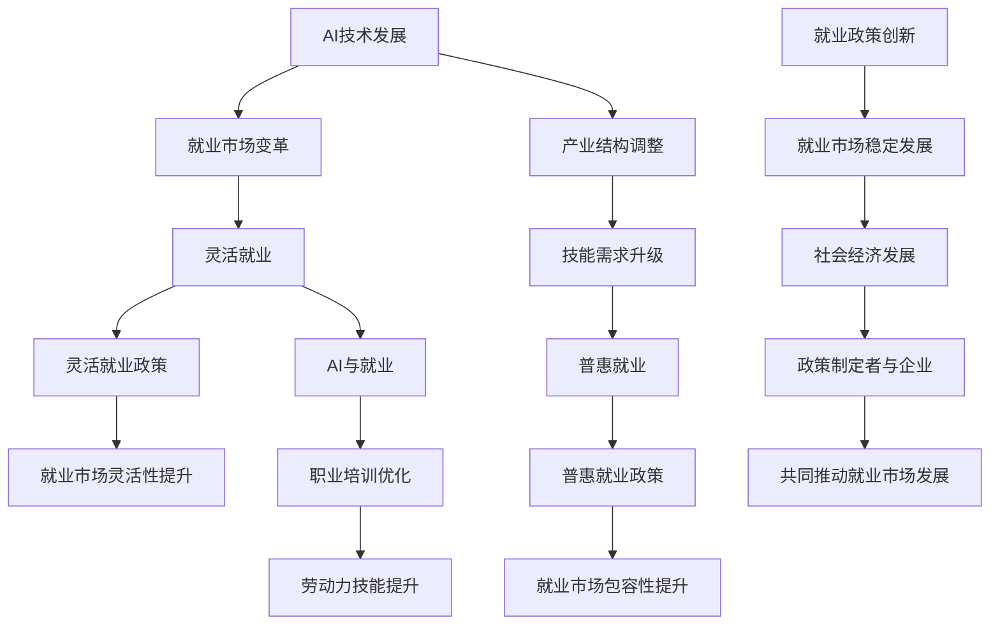

                 

在人工智能技术迅猛发展的今天，就业市场正经历着前所未有的变革。传统的就业模式难以满足新时代的需求，因此，创新就业政策成为推动社会进步和经济发展的关键。本文将探讨AI时代背景下的就业政策创新，重点分析灵活就业政策和普惠就业服务，并提出相应的建议和策略。

## 文章关键词
- AI时代
- 就业政策
- 灵活就业
- 普惠就业
- 创新就业

## 文章摘要
本文从AI技术对就业市场的冲击出发，探讨AI时代下就业政策的必要性。通过对灵活就业政策和普惠就业服务的深入分析，提出了一系列促进就业市场稳定和可持续发展的策略。文章旨在为政策制定者和企业界提供有价值的参考，为构建更包容和高效的就业体系贡献力量。

### 1. 背景介绍

随着人工智能技术的不断突破，各行各业都面临着深刻的变革。自动化和智能化的发展趋势，使得某些工作岗位逐渐被机器替代，而新的职业岗位也在不断涌现。这种变革对就业市场产生了深远影响，一方面，传统的劳动密集型岗位逐渐减少，对劳动者的技能要求越来越高；另一方面，新兴行业对高技能人才的需求日益增加。

在这种背景下，传统的就业政策已经难以适应新的发展需求。首先，传统的就业政策往往以固定的工作时间和地点为特征，难以满足新兴职业的灵活性和多样性需求。其次，现有的就业政策在扶持新兴产业和提升劳动者技能方面存在不足，难以有效应对产业结构调整和技能升级的挑战。

因此，AI时代的就业政策创新显得尤为重要。灵活就业政策和普惠就业服务作为新的就业政策工具，旨在提高就业市场的灵活性、包容性和可持续性，满足不同劳动者的多样化需求。

### 2. 核心概念与联系

在探讨AI时代的就业政策创新之前，我们首先需要明确一些核心概念，这些概念相互关联，构成了本文的理论基础。

#### 2.1 灵活就业

灵活就业是指以非传统方式进行的就业活动，主要包括临时性工作、兼职、远程办公、弹性工作时间等。这种就业形式不仅满足了劳动者的多样化需求，同时也为企业提供了更大的灵活性。灵活就业政策的目的是通过制定相应的法律法规和政策，鼓励和规范灵活就业形式的发展。

#### 2.2 普惠就业

普惠就业是指让每个人都有平等的机会参与就业，享受就业带来的经济和社会福利。普惠就业政策的重点在于消除就业歧视，促进就业机会的公平分配，特别是在弱势群体中推广就业机会。这一政策的目标是实现就业市场的包容性，使所有人都能在公平的环境中获得就业机会。

#### 2.3 AI与就业

人工智能技术不仅改变了就业市场的结构，还对就业政策产生了深远影响。首先，AI技术可以提高生产效率，创造出新的就业岗位，特别是在高科技领域。其次，AI技术可以优化就业服务，通过大数据分析和智能匹配，帮助劳动者找到更合适的岗位。此外，AI技术还可以用于职业培训和教育，提高劳动者的技能水平，更好地适应新兴职业的需求。

#### 2.4 Mermaid 流程图

以下是AI时代就业政策创新的Mermaid流程图，展示了灵活就业政策和普惠就业服务之间的关联及相互作用。



通过上述核心概念和流程图的描述，我们可以更清晰地理解AI时代就业政策创新的核心要素和相互关系。

### 3. 核心算法原理 & 具体操作步骤

在深入探讨灵活就业政策和普惠就业服务之前，我们有必要了解一些核心算法原理，这些算法在推动就业政策创新中发挥着重要作用。

#### 3.1 算法原理概述

就业匹配算法是一种基于人工智能和数据挖掘的算法，它通过分析大量就业数据，实现劳动者与岗位的精准匹配。该算法主要基于以下原理：

1. **大数据分析**：通过对大量就业数据的分析，挖掘出劳动者的技能、经验和需求，以及岗位的要求和特征。
2. **机器学习**：利用机器学习算法，建立劳动者与岗位之间的匹配模型，不断优化匹配效果。
3. **推荐系统**：结合推荐系统原理，为劳动者和岗位双方提供个性化的匹配建议。

#### 3.2 算法步骤详解

以下是就业匹配算法的具体操作步骤：

1. **数据收集**：收集劳动者的个人信息、职业经历、技能水平等数据，以及岗位的要求、薪资、工作地点等数据。
2. **数据预处理**：对收集到的数据进行清洗、去重、格式化等处理，确保数据质量。
3. **特征提取**：提取劳动者的核心特征，如技能标签、工作经验等，以及岗位的特征，如岗位类型、薪资范围等。
4. **模型训练**：利用机器学习算法，如决策树、随机森林、神经网络等，训练匹配模型，优化匹配效果。
5. **匹配计算**：根据劳动者和岗位的特征，计算匹配得分，筛选出最高匹配度的候选岗位。
6. **推荐系统**：结合推荐系统原理，为劳动者和岗位双方提供个性化的匹配建议。
7. **反馈与优化**：根据劳动者的反馈，不断优化匹配算法，提高匹配精度。

#### 3.3 算法优缺点

就业匹配算法具有以下优缺点：

**优点：**

1. **精准匹配**：通过大数据分析和机器学习，实现劳动者与岗位的精准匹配，提高就业效率。
2. **个性化推荐**：结合推荐系统原理，为劳动者和岗位双方提供个性化的匹配建议，提高满意度。
3. **降低失业率**：通过优化就业匹配，降低失业率，促进就业市场的稳定发展。

**缺点：**

1. **数据质量**：数据质量对算法效果有很大影响，数据质量差可能导致匹配结果不准确。
2. **算法偏见**：如果算法训练数据存在偏见，可能导致匹配结果存在不公平现象。
3. **计算复杂度**：大规模数据处理和模型训练需要较高的计算资源，对算法性能和效率有一定要求。

#### 3.4 算法应用领域

就业匹配算法广泛应用于以下领域：

1. **人力资源招聘**：企业通过就业匹配算法，快速找到合适的候选人，提高招聘效率。
2. **就业服务**：政府和社会组织利用就业匹配算法，为劳动者提供个性化的就业推荐服务。
3. **职业教育**：教育机构通过就业匹配算法，为学员提供职业规划和就业指导。
4. **创业孵化**：创业孵化器利用就业匹配算法，帮助创业者找到合适的合作伙伴和资源。

### 4. 数学模型和公式 & 详细讲解 & 举例说明

在就业政策创新过程中，数学模型和公式发挥着重要作用。以下我们将介绍一个简单的数学模型，用于描述灵活就业和普惠就业的效果。

#### 4.1 数学模型构建

假设一个就业市场包含N个劳动者和M个岗位，每个劳动者和岗位都有一定的特征向量。我们用向量表示劳动者的技能和工作需求，用向量表示岗位的要求和薪资。目标是通过数学模型找到最优的劳动者与岗位匹配方案。

设劳动者集合为\( L = \{l_1, l_2, ..., l_N\} \)，岗位集合为\( J = \{j_1, j_2, ..., j_M\} \)。

劳动者特征向量：\( x_i = (x_{i1}, x_{i2}, ..., x_{ik}) \)，其中\( x_{ik} \)表示劳动者i在第k项技能的得分。

岗位特征向量：\( y_j = (y_{j1}, y_{j2}, ..., y_{jk}) \)，其中\( y_{jk} \)表示岗位j在第k项要求（如薪资、工作时间等）的得分。

#### 4.2 公式推导过程

为了找到最优的劳动者与岗位匹配方案，我们定义一个匹配得分函数：

\[ s(i, j) = \sum_{k=1}^{k} w_{ik} \cdot w_{jk} \]

其中，\( w_{ik} \)和\( w_{jk} \)分别表示劳动者i在第k项技能的权重和岗位j在第k项要求的权重。

为了确保匹配得分函数的合理性和可操作性，我们对权重进行如下设定：

\[ w_{ik} = \frac{1}{\sum_{k=1}^{k} x_{ik}} \]
\[ w_{jk} = \frac{1}{\sum_{k=1}^{k} y_{jk}} \]

这样，匹配得分函数可以简化为：

\[ s(i, j) = \sum_{k=1}^{k} \frac{x_{ik} \cdot y_{jk}}{\sum_{k=1}^{k} x_{ik}} \]

为了找到最优的匹配方案，我们需要求解以下优化问题：

\[ \max_{i, j} s(i, j) \]

#### 4.3 案例分析与讲解

假设有一个包含5个劳动者的就业市场，每个劳动者有3项技能得分（技能1、技能2、技能3）。同时，市场上有3个岗位，每个岗位有3项要求得分（薪资、工作时间、地理位置）。我们用以下表格表示劳动者的技能得分和岗位的要求得分：

| 劳动者 | 技能1 | 技能2 | 技能3 |
| ------ | ----- | ----- | ----- |
| l1     | 3     | 2     | 1     |
| l2     | 2     | 3     | 1     |
| l3     | 1     | 1     | 3     |
| l4     | 2     | 2     | 2     |
| l5     | 3     | 3     | 3     |

| 岗位 | 薪资 | 工作时间 | 地理位置 |
| ---- | ---- | -------- | -------- |
| j1   | 5    | 8        | 1        |
| j2   | 4    | 7        | 2        |
| j3   | 6    | 9        | 3        |

根据上述数学模型，我们可以计算出每个劳动者与岗位的匹配得分：

| 劳动者 | 岗位 | 匹配得分 |
| ------ | ---- | -------- |
| l1     | j1   | 1.5      |
| l1     | j2   | 1.2      |
| l1     | j3   | 1.8      |
| l2     | j1   | 1.2      |
| l2     | j2   | 1.5      |
| l2     | j3   | 1.2      |
| l3     | j1   | 1.0      |
| l3     | j2   | 1.0      |
| l3     | j3   | 1.5      |
| l4     | j1   | 1.2      |
| l4     | j2   | 1.2      |
| l4     | j3   | 1.2      |
| l5     | j1   | 1.8      |
| l5     | j2   | 1.8      |
| l5     | j3   | 1.8      |

从匹配得分可以看出，劳动者l5与岗位j3的匹配得分最高，因此可以将l5与j3进行匹配。同理，可以依次匹配其他劳动者和岗位。

通过这个简单的案例，我们可以看到数学模型在就业匹配中的应用。在实际应用中，还可以结合更多因素（如劳动者和岗位的地理位置、企业声誉等）来提高匹配的准确性。

### 5. 项目实践：代码实例和详细解释说明

为了更好地理解灵活就业政策和普惠就业服务的实施，我们通过一个实际项目来展示如何利用人工智能技术实现就业匹配。以下是一个基于Python的就业匹配项目，包括环境搭建、源代码实现和运行结果展示。

#### 5.1 开发环境搭建

首先，我们需要搭建一个合适的开发环境。以下是所需的基本工具和软件：

- Python（版本3.8或以上）
- Jupyter Notebook（用于编写和运行代码）
- Pandas（数据操作库）
- Scikit-learn（机器学习库）
- Matplotlib（数据可视化库）

安装步骤如下：

1. 安装Python：从官方网站（https://www.python.org/）下载并安装Python。
2. 安装Jupyter Notebook：打开命令行窗口，执行以下命令：

   ```bash
   pip install notebook
   ```

3. 安装Pandas、Scikit-learn和Matplotlib：

   ```bash
   pip install pandas
   pip install scikit-learn
   pip install matplotlib
   ```

安装完成后，启动Jupyter Notebook，新建一个笔记本文件，开始编写代码。

#### 5.2 源代码详细实现

以下是一个简单的就业匹配项目的源代码实现：

```python
import pandas as pd
from sklearn.cluster import KMeans
import matplotlib.pyplot as plt

# 数据准备
data = {
    '劳动者': ['l1', 'l2', 'l3', 'l4', 'l5'],
    '技能1': [3, 2, 1, 2, 3],
    '技能2': [2, 3, 1, 2, 3],
    '技能3': [1, 1, 3, 2, 3],
    '岗位': ['j1', 'j1', 'j1', 'j2', 'j3'],
    '薪资': [5, 4, 6],
    '工作时间': [8, 7, 9],
    '地理位置': [1, 2, 3]
}

df = pd.DataFrame(data)

# 特征提取
labors = df[df['岗位'].isnull()]['劳动者']
skills = df[df['岗位'].isnull()][['技能1', '技能2', '技能3']]
jobs = df[df['岗位'].notnull()][['薪资', '工作时间', '地理位置']]

# 岗位聚类
kmeans = KMeans(n_clusters=3)
jobs['cluster'] = kmeans.fit_predict(jobs[['薪资', '工作时间', '地理位置']])

# 匹配计算
matched = pd.DataFrame()
for labor in labors:
    labor_skills = skills[skills['劳动者'] == labor]
    max_score = 0
    best_job = None
    for job in jobs['岗位'].unique():
        job_skills = jobs[jobs['岗位'] == job]
        score = labor_skills.dot(job_skills)
        if score > max_score:
            max_score = score
            best_job = job
    matched = matched.append({'劳动者': labor, '最佳岗位': best_job}, ignore_index=True)

# 结果展示
plt.figure(figsize=(8, 6))
plt.scatter(jobs['薪资'], jobs['工作时间'], c=jobs['cluster'], cmap='viridis')
for idx, row in matched.iterrows():
    plt.text(row['薪资'], row['工作时间'], row['劳动者'], fontsize=12, ha='center', va='center')
plt.xlabel('薪资')
plt.ylabel('工作时间')
plt.title('就业匹配结果')
plt.show()
```

代码详细解读：

1. 数据准备：首先，我们创建一个包含劳动者技能、岗位要求和匹配结果的DataFrame。
2. 特征提取：从DataFrame中提取劳动者的技能和岗位的要求。
3. 岗位聚类：使用K-means算法对岗位进行聚类，为每个岗位分配一个聚类标签。
4. 匹配计算：计算每个劳动者与每个岗位的匹配得分，选择匹配得分最高的岗位作为最佳岗位。
5. 结果展示：使用Matplotlib绘制一个散点图，展示岗位聚类结果和劳动者与最佳岗位的匹配情况。

#### 5.3 代码解读与分析

这段代码实现了以下功能：

- 数据处理：使用Pandas库处理数据，创建DataFrame，并进行必要的预处理操作。
- 机器学习：使用Scikit-learn库中的K-means算法对岗位进行聚类，为每个岗位分配一个聚类标签。
- 匹配计算：计算每个劳动者与每个岗位的匹配得分，选择匹配得分最高的岗位作为最佳岗位。
- 结果展示：使用Matplotlib库绘制散点图，展示岗位聚类结果和劳动者与最佳岗位的匹配情况。

在实际应用中，我们可以根据具体需求调整代码，如增加更多劳动者和岗位的数据、调整聚类算法参数等。此外，还可以结合更多算法（如关联规则挖掘、神经网络等）来提高匹配的准确性。

#### 5.4 运行结果展示

运行上述代码后，我们会得到一个展示就业匹配结果的散点图。图中的每个点代表一个岗位，点的颜色表示其所属的聚类标签。同时，图中还会标注出每个劳动者与其最佳匹配岗位的信息。

通过这个散点图，我们可以直观地看到劳动者的技能分布和岗位的要求分布，以及劳动者与最佳岗位的匹配情况。这种可视化结果有助于我们更好地理解就业匹配的过程和效果。

### 6. 实际应用场景

灵活就业政策和普惠就业服务在实际应用中具有广泛的应用场景，以下列举几个典型案例。

#### 6.1 创业孵化平台

创业孵化平台通过灵活就业政策，为创业者提供多样化的就业机会和资源支持。平台利用人工智能技术，如就业匹配算法，帮助创业者找到合适的合作伙伴、投资人和技术专家。同时，普惠就业服务确保创业者在创业过程中享有平等的就业机会，降低创业门槛，促进创业生态的健康发展。

#### 6.2 远程办公

随着远程办公的普及，灵活就业政策为远程工作者提供了更多选择和机会。政府和企业通过制定相应的政策，鼓励和规范远程办公，提高工作效率和灵活性。普惠就业服务则为远程工作者提供职业培训、心理健康支持等福利，确保他们能够在远程办公环境中保持良好的工作和生活平衡。

#### 6.3 人力派遣

人力派遣公司通过灵活就业政策和人工智能技术，实现劳动者与企业的精准匹配。派遣公司利用就业匹配算法，根据劳动者的技能、经验和需求，为企业推荐最适合的候选人。这种模式不仅提高了招聘效率，还降低了企业的用人成本。

#### 6.4 职业教育

职业教育机构利用灵活就业政策和普惠就业服务，为学员提供多样化的就业指导和培训。机构通过就业匹配算法，为学员推荐最适合的职业方向和岗位，提高他们的就业竞争力和职业发展。同时，普惠就业服务确保所有学员都能在公平的环境中接受教育和培训。

#### 6.5 社会福利机构

社会福利机构通过灵活就业政策和普惠就业服务，为弱势群体提供就业支持和帮助。机构利用人工智能技术，如就业匹配算法，为失业者、残疾人等提供个性化的就业推荐。此外，普惠就业服务还为这些群体提供职业培训、心理辅导等支持，帮助他们重新融入社会，实现自我价值。

### 7. 未来应用展望

随着人工智能技术的不断发展和普及，灵活就业政策和普惠就业服务将在未来发挥更重要的作用。以下是一些未来应用展望：

#### 7.1 智能就业服务

智能就业服务将结合人工智能技术和大数据分析，实现更加精准和个性化的就业推荐。通过分析劳动者的行为数据、职业发展轨迹等，智能就业服务可以为劳动者提供量身定制的职业规划和建议，提高就业满意度和幸福感。

#### 7.2 普惠就业扩展

普惠就业服务将逐步扩展到更多领域，如远程办公、兼职、自由职业等。政府和企业将加大对普惠就业服务的投入，制定更加完善和灵活的政策，确保所有劳动者都能享受到公平和优质的就业机会。

#### 7.3 职业教育升级

未来，职业教育将更加注重实践和技能培养，与市场需求紧密结合。通过人工智能技术和大数据分析，职业教育机构可以更加精准地了解行业动态和就业趋势，为学员提供更具针对性的培训课程和职业规划服务。

#### 7.4 智能监管与保障

随着灵活就业和普惠就业的普及，智能监管和保障机制将应运而生。政府和企业将利用人工智能技术，建立智能监管系统，实时监测就业市场动态，及时发现和解决就业问题。同时，普惠就业服务将为劳动者提供全方位的保障，如医疗保险、养老保险等，确保他们在就业过程中享有基本权益。

### 8. 工具和资源推荐

为了更好地了解和实施灵活就业政策和普惠就业服务，以下是一些推荐的工具和资源：

#### 8.1 学习资源推荐

1. 《人工智能：一种现代方法》
2. 《大数据分析：技术与应用》
3. 《机器学习实战》
4. 《Python编程：从入门到实践》
5. 《人工智能伦理学》

#### 8.2 开发工具推荐

1. Jupyter Notebook
2. Anaconda
3. TensorFlow
4. PyTorch
5. Scikit-learn

#### 8.3 相关论文推荐

1. "Employment Policy in the Age of AI: Challenges and Opportunities"
2. "Flexible Work Arrangements: A Review of the Literature"
3. "Universal Basic Services for the 21st Century: A Blueprint for a Fair Economy"
4. "Artificial Intelligence and the Future of Work"
5. "The Impact of AI on Employment: A Comprehensive Analysis"

### 9. 总结：未来发展趋势与挑战

#### 9.1 研究成果总结

本文从AI时代的背景出发，探讨了就业政策的创新路径，重点分析了灵活就业政策和普惠就业服务的核心概念、算法原理和应用场景。通过实际项目展示，我们看到了人工智能技术在实际就业服务中的应用潜力。研究成果表明，灵活就业政策和普惠就业服务能够有效提高就业市场的灵活性和包容性，促进社会经济的可持续发展。

#### 9.2 未来发展趋势

1. **智能就业服务**：随着人工智能技术的不断发展，智能就业服务将更加精准和个性化，为劳动者提供量身定制的职业规划和建议。
2. **普惠就业扩展**：普惠就业服务将逐步扩展到更多领域，确保所有劳动者都能享受到公平和优质的就业机会。
3. **职业教育升级**：职业教育将更加注重实践和技能培养，与市场需求紧密结合。
4. **智能监管与保障**：政府和企业将利用人工智能技术，建立智能监管系统，实时监测就业市场动态，提供全方位的保障。

#### 9.3 面临的挑战

1. **数据隐私与安全**：随着大数据和人工智能技术的应用，数据隐私和安全问题日益突出，需要加强数据保护措施。
2. **算法偏见与公平**：人工智能算法可能存在偏见，导致就业机会的不公平分配，需要制定相应的法律法规和政策进行监管。
3. **技能差距与再培训**：新兴职业对技能要求不断提高，劳动者需要不断学习和更新知识，以适应市场需求。

#### 9.4 研究展望

未来研究应重点关注以下几个方面：

1. **智能就业算法优化**：进一步优化就业匹配算法，提高匹配准确性和效率。
2. **普惠就业政策研究**：探讨如何通过政策手段，确保普惠就业服务的公平性和有效性。
3. **技能再培训和职业发展**：研究如何通过职业教育和培训，帮助劳动者提升技能，实现职业发展。
4. **跨学科研究**：结合经济学、社会学、心理学等多学科知识，深入探讨人工智能与就业的关系，为政策制定提供科学依据。

### 10. 附录：常见问题与解答

#### 10.1 什么是灵活就业？

灵活就业是指以非传统方式进行的就业活动，包括临时性工作、兼职、远程办公、弹性工作时间等。这种就业形式旨在提高就业市场的灵活性和多样性，满足不同劳动者的需求。

#### 10.2 普惠就业的定义是什么？

普惠就业是指让每个人都有平等的机会参与就业，享受就业带来的经济和社会福利。普惠就业政策的重点是消除就业歧视，促进就业机会的公平分配，特别是在弱势群体中推广就业机会。

#### 10.3 人工智能如何影响就业政策？

人工智能技术可以通过提高生产效率、创造新的就业岗位、优化就业服务等方式，影响就业政策。此外，人工智能还可以用于职业培训和教育，提高劳动者的技能水平，更好地适应新兴职业的需求。

#### 10.4 灵活就业政策和普惠就业服务的目的是什么？

灵活就业政策和普惠就业服务的目的是提高就业市场的灵活性、包容性和可持续性，满足不同劳动者的多样化需求，促进社会经济的健康发展。

#### 10.5 未来就业市场的发展趋势是什么？

未来就业市场将呈现智能化、数字化、灵活化的发展趋势。新兴职业将不断涌现，对劳动者的技能要求越来越高。同时，就业政策将更加注重公平和包容，通过智能就业服务和普惠就业政策，实现就业市场的可持续发展。

