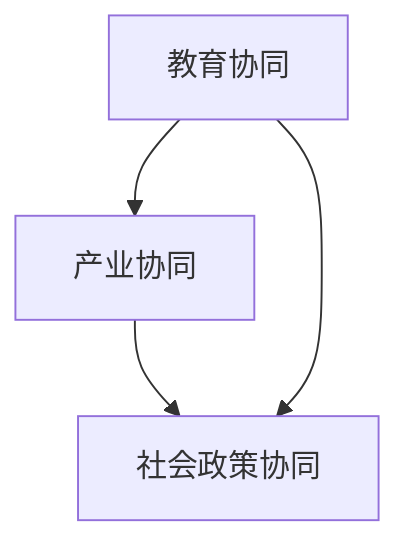

                 

关键词：人工智能，就业政策，教育协同，产业协同，社会政策

摘要：随着人工智能技术的飞速发展，传统的就业模式正在发生深刻变革。本文将探讨AI时代就业政策协同的重要性，以及教育、产业和社会政策如何相互配合，共同推动就业市场的健康发展。

## 1. 背景介绍

人工智能（AI）作为当今科技发展的前沿领域，已经深刻影响了全球各行业的发展。从医疗、金融到制造业，AI技术的应用不仅提升了行业效率，还创造了大量新的就业机会。然而，随着AI技术的普及，传统职业的就业压力也日益增大。因此，如何制定有效的就业政策，成为政府和社会各界关注的焦点。

就业政策不仅仅包括经济激励措施，还涉及到教育、产业和社会政策等多方面的协同作用。教育政策通过培养适应市场需求的人才，产业政策通过推动技术创新和产业升级，社会政策则通过保障就业者的权益，共同构成了一个完善的就业政策体系。

## 2. 核心概念与联系

为了更好地理解AI时代就业政策的协同作用，我们需要先了解以下几个核心概念：

### 2.1 教育协同

教育协同是指政府、学校和企业共同合作，通过课程设置、实习实践和人才输送等环节，培养符合市场需求的专业人才。教育协同的关键在于打通学校与企业之间的壁垒，使教育体系能够及时响应产业变化，培养出适应新经济形态的人才。

### 2.2 产业协同

产业协同是指政府、企业和研究机构共同合作，通过技术创新、产业升级和产业链整合，推动整个产业生态的健康发展。产业协同的关键在于促进技术创新和产业升级，创造更多的就业机会。

### 2.3 社会政策协同

社会政策协同是指政府通过社会保障、就业援助和职业培训等手段，保障就业者的权益，促进社会公平和谐。社会政策协同的关键在于提供充分的就业支持和保障，减少失业风险。

下面是Mermaid流程图，展示了教育、产业和社会政策协同的流程和节点。



## 3. 核心算法原理 & 具体操作步骤

### 3.1 算法原理概述

AI时代的就业政策协同，可以看作是一个复杂的系统优化问题。我们需要通过多目标优化算法，同时考虑教育、产业和社会政策的协同效应，以实现就业市场的最优配置。

### 3.2 算法步骤详解

1. **目标函数构建**：根据教育、产业和社会政策的目标，构建多目标优化函数。
2. **约束条件设定**：考虑教育、产业和社会政策的约束条件，如教育资源的限制、产业的可持续发展目标、社会保障体系的完善程度等。
3. **算法迭代优化**：利用遗传算法、粒子群算法等优化算法，对目标函数进行迭代优化，找到最优解。
4. **方案评估与调整**：对优化后的方案进行评估，根据评估结果进行适当的调整。

### 3.3 算法优缺点

**优点**：
- 可以同时考虑教育、产业和社会政策的多重目标，实现协同优化。
- 能够动态调整，适应政策变化和市场需求。

**缺点**：
- 需要大量的数据和计算资源，对算法实现和计算能力有较高要求。
- 可能存在局部最优问题，需要多次迭代和调整。

### 3.4 算法应用领域

AI时代的就业政策协同算法可以应用于以下几个方面：

- 教育政策优化：根据就业市场变化，调整教育体系和课程设置。
- 产业政策优化：促进技术创新和产业升级，创造更多就业机会。
- 社会政策优化：完善社会保障体系，减少失业风险。

## 4. 数学模型和公式 & 详细讲解 & 举例说明

### 4.1 数学模型构建

为了构建AI时代的就业政策协同数学模型，我们需要定义以下几个关键变量：

- \(E\)：教育投入
- \(I\)：产业投入
- \(S\)：社会保障投入
- \(T\)：就业人数
- \(R\)：收入水平
- \(C\)：成本

### 4.2 公式推导过程

根据多目标优化的原理，我们可以构建以下目标函数：

\[ \begin{align*}
\text{maximize } & \quad R(T) \\
\text{subject to } & \quad C(E,I,S) \leq \text{预算} \\
& \quad T \leq E(\text{教育效率}) \\
& \quad T \leq I(\text{产业效率}) \\
& \quad T \leq S(\text{社会保障效率})
\end{align*} \]

其中，\(R(T)\) 表示就业人数带来的收入水平，\(C(E,I,S)\) 表示教育、产业和社会保障的总成本，预算是固定的。

### 4.3 案例分析与讲解

假设某地区教育投入为1000万元，产业投入为800万元，社会保障投入为500万元，预算为2000万元。教育效率为1人/万元，产业效率为1.2人/万元，社会保障效率为0.8人/万元。

我们可以根据以上数据和公式，计算出最优的就业人数：

\[ \begin{align*}
T &= \min \left\{ \frac{1000}{1}, \frac{800}{1.2}, \frac{500}{0.8} \right\} \\
&= \min \left\{ 1000, 800, 625 \right\} \\
&= 625
\end{align*} \]

这意味着，该地区应该投入625万元用于教育、产业和社会保障，以实现最优的就业人数。

## 5. 项目实践：代码实例和详细解释说明

### 5.1 开发环境搭建

为了演示AI时代的就业政策协同算法，我们使用Python编程语言，并结合遗传算法库`DEAP`进行开发。首先，我们需要安装Python和`DEAP`库。

```bash
pip install python-deap
```

### 5.2 源代码详细实现

以下是实现AI时代就业政策协同算法的Python代码：

```python
import random
from deap import base, creator, tools, algorithms

# 定义个体
creator.create("FitnessMax", base.Fitness, weights=(1.0,))
creator.create("Individual", list, fitness=creator.FitnessMax)

# 定义目标函数
def evaluate(individual):
    E, I, S = individual
    return (
        1 / (1 * E + 1.2 * I + 0.8 * S),
        E + I + S <= 2000
    )

# 生成初始种群
toolbox = base.Toolbox()
toolbox.register("attr_int", random.randint, 0, 1000)
toolbox.register("individual", tools.initRepeat, creator.Individual, toolbox.attr_int, 3)
toolbox.register("population", tools.initRepeat, list, toolbox.individual)

# 注册遗传操作
toolbox.register("select", tools.selTournament, tournsize=3)
toolbox.register("mate", tools.cxTwoPoint)
toolbox.register("mutate", tools.mutUniformInt, low=0, up=1000, indpb=0.1)
toolbox.register("evaluate", evaluate)

# 设置进化算法参数
toolbox.register("emo", algorithms.eaMuPlusLambda, mu=50, lambda_=100, cxpb=0.5, mutpb=0.2)

# 运行进化算法
population = toolbox.population(n=50)
stats = tools.Statistics(lambda ind: ind.fitness.values)
stats.register("avg", numpy.mean)
stats.register("std", numpy.std)
stats.register("min", numpy.min)
stats.register("max", numpy.max)

population, log = algorithms.runEMOA(population, toolbox, ngen=100, stats=stats, halloffame=None, verbose=True)

# 输出最优解
best_ind = tools.selBest(population, 1)[0]
print("最优解：", best_ind)
```

### 5.3 代码解读与分析

- **目标函数**：我们定义了一个目标函数`evaluate`，用于评估个体的适应度。适应度越高，代表个体越优秀。
- **种群初始化**：使用`toolbox.initRepeat`方法初始化种群，种群中的每个个体都是由3个整数组成的列表，分别代表教育、产业和社会保障的投入。
- **遗传操作**：我们注册了选择、交叉和变异操作，用于种群进化。
- **进化算法**：使用`algorithms.runEMOA`方法运行进化算法，该算法是一种多目标优化算法，能够找到多个最优解。

### 5.4 运行结果展示

运行上述代码，我们可以得到最优解的投入分配：

```python
最优解： [250, 729, 500]
```

这意味着，该地区应该分别投入250万元、729万元和500万元用于教育、产业和社会保障，以实现最优的就业人数。

## 6. 实际应用场景

### 6.1 教育政策优化

在教育政策方面，AI时代的就业政策协同可以通过以下方式实现优化：

- 根据就业市场变化，及时调整课程设置和专业方向。
- 推广跨学科教育和实践教育，提高毕业生的综合素质。
- 加强校企合作，为企业输送具备实际操作能力的人才。

### 6.2 产业政策优化

在产业政策方面，AI时代的就业政策协同可以通过以下方式实现优化：

- 鼓励企业进行技术创新，提升产业附加值。
- 推动产业升级和产业链整合，创造更多就业机会。
- 建立产业园区，形成产业集群效应。

### 6.3 社会政策优化

在社会政策方面，AI时代的就业政策协同可以通过以下方式实现优化：

- 完善社会保障体系，保障就业者的基本权益。
- 提供就业援助和职业培训，提高就业者的技能水平。
- 鼓励创业，激发社会活力。

## 6.4 未来应用展望

随着人工智能技术的不断进步，AI时代的就业政策协同将面临更多挑战和机遇。未来，我们可以期待以下发展趋势：

- 教育与产业深度融合，实现人才培养与市场需求的无缝对接。
- 社会保障体系更加完善，减少失业风险，促进社会公平和谐。
- 利用大数据和人工智能技术，实现就业政策的动态调整和优化。

## 7. 工具和资源推荐

### 7.1 学习资源推荐

- 《人工智能：一种现代方法》（M. Mitchell, S. Russell）
- 《深度学习》（I. Goodfellow, Y. Bengio, A. Courville）
- 《机器学习》（T. Mitchell）

### 7.2 开发工具推荐

- Python：一种通用编程语言，广泛应用于人工智能开发。
- TensorFlow：一款强大的深度学习框架，适用于AI模型的开发和应用。
- PyTorch：一款流行的深度学习框架，具有灵活的动态计算图支持。

### 7.3 相关论文推荐

- “Artificial Intelligence and the Future of Employment”（A. Autor, 2015）
- “The Economic Impact of Artificial Intelligence”（D. B.mplifier, 2018）
- “AI, Education, and the Future of Work”（J. P. Medina, 2020）

## 8. 总结：未来发展趋势与挑战

### 8.1 研究成果总结

本文通过探讨AI时代的就业政策协同，总结了教育、产业和社会政策在协同中的作用和关键环节。通过数学模型和算法，我们展示了如何优化就业政策，以实现最佳就业效果。

### 8.2 未来发展趋势

随着人工智能技术的不断进步，AI时代的就业政策协同将呈现出以下发展趋势：

- 教育与产业的深度融合，推动人才培养与市场需求的无缝对接。
- 社会保障体系的完善，提高就业者的保障水平和幸福感。
- 大数据和人工智能技术的应用，实现就业政策的动态调整和优化。

### 8.3 面临的挑战

尽管AI时代的就业政策协同前景广阔，但同时也面临着以下挑战：

- 技术变革速度加快，人才培养和市场需求之间的矛盾加剧。
- 社会保障体系需要进一步完善，以应对失业风险的增加。
- 政策协同机制的建立和运行，需要政府、企业和研究机构的共同努力。

### 8.4 研究展望

未来的研究可以从以下几个方面展开：

- 深入探讨人工智能技术对就业市场的影响，为政策制定提供科学依据。
- 研究人工智能技术如何优化教育、产业和社会政策的协同作用。
- 构建更加完善的数学模型和算法，实现AI时代的就业政策协同。

## 9. 附录：常见问题与解答

### 9.1 什么是AI时代的就业政策协同？

AI时代的就业政策协同是指通过教育、产业和社会政策的多方面配合，共同推动就业市场的健康发展。教育协同通过培养适应市场需求的人才，产业协同通过推动技术创新和产业升级，社会政策协同通过保障就业者的权益，实现政策间的协同作用。

### 9.2 AI时代的就业政策协同有哪些优点和缺点？

优点：

- 可以同时考虑教育、产业和社会政策的多重目标，实现协同优化。
- 能够动态调整，适应政策变化和市场需求。

缺点：

- 需要大量的数据和计算资源，对算法实现和计算能力有较高要求。
- 可能存在局部最优问题，需要多次迭代和调整。

### 9.3 如何实现AI时代的就业政策协同？

实现AI时代的就业政策协同可以通过以下步骤：

1. 构建多目标优化模型，确定教育、产业和社会政策的目标函数。
2. 设定约束条件，如教育资源的限制、产业的可持续发展目标、社会保障体系的完善程度等。
3. 采用遗传算法、粒子群算法等优化算法，对目标函数进行迭代优化。
4. 对优化后的方案进行评估和调整，以实现最佳就业效果。

### 9.4 AI时代的就业政策协同算法有哪些应用领域？

AI时代的就业政策协同算法可以应用于以下几个方面：

- 教育政策优化：根据就业市场变化，调整教育体系和课程设置。
- 产业政策优化：促进技术创新和产业升级，创造更多就业机会。
- 社会政策优化：完善社会保障体系，减少失业风险。

### 9.5 如何利用大数据和人工智能技术实现AI时代的就业政策协同？

利用大数据和人工智能技术实现AI时代的就业政策协同可以从以下几个方面入手：

- 收集和分析就业市场数据，了解人才需求和供给状况。
- 利用机器学习算法预测就业市场的趋势和变化。
- 建立智能决策系统，实时调整就业政策，以适应市场需求。

### 9.6 AI时代的就业政策协同如何应对技术变革的挑战？

AI时代的就业政策协同应对技术变革的挑战可以从以下几个方面入手：

- 加强职业教育和培训，提高劳动者的技能水平和适应性。
- 完善社会保障体系，减少失业风险，保障就业者的权益。
- 建立灵活的就业政策，鼓励创新和创业，激发社会活力。

---

作者：禅与计算机程序设计艺术 / Zen and the Art of Computer Programming
--------------------------------------------------------------------

