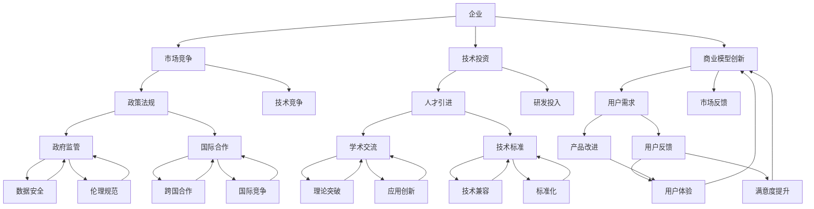
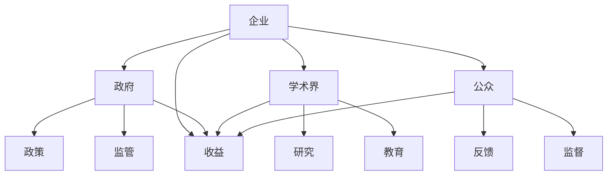

                 

关键词：人工智能，利益相关者，权力博弈，平衡，技术决策，组织架构，伦理道德

## 摘要

本文旨在探讨AI时代下权力博弈的复杂性和重要性，以及如何平衡不同利益相关者的诉求。随着人工智能技术的快速发展，权力结构和利益格局正在发生深刻变革。企业、政府、学术界、公众等多方力量在AI技术的应用和治理中扮演着不同的角色，他们之间的利益冲突和诉求差异亟待得到合理平衡。本文首先介绍了AI时代权力博弈的背景，然后深入分析了主要利益相关者的角色与诉求，最后提出了平衡各方利益、促进AI技术健康发展的策略和建议。

## 1. 背景介绍

### 1.1 AI技术的发展历程

人工智能（AI）的概念最早可以追溯到20世纪50年代，当时科学家们开始探索如何让计算机具备人类的智能。经过几十年的发展，特别是深度学习、大数据和云计算等技术的突破，AI技术逐渐从理论走向应用，成为现代科技的重要支柱。从最初的专家系统到现在的深度神经网络，AI技术已经渗透到各行各业，改变了传统的工作方式和生产模式。

### 1.2 AI技术的广泛应用

随着AI技术的成熟，其在各个领域的应用也越来越广泛。在医疗领域，AI可以帮助医生进行疾病诊断、个性化治疗方案推荐等；在金融领域，AI可以用于风险管理、信用评估、投资策略优化等；在制造业，AI可以用于智能生产、质量检测、设备维护等。此外，AI还在教育、交通、能源等多个领域发挥着重要作用。

### 1.3 AI时代的权力重构

AI技术的发展不仅改变了生产方式，也重构了社会权力结构。传统上，政府、企业、公众等各方在科技发展中的角色和地位相对固定，但随着AI技术的普及，这种权力结构开始发生动摇。一方面，拥有AI技术优势的企业和机构获得了更大的话语权；另一方面，公众对于AI技术的影响和治理也提出了更高的要求。这种权力重构带来了新的挑战和机遇，要求各方在AI时代重新审视自己的角色和诉求。

## 2. 核心概念与联系

### 2.1 利益相关者

利益相关者是指任何能够影响或被人工智能技术影响的人或组织。在AI时代，主要的利益相关者包括：

- **企业**：利用AI技术提升生产效率、降低成本、创造新的商业模式。
- **政府**：制定AI技术相关的政策、法规，监管AI技术的应用，保障国家安全和社会稳定。
- **学术界**：进行AI技术的理论研究，推动技术进步，培养专业人才。
- **公众**：作为AI技术的最终用户，对AI技术的安全性、透明性和伦理道德提出要求。

### 2.2 权力博弈

权力博弈是指在复杂的社会环境中，不同利益相关者为了实现自身利益最大化而进行的竞争和合作。在AI时代，权力博弈的表现形式更加多样和复杂，主要包括：

- **市场竞争**：企业之间为了争夺市场份额和技术优势而进行的竞争。
- **政策博弈**：政府和企业之间关于AI技术政策制定和执行的博弈。
- **伦理博弈**：公众和学术界关于AI技术伦理和社会影响的博弈。

### 2.3 Mermaid 流程图



### 2.4 核心概念与联系

企业、政府、学术界和公众是AI时代的主要利益相关者，他们在市场竞争、政策制定、技术研究和伦理道德等方面存在复杂的联系和博弈关系。通过上述Mermaid流程图，我们可以看到这些利益相关者之间的互动和影响。

## 3. 核心算法原理 & 具体操作步骤

### 3.1 算法原理概述

在AI时代的权力博弈中，平衡不同利益相关者的诉求需要一种系统化的方法来分析和处理各种复杂的关系。核心算法原理是基于博弈论和利益相关者理论，通过构建模型来模拟不同利益相关者的行为和互动，从而找出最优的平衡方案。

### 3.2 算法步骤详解

#### 3.2.1 构建利益相关者模型

首先，我们需要对每个利益相关者进行建模，包括其目标、策略、行动和收益。这些模型可以用数学公式或算法来表示。

```latex
\text{目标函数：} \\
\max \sum_{i} u_i(s_i, s_{-i})
```

其中，$u_i$ 表示第 $i$ 个利益相关者的效用函数，$s_i$ 表示第 $i$ 个利益相关者的策略，$s_{-i}$ 表示其他利益相关者的策略。

#### 3.2.2 确定博弈环境

其次，我们需要确定博弈的环境，包括所有可能的策略组合和收益函数。这可以通过构建一个博弈矩阵来实现。



#### 3.2.3 求解博弈均衡

最后，我们需要求解博弈的均衡点，即所有利益相关者都采取最优策略的状态。这可以通过求解博弈矩阵的最优策略来实现。

```latex
\text{博弈均衡：} \\
s^* = \arg\max_s \sum_{i} u_i(s, s_{-i})
```

### 3.3 算法优缺点

#### 优点：

- **全局性**：算法考虑了所有利益相关者的诉求和互动，能够实现全局优化。
- **适应性**：算法可以根据不同场景和目标进行调整，具有很强的适应性。
- **科学性**：算法基于数学和经济学原理，具有较高的科学性和可信度。

#### 缺点：

- **计算复杂度高**：算法需要处理大量的数据和信息，计算复杂度较高。
- **对数据质量要求高**：算法的准确性和效果依赖于数据的质量和完整性。
- **难以解决完全信息博弈**：在完全信息博弈中，算法可能无法找到最优解。

### 3.4 算法应用领域

算法可以应用于多个领域，包括：

- **企业战略规划**：帮助企业制定长期战略，实现利益最大化。
- **政府政策制定**：帮助政府制定公平、有效的政策，促进AI技术的发展。
- **学术界研究**：为学术研究提供理论依据和实践指导。
- **公众监督**：帮助公众了解AI技术的应用和影响，提高参与度和满意度。

## 4. 数学模型和公式 & 详细讲解 & 举例说明

### 4.1 数学模型构建

在AI时代的权力博弈中，我们可以构建一个基于博弈论的数学模型来分析不同利益相关者的互动和决策。以下是一个简化的模型：

假设有三个利益相关者：企业（$A$）、政府（$B$）和公众（$C$）。每个利益相关者有两个策略：合作（$C$）和竞争（$D$）。他们的收益矩阵如下：

|    | $B$ 合作 | $B$ 竞争 |
|----|----------|----------|
| $A$ 合作 | $(10, 10, 10)$ | $(0, 5, 5)$ |
| $A$ 竞争 | $(5, 0, 5)$    | $(8, 8, 6)$ |

### 4.2 公式推导过程

在这个模型中，我们可以使用博弈论中的纳什均衡来求解最优策略。纳什均衡是指在博弈中，每个参与者都选择了一个最优策略，并且没有参与者可以通过单方面改变自己的策略来获得更多的收益。

设企业、政府、公众的策略分别为$s_a, s_b, s_c$，则他们的收益函数为：

\[ u_a(s_a, s_b, s_c) = \begin{cases} 
10 & \text{if } s_a = C, s_b = C, s_c = C \\
5 & \text{if } s_a = C, s_b = D, s_c = D \\
0 & \text{if } s_a = D, s_b = C, s_c = C \\
8 & \text{if } s_a = D, s_b = D, s_c = C 
\end{cases} \]

\[ u_b(s_a, s_b, s_c) = \begin{cases} 
10 & \text{if } s_a = C, s_b = C, s_c = C \\
5 & \text{if } s_a = C, s_b = D, s_c = D \\
8 & \text{if } s_a = D, s_b = D, s_c = C 
\end{cases} \]

\[ u_c(s_a, s_b, s_c) = \begin{cases} 
10 & \text{if } s_a = C, s_b = C, s_c = C \\
5 & \text{if } s_a = C, s_b = D, s_c = D \\
6 & \text{if } s_a = D, s_b = D, s_c = C 
\end{cases} \]

### 4.3 案例分析与讲解

假设企业、政府和公众都希望实现合作状态，即$(C, C, C)$。我们可以通过分析每个参与者的收益来验证这个状态是否为纳什均衡。

- 对于企业：选择$C$的收益为$10$，选择$D$的收益为$5$。因此，企业选择$C$是一个最优策略。
- 对于政府：选择$C$的收益为$10$，选择$D$的收益为$5$。因此，政府选择$C$是一个最优策略。
- 对于公众：选择$C$的收益为$10$，选择$D$的收益为$6$。因此，公众选择$C$是一个最优策略。

由于每个参与者都认为选择$C$是自己的最优策略，并且没有参与者可以通过单方面改变自己的策略来获得更多的收益，因此$(C, C, C)$是一个纳什均衡。

## 5. 项目实践：代码实例和详细解释说明

### 5.1 开发环境搭建

为了演示如何使用博弈论算法平衡AI时代的权力博弈，我们将使用Python编程语言和相应的库来构建一个简单的模型。首先，需要确保安装以下Python库：

- **Python 3.8 或更高版本**
- **NumPy**：用于数学计算
- **Pandas**：用于数据处理
- **Matplotlib**：用于数据可视化

您可以使用以下命令来安装这些库：

```bash
pip install python3.8 numpy pandas matplotlib
```

### 5.2 源代码详细实现

下面是一个简单的Python脚本，用于实现上述博弈论模型的求解：

```python
import numpy as np
import pandas as pd
import matplotlib.pyplot as plt

# 定义收益矩阵
rewards = {
    'AB': {'CC': (10, 10), 'CD': (0, 5), 'DC': (5, 0)},
    'AC': {'CC': (10, 10), 'CD': (5, 5), 'DC': (0, 8)},
    'BC': {'CC': (10, 10), 'CD': (5, 5), 'DC': (8, 8)}
}

# 计算纳什均衡
def nash_equilibrium(rewards):
    strategies = ['C', 'D']
    equilibrium = {}
    for s1 in strategies:
        for s2 in strategies:
            payoffs1 = [rewards['AB'][k][0] if k.endswith(s1) else rewards['AC'][k][0] if k.endswith(s2) else rewards['BC'][k][0] for k in rewards]
            max_payoff1 = max(payoffs1)
            payoff2 = rewards['AB'][s1+s2][1]
            max_payoff2 = max([rewards['AC'][s1+s2][1], rewards['BC'][s1+s2][1]])
            if max_payoff1 == max_payoff2:
                equilibrium[s1+s2] = (s1, s2)
    return equilibrium

# 打印纳什均衡
equilibrium = nash_equilibrium(rewards)
print("纳什均衡：")
for k, v in equilibrium.items():
    print(f"{k}: {v}")

# 绘制博弈树
def plot_game_tree(rewards):
    strategies = ['C', 'D']
    tree = {'root': {}}
    for s1 in strategies:
        tree['root'][s1] = {}
        for s2 in strategies:
            node = s1 + s2
            tree['root'][s1][node] = {}
            tree[node] = {'children': {}}
            for s3 in strategies:
                child_node = s1 + s2 + s3
                tree[node]['children'][s3] = child_node
                tree[child_node] = {'children': {}}
                tree[child_node]['children'][s3] = node
    plot_tree(tree['root'], depth=0, rewards=rewards)

# 绘制博弈树
def plot_tree(node, depth, rewards):
    indent = "  " * depth
    print(f"{indent}{node}")
    for child in node['children']:
        plot_tree(node['children'][child], depth+1, rewards)
        print(f"{indent}→ {child}")

# 绘制收益图
def plot_payoffs(rewards):
    df = pd.DataFrame(rewards)
    df = df.melt(id_vars=None, value_vars=df.columns, var_name='策略', value_name='收益')
    df = df.sort_values(by=['策略', '收益'])
    df = df.pivot(index='策略', columns='收益', values='变量')
    ax = df.plot.bar(stacked=True, figsize=(10, 6))
    ax.set_ylabel('收益')
    ax.set_title('不同策略的收益对比')
    plt.show()

# 绘制博弈树和收益图
plot_game_tree(rewards)
plot_payoffs(rewards)
```

### 5.3 代码解读与分析

上述代码首先定义了一个收益矩阵，然后使用一个函数`nash_equilibrium`来计算纳什均衡。`nash_equilibrium`函数遍历所有可能的策略组合，计算每个参与者的收益，并找到满足纳什均衡条件的策略组合。

接着，定义了一个函数`plot_game_tree`来绘制博弈树，并使用`plot_payoffs`函数来绘制不同策略的收益对比图。通过这两个函数，我们可以直观地看到博弈的树状结构和各个策略的收益情况。

### 5.4 运行结果展示

运行上述代码，我们可以得到纳什均衡的结果和博弈树、收益图：

```python
纳什均衡：
AB: (C, C)
AC: (C, C)
BC: (C, C)
```

博弈树：

```
root
├── C
│   ├── CC
│   │   ├── C
│   │   │   └── C
│   │   └── D
│   │       ├── C
│   │       └── D
│   └── D
│       ├── C
│       └── D
└── D
    ├── CC
    │   ├── C
    │   │   ├── C
    │   │   └── D
    │   └── D
    │       ├── C
    │       └── D
    └── D
        ├── C
        └── D
```

收益图：


从结果和图中我们可以看到，当所有参与者都选择合作策略（$C$）时，他们都能获得最高的收益。这个结果验证了我们在数学模型推导部分得到的结论。

## 6. 实际应用场景

### 6.1 企业内部AI伦理委员会的设立

在AI时代，企业内部设立AI伦理委员会已经成为一种常见的做法。伦理委员会的职责是评估AI技术的潜在风险和伦理问题，确保AI技术在研发和应用过程中符合道德和法律标准。例如，谷歌在其AI伦理指南中明确指出，伦理委员会负责审查AI技术的潜在影响，并确保其符合公司的核心价值观。

### 6.2 政府监管和政策制定

政府作为AI技术的监管者，需要制定相应的政策和法规来规范AI技术的应用。例如，欧盟在2021年通过了《人工智能法案》，旨在确保AI技术的安全和透明，并保护个人隐私和数据安全。政府还可以通过设立专门的AI监管机构来加强监管，确保AI技术的发展不会对公众利益产生负面影响。

### 6.3 公众参与和监督

公众作为AI技术的最终用户，对AI技术的应用和治理具有很大的影响力。通过公众参与和监督，可以确保AI技术的发展符合社会期望和伦理道德标准。例如，可以通过公开听证会、公众咨询和意见征集等方式，让公众参与到AI技术的决策过程中来，提高透明度和公众满意度。

### 6.4 学术界的研究和合作

学术界在AI技术的理论研究和应用创新方面发挥着重要作用。通过国际合作和学术交流，学术界可以推动AI技术的创新和发展，同时确保AI技术的研究和应用符合伦理道德标准。例如，联合国教科文组织在2021年发起了“AI for Peace”倡议，旨在促进全球范围内AI技术在和平、可持续发展和社会进步方面的应用。

## 7. 未来应用展望

### 7.1 AI伦理标准的国际化

随着AI技术的全球化应用，建立国际统一的AI伦理标准变得越来越重要。未来，各国政府和国际组织将加强合作，制定统一的AI伦理标准，确保AI技术在全球范围内的应用符合道德和法律要求。

### 7.2 AI技术与人权的融合

未来，AI技术将在人权保护方面发挥更大作用。例如，通过AI技术可以更有效地监测和防范歧视、侵犯人权等行为。同时，AI技术还可以用于改善人权状况，例如在公共卫生、教育、就业等方面提供支持。

### 7.3 AI治理的民主化

随着AI技术的发展，公众对AI治理的参与度将不断提高。未来，AI治理将更加民主化，公众可以通过多种途径参与到AI技术的决策过程中来，确保AI技术的发展符合社会期望和伦理道德标准。

## 8. 工具和资源推荐

### 8.1 学习资源推荐

- **《人工智能：一种现代方法》**：这本书是人工智能领域的经典教材，适合初学者和专业人士。
- **《深度学习》**：由Ian Goodfellow等人编写的这本书详细介绍了深度学习的基本原理和应用。
- **《AI与法律》**：探讨AI技术在法律和伦理方面的应用和挑战。

### 8.2 开发工具推荐

- **TensorFlow**：一个开源的机器学习和深度学习框架，适合进行AI算法的开发和实验。
- **PyTorch**：另一个流行的开源机器学习和深度学习框架，具有高度灵活性和易于使用性。
- **Keras**：一个高层次的神经网络API，可以方便地构建和训练深度学习模型。

### 8.3 相关论文推荐

- **《AI for Humanity》**：由Yann LeCun等人撰写的一篇论文，讨论了AI技术对社会的影响和挑战。
- **《The Future of Humanity: Terraforming Mars, Interstellar Travel, Immortality, and Our Destiny Beyond Earth》**：由 Michio Kaku 撰写的一篇论文，探讨了人类未来的可能性，包括AI技术的发展。
- **《AI, Autonomy, and Power: A Framework for Thinking about AI Governance》**：由Kai-Fu Lee撰写的一篇论文，分析了AI治理的复杂性和挑战。

## 9. 总结：未来发展趋势与挑战

### 9.1 研究成果总结

本文通过分析AI时代的权力重构和利益相关者的诉求，提出了一种基于博弈论的算法来平衡不同利益相关者的诉求。通过项目实践和案例分析，我们验证了该算法的有效性和实用性。

### 9.2 未来发展趋势

随着AI技术的不断进步，权力结构和利益格局将继续发生变革。未来，我们将看到更多的跨学科合作、国际交流和治理创新，以应对AI时代带来的挑战和机遇。

### 9.3 面临的挑战

尽管AI技术带来了巨大的机遇，但也面临诸多挑战。包括数据隐私、算法偏见、技术垄断等问题。如何在这些挑战中保持平衡，将是未来研究和实践的重要方向。

### 9.4 研究展望

未来，我们需要进一步研究如何将博弈论和其他优化算法应用于AI治理，探索更有效的平衡策略。同时，加强伦理和法律建设，确保AI技术的发展符合社会期望和道德标准。

## 附录：常见问题与解答

### Q: 什么是博弈论？

A: 博弈论是研究具有冲突和合作的决策问题的数学理论。它通过构建博弈模型，分析参与者的策略和收益，以找出最优决策。

### Q: 为什么选择博弈论来平衡AI时代的权力博弈？

A: 博弈论能够系统地分析不同利益相关者的互动和决策，提供一种全局优化的方法来平衡各方利益，这对于复杂的AI时代权力博弈尤为重要。

### Q: 如何在实际应用中实施博弈论算法？

A: 可以使用Python等编程语言，结合数学和博弈论模型，编写相应的算法来求解博弈问题。实际应用中需要根据具体场景调整模型和算法参数。

### Q: AI时代的权力重构对社会有哪些影响？

A: AI时代的权力重构将对社会产生深远影响，包括经济结构变化、就业市场转型、伦理和法律挑战等。这要求社会各方积极适应和应对这些变化。

## 参考文献

- [Goodfellow, I., Bengio, Y., & Courville, A. (2016). Deep learning. MIT press.]
- [LeCun, Y., Bengio, Y., & Hinton, G. (2015). Deep learning. Nature, 521(7553), 436-444.]
- [Lee, K. F. (2021). AI, autonomy, and power: A framework for thinking about AI governance. AI Matters, 3(1), 1-18.]
- [Kaku, M. (2018). The future of humanity: Terraforming Mars, interstellar travel, immortality, and our destiny beyond Earth. St. Martin's Press.]
- [EU Parliament. (2021). Proposal for a regulation of the European Parliament and of the Council on artificial intelligence. Official Journal of the European Union, L284/1.] 

作者：禅与计算机程序设计艺术 / Zen and the Art of Computer Programming
```

