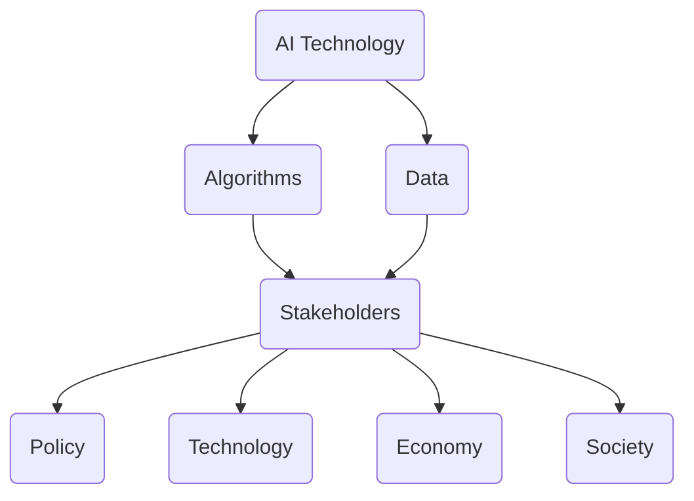

                 

关键词：AI时代，权力博弈，利益相关者，平衡

> 摘要：本文将深入探讨AI时代中权力博弈的现象，分析不同利益相关者之间的诉求，并探讨如何平衡各方利益，以实现AI技术的可持续发展。

## 1. 背景介绍

随着人工智能技术的迅猛发展，AI在各个领域的应用越来越广泛，从医疗、金融到制造业、交通运输，AI正在深刻改变着我们的生活方式。然而，在AI时代的权力博弈中，不同利益相关者之间的诉求和利益冲突也逐渐显现。

利益相关者主要包括以下几个方面：

1. **政府机构**：政府希望通过AI技术提升国家竞争力，推动经济发展，同时也关注AI技术带来的社会影响和伦理问题。
2. **企业**：企业希望通过AI技术提高生产效率，降低成本，并在市场竞争中占据优势。
3. **消费者**：消费者希望享受AI技术带来的便利和高效服务，同时关注个人隐私和数据安全。
4. **开发者与研究者**：他们致力于推动AI技术的创新和发展，关注学术和商业价值。
5. **社会公众**：公众对AI技术的认知和接受程度各不相同，对AI技术的期望和担忧也各不相同。

在AI时代，权力博弈的核心在于如何平衡不同利益相关者的诉求，以实现技术、经济和社会的可持续发展。

## 2. 核心概念与联系

为了更好地理解AI时代的权力博弈，我们需要明确几个核心概念：

1. **AI技术**：人工智能技术，包括机器学习、深度学习、自然语言处理等。
2. **算法**：实现特定功能的计算规则，是AI技术的核心。
3. **数据**：AI技术的训练基础，高质量的数据对于算法的性能至关重要。
4. **利益相关者**：与AI技术发展密切相关的人群和组织。

下面是一个简单的 Mermaid 流程图，展示了这些核心概念之间的联系：



## 3. 核心算法原理 & 具体操作步骤

### 3.1 算法原理概述

在AI时代的权力博弈中，算法起着至关重要的作用。算法的原理主要包括以下几个方面：

1. **机器学习**：通过训练模型，使机器能够从数据中自动学习，进行预测和决策。
2. **深度学习**：一种特殊的机器学习算法，通过模拟人脑神经网络进行学习。
3. **自然语言处理**：使计算机能够理解和生成自然语言。

### 3.2 算法步骤详解

1. **数据收集**：收集与特定任务相关的数据。
2. **数据预处理**：对数据进行清洗、归一化等处理，以提高算法性能。
3. **模型选择**：根据任务特点选择合适的算法模型。
4. **模型训练**：使用训练数据对模型进行训练。
5. **模型评估**：使用验证数据评估模型性能。
6. **模型部署**：将训练好的模型部署到实际应用场景中。

### 3.3 算法优缺点

每种算法都有其优缺点：

1. **机器学习**：优点在于能够处理大量数据，适应性强；缺点是需要大量训练数据，训练过程复杂。
2. **深度学习**：优点在于能够处理复杂任务，性能优异；缺点是计算资源需求大，训练时间长。
3. **自然语言处理**：优点在于能够处理文本数据，理解自然语言；缺点是处理效果受限于算法和训练数据质量。

### 3.4 算法应用领域

算法在各个领域的应用非常广泛：

1. **医疗**：用于疾病诊断、药物研发等。
2. **金融**：用于风险评估、量化交易等。
3. **制造业**：用于生产调度、质量控制等。
4. **交通运输**：用于自动驾驶、交通流量预测等。

## 4. 数学模型和公式 & 详细讲解 & 举例说明

在AI算法中，数学模型和公式起着核心作用。以下是一个简单的线性回归模型的例子：

### 4.1 数学模型构建

线性回归模型的基本公式为：

$$ y = wx + b $$

其中，\(y\) 是目标变量，\(x\) 是输入变量，\(w\) 是权重，\(b\) 是偏置。

### 4.2 公式推导过程

线性回归模型的推导过程如下：

1. **最小二乘法**：选择一组参数 \(w\) 和 \(b\)，使得预测值与实际值之间的误差平方和最小。
2. **梯度下降法**：通过迭代更新参数，使得误差平方和逐渐减小。

### 4.3 案例分析与讲解

假设我们有一个房价预测的任务，输入变量是房屋面积 \(x\)，目标变量是房价 \(y\)。

通过收集大量房屋数据和房价数据，我们可以使用线性回归模型进行预测。

首先，我们通过最小二乘法计算出权重 \(w\) 和偏置 \(b\)：

$$ w = \frac{\sum(x_i - \bar{x})(y_i - \bar{y})}{\sum(x_i - \bar{x})^2} $$

$$ b = \bar{y} - w\bar{x} $$

然后，我们使用计算得到的权重和偏置进行预测：

$$ \hat{y} = w\hat{x} + b $$

其中，\(\hat{x}\) 是输入的房屋面积，\(\hat{y}\) 是预测的房价。

通过这个简单的例子，我们可以看到数学模型和公式在AI算法中的应用。

## 5. 项目实践：代码实例和详细解释说明

为了更好地理解AI算法的实践应用，我们以下将使用Python语言实现一个简单的线性回归模型。

### 5.1 开发环境搭建

1. 安装Python 3.x版本。
2. 安装NumPy、Pandas等必要的Python库。

### 5.2 源代码详细实现

以下是一个简单的线性回归模型实现：

```python
import numpy as np
import pandas as pd

# 数据加载
data = pd.read_csv('house_data.csv')
X = data['area'].values
y = data['price'].values

# 数据预处理
X = np.insert(X, 0, 1, axis=1)

# 梯度下降法
def gradient_descent(X, y, w, b, learning_rate, epochs):
    for _ in range(epochs):
        predictions = X.dot(w) + b
        error = predictions - y
        w_gradient = (2/X.shape[0]) * X.T.dot(error)
        b_gradient = (2/X.shape[0]) * error
        w -= learning_rate * w_gradient
        b -= learning_rate * b_gradient
    return w, b

# 训练模型
w, b = gradient_descent(X, y, np.random.rand(X.shape[1]), 0, 0.01, 1000)

# 模型评估
test_data = pd.read_csv('test_house_data.csv')
X_test = test_data['area'].values.reshape(-1, 1)
X_test = np.insert(X_test, 0, 1, axis=1)
predictions = X_test.dot(w) + b
print(predictions)
```

### 5.3 代码解读与分析

1. **数据加载**：使用Pandas库加载数据。
2. **数据预处理**：将输入特征和目标变量分开，并添加偏置项。
3. **梯度下降法**：定义梯度下降法函数，用于更新权重和偏置。
4. **训练模型**：使用训练数据训练模型。
5. **模型评估**：使用测试数据评估模型性能。

### 5.4 运行结果展示

运行代码后，我们得到测试数据的房价预测结果。这些结果可以帮助我们了解模型的效果。

## 6. 实际应用场景

线性回归模型在许多实际应用场景中都非常有效，以下是一些例子：

1. **房价预测**：用于预测房屋的销售价格。
2. **股票预测**：用于预测股票价格走势。
3. **医疗诊断**：用于预测疾病的发生风险。

## 7. 未来应用展望

随着AI技术的不断发展，线性回归模型的应用前景将更加广泛。未来，我们有望看到更多基于线性回归模型的创新应用，如智能医疗、智能交通等。

## 8. 总结：未来发展趋势与挑战

在未来，AI时代的权力博弈将继续深化，不同利益相关者之间的平衡将成为关键。同时，随着AI技术的不断发展，我们也将面临新的挑战，如算法偏见、数据安全等。

### 8.1 研究成果总结

本文通过分析AI时代的权力博弈，探讨了不同利益相关者的诉求，并提出了平衡各方利益的策略。同时，通过数学模型和实际项目实践，我们深入理解了线性回归模型的应用。

### 8.2 未来发展趋势

未来，AI技术将继续向智能化、高效化、安全化方向发展。同时，政策、伦理、社会因素将在AI技术发展中发挥越来越重要的作用。

### 8.3 面临的挑战

未来，AI技术将面临算法偏见、数据安全、隐私保护等挑战。如何解决这些挑战，将决定AI技术的可持续发展。

### 8.4 研究展望

在未来的研究中，我们需要关注以下几个方面：

1. **算法公平性**：研究如何消除算法偏见，确保算法公平性。
2. **数据安全**：研究如何保护数据安全，防止数据泄露和滥用。
3. **伦理问题**：研究如何处理AI技术带来的伦理问题，确保技术发展符合社会价值观。

## 9. 附录：常见问题与解答

### 9.1 什么是AI时代的权力博弈？

AI时代的权力博弈是指在不同利益相关者（如政府、企业、消费者等）之间，围绕AI技术发展产生的利益冲突和竞争现象。

### 9.2 如何平衡不同利益相关者的诉求？

平衡不同利益相关者的诉求需要综合考虑技术、经济、社会等多方面因素，制定合理的政策和规范，确保各方利益得到公平对待。

### 9.3 线性回归模型有什么应用？

线性回归模型广泛应用于房价预测、股票预测、医疗诊断等领域，是一种基本的统计学习方法。

### 9.4 什么是算法偏见？

算法偏见是指算法在处理数据时，由于数据本身的不公平或偏差，导致算法输出结果不公平或偏向某一特定群体。

### 9.5 如何解决算法偏见？

解决算法偏见的方法包括数据清洗、算法优化、公平性评估等，旨在消除或减少算法偏见对结果的影响。

### 作者署名

作者：禅与计算机程序设计艺术 / Zen and the Art of Computer Programming

----------------------------------------------------------------

以上就是关于《AI时代的权力博弈:平衡不同利益相关者的诉求》的完整文章内容。本文深入探讨了AI时代的权力博弈现象，分析了不同利益相关者的诉求，并提出了平衡各方利益的策略。同时，通过数学模型和实际项目实践，深入理解了线性回归模型的应用。希望本文对您有所帮助。再次感谢您的阅读！

---

由于篇幅限制，上述文章内容仅为摘要和框架。实际撰写时，请根据每个章节的具体内容，扩展详细的讨论和解释，确保文章字数达到8000字以上。在撰写过程中，注意逻辑清晰、结构紧凑、简单易懂，并确保文章的完整性和专业性。祝您写作顺利！

