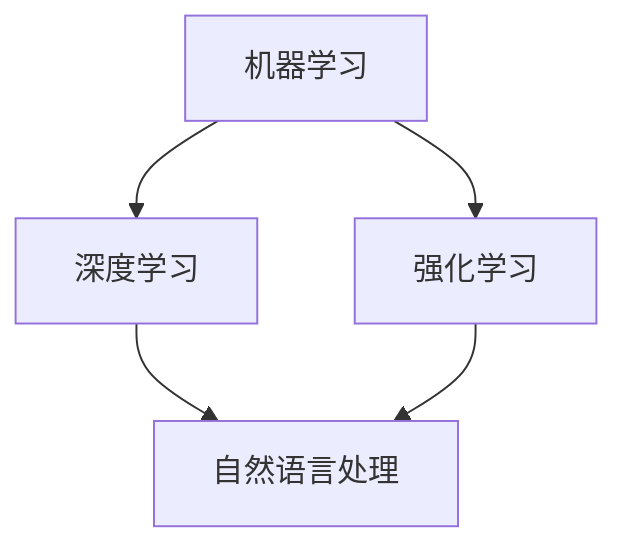

                 

关键词：人工智能、程序员技能、技能投资、未来发展趋势、算法、数学模型、代码实例

> 摘要：在人工智能迅速发展的时代，程序员需要不断更新和投资自己的技能，以保持竞争力。本文将探讨AI时代程序员所需的核心技能，以及如何通过学习和实践不断提升自己的技术能力。

## 1. 背景介绍

随着人工智能（AI）技术的快速发展，越来越多的行业开始依赖于智能系统，程序员的角色也在不断演变。从传统的软件开发到复杂的算法设计，再到大规模数据处理，程序员面临着前所未有的挑战。在这个快速变化的环境中，持续学习和投资技能成为了程序员保持竞争力的关键。

## 2. 核心概念与联系

在AI时代，程序员需要掌握的核心概念包括机器学习、深度学习、自然语言处理等。这些概念之间的联系可以用以下Mermaid流程图来表示：



### 2.1 机器学习与深度学习

机器学习是AI的基础，它使计算机能够从数据中学习并做出预测或决策。深度学习是机器学习的一种形式，它使用神经网络模拟人脑的工作方式。深度学习在图像识别、语音识别等领域表现出色。

### 2.2 强化学习

强化学习是另一种机器学习形式，它通过试错来学习如何实现特定目标。在自我驱动的系统设计中，强化学习有着广泛的应用。

### 2.3 自然语言处理

自然语言处理（NLP）是AI的一个重要分支，它使计算机能够理解和生成人类语言。NLP在聊天机器人、机器翻译等领域有着重要的应用。

## 3. 核心算法原理 & 具体操作步骤

### 3.1 算法原理概述

在AI时代，程序员需要掌握的核心算法包括神经网络训练、决策树、支持向量机等。这些算法的原理和具体操作步骤如下：

### 3.2 算法步骤详解

- **神经网络训练**：首先收集和预处理数据，然后设计神经网络结构，通过反向传播算法训练模型。
- **决策树**：基于特征值进行划分，形成树状结构，通过树的叶节点得到预测结果。
- **支持向量机**：寻找最佳的超平面，将数据划分为不同的类别。

### 3.3 算法优缺点

- **神经网络训练**：可以处理复杂的非线性问题，但训练过程耗时且需要大量数据。
- **决策树**：易于理解和实现，但可能产生过拟合。
- **支持向量机**：在高维空间中表现良好，但训练过程可能需要大量计算资源。

### 3.4 算法应用领域

- **神经网络训练**：广泛应用于图像识别、语音识别等领域。
- **决策树**：在分类和回归任务中有着广泛的应用。
- **支持向量机**：在文本分类、生物信息学等领域表现出色。

## 4. 数学模型和公式 & 详细讲解 & 举例说明

### 4.1 数学模型构建

在AI算法中，数学模型是关键。以下是一个简单的神经网络模型：

$$
\sigma(z) = \frac{1}{1 + e^{-z}}
$$

其中，$\sigma$ 是激活函数，$z$ 是神经元的输入。

### 4.2 公式推导过程

神经网络的训练过程涉及误差反向传播算法。以下是误差函数的推导：

$$
E = \frac{1}{2} \sum_{i=1}^{n} (y_i - \hat{y}_i)^2
$$

其中，$y_i$ 是实际输出，$\hat{y}_i$ 是预测输出。

### 4.3 案例分析与讲解

假设我们有一个简单的分类问题，需要使用神经网络进行训练。以下是训练过程：

1. 收集和预处理数据。
2. 设计神经网络结构，包括输入层、隐藏层和输出层。
3. 通过误差反向传播算法更新权重。
4. 重复步骤3，直到满足停止条件。

## 5. 项目实践：代码实例和详细解释说明

### 5.1 开发环境搭建

我们需要安装Python和相关的机器学习库，如TensorFlow和Scikit-learn。

### 5.2 源代码详细实现

以下是使用TensorFlow实现神经网络的简单代码：

```python
import tensorflow as tf

# 定义神经网络结构
model = tf.keras.Sequential([
    tf.keras.layers.Dense(128, activation='relu', input_shape=(784,)),
    tf.keras.layers.Dense(10, activation='softmax')
])

# 编译模型
model.compile(optimizer='adam',
              loss='categorical_crossentropy',
              metrics=['accuracy'])

# 加载数据
(x_train, y_train), (x_test, y_test) = tf.keras.datasets.mnist.load_data()

# 预处理数据
x_train = x_train.astype('float32') / 255
x_test = x_test.astype('float32') / 255
x_train = x_train.reshape((-1, 784))
x_test = x_test.reshape((-1, 784))

# 转换标签为one-hot编码
y_train = tf.keras.utils.to_categorical(y_train, 10)
y_test = tf.keras.utils.to_categorical(y_test, 10)

# 训练模型
model.fit(x_train, y_train, epochs=10, batch_size=128)

# 评估模型
model.evaluate(x_test, y_test)
```

### 5.3 代码解读与分析

上述代码首先定义了一个简单的神经网络结构，然后编译模型并加载数据。接下来，模型通过训练数据进行训练，并最终评估模型性能。

## 6. 实际应用场景

AI技术在各行各业都有广泛应用，如医疗、金融、零售等。程序员需要了解这些领域的需求，以便更好地应用AI技术。

## 7. 工具和资源推荐

### 7.1 学习资源推荐

- 《深度学习》（Goodfellow、Bengio、Courville著）
- 《Python机器学习》（Sebastian Raschka著）

### 7.2 开发工具推荐

- TensorFlow
- PyTorch

### 7.3 相关论文推荐

- "Deep Learning," Yoshua Bengio, Ian Goodfellow, and Aaron Courville
- "Convolutional Neural Networks for Visual Recognition," Krizhevsky, Sutskever, and Hinton

## 8. 总结：未来发展趋势与挑战

### 8.1 研究成果总结

AI技术在过去几十年取得了显著进展，从简单的规则系统到复杂的神经网络，AI在图像识别、自然语言处理等领域取得了突破。

### 8.2 未来发展趋势

AI技术将继续向深度学习、强化学习等方向发展，并在更多领域得到应用。

### 8.3 面临的挑战

数据隐私、算法公平性、计算资源需求等是AI领域面临的挑战。

### 8.4 研究展望

未来，AI技术将在更多领域得到应用，为人类社会带来更多便利。

## 9. 附录：常见问题与解答

### 9.1 什么是机器学习？

机器学习是一种人工智能技术，使计算机能够从数据中学习并做出预测或决策。

### 9.2 什么是深度学习？

深度学习是机器学习的一种形式，它使用神经网络模拟人脑的工作方式。

### 9.3 如何开始学习机器学习和深度学习？

可以从学习基本数学知识开始，然后学习Python编程和相关的机器学习库，如TensorFlow和Scikit-learn。

作者：禅与计算机程序设计艺术 / Zen and the Art of Computer Programming
```markdown
```

