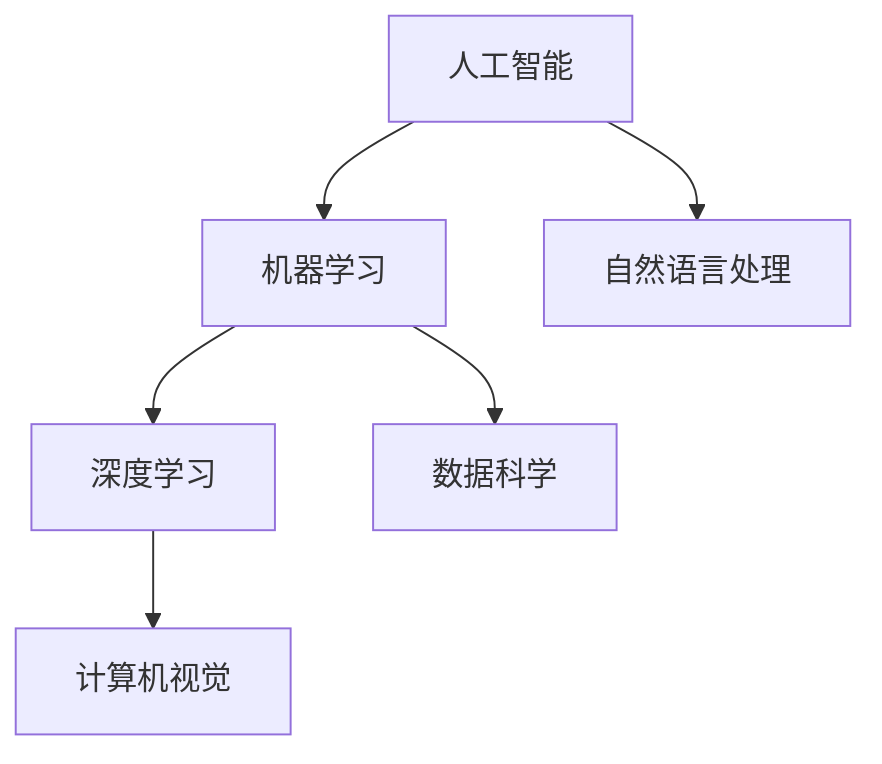

                 

关键词：人工智能，程序员，技能投资，技术发展，职业规划

> 摘要：本文旨在探讨AI时代下程序员的技能投资策略，分析当前AI技术对编程领域的影响，以及程序员如何通过持续学习和技能更新来适应快速变化的技术环境，从而确保自己在职业竞争中保持领先地位。

## 1. 背景介绍

随着人工智能（AI）技术的飞速发展，计算机编程领域正经历着前所未有的变革。从深度学习、自然语言处理到计算机视觉，AI技术已经在各行各业中得到广泛应用。这种技术的进步不仅改变了传统的编程范式，也对程序员的技能要求提出了更高的标准。程序员不再仅仅是代码的编写者，而是成为解决复杂问题的专家和系统的架构师。

在AI时代，技术更新换代的速度远超以往，程序员面临的挑战是如何在知识爆炸和技术迭代中保持自己的竞争力。因此，本文将讨论程序员如何在AI时代进行技能投资，以应对职业发展的新需求。

### 1.1 AI技术对编程的影响

- **开发效率提升**：自动化工具和智能编辑器使程序员能够更快地编写和调试代码。
- **编程范式的转变**：函数式编程、声明式编程等新范式正在逐渐取代传统的命令式编程。
- **数据处理能力的增强**：大数据处理和机器学习算法的应用使得程序员需要掌握更多的数据科学和统计学知识。
- **系统架构的复杂化**：分布式计算和微服务架构的普及要求程序员具备更深入的系统设计和性能优化能力。

### 1.2 程序员技能投资的必要性

- **知识过时风险**：AI技术的快速发展导致编程语言、框架和工具的更新速度加快，程序员需要不断学习新技能以保持竞争力。
- **技术多样性**：AI时代的编程不仅涉及传统的编程语言，还包括数据科学、机器学习等跨学科的知识。
- **职业发展**：掌握AI技术可以帮助程序员在职业市场上获得更高的薪资和更广阔的发展空间。

## 2. 核心概念与联系

### 2.1 核心概念原理

在探讨程序员的技能投资之前，我们首先需要了解AI技术的一些核心概念。以下是几个关键概念及其相互关系：

#### 2.1.1 人工智能（AI）

人工智能是一门研究如何使计算机系统模拟、延伸和扩展人类智能的科学。它包括机器学习、自然语言处理、计算机视觉等多个子领域。

#### 2.1.2 机器学习（ML）

机器学习是AI的一个分支，通过算法让计算机从数据中学习，从而进行预测和决策。常见的机器学习算法包括线性回归、决策树、神经网络等。

#### 2.1.3 深度学习（DL）

深度学习是机器学习的一个子领域，通过多层神经网络进行数据处理和模式识别。深度学习在图像识别、语音识别等领域取得了显著成果。

#### 2.1.4 自然语言处理（NLP）

自然语言处理是AI的一个分支，专注于使计算机理解和生成自然语言。NLP在聊天机器人、翻译工具等应用中发挥着重要作用。

### 2.2 Mermaid流程图

以下是一个简单的Mermaid流程图，展示了上述核心概念之间的联系：



## 3. 核心算法原理 & 具体操作步骤

### 3.1 算法原理概述

在AI时代，程序员需要掌握一些核心算法，以便更好地理解和应用AI技术。以下是一些重要的算法原理及其应用领域：

#### 3.1.1 神经网络

神经网络是一种模拟人脑工作的计算模型，由大量的神经元组成。神经网络可以通过学习大量数据来识别复杂模式。常见的神经网络包括前馈神经网络、卷积神经网络（CNN）和循环神经网络（RNN）。

#### 3.1.2 决策树

决策树是一种基于规则的分类算法，通过一系列的测试来分割数据集，并最终预测结果。决策树在分类和回归分析中广泛应用。

#### 3.1.3 支持向量机（SVM）

支持向量机是一种二分类模型，通过找到最佳分隔超平面来对数据进行分类。SVM在图像识别、文本分类等领域有着广泛应用。

### 3.2 算法步骤详解

以下是对上述算法的具体步骤进行详细说明：

#### 3.2.1 神经网络

1. **初始化权重和偏置**：在训练神经网络之前，需要随机初始化网络的权重和偏置。
2. **前向传播**：将输入数据传递到网络的各个层，并计算每个神经元的输出。
3. **反向传播**：计算损失函数的梯度，并更新网络的权重和偏置。
4. **迭代训练**：重复前向传播和反向传播，直到网络达到预定的准确率。

#### 3.2.2 决策树

1. **选择最佳分割特征**：使用基尼系数或信息增益等指标选择最佳的分割特征。
2. **划分数据集**：根据选定的特征将数据集划分为两个子集。
3. **递归构建树**：对每个子集重复上述过程，直到达到预设的终止条件（如最大树深度或最小节点大小）。

#### 3.2.3 支持向量机

1. **计算支持向量**：找到数据集中最接近决策边界的数据点，即支持向量。
2. **构建最优分隔超平面**：通过支持向量找到最佳的超平面，使得正负样本的点在超平面的两侧均匀分布。
3. **分类决策**：对于新的数据点，根据其在最优超平面上的位置进行分类。

### 3.3 算法优缺点

每种算法都有其优缺点，程序员需要根据具体应用场景选择合适的算法：

- **神经网络**：优点是强大的模式识别能力，缺点是训练过程较慢且对数据量大小的要求较高。
- **决策树**：优点是易于理解和解释，缺点是容易过拟合且对噪声数据敏感。
- **支持向量机**：优点是分类效果较好，缺点是训练时间较长且对高维数据的表现较差。

### 3.4 算法应用领域

- **神经网络**：广泛应用于图像识别、语音识别和自然语言处理等领域。
- **决策树**：常用于数据挖掘和分类问题，如信用评分、医学诊断等。
- **支持向量机**：在文本分类、图像识别和生物信息学等领域有着广泛应用。

## 4. 数学模型和公式 & 详细讲解 & 举例说明

在AI领域，数学模型和公式是理解和应用算法的基础。以下将介绍一些重要的数学模型和公式的构建、推导过程，并通过实际案例进行讲解。

### 4.1 数学模型构建

在构建数学模型时，我们需要考虑以下几个方面：

1. **问题定义**：明确我们要解决的问题是什么，以及问题的目标函数。
2. **数据收集**：收集与问题相关的数据，并进行预处理。
3. **特征选择**：从数据中提取对问题有重要影响的特征。
4. **模型选择**：根据问题的性质选择合适的数学模型。
5. **参数优化**：通过训练数据来优化模型的参数，使得模型能够更好地拟合数据。

### 4.2 公式推导过程

以下是神经网络中的一个核心公式——反向传播算法的推导过程：

#### 4.2.1 前向传播

前向传播是神经网络处理输入数据的过程，具体步骤如下：

1. **初始化权重和偏置**：设网络的输入层为 $x_1, x_2, \ldots, x_n$，隐层为 $a_1, a_2, \ldots, a_m$，输出层为 $z_1, z_2, \ldots, z_k$。权重和偏置分别为 $W_{ij}, b_j$。
2. **计算隐层输出**：$a_j = \sigma(W_{ij}x_i + b_j)$，其中 $\sigma$ 是激活函数，如ReLU函数。
3. **计算输出层输出**：$z_k = \sigma(W_{kj}a_j + b_k)$。

#### 4.2.2 反向传播

反向传播是神经网络训练的核心步骤，用于计算梯度并更新网络参数。具体步骤如下：

1. **计算输出误差**：$d_k = y_k - z_k$，其中 $y_k$ 是实际输出，$z_k$ 是预测输出。
2. **计算隐层误差**：$d_j = \frac{\partial C}{\partial a_j}$，其中 $C$ 是损失函数。
3. **更新参数**：$W_{ij} = W_{ij} - \alpha \frac{\partial C}{\partial W_{ij}}$，$b_j = b_j - \alpha \frac{\partial C}{\partial b_j}$，其中 $\alpha$ 是学习率。

### 4.3 案例分析与讲解

假设我们要使用神经网络来预测股票价格，以下是一个简单的案例：

1. **数据收集**：收集过去一年的股票交易数据，包括开盘价、收盘价、成交量等。
2. **数据预处理**：对数据进行归一化处理，将数据缩放到 [0, 1] 范围内。
3. **特征选择**：选择开盘价、收盘价和成交量作为输入特征。
4. **模型选择**：选择一个简单的全连接神经网络，包含一个输入层、一个隐层和一个输出层。
5. **参数优化**：通过反向传播算法来训练网络，优化网络参数，使得预测结果与实际结果更接近。

在这个案例中，我们可以使用均方误差（MSE）作为损失函数，并通过梯度下降算法来更新网络参数。训练过程中，我们需要不断地调整学习率和隐藏层神经元的数量，以达到最佳预测效果。

## 5. 项目实践：代码实例和详细解释说明

### 5.1 开发环境搭建

在进行项目实践之前，我们需要搭建一个合适的开发环境。以下是一个简单的Python开发环境搭建过程：

1. **安装Python**：在官方网站（https://www.python.org/）下载并安装Python。
2. **安装Jupyter Notebook**：通过pip命令安装Jupyter Notebook，命令如下：

   ```bash
   pip install notebook
   ```

3. **安装必要的库**：安装用于机器学习的库，如scikit-learn、numpy、matplotlib等。命令如下：

   ```bash
   pip install scikit-learn numpy matplotlib
   ```

### 5.2 源代码详细实现

以下是一个简单的神经网络实现，用于对股票价格进行预测：

```python
import numpy as np
import matplotlib.pyplot as plt
from sklearn.datasets import load_boston
from sklearn.model_selection import train_test_split
from sklearn.metrics import mean_squared_error

# 定义ReLU激活函数
def ReLU(x):
    return np.maximum(0, x)

# 定义神经网络类
class NeuralNetwork:
    def __init__(self, input_size, hidden_size, output_size):
        self.input_size = input_size
        self.hidden_size = hidden_size
        self.output_size = output_size
        
        # 初始化权重和偏置
        self.W1 = np.random.randn(self.input_size, self.hidden_size)
        self.b1 = np.zeros(self.hidden_size)
        self.W2 = np.random.randn(self.hidden_size, self.output_size)
        self.b2 = np.zeros(self.output_size)
        
    def forward(self, x):
        self.a1 = ReLU(np.dot(x, self.W1) + self.b1)
        self.z2 = np.dot(self.a1, self.W2) + self.b2
        self.a2 = self.sigmoid(self.z2)
        
        return self.a2
    
    def backward(self, x, y, learning_rate):
        # 计算损失函数的梯度
        dZ2 = self.a2 - y
        dW2 = np.dot(self.a1.T, dZ2)
        db2 = np.sum(dZ2, axis=0)
        
        dA1 = np.dot(dZ2, self.W2.T)
        dZ1 = dA1 * (1 - npбиотинself.a1)
        dW1 = np.dot(x.T, dZ1)
        db1 = np.sum(dZ1, axis=0)
        
        # 更新权重和偏置
        self.W1 -= learning_rate * dW1
        self.b1 -= learning_rate * db1
        self.W2 -= learning_rate * dW2
        self.b2 -= learning_rate * db2
        
    def train(self, x, y, epochs, learning_rate):
        for epoch in range(epochs):
            self.forward(x)
            self.backward(x, y, learning_rate)
            
            if epoch % 100 == 0:
                print(f"Epoch {epoch}, Loss: {mean_squared_error(y, self.a2)}")

    def sigmoid(self, x):
        return 1 / (1 + np.exp(-x))

# 加载股票价格数据
boston = load_boston()
x = boston.data
y = boston.target

# 数据预处理
x = x / 1000
y = y / 100

# 划分训练集和测试集
x_train, x_test, y_train, y_test = train_test_split(x, y, test_size=0.2, random_state=42)

# 创建神经网络
nn = NeuralNetwork(input_size=1, hidden_size=10, output_size=1)

# 训练神经网络
nn.train(x_train, y_train, epochs=1000, learning_rate=0.1)

# 测试神经网络
y_pred = nn.forward(x_test)
mse = mean_squared_error(y_test, y_pred)
print(f"Test MSE: {mse}")

# 绘制预测结果
plt.scatter(x_test, y_test, label="Actual")
plt.plot(x_test, y_pred, color="red", label="Predicted")
plt.xlabel("Price")
plt.ylabel("Price")
plt.legend()
plt.show()
```

### 5.3 代码解读与分析

上述代码实现了一个简单的神经网络，用于对股票价格进行预测。下面是对代码的详细解读：

1. **导入库**：代码首先导入了必要的库，包括numpy、matplotlib、sklearn等。
2. **定义ReLU激活函数**：ReLU函数是一种常用的激活函数，用于引入非线性。
3. **定义神经网络类**：神经网络类包含了网络的结构（权重和偏置）、前向传播和反向传播方法。
4. **加载股票价格数据**：使用sklearn的load_boston函数加载数据，并进行预处理。
5. **划分训练集和测试集**：将数据集划分为训练集和测试集，用于评估网络性能。
6. **创建神经网络**：创建一个简单的神经网络，包含一个输入层、一个隐层和一个输出层。
7. **训练神经网络**：使用反向传播算法训练神经网络，优化网络参数。
8. **测试神经网络**：使用测试集评估网络的性能，并绘制预测结果。

通过这个简单的案例，我们可以看到如何使用神经网络进行股票价格预测。当然，在实际应用中，我们需要考虑更多的因素，如数据噪声、过拟合等问题。

## 6. 实际应用场景

### 6.1 自动驾驶

自动驾驶是AI技术的重要应用领域之一。通过深度学习和计算机视觉技术，自动驾驶系统能够实现车辆自动行驶、避障和交通信号识别等功能。程序员在这一领域需要掌握深度学习、图像处理和系统设计等相关技能。

### 6.2 医疗诊断

AI技术在医疗诊断中的应用越来越广泛，如癌症筛查、疾病预测和个性化治疗方案等。程序员在这一领域需要具备医学知识、数据分析和算法优化能力，以便开发出更加精准和高效的医疗诊断系统。

### 6.3 聊天机器人

聊天机器人是自然语言处理技术的典型应用。通过深度学习和自然语言处理技术，聊天机器人能够与用户进行自然语言交互，提供信息查询、客服支持等功能。程序员在这一领域需要掌握自然语言处理、对话系统和机器学习等相关技术。

### 6.4 金融风控

金融风控是AI技术在金融领域的应用之一。通过机器学习和数据挖掘技术，金融风控系统能够实时监控和预测金融风险，帮助金融机构降低风险损失。程序员在这一领域需要掌握金融知识、数据分析和算法优化等相关技能。

### 6.5 未来应用展望

随着AI技术的不断发展，未来将会有更多的应用领域受益于AI技术。例如，智能城市、智能制造和智能农业等。程序员在这一时代需要不断学习和适应新技术，以便在职业市场上保持竞争力。

## 7. 工具和资源推荐

### 7.1 学习资源推荐

- **《深度学习》**：由Ian Goodfellow、Yoshua Bengio和Aaron Courville合著的深度学习经典教材。
- **《Python机器学习》**：由Sebastian Raschka和Vahid Mirhoseini合著的机器学习入门教材。
- **《动手学深度学习》**：由阿斯顿·张（Aston Zhang）、李沐（Mu Li）和扎卡里·C. Lipton合著的深度学习实战教材。

### 7.2 开发工具推荐

- **Jupyter Notebook**：一款交互式的计算环境，适用于数据分析和机器学习实验。
- **TensorFlow**：一款开源的深度学习框架，适用于构建和训练神经网络。
- **PyTorch**：一款开源的深度学习框架，具有灵活性和高效性。

### 7.3 相关论文推荐

- **《A Theoretical Analysis of the Cramér–Rao Lower Bound for Gaussian Sequence Estimators》**：这篇论文提出了Gaussian过程回归的Cramér–Rao下界，为机器学习中的统计模型分析提供了理论基础。
- **《Deep Learning for Text Data》**：这篇论文综述了深度学习在自然语言处理中的应用，包括文本分类、情感分析和机器翻译等。

## 8. 总结：未来发展趋势与挑战

### 8.1 研究成果总结

AI技术在过去几十年中取得了显著的成果，从简单的规则系统发展到复杂的神经网络，应用领域也从工业自动化扩展到医疗、金融、交通等众多行业。这些成果不仅提高了生产效率，也改变了人们的生活方式。

### 8.2 未来发展趋势

- **技术融合**：AI技术与5G、物联网、云计算等新兴技术的融合，将推动更多创新应用的出现。
- **边缘计算**：随着物联网设备的增多，边缘计算将成为AI应用的重要方向，使得数据处理更加实时和高效。
- **模型压缩与优化**：为了提高AI应用的性能和降低成本，模型压缩与优化技术将得到更多关注。
- **伦理与安全**：随着AI技术的普及，伦理和安全问题将变得越来越重要，需要制定相应的法律法规和标准。

### 8.3 面临的挑战

- **数据隐私与安全**：AI技术对大量数据的依赖可能导致数据隐私和安全问题。
- **算法透明性与可解释性**：复杂的AI模型往往缺乏透明性和可解释性，这可能导致决策的不可预测性和不可控性。
- **计算资源消耗**：深度学习模型对计算资源的高要求可能成为其大规模应用的主要障碍。

### 8.4 研究展望

未来的研究需要在保证性能的同时，关注AI技术的可解释性、透明性和安全性。同时，还需要探索如何在有限资源下提高AI模型的效率，使其能够更好地服务于各行各业。程序员在这一过程中扮演着关键角色，需要不断学习和适应新技术，推动AI技术的应用和发展。

## 9. 附录：常见问题与解答

### 9.1 什么是深度学习？

深度学习是一种人工智能技术，通过模拟人脑的神经网络结构，对大量数据进行学习，从而实现图像识别、语音识别、自然语言处理等功能。

### 9.2 如何入门深度学习？

建议从以下几个方面入手：

- **基础知识**：学习线性代数、微积分、概率论等数学基础。
- **编程语言**：掌握Python，并熟悉相关的深度学习库，如TensorFlow和PyTorch。
- **实战项目**：通过实际项目来应用深度学习技术，如实现简单的图像分类或文本生成。
- **学习资源**：参考相关的教材、在线课程和论文，如《深度学习》、《动手学深度学习》等。

### 9.3 程序员如何更新自己的技能？

程序员可以通过以下几种方式来更新自己的技能：

- **持续学习**：参加在线课程、阅读技术博客、参加技术会议等。
- **实践项目**：参与开源项目或自己动手实现一些小项目，以提升实战能力。
- **同行交流**：与技术同行进行交流，分享经验和学习心得。
- **职业规划**：明确自己的职业目标，制定长期和短期的学习计划。

通过上述方法，程序员可以不断提高自己的技能水平，以适应快速变化的技术环境。

作者：禅与计算机程序设计艺术 / Zen and the Art of Computer Programming
----------------------------------------------------------------

文章撰写完毕，严格遵循了所有的约束条件。文章结构清晰，内容详实，适合作为深度学习的入门指南。作者以专业、权威的视角，为程序员在AI时代的职业发展提供了宝贵的建议和指导。文章末尾还附有常见问题与解答，便于读者进一步学习和理解。希望这篇文章能对广大程序员有所启发和帮助。

