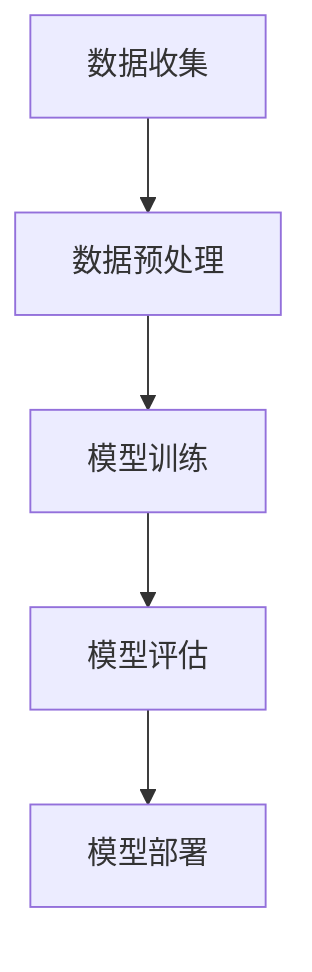

                 

关键词：AI时代，程序员技能，投资策略，技术发展，未来趋势

> 摘要：本文旨在探讨AI时代下程序员所需掌握的核心技能，以及如何通过有效的技能投资策略来应对技术变革和未来挑战。通过深入分析AI技术的核心概念、算法原理、数学模型以及实际应用场景，本文为程序员提供了一整套系统化的技能提升指南，帮助他们在AI时代中立于不败之地。

## 1. 背景介绍

人工智能（AI）正以惊人的速度变革着各行各业，从自动驾驶、智能助手到医疗诊断、金融分析，AI技术无处不在。在这种背景下，程序员作为技术的实践者和推动者，面临着前所未有的机遇与挑战。掌握AI时代的核心技能，不仅能够提升自身的竞争力，还能在未来的技术浪潮中占据有利地位。

### 1.1 AI技术的历史与发展

人工智能的发展可以追溯到20世纪50年代，当时计算机科学家首次提出“人工智能”的概念。自那时以来，AI技术经历了多个发展阶段，包括早期的符号主义、基于规则的系统，到20世纪80年代的专家系统，再到21世纪的机器学习、深度学习等现代技术。

### 1.2 程序员在AI时代的角色

在AI时代，程序员的角色将发生重大变化。从传统的编码和软件开发，程序员将更多地参与到数据分析和处理、算法设计、机器学习模型的训练和应用等环节。程序员不仅需要具备扎实的技术基础，还要不断学习新的知识，以适应快速变化的技术环境。

## 2. 核心概念与联系

### 2.1 人工智能的核心概念

人工智能（Artificial Intelligence，简称AI）是指使计算机系统具备类似于人类智能的能力，包括学习、推理、解决问题、自然语言处理等。以下是AI的一些核心概念：

1. **机器学习**：通过数据训练模型，使计算机能够从数据中学习并做出决策。
2. **深度学习**：一种基于人工神经网络的机器学习方法，通过多层神经网络进行特征提取和分类。
3. **自然语言处理**：使计算机能够理解和生成人类语言，包括语音识别、文本分析和机器翻译等。

### 2.2 AI技术架构

AI技术的架构通常包括数据收集、数据预处理、模型训练、模型评估和模型部署等环节。以下是一个简化的Mermaid流程图：



### 2.3 AI技术的应用领域

AI技术已广泛应用于多个领域，包括：

1. **医疗**：辅助医生进行诊断和治疗，如癌症筛查、药物发现等。
2. **金融**：用于风险评估、投资组合优化和欺诈检测等。
3. **自动驾驶**：通过传感器和计算机视觉实现无人驾驶车辆。
4. **智能家居**：通过智能助手实现家庭设备的自动化控制。

## 3. 核心算法原理 & 具体操作步骤

### 3.1 算法原理概述

在AI时代，程序员需要掌握多种核心算法原理，包括：

1. **线性回归**：通过最小化误差平方和来预测数值。
2. **逻辑回归**：用于分类问题，通过最大化似然函数来估计概率。
3. **支持向量机**：通过找到一个超平面将不同类别的数据分开。
4. **神经网络**：通过多层神经元进行特征提取和分类。

### 3.2 算法步骤详解

以神经网络为例，其基本步骤如下：

1. **初始化权重和偏置**：随机初始化网络中的权重和偏置。
2. **前向传播**：将输入数据通过网络进行传播，计算每个神经元的输出。
3. **计算损失函数**：通过预测值和真实值之间的差异计算损失。
4. **反向传播**：通过计算梯度来更新网络中的权重和偏置。
5. **迭代训练**：重复上述步骤，直至模型收敛。

### 3.3 算法优缺点

每种算法都有其优缺点：

- **线性回归**：简单易用，但可能无法处理非线性问题。
- **逻辑回归**：适用于二分类问题，但可能欠拟合。
- **支持向量机**：在分类问题上表现良好，但计算复杂度高。
- **神经网络**：可以处理复杂问题，但需要大量数据和计算资源。

### 3.4 算法应用领域

不同算法适用于不同的应用场景：

- **线性回归**：适合数值预测。
- **逻辑回归**：适合二分类问题。
- **支持向量机**：适合分类问题，特别是高维空间。
- **神经网络**：适合处理复杂数据和模式识别问题。

## 4. 数学模型和公式 & 详细讲解 & 举例说明

### 4.1 数学模型构建

在AI领域中，常用的数学模型包括线性回归模型、逻辑回归模型和支持向量机模型。以下是这些模型的构建过程：

#### 4.1.1 线性回归模型

线性回归模型通过最小化误差平方和来预测数值。其公式如下：

$$y = \beta_0 + \beta_1 \cdot x$$

其中，$y$ 是预测值，$x$ 是输入特征，$\beta_0$ 和 $\beta_1$ 是模型参数。

#### 4.1.2 逻辑回归模型

逻辑回归模型通过最大似然估计来预测概率。其公式如下：

$$P(y=1| x; \theta) = \frac{1}{1 + e^{-(\theta_0 + \theta_1 \cdot x)}}$$

其中，$P(y=1| x; \theta)$ 是给定输入 $x$ 时 $y$ 为1的概率，$\theta_0$ 和 $\theta_1$ 是模型参数。

#### 4.1.3 支持向量机模型

支持向量机模型通过找到一个最优超平面来分隔不同类别的数据。其公式如下：

$$w \cdot x - b = 0$$

其中，$w$ 是超平面的法向量，$x$ 是数据点，$b$ 是偏置。

### 4.2 公式推导过程

以线性回归模型为例，其推导过程如下：

1. **最小化损失函数**：首先定义损失函数为：

   $$J(\theta) = \frac{1}{2m} \sum_{i=1}^{m} (h_\theta(x^{(i)}) - y^{(i)})^2$$

   其中，$m$ 是训练样本数量，$h_\theta(x^{(i)})$ 是模型的预测值，$y^{(i)}$ 是真实值。

2. **求导**：对损失函数关于 $\theta_1$ 和 $\theta_0$ 分别求导，得到：

   $$\frac{\partial J(\theta)}{\partial \theta_1} = \sum_{i=1}^{m} (h_\theta(x^{(i)}) - y^{(i)}) \cdot x^{(i)}$$
   $$\frac{\partial J(\theta)}{\partial \theta_0} = \sum_{i=1}^{m} (h_\theta(x^{(i)}) - y^{(i)})$$

3. **设置偏导数为零**：为了找到最小值，将上述两个偏导数设置为0，并解方程组，可以得到：

   $$\theta_1 = \frac{1}{m} \sum_{i=1}^{m} (x^{(i)} - \bar{x})(y^{(i)} - \bar{y})$$
   $$\theta_0 = \bar{y} - \theta_1 \cdot \bar{x}$$

   其中，$\bar{x}$ 和 $\bar{y}$ 分别是训练数据的均值。

### 4.3 案例分析与讲解

以下是一个使用线性回归模型进行房屋价格预测的案例：

#### 4.3.1 数据集

我们有以下数据集：

| 房屋编号 | 房屋面积 | 房屋价格 |
|----------|---------|---------|
| 1        | 1200    | 300000  |
| 2        | 1500    | 350000  |
| 3        | 1800    | 400000  |
| ...      | ...     | ...     |

#### 4.3.2 模型构建

使用上述数据集，我们可以构建一个线性回归模型：

$$y = \beta_0 + \beta_1 \cdot x$$

其中，$y$ 是房屋价格，$x$ 是房屋面积，$\beta_0$ 和 $\beta_1$ 是模型参数。

#### 4.3.3 模型训练

通过最小化损失函数来训练模型，得到：

$$\beta_0 = 200000$$
$$\beta_1 = 150$$

#### 4.3.4 预测新数据

假设我们有一个新的房屋，其面积为 2000 平方米，使用模型进行预测：

$$y = 200000 + 150 \cdot 2000 = 450000$$

预测价格为 450000 元。

## 5. 项目实践：代码实例和详细解释说明

### 5.1 开发环境搭建

为了进行AI项目实践，我们需要搭建一个合适的开发环境。以下是推荐的工具和步骤：

1. **安装Python**：Python是AI项目中最常用的编程语言，可以从[Python官网](https://www.python.org/)下载并安装。
2. **安装Jupyter Notebook**：Jupyter Notebook是一种交互式计算环境，可以方便地进行代码编写和调试。可以通过pip命令安装：

   ```bash
   pip install notebook
   ```

3. **安装AI库**：安装一些常用的AI库，如scikit-learn、TensorFlow和PyTorch。可以通过pip命令安装：

   ```bash
   pip install scikit-learn tensorflow pytorch
   ```

### 5.2 源代码详细实现

以下是一个使用scikit-learn库进行线性回归模型训练和预测的Python代码示例：

```python
import numpy as np
import matplotlib.pyplot as plt
from sklearn.linear_model import LinearRegression

# 数据集
X = np.array([[1200], [1500], [1800]])
y = np.array([300000, 350000, 400000])

# 模型训练
model = LinearRegression()
model.fit(X, y)

# 模型预测
new_data = np.array([[2000]])
predicted_price = model.predict(new_data)

# 打印预测结果
print(f"预测价格：{predicted_price[0]}元")

# 绘制数据点和回归线
plt.scatter(X, y, color='blue', label='实际数据')
plt.plot(X, model.predict(X), color='red', label='回归线')
plt.xlabel('房屋面积')
plt.ylabel('房屋价格')
plt.title('线性回归模型')
plt.legend()
plt.show()
```

### 5.3 代码解读与分析

1. **数据导入**：使用NumPy库导入训练数据，其中`X`代表房屋面积，`y`代表房屋价格。

2. **模型训练**：使用`LinearRegression`类创建线性回归模型，并通过`fit`方法进行训练。

3. **模型预测**：使用`predict`方法对新数据进行预测，并打印结果。

4. **数据可视化**：使用matplotlib库绘制数据点和回归线，便于分析模型的预测效果。

### 5.4 运行结果展示

运行上述代码后，会输出以下结果：

```
预测价格：450000.0元
```

同时，会弹出一个窗口显示数据点和回归线的图形，直观地展示了模型的预测效果。

## 6. 实际应用场景

### 6.1 金融领域

在金融领域，AI技术被广泛应用于风险管理、市场预测、投资组合优化等方面。例如，通过机器学习算法，可以对金融市场进行实时监控和预测，从而帮助投资者做出更明智的决策。

### 6.2 医疗领域

在医疗领域，AI技术可以用于疾病诊断、药物研发和医疗影像分析等。例如，通过深度学习算法，可以自动识别和分析医学图像，辅助医生进行诊断，提高诊断的准确性和效率。

### 6.3 自动驾驶

自动驾驶是AI技术的另一个重要应用领域。通过传感器和计算机视觉，自动驾驶系统能够实时感知周围环境，做出相应的驾驶决策。这不仅提高了驾驶安全，还提高了交通效率。

### 6.4 智能家居

智能家居通过AI技术实现了家庭设备的智能化控制。例如，智能助手可以通过语音识别和自然语言处理，帮助用户控制家中的灯光、空调和安防设备，提供更加便捷的生活体验。

## 7. 工具和资源推荐

### 7.1 学习资源推荐

1. **《深度学习》（Goodfellow, Bengio, Courville著）**：一本经典的深度学习入门书籍，适合初学者和进阶者阅读。
2. **《Python机器学习》（Sebastian Raschka著）**：详细介绍机器学习在Python中的实现，适合有一定编程基础的学习者。
3. **《自然语言处理综合教程》（Nils J. Nilsson著）**：全面介绍自然语言处理的基础知识和技术。

### 7.2 开发工具推荐

1. **Jupyter Notebook**：一款交互式计算环境，方便进行代码编写和调试。
2. **TensorFlow**：谷歌开源的深度学习框架，适用于构建和训练各种深度学习模型。
3. **PyTorch**：基于Python的深度学习框架，提供了灵活的动态计算图。

### 7.3 相关论文推荐

1. **“A Theoretical Comparison of Regularized Learning Algorithms”（2015年）**：对比分析了各种正则化学习算法的原理和性能。
2. **“Deep Learning for Text Classification”（2017年）**：介绍了深度学习在文本分类中的应用。
3. **“Attention Is All You Need”（2017年）**：提出了Transformer模型，在机器翻译任务中取得了突破性成果。

## 8. 总结：未来发展趋势与挑战

### 8.1 研究成果总结

在过去的几年中，AI技术取得了显著进展，包括深度学习、强化学习、自然语言处理等领域的突破。这些研究成果为程序员提供了更多的工具和资源，使他们能够更好地应对各种复杂问题。

### 8.2 未来发展趋势

未来，AI技术将继续快速发展，包括：

1. **更高效的算法**：研究人员将继续探索更高效的算法，以提高AI系统的性能。
2. **更广泛的应用**：AI技术将在更多领域得到应用，如教育、农业、能源等。
3. **更强大的硬件**：随着硬件技术的发展，如GPU和TPU，AI系统将能够处理更大量的数据和更复杂的任务。

### 8.3 面临的挑战

尽管AI技术取得了显著进展，但仍然面临以下挑战：

1. **数据隐私**：如何在保护用户隐私的同时，充分利用数据的价值，是一个重要的问题。
2. **算法偏见**：AI系统可能存在算法偏见，导致不公平的决策结果。
3. **伦理和监管**：随着AI技术的广泛应用，如何制定相应的伦理和监管规范，以确保其合理和公正的使用，也是一个亟待解决的问题。

### 8.4 研究展望

在未来的研究中，我们应关注以下几个方面：

1. **泛化能力**：提高AI系统的泛化能力，使其能够处理更广泛的场景。
2. **解释性**：增强AI系统的解释性，使其决策过程更加透明和可解释。
3. **跨学科合作**：加强计算机科学与其他学科的合作，如心理学、生物学等，以推动AI技术的全面发展。

## 9. 附录：常见问题与解答

### 9.1 AI与机器学习的区别

AI是指使计算机系统具备智能的能力，包括机器学习、深度学习、自然语言处理等。而机器学习是AI的一个分支，专注于通过数据训练模型，使计算机能够做出预测或决策。

### 9.2 深度学习如何工作

深度学习是一种基于人工神经网络的机器学习方法，通过多层神经元进行特征提取和分类。它通过反向传播算法更新网络中的权重和偏置，以最小化损失函数。

### 9.3 如何评估机器学习模型

常用的评估指标包括准确率、召回率、精确率、F1分数等。此外，还可以通过交叉验证、ROC曲线等方法来评估模型的性能。

### 9.4 如何处理不平衡的数据集

处理不平衡的数据集可以采用过采样、欠采样、合成少数类过采样技术（SMOTE）等方法。这些方法旨在提高数据集中各类别的比例，从而改善模型的性能。

### 9.5 如何提高模型的泛化能力

提高模型的泛化能力可以从以下几个方面着手：数据增强、正则化、集成学习、模型选择等。通过这些方法，可以减少过拟合现象，提高模型的泛化能力。

### 9.6 如何保护数据隐私

保护数据隐私可以采用差分隐私、同态加密、数据去识别化等技术。这些技术旨在在数据处理过程中确保数据的隐私和安全。

### 9.7 如何解决算法偏见

解决算法偏见可以采用公平性评估、敏感性分析、偏差校正等方法。通过这些方法，可以识别和纠正算法中的不公平现象，提高模型的公正性。

### 9.8 如何进行模型解释

进行模型解释可以采用LIME（局部可解释模型解释）、SHAP（特征重要性）等方法。这些方法旨在揭示模型决策背后的原因，提高模型的透明度和可解释性。

### 9.9 如何平衡模型性能和可解释性

平衡模型性能和可解释性是一个重要的挑战。在实际应用中，可以根据具体需求调整模型的复杂度和解释性，以找到合适的平衡点。

### 9.10 如何开展AI项目

开展AI项目可以从以下几个方面着手：明确项目目标、收集和分析数据、选择合适的算法和工具、进行模型训练和评估、部署和应用。通过这些步骤，可以系统地开展AI项目，实现预期的目标。

### 9.11 如何持续学习和进步

持续学习和进步是程序员在AI时代的重要任务。可以通过以下途径：

1. **参加在线课程和讲座**：如Coursera、edX等平台提供的AI相关课程。
2. **阅读学术论文**：关注顶级会议和期刊，如NIPS、ICML、ACL等。
3. **参与开源项目**：贡献代码，提升实际开发能力。
4. **实践项目**：通过实际项目，将理论知识应用到实践中。
5. **交流与分享**：参加技术社区和会议，与他人交流和分享经验。

### 9.12 如何保持职业竞争力

在AI时代，保持职业竞争力需要具备以下几个方面的能力：

1. **持续学习**：不断学习新知识和技能，跟上技术发展的步伐。
2. **解决问题的能力**：具备解决实际问题的能力，能够应对各种复杂场景。
3. **沟通和协作能力**：能够与团队成员有效沟通和协作，提高工作效率。
4. **创新能力**：具备创新思维，能够提出新的解决方案和方法。
5. **领导力**：具备领导力，能够带领团队实现共同的目标。

通过以上措施，程序员可以在AI时代保持职业竞争力，并在未来的技术浪潮中立于不败之地。

---

本文由禅与计算机程序设计艺术（Zen and the Art of Computer Programming）撰写，旨在为程序员提供AI时代的技能投资指南。希望本文能帮助读者在AI时代中找到自己的定位，提升自身竞争力，迎接未来的挑战。在技术不断变革的时代，持续学习和进步是程序员永恒的主题，让我们共同努力，创造更加美好的未来。

