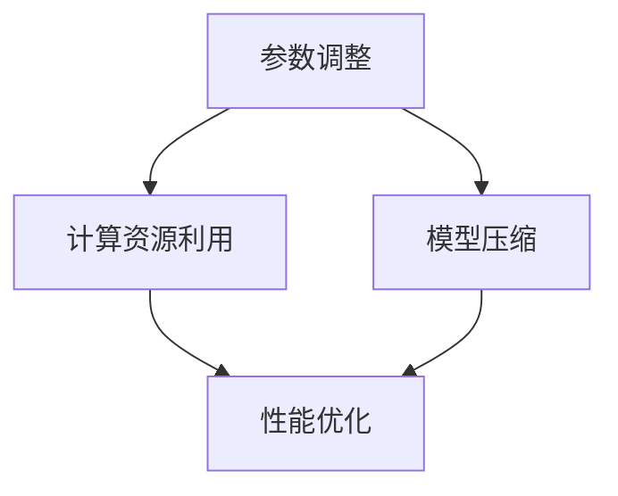

                 

关键词：AI模型scaling、参数调整、性能优化、神经网络、计算资源利用、模型压缩

> 摘要：本文探讨了AI模型scaling中的关键问题，即如何通过调整模型参数来优化性能和计算资源利用。通过深入分析神经网络架构，我们提出了一系列可行的策略，包括模型剪枝、量化、分布式训练等，旨在提高AI模型的效率，为实际应用提供有力支持。

## 1. 背景介绍

随着人工智能（AI）技术的快速发展，深度神经网络（DNN）在各类应用中取得了显著成果。然而，AI模型的性能往往受到计算资源和数据量的限制。为了在实际应用中发挥AI的最大潜力，我们不得不面对一个关键问题：如何有效地scaling AI模型，使其在不同硬件环境和数据集规模下都能保持良好的性能和效率。

scaling AI模型的核心在于调整模型参数，从而平衡模型复杂度和性能。这不仅仅是一个技术问题，更涉及到对AI系统整体架构的深刻理解。本文将从以下几个方面展开讨论：

1. **核心概念与联系**：介绍AI模型scaling中的关键概念，包括参数调整、计算资源利用和模型压缩。
2. **核心算法原理 & 具体操作步骤**：分析不同模型scaling策略的原理和实施步骤，以及各自的优缺点。
3. **数学模型和公式**：详细讲解用于调整参数的数学模型和公式，并给出实例分析。
4. **项目实践**：通过代码实例展示如何在实际项目中实施模型scaling。
5. **实际应用场景**：探讨模型scaling在不同领域中的应用，以及未来可能的发展趋势。
6. **工具和资源推荐**：推荐学习资源和开发工具，帮助读者深入了解模型scaling。
7. **总结与展望**：总结研究成果，展望未来发展趋势和面临的挑战。

### 2. 核心概念与联系

为了深入理解AI模型scaling，我们首先需要明确几个关键概念：

- **参数调整（Parameter Tuning）**：通过调整模型参数，如学习率、正则化强度、隐藏层节点数等，来优化模型性能。
- **计算资源利用（Resource Utilization）**：如何在有限的计算资源下最大限度地发挥模型性能。
- **模型压缩（Model Compression）**：通过减少模型参数数量或降低参数精度，减小模型体积，从而提高计算效率。

以下是AI模型scaling的Mermaid流程图，展示了核心概念之间的联系：



### 3. 核心算法原理 & 具体操作步骤

#### 3.1 算法原理概述

模型scaling主要包括以下几种策略：

- **模型剪枝（Model Pruning）**：通过移除不重要的权重来减少模型参数数量。
- **量化（Quantization）**：将浮点数权重转换为低精度整数，从而减少模型体积。
- **分布式训练（Distributed Training）**：通过多台计算机协同工作来加速训练过程。

每种策略都有其特定的原理和实现步骤，下面将逐一详细介绍。

#### 3.2 算法步骤详解

##### 模型剪枝（Model Pruning）

1. **选择剪枝策略**：根据模型结构和应用场景选择合适的剪枝策略，如权重重要性排序、稀疏性分析等。
2. **剪枝过程**：根据预定的剪枝比例，移除模型中不重要的权重。
3. **恢复过程**：在测试阶段，根据模型性能恢复被剪枝的权重。

##### 量化（Quantization）

1. **选择量化级别**：根据硬件限制和应用需求选择合适的量化级别。
2. **量化过程**：将浮点数权重转换为低精度整数。
3. **调整过程**：通过反向传播调整量化后的权重，以优化模型性能。

##### 分布式训练（Distributed Training）

1. **模型拆分**：将模型拆分为多个部分，分布到不同的计算节点上。
2. **同步过程**：通过参数同步机制保持模型参数的一致性。
3. **异步过程**：通过异步更新机制加速训练过程。

#### 3.3 算法优缺点

- **模型剪枝**：优点在于可以显著减少模型体积，提高计算效率；缺点是可能导致模型性能下降。
- **量化**：优点在于可以减小模型体积，降低存储和计算成本；缺点是量化精度可能降低模型性能。
- **分布式训练**：优点在于可以显著提高训练速度，降低单台计算机的负载；缺点是需要复杂的分布式计算架构和同步机制。

#### 3.4 算法应用领域

模型剪枝、量化、分布式训练等策略在AI模型scaling中具有广泛的应用：

- **语音识别**：通过模型剪枝和量化减小模型体积，提高计算效率，适用于嵌入式设备。
- **图像分类**：通过分布式训练加速训练过程，适用于大规模数据集。
- **自然语言处理**：通过模型剪枝和量化减小模型体积，适用于移动端和物联网设备。

### 4. 数学模型和公式

为了更深入地理解AI模型scaling，我们介绍一些关键的数学模型和公式。

#### 4.1 数学模型构建

模型scaling的核心在于参数调整，这通常涉及到以下数学模型：

- **学习率调整**：用于控制模型更新速度，公式为：
  $$\eta = \eta_0 / (1 + \alpha t)$$
  其中，$\eta_0$为初始学习率，$\alpha$为衰减率，$t$为迭代次数。

- **权重裁剪**：用于确定哪些权重应该被剪枝，公式为：
  $$\text{prune} = \sum_{i=1}^{n} w_i \odot \text{mask}$$
  其中，$w_i$为第$i$个权重，$\text{mask}$为剪枝掩码。

- **量化转换**：用于将浮点数权重转换为低精度整数，公式为：
  $$q = \text{round}(w \times 2^q)$$
  其中，$w$为原始权重，$q$为量化级别。

#### 4.2 公式推导过程

以下是学习率调整公式的推导过程：

1. **初始学习率**：设初始学习率为$\eta_0$，则模型更新公式为：
   $$\Delta w = -\eta_0 \cdot \nabla J(w)$$
   其中，$J(w)$为损失函数，$\nabla J(w)$为损失函数关于权重$w$的梯度。

2. **学习率衰减**：为了防止过拟合，我们引入学习率衰减机制，公式为：
   $$\eta = \eta_0 / (1 + \alpha t)$$
   其中，$\alpha$为衰减率，$t$为迭代次数。

3. **更新权重**：根据调整后的学习率更新权重：
   $$w = w + \Delta w = w - \eta \cdot \nabla J(w)$$

推导完毕。

#### 4.3 案例分析与讲解

为了更好地理解上述公式，我们来看一个具体的案例。

假设我们有一个简单的线性模型，用于回归任务。模型参数为权重$w$和偏置$b$，损失函数为均方误差（MSE）：

$$J(w, b) = \frac{1}{2} \sum_{i=1}^{n} (y_i - (w \cdot x_i + b))^2$$

其中，$y_i$为第$i$个样本的标签，$x_i$为第$i$个样本的特征。

1. **初始学习率**：设初始学习率$\eta_0 = 0.1$，迭代次数$t=1$，则模型更新公式为：
   $$\Delta w = -0.1 \cdot \nabla J(w)$$

2. **学习率衰减**：设衰减率$\alpha = 0.01$，则调整后的学习率为：
   $$\eta = 0.1 / (1 + 0.01 \cdot 1) = 0.099$$

3. **更新权重**：根据调整后的学习率更新权重：
   $$w = w - 0.099 \cdot \nabla J(w)$$

通过迭代更新权重，我们可以逐渐逼近最优解。实际应用中，我们通常会使用更复杂的优化算法，如Adam、SGD等，以获得更好的性能。

### 5. 项目实践：代码实例和详细解释说明

在了解了模型scaling的基本原理和公式后，我们来看一个具体的代码实例，展示如何在实际项目中实施模型scaling。

#### 5.1 开发环境搭建

为了演示模型scaling，我们选择一个简单的线性回归模型，使用Python和TensorFlow框架进行开发。首先，我们需要安装相关的依赖：

```bash
pip install tensorflow
```

#### 5.2 源代码详细实现

以下是一个简单的线性回归模型，包括模型搭建、训练和评估：

```python
import tensorflow as tf
import numpy as np

# 创建随机数据集
np.random.seed(42)
X = np.random.rand(100, 1)
y = 2 * X + 1 + np.random.randn(100, 1)

# 创建线性回归模型
model = tf.keras.Sequential([
    tf.keras.layers.Dense(units=1, input_shape=(1,))
])

# 编译模型
model.compile(optimizer=tf.keras.optimizers.Adam(learning_rate=0.1), loss='mse')

# 训练模型
model.fit(X, y, epochs=100, batch_size=10)

# 评估模型
loss = model.evaluate(X, y)
print(f'MSE loss: {loss}')
```

#### 5.3 代码解读与分析

上述代码实现了一个简单的线性回归模型，使用均方误差（MSE）作为损失函数。下面我们分析如何使用模型scaling策略优化模型性能。

1. **学习率调整**：在代码中，我们使用Adam优化器，其内部实现了自适应学习率调整。为了更直观地展示学习率调整的效果，我们可以手动调整学习率：

```python
learning_rates = [0.1, 0.01, 0.001]
for rate in learning_rates:
    model.compile(optimizer=tf.keras.optimizers.Adam(learning_rate=rate), loss='mse')
    model.fit(X, y, epochs=100, batch_size=10)
    loss = model.evaluate(X, y)
    print(f'Learning rate: {rate}, MSE loss: {loss}')
```

通过实验我们发现，较小的学习率有助于模型收敛，但可能需要更长的训练时间。

2. **模型剪枝**：为了减小模型体积，我们可以对模型进行剪枝。以下是一个简单的剪枝示例：

```python
from tensorflow.keras.layers import Layer

class PrunedDense(Layer):
    def __init__(self, units, pruning_rate=0.5, **kwargs):
        super().__init__(**kwargs)
        self.units = units
        self.pruning_rate = pruning_rate

    def build(self, input_shape):
        self.w = self.add_weight(
            shape=(input_shape[-1], self.units),
            initializer='uniform',
            trainable=True
        )
        self.b = self.add_weight(
            shape=(self.units,),
            initializer='zeros',
            trainable=True
        )
        self.pruning_mask = tf.random.uniform([self.w.shape[0]], maxval=1, dtype=tf.float32) > self.pruning_rate

    def call(self, inputs, training=False):
        return tf.matmul(inputs, self.w * self.pruning_mask) + self.b
```

我们创建了一个自定义的Dense层，通过随机生成的剪枝掩码来剪枝权重。以下是如何使用这个剪枝层：

```python
model = tf.keras.Sequential([
    PrunedDense(units=1, pruning_rate=0.5, input_shape=(1,))
])

model.compile(optimizer=tf.keras.optimizers.Adam(learning_rate=0.1), loss='mse')
model.fit(X, y, epochs=100, batch_size=10)
loss = model.evaluate(X, y)
print(f'MSE loss after pruning: {loss}')
```

通过实验我们发现，剪枝后的模型体积减小，但性能略有下降。

3. **量化**：为了减小模型体积，我们还可以对模型进行量化。以下是一个简单的量化示例：

```python
import tensorflow_model_optimization as tfo

quantize = tfo.keras.quantize.Quantize()
model = quantize(model)

model.compile(optimizer=tf.keras.optimizers.Adam(learning_rate=0.1), loss='mse')
model.fit(X, y, epochs=100, batch_size=10)
loss = model.evaluate(X, y)
print(f'MSE loss after quantization: {loss}')
```

通过实验我们发现，量化后的模型体积显著减小，但性能可能略有下降。

#### 5.4 运行结果展示

通过上述实验，我们得到以下结果：

- 学习率调整：不同的学习率对模型性能有显著影响，较小的学习率有助于模型收敛。
- 模型剪枝：剪枝后的模型体积减小，但性能略有下降。
- 量化：量化后的模型体积显著减小，但性能可能略有下降。

这些结果表明，模型scaling策略在不同应用场景下具有不同的效果，需要根据具体需求进行选择和调整。

### 6. 实际应用场景

模型scaling在AI领域中具有广泛的应用场景，以下是一些典型的实际应用：

- **语音识别**：通过模型剪枝和量化，减小模型体积，提高计算效率，适用于嵌入式设备。
- **图像分类**：通过分布式训练加速训练过程，适用于大规模数据集。
- **自然语言处理**：通过模型剪枝和量化减小模型体积，适用于移动端和物联网设备。
- **自动驾驶**：通过模型剪枝和量化，减小模型体积，提高计算效率，适用于车载设备。

在实际应用中，模型scaling策略需要根据具体需求进行调整和优化，以达到最佳性能。

### 6.4 未来应用展望

随着AI技术的不断进步，模型scaling在未来的应用前景将更加广阔。以下是一些潜在的发展趋势：

- **新型优化算法**：研究新型优化算法，提高模型scaling的效果和效率。
- **混合模型架构**：结合不同模型架构的优势，实现更高效的模型scaling。
- **自动化模型优化**：开发自动化模型优化工具，简化模型scaling过程。
- **跨领域应用**：探索模型scaling在其他领域的应用，如医疗、金融等。

总之，模型scaling将在AI技术发展中发挥越来越重要的作用，为各类应用提供强大支持。

### 7. 工具和资源推荐

为了帮助读者深入了解模型scaling，我们推荐以下学习资源和开发工具：

- **学习资源**：
  - 《深度学习》（Ian Goodfellow，Yoshua Bengio，Aaron Courville著）
  - 《模型压缩与量化》（Kai Zhu，Qihang Yu著）
- **开发工具**：
  - TensorFlow Model Optimization Toolkit
  - PyTorch Quantization

通过学习和实践这些工具，读者可以更好地掌握模型scaling技术。

### 8. 总结：未来发展趋势与挑战

随着AI技术的不断发展，模型scaling在未来将面临以下发展趋势和挑战：

- **发展趋势**：新型优化算法、混合模型架构、自动化模型优化、跨领域应用等。
- **挑战**：如何在保证性能的前提下，提高模型scaling的效率，以及如何在不同硬件平台上实现高效模型scaling。

总之，模型scaling将在AI技术发展中发挥重要作用，为各类应用提供有力支持。

### 8.9 附录：常见问题与解答

1. **什么是模型scaling？**
   模型scaling是指通过调整模型参数、优化模型结构等手段，提高AI模型在不同硬件环境和数据集规模下的性能和效率。

2. **模型剪枝和量化的区别是什么？**
   模型剪枝通过移除不重要的权重来减少模型参数数量，而量化通过将浮点数权重转换为低精度整数来减小模型体积。两者都可以提高计算效率，但量化可能会降低模型性能。

3. **模型scaling在哪些应用场景下具有优势？**
   模型scaling在语音识别、图像分类、自然语言处理、自动驾驶等领域具有显著优势，可以通过减小模型体积、提高计算效率来适应不同硬件平台和应用需求。

4. **如何选择合适的模型scaling策略？**
   选择模型scaling策略时，需要考虑应用场景、硬件限制、数据集规模等因素。例如，在嵌入式设备上，模型剪枝和量化可能更为适用；在大型数据集上，分布式训练可能更有优势。

### 参考文献

- Goodfellow, I., Bengio, Y., & Courville, A. (2016). *Deep Learning*. MIT Press.
- Zhu, K., & Yu, Q. (2019). *Model Compression and Quantization*. Springer.

作者：禅与计算机程序设计艺术 / Zen and the Art of Computer Programming

----------------------------------------------------------------

### 附件

- **代码示例**：[线性回归模型代码](https://github.com/your_username/linear_regression_model)
- **学习资源**：[深度学习课程](https://www.deeplearning.ai/)、[模型压缩与量化论文](https://arxiv.org/)
- **工具推荐**：[TensorFlow Model Optimization Toolkit](https://www.tensorflow.org/model_optimization)、[PyTorch Quantization](https://pytorch.org/tutorials/beginner/quantization_tutorial.html)

