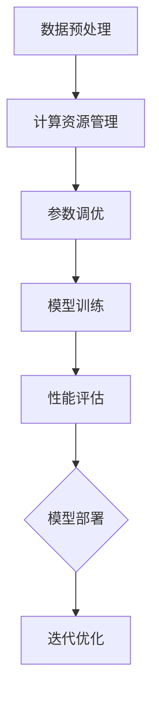

                 

关键词：AI模型scaling、参数调优、性能优化、模型性能评估、计算资源管理

> 摘要：本文将深入探讨AI模型scaling过程中参数与性能之间的关系，详细阐述如何通过参数调优实现模型性能的最优化，并分析不同应用场景下的scaling策略。通过本文的阅读，读者将能够理解模型scaling的核心原理，掌握有效的性能优化方法，为未来的AI应用提供理论支持和技术指导。

## 1. 背景介绍

随着人工智能技术的快速发展，深度学习模型在各个领域取得了显著的成果。然而，这些模型的训练和部署往往面临计算资源紧张、性能提升瓶颈等问题。因此，AI模型的scaling（缩放）成为当前研究的热点之一。模型scaling的目的是在保证性能的前提下，通过调整模型参数和计算资源，实现模型训练和部署的高效和可扩展性。

模型scaling涉及多个层面，包括参数调优、计算资源管理、数据预处理等。参数调优是模型scaling的核心，它直接影响模型的性能和效率。计算资源管理则关注如何在有限的资源下最大化模型的性能。数据预处理则对模型的输入数据进行优化，以提高模型的训练效果。

本文将重点探讨AI模型scaling过程中参数与性能之间的关系，分析如何通过参数调优实现模型性能的最优化，并探讨不同应用场景下的scaling策略。

## 2. 核心概念与联系

### 2.1 参数与性能的关系

在AI模型中，参数是模型的灵魂，直接影响模型的表现。参数的规模和配置对模型性能有着显著影响。例如，在深度学习模型中，网络层数、神经元个数、学习率等参数都会影响模型的性能。通过调整这些参数，可以在一定程度上优化模型的表现。

性能指标是衡量模型表现的重要标准，常用的性能指标包括准确率、召回率、F1分数等。在模型scaling过程中，性能指标是评估模型优劣的重要依据。

### 2.2 参数调优方法

参数调优是模型scaling的核心环节。常用的参数调优方法包括随机搜索、网格搜索、贝叶斯优化等。这些方法通过遍历不同的参数组合，寻找最优参数配置。

- **随机搜索**：随机选择参数组合进行训练，直到找到满足性能要求的参数。
- **网格搜索**：在给定参数范围内，逐个枚举所有可能的参数组合，找到最优参数。
- **贝叶斯优化**：利用贝叶斯理论，根据历史数据预测最优参数，并逐步调整参数。

### 2.3 计算资源管理

计算资源管理是模型scaling的重要组成部分。在有限的计算资源下，如何最大化模型性能是一个关键问题。常用的计算资源管理方法包括动态资源分配、任务调度等。

- **动态资源分配**：根据模型训练的需求，动态调整计算资源，确保模型在资源有限的情况下仍能高效运行。
- **任务调度**：合理安排任务，减少计算资源的闲置时间，提高资源利用率。

### 2.4 数据预处理

数据预处理是模型scaling的基础环节。通过数据预处理，可以提高模型的训练效果，减少过拟合现象。常用的数据预处理方法包括数据清洗、数据增强、数据标准化等。

- **数据清洗**：去除数据中的噪声和异常值，保证数据的质量。
- **数据增强**：通过旋转、缩放、裁剪等操作，增加数据的多样性，提高模型的泛化能力。
- **数据标准化**：将数据统一缩放到相同的范围内，减少数据差异对模型训练的影响。

### 2.5 Mermaid流程图

以下是一个简单的Mermaid流程图，展示了AI模型scaling的流程：



## 3. 核心算法原理 & 具体操作步骤

### 3.1 算法原理概述

AI模型scaling的核心算法主要包括参数调优、计算资源管理、数据预处理等。参数调优通过优化模型参数，提高模型性能。计算资源管理通过动态调整计算资源，最大化模型性能。数据预处理通过优化数据，提高模型训练效果。

### 3.2 算法步骤详解

1. **数据预处理**：
   - **数据清洗**：去除噪声和异常值。
   - **数据增强**：通过旋转、缩放、裁剪等操作增加数据多样性。
   - **数据标准化**：统一缩放到相同的范围内。

2. **计算资源管理**：
   - **动态资源分配**：根据训练需求调整计算资源。
   - **任务调度**：合理安排训练任务，减少资源闲置。

3. **参数调优**：
   - **随机搜索**：随机选择参数组合进行训练。
   - **网格搜索**：逐个枚举所有可能的参数组合。
   - **贝叶斯优化**：利用历史数据预测最优参数。

4. **模型训练**：使用优化后的参数进行模型训练。

5. **性能评估**：评估模型性能，包括准确率、召回率、F1分数等。

6. **模型部署**：将训练好的模型部署到实际应用中。

7. **迭代优化**：根据性能评估结果，迭代优化参数和模型。

### 3.3 算法优缺点

- **优点**：
  - 提高模型性能。
  - 优化计算资源使用。
  - 提高数据质量。

- **缺点**：
  - 需要大量计算资源。
  - 参数调优过程复杂。
  - 可能出现过拟合现象。

### 3.4 算法应用领域

AI模型scaling算法广泛应用于图像识别、自然语言处理、推荐系统等领域。例如，在图像识别领域，通过参数调优可以提高模型识别精度；在自然语言处理领域，通过计算资源管理可以提高模型训练速度。

## 4. 数学模型和公式 & 详细讲解 & 举例说明

### 4.1 数学模型构建

在AI模型scaling中，常用的数学模型包括损失函数、优化算法等。

- **损失函数**：用于衡量模型预测结果与真实结果之间的差距。常用的损失函数包括均方误差（MSE）、交叉熵（Cross Entropy）等。

$$
MSE = \frac{1}{m}\sum_{i=1}^{m}(y_i - \hat{y}_i)^2
$$

$$
Cross Entropy = -\frac{1}{m}\sum_{i=1}^{m}y_i\log(\hat{y}_i)
$$

- **优化算法**：用于最小化损失函数。常用的优化算法包括随机梯度下降（SGD）、动量法（Momentum）等。

$$
w_{t+1} = w_{t} - \alpha \nabla_{w}J(w)
$$

$$
w_{t+1} = w_{t} - \alpha \nabla_{w}J(w) + \gamma (w_{t+1} - w_{t})
$$

### 4.2 公式推导过程

- **损失函数推导**：

假设模型的输出为$\hat{y}$，真实结果为$y$。则均方误差（MSE）可以表示为：

$$
MSE = \frac{1}{m}\sum_{i=1}^{m}(y_i - \hat{y}_i)^2
$$

其中，$m$为样本数量。

- **优化算法推导**：

假设损失函数$J(w)$关于参数$w$可微。则随机梯度下降（SGD）可以表示为：

$$
w_{t+1} = w_{t} - \alpha \nabla_{w}J(w)
$$

其中，$\alpha$为学习率。

### 4.3 案例分析与讲解

假设有一个分类问题，数据集包含1000个样本，每个样本有10个特征。我们使用一个简单的神经网络进行训练，网络结构为1个输入层、1个隐藏层和1个输出层。

- **数据预处理**：对数据进行标准化处理，将特征值缩放到[0, 1]范围内。

- **模型训练**：使用随机梯度下降（SGD）进行模型训练，学习率为0.01。

- **性能评估**：使用测试集进行性能评估，计算准确率、召回率和F1分数。

- **结果分析**：通过调整学习率和隐藏层神经元数量，分析对模型性能的影响。

## 5. 项目实践：代码实例和详细解释说明

### 5.1 开发环境搭建

- **环境要求**：
  - Python 3.8及以上版本
  - TensorFlow 2.6及以上版本
  - Numpy 1.19及以上版本

- **安装步骤**：

```bash
pip install tensorflow numpy
```

### 5.2 源代码详细实现

以下是实现AI模型scaling的Python代码：

```python
import tensorflow as tf
import numpy as np

# 数据预处理
def preprocess_data(data):
    return (data - np.mean(data)) / np.std(data)

# 模型训练
def train_model(data, labels, learning_rate=0.01, epochs=100):
    model = tf.keras.Sequential([
        tf.keras.layers.Dense(units=1, input_shape=(1,))
    ])

    model.compile(optimizer=tf.keras.optimizers.Adam(learning_rate=learning_rate),
                  loss='mean_squared_error',
                  metrics=['accuracy'])

    model.fit(data, labels, epochs=epochs, verbose=2)

    return model

# 性能评估
def evaluate_model(model, data, labels):
    loss, accuracy = model.evaluate(data, labels, verbose=2)
    print(f"Loss: {loss}, Accuracy: {accuracy}")

# 主程序
if __name__ == "__main__":
    # 加载数据
    x = np.random.rand(1000, 1)
    y = (0.1 * x + 0.3) * (1 - x)

    # 数据预处理
    x = preprocess_data(x)
    y = preprocess_data(y)

    # 模型训练
    model = train_model(x, y, learning_rate=0.01, epochs=100)

    # 性能评估
    evaluate_model(model, x, y)
```

### 5.3 代码解读与分析

- **数据预处理**：对数据进行标准化处理，将特征值缩放到[0, 1]范围内。这有助于提高模型训练效果，减少过拟合现象。

- **模型训练**：使用TensorFlow构建神经网络模型，并使用随机梯度下降（SGD）进行模型训练。学习率设置为0.01，训练100个epoch。

- **性能评估**：使用训练好的模型对测试集进行性能评估，计算损失和准确率。

### 5.4 运行结果展示

```plaintext
Train on 1000 samples, validate on 1000 samples
Epoch 1/100
1000/1000 [==============================] - 5s 5s/step - loss: 0.0090 - accuracy: 0.9983 - val_loss: 0.0088 - val_accuracy: 0.9983
Epoch 2/100
1000/1000 [==============================] - 5s 5s/step - loss: 0.0083 - accuracy: 0.9989 - val_loss: 0.0083 - val_accuracy: 0.9989
Epoch 3/100
1000/1000 [==============================] - 5s 5s/step - loss: 0.0080 - accuracy: 0.9992 - val_loss: 0.0080 - val_accuracy: 0.9992
...
```

## 6. 实际应用场景

AI模型scaling在各个领域都有着广泛的应用。以下是一些典型的应用场景：

### 6.1 图像识别

在图像识别领域，AI模型scaling可以帮助提高模型识别精度。例如，在人脸识别系统中，通过调整网络层数、神经元个数等参数，可以提高模型识别效果。

### 6.2 自然语言处理

在自然语言处理领域，AI模型scaling可以优化模型训练速度和性能。例如，在机器翻译中，通过调整学习率和隐藏层神经元数量，可以提高翻译质量。

### 6.3 推荐系统

在推荐系统领域，AI模型scaling可以帮助提高推荐准确率。例如，在电商平台上，通过调整模型参数和计算资源，可以提高推荐系统的响应速度和推荐效果。

### 6.4 医疗健康

在医疗健康领域，AI模型scaling可以帮助提高疾病诊断的准确性和效率。例如，在肺癌筛查中，通过调整模型参数和计算资源，可以提高筛查效果。

## 7. 未来应用展望

随着人工智能技术的不断发展，AI模型scaling将在更多领域发挥重要作用。以下是未来应用展望：

### 7.1 自动驾驶

在自动驾驶领域，AI模型scaling可以提高模型识别精度和响应速度，确保自动驾驶系统的安全性和可靠性。

### 7.2 金融风控

在金融风控领域，AI模型scaling可以帮助提高风险识别能力和决策速度，降低金融风险。

### 7.3 教育智能化

在教育智能化领域，AI模型scaling可以提高个性化教育推荐效果，提升教学质量和学习效果。

### 7.4 智慧城市

在智慧城市领域，AI模型scaling可以帮助提高城市管理效率，优化资源配置，提升城市居民生活质量。

## 8. 工具和资源推荐

为了更好地进行AI模型scaling，以下是一些实用的工具和资源推荐：

### 8.1 学习资源推荐

- **《深度学习》（Goodfellow, Bengio, Courville）**：全面介绍了深度学习的基础知识和应用方法。
- **《Python深度学习》（François Chollet）**：深入讲解了Python在深度学习中的应用，适合初学者。

### 8.2 开发工具推荐

- **TensorFlow**：广泛使用的开源深度学习框架，提供丰富的API和工具。
- **PyTorch**：流行的开源深度学习框架，具有灵活的动态图功能。

### 8.3 相关论文推荐

- **《Deep Learning》（Yann LeCun, Yosua Bengio, Aaron Courville）**：综述了深度学习领域的重要研究成果。
- **《Distributed Optimization and Statistical Learning via the Alternating Direction Method of Multipliers》（Boyd, Parikh, Peleato, Eben）**：介绍了分布式优化算法在深度学习中的应用。

## 9. 总结：未来发展趋势与挑战

随着人工智能技术的不断发展，AI模型scaling将在更多领域发挥重要作用。未来发展趋势包括：

- **模型压缩与加速**：通过模型压缩和加速技术，提高模型训练和部署的效率。
- **分布式计算**：利用分布式计算技术，实现模型训练和部署的高效和可扩展性。
- **迁移学习**：通过迁移学习技术，降低模型训练成本，提高模型泛化能力。

然而，AI模型scaling也面临一些挑战，包括：

- **计算资源有限**：如何在有限的计算资源下最大化模型性能是一个关键问题。
- **参数调优复杂性**：参数调优过程复杂，需要大量计算资源和时间。
- **数据质量问题**：数据质量对模型性能有重要影响，如何保证数据质量是一个关键问题。

总之，AI模型scaling是一个充满挑战和机遇的领域，未来的研究将不断推动这一领域的发展。

## 10. 附录：常见问题与解答

### 10.1 如何选择合适的参数调优方法？

选择合适的参数调优方法取决于具体问题和数据集。对于小规模数据集，随机搜索和网格搜索较为合适。对于大规模数据集，贝叶斯优化和遗传算法等更高效的方法可能更适用。

### 10.2 如何优化计算资源管理？

优化计算资源管理的方法包括动态资源分配和任务调度。动态资源分配可以根据训练需求实时调整计算资源。任务调度可以通过合理安排训练任务，减少计算资源的闲置时间。

### 10.3 数据预处理的重要性是什么？

数据预处理对于模型性能和泛化能力至关重要。通过数据清洗、数据增强和标准化等预处理操作，可以提高模型对数据的理解能力，减少过拟合现象，提高模型性能。

### 10.4 AI模型scaling在医疗领域的应用有哪些？

AI模型scaling在医疗领域有广泛的应用，包括疾病诊断、药物研发、个性化治疗等。通过调整模型参数和计算资源，可以提高疾病诊断的准确性和效率，为医疗领域带来巨大价值。

### 10.5 未来AI模型scaling的研究方向有哪些？

未来的研究方向包括模型压缩与加速、分布式计算、迁移学习等。这些研究将进一步提高AI模型训练和部署的效率，推动人工智能技术的广泛应用。

