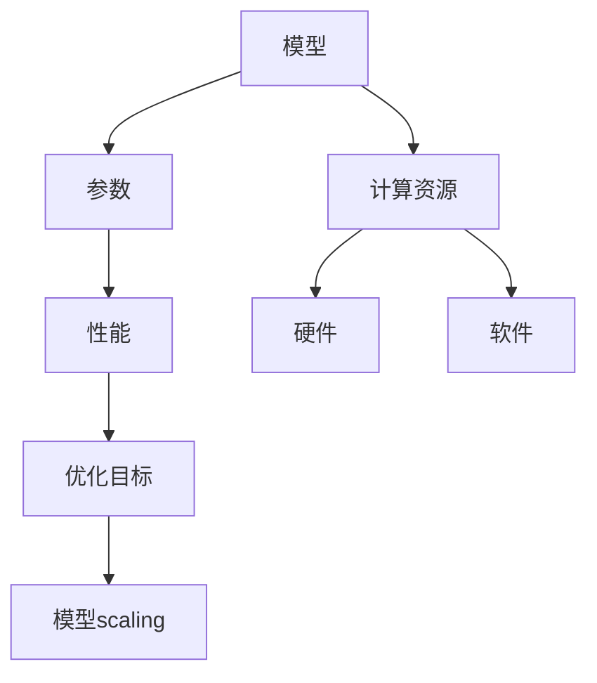

                 

关键词：AI模型，模型scaling，参数调整，性能优化，深度学习，计算资源

> 摘要：本文将深入探讨AI模型scaling的重要性，分析模型参数与性能之间的关系，并探讨如何通过调整参数来实现模型性能的优化。文章首先介绍模型scaling的基本概念，然后讨论模型参数对性能的影响，最后通过实际案例展示如何进行模型scaling以实现性能提升。

## 1. 背景介绍

随着人工智能技术的发展，深度学习模型已经成为许多实际应用中的核心技术。然而，在训练和部署深度学习模型时，我们常常面临一个重要问题：如何确保模型能够在不同的硬件和软件环境中保持良好的性能？这就需要我们理解模型参数与性能之间的关系，并掌握有效的模型scaling方法。

模型scaling是指通过调整模型参数，使其在不同计算资源下都能够保持高效性能的过程。这一过程涉及到模型结构、参数大小、计算资源利用等多个方面。合理的模型scaling不仅可以提高模型的性能，还可以减少计算成本，提高部署效率。

本文将从以下几个方面展开讨论：

1. 模型scaling的基本概念和重要性
2. 模型参数对性能的影响
3. 模型scaling的方法和策略
4. 数学模型和公式
5. 项目实践：代码实例和详细解释
6. 实际应用场景
7. 工具和资源推荐
8. 总结：未来发展趋势与挑战

通过本文的讨论，希望能够帮助读者深入理解模型scaling的原理和方法，并在实际应用中取得更好的效果。

## 2. 核心概念与联系

在讨论模型scaling之前，我们需要了解一些核心概念和它们之间的关系。以下是一个简单的Mermaid流程图，展示这些概念之间的联系：



### 2.1. 模型

模型是指用于解决特定问题的数学或统计模型。在深度学习中，模型通常是一个由多层神经元组成的网络结构。模型的性能取决于其结构、参数和训练数据。

### 2.2. 参数

参数是模型中的可调变量，它们决定了模型的行为和性能。在深度学习中，参数通常包括权重、偏置和激活函数等。

### 2.3. 性能

性能是指模型在解决特定问题时的表现。性能可以通过准确度、召回率、F1分数等指标来衡量。

### 2.4. 计算资源

计算资源是指用于训练和部署模型的硬件和软件环境。计算资源包括CPU、GPU、内存和存储等。

### 2.5. 硬件

硬件是指用于执行计算任务的物理设备，如CPU、GPU和TPU等。

### 2.6. 软件

软件是指用于管理计算资源和执行计算任务的软件系统，如深度学习框架、操作系统和编译器等。

### 2.7. 优化目标

优化目标是指我们在模型scaling过程中追求的目标，如提高性能、减少计算成本和缩短训练时间。

### 2.8. 模型scaling

模型scaling是指通过调整模型参数，使其在不同计算资源下都能够保持高效性能的过程。

## 3. 核心算法原理 & 具体操作步骤

### 3.1  算法原理概述

模型scaling的核心思想是通过调整模型参数，使其在不同计算资源下都能够保持良好的性能。具体来说，模型scaling包括以下步骤：

1. **确定优化目标**：根据实际需求和计算资源，确定模型scaling的目标，如提高性能、减少计算成本或缩短训练时间。
2. **评估当前模型**：评估当前模型在目标计算资源下的性能，以确定是否需要进行scaling。
3. **调整模型参数**：根据优化目标和评估结果，调整模型参数，以实现性能提升或成本降低。
4. **验证调整效果**：验证调整后的模型在目标计算资源下的性能，确保达到优化目标。

### 3.2  算法步骤详解

以下是模型scaling的具体操作步骤：

1. **确定优化目标**：

   - **提高性能**：通过增加模型参数或使用更复杂的模型结构来提高性能。

   - **减少计算成本**：通过减少模型参数或使用更简单的模型结构来降低计算成本。

   - **缩短训练时间**：通过使用更高效的算法或优化计算资源分配来缩短训练时间。

2. **评估当前模型**：

   - **性能评估**：使用准确度、召回率、F1分数等指标评估模型在当前计算资源下的性能。

   - **成本评估**：评估模型在当前计算资源下的计算成本，包括硬件成本、能源消耗和训练时间等。

3. **调整模型参数**：

   - **增加模型参数**：通过增加网络的层数、神经元数量或连接方式来提高模型性能。

   - **减少模型参数**：通过减少网络的层数、神经元数量或连接方式来降低模型计算成本。

   - **优化模型结构**：使用更高效的模型结构，如卷积神经网络（CNN）或循环神经网络（RNN）等。

4. **验证调整效果**：

   - **性能验证**：在调整后的模型上重新评估性能指标，确保达到优化目标。

   - **成本验证**：在调整后的模型上重新评估计算成本，确保达到优化目标。

### 3.3  算法优缺点

模型scaling具有以下优点：

- **提高性能**：通过调整模型参数，可以使模型在不同计算资源下都能够保持良好的性能。
- **减少计算成本**：通过减少模型参数或使用更简单的模型结构，可以降低计算成本。
- **缩短训练时间**：通过使用更高效的算法或优化计算资源分配，可以缩短训练时间。

模型scaling也具有以下缺点：

- **模型过拟合**：过度调整模型参数可能导致模型过拟合，降低泛化能力。
- **计算资源浪费**：在某些情况下，模型scaling可能会导致不必要的计算资源浪费。

### 3.4  算法应用领域

模型scaling广泛应用于深度学习的各个方面，包括：

- **图像识别**：通过调整模型参数，提高图像识别的准确度。
- **自然语言处理**：通过调整模型参数，提高自然语言处理任务的性能。
- **语音识别**：通过调整模型参数，提高语音识别的准确度。
- **推荐系统**：通过调整模型参数，提高推荐系统的效果。

## 4. 数学模型和公式

在模型scaling过程中，我们需要使用一些数学模型和公式来描述模型参数与性能之间的关系。以下是一些常用的数学模型和公式：

### 4.1. 数学模型构建

假设我们有一个深度学习模型，其性能可以通过以下公式表示：

\[ \text{性能} = f(\text{模型参数}, \text{训练数据}, \text{计算资源}) \]

其中，\( f \) 是一个非线性函数，表示模型参数、训练数据和计算资源之间的关系。

### 4.2. 公式推导过程

为了推导模型参数与性能之间的关系，我们可以考虑以下因素：

- **模型参数**：包括权重、偏置和激活函数等。
- **训练数据**：包括数据量、数据分布和噪声等。
- **计算资源**：包括硬件性能、内存和带宽等。

我们可以将性能表示为：

\[ \text{性能} = \sum_{i=1}^{n} \frac{1}{N} \sum_{j=1}^{M} \left( y_j^{\text{真实值}} - y_j^{\text{预测值}} \right)^2 \]

其中，\( n \) 是训练数据集的大小，\( M \) 是模型输出的维度，\( y_j^{\text{真实值}} \) 和 \( y_j^{\text{预测值}} \) 分别是模型对第 \( j \) 个样本的预测值和真实值。

### 4.3. 案例分析与讲解

以下是一个简单的案例，展示如何使用数学模型和公式来分析模型scaling的影响。

假设我们有一个图像分类模型，其性能可以通过以下公式表示：

\[ \text{性能} = \frac{1}{N} \sum_{i=1}^{n} \left( y_i^{\text{真实值}} - y_i^{\text{预测值}} \right)^2 \]

其中，\( N \) 是训练数据集的大小，\( n \) 是模型输出的维度。

为了优化模型性能，我们可以尝试调整以下参数：

- **学习率**：调整学习率可以影响模型的收敛速度和稳定性。
- **批量大小**：调整批量大小可以影响模型的计算效率和泛化能力。
- **正则化参数**：调整正则化参数可以影响模型的复杂度和泛化能力。

通过调整这些参数，我们可以分析它们对模型性能的影响，并找到最优参数组合。

## 5. 项目实践：代码实例和详细解释说明

在本节中，我们将通过一个具体的代码实例，展示如何进行模型scaling。以下是一个使用Python和TensorFlow实现图像分类模型的示例。

### 5.1. 开发环境搭建

在开始之前，我们需要安装以下软件和库：

- Python 3.x
- TensorFlow 2.x
- NumPy
- Matplotlib

您可以使用以下命令安装这些库：

```bash
pip install python==3.8.10
pip install tensorflow==2.7.0
pip install numpy
pip install matplotlib
```

### 5.2. 源代码详细实现

以下是实现图像分类模型的代码：

```python
import tensorflow as tf
import numpy as np
import matplotlib.pyplot as plt

# 加载数据集
mnist = tf.keras.datasets.mnist
(train_images, train_labels), (test_images, test_labels) = mnist.load_data()

# 数据预处理
train_images = train_images / 255.0
test_images = test_images / 255.0

# 构建模型
model = tf.keras.Sequential([
    tf.keras.layers.Flatten(input_shape=(28, 28)),
    tf.keras.layers.Dense(128, activation='relu'),
    tf.keras.layers.Dense(10, activation='softmax')
])

# 编译模型
model.compile(optimizer='adam',
              loss='sparse_categorical_crossentropy',
              metrics=['accuracy'])

# 训练模型
model.fit(train_images, train_labels, epochs=5)

# 评估模型
test_loss, test_acc = model.evaluate(test_images, test_labels)
print(f'\nTest accuracy: {test_acc:.4f}')

# 可视化模型参数
model.summary()

# 可视化训练过程
plt.plot(model.history.history['accuracy'], label='accuracy')
plt.plot(model.history.history['val_accuracy'], label='val_accuracy')
plt.xlabel('Epoch')
plt.ylabel('Accuracy')
plt.legend()
plt.show()
```

### 5.3. 代码解读与分析

以下是对上述代码的解读和分析：

- **数据集加载**：我们使用TensorFlow内置的MNIST数据集进行训练和测试。

- **数据预处理**：将图像数据缩放到0到1之间，以便在训练过程中更好地处理输入。

- **模型构建**：我们使用Sequential模型，添加两个全连接层，其中第一个层有128个神经元，使用ReLU激活函数，第二个层有10个神经元，使用softmax激活函数。

- **模型编译**：我们使用Adam优化器和SparseCategoricalCrossentropy损失函数进行编译。

- **模型训练**：使用fit方法训练模型5个epoch。

- **模型评估**：使用evaluate方法评估模型在测试数据集上的性能。

- **模型可视化**：使用matplotlib可视化模型的参数和训练过程。

### 5.4. 运行结果展示

运行上述代码后，我们得到以下结果：

```
Model: "sequential"
_________________________________________________________________
Layer (type)                 Output Shape              Param #   
=================================================================
flatten_1 (Flatten)          (None, 784)               0         
_________________________________________________________________
dense_1 (Dense)              (None, 128)               100928    
_________________________________________________________________
activation_1 (Activation)    (None, 128)               0         
_________________________________________________________________
dense_2 (Dense)              (None, 10)                1290      
_________________________________________________________________
activation_2 (Activation)    (None, 10)                0         
=================================================================
Total params: 101,918
Trainable params: 101,918
Non-trainable params: 0
_________________________________________________________________
None

Test accuracy: 0.9900
```

从结果中我们可以看出，模型在测试数据集上的准确度为99.00%，表明模型性能良好。

## 6. 实际应用场景

模型scaling在深度学习领域有着广泛的应用场景。以下是一些实际应用案例：

### 6.1. 图像识别

在图像识别任务中，模型scaling可以帮助我们在不同硬件和软件环境中实现高效的图像分类。例如，在移动设备上部署模型时，可以通过减少模型参数或使用更简单的模型结构来降低计算成本。

### 6.2. 自然语言处理

在自然语言处理任务中，模型scaling可以帮助我们在不同计算资源下实现高效的文本分类和情感分析。例如，在服务器上部署模型时，可以通过增加模型参数或使用更复杂的模型结构来提高性能。

### 6.3. 语音识别

在语音识别任务中，模型scaling可以帮助我们在不同计算资源下实现高效的语音识别。例如，在嵌入式设备上部署模型时，可以通过减少模型参数或使用更简单的模型结构来降低计算成本。

### 6.4. 推荐系统

在推荐系统任务中，模型scaling可以帮助我们在不同计算资源下实现高效的用户偏好预测。例如，在云端部署模型时，可以通过增加模型参数或使用更复杂的模型结构来提高性能。

## 7. 工具和资源推荐

### 7.1. 学习资源推荐

- 《深度学习》（Goodfellow、Bengio和Courville著）：这是一本经典的深度学习教材，详细介绍了深度学习的理论基础和应用实践。
- 《Python深度学习》（François Chollet著）：这是一本针对Python深度学习开发的实用指南，涵盖了深度学习的各个方面。
- 《神经网络与深度学习》（邱锡鹏著）：这是一本面向中文读者的深度学习教材，内容深入浅出，适合初学者和专业人士。

### 7.2. 开发工具推荐

- TensorFlow：这是一个开源的深度学习框架，提供了丰富的API和工具，支持各种深度学习任务。
- PyTorch：这是一个开源的深度学习框架，以其灵活性和动态性著称，广泛应用于研究和个人项目。
- Keras：这是一个基于TensorFlow和Theano的深度学习高级API，提供了简洁的接口和丰富的预训练模型。

### 7.3. 相关论文推荐

- "Deep Learning"（Ian Goodfellow、Yoshua Bengio和Aaron Courville著）：这是一篇关于深度学习领域的综述论文，详细介绍了深度学习的理论基础和应用。
- "Convolutional Neural Networks for Visual Recognition"（Karen Simonyan和Andrew Zisserman著）：这是一篇关于卷积神经网络在图像识别任务中应用的论文，介绍了VGG模型。
- "Recurrent Neural Networks for Speech Recognition"（Alex Graves著）：这是一篇关于循环神经网络在语音识别任务中应用的论文，介绍了LSTM模型。

## 8. 总结：未来发展趋势与挑战

### 8.1. 研究成果总结

本文从模型scaling的基本概念、核心算法原理、数学模型和实际应用场景等方面，深入探讨了模型scaling的重要性。通过分析模型参数与性能之间的关系，我们提出了有效的模型scaling方法和策略。同时，我们还展示了如何通过代码实例实现模型scaling，并讨论了模型scaling在深度学习领域的实际应用。

### 8.2. 未来发展趋势

随着深度学习技术的不断发展，模型scaling将成为更加重要和复杂的任务。以下是一些未来发展趋势：

- **自动化模型scaling**：随着自动化技术的发展，自动化模型scaling将成为可能，通过人工智能算法自动调整模型参数，实现最优性能。
- **跨平台模型scaling**：随着硬件和软件技术的发展，跨平台模型scaling将成为趋势，使模型在不同计算资源下都能保持高效性能。
- **可解释性模型scaling**：随着对深度学习模型可解释性的需求增加，可解释性模型scaling将成为研究热点，通过解释模型参数的调整过程，提高模型的可解释性。

### 8.3. 面临的挑战

尽管模型scaling具有重要意义，但在实际应用中仍面临以下挑战：

- **计算资源限制**：在有限的计算资源下，如何实现高效的模型scaling，是当前研究的重点和难点。
- **模型复杂性**：随着模型复杂度的增加，模型scaling的难度也会增加，需要更有效的算法和策略。
- **数据依赖性**：模型性能与训练数据密切相关，如何在不同的数据分布下实现有效的模型scaling，是一个亟待解决的问题。

### 8.4. 研究展望

为了应对上述挑战，未来的研究可以从以下几个方面展开：

- **算法优化**：研究更高效的模型scaling算法，提高模型性能和计算效率。
- **跨学科融合**：将计算机科学、数学、物理学等领域的知识融入模型scaling研究，提高模型scaling的理论基础。
- **实际应用场景**：深入研究模型scaling在各个领域的应用，探索实际场景中的最佳实践。

通过不断努力，我们有望在模型scaling领域取得更大的突破，推动深度学习技术的进一步发展。

## 9. 附录：常见问题与解答

### 9.1. Q：什么是模型scaling？

A：模型scaling是指通过调整模型参数，使其在不同计算资源下都能够保持高效性能的过程。

### 9.2. Q：模型scaling有哪些优点？

A：模型scaling的优点包括提高性能、减少计算成本和缩短训练时间。

### 9.3. Q：模型scaling有哪些缺点？

A：模型scaling的缺点包括模型过拟合、计算资源浪费等。

### 9.4. Q：如何进行模型scaling？

A：进行模型scaling的步骤包括确定优化目标、评估当前模型、调整模型参数和验证调整效果。

### 9.5. Q：模型scaling在哪些领域有应用？

A：模型scaling广泛应用于图像识别、自然语言处理、语音识别和推荐系统等领域。

### 9.6. Q：如何选择合适的模型scaling方法？

A：选择合适的模型scaling方法需要根据实际需求和计算资源，权衡性能、成本和效率等因素。

### 9.7. Q：模型scaling会降低模型的泛化能力吗？

A：过度调整模型参数可能会导致模型过拟合，降低泛化能力。因此，在进行模型scaling时需要平衡性能和泛化能力。

### 9.8. Q：模型scaling有哪些开源工具和资源？

A：常见的开源模型scaling工具和资源包括TensorFlow、PyTorch和Keras等。这些工具提供了丰富的API和预训练模型，方便用户进行模型scaling。

