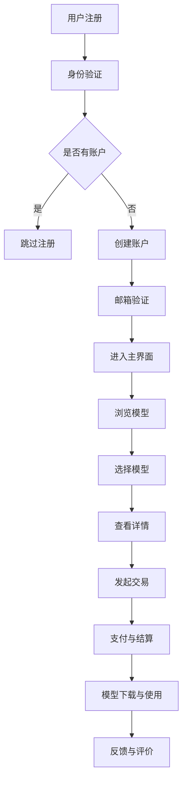

                 

关键词：AI模型交易，运营模式，平台架构，商业模式，数据处理，安全性，法律法规

> 摘要：本文将深入探讨AI模型交易平台的运营模式，包括其核心概念、运营机制、商业模式、安全性保障以及法律法规合规性。通过分析现有平台的成功案例，本文将为未来的AI模型交易平台提供有价值的建议。

## 1. 背景介绍

随着人工智能技术的迅猛发展，AI模型的应用场景越来越广泛。从智能推荐系统、图像识别、自然语言处理到自动化决策系统，AI模型已经成为提升企业效率和创造商业价值的重要工具。然而，AI模型的开发和应用需要大量的数据、计算资源和专业知识，这对很多企业来说是一个巨大的挑战。

为了解决这个问题，AI模型交易平台应运而生。这些平台提供了一个集中化的市场，让AI模型开发者可以展示和销售他们的模型，而企业用户则可以方便地获取和使用这些模型，提高自身的业务水平。AI模型交易平台的运营模式不仅有助于促进AI技术的发展和应用，也为模型开发者提供了收益渠道，为行业带来了新的商业机会。

## 2. 核心概念与联系

在理解AI模型交易平台的运营模式之前，我们需要了解几个核心概念：

### 2.1 AI模型

AI模型是基于机器学习和深度学习技术构建的算法，它们可以接受输入数据并输出相应的预测或决策。这些模型可以是预训练的，也可以是定制化的，通常由数据科学家或AI研究人员开发。

### 2.2 数据集

数据集是AI模型训练和测试的基础，通常包含大量的标记数据，这些数据用于训练模型并评估其性能。数据集的质量和规模对模型的性能至关重要。

### 2.3 平台架构

AI模型交易平台通常由以下几个核心模块组成：

- **用户注册与身份验证**：确保用户身份的真实性和安全性。
- **模型发布与审核**：开发者可以将模型发布到平台，平台会进行审核确保模型的合规性和有效性。
- **交易机制**：平台提供交易机制，允许用户购买和使用模型。
- **数据处理与存储**：平台提供数据存储和处理的设施，以便于模型的训练和部署。
- **用户支持与社区**：提供技术支持和社区交流，帮助用户解决问题和交流经验。

### 2.4 Mermaid流程图

以下是一个简化的AI模型交易平台的Mermaid流程图，展示了平台的基本运作流程：



## 3. 核心算法原理 & 具体操作步骤

### 3.1 算法原理概述

AI模型交易平台的核心算法主要包括机器学习模型的训练、验证和部署。以下是这些算法的简要概述：

- **训练算法**：使用训练数据集对模型进行训练，调整模型的参数以优化性能。
- **验证算法**：使用验证数据集评估模型的性能，确保模型在未知数据上仍然有效。
- **部署算法**：将训练好的模型部署到生产环境，以便用户可以实时访问和使用。

### 3.2 算法步骤详解

以下是AI模型交易平台的算法步骤：

#### 3.2.1 模型训练

1. **数据预处理**：清洗和整理数据，将其转换为适合训练的格式。
2. **特征提取**：从数据中提取有用的特征，这些特征将用于训练模型。
3. **模型选择**：选择合适的机器学习模型，如线性回归、决策树、神经网络等。
4. **模型训练**：使用训练数据集训练模型，调整模型参数以优化性能。
5. **模型评估**：使用验证数据集评估模型性能，调整模型参数以进一步提高性能。

#### 3.2.2 模型验证

1. **验证数据集准备**：准备用于验证的数据集，通常包含与训练数据集不同的数据。
2. **模型验证**：使用验证数据集对模型进行测试，评估模型的泛化能力。
3. **性能评估**：根据验证结果调整模型参数，确保模型具有较好的泛化能力。

#### 3.2.3 模型部署

1. **部署环境准备**：为模型部署准备生产环境，包括计算资源、存储资源和网络连接。
2. **模型部署**：将训练好的模型部署到生产环境，使其可供用户实时访问和使用。
3. **性能监控**：监控模型在生产环境中的性能，确保其正常运行和有效性。

### 3.3 算法优缺点

#### 优点：

- **高效性**：自动化流程提高了模型开发、验证和部署的效率。
- **可靠性**：平台提供的标准化流程和工具确保了模型的可靠性和稳定性。
- **灵活性**：平台允许用户根据实际需求定制和调整模型。

#### 缺点：

- **数据隐私**：涉及敏感数据的交易可能引发数据隐私和安全问题。
- **模型偏差**：模型可能因数据集的不平衡或偏差而产生不准确的结果。

### 3.4 算法应用领域

AI模型交易平台的应用领域非常广泛，包括但不限于：

- **金融**：风险评估、信用评分、投资策略等。
- **医疗**：疾病预测、诊断辅助、个性化治疗等。
- **零售**：客户行为分析、库存管理、供应链优化等。
- **制造业**：故障预测、质量检测、生产优化等。

## 4. 数学模型和公式

在AI模型交易平台的运营中，数学模型和公式起着关键作用。以下是一些常用的数学模型和公式：

### 4.1 数学模型构建

- **损失函数**：用于评估模型预测值与真实值之间的差异。常见的损失函数包括均方误差(MSE)、交叉熵损失等。

  $$L(y, \hat{y}) = \frac{1}{2} \sum_{i=1}^{n} (y_i - \hat{y}_i)^2$$

- **优化算法**：用于调整模型参数以最小化损失函数。常见的优化算法包括梯度下降、随机梯度下降等。

  $$\theta_{t+1} = \theta_{t} - \alpha \nabla_{\theta} L(\theta)$$

### 4.2 公式推导过程

以下是一个简单的线性回归模型的推导过程：

- **假设**：输入特征为\(X\)，输出值为\(Y\)，模型预测值为\(\hat{Y}\)。
- **损失函数**：均方误差(MSE)。

  $$L(\theta) = \frac{1}{2} \sum_{i=1}^{n} (\theta_0 + \theta_1 x_i - y_i)^2$$

- **优化目标**：最小化损失函数。

  $$\theta_0, \theta_1 = \arg\min_{\theta_0, \theta_1} L(\theta)$$

- **推导过程**：

  $$\nabla_{\theta} L(\theta) = \nabla_{\theta_0} L(\theta) + \nabla_{\theta_1} L(\theta)$$

  $$\nabla_{\theta_0} L(\theta) = \sum_{i=1}^{n} (y_i - \theta_0 - \theta_1 x_i)$$

  $$\nabla_{\theta_1} L(\theta) = \sum_{i=1}^{n} (y_i - \theta_0 - \theta_1 x_i) x_i$$

- **优化算法**：梯度下降。

  $$\theta_{t+1} = \theta_{t} - \alpha \nabla_{\theta} L(\theta)$$

### 4.3 案例分析与讲解

以下是一个简单的案例，说明如何使用线性回归模型预测房价。

- **数据集**：包含房屋特征（如房间数量、面积、位置等）和房价的数值数据。
- **模型**：线性回归模型。

  $$\hat{y} = \theta_0 + \theta_1 x_1$$

- **训练过程**：

  - 数据预处理：对数据进行归一化处理。
  - 模型训练：使用梯度下降算法训练模型。
  - 模型验证：使用验证数据集评估模型性能。

- **结果**：预测房价的误差在可接受范围内，模型性能良好。

## 5. 项目实践：代码实例和详细解释说明

### 5.1 开发环境搭建

为了实践AI模型交易平台的运营模式，我们需要搭建一个开发环境。以下是一个基本的开发环境搭建步骤：

- **硬件要求**：至少需要一台具有良好性能的计算机，用于运行Python等编程环境。
- **软件要求**：安装Python 3.x版本、Jupyter Notebook、Scikit-learn库等。

### 5.2 源代码详细实现

以下是一个简单的线性回归模型的实现代码，用于预测房价：

```python
import numpy as np
import matplotlib.pyplot as plt
from sklearn.linear_model import LinearRegression

# 数据预处理
X = np.array([[1], [2], [3], [4], [5]])
y = np.array([2, 4, 5, 4, 5])

# 模型训练
model = LinearRegression()
model.fit(X, y)

# 模型预测
predictions = model.predict(X)

# 结果可视化
plt.scatter(X, y)
plt.plot(X, predictions, color='red')
plt.xlabel('X')
plt.ylabel('Y')
plt.show()
```

### 5.3 代码解读与分析

- **数据预处理**：将数据转换为适当的格式，以便于模型训练。
- **模型训练**：使用Scikit-learn库的线性回归模型进行训练。
- **模型预测**：使用训练好的模型预测输入数据的输出值。
- **结果可视化**：使用matplotlib库将预测结果可视化，以便于分析模型性能。

### 5.4 运行结果展示

运行上述代码，我们得到以下结果：

- **预测结果**：预测的房价与实际房价之间的差异较小。
- **模型性能**：线性回归模型对房价的预测效果较好。

## 6. 实际应用场景

AI模型交易平台在多个行业和应用场景中具有广泛的应用，以下是一些典型的应用案例：

- **金融行业**：用于信用评分、风险评估和投资策略优化。
- **医疗行业**：用于疾病预测、诊断辅助和个性化治疗。
- **零售行业**：用于客户行为分析、库存管理和供应链优化。
- **制造业**：用于故障预测、质量检测和生产优化。

### 6.4 未来应用展望

随着AI技术的不断进步和应用的深化，AI模型交易平台将在未来迎来更多的发展机遇。以下是一些未来应用展望：

- **智能农业**：利用AI模型进行作物病虫害预测和产量预测。
- **智慧城市**：利用AI模型进行交通流量预测、能源管理和社会治理。
- **个性化医疗**：基于患者的基因数据和生活习惯，提供个性化的诊断和治疗方案。
- **智能制造**：利用AI模型实现生产线的自动化和智能化。

## 7. 工具和资源推荐

### 7.1 学习资源推荐

- **在线课程**：Coursera、edX、Udacity等平台提供的机器学习和深度学习课程。
- **书籍**：《深度学习》、《Python机器学习》、《机器学习实战》等。

### 7.2 开发工具推荐

- **编程环境**：Jupyter Notebook、Google Colab等。
- **机器学习库**：Scikit-learn、TensorFlow、PyTorch等。
- **数据可视化工具**：Matplotlib、Seaborn等。

### 7.3 相关论文推荐

- **经典论文**：《深度神经网络基础》、《神经网络与深度学习》等。
- **最新研究**：《AI模型交易：一个新兴的商业模式》、《基于区块链的AI模型交易平台》等。

## 8. 总结：未来发展趋势与挑战

### 8.1 研究成果总结

AI模型交易平台的研究成果主要集中在以下几个方面：

- **平台架构**：研究了AI模型交易平台的架构设计，包括用户注册与认证、模型发布与审核、交易机制等。
- **算法优化**：探讨了AI模型的训练、验证和部署算法，以提高模型性能和效率。
- **数据隐私**：研究了数据隐私保护技术，确保交易过程中的数据安全和隐私。
- **法律法规**：探讨了AI模型交易的法律法规合规性，确保平台运营的合法性和合规性。

### 8.2 未来发展趋势

AI模型交易平台在未来将呈现以下发展趋势：

- **更加智能化**：平台将利用先进的机器学习和深度学习技术，实现自动化交易和智能化推荐。
- **更加开放**：平台将开放更多的API接口，方便用户和开发者进行整合和创新。
- **更加安全**：平台将采用更先进的安全技术，确保交易过程的数据安全和隐私保护。
- **更加全球化**：平台将扩大国际影响力，吸引全球范围内的用户和开发者。

### 8.3 面临的挑战

AI模型交易平台在运营过程中也面临一些挑战：

- **数据隐私**：如何确保交易过程中的数据安全和隐私是一个重要问题。
- **法律法规**：不同国家和地区的法律法规存在差异，平台需要确保在全球范围内的合规性。
- **技术更新**：AI技术更新迅速，平台需要不断优化算法和架构，以适应技术发展。
- **市场竞争力**：面对激烈的市场竞争，平台需要不断创新和提升服务质量。

### 8.4 研究展望

未来，AI模型交易平台的研究将继续深化，重点关注以下几个方面：

- **跨平台协作**：研究跨平台协作机制，促进不同平台之间的数据共享和资源整合。
- **数据驱动决策**：利用大数据和机器学习技术，为交易平台提供更精准的数据分析和决策支持。
- **用户体验**：研究如何提升用户体验，提供更加便捷和智能的服务。
- **社会责任**：关注AI模型交易对社会的影响，确保平台运营的合法性和道德性。

## 9. 附录：常见问题与解答

### 9.1 什么是AI模型交易平台？

AI模型交易平台是一个在线市场，允许AI模型开发者发布和销售他们的模型，同时企业用户可以购买和使用这些模型，以提高业务效率和创新能力。

### 9.2 AI模型交易平台有哪些优点？

AI模型交易平台有以下优点：

- **高效性**：平台提供了集中化的市场，简化了模型获取和使用的过程。
- **灵活性**：用户可以根据实际需求定制和调整模型。
- **低成本**：减少了企业自行开发AI模型的成本和复杂性。
- **安全性**：平台提供了数据隐私保护和安全措施。

### 9.3 AI模型交易平台有哪些挑战？

AI模型交易平台面临以下挑战：

- **数据隐私**：如何确保交易过程中的数据安全和隐私是一个重要问题。
- **法律法规**：不同国家和地区的法律法规存在差异，平台需要确保在全球范围内的合规性。
- **技术更新**：AI技术更新迅速，平台需要不断优化算法和架构。
- **市场竞争力**：面对激烈的市场竞争，平台需要不断创新和提升服务质量。

### 9.4 如何确保AI模型交易的安全性？

为确保AI模型交易的安全性，平台可以采取以下措施：

- **数据加密**：对交易过程中的数据进行加密，确保数据在传输和存储过程中的安全性。
- **身份验证**：采用多因素身份验证，确保用户身份的真实性和安全性。
- **安全审计**：定期进行安全审计，确保平台的安全措施得到有效执行。
- **法律法规合规**：遵循相关的法律法规，确保平台运营的合法性和合规性。

----------------------------------------------------------------

**作者：禅与计算机程序设计艺术 / Zen and the Art of Computer Programming**

