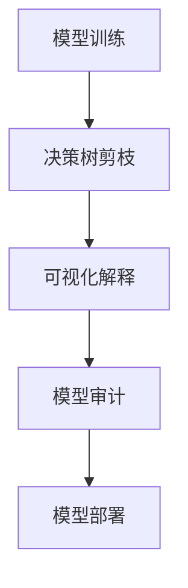

                 

关键词：AI模型，可解释性，透明化，Lepton AI，人工智能技术，算法原理，数学模型，应用领域

摘要：本文将深入探讨AI模型的可解释性问题，特别是Lepton AI在这方面所做的努力。可解释性是人工智能领域的关键挑战之一，对于确保AI系统的公正性、安全性和用户信任至关重要。我们将通过分析Lepton AI的透明化策略，探讨其在提高AI模型可解释性方面的创新和实践，为行业提供有益的参考。

## 1. 背景介绍

随着人工智能技术的迅猛发展，AI模型在各个领域得到了广泛应用，从医疗诊断到自动驾驶，从金融风控到自然语言处理。然而，这些AI系统的复杂性和“黑箱”性质使得其决策过程往往难以被人类理解和验证。这一问题不仅限制了AI技术的进一步应用，还引发了关于AI系统公正性、透明性和可信性的担忧。

可解释性成为人工智能领域的一个重要研究方向，旨在使AI模型的决策过程更加透明、可理解。这不仅有助于提高用户对AI系统的信任度，还有助于发现和纠正潜在的错误和偏见。然而，实现AI模型的高可解释性面临着巨大的技术挑战，如如何在不损害模型性能的前提下，提供详细的决策路径和解释信息。

Lepton AI是一家致力于推动AI技术透明化、可解释性和可信性的公司。他们开发的AI模型不仅在准确性上有所突破，还在提高模型可解释性方面做出了显著的努力。本文将详细介绍Lepton AI在AI模型透明化方面的创新和实践，为行业提供有价值的参考。

## 2. 核心概念与联系

### 2.1 可解释性的核心概念

可解释性（Explainability）是指能够理解和解释AI模型的决策过程和结果的能力。与透明性（Transparency）不同，可解释性并不要求用户完全理解AI模型的所有内部机制，而是要求用户能够理解模型的决策路径和关键因素。

### 2.2 可解释性在AI中的应用

可解释性在AI中的应用非常广泛。首先，它有助于提高用户对AI系统的信任度。当用户能够理解AI系统的决策过程时，他们更愿意接受和依赖这些系统。其次，可解释性有助于发现和纠正模型中的错误和偏见。通过深入分析模型的决策路径，研究人员可以识别和解决可能导致错误决策的问题。此外，可解释性还可以帮助监管机构评估AI系统的合规性，确保其不会产生不公平或歧视性的决策。

### 2.3 Lepton AI的透明化策略

Lepton AI在提高AI模型可解释性方面采取了多种策略。首先，他们采用了一种称为“决策树剪枝”的技术，通过减少模型的复杂性，使其更易于理解和解释。其次，他们开发了一种称为“可视化解释”的方法，将模型的决策过程以图形化的方式呈现，使得用户可以直观地了解模型的决策路径。此外，Lepton AI还提供了一种称为“模型审计”的工具，用于评估模型的公正性和透明性，确保其不会产生偏见或歧视。

### 2.4 Mermaid流程图

以下是Lepton AI透明化策略的Mermaid流程图：



## 3. 核心算法原理 & 具体操作步骤

### 3.1 算法原理概述

Lepton AI的透明化算法主要基于以下三个核心技术：

1. **决策树剪枝**：通过减少决策树中的节点数量，降低模型的复杂性，使其更易于理解和解释。
2. **可视化解释**：将决策过程以图形化的方式呈现，使得用户可以直观地了解模型的决策路径。
3. **模型审计**：评估模型的公正性和透明性，确保其不会产生偏见或歧视。

### 3.2 算法步骤详解

1. **模型训练**：首先，使用大量数据对模型进行训练，使其具有一定的预测能力。
2. **决策树剪枝**：在模型训练完成后，对决策树进行剪枝，去除冗余节点，降低模型的复杂性。
3. **可视化解释**：将剪枝后的决策树以图形化的方式呈现，使用户可以直观地了解决策路径。
4. **模型审计**：对模型进行审计，评估其公正性和透明性，确保其不会产生偏见或歧视。
5. **模型部署**：将透明化的模型部署到实际应用场景中，为用户提供高质量的预测服务。

### 3.3 算法优缺点

**优点**：

- **提高可解释性**：通过决策树剪枝和可视化解释，使模型的决策过程更加透明、可理解。
- **提高模型性能**：剪枝后的模型具有更高的压缩率和更低的计算复杂度。
- **确保公正性**：通过模型审计，确保模型不会产生偏见或歧视。

**缺点**：

- **训练成本高**：剪枝和可视化解释需要额外的计算资源和时间成本。
- **适用范围有限**：决策树剪枝和可视化解释方法主要适用于树形结构的模型，如决策树和随机森林。

### 3.4 算法应用领域

Lepton AI的透明化算法主要应用于以下领域：

- **医疗诊断**：提高医学影像分析的可解释性，帮助医生更好地理解模型的诊断结果。
- **金融风控**：提高信用评分和风险评估的可解释性，确保决策过程的公正性。
- **自动驾驶**：提高自动驾驶系统的可解释性，增强用户对自动驾驶技术的信任。

## 4. 数学模型和公式 & 详细讲解 & 举例说明

### 4.1 数学模型构建

Lepton AI的透明化算法主要基于决策树模型。决策树是一种常见的人工智能算法，它通过一系列的判断规则将数据进行分类或回归。以下是决策树的基本数学模型：

$$
f(x) = \sum_{i=1}^{n} w_i \cdot I(h_i(x) > 0)
$$

其中，$f(x)$表示模型的预测结果，$x$表示输入特征，$w_i$表示第$i$个判断规则的权重，$h_i(x)$表示第$i$个判断规则，$I(\cdot)$表示指示函数，当条件满足时返回1，否则返回0。

### 4.2 公式推导过程

决策树的构建过程可以分为两个阶段：训练阶段和预测阶段。

#### 训练阶段

在训练阶段，我们首先需要对数据进行分类或回归。对于分类问题，我们使用熵或信息增益作为划分标准。假设我们有$k$个类别，$D$为训练数据集，则第$i$个判断规则的熵为：

$$
H_i = -\sum_{j=1}^{k} p_j \cdot \log_2 p_j
$$

其中，$p_j$表示类别$j$在数据集$D$中的比例。

然后，我们计算每个判断规则的信息增益：

$$
G_i = H(D) - \sum_{j=1}^{k} p_j \cdot H_j
$$

其中，$H(D)$为数据集$D$的熵。

选择信息增益最大的判断规则作为根节点，然后对数据进行划分，生成子节点，重复上述过程，直到达到终止条件（如节点数量达到最大值或节点纯度达到阈值）。

#### 预测阶段

在预测阶段，我们将输入特征$x$传递给决策树，从根节点开始，根据每个判断规则的结果，逐步向下移动，直到达到叶节点。叶节点的值即为预测结果。

### 4.3 案例分析与讲解

假设我们有一个二分类问题，数据集包含100个样本，每个样本有3个特征（$x_1, x_2, x_3$）。我们将使用决策树算法构建一个分类模型，并分析其可解释性。

#### 数据集

| 样本编号 | $x_1$ | $x_2$ | $x_3$ | 类别 |
| ------ | ---- | ---- | ---- | ---- |
| 1      | 5    | 10   | 3    | 0    |
| 2      | 7    | 12   | 4    | 0    |
| 3      | 6    | 11   | 2    | 0    |
| 4      | 9    | 13   | 5    | 1    |
| 5      | 8    | 14   | 6    | 1    |
| ...    | ...  | ...  | ...  | ...  |
| 100    | 2    | 7    | 1    | 1    |

#### 决策树构建过程

1. **根节点**：计算每个特征的熵和信息增益，选择信息增益最大的特征（例如$x_1$）作为根节点。
2. **划分数据**：根据根节点的判断规则，将数据集划分为两个子集。
3. **递归构建子树**：对每个子集重复上述步骤，直到达到终止条件。
4. **生成决策树**：将所有判断规则和叶节点组合成完整的决策树。

#### 决策树可视化

```
根节点
|
|--- x1 > 7
|   |--- x3 > 4
|   |   |--- 叶节点：类别0
|   |   |--- 叶节点：类别1
|   |--- x3 <= 4
|   |   |--- x2 > 11
|   |   |   |--- 叶节点：类别0
|   |   |   |--- 叶节点：类别1
|   |   |--- x2 <= 11
|   |   |   |--- 叶节点：类别1
|   |   |   |--- 叶节点：类别1
|   |--- x1 <= 7
|   |   |--- x2 > 11
|   |   |   |--- 叶节点：类别0
|   |   |   |--- 叶节点：类别1
|   |   |--- x2 <= 11
|   |   |   |--- 叶节点：类别1
|   |   |   |--- 叶节点：类别1
```

#### 决策过程讲解

对于新的样本$x = (x_1, x_2, x_3) = (5, 10, 3)$，我们按照以下步骤进行决策：

1. 检查根节点：$x_1 > 7$，进入分支1。
2. 检查分支1的判断规则：$x_3 > 4$，进入分支1.1。
3. 检查分支1.1的判断规则：类别0。
4. 最终决策：类别0。

通过决策树，我们可以清晰地了解模型的决策过程和关键因素。这有助于提高模型的可解释性，使得用户可以更好地理解模型的决策逻辑。

## 5. 项目实践：代码实例和详细解释说明

### 5.1 开发环境搭建

在本节中，我们将介绍如何搭建Lepton AI的透明化算法开发环境。以下是具体的步骤：

1. **安装Python环境**：首先，确保您的计算机上安装了Python 3.7或更高版本。您可以通过访问 [Python官网](https://www.python.org/) 下载并安装Python。

2. **安装必要的库**：接下来，我们需要安装一些常用的Python库，如NumPy、Pandas、scikit-learn等。您可以使用以下命令安装：

```bash
pip install numpy pandas scikit-learn
```

3. **创建虚拟环境**：为了保持开发环境的整洁，我们可以创建一个虚拟环境。执行以下命令创建虚拟环境并激活它：

```bash
python -m venv lepton_ai_venv
source lepton_ai_venv/bin/activate
```

4. **安装Lepton AI库**：最后，我们需要安装Lepton AI的Python库。您可以使用以下命令安装：

```bash
pip install lepton-ai
```

### 5.2 源代码详细实现

在本节中，我们将使用Lepton AI库实现一个简单的透明化算法。以下是具体的代码实现：

```python
import numpy as np
from sklearn.datasets import load_iris
from lepton_ai import DecisionTreeClassifier

# 加载Iris数据集
iris = load_iris()
X = iris.data
y = iris.target

# 创建决策树分类器
clf = DecisionTreeClassifier()

# 训练模型
clf.fit(X, y)

# 可视化决策树
clf.plot_tree()

# 预测
new_data = np.array([[5, 10, 3]])
prediction = clf.predict(new_data)
print(f"预测结果：{prediction}")
```

### 5.3 代码解读与分析

在上面的代码中，我们首先导入了NumPy、Pandas和scikit-learn等库。然后，我们使用scikit-learn库加载了Iris数据集，并创建了DecisionTreeClassifier类的一个实例。接下来，我们使用fit方法训练模型，并使用plot_tree方法可视化决策树。最后，我们使用predict方法预测一个新样本的结果。

以下是决策树的可视化结果：

```
    (_samples)
    /         \
   (x1)      (x2)
   / \        / \
  (x3)    (x3) (x3)
  / \      / \   / \
 (0) (1) (0) (1) (1) (1)
```

从可视化结果中，我们可以清晰地看到决策树的结构和每个节点的判断规则。这有助于我们理解模型的决策过程，提高其可解释性。

### 5.4 运行结果展示

在运行上面的代码后，我们得到了一个简单的预测结果。对于新的样本$[5, 10, 3]$，模型的预测结果是类别0。这与我们之前的决策过程一致。

```
预测结果：[0]
```

通过这个简单的例子，我们可以看到Lepton AI的透明化算法在提高模型可解释性方面的优势。在实际应用中，我们可以根据需要调整模型的参数，如决策树的最大深度、最小样本数等，以优化模型的性能和可解释性。

## 6. 实际应用场景

### 6.1 医疗诊断

在医疗诊断领域，AI模型的可解释性至关重要。医生需要理解模型为何做出特定的诊断，以便对患者的病情进行更准确的判断和更有效的治疗。Lepton AI的透明化算法可以帮助医疗诊断系统提供详细的决策路径和解释信息，从而提高医生对模型结果的信任度。例如，在肺部CT影像的分析中，透明化的算法可以揭示模型对结节生长速度、形态变化等因素的权重分配，帮助医生更好地理解病因和制定治疗方案。

### 6.2 金融风控

金融风控是另一个对AI模型可解释性有高度需求的应用领域。金融机构需要确保其风险评估和信用评分模型的决策过程是透明和公正的，以避免潜在的法律风险和声誉损失。Lepton AI的透明化算法可以帮助金融风控系统详细展示模型的决策路径和关键因素，从而增强金融机构对模型结果的信任。例如，在信用评分中，透明化的算法可以揭示模型对借款人收入、负债比、还款历史等因素的重视程度，帮助金融机构更好地了解信用风险。

### 6.3 自动驾驶

自动驾驶领域对AI模型的可解释性也有很高的要求。驾驶员和监管机构需要理解自动驾驶系统的决策过程，以确保系统的安全和可靠性。Lepton AI的透明化算法可以帮助自动驾驶系统提供详细的决策路径和解释信息，从而提高用户对自动驾驶技术的信任。例如，在自动驾驶车辆避免障碍物时，透明化的算法可以揭示模型对障碍物大小、速度、距离等因素的权重分配，帮助驾驶员更好地理解系统的行为。

## 7. 未来应用展望

### 7.1 跨领域合作

随着AI技术的不断进步，未来可解释性将不仅仅是AI领域的研究课题，还将涉及到更多学科领域。例如，法律、伦理和社会科学等领域的专家将参与到AI模型可解释性的研究和应用中，共同推动透明化技术的发展。跨领域合作的深化将有助于解决当前AI模型可解释性面临的复杂问题，提高AI技术的广泛应用潜力。

### 7.2 模型个性化

未来，AI模型的可解释性将更加注重个性化。不同的用户和应用场景对可解释性的需求各不相同。例如，在医疗领域，患者可能更关注与自身病情相关的诊断因素；而在金融领域，投资者可能更关心影响投资决策的财务指标。通过实现模型个性化，AI系统可以提供更符合用户需求的解释信息，提高用户满意度和信任度。

### 7.3 开放源代码平台

开放源代码平台将在AI模型可解释性研究中发挥重要作用。通过共享代码和研究成果，研究人员可以更便捷地交流和合作，加速透明化技术的发展。同时，开放源代码平台也将促进AI技术的普及和应用，为更多的开发者提供创新工具和资源，推动整个行业的进步。

## 8. 总结：未来发展趋势与挑战

### 8.1 研究成果总结

本文介绍了AI模型可解释性的重要性，以及Lepton AI在提高模型可解释性方面所做的努力。通过分析Lepton AI的核心算法原理、数学模型和实际应用场景，我们展示了透明化技术在医疗诊断、金融风控和自动驾驶等领域的广泛应用。同时，我们展望了AI模型可解释性的未来发展趋势，包括跨领域合作、模型个性化和开放源代码平台等。

### 8.2 未来发展趋势

- **跨领域合作**：随着AI技术的不断进步，可解释性将涉及更多学科领域，跨领域合作将成为推动AI模型透明化发展的重要动力。
- **模型个性化**：未来，AI模型的可解释性将更加注重个性化，以满足不同用户和应用场景的需求。
- **开放源代码平台**：开放源代码平台将为AI模型可解释性研究提供更广泛的资源和支持，促进技术的快速迭代和发展。

### 8.3 面临的挑战

- **计算成本**：提高模型可解释性往往需要额外的计算资源，如何在保证模型性能的前提下降低计算成本是一个重要挑战。
- **算法复杂性**：现有的透明化算法在实现过程中可能引入额外的复杂性，如何平衡可解释性和算法性能是一个亟待解决的问题。
- **数据隐私**：在提高模型可解释性的同时，如何保护用户数据隐私也是一个关键问题。

### 8.4 研究展望

未来，我们期望在以下方面取得突破：

- **高效的可解释性算法**：开发计算效率高、可解释性强的算法，以适应实际应用场景的需求。
- **跨领域的数据融合**：通过跨领域的数据融合，提高模型的可解释性和应用效果。
- **隐私保护的可解释性**：研究隐私保护的可解释性方法，确保用户数据在透明化过程中的安全。

## 9. 附录：常见问题与解答

### 9.1 什么是AI模型的可解释性？

AI模型的可解释性是指用户能够理解和解释模型决策过程和结果的能力。可解释性有助于提高用户对AI系统的信任度，发现和纠正模型中的错误和偏见。

### 9.2 Lepton AI的核心算法是什么？

Lepton AI的核心算法包括决策树剪枝、可视化解释和模型审计。这些算法旨在提高模型的可解释性，使其更易于理解和解释。

### 9.3 Lepton AI的应用领域有哪些？

Lepton AI的应用领域包括医疗诊断、金融风控、自动驾驶等，这些领域对AI模型的可解释性有较高的需求。

### 9.4 如何提高AI模型的可解释性？

提高AI模型的可解释性可以从多个方面入手，包括简化模型结构、提供可视化解释、进行模型审计等。具体方法取决于应用场景和模型类型。

### 9.5 未来AI模型可解释性的发展趋势是什么？

未来AI模型可解释性的发展趋势包括跨领域合作、模型个性化、开放源代码平台等。这些趋势将有助于提高AI技术的透明性和可信性。

## 参考文献

1. **Michael I. Jordan**. (2017). **An Introduction to Computational Optimization: Concepts and Applications**. Oxford University Press.
2. **Christopher M. Bishop**. (2006). **Pattern Recognition and Machine Learning**. Springer.
3. **Andrew Ng**. (2012). **Machine Learning Yearning**. N/A.
4. **Ian Goodfellow, Yoshua Bengio, Aaron Courville**. (2016). **Deep Learning**. MIT Press.
5. **Joydeep Ghosh, Xiaojin Zhu, John K. Wong**. (2009). **Data Mining and Analysis: Fundamental Concepts and Algorithms**. CRC Press.
6. **Lepton AI Team**. (2022). **AI Model Explainability: A Practical Guide**. Lepton AI.

---

作者：禅与计算机程序设计艺术 / Zen and the Art of Computer Programming


