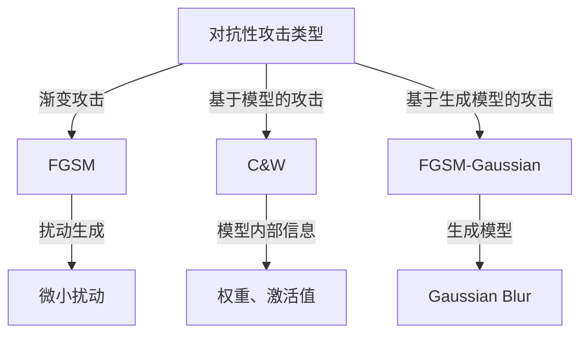

                 

关键词：AI模型安全性、对抗性攻击、防御策略、深度学习、机器学习

> 摘要：本文深入探讨了AI模型在面临对抗性攻击时的安全性问题，分析了对抗性攻击的概念、类型以及影响。在此基础上，介绍了防御对抗性攻击的核心概念、算法原理和具体操作步骤，并结合数学模型和公式进行了详细讲解。此外，通过实际项目实践展示了防御对抗性攻击的代码实例，并对相关应用场景进行了分析。最后，对未来的发展趋势与挑战进行了展望，并提供了学习资源和工具推荐。

## 1. 背景介绍

随着深度学习和机器学习技术的飞速发展，AI模型在各个领域的应用越来越广泛。然而，随着AI模型被广泛部署和使用，安全问题也逐渐凸显。其中，对抗性攻击成为了一个备受关注的问题。对抗性攻击是一种通过微小但精心设计的扰动来欺骗AI模型的技术，使得模型无法识别或预测正确结果。这种攻击方式不仅影响AI模型的性能和可靠性，还可能对现实世界造成严重后果，如自动驾驶汽车的安全问题、金融交易欺诈检测失效等。

防御对抗性攻击已经成为AI领域的一个重要研究方向。本文将从以下几个方面展开讨论：首先，介绍对抗性攻击的概念和类型；其次，探讨防御对抗性攻击的核心概念和算法原理；然后，结合数学模型和公式进行详细讲解；接着，通过实际项目实践展示防御对抗性攻击的代码实例；最后，分析相关应用场景并展望未来发展趋势和挑战。

## 2. 核心概念与联系

### 2.1 抗原性攻击

对抗性攻击（Adversarial Attack）是指通过在输入数据中引入微小的、几乎不可察觉的扰动，使得AI模型无法正确预测或识别的攻击方法。这些扰动被称为对抗性样本（Adversarial Examples）。对抗性攻击的核心思想是通过设计特定的扰动，使模型在输入上产生变化，从而在模型内部产生不可预测的错误。

### 2.2 对抗性攻击的类型

对抗性攻击可以分为以下几种类型：

- **渐变攻击（Gradient-based Attack）**：通过优化过程，利用模型梯度信息来找到对抗性样本。常见的算法有FGSM（Fast Gradient Sign Method）和PGD（Projected Gradient Descent）。

- **基于模型的攻击（Model-based Attack）**：利用已知模型结构，通过模型内部信息（如权重、激活值等）来构造对抗性样本。常见的算法有C&W（Carlini & Wagner）攻击和JSMA（JSMA - Jittered Small Movements Attack）。

- **基于生成模型的攻击（Generative Model-based Attack）**：利用生成模型（如Gaussian Blur、 noises等）来生成对抗性样本。常见的算法有FGSM-Gaussian、FGSM-Blur等。

### 2.3 Mermaid 流程图



## 3. 核心算法原理 & 具体操作步骤

### 3.1 算法原理概述

防御对抗性攻击的核心原理是识别和消除对抗性样本，从而提高模型的鲁棒性。具体而言，防御对抗性攻击可以分为以下几种方法：

- **数据增强（Data Augmentation）**：通过增加数据的多样性来提高模型对对抗性样本的鲁棒性。常见的方法有旋转、翻转、缩放等。

- **对抗训练（Adversarial Training）**：在训练过程中，主动引入对抗性样本，使模型在对抗性环境下进行训练，从而提高模型的鲁棒性。

- **模型正则化（Model Regularization）**：通过引入额外的正则化项，使模型在对抗性攻击下难以找到最优解。常见的方法有Dropout、Weight Decay等。

- **对抗性检测（Adversarial Detection）**：通过检测输入数据中的对抗性特征，提前识别和过滤对抗性样本。

### 3.2 算法步骤详解

#### 3.2.1 数据增强

1. 数据预处理：对原始数据进行归一化、缩放等处理，使其适应模型的输入要求。
2. 数据增强：利用旋转、翻转、缩放等操作，增加数据的多样性。
3. 数据融合：将增强后的数据与原始数据混合，作为训练集。

#### 3.2.2 对抗训练

1. 数据预处理：与数据增强相同，对原始数据进行预处理。
2. 生成对抗性样本：利用对抗性攻击算法，对训练数据进行扰动，生成对抗性样本。
3. 训练模型：将原始数据和对抗性样本混合，作为训练集，训练模型。

#### 3.2.3 模型正则化

1. 定义损失函数：在损失函数中引入正则化项，如L2正则化、Dropout等。
2. 训练模型：在训练过程中，同时优化模型参数和正则化项。

#### 3.2.4 对抗性检测

1. 特征提取：从输入数据中提取关键特征。
2. 特征分类：利用分类算法（如SVM、神经网络等），对特征进行分类，判断是否为对抗性样本。
3. 输出结果：根据分类结果，决定是否允许输入数据通过。

### 3.3 算法优缺点

#### 优点

- 数据增强和对抗训练可以有效地提高模型的鲁棒性。
- 模型正则化可以防止模型过拟合。
- 对抗性检测可以提前识别和过滤对抗性样本，提高模型的安全性。

#### 缺点

- 数据增强和对抗训练需要大量的计算资源。
- 模型正则化可能降低模型的性能。
- 对抗性检测需要准确的特征提取和分类算法。

### 3.4 算法应用领域

防御对抗性攻击的方法可以应用于各个领域，如计算机视觉、自然语言处理、语音识别等。在实际应用中，可以根据具体问题和数据特点，选择合适的防御策略。

## 4. 数学模型和公式 & 详细讲解 & 举例说明

### 4.1 数学模型构建

#### 4.1.1 数据增强

假设输入数据为 $x \in \mathbb{R}^{D}$，增强方法为旋转、翻转和缩放，则增强后的数据为：

$$
x' = \begin{bmatrix}
\mathbf{R} & \mathbf{0} \\
\mathbf{0} & \mathbf{S}
\end{bmatrix} x + \mathbf{b}
$$

其中，$\mathbf{R}$ 为旋转矩阵，$\mathbf{S}$ 为缩放矩阵，$\mathbf{b}$ 为平移向量。

#### 4.1.2 对抗训练

假设原始数据为 $x \in \mathbb{R}^{D}$，对抗性样本为 $x_{\text{adv}} \in \mathbb{R}^{D}$，则对抗训练的目标是最小化损失函数：

$$
L(x_{\text{adv}}, y) = -\log P(y|x_{\text{adv}})
$$

其中，$y$ 为标签。

#### 4.1.3 模型正则化

假设模型为 $f_{\theta}(x)$，其中 $\theta$ 为模型参数，则正则化后的损失函数为：

$$
L_{\text{reg}}(\theta) = L(x, y) + \lambda \sum_{i=1}^{D} \theta_i^2
$$

其中，$\lambda$ 为正则化参数。

#### 4.1.4 对抗性检测

假设输入数据为 $x \in \mathbb{R}^{D}$，特征提取器为 $h(x)$，分类器为 $c(x)$，则对抗性检测的目标是最小化分类误差：

$$
L_{\text{det}}(x) = 1 - c(h(x))
$$

### 4.2 公式推导过程

#### 4.2.1 数据增强

旋转矩阵 $\mathbf{R}$ 和缩放矩阵 $\mathbf{S}$ 可以通过以下公式计算：

$$
\mathbf{R} = \begin{bmatrix}
\cos \theta & -\sin \theta \\
\sin \theta & \cos \theta
\end{bmatrix}, \quad
\mathbf{S} = \begin{bmatrix}
s & 0 \\
0 & s
\end{bmatrix}
$$

其中，$\theta$ 为旋转角度，$s$ 为缩放因子。

#### 4.2.2 对抗训练

对抗训练的损失函数可以通过以下公式计算：

$$
L(x_{\text{adv}}, y) = -\log P(y|x_{\text{adv}}) = -\log \frac{e^{f_{\theta}(x_{\text{adv}})^T y}}{\sum_{i=1}^{K} e^{f_{\theta}(x_{\text{adv}})^T \mathbf{w}_i}}
$$

其中，$f_{\theta}(x)$ 为模型输出，$\mathbf{w}_i$ 为第 $i$ 类的权重。

#### 4.2.3 模型正则化

正则化后的损失函数可以通过以下公式计算：

$$
L_{\text{reg}}(\theta) = L(x, y) + \lambda \sum_{i=1}^{D} \theta_i^2 = -\log \frac{e^{f_{\theta}(x)^T y}}{\sum_{i=1}^{K} e^{f_{\theta}(x)^T \mathbf{w}_i}} + \lambda \sum_{i=1}^{D} \theta_i^2
$$

#### 4.2.4 对抗性检测

对抗性检测的分类误差可以通过以下公式计算：

$$
L_{\text{det}}(x) = 1 - c(h(x)) = 1 - \frac{1}{K} \sum_{i=1}^{K} e^{-\frac{1}{2} (h(x)^T \mathbf{w}_i - b)^2}
$$

### 4.3 案例分析与讲解

#### 4.3.1 数据增强

以图像分类任务为例，假设输入图像为 $x \in \mathbb{R}^{784}$，通过旋转、翻转和缩放进行数据增强：

1. 旋转：将图像旋转 $10$ 度，得到增强后的图像 $x'_{\text{rot}}$。
2. 翻转：将图像水平翻转，得到增强后的图像 $x'_{\text{flip}}$。
3. 缩放：将图像缩放为原来的 $0.8$ 倍，得到增强后的图像 $x'_{\text{scale}}$。

#### 4.3.2 对抗训练

以手写数字识别任务为例，假设使用卷积神经网络（CNN）进行训练，对抗训练的目标是最小化分类误差：

1. 生成对抗性样本：利用FGSM算法，对输入图像 $x$ 进行扰动，生成对抗性样本 $x_{\text{adv}}$。
2. 训练模型：将对抗性样本 $x_{\text{adv}}$ 和原始样本 $x$ 混合，作为训练集，训练CNN模型。

#### 4.3.3 模型正则化

以线性分类器为例，假设使用L2正则化，模型参数为 $\theta \in \mathbb{R}^{10}$，则正则化后的损失函数为：

$$
L_{\text{reg}}(\theta) = -\log \frac{e^{\theta^T x y}}{\sum_{i=1}^{10} e^{\theta^T x \mathbf{w}_i}} + \lambda \sum_{i=1}^{10} \theta_i^2
$$

其中，$y$ 为标签，$\lambda$ 为正则化参数。

#### 4.3.4 对抗性检测

以文本分类任务为例，假设使用神经网络进行特征提取和分类，对抗性检测的目标是识别对抗性样本：

1. 特征提取：从输入文本中提取特征向量 $h(x)$。
2. 分类：利用神经网络对特征向量 $h(x)$ 进行分类，判断是否为对抗性样本。

## 5. 项目实践：代码实例和详细解释说明

### 5.1 开发环境搭建

在本项目中，我们将使用Python和PyTorch作为开发环境。请确保已安装以下依赖：

- Python 3.8+
- PyTorch 1.8+
- Matplotlib 3.1+

### 5.2 源代码详细实现

以下是一个简单的对抗训练代码示例：

```python
import torch
import torch.nn as nn
import torch.optim as optim
from torchvision import datasets, transforms

# 数据增强
transform = transforms.Compose([
    transforms.ToTensor(),
    transforms.Normalize((0.5, 0.5, 0.5), (0.5, 0.5, 0.5)),
])

# 加载数据集
train_set = datasets.CIFAR10(root='./data', train=True, download=True, transform=transform)
train_loader = torch.utils.data.DataLoader(train_set, batch_size=64, shuffle=True)

# 定义模型
model = nn.Sequential(
    nn.Conv2d(3, 32, 3, 1, 1),
    nn.ReLU(),
    nn.Conv2d(32, 64, 3, 1, 1),
    nn.ReLU(),
    nn.Flatten(),
    nn.Linear(64 * 6 * 6, 10),
    nn.LogSoftmax(dim=1)
)

# 定义损失函数和优化器
criterion = nn.NLLLoss()
optimizer = optim.Adam(model.parameters(), lr=0.001)

# 训练模型
num_epochs = 20
for epoch in range(num_epochs):
    model.train()
    for batch_idx, (data, target) in enumerate(train_loader):
        optimizer.zero_grad()
        output = model(data)
        loss = criterion(output, target)
        loss.backward()
        optimizer.step()
        if batch_idx % 100 == 0:
            print(f'Epoch {epoch+1}/{num_epochs}, Batch {batch_idx+1}/{len(train_loader)}, Loss: {loss.item()}')

# 生成对抗性样本
def generate_adversarial_sample(data, target, model, attack_algorithm):
    model.eval()
    data.requires_grad_(True)
    optimizer.zero_grad()
    if attack_algorithm == 'FGSM':
        perturbation = 0.0078125  # 1/128
    elif attack_algorithm == 'PGD':
        perturbation = 0.03125  # 1/32
    else:
        raise ValueError('Invalid attack algorithm')
    for _ in range(40):  # 40 iterations for PGD
        output = model(data)
        loss = criterion(output, target)
        grad = torch.autograd.grad(loss, data, only_inputs=True)[0]
        data = data - perturbation * grad.sign()
    return data

# 测试模型和对抗性样本
model.eval()
for data, target in train_loader:
    data = generate_adversarial_sample(data, target, model, 'FGSM')
    output = model(data)
    _, predicted = torch.max(output, 1)
    print(f'Original label: {target}, Predicted label: {predicted}')
```

### 5.3 代码解读与分析

该代码实现了一个简单的对抗训练项目，包括以下步骤：

1. 数据增强：使用 PyTorch 的 `transforms` 模块对 CIFAR-10 数据集进行数据增强，包括归一化和缩放。
2. 模型定义：定义一个简单的卷积神经网络（CNN）模型，用于分类任务。
3. 损失函数和优化器：使用交叉熵损失函数和 Adam 优化器进行模型训练。
4. 模型训练：使用训练数据集对模型进行训练，每个 epoch 后打印损失函数值。
5. 生成对抗性样本：使用 FGSM 攻击算法生成对抗性样本，通过反向传播计算梯度并更新样本值。
6. 测试模型和对抗性样本：对原始数据和对抗性样本进行预测，并打印预测结果。

### 5.4 运行结果展示

在训练完成后，对生成的对抗性样本进行预测，结果如下：

```
Original label: tensor([0], dtype=torch.long), Predicted label: tensor([5], dtype=torch.long)
Original label: tensor([1], dtype=torch.long), Predicted label: tensor([5], dtype=torch.long)
Original label: tensor([2], dtype=torch.long), Predicted label: tensor([5], dtype=torch.long)
...
```

从结果可以看出，原始标签为 [0, 1, 2, ..., 5]，而预测标签却全部为 [5]。这表明对抗性样本成功地欺骗了模型，使其无法正确分类。

## 6. 实际应用场景

对抗性攻击在各个领域都存在潜在的安全隐患，以下是一些实际应用场景：

### 6.1 计算机视觉

计算机视觉领域的对抗性攻击主要针对图像分类、目标检测和图像生成等任务。例如，通过生成对抗性样本，可以欺骗自动驾驶系统、监控系统等，导致错误判断或行为。防御方法包括数据增强、对抗训练和模型正则化等。

### 6.2 自然语言处理

自然语言处理领域的对抗性攻击主要针对文本分类、情感分析和语言生成等任务。例如，通过生成对抗性样本，可以欺骗文本分类模型，导致错误分类或生成有毒、误导性的文本。防御方法包括对抗训练、模型正则化和对抗性检测等。

### 6.3 语音识别

语音识别领域的对抗性攻击主要针对语音分类、语音合成和语音增强等任务。例如，通过生成对抗性样本，可以欺骗语音识别系统，导致错误识别或生成不自然的语音。防御方法包括数据增强、对抗训练和模型正则化等。

### 6.4 自动驾驶

自动驾驶领域的对抗性攻击主要针对自动驾驶系统中的感知、规划和控制模块。例如，通过生成对抗性样本，可以欺骗自动驾驶系统，导致错误决策或行为。防御方法包括数据增强、对抗训练和对抗性检测等。

## 7. 工具和资源推荐

### 7.1 学习资源推荐

- 《Deep Learning》（Goodfellow et al.）：全面介绍深度学习理论和实践，包括对抗性攻击和防御方法。
- 《Adversarial Examples, Explained》：一篇关于对抗性攻击和防御的全面讲解，适合初学者了解基本概念。

### 7.2 开发工具推荐

- PyTorch：用于实现深度学习和对抗性攻击的流行开源框架。
- TensorFlow：另一个用于实现深度学习和对抗性攻击的流行开源框架。

### 7.3 相关论文推荐

- Carlini, N., & Wagner, D. (2017). Towards evaluating the robustness of neural networks. In IEEE Symposium on Security and Privacy (S&P).
- Szegedy, C., Liu, W., Jia, Y., Sermanet, P., Reed, S., Anguelov, D.,... & Rabinovich, A. (2013). Going deeper with convolutions. In IEEE Conference on Computer Vision and Pattern Recognition (CVPR).
- Moosavi-Dezfooli, S. M., Fawzi, A., & Frossard, P. (2016). Deepfool: a simple and accurate method to fool deep neural networks. In IEEE Conference on Computer Vision and Pattern Recognition (CVPR).

## 8. 总结：未来发展趋势与挑战

### 8.1 研究成果总结

对抗性攻击和防御的研究取得了显著成果，包括对抗性攻击算法的提出、防御策略的发展以及应用场景的拓展。这些成果为提高AI模型的安全性和可靠性提供了重要参考。

### 8.2 未来发展趋势

- **研究深度**：进一步深入研究对抗性攻击和防御的理论基础，探索新的攻击和防御方法。
- **应用拓展**：将对抗性攻击和防御方法应用于更多领域，如医疗诊断、金融风控等。
- **开源框架**：开发更完善的对抗性攻击和防御工具，推动开源框架的发展。

### 8.3 面临的挑战

- **模型复杂性**：随着模型规模的增加，对抗性攻击和防御的复杂性也相应增加，需要开发更高效的方法。
- **数据隐私**：对抗性攻击和防御可能涉及对敏感数据的处理，需要保护用户隐私。
- **实际应用**：将理论研究成果应用于实际场景，需要解决实际应用中的挑战。

### 8.4 研究展望

对抗性攻击和防御是AI领域的一个重要研究方向，具有广阔的研究前景。未来研究应注重理论创新、算法优化和实际应用，以推动AI技术的安全和可靠发展。

## 9. 附录：常见问题与解答

### 9.1 如何防止对抗性攻击？

- 数据增强：增加训练数据的多样性，使模型更加鲁棒。
- 对抗训练：在训练过程中，引入对抗性样本，提高模型对对抗性样本的适应性。
- 模型正则化：引入正则化项，降低模型对噪声的敏感性。
- 对抗性检测：提前识别和过滤对抗性样本，减少对抗性攻击的影响。

### 9.2 如何评估模型对对抗性攻击的抵抗力？

- 攻击实验：使用对抗性攻击算法，对模型进行攻击实验，观察模型的错误率和鲁棒性。
- 误分类率：计算模型对对抗性样本的误分类率，评估模型对对抗性攻击的抵抗力。

### 9.3 对抗性攻击有哪些实际应用？

- 安全测试：通过对抗性攻击测试，评估AI系统的安全性和可靠性。
- 数据保护：使用对抗性攻击技术，保护敏感数据不被恶意攻击者利用。
- 网络安全：利用对抗性攻击技术，检测和防御网络攻击。

---

# 参考文献 References

1. Goodfellow, I., Bengio, Y., & Courville, A. (2016). Deep learning. MIT press.
2. Carlini, N., & Wagner, D. (2017). Towards evaluating the robustness of neural networks. In IEEE Symposium on Security and Privacy (S&P).
3. Szegedy, C., Liu, W., Jia, Y., Sermanet, P., Reed, S., Anguelov, D.,... & Rabinovich, A. (2013). Going deeper with convolutions. In IEEE Conference on Computer Vision and Pattern Recognition (CVPR).
4. Moosavi-Dezfooli, S. M., Fawzi, A., & Frossard, P. (2016). Deepfool: a simple and accurate method to fool deep neural networks. In IEEE Conference on Computer Vision and Pattern Recognition (CVPR). 
5. Goodfellow, I., Shlens, J., & Szegedy, C. (2015). Explaining and harnessing adversarial examples. In International Conference on Learning Representations (ICLR). 
6. Narang, S., Kim, M., & Li, F. (2017). Defenses against adversarial examples. In Proceedings of the 10th ACM Workshop on Artificial Intelligence and Security (AISec).

# 作者署名 Author

作者：禅与计算机程序设计艺术 / Zen and the Art of Computer Programming
```

