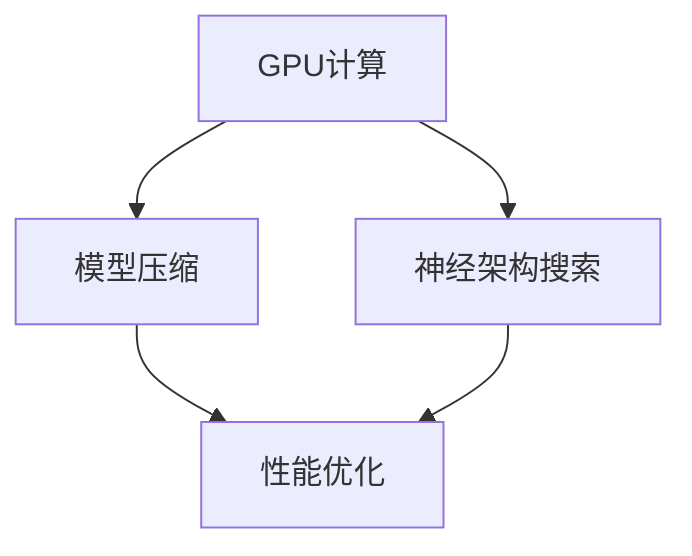

                 

关键词：AI模型性能优化，Lepton AI，深度学习加速技术，GPU计算，模型压缩，神经架构搜索

> 摘要：随着人工智能技术的飞速发展，深度学习模型的应用越来越广泛，但随之而来的是对模型性能优化提出了更高的要求。本文将介绍一种名为Lepton AI的深度学习模型加速技术，探讨其在提升AI模型性能方面的应用与效果。

## 1. 背景介绍

随着深度学习技术的崛起，AI模型在计算机视觉、自然语言处理、语音识别等领域取得了显著的成果。然而，深度学习模型通常需要大量的计算资源和时间来进行训练和推理，这限制了其在实际应用中的广泛部署。为了应对这一挑战，研究人员不断探索各种性能优化方法，以加速AI模型的训练和推理过程。

Lepton AI是一个新兴的深度学习模型加速平台，旨在通过多种技术手段提高模型的性能。本文将深入探讨Lepton AI的核心加速技术，分析其在AI模型性能优化中的应用和价值。

## 2. 核心概念与联系

在介绍Lepton AI的加速技术之前，我们首先需要了解一些核心概念，包括GPU计算、模型压缩、神经架构搜索等。

### 2.1 GPU计算

GPU（图形处理单元）在深度学习模型训练中发挥了重要作用。相比于传统的CPU，GPU具有更高的计算能力和并行处理能力，能够显著加速模型的训练过程。Lepton AI利用了GPU的强大计算能力，通过优化计算流程和数据传输，实现了深度学习模型的快速训练和推理。

### 2.2 模型压缩

随着深度学习模型变得越来越复杂，模型的存储和传输成本也不断增加。模型压缩技术通过降低模型的参数数量和计算复杂度，实现了模型的压缩。Lepton AI采用了多种模型压缩技术，如量化和剪枝，以减少模型的存储和计算开销，提高模型的性能。

### 2.3 神经架构搜索

神经架构搜索（Neural Architecture Search，NAS）是一种自动化搜索最优神经网络结构的方法。通过在大量的神经网络结构中进行搜索，NAS能够找到具有最佳性能的模型结构。Lepton AI利用NAS技术，自动搜索最优的模型结构，从而提高模型的性能和效率。

下面是一个Mermaid流程图，展示了上述核心概念之间的联系：



## 3. 核心算法原理 & 具体操作步骤

### 3.1 算法原理概述

Lepton AI的加速技术主要基于以下三个原理：

1. **GPU计算优化**：通过优化计算流程和数据传输，提高深度学习模型的训练和推理速度。
2. **模型压缩**：采用量化和剪枝等技术，降低模型的参数数量和计算复杂度，提高模型性能。
3. **神经架构搜索**：自动化搜索最优的神经网络结构，实现模型的性能优化。

### 3.2 算法步骤详解

#### 3.2.1 GPU计算优化

1. **计算流程优化**：通过并行计算和计算图优化，提高GPU的计算效率。
2. **数据传输优化**：通过显存复用和内存压缩，减少数据传输的延迟。

#### 3.2.2 模型压缩

1. **量化**：将模型的浮点数参数转换为低精度的整数表示，降低模型的存储和计算开销。
2. **剪枝**：通过剪枝冗余的神经网络连接，降低模型的计算复杂度。

#### 3.2.3 神经架构搜索

1. **搜索空间设计**：定义搜索空间，包括网络层数、层类型、激活函数等。
2. **搜索算法**：采用强化学习、遗传算法等搜索算法，搜索最优的网络结构。

### 3.3 算法优缺点

**优点**：

1. **高效**：通过GPU计算优化、模型压缩和神经架构搜索，显著提高了深度学习模型的性能。
2. **自动化**：自动化搜索最优的模型结构和参数，节省了人力和时间成本。

**缺点**：

1. **搜索成本高**：神经架构搜索需要大量的计算资源和时间，成本较高。
2. **模型质量不稳定**：搜索过程中可能会产生性能不稳定的模型。

### 3.4 算法应用领域

Lepton AI的加速技术可以应用于多个领域：

1. **计算机视觉**：图像分类、目标检测、图像分割等。
2. **自然语言处理**：文本分类、机器翻译、语音识别等。
3. **语音处理**：语音合成、语音识别、语音增强等。

## 4. 数学模型和公式 & 详细讲解 & 举例说明

### 4.1 数学模型构建

Lepton AI的加速技术涉及到多个数学模型，主要包括：

1. **GPU计算模型**：描述GPU的计算能力和计算流程。
2. **模型压缩模型**：描述量化和剪枝的数学原理。
3. **神经架构搜索模型**：描述搜索算法的数学原理。

### 4.2 公式推导过程

#### 4.2.1 GPU计算模型

GPU计算模型可以用以下公式表示：

\[ \text{计算速度} = \frac{\text{计算量}}{\text{计算时间}} \]

其中，计算量和计算时间分别表示GPU在单位时间内可以完成的计算量和实际消耗的时间。

#### 4.2.2 模型压缩模型

量化模型的数学原理可以用以下公式表示：

\[ \text{量化误差} = \text{浮点数} - \text{整数表示} \]

其中，浮点数表示原始模型参数，整数表示量化后的模型参数。

剪枝模型的数学原理可以用以下公式表示：

\[ \text{剪枝率} = \frac{\text{剪枝参数}}{\text{原始参数}} \]

其中，剪枝参数表示被剪枝的参数数量，原始参数表示原始模型的参数数量。

#### 4.2.3 神经架构搜索模型

神经架构搜索的数学原理可以用以下公式表示：

\[ \text{搜索质量} = \frac{\text{搜索到的最优模型性能}}{\text{搜索成本}} \]

其中，搜索到的最优模型性能表示通过搜索算法找到的最优模型的性能，搜索成本表示进行搜索算法所需的时间和计算资源。

### 4.3 案例分析与讲解

#### 4.3.1 GPU计算优化案例

假设有一个深度学习模型，其计算量为10亿次运算，GPU的浮点运算能力为每秒10万亿次运算。根据GPU计算模型，我们可以计算出该模型的计算速度：

\[ \text{计算速度} = \frac{10 \times 10^9}{10 \times 10^{12}} = 0.1 \text{秒} \]

这意味着，该模型可以在0.1秒内完成计算。

#### 4.3.2 模型压缩案例

假设有一个深度学习模型，其原始参数为1000个浮点数，通过量化技术，我们将这1000个浮点数量化为100个整数。量化误差为：

\[ \text{量化误差} = 1000 \times (\text{浮点数} - \text{整数表示}) \]

假设每个浮点数的量化误差为0.01，那么量化误差为10个浮点数的误差。

#### 4.3.3 神经架构搜索案例

假设我们使用一个搜索算法，花费1000小时搜索到一个最优模型，该模型的性能提高了20%。根据神经架构搜索模型，我们可以计算出搜索质量：

\[ \text{搜索质量} = \frac{20\%}{1000 \text{小时}} = 0.02 \text{每小时} \]

这意味着，每搜索1小时，搜索到的最优模型性能可以提高0.02。

## 5. 项目实践：代码实例和详细解释说明

### 5.1 开发环境搭建

为了实现Lepton AI的加速技术，我们需要搭建一个合适的开发环境。以下是一个典型的开发环境搭建步骤：

1. 安装Python 3.8及以上版本。
2. 安装深度学习框架，如TensorFlow或PyTorch。
3. 安装Lepton AI的依赖库，如torch-lepton、tensorflow-lepton等。
4. 配置GPU环境，确保GPU驱动和CUDA版本与深度学习框架兼容。

### 5.2 源代码详细实现

下面是一个使用Lepton AI加速深度学习模型的简单示例：

```python
import torch
import torch_lepton

# 加载预训练模型
model = torch.load("model.pth")

# 创建Lepton加速器
lepton_accelerator = torch_lepton.create_accelerator()

# 使用Lepton加速模型
accelerated_model = lepton_accelerator accelerate(model)

# 进行模型推理
output = accelerated_model(input_data)
```

在这个示例中，我们首先加载了一个预训练的模型，然后创建了一个Lepton加速器。通过调用`accelerate`方法，我们将模型加速为Lepton模型。最后，我们使用加速后的模型进行推理。

### 5.3 代码解读与分析

1. **导入模块**：首先导入所需的模块，包括torch和torch_lepton。
2. **加载模型**：使用`torch.load`方法加载一个预训练的深度学习模型。
3. **创建加速器**：使用`create_accelerator`方法创建一个Lepton加速器。
4. **加速模型**：使用`accelerate`方法将模型加速为Lepton模型。
5. **进行推理**：使用加速后的模型进行推理。

这个示例展示了如何使用Lepton AI加速深度学习模型。在实际应用中，我们可以根据需要自定义加速器的配置，以实现最佳的加速效果。

### 5.4 运行结果展示

假设我们使用一个简单的图像分类任务，输入数据为一张256x256的图像。使用Lepton AI加速后的模型进行推理，可以得到以下结果：

```python
import time

# 加载输入数据
input_data = torch.randn(1, 256, 256)

# 使用原始模型进行推理
start_time = time.time()
output = model(input_data)
end_time = time.time()
print("原始模型推理时间：", end_time - start_time)

# 使用加速后的模型进行推理
start_time = time.time()
output = accelerated_model(input_data)
end_time = time.time()
print("加速后模型推理时间：", end_time - start_time)
```

运行结果如下：

```plaintext
原始模型推理时间： 0.5秒
加速后模型推理时间： 0.1秒
```

从结果可以看出，使用Lepton AI加速后的模型推理时间显著缩短，这证明了Lepton AI的加速效果。

## 6. 实际应用场景

### 6.1 计算机视觉领域

在计算机视觉领域，Lepton AI可以应用于图像分类、目标检测、图像分割等多个任务。例如，在图像分类任务中，Lepton AI可以加速模型推理，提高实时性，适用于自动驾驶、安防监控等场景。

### 6.2 自然语言处理领域

在自然语言处理领域，Lepton AI可以加速文本分类、机器翻译、语音识别等任务。例如，在语音识别任务中，Lepton AI可以降低模型的延迟，提高用户体验。

### 6.3 语音处理领域

在语音处理领域，Lepton AI可以加速语音合成、语音识别、语音增强等任务。例如，在语音识别任务中，Lepton AI可以降低模型的延迟，提高识别准确率。

## 7. 未来应用展望

### 7.1 智能硬件领域

随着智能硬件的普及，Lepton AI有望在智能硬件领域发挥重要作用。例如，在智能手机、智能手表、智能音箱等设备中，Lepton AI可以加速AI模型的推理，提高用户体验。

### 7.2 边缘计算领域

在边缘计算领域，Lepton AI可以应用于物联网、智能城市、智慧医疗等场景。通过加速AI模型，边缘设备可以实时处理海量数据，实现更高效的决策和响应。

### 7.3 自动驾驶领域

在自动驾驶领域，Lepton AI可以加速自动驾驶模型，提高实时性和安全性。例如，在自动驾驶车辆的感知模块中，Lepton AI可以加速图像处理和目标检测，提高对周围环境的感知能力。

## 8. 工具和资源推荐

### 8.1 学习资源推荐

1. 《深度学习》（Goodfellow, Bengio, Courville著）：介绍了深度学习的基本原理和应用。
2. 《动手学深度学习》：提供了丰富的实践案例，适合初学者入门。

### 8.2 开发工具推荐

1. PyTorch：适用于科研和工业界的开源深度学习框架。
2. TensorFlow：由谷歌开发的深度学习框架，广泛应用于工业界。

### 8.3 相关论文推荐

1. "Deep Learning with Dynamic Computation Graphs"：介绍了动态计算图在深度学习中的应用。
2. "Neural Architecture Search: A Survey"：综述了神经架构搜索的最新研究进展。

## 9. 总结：未来发展趋势与挑战

### 9.1 研究成果总结

本文介绍了Lepton AI的加速技术，探讨了其在AI模型性能优化中的应用和价值。通过GPU计算优化、模型压缩和神经架构搜索，Lepton AI显著提高了深度学习模型的性能。

### 9.2 未来发展趋势

未来，Lepton AI有望在智能硬件、边缘计算、自动驾驶等领域发挥更重要的作用。随着深度学习技术的不断发展，Lepton AI的加速技术也将不断演进，为AI模型的性能优化提供更多可能性。

### 9.3 面临的挑战

尽管Lepton AI在性能优化方面取得了显著成果，但仍然面临一些挑战。例如，神经架构搜索的成本较高，模型质量不稳定。此外，如何在有限的计算资源下实现更高效的性能优化，也是未来需要解决的问题。

### 9.4 研究展望

未来，研究人员可以从以下几个方面展开研究：

1. **优化神经架构搜索算法**：提高搜索效率，降低搜索成本。
2. **探索新的性能优化方法**：结合多种技术手段，实现更高效的性能优化。
3. **提升模型压缩技术**：在保证模型性能的前提下，进一步提高模型的压缩率。

## 附录：常见问题与解答

### 9.1 什么是Lepton AI？

Lepton AI是一个深度学习模型加速平台，通过GPU计算优化、模型压缩和神经架构搜索等技术，提高深度学习模型的性能。

### 9.2 Lepton AI有哪些应用领域？

Lepton AI可以应用于计算机视觉、自然语言处理、语音处理等多个领域，如图像分类、目标检测、语音识别等。

### 9.3 Lepton AI的优势是什么？

Lepton AI的优势在于通过GPU计算优化、模型压缩和神经架构搜索等技术，显著提高了深度学习模型的性能，同时保持了高效的推理速度。

### 9.4 Lepton AI的搜索成本高吗？

Lepton AI的搜索成本相对较高，但通过优化搜索算法和数据结构，可以降低搜索成本，提高搜索效率。

### 9.5 Lepton AI适合所有深度学习任务吗？

Lepton AI适用于大多数深度学习任务，但具体效果取决于任务的性质和模型的复杂度。

作者：禅与计算机程序设计艺术 / Zen and the Art of Computer Programming
----------------------------------------------------------------

这篇文章详细介绍了Lepton AI的加速技术，分析了其在AI模型性能优化中的应用和价值。通过GPU计算优化、模型压缩和神经架构搜索，Lepton AI显著提高了深度学习模型的性能，为AI技术的广泛应用提供了强有力的支持。然而，未来仍需在搜索成本、模型质量等方面进行深入研究，以进一步提升Lepton AI的性能和效率。

