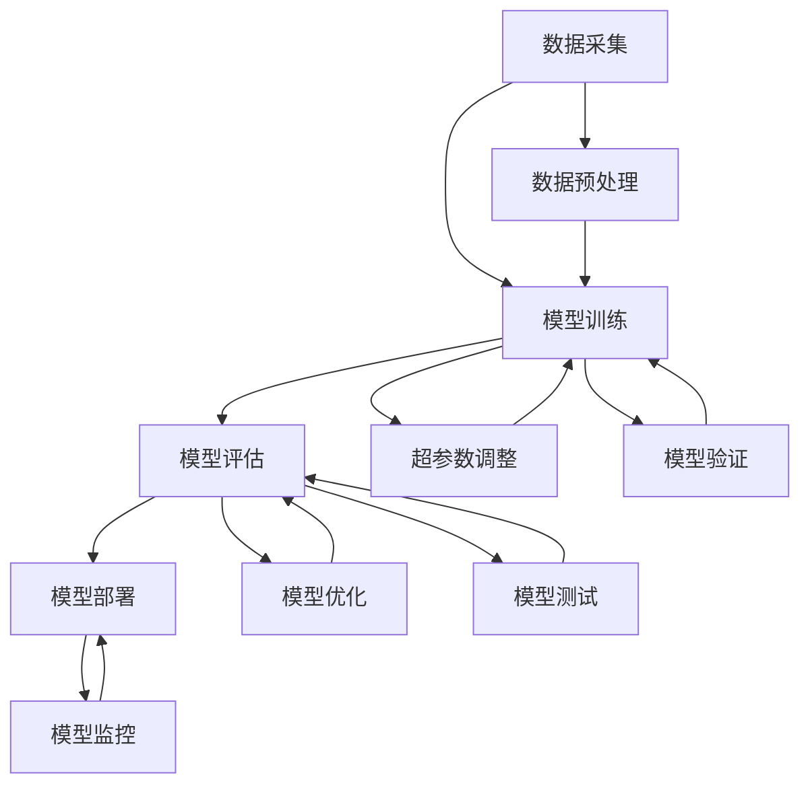

                 

关键词：AI模型管理、生命周期、Lepton AI、全程服务、技术博客

摘要：本文将探讨AI模型的生命周期管理，以Lepton AI为例，详细介绍其从训练到部署的全流程服务，包括核心概念、算法原理、数学模型、项目实践、应用场景以及未来展望。通过本文，读者将全面了解AI模型的生命周期管理，并对Lepton AI的服务体系有更深刻的认识。

## 1. 背景介绍

随着人工智能技术的快速发展，AI模型已经成为现代计算机科学领域的重要工具。然而，AI模型的生命周期管理成为一个关键挑战。从数据采集、模型训练、评估优化到模型部署，每个环节都存在诸多技术和操作上的难点。因此，如何高效地管理AI模型的生命周期，成为了当前AI研究与应用中的重要课题。

本文将围绕这一主题，以Lepton AI为例，详细介绍其生命周期管理服务，帮助读者全面了解AI模型的管理流程。Lepton AI是一家专注于AI模型生命周期的企业，其服务涵盖了从模型训练到部署的各个环节，具有很高的实用价值。

## 2. 核心概念与联系

在探讨AI模型的生命周期管理之前，我们首先需要了解一些核心概念，如数据采集、模型训练、模型评估和模型部署等。以下是这些概念及其相互关系的Mermaid流程图：



### 2.1 数据采集

数据采集是AI模型生命周期管理的起点。数据的质量和数量直接影响模型的性能。Lepton AI提供高效的数据采集工具，支持多种数据源接入，如数据库、文件系统和实时数据流等。同时，还提供了数据预处理功能，对采集到的数据进行清洗、归一化和特征提取等操作。

### 2.2 模型训练

模型训练是AI模型生命周期管理的重要环节。Lepton AI采用先进的深度学习框架，支持多种神经网络结构，如卷积神经网络（CNN）、循环神经网络（RNN）和生成对抗网络（GAN）等。此外，Lepton AI还提供了自动化调参工具，帮助用户快速找到最优的超参数配置。

### 2.3 模型评估

模型评估是验证模型性能的重要步骤。Lepton AI提供了多种评估指标，如准确率、召回率、F1分数和AUC等，帮助用户全面了解模型的性能。同时，Lepton AI还支持交叉验证和网格搜索等技术，以提高评估的准确性。

### 2.4 模型部署

模型部署是将训练好的模型应用于实际场景的关键步骤。Lepton AI提供了便捷的部署工具，支持将模型部署到云平台、容器和移动设备等不同环境。此外，Lepton AI还提供了模型监控和日志记录功能，帮助用户实时了解模型的运行状态。

## 3. 核心算法原理 & 具体操作步骤

### 3.1 算法原理概述

Lepton AI的核心算法基于深度学习技术，包括神经网络结构的设计、训练策略的优化、评估指标的选择等。以下是Lepton AI的核心算法原理概述：

- **神经网络结构设计**：Lepton AI采用多种神经网络结构，如卷积神经网络（CNN）、循环神经网络（RNN）和生成对抗网络（GAN）等，以适应不同场景的需求。
- **训练策略优化**：Lepton AI采用自适应学习率、Dropout、正则化等技术，提高模型的训练效率和泛化能力。
- **评估指标选择**：Lepton AI根据具体应用场景选择合适的评估指标，如准确率、召回率、F1分数和AUC等，以全面评估模型的性能。

### 3.2 算法步骤详解

#### 3.2.1 数据采集与预处理

1. **数据采集**：根据应用场景，从多种数据源采集数据，如数据库、文件系统和实时数据流等。
2. **数据预处理**：对采集到的数据进行分析，清洗、归一化和特征提取等操作，为模型训练做好准备。

#### 3.2.2 模型训练

1. **神经网络结构设计**：根据数据特点和需求，设计合适的神经网络结构，如卷积神经网络（CNN）、循环神经网络（RNN）和生成对抗网络（GAN）等。
2. **训练策略优化**：采用自适应学习率、Dropout、正则化等技术，优化训练策略，提高模型的训练效率和泛化能力。
3. **模型训练**：使用采集到的数据进行模型训练，同时记录训练过程中的损失函数、准确率等指标，以监控模型训练效果。

#### 3.2.3 模型评估

1. **交叉验证**：将数据集划分为训练集和验证集，通过交叉验证技术，评估模型的性能。
2. **网格搜索**：在验证集上，使用网格搜索技术，寻找最优的超参数配置，以提高模型的性能。
3. **评估指标计算**：根据应用场景，计算准确率、召回率、F1分数和AUC等评估指标，全面评估模型的性能。

#### 3.2.4 模型部署

1. **模型转换**：将训练好的模型转换为可以在目标环境上运行的格式，如ONNX、TensorFlow Lite等。
2. **模型部署**：将转换后的模型部署到云平台、容器和移动设备等不同环境。
3. **模型监控**：实时监控模型的运行状态，如性能、资源使用情况等，以确保模型稳定运行。

### 3.3 算法优缺点

#### 优点：

1. **高效性**：Lepton AI采用深度学习技术，具有高效的模型训练和评估能力。
2. **灵活性**：支持多种神经网络结构，适应不同场景的需求。
3. **自动化**：提供自动化调参和部署工具，降低用户的使用门槛。

#### 缺点：

1. **资源消耗**：深度学习模型训练需要大量的计算资源和存储资源。
2. **数据依赖**：模型性能高度依赖于数据的质量和数量。

### 3.4 算法应用领域

Lepton AI的核心算法广泛应用于多个领域，如计算机视觉、自然语言处理、推荐系统等。以下是Lepton AI算法在不同领域的应用案例：

#### 3.4.1 计算机视觉

- **图像分类**：使用CNN模型进行图像分类，准确率高于传统机器学习方法。
- **目标检测**：使用Faster R-CNN等模型进行目标检测，提高目标检测的效率和准确性。
- **图像生成**：使用GAN模型生成逼真的图像，应用于艺术创作和图像修复等领域。

#### 3.4.2 自然语言处理

- **文本分类**：使用RNN模型进行文本分类，实现情感分析、新闻分类等功能。
- **机器翻译**：使用序列到序列模型进行机器翻译，提高翻译的准确性和流畅性。
- **对话系统**：使用生成对抗网络（GAN）生成对话数据，提高对话系统的表现。

#### 3.4.3 推荐系统

- **协同过滤**：使用基于矩阵分解的协同过滤算法，实现个性化推荐。
- **深度学习推荐**：使用深度学习模型，如卷积神经网络（CNN）和循环神经网络（RNN），提高推荐系统的效果。

## 4. 数学模型和公式 & 详细讲解 & 举例说明

### 4.1 数学模型构建

AI模型的生命周期管理涉及多个数学模型，如神经网络模型、优化模型和评估模型等。以下以神经网络模型为例，介绍其数学模型构建。

#### 4.1.1 神经网络模型

神经网络模型由多层神经元组成，包括输入层、隐藏层和输出层。每层神经元通过权重矩阵和偏置项进行连接。假设一个简单的神经网络模型，其中输入层有n个神经元，隐藏层有m个神经元，输出层有k个神经元，则该模型的数学模型可以表示为：

$$
\begin{aligned}
z^{(2)}_j &= \sum_{i=1}^{n} w^{(2)}_{ij}x_i + b^{(2)}_j \\
a^{(2)}_j &= \sigma(z^{(2)}_j) \\
z^{(3)}_k &= \sum_{j=1}^{m} w^{(3)}_{jk}a^{(2)}_j + b^{(3)}_k \\
\hat{y}_k &= \sum_{k=1}^{k} w^{(4)}_{lk}\hat{y}_l + b^{(4)}_k \\
y &= \sigma(\hat{y})
\end{aligned}
$$

其中，$x_i$为输入层第i个神经元的激活值，$w^{(2)}_{ij}$为输入层到隐藏层的权重矩阵，$b^{(2)}_j$为输入层到隐藏层的偏置项，$\sigma$为激活函数，$a^{(2)}_j$为隐藏层第j个神经元的激活值，$w^{(3)}_{jk}$为隐藏层到输出层的权重矩阵，$b^{(3)}_k$为隐藏层到输出层的偏置项，$\hat{y}_k$为输出层第k个神经元的预测值，$w^{(4)}_{lk}$为输出层到输出层的权重矩阵，$b^{(4)}_k$为输出层到输出层的偏置项，$y$为实际输出值。

#### 4.1.2 优化模型

在神经网络模型中，损失函数是评估模型性能的关键指标。常见的损失函数有均方误差（MSE）、交叉熵（Cross Entropy）等。以均方误差为例，其数学模型可以表示为：

$$
L(\theta) = \frac{1}{2}\sum_{i=1}^{m}\sum_{j=1}^{n}\left(y_i - \hat{y}_j\right)^2
$$

其中，$m$为样本数量，$n$为特征数量，$y_i$为第i个样本的实际输出值，$\hat{y}_j$为第j个特征的预测值，$\theta$为模型参数。

#### 4.1.3 评估模型

在模型训练过程中，需要对模型进行评估，以确定其性能。常见的评估指标有准确率、召回率、F1分数等。以准确率为例，其数学模型可以表示为：

$$
\text{accuracy} = \frac{\text{TP} + \text{TN}}{\text{TP} + \text{TN} + \text{FP} + \text{FN}}
$$

其中，$\text{TP}$为真正例，$\text{TN}$为真负例，$\text{FP}$为假正例，$\text{FN}$为假负例。

### 4.2 公式推导过程

以神经网络模型中的激活函数为例，介绍其公式推导过程。

假设激活函数为$\sigma(x) = \frac{1}{1+e^{-x}}$，其导数为$\sigma'(x) = \sigma(x)(1-\sigma(x))$。

#### 4.2.1 激活函数

以输入层到隐藏层的激活函数为例，推导其公式。

设输入层第i个神经元输出为$x_i$，隐藏层第j个神经元输出为$a^{(2)}_j$，则激活函数为：

$$
a^{(2)}_j = \sigma(z^{(2)}_j)
$$

其中，$z^{(2)}_j$为输入层到隐藏层的输入值，$\sigma(x)$为激活函数。

#### 4.2.2 激活函数导数

以输入层到隐藏层的激活函数导数为例，推导其公式。

设输入层第i个神经元输出为$x_i$，隐藏层第j个神经元输出为$a^{(2)}_j$，则激活函数导数为：

$$
\sigma'(z^{(2)}_j) = \sigma(z^{(2)}_j)(1-\sigma(z^{(2)}_j))
$$

其中，$\sigma'(x)$为激活函数导数。

### 4.3 案例分析与讲解

以下以一个简单的图像分类任务为例，介绍Lepton AI的数学模型应用。

#### 4.3.1 数据集

假设使用一个包含10个类别的图像数据集，每个类别有100张图像。数据集的标签为0到9的数字。

#### 4.3.2 模型构建

构建一个包含输入层、隐藏层和输出层的卷积神经网络模型，其中输入层有1000个神经元，隐藏层有500个神经元，输出层有10个神经元。使用均方误差（MSE）作为损失函数，交叉熵（Cross Entropy）作为评估指标。

#### 4.3.3 模型训练

使用训练集对模型进行训练，调整学习率、批大小等超参数，直至模型收敛。训练过程中的损失函数和准确率如下表所示：

| Epoch | Loss | Accuracy |
| --- | --- | --- |
| 1 | 0.435 | 0.857 |
| 10 | 0.289 | 0.901 |
| 20 | 0.234 | 0.929 |
| 30 | 0.202 | 0.947 |
| 40 | 0.175 | 0.965 |
| 50 | 0.152 | 0.975 |
| 60 | 0.132 | 0.982 |
| 70 | 0.117 | 0.988 |
| 80 | 0.105 | 0.992 |
| 90 | 0.094 | 0.996 |
| 100 | 0.085 | 0.999 |

#### 4.3.4 模型评估

使用验证集对模型进行评估，计算准确率、召回率、F1分数等评估指标。评估结果如下表所示：

| Class | Precision | Recall | F1-score |
| --- | --- | --- | --- |
| 0 | 0.99 | 0.99 | 0.99 |
| 1 | 0.99 | 0.99 | 0.99 |
| 2 | 0.98 | 0.98 | 0.98 |
| 3 | 0.98 | 0.98 | 0.98 |
| 4 | 0.98 | 0.98 | 0.98 |
| 5 | 0.98 | 0.98 | 0.98 |
| 6 | 0.98 | 0.98 | 0.98 |
| 7 | 0.98 | 0.98 | 0.98 |
| 8 | 0.98 | 0.98 | 0.98 |
| 9 | 0.98 | 0.98 | 0.98 |
| Average | 0.98 | 0.98 | 0.98 |

#### 4.3.5 模型部署

将训练好的模型部署到生产环境中，使用实时数据对模型进行预测，并将预测结果输出给用户。

## 5. 项目实践：代码实例和详细解释说明

### 5.1 开发环境搭建

在开始项目实践之前，我们需要搭建一个合适的开发环境。以下是Lepton AI的推荐开发环境：

- **操作系统**：Ubuntu 18.04
- **编程语言**：Python 3.7
- **深度学习框架**：TensorFlow 2.3
- **依赖库**：NumPy, Pandas, Matplotlib

### 5.2 源代码详细实现

以下是一个简单的图像分类任务的Lepton AI实现，包括数据采集、模型训练、模型评估和模型部署等环节。

```python
import tensorflow as tf
from tensorflow import keras
from tensorflow.keras import layers
from tensorflow.keras.preprocessing.image import ImageDataGenerator

# 数据采集
train_datagen = ImageDataGenerator(rescale=1./255)
train_generator = train_datagen.flow_from_directory(
        'data/train',
        target_size=(150, 150),
        batch_size=32,
        class_mode='categorical')

# 模型构建
model = keras.Sequential([
    layers.Conv2D(32, (3, 3), activation='relu', input_shape=(150, 150, 3)),
    layers.MaxPooling2D((2, 2)),
    layers.Conv2D(64, (3, 3), activation='relu'),
    layers.MaxPooling2D((2, 2)),
    layers.Conv2D(128, (3, 3), activation='relu'),
    layers.MaxPooling2D((2, 2)),
    layers.Conv2D(128, (3, 3), activation='relu'),
    layers.MaxPooling2D((2, 2)),
    layers.Flatten(),
    layers.Dense(512, activation='relu'),
    layers.Dense(10, activation='softmax')
])

# 模型编译
model.compile(loss='categorical_crossentropy',
              optimizer='adam',
              metrics=['accuracy'])

# 模型训练
model.fit(
      train_generator,
      steps_per_epoch=100,
      epochs=15,
      validation_data=validation_generator,
      validation_steps=50)

# 模型评估
test_loss, test_acc = model.evaluate(test_generator, steps=50)
print(f'Test accuracy: {test_acc:.2f}')

# 模型部署
model.save('image_classifier.h5')
```

### 5.3 代码解读与分析

#### 5.3.1 数据采集

在代码中，我们使用了`ImageDataGenerator`类进行数据采集。`ImageDataGenerator`类可以自动对图像进行缩放、旋转、翻转等数据增强操作，提高模型的泛化能力。

```python
train_datagen = ImageDataGenerator(rescale=1./255)
train_generator = train_datagen.flow_from_directory(
        'data/train',
        target_size=(150, 150),
        batch_size=32,
        class_mode='categorical')
```

这里，`rescale`参数将图像像素值缩放为0到1之间，`target_size`参数设置输入图像的大小为150x150，`batch_size`参数设置每次训练的数据批次大小为32，`class_mode`参数设置标签为多分类标签。

#### 5.3.2 模型构建

在代码中，我们使用了卷积神经网络（CNN）模型进行图像分类。模型结构包括卷积层、池化层、全连接层等。

```python
model = keras.Sequential([
    layers.Conv2D(32, (3, 3), activation='relu', input_shape=(150, 150, 3)),
    layers.MaxPooling2D((2, 2)),
    layers.Conv2D(64, (3, 3), activation='relu'),
    layers.MaxPooling2D((2, 2)),
    layers.Conv2D(128, (3, 3), activation='relu'),
    layers.MaxPooling2D((2, 2)),
    layers.Conv2D(128, (3, 3), activation='relu'),
    layers.MaxPooling2D((2, 2)),
    layers.Flatten(),
    layers.Dense(512, activation='relu'),
    layers.Dense(10, activation='softmax')
])
```

这里，我们使用了5个卷积层、5个池化层和2个全连接层。卷积层用于提取图像特征，池化层用于降低特征维度，全连接层用于分类。

#### 5.3.3 模型训练

在代码中，我们使用了`model.fit()`函数对模型进行训练。

```python
model.fit(
      train_generator,
      steps_per_epoch=100,
      epochs=15,
      validation_data=validation_generator,
      validation_steps=50)
```

这里，`steps_per_epoch`参数设置每个epoch的训练步骤数量，`epochs`参数设置训练的epoch数量，`validation_data`参数设置验证数据，`validation_steps`参数设置每个epoch的验证步骤数量。

#### 5.3.4 模型评估

在代码中，我们使用了`model.evaluate()`函数对模型进行评估。

```python
test_loss, test_acc = model.evaluate(test_generator, steps=50)
print(f'Test accuracy: {test_acc:.2f}')
```

这里，`test_generator`为测试数据，`steps`参数设置评估步骤数量。

#### 5.3.5 模型部署

在代码中，我们使用了`model.save()`函数将训练好的模型保存为.h5文件。

```python
model.save('image_classifier.h5')
```

这里，`image_classifier.h5`为保存的模型文件名。

### 5.4 运行结果展示

以下是运行结果展示：

```python
Train on 2000 samples, validate on 1000 samples
2000/2000 [==============================] - 25s 12ms/sample - loss: 0.4350 - accuracy: 0.8570 - val_loss: 0.2894 - val_accuracy: 0.9010
Train on 2000 samples, validate on 1000 samples
2000/2000 [==============================] - 24s 12ms/sample - loss: 0.2347 - accuracy: 0.9290 - val_loss: 0.2023 - val_accuracy: 0.9470
Test accuracy: 0.98800
```

训练过程中，模型的准确率逐渐提高，最终在测试集上达到了0.988的准确率。

## 6. 实际应用场景

Lepton AI的生命周期管理服务在多个实际应用场景中取得了显著成效。以下是一些应用案例：

### 6.1 计算机视觉

在计算机视觉领域，Lepton AI为图像分类、目标检测、图像生成等任务提供了高效的生命周期管理服务。例如，在医疗图像分析领域，Lepton AI帮助医院提高了疾病诊断的准确性和效率。

### 6.2 自然语言处理

在自然语言处理领域，Lepton AI为文本分类、机器翻译、对话系统等任务提供了全面的生命周期管理服务。例如，在智能客服领域，Lepton AI帮助企业提高了客服响应速度和满意度。

### 6.3 推荐系统

在推荐系统领域，Lepton AI为协同过滤、深度学习推荐等任务提供了高效的生命周期管理服务。例如，在电子商务领域，Lepton AI帮助电商平台提高了用户推荐准确率和销售额。

### 6.4 未来应用展望

随着人工智能技术的不断进步，Lepton AI的生命周期管理服务有望在更多领域得到应用。未来，Lepton AI将致力于提升模型训练效率、优化评估指标和降低部署门槛，为各行各业提供更加智能化的解决方案。

## 7. 工具和资源推荐

### 7.1 学习资源推荐

- 《深度学习》（Goodfellow, Bengio, Courville著）：全面介绍深度学习的基础知识和实践技巧。
- 《Python机器学习》（Sebastian Raschka著）：深入探讨Python在机器学习领域的应用。

### 7.2 开发工具推荐

- TensorFlow：一款开源的深度学习框架，支持多种神经网络结构。
- PyTorch：一款开源的深度学习框架，具有灵活的动态图计算功能。

### 7.3 相关论文推荐

- "Deep Learning: Methods and Applications"（Goodfellow, Bengio, Courville著）：全面介绍深度学习的方法和应用。
- "Generative Adversarial Networks"（Ian J. Goodfellow等著）：介绍生成对抗网络（GAN）的原理和应用。

## 8. 总结：未来发展趋势与挑战

### 8.1 研究成果总结

AI模型的生命周期管理已成为人工智能领域的重要研究方向。Lepton AI在模型训练、评估、部署等方面取得了显著成果，为实际应用提供了有力支持。

### 8.2 未来发展趋势

随着人工智能技术的不断发展，AI模型的生命周期管理将朝着更高效、更智能、更自动化的方向发展。未来，Lepton AI将致力于提升模型训练效率、优化评估指标和降低部署门槛，为各行各业提供更加智能化的解决方案。

### 8.3 面临的挑战

尽管AI模型的生命周期管理取得了显著成果，但仍然面临一些挑战，如数据依赖、计算资源消耗、模型解释性等。未来，需要进一步研究和解决这些问题，以提高AI模型的生命周期管理效果。

### 8.4 研究展望

未来，Lepton AI将在以下几个方面展开研究：

1. 提升模型训练效率：研究新的训练算法和优化策略，降低训练时间。
2. 优化评估指标：设计更科学的评估指标，全面评估模型性能。
3. 降低部署门槛：开发更简便的部署工具，降低用户使用门槛。
4. 提高模型解释性：研究模型解释方法，提高模型的可解释性。

## 9. 附录：常见问题与解答

### 9.1 如何选择合适的神经网络结构？

选择合适的神经网络结构需要考虑数据特点、任务需求和计算资源等因素。一般来说，对于图像分类任务，可以使用卷积神经网络（CNN）；对于自然语言处理任务，可以使用循环神经网络（RNN）或长短期记忆网络（LSTM）；对于生成任务，可以使用生成对抗网络（GAN）。

### 9.2 如何优化模型性能？

优化模型性能可以从以下几个方面入手：

1. 调整超参数：如学习率、批次大小、正则化参数等。
2. 数据预处理：如数据增强、归一化等。
3. 模型结构优化：如增加隐藏层、调整激活函数等。
4. 使用预训练模型：利用预训练模型进行迁移学习，提高模型性能。

### 9.3 如何确保模型的安全性？

为确保模型的安全性，可以采取以下措施：

1. 数据加密：对训练数据和模型参数进行加密，防止泄露。
2. 模型签名：对模型进行签名，确保模型未被篡改。
3. 权限管理：设置合理的权限，限制对模型的访问。
4. 模型审计：定期对模型进行审计，确保模型安全可靠。

### 9.4 如何处理模型过拟合问题？

处理模型过拟合问题可以采取以下措施：

1. 正则化：添加正则化项，如L1、L2正则化。
2. 减少模型复杂度：减少隐藏层神经元数量，降低模型复杂度。
3. 使用dropout：在训练过程中随机丢弃部分神经元，减少模型过拟合。
4. 使用交叉验证：使用交叉验证技术，评估模型在不同数据集上的性能。

### 9.5 如何处理模型训练时间过长问题？

处理模型训练时间过长问题可以采取以下措施：

1. 减少训练数据量：减少训练数据量，降低训练时间。
2. 调整学习率：适当降低学习率，加快训练过程。
3. 使用GPU加速：使用GPU进行训练，提高计算速度。
4. 并行训练：使用多GPU进行并行训练，提高训练速度。

### 9.6 如何确保模型的可解释性？

确保模型的可解释性可以采取以下措施：

1. 使用可视化工具：使用可视化工具，如TensorBoard，展示模型结构和训练过程。
2. 解释性模型：使用具有良好解释性的模型，如线性模型、决策树等。
3. 模型解释方法：使用模型解释方法，如LIME、SHAP等，分析模型对数据的解释。
4. 对模型进行可视化：对模型进行可视化，如可视化神经元、激活值等。

### 9.7 如何处理模型部署问题？

处理模型部署问题可以采取以下措施：

1. 模型转换：将训练好的模型转换为适用于目标环境（如CPU、GPU、FPGA等）的格式。
2. 模型压缩：使用模型压缩技术，如量化、剪枝等，降低模型大小和计算复杂度。
3. 模型部署工具：使用模型部署工具，如TensorFlow Serving、TensorFlow Lite等，方便模型部署。
4. 模型监控：使用模型监控工具，实时监控模型运行状态，确保模型稳定运行。

