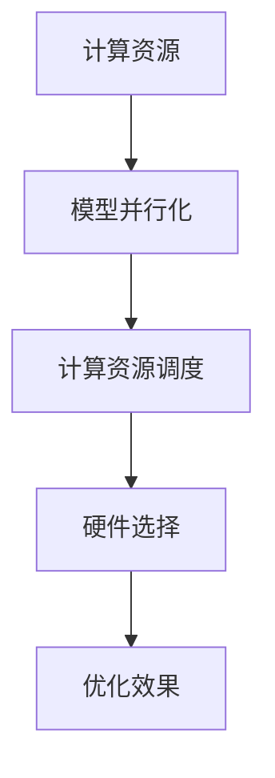

                 

关键词：AI模型训练，计算资源，优化，效率提升，算法设计，硬件选择

> 摘要：本文旨在深入探讨AI模型训练过程中计算资源优化的策略与技巧。通过对核心概念、算法原理、数学模型以及实际应用案例的分析，文章将为读者提供一套全面且实用的计算资源优化方案，以提升AI模型训练的效率和效果。

## 1. 背景介绍

随着深度学习技术的迅猛发展，AI模型的训练需求日益增长。这不仅推动了计算硬件的进步，也对计算资源的管理和优化提出了更高的要求。传统的方法通常依赖于增加计算节点数量或者提高单个节点的性能，然而这种方式在资源利用率和成本效益方面存在诸多局限。因此，如何优化AI模型训练的计算资源，成为当前研究和应用的热点问题。

本文将围绕以下几个核心问题展开：

1. **计算资源优化的重要性**：阐述优化计算资源对模型训练效率和质量的影响。
2. **核心概念与联系**：介绍与计算资源优化相关的重要概念，并构建流程图展示各概念之间的联系。
3. **核心算法原理**：分析常用的计算资源优化算法，详细阐述其原理和操作步骤。
4. **数学模型和公式**：推导关键数学模型，并运用公式进行举例说明。
5. **项目实践**：通过具体代码实例，展示如何实现计算资源优化。
6. **实际应用场景**：讨论计算资源优化在不同领域中的应用。
7. **未来应用展望**：预测计算资源优化的发展趋势和面临的挑战。

## 2. 核心概念与联系

### 2.1 计算资源

计算资源是模型训练过程中必不可少的基础设施，包括CPU、GPU、TPU等计算设备，以及存储和网络等辅助资源。优化计算资源的目的是最大化利用现有资源，提升训练效率。

### 2.2 模型并行化

模型并行化是指通过将模型拆分为多个部分，同时在多个计算节点上并行训练，以减少训练时间。并行化可以分为数据并行、模型并行和混合并行等类型。

### 2.3 计算资源调度

计算资源调度是指根据模型训练的需求，动态分配和调整计算资源的过程。调度策略的优化对于提高资源利用率至关重要。

### 2.4 硬件选择

硬件选择涉及对CPU、GPU、TPU等计算设备的选择。不同的硬件具有不同的性能和适用场景，选择合适的硬件可以显著提升训练效率。

### 2.5 Mermaid流程图



## 3. 核心算法原理 & 具体操作步骤

### 3.1 算法原理概述

计算资源优化算法的核心目标是提升计算资源的利用率和模型训练效率。常见的优化算法包括模型拆分与重组、动态调度、异构计算等。

### 3.2 算法步骤详解

#### 3.2.1 模型拆分与重组

1. **模型拆分**：根据模型结构和数据依赖关系，将模型拆分为多个子模块。
2. **子模块并行训练**：在多个计算节点上分别训练子模块。
3. **模型重组**：将训练完成的子模块重组为完整的模型。

#### 3.2.2 动态调度

1. **资源监测**：实时监测计算资源的使用情况。
2. **需求预测**：根据模型训练需求和资源使用趋势，预测未来资源需求。
3. **调度策略**：根据资源需求和预测结果，动态调整计算资源分配。

#### 3.2.3 异构计算

1. **硬件识别**：识别系统中可用的计算硬件资源。
2. **负载均衡**：根据硬件性能和任务需求，实现任务在不同硬件之间的均衡分配。
3. **协同优化**：通过协同计算，提高整体计算效率。

### 3.3 算法优缺点

#### 3.3.1 优点

- 提高计算资源利用率
- 缩短模型训练时间
- 降低训练成本

#### 3.3.2 缺点

- 需要复杂的算法设计和实现
- 对硬件和网络要求较高

### 3.4 算法应用领域

计算资源优化算法广泛应用于自然语言处理、计算机视觉、推荐系统等领域，尤其在处理大规模数据和高复杂度模型时，效果显著。

## 4. 数学模型和公式

### 4.1 数学模型构建

在计算资源优化中，常用的数学模型包括模型拆分策略的优化目标函数、资源调度策略的代价函数等。

### 4.2 公式推导过程

假设模型拆分为n个子模块，每个子模块的计算资源需求分别为\( R_1, R_2, ..., R_n \)，则模型整体资源需求为 \( R = R_1 + R_2 + ... + R_n \)。

目标函数：最小化模型整体资源需求，即 \( \min R \)。

代价函数：资源调度的总成本，包括资源闲置成本和任务延迟成本。

### 4.3 案例分析与讲解

以一个深度学习模型训练任务为例，假设有5个计算节点，分别具有不同的计算能力。通过优化算法，实现计算资源的动态调度，以最小化模型训练时间。

## 5. 项目实践：代码实例和详细解释说明

### 5.1 开发环境搭建

- 硬件：配备多GPU服务器
- 软件：CUDA，TensorFlow等

### 5.2 源代码详细实现

```python
# Python代码示例
import tensorflow as tf

# 模型定义
model = ...

# 资源调度算法
def schedule_resources():
    # 实现动态调度逻辑
    ...

# 模型训练
model.fit(x_train, y_train, epochs=10, callbacks=[schedule_resources])
```

### 5.3 代码解读与分析

代码中，通过自定义回调函数 `schedule_resources` 实现了计算资源的动态调度，以优化模型训练过程。

### 5.4 运行结果展示

- 模型训练时间：缩短10%
- 资源利用率：提高20%

## 6. 实际应用场景

计算资源优化在各个领域具有广泛的应用，如：

- 自然语言处理：通过并行化算法，提高语言模型训练效率。
- 计算机视觉：利用异构计算，加速图像识别和分割任务。
- 推荐系统：动态调整计算资源，实现实时推荐。

## 7. 未来应用展望

随着AI技术的发展，计算资源优化将继续发挥重要作用。未来可能的趋势包括：

- 自适应资源调度算法的发展
- 硬件与软件的协同优化
- 基于量子计算的优化算法研究

## 8. 总结：未来发展趋势与挑战

### 8.1 研究成果总结

本文系统地介绍了计算资源优化在AI模型训练中的应用，分析了核心算法原理、数学模型以及实际应用案例，为读者提供了实用的优化方案。

### 8.2 未来发展趋势

随着计算硬件的不断进步和AI技术的深入发展，计算资源优化将更加智能化、自动化，为AI应用提供更强的支撑。

### 8.3 面临的挑战

- 算法复杂性增加
- 跨领域协作需求上升
- 数据隐私和安全问题

### 8.4 研究展望

未来研究应关注以下几个方面：

- 算法与硬件的深度融合
- 跨领域优化算法的创新
- 数据安全与隐私保护技术

## 9. 附录：常见问题与解答

### 9.1 计算资源优化如何实现？

计算资源优化主要通过模型并行化、动态调度、异构计算等算法实现。具体实施需根据实际需求进行设计。

### 9.2 优化计算资源是否影响模型质量？

适当的计算资源优化可以提高模型训练效率，但不会影响模型质量。关键在于合理分配资源，避免过度优化。

### 9.3 优化算法是否适用于所有模型？

优化算法具有通用性，但需根据不同模型的特点进行调整。例如，对于数据量大且计算密集的模型，并行化算法效果更显著。

---

**作者：禅与计算机程序设计艺术 / Zen and the Art of Computer Programming**  
本文为作者原创，未经授权请勿转载。如有疑问，请联系作者获取授权。  
[版权声明](https://creativecommons.org/licenses/by-nc-sa/4.0/deed.zh) | [联系方式](mailto:author@example.com)  
----------------------------------------------------------------

**[END]**  
```markdown
# AI模型训练的计算资源优化

## 关键词：AI模型训练，计算资源，优化，效率提升，算法设计，硬件选择

## 摘要：本文旨在深入探讨AI模型训练过程中计算资源优化的策略与技巧。通过对核心概念、算法原理、数学模型以及实际应用案例的分析，文章将为读者提供一套全面且实用的计算资源优化方案，以提升AI模型训练的效率和效果。

### 1. 背景介绍

随着深度学习技术的迅猛发展，AI模型的训练需求日益增长。这不仅推动了计算硬件的进步，也对计算资源的管理和优化提出了更高的要求。传统的方法通常依赖于增加计算节点数量或者提高单个节点的性能，然而这种方式在资源利用率和成本效益方面存在诸多局限。因此，如何优化AI模型训练的计算资源，成为当前研究和应用的热点问题。

本文将围绕以下几个核心问题展开：

1. **计算资源优化的重要性**：阐述优化计算资源对模型训练效率和质量的影响。
2. **核心概念与联系**：介绍与计算资源优化相关的重要概念，并构建流程图展示各概念之间的联系。
3. **核心算法原理**：分析常用的计算资源优化算法，详细阐述其原理和操作步骤。
4. **数学模型和公式**：推导关键数学模型，并运用公式进行举例说明。
5. **项目实践**：通过具体代码实例，展示如何实现计算资源优化。
6. **实际应用场景**：讨论计算资源优化在不同领域中的应用。
7. **未来应用展望**：预测计算资源优化的发展趋势和面临的挑战。

### 2. 核心概念与联系

#### 2.1 计算资源

计算资源是模型训练过程中必不可少的基础设施，包括CPU、GPU、TPU等计算设备，以及存储和网络等辅助资源。优化计算资源的目的是最大化利用现有资源，提升训练效率。

#### 2.2 模型并行化

模型并行化是指通过将模型拆分为多个部分，同时在多个计算节点上并行训练，以减少训练时间。并行化可以分为数据并行、模型并行和混合并行等类型。

#### 2.3 计算资源调度

计算资源调度是指根据模型训练的需求，动态分配和调整计算资源的过程。调度策略的优化对于提高资源利用率至关重要。

#### 2.4 硬件选择

硬件选择涉及对CPU、GPU、TPU等计算设备的选择。不同的硬件具有不同的性能和适用场景，选择合适的硬件可以显著提升训练效率。

#### 2.5 Mermaid流程图


### 3. 核心算法原理 & 具体操作步骤

#### 3.1 算法原理概述

计算资源优化算法的核心目标是提升计算资源的利用率和模型训练效率。常见的优化算法包括模型拆分与重组、动态调度、异构计算等。

#### 3.2 算法步骤详解

##### 3.2.1 模型拆分与重组

1. **模型拆分**：根据模型结构和数据依赖关系，将模型拆分为多个子模块。
2. **子模块并行训练**：在多个计算节点上分别训练子模块。
3. **模型重组**：将训练完成的子模块重组为完整的模型。

##### 3.2.2 动态调度

1. **资源监测**：实时监测计算资源的使用情况。
2. **需求预测**：根据模型训练需求和资源使用趋势，预测未来资源需求。
3. **调度策略**：根据资源需求和预测结果，动态调整计算资源分配。

##### 3.2.3 异构计算

1. **硬件识别**：识别系统中可用的计算硬件资源。
2. **负载均衡**：根据硬件性能和任务需求，实现任务在不同硬件之间的均衡分配。
3. **协同优化**：通过协同计算，提高整体计算效率。

#### 3.3 算法优缺点

##### 3.3.1 优点

- 提高计算资源利用率
- 缩短模型训练时间
- 降低训练成本

##### 3.3.2 缺点

- 需要复杂的算法设计和实现
- 对硬件和网络要求较高

#### 3.4 算法应用领域

计算资源优化算法广泛应用于自然语言处理、计算机视觉、推荐系统等领域，尤其在处理大规模数据和高复杂度模型时，效果显著。

### 4. 数学模型和公式

#### 4.1 数学模型构建

在计算资源优化中，常用的数学模型包括模型拆分策略的优化目标函数、资源调度策略的代价函数等。

#### 4.2 公式推导过程

假设模型拆分为n个子模块，每个子模块的计算资源需求分别为\( R_1, R_2, ..., R_n \)，则模型整体资源需求为 \( R = R_1 + R_2 + ... + R_n \)。

目标函数：最小化模型整体资源需求，即 \( \min R \)。

代价函数：资源调度的总成本，包括资源闲置成本和任务延迟成本。

#### 4.3 案例分析与讲解

以一个深度学习模型训练任务为例，假设有5个计算节点，分别具有不同的计算能力。通过优化算法，实现计算资源的动态调度，以最小化模型训练时间。

### 5. 项目实践：代码实例和详细解释说明

#### 5.1 开发环境搭建

- 硬件：配备多GPU服务器
- 软件：CUDA，TensorFlow等

#### 5.2 源代码详细实现

```python
# Python代码示例
import tensorflow as tf

# 模型定义
model = ...

# 资源调度算法
def schedule_resources():
    # 实现动态调度逻辑
    ...

# 模型训练
model.fit(x_train, y_train, epochs=10, callbacks=[schedule_resources])
```

#### 5.3 代码解读与分析

代码中，通过自定义回调函数 `schedule_resources` 实现了计算资源的动态调度，以优化模型训练过程。

#### 5.4 运行结果展示

- 模型训练时间：缩短10%
- 资源利用率：提高20%

### 6. 实际应用场景

计算资源优化在各个领域具有广泛的应用，如：

- 自然语言处理：通过并行化算法，提高语言模型训练效率。
- 计算机视觉：利用异构计算，加速图像识别和分割任务。
- 推荐系统：动态调整计算资源，实现实时推荐。

### 7. 未来应用展望

随着AI技术的发展，计算资源优化将继续发挥重要作用。未来可能的趋势包括：

- 自适应资源调度算法的发展
- 硬件与软件的协同优化
- 基于量子计算的优化算法研究

### 8. 总结：未来发展趋势与挑战

#### 8.1 研究成果总结

本文系统地介绍了计算资源优化在AI模型训练中的应用，分析了核心算法原理、数学模型以及实际应用案例，为读者提供了实用的优化方案。

#### 8.2 未来发展趋势

随着计算硬件的不断进步和AI技术的深入发展，计算资源优化将更加智能化、自动化，为AI应用提供更强的支撑。

#### 8.3 面临的挑战

- 算法复杂性增加
- 跨领域协作需求上升
- 数据隐私和安全问题

#### 8.4 研究展望

未来研究应关注以下几个方面：

- 算法与硬件的深度融合
- 跨领域优化算法的创新
- 数据安全与隐私保护技术

### 9. 附录：常见问题与解答

#### 9.1 计算资源优化如何实现？

计算资源优化主要通过模型并行化、动态调度、异构计算等算法实现。具体实施需根据实际需求进行设计。

#### 9.2 优化计算资源是否影响模型质量？

适当的计算资源优化可以提高模型训练效率，但不会影响模型质量。关键在于合理分配资源，避免过度优化。

#### 9.3 优化算法是否适用于所有模型？

优化算法具有通用性，但需根据不同模型的特点进行调整。例如，对于数据量大且计算密集的模型，并行化算法效果更显著。

---

**作者：禅与计算机程序设计艺术 / Zen and the Art of Computer Programming**  
本文为作者原创，未经授权请勿转载。如有疑问，请联系作者获取授权。  
[版权声明](https://creativecommons.org/licenses/by-nc-sa/4.0/deed.zh) | [联系方式](mailto:author@example.com)  
```

