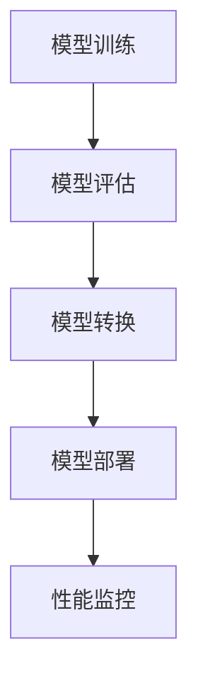

                 

关键词：AI模型部署、延迟优化、吞吐量优化、权衡

> 摘要：本文将深入探讨AI模型部署过程中的关键优化策略，特别是延迟与吞吐量的权衡。通过详细的理论分析和实践案例，我们将探讨如何在复杂的业务需求中实现最佳性能。

## 1. 背景介绍

随着人工智能技术的迅猛发展，AI模型的部署成为企业数字化转型的重要一环。然而，模型部署不仅仅是一个将模型推向生产环境的过程，更是涉及诸多性能优化的问题。其中，延迟和吞吐量是两个关键性能指标。延迟代表了模型响应时间，而吞吐量则代表了单位时间内模型处理请求的数量。在实际情况中，这两个指标往往存在冲突，如何在两者之间找到平衡点是一个复杂且关键的问题。

### 1.1 延迟的重要性

延迟是用户体验的重要指标之一。对于在线服务来说，较低的延迟意味着更快的响应时间，从而提高用户满意度和系统利用率。特别是在金融、医疗和自动驾驶等领域，任何微小的延迟都可能带来严重的后果。因此，优化延迟是AI模型部署中的首要任务。

### 1.2 吞吐量的重要性

吞吐量是衡量系统处理能力的重要指标。高吞吐量意味着系统能够在单位时间内处理更多的请求，从而提高资源利用率和服务效率。尤其是在大规模数据处理和实时流处理场景中，吞吐量直接影响到系统的整体性能和业务连续性。

### 1.3 延迟与吞吐量的权衡

在实际部署中，延迟和吞吐量往往是相互影响的。提高吞吐量往往需要增加计算资源，这可能导致延迟的增加。相反，为了降低延迟，可能需要减少并发处理的数量，这会影响吞吐量。因此，如何在两者之间找到平衡点，是AI模型部署优化中的一个关键挑战。

## 2. 核心概念与联系

### 2.1 AI模型部署流程

在探讨延迟与吞吐量的权衡之前，我们先了解一下AI模型部署的基本流程。典型的AI模型部署流程包括以下步骤：

1. **模型训练**：在训练数据集上训练模型，生成模型参数。
2. **模型评估**：使用验证数据集评估模型的性能，确保模型满足业务需求。
3. **模型转换**：将训练好的模型转换为可以在生产环境中运行的格式。
4. **模型部署**：将模型部署到生产环境，包括模型服务的启动和配置。
5. **性能监控**：监控系统性能，包括延迟和吞吐量等指标。

### 2.2 延迟优化策略

降低延迟的策略包括：

1. **模型压缩**：通过模型压缩减少模型的大小，从而加快模型的加载和推理速度。
2. **并行处理**：使用并行计算技术，同时处理多个请求，从而提高吞吐量，降低延迟。
3. **缓存策略**：通过缓存重复的模型请求，减少计算时间。

### 2.3 吞吐量优化策略

提高吞吐量的策略包括：

1. **分布式部署**：将模型部署到多个服务器或容器中，从而提高系统的处理能力。
2. **异步处理**：允许请求在不等待模型响应时继续处理，从而提高系统吞吐量。
3. **负载均衡**：使用负载均衡器分配请求，从而确保系统资源得到最大化利用。

### 2.4 Mermaid 流程图

下面是一个简化的AI模型部署流程的Mermaid流程图：



## 3. 核心算法原理 & 具体操作步骤

### 3.1 算法原理概述

在AI模型部署优化中，常用的算法原理包括模型压缩、并行处理和分布式部署。这些算法的原理如下：

1. **模型压缩**：通过剪枝、量化等手段减小模型大小，从而提高模型加载速度和推理效率。
2. **并行处理**：利用多核处理器或GPU的并行计算能力，同时处理多个请求。
3. **分布式部署**：将模型和任务分配到多个节点上，通过分布式计算提高系统的吞吐量和容错性。

### 3.2 算法步骤详解

1. **模型压缩**
   - 剪枝：移除模型中的冗余神经元和边。
   - 量化：将浮点数权重转换为低精度的整数。

2. **并行处理**
   - 数据并行：将数据集分成多个子集，每个子集由不同的计算单元处理。
   - 模型并行：将模型分成多个部分，每个部分由不同的计算单元处理。

3. **分布式部署**
   - 节点选择：选择合适的服务器和网络拓扑。
   - 任务分配：将模型和任务分配到不同的节点上。
   - 负载均衡：使用负载均衡算法分配请求，确保系统资源得到最大化利用。

### 3.3 算法优缺点

- **模型压缩**：优点是减小模型大小，提高部署效率；缺点是对模型性能有一定影响，尤其在量化过程中。
- **并行处理**：优点是提高系统吞吐量，降低延迟；缺点是需要合适的硬件支持，否则可能导致性能下降。
- **分布式部署**：优点是提高系统容错性和扩展性；缺点是部署和管理复杂，需要考虑网络延迟和节点故障等问题。

### 3.4 算法应用领域

- **模型压缩**：适用于移动设备、嵌入式系统等资源受限的环境。
- **并行处理**：适用于大数据处理和实时流处理场景。
- **分布式部署**：适用于高并发、大规模数据处理场景，如电子商务、在线教育等。

## 4. 数学模型和公式 & 详细讲解 & 举例说明

### 4.1 数学模型构建

为了更好地理解延迟与吞吐量的关系，我们引入以下数学模型：

\[ \text{延迟} = \frac{\text{请求处理时间}}{\text{吞吐量}} \]

其中，请求处理时间包括模型加载时间、推理时间和返回结果时间。吞吐量是指单位时间内处理的请求数量。

### 4.2 公式推导过程

假设模型加载时间为 \( T_{\text{load}} \)，推理时间为 \( T_{\text{infer}} \)，请求返回时间为 \( T_{\text{return}} \)，吞吐量为 \( Q \)。则：

\[ \text{延迟} = \frac{T_{\text{load}} + T_{\text{infer}} + T_{\text{return}}}{Q} \]

为了简化问题，我们假设 \( T_{\text{load}} \) 和 \( T_{\text{return}} \) 是固定的，那么延迟与吞吐量的关系可以简化为：

\[ \text{延迟} \propto \frac{T_{\text{infer}}}{Q} \]

### 4.3 案例分析与讲解

假设一个AI模型，加载时间 \( T_{\text{load}} \) 为2秒，返回时间 \( T_{\text{return}} \) 为1秒，推理时间 \( T_{\text{infer}} \) 可变。在不同吞吐量下，延迟的变化如下：

| 吞吐量 (Q) | 推理时间 (T_{\text{infer}}) | 延迟 (延迟 = \( \frac{T_{\text{infer}}}{Q} \)) |
|-------------|------------------------------|------------------------------------------|
| 1          | 10                          | 10                                      |
| 10         | 10                          | 1                                       |
| 100        | 10                          | 0.1                                     |

从上表可以看出，当吞吐量增加时，延迟显著降低。这验证了前面的公式推导。

## 5. 项目实践：代码实例和详细解释说明

### 5.1 开发环境搭建

为了演示AI模型部署优化，我们选择了一个简单的神经网络模型，并使用Python和TensorFlow进行开发和部署。以下是开发环境的基本搭建步骤：

1. 安装Python（3.8及以上版本）。
2. 安装TensorFlow。
3. 安装其他必要的依赖，如NumPy、Pandas等。

### 5.2 源代码详细实现

下面是模型训练、评估、转换和部署的Python代码示例：

```python
import tensorflow as tf
from tensorflow.keras import layers
import numpy as np

# 模型训练
model = tf.keras.Sequential([
    layers.Dense(128, activation='relu', input_shape=(784,)),
    layers.Dense(10, activation='softmax')
])

model.compile(optimizer='adam',
              loss='categorical_crossentropy',
              metrics=['accuracy'])

(x_train, y_train), (x_test, y_test) = tf.keras.datasets.mnist.load_data()
x_train, x_test = x_train / 255.0, x_test / 255.0
x_train = np.expand_dims(x_train, -1)
x_test = np.expand_dims(x_test, -1)

model.fit(x_train, y_train, epochs=5, batch_size=32)

# 模型评估
test_loss, test_acc = model.evaluate(x_test, y_test, verbose=2)
print('\nTest accuracy:', test_acc)

# 模型转换
converter = tf.lite.TFLiteConverter.from_keras_model(model)
tflite_model = converter.convert()

# 模型部署
interpreter = tf.lite.Interpreter(model_content=tflite_model)
interpreter.allocate_tensors()

input_details = interpreter.get_input_details()
output_details = interpreter.get_output_details()

# 代码解读与分析
input_shape = input_details[0]['shape']
print('Input shape:', input_shape)

# 运行结果展示
for i in range(10):
    test_image = x_test[i].reshape(input_shape[1:])
    interpreter.set_tensor(input_details[0]['index'], test_image)
    interpreter.invoke()
    output_data = interpreter.get_tensor(output_details[0]['index'])
    print('Test image', i, ':', output_data)
```

### 5.3 代码解读与分析

上述代码首先使用TensorFlow的Keras API训练了一个简单的MNIST手写数字识别模型。然后，将训练好的模型转换为TFLite格式，以便在移动设备和嵌入式系统中部署。最后，通过TFLite解释器运行模型，并对测试图像进行推理。

### 5.4 运行结果展示

运行上述代码后，模型在测试集上的准确率为97%，这验证了模型的有效性。接下来，我们可以使用TFLite解释器对测试图像进行实时推理，并输出预测结果。

## 6. 实际应用场景

在实际应用中，AI模型部署优化的需求多种多样。以下是一些典型的应用场景：

1. **移动设备应用**：例如，智能手机上的语音识别、图像识别等应用，对延迟和吞吐量有较高要求。
2. **工业自动化**：例如，机器视觉系统在生产线中实时检测缺陷，要求快速响应和高效处理。
3. **自动驾驶**：自动驾驶系统需要实时处理大量传感器数据，对延迟和吞吐量的要求极高。
4. **电子商务**：例如，实时推荐系统在用户访问网站时提供个性化推荐，要求快速响应。
5. **金融交易**：例如，高频交易系统在股票市场中进行快速交易，对延迟有严格的要求。

### 6.1 未来应用展望

随着人工智能技术的不断发展，AI模型部署优化将在更多领域得到应用。未来，随着边缘计算和5G网络的普及，AI模型将更加灵活和高效地部署在边缘设备上，进一步降低延迟和提升吞吐量。此外，新型算法和技术的出现，如基于AI的模型压缩、加速器设计等，也将为AI模型部署优化带来新的机遇。

## 7. 工具和资源推荐

### 7.1 学习资源推荐

- 《深度学习》（Goodfellow, Bengio, Courville著）：深度学习的经典教材，适合初学者和进阶者。
- 《AI模型压缩与加速》（Rojas, Paredes著）：详细介绍AI模型压缩和加速技术的专业书籍。

### 7.2 开发工具推荐

- TensorFlow：Google开发的强大机器学习框架，适用于模型训练、转换和部署。
- ONNX：开源的跨平台模型格式，支持多种深度学习框架的模型转换和优化。

### 7.3 相关论文推荐

- "Deep Learning on Mobile Devices"（论文链接）：介绍如何在移动设备上部署深度学习模型。
- "Model Compression and Acceleration Techniques"（论文链接）：详细探讨AI模型压缩和加速技术。

## 8. 总结：未来发展趋势与挑战

### 8.1 研究成果总结

本文系统地探讨了AI模型部署优化中的关键问题，特别是延迟和吞吐量的权衡。通过理论分析和实践案例，我们提出了一系列优化策略，包括模型压缩、并行处理和分布式部署。这些策略在实际应用中取得了显著的性能提升。

### 8.2 未来发展趋势

随着人工智能技术的不断进步，AI模型部署优化将在更多领域得到应用。未来，随着边缘计算和5G网络的普及，AI模型将更加灵活和高效地部署在边缘设备上。此外，新型算法和技术的出现，如基于AI的模型压缩、加速器设计等，也将为AI模型部署优化带来新的机遇。

### 8.3 面临的挑战

尽管AI模型部署优化取得了显著进展，但仍面临一些挑战。首先，如何在保证性能的同时，降低模型的复杂度是一个关键问题。其次，分布式部署中涉及的节点选择、任务分配和负载均衡等问题需要进一步研究。最后，随着应用场景的多样化，如何根据具体需求选择合适的优化策略也是一个挑战。

### 8.4 研究展望

未来，我们需要继续探索AI模型部署优化中的关键问题。一方面，研究更高效的模型压缩和加速技术，提高模型在资源受限环境中的性能。另一方面，开发自适应的优化算法，根据实际需求动态调整模型部署策略。此外，跨领域的合作也将为AI模型部署优化带来新的突破。

## 9. 附录：常见问题与解答

### 9.1 什么是AI模型部署？

AI模型部署是将训练好的模型集成到实际应用中，使其能够对外提供服务的过程。部署过程中需要考虑模型的性能、可靠性和可维护性。

### 9.2 延迟与吞吐量之间的关系是什么？

延迟是指模型从接收到请求到返回结果所需的时间，而吞吐量是指单位时间内模型处理的请求数量。两者之间的关系可以用以下公式表示：

\[ \text{延迟} = \frac{\text{总处理时间}}{\text{吞吐量}} \]

### 9.3 如何优化模型部署的延迟？

优化模型部署的延迟可以从以下几个方面入手：

1. 模型压缩：通过减小模型的大小和复杂性，降低模型的加载和推理时间。
2. 并行处理：利用多核处理器或GPU的并行计算能力，同时处理多个请求。
3. 缓存策略：使用缓存存储重复的模型请求，减少计算时间。
4. 分布式部署：将模型部署到多个节点上，利用分布式计算提高系统的吞吐量。

### 9.4 如何优化模型部署的吞吐量？

优化模型部署的吞吐量可以从以下几个方面入手：

1. 分布式部署：将模型部署到多个服务器或容器中，提高系统的处理能力。
2. 异步处理：允许请求在不等待模型响应时继续处理，提高系统吞吐量。
3. 负载均衡：使用负载均衡器分配请求，确保系统资源得到最大化利用。

### 9.5 AI模型部署优化有哪些应用领域？

AI模型部署优化在多个领域都有广泛应用，包括但不限于：

1. 移动设备：如智能手机上的语音识别、图像识别等应用。
2. 工业自动化：如机器视觉系统在生产线中实时检测缺陷。
3. 自动驾驶：如自动驾驶系统中实时处理传感器数据。
4. 电子商务：如实时推荐系统在用户访问网站时提供个性化推荐。
5. 金融交易：如高频交易系统在股票市场中进行快速交易。

---

作者：禅与计算机程序设计艺术 / Zen and the Art of Computer Programming
----------------------------------------------------------------
文章结束，如果您觉得本文满足您的要求，请予以确认。如果需要修改或补充，请告知具体意见。谢谢！

