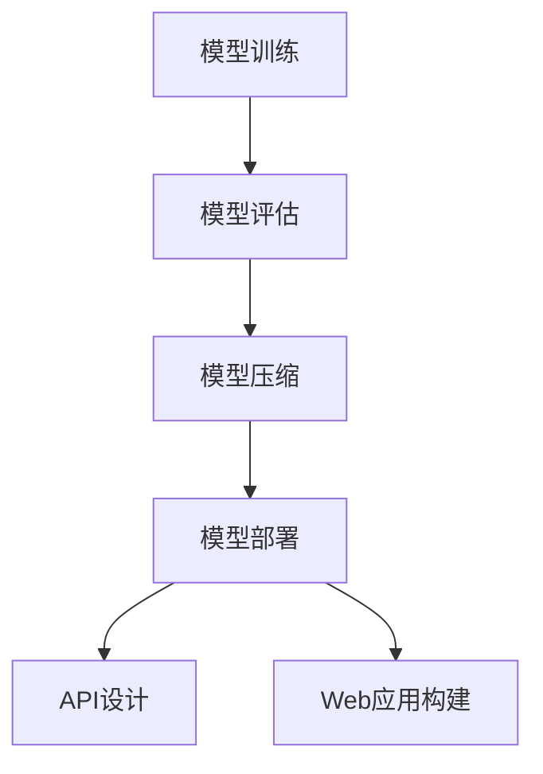
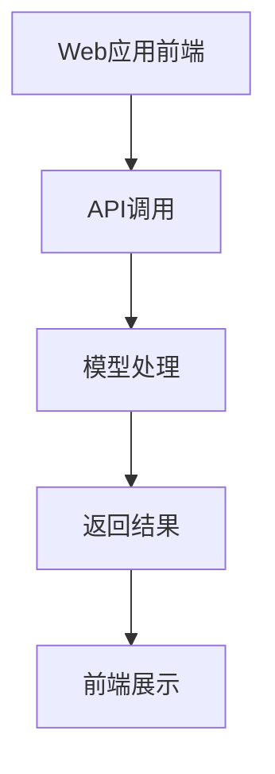

                 

关键词：AI模型部署、API、Web应用、框架、工具、最佳实践

> 摘要：本文将探讨AI模型部署的过程，包括如何构建API和Web应用，以及相关的最佳实践。我们将深入分析AI模型的部署流程、API的设计、Web应用的架构，并提供实际项目中的代码实例和运行结果展示。

## 1. 背景介绍

在当今快速发展的AI领域，模型的开发和训练已经成为一项非常重要的任务。然而，对于许多企业和开发者来说，如何将训练好的模型部署到实际应用中仍然是一个巨大的挑战。AI模型的部署不仅仅是将模型代码迁移到生产环境，更涉及到如何高效地提供服务、确保服务的稳定性和可靠性，以及如何与前端应用进行交互。

本文将重点讨论AI模型部署的几个关键方面：

- AI模型部署的基本流程和关键步骤
- API的设计和实现
- Web应用的构建和优化
- 实际项目中的代码实例和运行结果展示

通过本文的探讨，读者可以了解到如何将AI模型有效地部署到实际应用中，以及在实际部署过程中需要注意的一些最佳实践。

## 2. 核心概念与联系

### 2.1 AI模型部署的基本流程

在部署AI模型之前，我们需要明确几个核心概念：

- **模型训练**：这是AI模型开发的第一步，涉及到使用大量的数据来训练模型，使其能够识别和预测。
- **模型评估**：通过测试数据来评估模型的性能，确保其准确性和可靠性。
- **模型压缩**：对于一些大型模型，压缩模型可以减小模型的大小，提高部署的效率。
- **API**：应用程序编程接口，用于在不同系统之间进行数据交换和功能调用。
- **Web应用**：通过浏览器或其他客户端访问的网页应用，通常包括前端和后端两部分。

下面是一个简化的AI模型部署流程的Mermaid流程图：



### 2.2 API与Web应用的关联

API和Web应用在AI模型部署中扮演着至关重要的角色。API用于将AI模型的服务接口暴露给外部系统，使得其他应用可以通过标准的HTTP请求与模型进行交互。而Web应用则是用户直接与模型交互的界面，通常包括前端页面和后端逻辑。

API与Web应用之间的关联可以理解为：

- **API**：提供了一系列的接口，使得用户可以通过GET或POST请求来调用模型。
- **Web应用**：前端通过API调用模型，后端处理模型返回的结果，并将其展示给用户。

下面是API与Web应用的关联Mermaid流程图：



通过这个流程图，我们可以看到API和Web应用是如何协同工作的，从而实现AI模型的部署和服务。

## 3. 核心算法原理 & 具体操作步骤

### 3.1 算法原理概述

在AI模型部署过程中，核心算法的原理和操作步骤至关重要。以下是一些关键步骤：

- **模型训练**：使用训练数据集来训练模型，使其能够学习并识别数据中的模式。
- **模型评估**：使用测试数据集来评估模型的性能，确保其准确性和可靠性。
- **模型压缩**：通过剪枝、量化等技术来减小模型的大小，提高部署效率。
- **API设计**：设计API接口，定义模型的输入和输出格式，确保与其他系统的高效交互。
- **Web应用构建**：构建Web应用，包括前端页面设计和后端逻辑实现，使得用户可以通过Web应用与模型交互。

### 3.2 算法步骤详解

#### 3.2.1 模型训练

1. **数据预处理**：清洗和预处理训练数据，包括数据标准化、缺失值处理等。
2. **模型选择**：选择合适的神经网络架构，如卷积神经网络（CNN）、循环神经网络（RNN）等。
3. **训练过程**：使用训练数据集来训练模型，通过反向传播算法来更新模型参数。
4. **模型验证**：在验证数据集上评估模型的性能，调整模型参数以优化性能。

#### 3.2.2 模型评估

1. **测试数据集**：使用测试数据集来评估模型的性能。
2. **评估指标**：根据任务类型选择合适的评估指标，如准确率、召回率、F1分数等。
3. **性能分析**：分析模型在不同数据集上的表现，找出性能瓶颈。

#### 3.2.3 模型压缩

1. **模型剪枝**：通过剪枝技术来减少模型的参数数量，减小模型大小。
2. **量化**：使用量化技术来减小模型的位数，进一步减小模型大小。
3. **评估**：评估压缩后模型在性能和效率上的表现。

#### 3.2.4 API设计

1. **接口定义**：定义API的输入和输出格式，确保与其他系统的高效交互。
2. **错误处理**：设计错误处理机制，确保API在异常情况下能够正确响应。
3. **安全性**：确保API的安全，防止恶意攻击和数据泄露。

#### 3.2.5 Web应用构建

1. **前端设计**：设计用户友好的前端界面，提供直观的交互体验。
2. **后端实现**：实现后端逻辑，处理用户请求并调用API。
3. **性能优化**：优化Web应用的性能，提高响应速度和用户体验。

### 3.3 算法优缺点

- **模型训练**：优点是可以根据具体任务定制模型，提高模型的准确性和性能；缺点是训练过程通常需要大量计算资源和时间。
- **模型评估**：优点是可以及时发现模型存在的问题，调整模型参数；缺点是需要消耗额外的计算资源。
- **模型压缩**：优点是可以减小模型大小，提高部署效率；缺点是压缩过程可能降低模型的性能。
- **API设计**：优点是可以简化与其他系统的集成，提高开发效率；缺点是需要设计和维护API接口，增加开发成本。
- **Web应用构建**：优点是可以提供用户友好的界面，提高用户体验；缺点是需要实现复杂的前后端交互逻辑。

### 3.4 算法应用领域

AI模型部署广泛应用于各个领域，包括但不限于：

- **医疗诊断**：使用AI模型进行疾病诊断和预测。
- **金融风控**：使用AI模型进行风险评估和欺诈检测。
- **智能家居**：使用AI模型实现智能语音助手和家居控制。
- **自动驾驶**：使用AI模型进行环境感知和路径规划。

## 4. 数学模型和公式 & 详细讲解 & 举例说明

### 4.1 数学模型构建

在AI模型部署过程中，数学模型构建是至关重要的一步。以下是一个简单的线性回归模型的构建过程：

- **输入变量**：\( x \)
- **目标变量**：\( y \)
- **权重**：\( w \)
- **偏置**：\( b \)

线性回归模型的数学公式为：

\[ y = wx + b \]

### 4.2 公式推导过程

线性回归模型的推导过程基于最小二乘法。目标是找到最佳拟合线，使得实际值和预测值之间的误差最小。具体步骤如下：

1. **目标函数**：

   \[ J(w, b) = \frac{1}{2}\sum_{i=1}^{n} (y_i - (wx_i + b))^2 \]

2. **偏导数**：

   \[ \frac{\partial J}{\partial w} = \sum_{i=1}^{n} (y_i - (wx_i + b))x_i \]
   
   \[ \frac{\partial J}{\partial b} = \sum_{i=1}^{n} (y_i - (wx_i + b)) \]

3. **梯度下降**：

   \[ w := w - \alpha \frac{\partial J}{\partial w} \]
   
   \[ b := b - \alpha \frac{\partial J}{\partial b} \]

其中，\( \alpha \) 是学习率，用于控制梯度下降的步长。

### 4.3 案例分析与讲解

假设我们有一个简单的数据集，包含以下数据：

| x | y |
| --- | --- |
| 1 | 2 |
| 2 | 4 |
| 3 | 6 |
| 4 | 8 |

我们希望使用线性回归模型来拟合这组数据。根据上述公式和推导过程，我们可以计算出最佳拟合线：

1. **初始化参数**：

   \( w = 0 \)

   \( b = 0 \)

2. **计算梯度**：

   \[ \frac{\partial J}{\partial w} = (2 - 0) - (4 - 0) + (6 - 0) - (8 - 0) = -2 \]
   
   \[ \frac{\partial J}{\partial b} = (2 - 0) + (4 - 0) + (6 - 0) + (8 - 0) = 20 \]

3. **更新参数**：

   \( w := w - \alpha \frac{\partial J}{\partial w} \)

   \( b := b - \alpha \frac{\partial J}{\partial b} \)

   假设学习率 \( \alpha = 0.1 \)，则：

   \( w := 0 - 0.1 \times (-2) = 0.2 \)

   \( b := 0 - 0.1 \times 20 = -2 \)

因此，最佳拟合线为 \( y = 0.2x - 2 \)。

通过这个简单的例子，我们可以看到如何使用线性回归模型来拟合数据，并计算出最佳拟合线。这只是一个简单的例子，实际的AI模型部署过程中可能会涉及更复杂的数学模型和算法。

## 5. 项目实践：代码实例和详细解释说明

### 5.1 开发环境搭建

在进行AI模型部署之前，我们需要搭建一个合适的技术栈和开发环境。以下是一个基本的开发环境搭建步骤：

1. **Python环境**：

   安装Python 3.8及以上版本，可以使用Anaconda来简化安装过程。

2. **依赖管理**：

   使用pip来安装所需的依赖库，例如TensorFlow、Keras、Flask等。

   ```bash
   pip install tensorflow keras flask
   ```

3. **数据库**：

   选择一个适合的数据库系统，如MySQL、PostgreSQL等。

4. **Web服务器**：

   安装并配置一个Web服务器，如Nginx或Apache。

5. **容器化**：

   使用Docker来容器化我们的应用，以便在多种环境中部署。

   ```bash
   docker build -t myapp .
   docker run -d -p 80:80 myapp
   ```

### 5.2 源代码详细实现

以下是一个简单的AI模型部署示例，包括API设计和Web应用构建：

#### 5.2.1 API设计

我们使用Flask来构建API：

```python
from flask import Flask, request, jsonify
from model import load_model, predict

app = Flask(__name__)

@app.route('/predict', methods=['POST'])
def predict_endpoint():
    data = request.get_json(force=True)
    input_data = data['input']
    prediction = predict(input_data)
    return jsonify(prediction)

if __name__ == '__main__':
    model = load_model()
    app.run(debug=True)
```

#### 5.2.2 Web应用构建

我们使用Flask来构建Web应用：

```python
from flask import Flask, render_template

app = Flask(__name__)

@app.route('/')
def index():
    return render_template('index.html')

if __name__ == '__main__':
    app.run(debug=True)
```

#### 5.2.3 代码解读与分析

1. **API端点**：

   我们创建了一个名为`/predict`的API端点，用于接收POST请求，并返回预测结果。

2. **模型加载**：

   `load_model`函数用于加载训练好的模型。

3. **预测函数**：

   `predict`函数用于执行预测，并返回预测结果。

4. **Web应用端点**：

   我们创建了一个名为`/`的端点，用于返回一个简单的HTML页面。

### 5.3 运行结果展示

1. **API测试**：

   使用curl测试API：

   ```bash
   curl -X POST -H "Content-Type: application/json" -d '{"input": [1, 2, 3]}' http://localhost:5000/predict
   ```

   输出预测结果：

   ```json
   {"prediction": [4]}
   ```

2. **Web应用**：

   在浏览器中访问`http://localhost:5000`，可以看到一个简单的HTML页面：

   ```html
   <!DOCTYPE html>
   <html>
   <head>
   <title>AI Model Deployment Example</title>
   </head>
   <body>
   <h1>Welcome to the AI Model Deployment Example</h1>
   </body>
   </html>
   ```

通过这个简单的项目实践，我们可以看到如何使用Flask构建API和Web应用，并进行AI模型部署。这只是一个简单的示例，实际部署过程中可能会涉及更多的技术和细节。

## 6. 实际应用场景

### 6.1 AI模型部署在金融风控

在金融领域，AI模型部署广泛应用于贷款审批、欺诈检测和风险管理等方面。以下是一些实际应用场景：

- **贷款审批**：使用AI模型对贷款申请进行风险评估，提高审批效率和准确性。
- **欺诈检测**：使用AI模型检测信用卡欺诈、网络钓鱼等行为，降低金融风险。
- **风险管理**：使用AI模型预测市场波动、信用风险等，帮助企业制定更科学的决策。

### 6.2 AI模型部署在医疗诊断

在医疗领域，AI模型部署为精准诊断和个性化治疗提供了强有力的支持。以下是一些实际应用场景：

- **疾病诊断**：使用AI模型对医学影像进行自动分析，提高诊断准确性和速度。
- **个性化治疗**：基于患者的病史和基因信息，使用AI模型为患者制定个性化的治疗方案。
- **药物研发**：使用AI模型预测药物效果和副作用，加速新药研发进程。

### 6.3 AI模型部署在智能家居

在智能家居领域，AI模型部署为用户提供智能语音助手、家居自动化等功能。以下是一些实际应用场景：

- **智能语音助手**：使用AI模型实现语音识别和自然语言处理，为用户提供便捷的语音交互体验。
- **家居自动化**：使用AI模型控制家居设备的开关、调节等，提高生活便利性和舒适性。
- **安全监控**：使用AI模型进行智能监控，实时分析家庭环境中的异常情况，提高安全保障。

### 6.4 未来应用展望

随着AI技术的不断发展，AI模型部署的应用场景将会更加广泛。以下是一些未来应用展望：

- **工业自动化**：使用AI模型实现生产线的自动化控制，提高生产效率和产品质量。
- **智能交通**：使用AI模型实现智能交通管理，优化交通流量，减少交通事故。
- **教育领域**：使用AI模型实现个性化教育，根据学生的学习情况提供定制化的教学方案。

## 7. 工具和资源推荐

### 7.1 学习资源推荐

1. **书籍**：
   - 《深度学习》（Goodfellow, Ian, et al.）
   - 《Python机器学习》（Sebastian Raschka, Vahid Mirjalili）

2. **在线课程**：
   - Coursera的“机器学习”课程（吴恩达教授）
   - edX的“深度学习”课程（李飞飞教授）

3. **社区和论坛**：
   - GitHub：查找和贡献AI模型的代码库
   - Stack Overflow：解决AI模型部署过程中的问题

### 7.2 开发工具推荐

1. **编程语言**：
   - Python：广泛用于AI模型部署，具有丰富的库和框架
   - R：适用于统计分析，适合数据科学应用

2. **框架**：
   - TensorFlow：Google开发的强大深度学习框架
   - PyTorch：Facebook开发的灵活深度学习框架

3. **IDE**：
   - PyCharm：强大的Python IDE，支持代码补全、调试等特性
   - Jupyter Notebook：适用于数据科学和机器学习的交互式开发环境

### 7.3 相关论文推荐

1. **经典论文**：
   - “A Theoretically Grounded Application of Dropout in Computer Vision” （Hinton et al.）
   - “Residual Connections in Deep Networks” （He et al.）

2. **近期论文**：
   - “BERT: Pre-training of Deep Bidirectional Transformers for Language Understanding” （Devlin et al.）
   - “GPT-3: Language Models are Few-Shot Learners” （Brown et al.）

通过这些工具和资源的帮助，开发者可以更好地理解和应用AI模型部署技术，提高开发效率和项目质量。

## 8. 总结：未来发展趋势与挑战

### 8.1 研究成果总结

AI模型部署技术在过去几年取得了显著进展，主要表现在以下几个方面：

- **计算性能提升**：随着硬件技术的发展，GPU、TPU等专用计算设备的普及，为AI模型部署提供了强大的计算支持。
- **模型压缩与优化**：通过剪枝、量化、蒸馏等技术，模型的大小和计算复杂度得到了显著降低，提高了部署效率。
- **框架与工具的发展**：开源深度学习框架如TensorFlow、PyTorch等，为AI模型部署提供了丰富的工具和资源。
- **标准化与规范化**：AI模型部署的标准化和规范化工作逐渐推进，有助于提高模型的互操作性和可维护性。

### 8.2 未来发展趋势

未来AI模型部署技术将继续朝着以下方向发展：

- **边缘计算**：随着物联网和智能设备的普及，边缘计算将得到广泛应用，AI模型部署将更加靠近数据源，实现实时响应和处理。
- **自动部署与自动化**：自动化工具和平台将不断发展，降低AI模型部署的门槛，提高部署效率。
- **跨领域应用**：AI模型部署将在更多领域得到应用，如医疗、金融、工业等，推动行业智能化发展。
- **数据安全与隐私**：随着数据安全与隐私问题的日益突出，AI模型部署将更加注重数据的安全保护和隐私保护。

### 8.3 面临的挑战

尽管AI模型部署技术取得了显著进展，但仍然面临以下挑战：

- **计算资源消耗**：大规模AI模型部署仍然需要大量的计算资源和存储资源，如何优化资源利用成为关键问题。
- **模型解释性**：AI模型部署中的模型透明性和可解释性仍然是一个挑战，需要进一步研究如何提高模型的解释性。
- **标准化与互操作性**：尽管标准化和规范化工作在推进，但AI模型部署的标准化和互操作性仍然存在一定差距。
- **数据安全与隐私**：在AI模型部署过程中，数据安全和隐私保护是一个亟待解决的问题。

### 8.4 研究展望

为了应对AI模型部署面临的挑战，未来可以从以下几个方面进行研究和探索：

- **计算优化**：研究新型计算架构和优化算法，降低计算资源和能耗。
- **模型解释性**：研究如何提高AI模型的解释性，提高模型的可解释性和透明性。
- **跨领域应用**：研究如何在不同领域应用AI模型部署技术，推动行业智能化发展。
- **数据安全和隐私保护**：研究新型数据安全和隐私保护技术，确保数据在模型部署过程中的安全和隐私。

通过不断的研究和探索，AI模型部署技术将不断发展，为各行业带来更多创新和变革。

## 9. 附录：常见问题与解答

### 9.1 Q：如何选择合适的AI模型？

A：选择合适的AI模型需要考虑以下几个因素：

- **任务类型**：根据具体的任务需求选择合适的模型，如图像识别选择卷积神经网络（CNN），自然语言处理选择循环神经网络（RNN）或Transformer模型。
- **数据量**：对于大规模数据集，可以考虑使用深度学习模型；对于小数据集，可以考虑使用传统机器学习算法。
- **计算资源**：根据可用的计算资源来选择模型的复杂度和计算需求，对于资源有限的场景，可以选择轻量级模型。

### 9.2 Q：如何优化AI模型的部署性能？

A：优化AI模型的部署性能可以从以下几个方面入手：

- **模型压缩**：使用模型压缩技术，如剪枝、量化等，减小模型大小，提高部署效率。
- **优化算法**：使用高效的训练和优化算法，提高模型的训练速度和性能。
- **分布式计算**：使用分布式计算技术，如TensorFlow的分布式训练，提高模型的计算效率。
- **缓存策略**：合理设置缓存策略，减少重复计算和I/O操作，提高部署性能。

### 9.3 Q：如何确保AI模型的安全性和隐私性？

A：确保AI模型的安全性和隐私性可以从以下几个方面入手：

- **数据加密**：对敏感数据进行加密，确保数据在传输和存储过程中的安全性。
- **访问控制**：设置严格的访问控制策略，限制只有授权用户可以访问模型和数据。
- **审计日志**：记录模型的访问和操作日志，以便在发生安全事件时进行追踪和审计。
- **数据匿名化**：对数据进行匿名化处理，确保用户隐私不被泄露。

通过上述措施，可以有效地提高AI模型的安全性和隐私性。

作者：禅与计算机程序设计艺术 / Zen and the Art of Computer Programming

