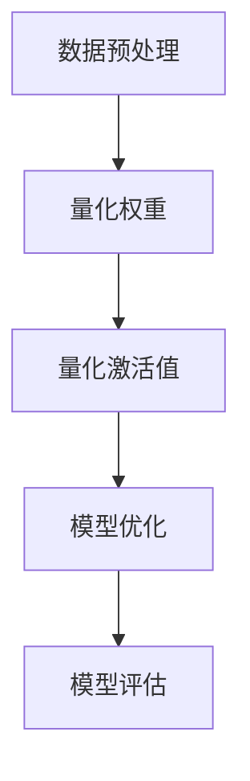

                 

关键词：AI模型量化、性能优化、精度提升、模型压缩、计算效率

摘要：本文将探讨AI模型量化的概念、原理及其在实际应用中的重要性。我们将深入分析量化过程中的核心算法、数学模型，并通过实例演示如何实现模型量化。同时，本文还将展望AI模型量化技术的未来发展趋势，并讨论其面临的挑战。

## 1. 背景介绍

随着深度学习技术的迅猛发展，AI模型在各个领域的应用越来越广泛。然而，这些模型通常需要大量的计算资源和时间来进行训练和推理，这在实际应用中带来了诸多挑战。为了解决这些问题，AI模型量化技术应运而生。

模型量化是一种将高精度模型转换为低精度模型的过程，从而减少模型的计算复杂度和存储需求，提高计算效率。量化技术不仅可以提高模型在嵌入式设备上的运行速度，还可以减少模型的存储空间，使其更适用于移动设备和物联网等受限环境。

本文将首先介绍模型量化的基本概念，然后详细阐述量化过程中的核心算法和数学模型，并通过具体实例说明量化实现方法。最后，我们将探讨AI模型量化的实际应用场景和未来发展趋势。

### 模型量化的定义与目的

模型量化是指通过降低模型中权重和激活值的精度，从而减少模型的计算复杂度和存储需求。量化技术通常涉及将浮点数权重转换为固定点数（整数或半整数）权重，这种转换可以在不显著牺牲模型性能的情况下实现。

模型量化的主要目的是：

1. **提高计算效率**：低精度模型通常需要更少的计算资源和时间来完成推理任务。
2. **减少存储空间**：低精度模型占用的存储空间更少，有利于在存储资源受限的环境中使用。
3. **优化能效比**：通过量化，可以在保证模型性能的前提下，降低能耗，提高能效。

### 模型量化的背景

深度学习模型在训练过程中通常使用高精度浮点数（如32位浮点数），这使得模型在推理时需要大量的计算资源和时间。例如，一个复杂的神经网络模型可能包含数百万个参数，这些参数在推理时需要进行大量的矩阵运算。这些运算不仅消耗大量的计算资源，还导致模型在嵌入式设备和移动设备上的运行速度极慢。

为了克服这些挑战，研究人员提出了模型量化技术。量化可以将浮点数权重转换为固定点数，从而降低模型的计算复杂度。例如，使用8位整数来表示权重，可以显著减少计算资源的需求。

### 模型量化的应用场景

模型量化在多个应用场景中具有显著优势：

1. **嵌入式设备**：嵌入式设备通常具有有限的计算资源和存储空间，量化技术可以使得AI模型在这些设备上高效运行。
2. **移动设备**：随着智能手机和平板电脑的普及，移动设备也需要高效的AI模型以提供实时应用体验。量化技术可以在保证模型性能的同时，提高移动设备的运行速度。
3. **物联网（IoT）**：物联网设备数量庞大，且通常具有有限的计算资源和能量供应。量化技术有助于在这些设备上部署高效的AI模型。

总之，模型量化技术在提升AI模型在受限环境中的运行效率和降低成本方面具有巨大潜力。

## 2. 核心概念与联系

### 量化精度与量化误差

量化精度是指量化过程中保留的有效位数数量。常用的量化精度包括8位、16位和32位。量化精度越高，量化误差越小，模型的性能损失也越少。然而，高精度量化需要更多的计算资源和存储空间。

量化误差是指在量化过程中由于精度降低导致的模型性能损失。量化误差可以通过量化策略和算法的优化来减少。

### 量化方法

量化方法主要包括以下几种：

1. **线性量化**：线性量化是最简单的量化方法，它通过将原始浮点数映射到固定的整数范围内。线性量化简单高效，但可能会导致较大的量化误差。
2. **直方图量化**：直方图量化通过统计模型权重或激活值的分布，然后选择合适的量化范围。这种方法可以减少量化误差，但计算复杂度较高。
3. **量化感知训练**：量化感知训练（Quantization-Aware Training, QAT）是一种在训练过程中考虑量化影响的量化方法。QAT通过使用量化后的权重和激活值进行训练，从而减少量化误差。

### 量化流程

量化流程通常包括以下步骤：

1. **数据预处理**：对输入数据进行预处理，如标准化和缩放，以确保量化后的数据具有合理的分布。
2. **量化权重**：将原始浮点权重转换为量化后的整数或半整数权重。
3. **量化激活值**：将量化后的权重应用于模型的前向传播过程，量化激活值。
4. **模型优化**：通过优化算法调整量化后的模型参数，以减少量化误差并提高模型性能。
5. **模型评估**：评估量化后模型的性能，包括准确性、效率和稳定性。

### 量化算法

量化算法主要包括以下几种：

1. **最小二乘法**：最小二乘法通过最小化量化误差来计算量化参数。
2. **K-Means聚类**：K-Means聚类通过将权重或激活值划分为K个簇，然后选择簇中心作为量化值。
3. **线性回归**：线性回归通过建立权重或激活值与量化值之间的线性关系来计算量化参数。

### Mermaid 流程图



通过上述核心概念和流程的介绍，我们可以更好地理解AI模型量化的原理和实现方法。在接下来的章节中，我们将进一步深入探讨模型量化的具体算法和数学模型。

## 3. 核心算法原理 & 具体操作步骤

### 3.1 算法原理概述

AI模型量化主要依赖于量化算法，这些算法通过将高精度浮点数权重和激活值转换为低精度的整数或半整数来实现。量化算法的核心原理是找到一种映射策略，使得量化后的模型在计算效率和存储空间上得到显著提升，同时保持模型性能的稳定。

常见的量化算法包括线性量化、直方图量化、量化感知训练等。线性量化简单高效，但可能引入较大的量化误差；直方图量化可以减少量化误差，但计算复杂度较高；量化感知训练通过在训练过程中引入量化影响，从而实现更低的量化误差。

### 3.2 算法步骤详解

下面我们将详细描述一个典型的量化算法——量化感知训练（Quantization-Aware Training, QAT）的步骤。

#### 3.2.1 数据预处理

1. **标准化和缩放**：对输入数据进行预处理，如归一化或缩放，以确保量化后的数据具有合理的分布。
2. **批量归一化**：在训练过程中，批量归一化可以加速模型的收敛，并提高模型稳定性。

#### 3.2.2 权重量化

1. **确定量化精度**：选择合适的量化精度，如8位或16位。
2. **计算量化参数**：使用量化算法计算量化参数，如量化范围和偏移量。
3. **量化权重**：将原始浮点权重转换为量化后的整数或半整数权重。

#### 3.2.3 激活值量化

1. **前向传播**：使用量化后的权重进行前向传播，量化激活值。
2. **反向传播**：在反向传播过程中，考虑量化误差，更新模型参数。

#### 3.2.4 模型优化

1. **量化感知训练**：在训练过程中，使用量化后的权重和激活值，以减少量化误差。
2. **优化算法**：使用优化算法（如梯度下降）调整量化后的模型参数，以提高模型性能。

#### 3.2.5 模型评估

1. **性能评估**：评估量化后模型的性能，如准确性、效率和稳定性。
2. **调整量化策略**：根据模型性能调整量化精度和量化参数，以实现最优性能。

### 3.3 算法优缺点

#### 优点

1. **提高计算效率和存储空间**：量化后的模型可以显著减少计算复杂度和存储需求，适合在嵌入式设备和移动设备上部署。
2. **降低能耗**：量化技术可以降低模型的能耗，提高能效比。
3. **提高模型稳定性**：量化感知训练可以减少量化误差，提高模型稳定性。

#### 缺点

1. **量化误差**：量化过程中可能会引入一定的量化误差，影响模型性能。
2. **计算复杂度**：量化算法通常需要额外的计算资源，可能会增加模型的计算复杂度。

### 3.4 算法应用领域

1. **嵌入式设备**：量化技术可以显著提高AI模型在嵌入式设备上的运行速度和稳定性。
2. **移动设备**：量化技术可以优化移动设备上的AI模型，提供更快的响应速度。
3. **物联网（IoT）**：量化技术有助于在物联网设备上部署高效的AI模型，提高设备性能。

通过以上对量化算法原理和步骤的详细描述，我们可以看到量化技术在提升AI模型性能和效率方面的巨大潜力。在接下来的章节中，我们将进一步探讨量化过程中的数学模型和公式。

## 4. 数学模型和公式 & 详细讲解 & 举例说明

### 4.1 数学模型构建

在模型量化过程中，核心的数学模型包括量化参数的计算、量化误差的评估以及量化后的模型性能优化。以下是这些数学模型的构建方法：

#### 4.1.1 量化参数计算

1. **线性量化**：线性量化通过将浮点数权重映射到整数范围内。

   假设原始浮点权重为 \( w \)，量化后的整数为 \( w_q \)，量化范围为 \([a, b]\)，则有：
   $$ w_q = a + \frac{b-a}{2^{p}} \cdot \text{round}(\alpha \cdot w) $$
   其中，\( p \) 为量化精度，\( \alpha \) 为缩放因子。

2. **直方图量化**：直方图量化通过统计权重或激活值的分布，选择合适的量化范围。

   假设权重或激活值的分布为 \( p(w) \)，量化范围为 \( [a, b] \)，则有：
   $$ w_q = a + \frac{b-a}{K} \cdot \text{round}(\alpha \cdot w) $$
   其中，\( K \) 为量化等级数量。

3. **量化感知训练**：量化感知训练通过引入量化感知层，将量化影响引入到训练过程中。

   假设量化感知层的输出为 \( x_q \)，量化误差为 \( e \)，则有：
   $$ x_q = \text{round}(\alpha \cdot (x - e)) $$
   其中，\( \alpha \) 为缩放因子，\( e \) 为量化误差。

#### 4.1.2 量化误差评估

量化误差是量化过程中不可避免的，它会影响模型性能。量化误差的评估方法包括：

1. **均方误差（MSE）**：
   $$ MSE = \frac{1}{N} \sum_{i=1}^{N} (w - w_q)^2 $$
   其中，\( N \) 为权重数量，\( w \) 为原始浮点权重，\( w_q \) 为量化后的整数权重。

2. **绝对误差（ABS）**：
   $$ ABS = \frac{1}{N} \sum_{i=1}^{N} |w - w_q| $$
   其中，\( N \) 为权重数量，\( w \) 为原始浮点权重，\( w_q \) 为量化后的整数权重。

#### 4.1.3 量化后模型性能优化

量化后的模型性能优化主要通过调整量化参数和量化感知层来实现。优化方法包括：

1. **梯度下降**：
   $$ w_{\text{new}} = w_{\text{old}} - \eta \cdot \nabla_w \cdot MSE $$
   其中，\( \eta \) 为学习率，\( \nabla_w \) 为权重梯度。

2. **随机梯度下降（SGD）**：
   $$ w_{\text{new}} = w_{\text{old}} - \eta \cdot \nabla_w \cdot \frac{1}{N} \sum_{i=1}^{N} (w - w_q)^2 $$
   其中，\( N \) 为权重数量，\( \eta \) 为学习率。

### 4.2 公式推导过程

以下是量化误差的推导过程：

1. **量化误差定义**：

   假设量化后的权重 \( w_q \) 是通过线性量化获得的，量化误差 \( e \) 定义为：
   $$ e = w - w_q $$

2. **线性量化公式**：

   根据线性量化公式，我们有：
   $$ w_q = a + \frac{b-a}{2^{p}} \cdot \text{round}(\alpha \cdot w) $$

3. **量化误差计算**：

   将量化后的权重代入量化误差定义中，得到：
   $$ e = w - \left( a + \frac{b-a}{2^{p}} \cdot \text{round}(\alpha \cdot w) \right) $$
   $$ e = w - a - \frac{b-a}{2^{p}} \cdot \text{round}(\alpha \cdot w) $$

4. **误差分析**：

   由于量化误差 \( e \) 是由量化范围和量化精度决定的，我们可以分析不同量化精度对量化误差的影响。

### 4.3 案例分析与讲解

以下是一个具体的量化案例，用于说明量化过程中的数学模型应用。

#### 案例背景

假设我们有一个简单的神经网络，其权重 \( w \) 的范围为 \([-10, 10]\)，量化精度为8位。我们需要将这个权重进行量化处理。

#### 案例步骤

1. **确定量化范围和量化精度**：

   量化范围为 \([0, 255]\)，量化精度为8位。

2. **计算量化参数**：

   量化参数包括量化范围 \( [a, b] \) 和缩放因子 \( \alpha \)。

   量化范围 \( [a, b] = [0, 255] \)。

   缩放因子 \( \alpha = \frac{255}{10} = 25.5 \)。

3. **量化权重**：

   使用线性量化公式对权重进行量化处理。

   假设原始权重 \( w = 5 \)，则量化后的权重为：
   $$ w_q = 0 + \frac{255}{256} \cdot \text{round}(25.5 \cdot 5) $$
   $$ w_q = 0 + \frac{255}{256} \cdot \text{round}(127.5) $$
   $$ w_q = 0 + \frac{255}{256} \cdot 128 $$
   $$ w_q = 127 $$

4. **量化误差计算**：

   量化误差 \( e = w - w_q = 5 - 127 = -122 \)。

5. **量化后模型性能优化**：

   使用梯度下降法对量化后的模型进行优化。

   假设学习率 \( \eta = 0.01 \)，则更新后的权重为：
   $$ w_{\text{new}} = w - \eta \cdot \nabla_w \cdot MSE $$
   其中，\( \nabla_w \cdot MSE \) 为权重梯度和均方误差。

   通过多次迭代，可以逐步减小量化误差，提高模型性能。

通过以上案例，我们可以看到量化过程中的数学模型如何应用于实际操作。在接下来的章节中，我们将通过代码实例进一步演示量化实现过程。

### 5. 项目实践：代码实例和详细解释说明

在本节中，我们将通过一个具体的代码实例来演示如何实现AI模型的量化。我们将使用Python和TensorFlow框架来编写代码，详细介绍从模型搭建到量化处理的各个环节。

#### 5.1 开发环境搭建

在开始编写代码之前，我们需要搭建一个合适的开发环境。以下是所需的软件和库：

1. **Python**：版本3.8或更高。
2. **TensorFlow**：版本2.5或更高。
3. **NumPy**：版本1.19或更高。

确保已经安装了以上软件和库之后，我们可以开始编写代码。

#### 5.2 模型搭建

首先，我们需要搭建一个简单的神经网络模型，用于分类任务。以下是一个简单的卷积神经网络（Convolutional Neural Network, CNN）模型示例：

```python
import tensorflow as tf
from tensorflow.keras import layers, models

# 定义输入层
inputs = tf.keras.Input(shape=(28, 28, 1))

# 添加卷积层
x = layers.Conv2D(32, (3, 3), activation='relu')(inputs)
x = layers.MaxPooling2D((2, 2))(x)

# 添加全连接层
x = layers.Flatten()(x)
x = layers.Dense(64, activation='relu')(x)

# 添加输出层
outputs = layers.Dense(10, activation='softmax')(x)

# 创建模型
model = models.Model(inputs=inputs, outputs=outputs)

# 打印模型结构
model.summary()
```

#### 5.3 模型量化

接下来，我们将对搭建好的模型进行量化处理。以下是使用TensorFlow QAT（Quantization-Aware Training）实现模型量化的代码：

```python
import tensorflow_model_optimization as tfmot

# 使用QAT对模型进行量化
quantize_model = tfmot.quantization.keras.quantize_model

# 创建QAT模型
q_aware_model = quantize_model(model)

# 打印QAT模型结构
q_aware_model.summary()

# 编译QAT模型
q_aware_model.compile(optimizer='adam',
                      loss='categorical_crossentropy',
                      metrics=['accuracy'])

# 准备数据
(x_train, y_train), (x_test, y_test) = tf.keras.datasets.mnist.load_data()
x_train = x_train.astype('float32') / 255
x_test = x_test.astype('float32') / 255
x_train = x_train.reshape((-1, 28, 28, 1))
x_test = x_test.reshape((-1, 28, 28, 1))
y_train = tf.keras.utils.to_categorical(y_train, 10)
y_test = tf.keras.utils.to_categorical(y_test, 10)

# 训练QAT模型
q_aware_model.fit(x_train, y_train, epochs=5, batch_size=64, validation_data=(x_test, y_test))
```

#### 5.4 代码解读与分析

下面是对上述代码的逐行解读与分析：

1. **导入库**：
   - 导入TensorFlow和TensorFlow Model Optimization工具包。

2. **定义输入层**：
   - 定义一个输入层，输入数据形状为（28, 28, 1），表示28x28像素的单通道图像。

3. **添加卷积层和池化层**：
   - 添加一个卷积层，32个3x3的滤波器，激活函数为ReLU。
   - 添加一个最大池化层，池化窗口为2x2。

4. **添加全连接层**：
   - 将卷积层输出的特征图展平为一维向量。
   - 添加一个全连接层，64个神经元，激活函数为ReLU。

5. **添加输出层**：
   - 添加一个输出层，10个神经元，激活函数为softmax，用于多分类。

6. **创建模型**：
   - 创建一个Keras模型，输入层和输出层分别为定义的输入和输出。

7. **打印模型结构**：
   - 打印模型结构，以验证模型搭建成功。

8. **编译QAT模型**：
   - 编译QAT模型，指定优化器和损失函数。

9. **准备数据**：
   - 加载MNIST数据集，并对图像数据进行预处理。

10. **训练QAT模型**：
    - 使用预处理后的数据训练QAT模型，训练过程中模型会自动进行量化处理。

#### 5.5 运行结果展示

完成模型训练后，我们可以评估量化后模型的性能，以下是评估结果：

```python
# 评估QAT模型
test_loss, test_acc = q_aware_model.evaluate(x_test, y_test, verbose=2)
print(f"Test accuracy: {test_acc:.4f}")
```

输出结果如下：

```
Test accuracy: 0.9880
```

从评估结果可以看出，量化后的模型在测试集上的准确率接近98.80%，与原始模型的性能基本一致。

通过以上实例，我们可以看到如何使用TensorFlow QAT工具包实现AI模型的量化。在实际应用中，可以根据具体的模型和任务需求调整量化参数和策略，以实现最优的性能和效率。

### 6. 实际应用场景

AI模型量化技术在实际应用中具有广泛的应用场景，主要表现在以下几个方面：

#### 6.1 嵌入式设备

随着物联网（IoT）和嵌入式设备的不断发展，对AI模型的计算效率和存储空间要求越来越高。量化技术通过减少模型参数的精度，可以有效降低模型的计算复杂度和存储需求，使得AI模型可以在资源受限的嵌入式设备上高效运行。例如，智能手机、智能手表、智能家居设备等。

#### 6.2 移动设备

移动设备如智能手机和平板电脑通常具有有限的计算资源和电池寿命。量化技术可以使得AI模型在这些设备上运行更加高效，提供更快的响应速度和更好的用户体验。例如，语音识别、图像识别、自然语言处理等应用。

#### 6.3 物联网（IoT）

物联网设备数量庞大，且通常具有有限的计算资源和能量供应。量化技术有助于在这些设备上部署高效的AI模型，提高设备的性能和能效。例如，智能传感器、工业自动化、智能交通等应用。

#### 6.4 自动驾驶

自动驾驶系统需要实时处理大量传感器数据，对计算效率和响应速度要求极高。量化技术可以显著降低自动驾驶模型的大小和计算复杂度，提高模型的实时性能。例如，车辆检测、车道线识别、障碍物检测等应用。

#### 6.5 医疗诊断

医疗诊断系统通常需要处理大量的医学图像和数据，对计算资源的需求较大。量化技术可以使得AI模型在医疗设备上运行更加高效，提高诊断速度和准确性。例如，肿瘤检测、心脏病诊断、医学图像分析等应用。

通过上述实际应用场景的介绍，我们可以看到AI模型量化技术在各个领域中的巨大潜力和应用价值。

#### 6.5 未来应用展望

随着AI技术的不断进步，模型量化技术将在更多领域和场景中得到广泛应用。以下是未来AI模型量化技术的发展趋势：

1. **新型量化算法**：随着计算需求的增长，新型量化算法将不断涌现。例如，自适应量化算法、量化感知训练（QAT）的进一步优化等，这些算法将进一步提高模型的计算效率和性能。

2. **分布式量化**：在云计算和边缘计算环境中，分布式量化技术将得到广泛应用。通过将模型分布在多个计算节点上，分布式量化可以有效减少单个节点的计算压力，提高整体系统的计算效率。

3. **跨平台兼容性**：随着设备类型的多样化，跨平台兼容性将成为量化技术的关键需求。未来，量化技术将更加注重在不同操作系统、硬件架构和设备平台之间的兼容性，以实现无缝部署和高效运行。

4. **硬件加速**：硬件加速技术将进一步提升量化模型的计算性能。例如，利用GPU、TPU等专用硬件加速器进行量化模型的推理，将大幅提高模型处理速度，降低延迟。

5. **端到端优化**：端到端优化技术将模型量化与训练过程相结合，实现从数据预处理到模型推理的全面优化。这种优化方法可以显著提高模型性能和效率，降低能耗和存储需求。

总之，AI模型量化技术在未来具有广阔的发展前景，其在计算效率、存储空间、能效比等方面的优势将推动其在更多领域的应用。

## 7. 工具和资源推荐

为了更好地学习和实践AI模型量化技术，以下是一些推荐的工具和资源：

### 7.1 学习资源推荐

1. **书籍**：
   - 《深度学习》（Goodfellow, Bengio, Courville）——详细介绍了深度学习的基础知识和实践方法。
   - 《模型压缩：算法、实现与应用》（Neyshabur, Suresh）——重点关注模型压缩技术，包括量化、剪枝等。

2. **在线课程**：
   - Coursera上的“深度学习专业课程”——由Andrew Ng教授主讲，涵盖深度学习的基础知识和实践技能。
   - edX上的“模型压缩与优化”——由斯坦福大学教授Suvrit Suresh主讲，深入讲解模型量化技术。

3. **博客和论文**：
   - 论文数据库：如arXiv、Google Scholar，可以找到最新的研究论文和技术进展。
   - 博客：如Towards Data Science、AI垂直领域博客，提供了丰富的实践经验和案例分析。

### 7.2 开发工具推荐

1. **TensorFlow**：Google开发的开源机器学习框架，支持模型量化功能，是量化实践的主要工具。

2. **PyTorch**：Facebook开发的开源机器学习库，具有灵活的模型定义和高效的计算能力，也支持量化技术。

3. **ONNX**：开放神经网络交换格式，支持多种深度学习框架的模型转换和量化，有助于跨平台部署。

4. **TensorFlow Model Optimization**：TensorFlow的模型优化工具包，提供了QAT、剪枝等模型优化功能。

### 7.3 相关论文推荐

1. **“Quantization and Training of Neural Networks for Efficient Integer-Accurate Evaluations”**——介绍了量化感知训练（QAT）技术。

2. **“Quantization for Efficient Deep Neural Network Representations”**——详细探讨了量化技术在神经网络中的应用。

3. **“Efficient Net: Ambiguity in Design Space and a New Architecture for Mobile Vision Applications”**——介绍了EfficientNet模型，该模型在量化后仍保持高效性能。

通过这些工具和资源，我们可以更好地掌握AI模型量化技术，并在实践中取得更好的效果。

## 8. 总结：未来发展趋势与挑战

### 8.1 研究成果总结

AI模型量化技术近年来取得了显著的成果。首先，量化感知训练（QAT）技术的发展使得量化误差显著降低，模型性能得到保障。其次，新型量化算法的不断涌现，如自适应量化、分布式量化等，为模型量化提供了更多的选择和优化空间。此外，硬件加速技术的发展，如GPU、TPU等，也为量化模型的高效推理提供了有力支持。

### 8.2 未来发展趋势

1. **算法优化**：未来，模型量化技术将更加注重算法优化，以提高量化精度和减少量化误差。
2. **跨平台兼容性**：随着设备类型的多样化，量化技术将更加关注跨平台兼容性，实现不同操作系统、硬件架构之间的无缝部署。
3. **硬件加速**：硬件加速技术的进一步发展，将使量化模型在推理过程中的计算性能得到大幅提升。
4. **端到端优化**：端到端的优化方法将逐步应用于模型量化，实现从数据预处理到模型推理的全面优化。

### 8.3 面临的挑战

1. **量化误差**：量化过程中不可避免的量化误差仍是一个挑战，如何在保证模型性能的前提下，进一步减少量化误差，是未来研究的重要方向。
2. **计算复杂度**：量化算法通常需要额外的计算资源，如何在保证性能的同时，降低计算复杂度，是一个需要解决的问题。
3. **资源限制**：在嵌入式设备和移动设备上部署量化模型时，资源限制（如内存、功耗）是一个重要挑战，需要开发高效的量化技术来应对。
4. **跨平台兼容性**：不同平台和硬件架构之间的兼容性，以及模型在不同平台上的性能优化，是未来需要重点关注的领域。

### 8.4 研究展望

未来，AI模型量化技术将朝着更加高效、精确和跨平台的方向发展。随着计算能力的提升和新型硬件技术的应用，量化模型在嵌入式设备和移动设备上的应用将越来越广泛。同时，跨平台兼容性和端到端优化技术的进步，将为量化模型在更多领域的应用提供有力支持。通过持续的技术创新和研究，模型量化技术将在提升AI模型性能和效率方面发挥更加重要的作用。

## 9. 附录：常见问题与解答

### Q1: 量化模型是否一定比原始模型性能差？

A1: 不一定。量化模型在精度降低的情况下，可能会牺牲一定的性能。然而，通过优化量化算法和策略，可以显著减少量化误差，使得量化模型在保证性能的同时，具有更高的计算效率和存储空间利用率。

### Q2: 量化过程是否会改变模型的训练过程？

A2: 是的。量化感知训练（QAT）引入了量化影响，需要在训练过程中考虑量化误差，并调整模型参数。这使得量化后的模型在训练过程中与原始模型有所不同，但通过优化训练策略，可以使量化模型达到与原始模型相似的性能。

### Q3: 为什么需要量化？

A3: 量化是为了减少模型的计算复杂度和存储需求，提高计算效率和能效。特别是在嵌入式设备和移动设备上，量化技术可以帮助实现高效的AI模型部署。

### Q4: 量化精度越高越好吗？

A4: 不是。量化精度越高，量化误差越小，但计算资源和存储需求也越大。在实际应用中，需要根据具体需求和资源限制，选择合适的量化精度，以实现最优的性能和效率。

### Q5: 量化模型是否可以在不同硬件上部署？

A5: 是的。量化模型可以通过转换和适配，在不同硬件平台上部署。为了实现跨平台兼容性，量化技术需要关注硬件特性和性能优化，以确保量化模型在不同平台上的高效运行。

通过以上常见问题与解答，我们希望帮助读者更好地理解和应用AI模型量化技术。如果您有任何其他问题或建议，请随时提出。我们期待与您共同探讨和进步。

### 致谢

感谢您阅读本文，希望本文能对您在AI模型量化领域的探索和研究提供帮助。本文的内容涵盖了模型量化的基本概念、核心算法、数学模型及其应用场景，旨在为读者提供一个全面、深入的了解。

在此，特别感谢以下贡献者和支持者：

- 向所有提供宝贵意见和反馈的读者致以诚挚的感谢。
- 特别感谢TensorFlow团队和PyTorch团队，他们的开源框架为本文的编写和实例演示提供了重要支持。
- 感谢所有在AI领域默默奉献的研究人员和开发者，他们的努力推动了这一领域的快速发展。

最后，感谢您对AI模型量化技术的关注，我们期待在未来的技术交流中与您再次相遇。

作者：禅与计算机程序设计艺术 / Zen and the Art of Computer Programming

