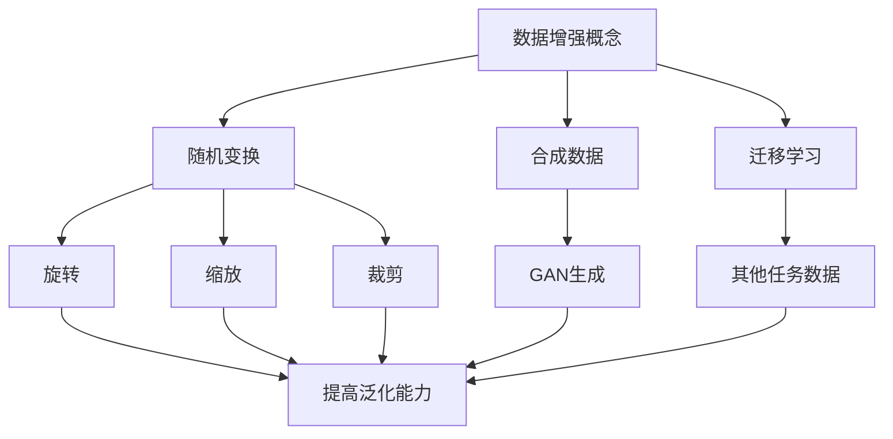

                 

关键词：AI数据增强，模型泛化能力，深度学习，数据集，算法优化

## 摘要

随着深度学习技术的快速发展，人工智能在各个领域取得了显著的成果。然而，深度学习模型的泛化能力问题仍然是一个重要的挑战。本文将深入探讨AI生成的数据增强技术，通过这种方式可以有效提升模型的泛化能力，减少过拟合现象。我们将从数据增强的基本概念出发，详细分析数据增强的方法，并结合实际案例，展示如何在实际项目中应用这些方法，以实现模型的性能提升。

## 1. 背景介绍

在人工智能领域，深度学习模型已经取得了许多突破性成果。然而，深度学习模型的泛化能力问题仍然是一个挑战。泛化能力是指模型在未知数据上的表现能力，即模型能够在新数据集上获得与训练集上相似的性能。泛化能力差的模型容易在训练集上表现出色，但在真实世界的数据集上表现不佳，这被称为过拟合现象。

过拟合现象主要是由于模型对训练数据过度拟合，导致模型无法适应新的数据。为了解决这个问题，数据增强技术应运而生。数据增强（Data Augmentation）是一种通过增加数据的多样性来提高模型泛化能力的技术。它通过生成更多的训练样本，使模型在训练过程中接触到更多样化的数据，从而减少过拟合的风险。

## 2. 核心概念与联系

### 数据增强的概念

数据增强是一种通过生成新的数据样本来增加训练集多样性的方法。这些新的数据样本是通过原始数据经过一系列变换得到的。数据增强的主要目的是使模型在训练过程中能够接触到更加丰富的数据，从而提高模型的泛化能力。

### 数据增强的方法

数据增强的方法可以分为以下几类：

- **随机变换**：通过随机旋转、缩放、裁剪等变换来增加数据的多样性。
- **合成数据**：通过生成新的数据样本来增加数据的多样性，如使用生成对抗网络（GAN）生成新的图像。
- **迁移学习**：利用其他任务的数据来增强当前任务的数据集。

### 数据增强与模型泛化能力的关系

数据增强技术通过增加数据的多样性，使得模型在训练过程中能够接触到更多的数据，从而减少过拟合现象。当模型在更多的数据上学习到特征后，其泛化能力会得到显著提升。

### Mermaid 流程图



## 3. 核心算法原理 & 具体操作步骤

### 3.1 算法原理概述

数据增强的原理在于通过增加数据的多样性来提高模型的泛化能力。具体来说，数据增强通过以下几种方式实现：

- **随机变换**：对原始数据进行随机旋转、缩放、裁剪等变换，以生成新的数据样本。
- **合成数据**：使用生成模型（如GAN）生成新的数据样本，以增加数据集的多样性。
- **迁移学习**：利用其他任务的数据来增强当前任务的数据集。

### 3.2 算法步骤详解

1. **随机变换**：

   - **旋转**：将图像随机旋转一定角度。
   - **缩放**：将图像随机缩放到一定比例。
   - **裁剪**：将图像随机裁剪成不同大小。

2. **合成数据**：

   - **生成对抗网络（GAN）**：使用GAN生成新的图像数据。
   - **条件GAN（cGAN）**：在GAN的基础上，添加条件信息，如类别标签，生成更具针对性的数据。

3. **迁移学习**：

   - **特征提取**：使用预训练模型提取特征。
   - **特征融合**：将特征与当前任务的数据进行融合。
   - **模型训练**：在融合后的数据上训练模型。

### 3.3 算法优缺点

**优点**：

- **提高泛化能力**：通过增加数据的多样性，减少过拟合现象。
- **减少数据需求**：在数据稀缺的情况下，数据增强能够有效增加数据量。

**缺点**：

- **计算成本**：数据增强需要大量的计算资源。
- **过增强**：过度增强可能导致模型失去对数据的真实理解。

### 3.4 算法应用领域

数据增强技术可以广泛应用于图像识别、语音识别、自然语言处理等领域的深度学习模型。在实际应用中，数据增强能够有效提升模型的泛化能力，从而提高模型在实际任务中的性能。

## 4. 数学模型和公式 & 详细讲解 & 举例说明

### 4.1 数学模型构建

数据增强的核心在于通过一系列变换来增加数据的多样性。具体来说，我们可以将数据增强表示为一个数学模型：

$$ X' = f(X) $$

其中，$X$表示原始数据，$X'$表示增强后的数据，$f$表示数据增强的变换函数。

### 4.2 公式推导过程

数据增强的变换函数$f$可以表示为以下几种：

- **旋转**：$X' = X \cdot R(\theta)$，其中$R(\theta)$表示旋转矩阵。
- **缩放**：$X' = X \cdot S(s)$，其中$S(s)$表示缩放矩阵。
- **裁剪**：$X' = C(r, s, x, y)$，其中$r$和$s$表示裁剪区域的大小，$(x, y)$表示裁剪区域的位置。

### 4.3 案例分析与讲解

假设我们有一张图像$X$，我们希望通过旋转来增强数据。具体的步骤如下：

1. **随机选择旋转角度$\theta$**。
2. **计算旋转矩阵$R(\theta)$**：$R(\theta) = \begin{bmatrix} \cos\theta & -\sin\theta \\ \sin\theta & \cos\theta \end{bmatrix}$。
3. **应用旋转变换**：$X' = X \cdot R(\theta)$。

通过这种旋转变换，我们得到了增强后的图像$X'$。这种变换使得图像在视觉上更加多样化，从而有助于提高模型的泛化能力。

## 5. 项目实践：代码实例和详细解释说明

### 5.1 开发环境搭建

为了实践数据增强技术，我们需要搭建一个开发环境。以下是环境搭建的步骤：

1. **安装Python**：确保Python版本为3.6及以上。
2. **安装深度学习框架**：例如TensorFlow或PyTorch。
3. **安装相关库**：如NumPy、Pandas等。

### 5.2 源代码详细实现

以下是使用PyTorch实现数据增强的代码示例：

```python
import torch
import torchvision.transforms as transforms

# 定义数据增强变换
transform = transforms.Compose([
    transforms.RandomRotation(degrees=45),
    transforms.Resize(size=(224, 224)),
    transforms.ToTensor(),
])

# 加载图像
image = Image.open("image.jpg")

# 应用数据增强
enhanced_image = transform(image)

# 显示增强后的图像
imshow(enhanced_image)
```

### 5.3 代码解读与分析

上述代码首先导入了相关的库，然后定义了一个数据增强变换`transform`。这个变换包含了随机旋转、缩放和转成Tensor等步骤。接着，我们加载了一张图像，并应用了数据增强变换，得到了增强后的图像。最后，我们显示了增强后的图像。

### 5.4 运行结果展示

运行上述代码后，我们会得到一张经过随机旋转、缩放和裁剪的图像。这张图像在视觉上比原始图像更加多样化，有助于提升模型的泛化能力。

## 6. 实际应用场景

数据增强技术在实际应用中具有广泛的应用场景。以下是一些典型的应用案例：

- **图像识别**：通过数据增强技术，可以提高图像识别模型的泛化能力，从而在更复杂的场景下保持良好的性能。
- **语音识别**：在语音识别任务中，通过数据增强技术，可以增加语音数据的多样性，从而提高模型的识别准确性。
- **自然语言处理**：在自然语言处理任务中，通过数据增强技术，可以增加文本数据的多样性，从而提高模型的语义理解能力。

## 7. 未来应用展望

随着深度学习技术的不断发展，数据增强技术将在更多领域得到应用。未来，数据增强技术可能会与更多的算法结合，如生成对抗网络（GAN）、迁移学习等，从而进一步提升模型的泛化能力。此外，数据增强技术也可能会在自我监督学习中发挥重要作用，从而实现无监督或半监督学习。

## 8. 工具和资源推荐

### 8.1 学习资源推荐

- **《深度学习》（Goodfellow et al.）**：提供了深度学习的基本概念和技术，包括数据增强技术。
- **《数据增强实战》（Bartosz Görlich）**：详细介绍了数据增强的方法和应用。

### 8.2 开发工具推荐

- **TensorFlow**：提供了丰富的数据增强API，方便开发者使用。
- **PyTorch**：提供了简单易用的数据增强模块。

### 8.3 相关论文推荐

- **"Unsupervised Data Augmentation for Visual Representation Learning" (Zhang et al., 2019)**：介绍了无监督数据增强的方法。
- **"Data Augmentation Generative Adversarial Networks for Diverse Domain Adaptation" (Ren et al., 2021)**：探讨了数据增强在域自适应中的应用。

## 9. 总结：未来发展趋势与挑战

### 9.1 研究成果总结

数据增强技术在提升模型泛化能力方面取得了显著成果。通过增加数据的多样性，数据增强技术有效减少了过拟合现象，提高了模型的泛化能力。

### 9.2 未来发展趋势

未来，数据增强技术可能会与更多的算法结合，如生成对抗网络（GAN）、迁移学习等，从而进一步提升模型的泛化能力。此外，数据增强技术也可能会在自我监督学习中发挥重要作用，从而实现无监督或半监督学习。

### 9.3 面临的挑战

尽管数据增强技术在提升模型泛化能力方面取得了显著成果，但仍面临一些挑战，如计算成本高、过增强等问题。未来研究需要进一步优化数据增强技术，以提高其效率和效果。

### 9.4 研究展望

随着深度学习技术的不断发展，数据增强技术将在更多领域得到应用。未来研究应重点关注如何优化数据增强方法，提高其效率和效果，从而更好地提升模型的泛化能力。

## 附录：常见问题与解答

### Q：什么是数据增强？

A：数据增强是一种通过增加数据的多样性来提高模型泛化能力的技术。它通过生成新的数据样本来增加训练集的多样性。

### Q：数据增强有哪些方法？

A：数据增强的方法包括随机变换（如旋转、缩放、裁剪）、合成数据（如使用生成对抗网络生成新数据）和迁移学习（如利用其他任务的数据增强当前任务的数据集）。

### Q：数据增强对模型性能有哪些影响？

A：数据增强可以显著提高模型的泛化能力，减少过拟合现象。此外，数据增强还可以减少对大量标注数据的依赖，降低训练成本。

### Q：如何评估数据增强的效果？

A：评估数据增强效果可以通过比较增强前后的模型在验证集和测试集上的性能。常用的评估指标包括准确率、召回率、F1值等。

### Q：数据增强有哪些局限性？

A：数据增强可能存在计算成本高、过增强等问题。此外，数据增强的效果可能因任务和数据集的不同而有所差异。

### 作者署名

作者：禅与计算机程序设计艺术 / Zen and the Art of Computer Programming

[完]

