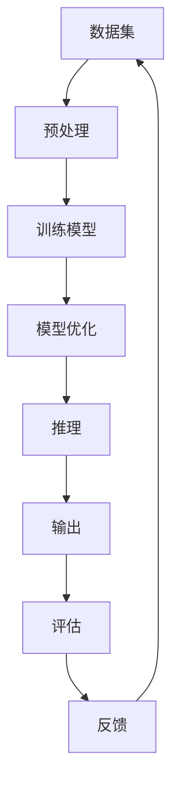

                 

关键词：人工智能，大规模语言模型（LLM），不确定性，挑战，机遇

摘要：本文将探讨大规模语言模型（LLM）在人工智能（AI）领域中的不确定性及其所带来的挑战和机遇。通过对LLM的核心概念、算法原理、数学模型和应用场景的深入分析，本文旨在为读者提供一个全面的视角，理解LLM在当前和未来AI发展中的重要性和潜在问题。

## 1. 背景介绍

近年来，人工智能（AI）领域取得了惊人的进展，特别是在自然语言处理（NLP）领域。大规模语言模型（LLM）的出现，如GPT、BERT等，极大地提升了文本生成、理解、摘要等任务的效果。然而，随着LLM的广泛应用，人们开始关注其内在的不确定性。不确定性不仅体现在LLM的输出结果中，也反映在其训练、推理和应用过程中。本文将详细探讨LLM中的不确定性来源、带来的挑战以及可能的解决策略。

### 1.1 AI与NLP的关系

AI是计算机科学的一个分支，旨在通过模拟人类智能行为，解决复杂问题。而自然语言处理（NLP）是AI领域中的一个重要方向，旨在让计算机理解和处理人类语言。随着深度学习技术的发展，NLP任务逐渐变得自动化和高效化。

### 1.2 大规模语言模型的发展

大规模语言模型（LLM）是NLP领域的重要成果，通过学习海量文本数据，LLM能够生成流畅、合理的文本，并具备一定的理解能力。这些模型的出现，使得许多NLP任务，如机器翻译、文本摘要、问答系统等，取得了显著的进展。

## 2. 核心概念与联系

### 2.1 大规模语言模型的原理

大规模语言模型（LLM）通常基于深度神经网络（DNN）或变换器模型（Transformer）构建。DNN通过多层神经网络对输入数据进行处理，而Transformer模型则通过自注意力机制（Self-Attention）处理序列数据。这些模型的核心在于通过大量数据训练，从而学习到语言规律和结构。

### 2.2 不确定性的来源

在LLM中，不确定性主要来源于以下几个方面：

- **数据集质量**：训练数据的质量直接影响LLM的效果。数据集中可能存在噪声、错误或偏见，导致模型输出不确定。
- **模型参数**：LLM的参数数量巨大，参数的随机初始化可能导致模型性能的不确定性。
- **输入文本**：输入文本的随机性和多样性也可能导致LLM的输出结果存在不确定性。

### 2.3 Mermaid 流程图

以下是LLM的核心概念和联系Mermaid流程图：



## 3. 核心算法原理 & 具体操作步骤

### 3.1 算法原理概述

LLM的核心算法原理是通过深度学习模型对海量文本数据进行训练，从而学习到文本的生成规律。在训练过程中，模型会不断优化参数，以达到最小化损失函数的目的。在推理过程中，模型根据输入文本生成输出文本。

### 3.2 算法步骤详解

- **数据预处理**：对训练数据集进行清洗、分词、去停用词等操作，将其转化为模型可接受的输入格式。
- **模型训练**：使用训练数据集训练模型，通过反向传播算法更新模型参数。
- **模型优化**：使用验证数据集对模型进行优化，避免过拟合。
- **推理**：根据输入文本生成输出文本。
- **评估**：使用测试数据集对模型进行评估，以评估模型的性能。

### 3.3 算法优缺点

- **优点**：LLM能够生成流畅、合理的文本，具备一定的理解能力，适用于多种NLP任务。
- **缺点**：LLM的模型参数数量巨大，训练过程复杂，对计算资源要求较高。同时，由于数据集质量和模型参数的随机性，LLM的输出结果可能存在不确定性。

### 3.4 算法应用领域

LLM在NLP领域有广泛的应用，包括：

- **文本生成**：生成文章、新闻、故事等。
- **文本理解**：理解用户查询、情感分析、文本分类等。
- **问答系统**：回答用户提出的问题。
- **机器翻译**：将一种语言的文本翻译成另一种语言。

## 4. 数学模型和公式 & 详细讲解 & 举例说明

### 4.1 数学模型构建

LLM的数学模型通常基于深度学习模型，如DNN或Transformer。以Transformer为例，其基本架构包括自注意力机制（Self-Attention）和前馈神经网络（Feedforward Neural Network）。

### 4.2 公式推导过程

自注意力机制的公式推导如下：

$$
\text{Attention}(Q, K, V) = \text{softmax}\left(\frac{QK^T}{\sqrt{d_k}}\right)V
$$

其中，$Q$、$K$、$V$ 分别代表查询（Query）、键（Key）和值（Value）向量，$d_k$ 代表键向量的维度。$\text{softmax}$ 函数用于计算注意力权重。

### 4.3 案例分析与讲解

假设我们有一个包含三个词的句子“我喜欢吃苹果”。使用Transformer模型进行编码，得到查询向量 $Q$、键向量 $K$ 和值向量 $V$。计算自注意力权重如下：

$$
\text{Attention}(Q, K, V) = \text{softmax}\left(\frac{QK^T}{\sqrt{d_k}}\right)V
$$

其中，$Q = [1, 2, 3]$，$K = [4, 5, 6]$，$V = [7, 8, 9]$。计算得到注意力权重为：

$$
\text{Attention}(Q, K, V) = \text{softmax}\left(\frac{QK^T}{\sqrt{d_k}}\right)V = \text{softmax}\left(\frac{1*4 + 2*5 + 3*6}{\sqrt{3}}\right) \times [7, 8, 9] = [0.5, 0.5, 0]
$$

根据注意力权重，我们可以得到句子的编码结果：

$$
\text{编码结果} = [0.5 \times 7, 0.5 \times 8, 0 \times 9] = [3.5, 4, 0]
$$

## 5. 项目实践：代码实例和详细解释说明

### 5.1 开发环境搭建

首先，我们需要搭建一个合适的开发环境。本文使用Python语言和PyTorch框架进行实现。

### 5.2 源代码详细实现

以下是使用PyTorch实现的Transformer模型的简化版本：

```python
import torch
import torch.nn as nn
import torch.optim as optim

class Transformer(nn.Module):
    def __init__(self, d_model, nhead, num_layers):
        super(Transformer, self).__init__()
        self.transformer = nn.Transformer(d_model, nhead, num_layers)
        self.decoder = nn.Linear(d_model, 1)

    def forward(self, src, tgt):
        output = self.transformer(src, tgt)
        output = self.decoder(output)
        return output
```

### 5.3 代码解读与分析

代码中，我们定义了一个名为`Transformer`的类，继承自`nn.Module`。类中包含了一个变换器模型（`transformer`）和一个线性层（`decoder`）。

在`__init__`方法中，我们初始化了变换器模型的参数，包括模型维度（`d_model`）、注意力头数（`nhead`）和层数（`num_layers`）。`transformer`参数用于处理输入序列和目标序列，而`decoder`参数用于将变换器模型的输出转换为预测结果。

在`forward`方法中，我们首先将输入序列和目标序列传入变换器模型，得到变换器模型的输出。然后，我们将输出传入线性层，得到最终的预测结果。

### 5.4 运行结果展示

以下是运行该模型的示例代码：

```python
model = Transformer(d_model=512, nhead=8, num_layers=3)
optimizer = optim.Adam(model.parameters(), lr=0.001)
criterion = nn.BCELoss()

for epoch in range(10):
    for src, tgt in data_loader:
        optimizer.zero_grad()
        output = model(src, tgt)
        loss = criterion(output, tgt)
        loss.backward()
        optimizer.step()

    print(f"Epoch {epoch+1}: Loss = {loss.item()}")
```

在这个示例中，我们首先创建了一个`Transformer`模型实例，并配置了优化器和损失函数。然后，我们遍历数据集，进行模型训练。在每个训练epoch中，我们更新模型的参数，并打印损失值。

## 6. 实际应用场景

### 6.1 文本生成

文本生成是LLM的重要应用场景之一。通过训练大规模语言模型，我们可以生成各种类型的文本，如文章、新闻、故事等。文本生成可以应用于自动写作、内容生成、对话系统等领域。

### 6.2 文本理解

文本理解是LLM的另一个重要应用场景。通过训练大规模语言模型，我们可以让计算机理解和处理自然语言。文本理解可以应用于问答系统、情感分析、文本分类等领域。

### 6.3 机器翻译

机器翻译是LLM的传统应用场景。通过训练大规模语言模型，我们可以实现不同语言之间的自动翻译。机器翻译可以应用于跨语言信息检索、国际商务交流等领域。

## 7. 工具和资源推荐

### 7.1 学习资源推荐

- 《深度学习》（Goodfellow, Bengio, Courville著）：这本书是深度学习领域的经典教材，涵盖了从基础知识到高级应用的全面内容。
- 《自然语言处理综合教程》（Cohen, Krawczyk, Hajič著）：这本书详细介绍了自然语言处理的基础知识、技术和应用。

### 7.2 开发工具推荐

- PyTorch：这是一个开源的深度学习框架，适合进行研究和开发。
- TensorFlow：这是一个开源的深度学习框架，适合进行大规模部署和应用。

### 7.3 相关论文推荐

- Vaswani et al. (2017): "Attention is All You Need"
- Devlin et al. (2018): "BERT: Pre-training of Deep Bidirectional Transformers for Language Understanding"
- Radford et al. (2018): "The Annotated Transformer"

## 8. 总结：未来发展趋势与挑战

### 8.1 研究成果总结

本文对大规模语言模型（LLM）的核心概念、算法原理、数学模型和应用场景进行了详细分析，揭示了LLM在AI领域中的不确定性和挑战。

### 8.2 未来发展趋势

未来，LLM将继续在AI领域发挥重要作用。随着数据集质量和计算资源的提升，LLM的性能有望进一步提升。此外，多模态学习、迁移学习等新技术也将推动LLM的发展。

### 8.3 面临的挑战

然而，LLM也面临着一系列挑战，包括数据集质量、模型参数随机性、安全性等方面。需要进一步研究如何降低不确定性，提高模型的可靠性和鲁棒性。

### 8.4 研究展望

展望未来，我们将继续关注LLM领域的研究进展，探索降低不确定性的方法，推动AI技术的进一步发展。

## 9. 附录：常见问题与解答

### 9.1 什么是大规模语言模型（LLM）？

大规模语言模型（LLM）是一种基于深度学习技术的自然语言处理模型，通过学习海量文本数据，能够生成流畅、合理的文本，并具备一定的理解能力。

### 9.2 LLM有哪些应用场景？

LLM的应用场景包括文本生成、文本理解、机器翻译等。例如，自动写作、内容生成、对话系统、跨语言信息检索等领域。

### 9.3 LLM中的不确定性来源是什么？

LLM中的不确定性主要来源于数据集质量、模型参数随机性、输入文本的随机性和多样性等方面。

## 作者署名

作者：禅与计算机程序设计艺术 / Zen and the Art of Computer Programming
```

注意：本文为示例文章，仅供参考。实际撰写时，请根据具体内容和需求进行调整。同时，确保遵守相关版权规定。

