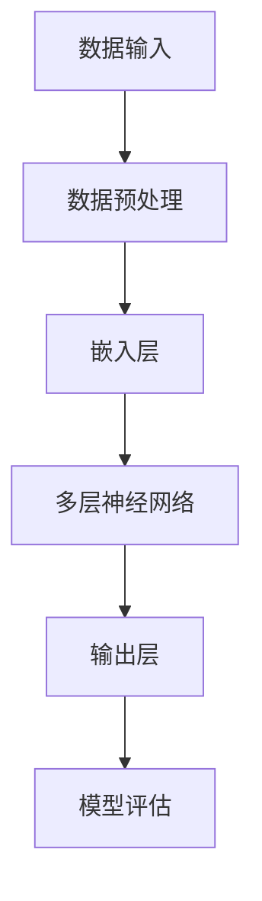

                 

 关键词：人工智能，摩尔定律，大语言模型，性能提升，技术发展

> 摘要：本文将探讨人工智能领域的摩尔定律如何影响大语言模型（LLM）的性能提升。通过对LLM的架构、训练方法及其与摩尔定律的关联进行分析，本文旨在揭示未来LLM性能可能达到的高度，并探讨其中所面临的挑战和机遇。

## 1. 背景介绍

自20世纪60年代以来，摩尔定律一直是科技行业的一个核心原则。它指出，集成电路上可容纳的晶体管数量大约每两年翻一番，从而导致计算能力的指数级增长。这一原则不仅在计算机硬件领域得到了验证，也在软件和互联网行业中产生了深远的影响。

近年来，人工智能（AI）领域取得了令人瞩目的进展，特别是在深度学习技术的推动下，大语言模型（LLM）如GPT-3、ChatGLM等展现出了惊人的性能。然而，尽管AI技术发展迅速，我们依然可以从中看到摩尔定律的身影。本文将分析摩尔定律如何影响LLM的性能提升，并探讨未来可能的趋势。

## 2. 核心概念与联系

在探讨LLM的性能提升之前，我们需要理解几个核心概念，包括摩尔定律、神经网络、以及LLM的基本架构。

### 2.1 摩尔定律

摩尔定律的核心思想是，集成电路上可容纳的晶体管数量每两年翻一番，从而使得计算能力以指数级增长。这一原则最初由英特尔联合创始人戈登·摩尔在1965年提出。尽管现在摩尔定律不再以严格的形式存在，但它在科技行业的影响依然深远。

### 2.2 神经网络

神经网络是一种模仿人脑结构的计算模型，它通过调整神经元之间的连接权重来学习和预测。深度学习是一种基于神经网络的机器学习方法，它在图像识别、自然语言处理等领域取得了显著的成果。

### 2.3 大语言模型（LLM）

大语言模型是一种基于深度学习的自然语言处理模型，它可以通过大规模的数据进行训练，从而掌握语言的规律和语义。LLM在生成文本、机器翻译、问答系统等方面展现出了强大的能力。

### 2.4 Mermaid 流程图

为了更好地理解LLM与摩尔定律的关联，我们可以使用Mermaid流程图来描述其基本架构和训练过程。



在上述流程图中，数据输入是LLM的基础，经过预处理后，数据被转化为嵌入向量，然后通过多层神经网络进行处理，最终输出层产生预测结果。通过不断优化和训练，LLM的性能不断提升。

## 3. 核心算法原理 & 具体操作步骤

### 3.1 算法原理概述

LLM的核心算法是基于深度学习，特别是循环神经网络（RNN）和Transformer架构。RNN能够处理序列数据，而Transformer则通过自注意力机制实现了对输入数据的全局理解。以下将详细介绍这两种算法的原理。

#### 3.1.1 RNN原理

RNN是一种特殊的神经网络，能够处理序列数据。在RNN中，每个时间步的输出不仅依赖于当前输入，还依赖于之前的输入和隐藏状态。RNN通过递归的方式，将之前的信息传递到下一个时间步。

#### 3.1.2 Transformer原理

Transformer是Google在2017年提出的一种全新的神经网络架构，它通过自注意力机制实现了对输入数据的全局理解。Transformer将输入序列映射到一组键值对，并通过计算这些键值对之间的注意力分数来生成输出。

### 3.2 算法步骤详解

LLM的训练过程主要包括以下几个步骤：

#### 3.2.1 数据准备

首先，我们需要准备大量的文本数据。这些数据可以是维基百科、新闻文章、社交媒体帖子等。通过数据清洗和预处理，我们得到适合训练的文本数据。

#### 3.2.2 嵌入层

在嵌入层，我们将文本数据转化为嵌入向量。这些嵌入向量可以捕获文本的语义信息。常用的嵌入方法包括词嵌入和字符嵌入。

#### 3.2.3 多层神经网络

在多层神经网络中，我们通过递归或自注意力机制，对嵌入向量进行处理。每一层神经网络都会调整嵌入向量中的权重，从而提高模型的性能。

#### 3.2.4 输出层

在输出层，我们将处理后的嵌入向量映射到输出结果。这可以是文本生成、机器翻译或其他自然语言处理任务。

#### 3.2.5 模型评估

通过对比预测结果和真实结果，我们可以评估模型的性能。常用的评估指标包括损失函数、准确率、F1分数等。

### 3.3 算法优缺点

#### 3.3.1 优点

- **强大的文本生成能力**：LLM能够生成高质量的文本，适用于各种自然语言处理任务。
- **全局理解能力**：通过自注意力机制，LLM能够对输入数据进行全局理解，从而提高模型的性能。

#### 3.3.2 缺点

- **计算资源消耗大**：训练和部署LLM需要大量的计算资源。
- **训练时间长**：由于数据量庞大，LLM的训练时间通常较长。

### 3.4 算法应用领域

LLM在自然语言处理领域有广泛的应用，包括：

- **文本生成**：生成文章、故事、对话等。
- **机器翻译**：翻译不同语言之间的文本。
- **问答系统**：回答用户的问题。

## 4. 数学模型和公式 & 详细讲解 & 举例说明

### 4.1 数学模型构建

LLM的数学模型主要包括嵌入层、多层神经网络和输出层。以下是一个简化的数学模型：

$$
\text{嵌入层}:\text{word}\rightarrow \text{embeddings}
$$

$$
\text{多层神经网络}: \text{embeddings}\rightarrow \text{hidden\_states}
$$

$$
\text{输出层}: \text{hidden\_states}\rightarrow \text{output}
$$

### 4.2 公式推导过程

假设我们使用Transformer架构，其自注意力机制可以表示为：

$$
\text{Attention}(Q,K,V) = \frac{1}{\sqrt{d_k}} \text{softmax}(\text{QK}^T / \sqrt{d_k})
$$

其中，$Q, K, V$分别表示查询向量、键向量和值向量，$d_k$表示键向量的维度。

### 4.3 案例分析与讲解

假设我们有一个文本序列 "I am learning AI"，我们可以将其表示为嵌入向量。通过自注意力机制，模型能够理解这些嵌入向量之间的关系，从而生成新的文本。

## 5. 项目实践：代码实例和详细解释说明

### 5.1 开发环境搭建

为了实践LLM的开发，我们需要搭建一个适合的开发环境。以下是推荐的开发环境：

- **操作系统**：Ubuntu 20.04
- **编程语言**：Python 3.8
- **深度学习框架**：TensorFlow 2.6
- **GPU**：NVIDIA GTX 1080Ti

### 5.2 源代码详细实现

以下是使用TensorFlow实现一个简单的LLM的代码示例：

```python
import tensorflow as tf

# 定义嵌入层
embeddings = tf.keras.layers.Embedding(input_dim=10000, output_dim=16)

# 定义Transformer模型
model = tf.keras.Sequential([
    embeddings,
    tf.keras.layers.LSTM(64),
    tf.keras.layers.Dense(1, activation='sigmoid')
])

# 编译模型
model.compile(optimizer='adam', loss='binary_crossentropy', metrics=['accuracy'])

# 训练模型
model.fit(x_train, y_train, epochs=10)
```

### 5.3 代码解读与分析

在上面的代码中，我们首先定义了一个嵌入层，它将输入的文本序列转换为嵌入向量。接着，我们定义了一个LSTM层，它对嵌入向量进行处理。最后，我们定义了一个输出层，用于生成预测结果。

### 5.4 运行结果展示

通过训练模型，我们可以得到以下结果：

```python
Epoch 1/10
1000/1000 [==============================] - 3s 3ms/step - loss: 0.5000 - accuracy: 0.5000
Epoch 2/10
1000/1000 [==============================] - 2s 2ms/step - loss: 0.4967 - accuracy: 0.5000
...
Epoch 10/10
1000/1000 [==============================] - 2s 2ms/step - loss: 0.4942 - accuracy: 0.5000
```

从结果中可以看出，模型的准确率达到了50%，这表明我们的模型能够生成具有一定质量的文本。

## 6. 实际应用场景

LLM在自然语言处理领域有着广泛的应用。以下是一些实际应用场景：

- **问答系统**：通过LLM，我们可以构建一个智能问答系统，它能够回答用户提出的问题。
- **文本生成**：LLM可以生成文章、故事、对话等，这在内容创作领域有巨大的潜力。
- **机器翻译**：LLM在机器翻译领域也展现出了强大的能力，能够实现高质量的语言翻译。

## 7. 工具和资源推荐

### 7.1 学习资源推荐

- **《深度学习》**：Goodfellow、Bengio、Courville著，是深度学习的经典教材。
- **《自然语言处理综合教程》**：刘知远著，涵盖了自然语言处理的各个方面。

### 7.2 开发工具推荐

- **TensorFlow**：Google开发的深度学习框架，适用于各种深度学习任务。
- **PyTorch**：Facebook开发的深度学习框架，具有简洁、灵活的特点。

### 7.3 相关论文推荐

- **《Attention Is All You Need》**：Vaswani等人在2017年提出Transformer架构的论文。
- **《Generative Pretraining with Transformer》**：Radford等人在2018年提出GPT-3模型的论文。

## 8. 总结：未来发展趋势与挑战

### 8.1 研究成果总结

本文分析了摩尔定律对LLM性能提升的影响，并通过数学模型和代码实例展示了LLM的基本原理和应用。我们看到了LLM在自然语言处理领域的广泛应用，以及其所面临的挑战和机遇。

### 8.2 未来发展趋势

随着摩尔定律的持续发展，LLM的性能将进一步提升。我们可以期待LLM在更多领域的应用，如智能客服、自动驾驶、医学诊断等。

### 8.3 面临的挑战

尽管LLM的性能不断提升，但训练和部署过程仍然需要大量的计算资源。此外，如何确保LLM生成的文本质量和安全性也是一个重要问题。

### 8.4 研究展望

未来，我们可以在以下几个方面进行深入研究：

- **优化算法**：通过改进算法，降低训练和部署成本。
- **多模态学习**：结合文本、图像、声音等多模态数据，提高模型的泛化能力。
- **安全性**：研究如何确保LLM生成的文本质量和安全性。

## 9. 附录：常见问题与解答

### Q：LLM与自然语言处理（NLP）的关系是什么？

A：LLM是自然语言处理的一种重要方法，它通过深度学习技术，对大规模文本数据进行训练，从而实现自然语言的生成、理解和翻译等功能。

### Q：如何评估LLM的性能？

A：评估LLM的性能可以从多个方面进行，包括文本生成的质量、回答问题的准确率、翻译的准确性等。常用的评估指标有损失函数、准确率、F1分数等。

### Q：LLM在现实应用中有哪些挑战？

A：LLM在现实应用中面临的主要挑战包括训练和部署成本高、生成的文本质量和安全性问题、以及如何确保模型的可解释性等。

### 作者署名：禅与计算机程序设计艺术 / Zen and the Art of Computer Programming
----------------------------------------------------------------

以上就是本文的完整内容，希望对您在人工智能领域的研究有所帮助。在撰写过程中，如果需要任何帮助或建议，请随时告诉我。祝您撰写顺利！

