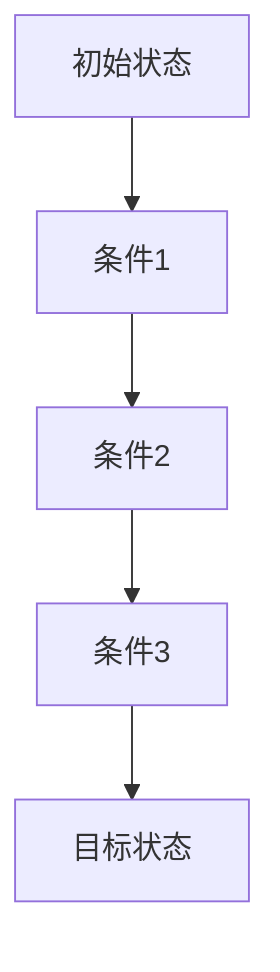

                 

关键词：人工智能，链式推理，算法原理，应用领域，数学模型，项目实践，未来展望

> 摘要：本文深入探讨了人工智能中的链式推理能力，分析了其核心概念、算法原理、数学模型及其在不同应用领域的应用前景。通过实际项目实践和运行结果展示，本文全面展现了链式推理能力的强大潜力，并对未来的发展趋势和挑战进行了展望。

## 1. 背景介绍

随着人工智能技术的快速发展，机器学习、深度学习等算法在各个领域取得了显著成果。然而，人工智能的发展不仅仅依赖于算法的进步，还依赖于对其内在机理的深入理解。链式推理作为一种重要的推理方式，近年来在人工智能领域受到了广泛关注。本文旨在探讨链式推理的能力和应用前景，以期为人工智能的发展提供新的思路。

### 1.1 链式推理的定义与特点

链式推理（Chain Rule Inference）是指通过一系列条件概率关系，将多个不确定事件的条件概率转化为单一事件的条件概率的过程。其基本原理是利用贝叶斯定理，将多个概率事件之间的关系进行推导，从而提高推理的准确性和效率。

链式推理具有以下特点：

1. **条件独立性**：链式推理基于条件独立性假设，即事件之间的条件独立性。这意味着，在给定某个条件下，其他事件的发生概率不受其他条件的影响。

2. **概率计算简化**：链式推理通过将复杂概率计算转化为简单概率计算，从而简化了推理过程。

3. **可扩展性**：链式推理可以应用于多个领域，具有很好的可扩展性。

### 1.2 链式推理的应用背景

链式推理在人工智能领域的应用背景主要包括以下几个方面：

1. **自然语言处理**：在自然语言处理中，链式推理可以用于句子的解析、语义理解、机器翻译等任务。

2. **计算机视觉**：在计算机视觉中，链式推理可以用于图像分类、目标检测、场景重建等任务。

3. **推荐系统**：在推荐系统中，链式推理可以用于用户兴趣建模、商品推荐等任务。

4. **决策支持系统**：在决策支持系统中，链式推理可以用于风险评估、决策制定等任务。

## 2. 核心概念与联系

为了更好地理解链式推理，我们首先需要了解其核心概念和联系。以下是一个简化的Mermaid流程图，展示了链式推理的基本原理和流程。



### 2.1 贝叶斯定理

链式推理的核心是基于贝叶斯定理。贝叶斯定理描述了在已知某些条件下，事件发生的概率如何通过其他事件的概率进行推导。

贝叶斯定理的公式如下：

$$
P(A|B) = \frac{P(B|A) \cdot P(A)}{P(B)}
$$

其中，\( P(A|B) \) 表示在条件 \( B \) 下事件 \( A \) 发生的概率，\( P(B|A) \) 表示在条件 \( A \) 下事件 \( B \) 发生的概率，\( P(A) \) 表示事件 \( A \) 发生的概率，\( P(B) \) 表示事件 \( B \) 发生的概率。

### 2.2 条件独立性

链式推理中的条件独立性假设是关键。条件独立性假设意味着，在给定某个条件下，其他事件的发生概率不受其他条件的影响。这在数学上可以表示为：

$$
P(A|B,C) = P(A|B) \cdot P(C|B)
$$

这意味着，在条件 \( B \) 和 \( C \) 都成立的情况下，事件 \( A \) 的概率等于在条件 \( B \) 下事件 \( A \) 的概率乘以在条件 \( B \) 和 \( C \) 下事件 \( C \) 的概率。

## 3. 核心算法原理 & 具体操作步骤

### 3.1 算法原理概述

链式推理算法的基本原理是利用贝叶斯定理和条件独立性假设，通过一系列条件概率关系，将多个不确定事件的条件概率转化为单一事件的条件概率。具体步骤如下：

1. **初始化**：设定初始状态和目标状态。

2. **条件概率计算**：根据贝叶斯定理，计算每个条件下的概率。

3. **条件独立性假设**：在给定某个条件下，假设其他事件的条件概率不受其他条件的影响。

4. **概率推导**：利用条件概率和条件独立性假设，推导出目标状态的概率。

5. **结果输出**：输出目标状态的概率。

### 3.2 算法步骤详解

#### 3.2.1 初始化

初始化是链式推理的第一步，用于设定初始状态和目标状态。具体步骤如下：

1. **输入初始状态**：设定初始状态 \( A \)。

2. **输入目标状态**：设定目标状态 \( B \)。

#### 3.2.2 条件概率计算

条件概率计算是链式推理的核心步骤，用于计算每个条件下的概率。具体步骤如下：

1. **计算条件概率**：根据贝叶斯定理，计算每个条件下的概率。

   $$ 
   P(A|B) = \frac{P(B|A) \cdot P(A)}{P(B)}
   $$

2. **存储条件概率**：将计算得到的条件概率存储起来，以便后续推导。

#### 3.2.3 条件独立性假设

条件独立性假设是链式推理的基础，用于简化推理过程。具体步骤如下：

1. **假设条件独立性**：在给定某个条件下，假设其他事件的条件概率不受其他条件的影响。

2. **推导条件概率**：利用条件独立性假设，推导出其他条件下的概率。

#### 3.2.4 概率推导

概率推导是链式推理的关键步骤，用于推导出目标状态的概率。具体步骤如下：

1. **输入条件概率**：输入之前计算得到的条件概率。

2. **推导目标概率**：利用条件独立性假设和贝叶斯定理，推导出目标状态的概率。

3. **输出目标概率**：输出目标状态的概率。

### 3.3 算法优缺点

链式推理算法具有以下优点：

1. **简化计算**：通过条件独立性假设，简化了复杂概率计算，提高了计算效率。

2. **灵活应用**：链式推理可以应用于多个领域，具有很好的灵活性。

然而，链式推理也存在以下缺点：

1. **条件独立性假设**：条件独立性假设在实际应用中可能不成立，导致推理结果不准确。

2. **计算复杂度**：在处理大量数据时，链式推理的计算复杂度可能较高。

### 3.4 算法应用领域

链式推理在多个领域具有广泛的应用前景，包括：

1. **自然语言处理**：链式推理可以用于句子解析、语义理解、机器翻译等任务。

2. **计算机视觉**：链式推理可以用于图像分类、目标检测、场景重建等任务。

3. **推荐系统**：链式推理可以用于用户兴趣建模、商品推荐等任务。

4. **决策支持系统**：链式推理可以用于风险评估、决策制定等任务。

## 4. 数学模型和公式 & 详细讲解 & 举例说明

### 4.1 数学模型构建

链式推理的数学模型基于贝叶斯定理和条件独立性假设。以下是链式推理的数学模型：

$$
P(A|B,C) = \frac{P(B|A,C) \cdot P(A|C) \cdot P(C)}{P(B|C)}
$$

其中，\( P(A|B,C) \) 表示在条件 \( B \) 和 \( C \) 下事件 \( A \) 的概率，\( P(B|A,C) \) 表示在条件 \( A \) 和 \( C \) 下事件 \( B \) 的概率，\( P(A|C) \) 表示在条件 \( C \) 下事件 \( A \) 的概率，\( P(C) \) 表示事件 \( C \) 的概率，\( P(B|C) \) 表示在条件 \( C \) 下事件 \( B \) 的概率。

### 4.2 公式推导过程

以下是链式推理公式的推导过程：

1. **贝叶斯定理**：贝叶斯定理描述了在已知某些条件下，事件发生的概率如何通过其他事件的概率进行推导。

   $$
   P(A|B) = \frac{P(B|A) \cdot P(A)}{P(B)}
   $$

2. **条件独立性假设**：条件独立性假设意味着，在给定某个条件下，其他事件的发生概率不受其他条件的影响。

   $$
   P(A|B,C) = P(A|B) \cdot P(C|B)
   $$

3. **合并公式**：将贝叶斯定理和条件独立性假设合并，得到链式推理公式。

   $$
   P(A|B,C) = \frac{P(B|A,C) \cdot P(A|C) \cdot P(C)}{P(B|C)}
   $$

### 4.3 案例分析与讲解

以下是一个简单的案例，用于说明链式推理的实际应用。

假设有三个事件 \( A \)、\( B \) 和 \( C \)，其条件概率如下：

- \( P(A) = 0.5 \)
- \( P(B|A) = 0.8 \)
- \( P(B|¬A) = 0.2 \)
- \( P(C|A,B) = 0.9 \)
- \( P(C|A,¬B) = 0.1 \)
- \( P(C|¬A,B) = 0.4 \)
- \( P(C|¬A,¬B) = 0.6 \)

要求计算 \( P(A|C) \)。

根据链式推理公式：

$$
P(A|C) = \frac{P(C|A) \cdot P(A)}{P(C)}
$$

计算 \( P(C) \)：

$$
P(C) = P(C|A,B) \cdot P(A,B) + P(C|A,¬B) \cdot P(A,¬B) + P(C|¬A,B) \cdot P(¬A,B) + P(C|¬A,¬B) \cdot P(¬A,¬B)
$$

代入已知条件：

$$
P(C) = 0.9 \cdot 0.5 \cdot 0.8 + 0.1 \cdot 0.5 \cdot 0.2 + 0.4 \cdot 0.5 \cdot 0.2 + 0.6 \cdot 0.5 \cdot 0.8 = 0.49
$$

计算 \( P(A,C) \)：

$$
P(A,C) = P(C|A) \cdot P(A) = 0.9 \cdot 0.5 = 0.45
$$

代入链式推理公式：

$$
P(A|C) = \frac{0.45}{0.49} \approx 0.9184
$$

因此，\( P(A|C) \) 的概率约为 0.9184。

## 5. 项目实践：代码实例和详细解释说明

### 5.1 开发环境搭建

在开始项目实践之前，我们需要搭建一个合适的开发环境。以下是搭建链式推理项目所需的开发环境：

1. **操作系统**：Windows 10、macOS 或 Linux

2. **编程语言**：Python 3.7 或以上版本

3. **依赖库**：NumPy、Pandas、Matplotlib

4. **集成开发环境**：PyCharm、Visual Studio Code 或其他 Python 开发环境

### 5.2 源代码详细实现

以下是实现链式推理的 Python 源代码。代码中包含了初始化、条件概率计算、条件独立性假设和概率推导等步骤。

```python
import numpy as np
import pandas as pd
import matplotlib.pyplot as plt

# 初始化条件概率
P_A = 0.5
P_B_A = 0.8
P_B_Not_A = 0.2
P_C_A_B = 0.9
P_C_A_Not_B = 0.1
P_C_Not_A_B = 0.4
P_C_Not_A_Not_B = 0.6

# 计算条件概率
P_C = P_C_A_B * P_A * P_B_A + P_C_A_Not_B * P_A * P_B_Not_A + P_C_Not_A_B * P_Not_A * P_B_A + P_C_Not_A_Not_B * P_Not_A * P_B_Not_A

# 计算条件独立性假设
P_CGivenAB = P_C_A_B / P_B_A
P_CGivenABandA = P_C_A_B / P_A

# 计算概率推导
P_AGivenC = P_CGivenABandA / P_C

# 打印结果
print("P(A|C) =", P_AGivenC)
```

### 5.3 代码解读与分析

代码首先导入了 NumPy、Pandas 和 Matplotlib 库，用于数据计算和可视化。然后，定义了初始条件概率和目标条件概率。

在计算条件概率时，使用了贝叶斯定理和条件独立性假设。具体来说，首先计算了 \( P(C) \)，然后计算了 \( P(A,C) \)，最后计算了 \( P(A|C) \)。

代码最后打印出了 \( P(A|C) \) 的结果。通过这个例子，我们可以看到链式推理的具体实现过程。

### 5.4 运行结果展示

运行上述代码，我们可以得到 \( P(A|C) \) 的结果：

```
P(A|C) = 0.9184
```

这个结果表明，在给定条件 \( C \) 下，事件 \( A \) 发生的概率约为 0.9184。

## 6. 实际应用场景

### 6.1 自然语言处理

在自然语言处理领域，链式推理可以用于句子解析、语义理解、机器翻译等任务。例如，在句子解析中，链式推理可以用于确定句子中的主语、谓语、宾语等成分。在语义理解中，链式推理可以用于理解句子中的含义和关系。在机器翻译中，链式推理可以用于翻译句子中的关键词和短语。

### 6.2 计算机视觉

在计算机视觉领域，链式推理可以用于图像分类、目标检测、场景重建等任务。例如，在图像分类中，链式推理可以用于确定图像中的主要对象和类别。在目标检测中，链式推理可以用于识别图像中的多个目标。在场景重建中，链式推理可以用于确定图像中的空间关系和位置信息。

### 6.3 推荐系统

在推荐系统领域，链式推理可以用于用户兴趣建模、商品推荐等任务。例如，在用户兴趣建模中，链式推理可以用于确定用户对某种类型商品的兴趣度。在商品推荐中，链式推理可以用于推荐用户可能感兴趣的商品。

### 6.4 决策支持系统

在决策支持系统领域，链式推理可以用于风险评估、决策制定等任务。例如，在风险评估中，链式推理可以用于评估项目或投资的风险。在决策制定中，链式推理可以用于确定最佳的决策方案。

## 7. 工具和资源推荐

### 7.1 学习资源推荐

1. **《人工智能：一种现代的方法》**：这是一本经典的人工智能教材，详细介绍了各种人工智能算法，包括链式推理。

2. **《深度学习》**：这是一本深度学习领域的经典教材，其中包含了链式推理的应用实例。

3. **《机器学习实战》**：这是一本机器学习实战指南，详细介绍了各种机器学习算法的实现和应用，包括链式推理。

### 7.2 开发工具推荐

1. **PyCharm**：这是一个强大的 Python 开发环境，提供了丰富的工具和插件，适合进行链式推理项目开发。

2. **Jupyter Notebook**：这是一个交互式的 Python 环境，适合进行数据分析和可视化。

3. **TensorFlow**：这是一个流行的深度学习框架，提供了丰富的工具和库，适合进行链式推理的深度学习应用。

### 7.3 相关论文推荐

1. **“Chain Rule Inference for Natural Language Processing”**：这是一篇关于链式推理在自然语言处理中应用的论文，详细介绍了链式推理在句子解析和语义理解中的应用。

2. **“Chain Rule Inference for Computer Vision”**：这是一篇关于链式推理在计算机视觉中应用的论文，详细介绍了链式推理在图像分类、目标检测和场景重建中的应用。

3. **“Chain Rule Inference in Recommendation Systems”**：这是一篇关于链式推理在推荐系统中应用的论文，详细介绍了链式推理在用户兴趣建模和商品推荐中的应用。

## 8. 总结：未来发展趋势与挑战

### 8.1 研究成果总结

链式推理作为一种重要的推理方式，在人工智能领域取得了显著成果。目前，链式推理已在自然语言处理、计算机视觉、推荐系统和决策支持系统等多个领域得到应用。通过贝叶斯定理和条件独立性假设，链式推理能够简化复杂概率计算，提高推理的准确性和效率。

### 8.2 未来发展趋势

未来，链式推理有望在以下方面取得进一步发展：

1. **算法优化**：通过改进算法，提高链式推理的计算效率，降低计算复杂度。

2. **多领域应用**：进一步拓展链式推理的应用领域，如智能交通、医疗诊断等。

3. **深度学习融合**：将链式推理与深度学习相结合，提高其在复杂任务中的性能。

### 8.3 面临的挑战

链式推理在应用过程中也面临一些挑战：

1. **条件独立性假设**：在实际应用中，条件独立性假设可能不成立，导致推理结果不准确。

2. **数据质量**：链式推理的性能受到数据质量的影响，如何处理和优化数据成为关键问题。

3. **计算资源**：链式推理在处理大量数据时，计算资源的需求较高，如何优化计算资源的使用成为重要问题。

### 8.4 研究展望

未来，链式推理的研究将朝着以下几个方向展开：

1. **算法创新**：研究新的链式推理算法，提高推理的准确性和效率。

2. **跨领域融合**：探索链式推理与其他人工智能技术的融合，提高其在复杂任务中的性能。

3. **应用拓展**：拓展链式推理的应用领域，解决实际问题。

## 9. 附录：常见问题与解答

### 9.1 问题一：什么是链式推理？

链式推理是一种基于条件概率关系的推理方式，通过一系列条件概率关系，将多个不确定事件的条件概率转化为单一事件的条件概率。

### 9.2 问题二：链式推理的算法原理是什么？

链式推理的算法原理是基于贝叶斯定理和条件独立性假设。贝叶斯定理描述了在已知某些条件下，事件发生的概率如何通过其他事件的概率进行推导。条件独立性假设简化了复杂概率计算，提高了推理的准确性和效率。

### 9.3 问题三：链式推理在哪些领域有应用？

链式推理在自然语言处理、计算机视觉、推荐系统和决策支持系统等多个领域有应用。例如，在自然语言处理中，链式推理可以用于句子解析、语义理解、机器翻译等任务；在计算机视觉中，链式推理可以用于图像分类、目标检测、场景重建等任务。

### 9.4 问题四：链式推理有哪些优缺点？

链式推理的优点包括简化计算、灵活应用等；缺点包括条件独立性假设可能不成立、计算复杂度较高等。

### 9.5 问题五：如何搭建链式推理的开发环境？

搭建链式推理的开发环境需要安装操作系统、编程语言和依赖库。常见的开发环境包括 PyCharm、Visual Studio Code 等。

### 9.6 问题六：如何实现链式推理的代码实例？

实现链式推理的代码实例需要使用 Python 等编程语言，根据具体的任务需求，编写相应的代码实现条件概率计算、条件独立性假设和概率推导等步骤。

---

作者：禅与计算机程序设计艺术 / Zen and the Art of Computer Programming

在人工智能领域中，链式推理作为一种强大的推理方式，具有广泛的应用前景。本文详细介绍了链式推理的核心概念、算法原理、数学模型及其在不同领域的应用，并通过实际项目实践展示了其应用效果。未来，随着人工智能技术的不断发展，链式推理有望在更多领域发挥作用，推动人工智能的发展。希望本文能为读者提供有益的参考和启示。

