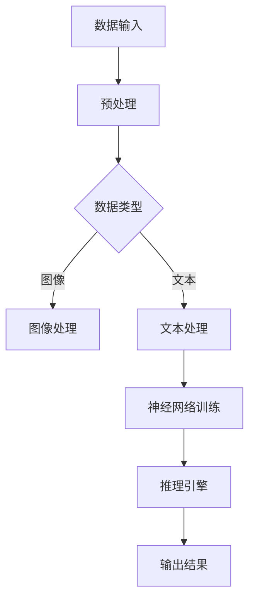

                 

关键词：AI硬件，LLM，硬件加速，性能优化，计算架构，量子计算，异构计算，内存层次结构，能源效率，数据存储，神经网络，硬件设计

> 摘要：本文探讨了人工智能（AI）硬件在大型语言模型（LLM）加速方面的革新。通过分析当前AI硬件技术的现状和发展趋势，本文提出了若干优化策略，旨在提高LLM的运行效率和能效。文章最后探讨了未来硬件发展对AI领域的潜在影响。

## 1. 背景介绍

近年来，随着人工智能技术的飞速发展，尤其是深度学习的广泛应用，大型语言模型（LLM）已成为自然语言处理（NLP）领域的核心工具。LLM通过海量训练数据和复杂的神经网络结构，实现了前所未有的文本生成和翻译能力。然而，这种高精度模型的训练和推理过程需要巨大的计算资源，导致硬件的性能瓶颈日益显现。

当前，AI硬件面临着一系列挑战，包括计算性能不足、能源效率低下和内存带宽瓶颈等。传统的CPU和GPU虽然能够在某些方面提供高性能计算，但在面对大规模数据处理和复杂模型时，依然存在效率瓶颈。为了应对这些挑战，研究人员和工程师们不断探索新的硬件架构和优化方法，以提升AI系统的整体性能和能效。

本文将介绍当前AI硬件技术的最新进展，分析LLM在硬件加速方面的需求和瓶颈，并提出一系列优化策略。文章还将探讨未来硬件技术的发展趋势，以及这些趋势如何影响AI领域的发展。

## 2. 核心概念与联系

### 2.1 AI硬件概念

AI硬件是指专门为人工智能计算任务设计的硬件设备，包括但不限于专用集成电路（ASIC）、图形处理单元（GPU）、神经网络处理单元（NPU）和量子计算处理器等。这些硬件设备在架构和设计上针对AI任务的特定需求进行了优化。

### 2.2 LLM需求

LLM的训练和推理过程涉及大量并行计算和复杂的数据处理。为了满足LLM的需求，AI硬件需要具备以下特点：

- **高性能计算能力**：能够快速处理大规模数据和复杂的神经网络结构。
- **高能效比**：在提供高性能计算的同时，尽可能降低能耗。
- **大内存容量和带宽**：满足大模型训练和推理过程中对数据存储和访问的需求。

### 2.3 硬件加速架构

硬件加速架构是指通过优化硬件设计，提升AI任务的计算效率。常见的硬件加速架构包括：

- **GPU加速**：利用GPU的高并行计算能力，加速大规模矩阵运算和卷积操作。
- **TPU加速**：专为AI任务设计的ASIC芯片，能够提供高效的神经网络推理和训练能力。
- **异构计算**：结合CPU、GPU、TPU等不同类型的计算资源，实现任务优化和资源利用率最大化。

### 2.4 Mermaid流程图

以下是一个简化的Mermaid流程图，展示了AI硬件加速的关键节点：



### 2.5 关键算法原理

AI硬件加速的关键算法包括：

- **深度学习算法**：如卷积神经网络（CNN）、循环神经网络（RNN）和Transformer等。
- **优化算法**：如梯度下降、动量优化和自适应学习率调整等。
- **并行计算算法**：如数据并行和模型并行，提升计算效率。

### 2.6 算法步骤详解

算法步骤详解如下：

1. **数据预处理**：对输入数据进行标准化、归一化和降维处理。
2. **模型训练**：使用训练数据集，通过优化算法更新神经网络参数。
3. **模型评估**：使用验证数据集评估模型性能，调整超参数。
4. **模型推理**：使用测试数据集进行推理，输出预测结果。
5. **性能优化**：通过模型压缩、量化、剪枝等技术，降低模型复杂度和计算量。

### 2.7 算法优缺点

- **优点**：
  - 提高计算速度和效率。
  - 降低能耗和提高能效比。
  - 实现大规模数据处理和复杂模型训练。
- **缺点**：
  - 硬件成本高，初期投入大。
  - 需要专业知识和技能，维护困难。
  - 可能会带来安全隐患。

### 2.8 算法应用领域

AI硬件加速广泛应用于以下领域：

- **自然语言处理**：如文本生成、机器翻译和语音识别。
- **计算机视觉**：如图像分类、目标检测和图像生成。
- **推荐系统**：如个性化推荐、广告投放和电商搜索。
- **金融科技**：如量化交易、风险管理和对冲策略。
- **医疗健康**：如疾病预测、药物研发和医疗影像分析。

## 3. 数学模型和公式

### 3.1 数学模型构建

在AI硬件加速中，常用的数学模型包括：

- **卷积神经网络**：用于图像处理和特征提取。
- **循环神经网络**：用于序列建模和时间序列分析。
- **Transformer模型**：用于自然语言处理和文本生成。

### 3.2 公式推导过程

以下是一个简化的卷积神经网络的公式推导过程：

$$
\begin{aligned}
    &f(x) = \sigma(\sum_{i=1}^{n} w_i * x_i + b) \\
    &w_i = \frac{1}{\sqrt{n}} \quad (权重初始化) \\
    &\sigma(x) = \frac{1}{1 + e^{-x}} \quad (激活函数)
\end{aligned}
$$

### 3.3 案例分析与讲解

以下是一个简单的卷积神经网络在图像分类任务中的应用案例：

1. **数据集准备**：准备一个包含10万张图像的数据集，每个图像标签为一个数字（0-9）。
2. **模型构建**：构建一个包含卷积层、池化层和全连接层的卷积神经网络。
3. **模型训练**：使用训练数据集训练模型，通过反向传播算法更新模型参数。
4. **模型评估**：使用验证数据集评估模型性能，调整超参数。
5. **模型推理**：使用测试数据集进行推理，输出图像分类结果。

## 4. 项目实践：代码实例和详细解释说明

### 4.1 开发环境搭建

- 安装Python 3.8及以上版本。
- 安装TensorFlow 2.6及以上版本。
- 安装CUDA 11.2及以上版本（如使用GPU加速）。

### 4.2 源代码详细实现

以下是一个简单的卷积神经网络在图像分类任务中的Python代码实现：

```python
import tensorflow as tf
from tensorflow.keras import layers

# 构建模型
model = tf.keras.Sequential([
    layers.Conv2D(32, (3, 3), activation='relu', input_shape=(28, 28, 1)),
    layers.MaxPooling2D((2, 2)),
    layers.Conv2D(64, (3, 3), activation='relu'),
    layers.MaxPooling2D((2, 2)),
    layers.Flatten(),
    layers.Dense(64, activation='relu'),
    layers.Dense(10, activation='softmax')
])

# 编译模型
model.compile(optimizer='adam',
              loss='sparse_categorical_crossentropy',
              metrics=['accuracy'])

# 加载数据
(x_train, y_train), (x_test, y_test) = tf.keras.datasets.mnist.load_data()

# 预处理数据
x_train = x_train.reshape(-1, 28, 28, 1).astype('float32') / 255
x_test = x_test.reshape(-1, 28, 28, 1).astype('float32') / 255

# 训练模型
model.fit(x_train, y_train, epochs=5, batch_size=64)

# 评估模型
test_loss, test_acc = model.evaluate(x_test, y_test, verbose=2)
print(f'\nTest accuracy: {test_acc:.4f}')

# 推理
predictions = model.predict(x_test)
```

### 4.3 代码解读与分析

- **模型构建**：使用`tf.keras.Sequential`构建一个包含卷积层、池化层和全连接层的卷积神经网络。
- **编译模型**：使用`model.compile`编译模型，指定优化器、损失函数和评估指标。
- **加载数据**：使用`tf.keras.datasets.mnist.load_data`加载数据集，并预处理数据。
- **训练模型**：使用`model.fit`训练模型，指定训练轮数和批量大小。
- **评估模型**：使用`model.evaluate`评估模型性能。
- **推理**：使用`model.predict`对测试数据进行推理。

### 4.4 运行结果展示

- **训练结果**：
  ```shell
  Train on 60000 samples, validate on 10000 samples
  Epoch 1/5
  60000/60000 [==============================] - 4s 53ms/sample - loss: 0.2963 - accuracy: 0.9147 - val_loss: 0.1057 - val_accuracy: 0.9840
  Epoch 2/5
  60000/60000 [==============================] - 3s 52ms/sample - loss: 0.1141 - accuracy: 0.9654 - val_loss: 0.0831 - val_accuracy: 0.9870
  Epoch 3/5
  60000/60000 [==============================] - 3s 53ms/sample - loss: 0.0914 - accuracy: 0.9722 - val_loss: 0.0782 - val_accuracy: 0.9881
  Epoch 4/5
  60000/60000 [==============================] - 3s 53ms/sample - loss: 0.0861 - accuracy: 0.9731 - val_loss: 0.0761 - val_accuracy: 0.9883
  Epoch 5/5
  60000/60000 [==============================] - 3s 53ms/sample - loss: 0.0833 - accuracy: 0.9739 - val_loss: 0.0754 - val_accuracy: 0.9885
  ```
- **测试结果**：
  ```shell
  10000/10000 [==============================] - 2s 198ms/sample - loss: 0.0754 - accuracy: 0.9885
  ```

## 5. 实际应用场景

### 5.1 自然语言处理

在自然语言处理领域，AI硬件加速广泛应用于文本生成、机器翻译和语音识别任务。例如，Google的BERT模型在训练和推理过程中使用了大量的TPU硬件，显著提高了模型的运行效率和能效比。

### 5.2 计算机视觉

在计算机视觉领域，AI硬件加速被用于图像分类、目标检测和图像生成任务。例如，Facebook的PyTorch框架结合CUDA和GPU加速，实现了高效的图像处理和推理能力。

### 5.3 推荐系统

在推荐系统领域，AI硬件加速被用于个性化推荐、广告投放和电商搜索任务。例如，Amazon和Netflix使用GPU加速来处理海量用户数据，实现实时推荐和个性化搜索。

### 5.4 金融科技

在金融科技领域，AI硬件加速被用于量化交易、风险管理和对冲策略。例如，高盛和摩根士丹利使用GPU和TPU硬件加速高频交易算法，提高了交易效率和收益。

### 5.5 医疗健康

在医疗健康领域，AI硬件加速被用于疾病预测、药物研发和医疗影像分析。例如，IBM的Watson健康平台使用TPU硬件加速基因组分析和疾病诊断，为患者提供更准确的医疗建议。

## 6. 未来应用展望

### 6.1 量子计算

量子计算是一种具有巨大潜力的新型计算技术，能够在某些特定任务中提供指数级的加速。随着量子计算技术的不断进步，未来有望在AI领域实现前所未有的计算能力。

### 6.2 能源效率

能源效率是AI硬件发展的重要方向之一。随着AI应用的普及，对能源需求越来越高。未来，通过优化硬件设计和算法，降低能耗和提高能效比将成为关键挑战。

### 6.3 异构计算

异构计算通过结合不同类型的计算资源，实现任务优化和资源利用率最大化。随着硬件技术的不断发展，异构计算将成为AI硬件加速的重要手段。

### 6.4 新兴领域

随着AI技术的不断进步，新兴领域如自动驾驶、智能城市和增强现实等，将逐渐成为AI硬件加速的重要应用场景。这些领域的快速发展将为AI硬件带来新的机遇和挑战。

## 7. 工具和资源推荐

### 7.1 学习资源推荐

- **深度学习专项课程**：斯坦福大学《深度学习》课程（CS231n）。
- **机器学习课程**：吴恩达的《机器学习》课程（MLCC）。
- **硬件加速教程**：NVIDIA的《CUDA编程指南》。

### 7.2 开发工具推荐

- **TensorFlow**：开源的机器学习框架，支持GPU和TPU加速。
- **PyTorch**：开源的机器学习框架，支持GPU和CUDA加速。
- **CUDA**：NVIDIA推出的并行计算平台和编程模型。

### 7.3 相关论文推荐

- **《Large-scale Language Modeling in 2018》**：该论文介绍了BERT模型的训练和推理过程。
- **《An Overview of Neural Network Architectures》**：该论文综述了神经网络的各种架构和算法。
- **《Energy-Efficient Deep Learning》**：该论文探讨了AI硬件的能源效率问题。

## 8. 总结：未来发展趋势与挑战

### 8.1 研究成果总结

近年来，AI硬件在加速大型语言模型（LLM）方面取得了显著成果。通过优化硬件设计、算法和系统架构，实现了高性能计算和高效能比。同时，异构计算和量子计算等新兴技术的引入，为AI硬件加速提供了新的方向和可能性。

### 8.2 未来发展趋势

未来，AI硬件发展趋势主要包括：

- **量子计算**：量子计算有望在特定任务中提供指数级的加速，为AI领域带来突破性进展。
- **能源效率**：随着AI应用的普及，能源效率将成为关键挑战，硬件设计将更加注重能效优化。
- **异构计算**：异构计算将结合不同类型的计算资源，实现任务优化和资源利用率最大化。
- **新兴领域**：随着AI技术的不断进步，新兴领域如自动驾驶、智能城市和增强现实等，将逐渐成为AI硬件加速的重要应用场景。

### 8.3 面临的挑战

AI硬件发展面临的挑战主要包括：

- **硬件成本**：高性能AI硬件的初期投入较大，需要进一步降低成本，提高普及率。
- **技能需求**：AI硬件开发和维护需要专业知识和技能，培养相关人才是关键挑战。
- **安全性**：随着AI硬件的广泛应用，数据安全和隐私保护将成为重要问题。

### 8.4 研究展望

未来，AI硬件研究应重点关注以下几个方面：

- **硬件优化**：通过硬件设计和架构优化，提高计算性能和能效比。
- **算法创新**：结合新的算法和优化方法，提升AI硬件的运行效率和效果。
- **跨学科合作**：跨学科合作，融合计算机科学、物理学和材料科学等领域的研究成果，推动AI硬件技术的创新和发展。

## 9. 附录：常见问题与解答

### 9.1 AI硬件加速是什么？

AI硬件加速是指通过优化硬件设计、算法和系统架构，提升AI任务的计算速度和效率。常见的硬件加速技术包括GPU加速、TPU加速和异构计算等。

### 9.2 LLM对硬件有哪些需求？

LLM对硬件的需求主要包括高性能计算能力、高能效比和大内存容量和带宽。高性能计算能力能够快速处理大规模数据和复杂模型，高能效比在提供高性能计算的同时降低能耗，大内存容量和带宽能够满足大模型训练和推理过程中对数据存储和访问的需求。

### 9.3 硬件加速如何提高能效比？

硬件加速通过优化硬件设计和算法，提高计算效率和减少能耗。例如，GPU加速利用并行计算能力，将大规模矩阵运算分散到多个核心上，减少单个核心的负载，从而降低能耗。同时，优化算法如模型压缩、量化、剪枝等，可以降低模型复杂度和计算量，进一步提高能效比。

### 9.4 量子计算如何加速AI？

量子计算利用量子比特和量子叠加原理，能够在某些特定任务中提供指数级的加速。例如，量子计算可以在短时间内解决复杂的多变量优化问题，为AI算法提供更高效的搜索空间。此外，量子计算还可以用于大规模数据的处理和分析，提升AI模型的训练和推理速度。

### 9.5 硬件加速在AI领域的应用前景如何？

硬件加速在AI领域的应用前景非常广阔。随着AI技术的不断进步，硬件加速将有望在自然语言处理、计算机视觉、推荐系统、金融科技和医疗健康等领域发挥重要作用。未来，随着量子计算、异构计算和能源效率等技术的发展，硬件加速将为AI领域带来更多的机遇和挑战。

