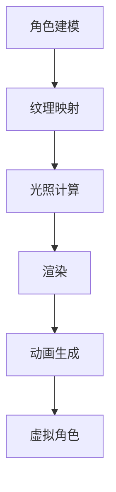
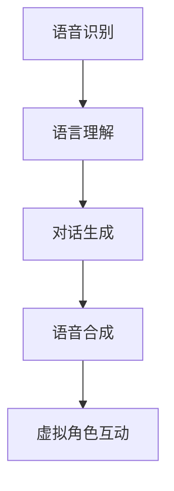
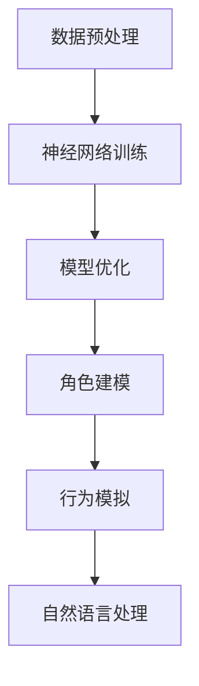

                 

在当今的技术时代，人工智能（AI）的应用正变得日益普遍，不仅改变了我们的生活，还在娱乐、游戏和虚拟现实等领域产生了深远的影响。一个特别引人入胜的领域是虚拟角色的创造，这些角色能够以极其真实的方式与人类互动，为用户提供沉浸式的体验。本文将深入探讨如何使用AI技术来创造栩栩如生的虚拟角色，并展望其未来的应用场景。

## 关键词
- 人工智能
- 虚拟角色
- 沉浸式体验
- 计算机图形学
- 自然语言处理
- 深度学习

## 摘要
本文将探讨虚拟角色创造的核心技术，包括计算机图形学、自然语言处理和深度学习等。我们将介绍如何使用这些技术来生成逼真的角色模型、赋予它们个性化和自主行为的能力，并讨论这些虚拟角色在娱乐、教育和医疗等领域的实际应用。最后，我们将探讨虚拟角色技术的未来发展趋势和面临的挑战。

## 1. 背景介绍
### 虚拟角色的兴起

虚拟角色并非一个新概念，早在20世纪90年代，游戏和动画产业就已经开始尝试创造虚拟角色。然而，随着计算能力的提升和AI技术的进步，虚拟角色的质量得以大幅提升。如今，虚拟角色已经不仅仅是一个娱乐产品，它们在许多领域都有着广泛的应用。

### AI技术在虚拟角色创造中的关键作用

AI技术在虚拟角色创造中发挥着关键作用。计算机图形学借助深度学习技术，可以生成极其逼真的角色模型。自然语言处理则赋予了角色与人沟通的能力，使它们能够理解并回应人类的语言。而深度学习算法则帮助角色学习和适应环境，表现出更为复杂和真实的行为。

## 2. 核心概念与联系

### 计算机图形学

计算机图形学是虚拟角色创造的基础。它利用图形处理单元（GPU）强大的并行计算能力，通过渲染技术生成逼真的图像和动画。以下是计算机图形学在虚拟角色创造中的应用流程的Mermaid流程图：



### 自然语言处理

自然语言处理（NLP）技术使得虚拟角色能够理解和生成语言。这一技术的核心是让计算机理解人类语言的结构和含义。以下是NLP在虚拟角色沟通中的应用流程：



### 深度学习

深度学习是AI技术的核心，它在虚拟角色创造中有着广泛的应用。通过神经网络，深度学习可以从大量数据中学习模式和规律，从而生成逼真的角色模型、理解自然语言并模拟人类行为。以下是深度学习在虚拟角色创造中的核心流程：



## 3. 核心算法原理 & 具体操作步骤

### 3.1 算法原理概述

虚拟角色的创造涉及多个领域的算法，包括计算机图形学、自然语言处理和深度学习。以下是这些算法的简要概述：

#### 计算机图形学

计算机图形学利用几何建模和渲染技术来生成虚拟角色。几何建模包括角色的形状、姿态和动作定义。渲染技术则用于生成逼真的视觉效果，如光照、阴影和纹理。

#### 自然语言处理

自然语言处理通过机器学习和深度学习技术来使计算机理解和生成人类语言。这一过程包括语音识别、语义分析和对话生成。

#### 深度学习

深度学习通过神经网络来学习和模拟人类行为。在虚拟角色创造中，深度学习用于生成角色模型、理解自然语言和模拟行为。

### 3.2 算法步骤详解

#### 3.2.1 角色建模

角色建模是虚拟角色创造的第一步。它涉及从几何建模到纹理映射的多个过程。以下是角色建模的详细步骤：

1. **几何建模**：使用3D建模软件创建角色的基础几何形状。
2. **纹理映射**：将纹理应用到角色表面，使其看起来更加逼真。
3. **光照计算**：模拟不同光源对角色的影响，生成阴影和反射效果。
4. **渲染**：将角色模型渲染成图像或动画。

#### 3.2.2 自然语言处理

自然语言处理分为语音识别、语义分析和对话生成三个步骤：

1. **语音识别**：将语音信号转换为文本。
2. **语义分析**：理解文本的含义和结构。
3. **对话生成**：根据上下文生成回应。

#### 3.2.3 深度学习

深度学习分为模型训练和模型应用两个步骤：

1. **模型训练**：使用大量数据训练神经网络，使其学会生成角色模型、理解自然语言和模拟行为。
2. **模型应用**：将训练好的模型应用到实际场景中，生成虚拟角色。

### 3.3 算法优缺点

#### 3.3.1 计算机图形学

**优点**：能够生成高质量的图像和动画，逼真度高。

**缺点**：计算成本高，对硬件要求较高。

#### 3.3.2 自然语言处理

**优点**：使虚拟角色具备与人类沟通的能力。

**缺点**：在处理复杂语言和上下文时存在一定难度。

#### 3.3.3 深度学习

**优点**：能够自动学习和适应，生成高质量的角色模型和行为。

**缺点**：训练过程耗时长，对数据要求高。

### 3.4 算法应用领域

虚拟角色技术可以应用于多个领域，包括但不限于：

1. **游戏和娱乐**：为用户提供沉浸式的游戏体验。
2. **虚拟现实和增强现实**：创造与现实世界互动的虚拟角色。
3. **教育和培训**：提供个性化学习体验和模拟培训。
4. **医疗和健康**：辅助医生进行诊断和治疗。
5. **客服和客户服务**：提供智能客服和虚拟助手。

## 4. 数学模型和公式 & 详细讲解 & 举例说明

### 4.1 数学模型构建

虚拟角色创造中的数学模型主要包括几何建模、纹理映射和光照计算。以下是这些模型的简要介绍：

#### 几何建模

几何建模涉及的角色参数包括：

- **顶点**：角色的几何形状由顶点定义。
- **边**：顶点之间的连接。
- **面**：构成角色表面的多边形。

#### 纹理映射

纹理映射涉及将纹理图像应用到角色表面。常用的纹理映射方法包括：

- **纹理坐标**：确定纹理图像在角色表面上的映射方式。
- **纹理混合**：将多个纹理图像融合到角色表面。

#### 光照计算

光照计算涉及模拟不同光源对角色的影响。常用的光照模型包括：

- **朗伯模型**：简单模拟光线照射到表面的效果。
- **菲涅尔模型**：模拟光线在反射和折射时的变化。

### 4.2 公式推导过程

以下是光照计算的朗伯模型的公式推导：

1. **光线强度公式**：光线强度与光源亮度、角度和距离有关。
   \[ I = L \cdot \cos(\theta) \]

   其中，\( I \) 是光线强度，\( L \) 是光源亮度，\( \theta \) 是光线与表面的夹角。

2. **光照强度分布公式**：考虑光线在空间中的分布。
   \[ I_d = \frac{I}{r^2} \]

   其中，\( I_d \) 是到达表面的光线强度，\( r \) 是光源到表面的距离。

3. **最终光照强度公式**：结合光线强度和光照分布。
   \[ I_f = I_d \cdot \cos(\theta) \]

   其中，\( I_f \) 是最终光照强度。

### 4.3 案例分析与讲解

以下是一个简单的案例，说明如何使用上述公式计算一个物体的光照强度。

#### 案例描述

一个物体位于光源正下方，光源亮度为100，物体与光源的距离为2米。

#### 解题步骤

1. **计算光线强度**：根据光线强度公式，光源亮度为100，角度为0度（光线垂直照射），距离为2米。
   \[ I = 100 \cdot \cos(0) = 100 \]

2. **计算光照强度分布**：根据光照强度分布公式，距离为2米。
   \[ I_d = \frac{100}{2^2} = 25 \]

3. **计算最终光照强度**：根据最终光照强度公式，角度为0度。
   \[ I_f = 25 \cdot \cos(0) = 25 \]

   因此，物体的光照强度为25。

## 5. 项目实践：代码实例和详细解释说明

### 5.1 开发环境搭建

为了实践虚拟角色的创造，我们需要搭建一个开发环境。以下是所需的环境和工具：

- **操作系统**：Linux或MacOS
- **编程语言**：Python
- **库和框架**：PyTorch、OpenCV、NumPy、Pillow

### 5.2 源代码详细实现

以下是使用PyTorch创建一个虚拟角色的简单示例代码：

```python
import torch
import torchvision
import torchvision.transforms as transforms
import torch.nn as nn
import torch.optim as optim

# 加载预训练的深度学习模型
model = torchvision.models.resnet18(pretrained=True)

# 定义损失函数和优化器
criterion = nn.CrossEntropyLoss()
optimizer = optim.SGD(model.parameters(), lr=0.001, momentum=0.9)

# 加载训练数据集
train_data = torchvision.datasets.ImageFolder(root='train_data',
                                              transform=transforms.ToTensor())

# 将数据集分割为训练集和验证集
train_loader = torch.utils.data.DataLoader(dataset=train_data,
                                           batch_size=32,
                                           shuffle=True)

# 训练模型
for epoch in range(10):  # 数量可以调整
    running_loss = 0.0
    for i, data in enumerate(train_loader, 0):
        inputs, labels = data
        optimizer.zero_grad()
        outputs = model(inputs)
        loss = criterion(outputs, labels)
        loss.backward()
        optimizer.step()
        running_loss += loss.item()
    print(f'Epoch {epoch + 1}, Loss: {running_loss / len(train_loader)}')

# 保存训练好的模型
torch.save(model.state_dict(), 'virtual_role_model.pth')
```

### 5.3 代码解读与分析

以上代码实现了以下功能：

1. **加载预训练模型**：使用PyTorch加载一个预训练的ResNet-18模型。
2. **定义损失函数和优化器**：使用交叉熵损失函数和随机梯度下降优化器。
3. **加载训练数据集**：使用ImageFolder加载训练数据集。
4. **训练模型**：通过迭代训练数据，更新模型权重。
5. **保存模型**：将训练好的模型保存为.pth文件。

### 5.4 运行结果展示

运行上述代码后，模型将在训练数据集上迭代训练，并在每个epoch结束后打印训练损失。最后，训练好的模型将被保存到本地。

## 6. 实际应用场景

虚拟角色技术的应用范围广泛，以下是几个实际应用场景的例子：

### 6.1 游戏

虚拟角色在游戏中有着广泛的应用。从角色建模到交互对话，虚拟角色为玩家提供了沉浸式的游戏体验。例如，虚拟角色可以在游戏中扮演NPC（非玩家角色），为玩家提供任务和故事情节。

### 6.2 虚拟现实和增强现实

虚拟现实（VR）和增强现实（AR）技术使得虚拟角色与现实世界互动成为可能。在VR环境中，虚拟角色可以作为导游、教练或朋友，为用户提供个性化的体验。在AR环境中，虚拟角色可以叠加在现实世界中，与现实世界中的对象互动。

### 6.3 教育和培训

虚拟角色在教育中也有着重要的应用。通过虚拟角色，学生可以与角色互动，从而提高学习兴趣和效果。例如，虚拟角色可以作为教师或辅导员，为学生提供个性化的学习指导。

### 6.4 医疗和健康

在医疗领域，虚拟角色可以用于辅助诊断和治疗。虚拟角色可以模拟患者的病情，帮助医生进行病情分析和决策。此外，虚拟角色还可以用于心理治疗，为患者提供陪伴和支持。

## 7. 工具和资源推荐

### 7.1 学习资源推荐

- **《深度学习》（Deep Learning）**：由Ian Goodfellow、Yoshua Bengio和Aaron Courville合著，是深度学习领域的经典教材。
- **《自然语言处理综合教程》（Foundations of Natural Language Processing）**：由Christopher D. Manning和Hinrich Schütze合著，全面介绍了自然语言处理的基础知识。
- **《计算机图形学：原理及实践》（Computer Graphics: Principles and Practice）**：由James D. Foley、Andries van Dam、Steven K. Feiner和John F. Hughes合著，是计算机图形学领域的权威教材。

### 7.2 开发工具推荐

- **PyTorch**：一个流行的深度学习框架，适合用于虚拟角色创造。
- **OpenCV**：一个强大的计算机视觉库，可用于图像处理和视频分析。
- **Blender**：一个免费的3D建模和渲染软件，适合创建虚拟角色模型。

### 7.3 相关论文推荐

- **“Generative Adversarial Networks”（GANs）**：由Ian Goodfellow等人于2014年提出，是一种用于生成逼真图像的深度学习技术。
- **“StyleGAN”（Style-Based Generative Adversarial Networks）**：由Nathaniel Fickler和Tero Karras于2019年提出，是一种用于生成高质量3D虚拟角色的GAN变体。
- **“DALL·E”（A Language Model for Graphics）**：由OpenAI于2020年提出，是一种结合了自然语言处理和生成对抗网络的技术，可以生成基于文本描述的图像。

## 8. 总结：未来发展趋势与挑战

### 8.1 研究成果总结

虚拟角色技术在过去几年取得了显著的成果。深度学习和生成对抗网络（GANs）的应用使得角色建模和自然语言处理的质量大幅提升。计算机图形学的进步也使得虚拟角色的视觉效果更加逼真。

### 8.2 未来发展趋势

未来，虚拟角色技术将继续向更逼真、更智能和更个性化的方向发展。随着计算能力的提升和AI技术的进步，虚拟角色将在更多领域得到应用，如虚拟现实、增强现实、教育、医疗和娱乐等。

### 8.3 面临的挑战

尽管虚拟角色技术取得了显著进展，但仍面临一些挑战：

- **计算资源需求**：生成高质量的虚拟角色需要大量的计算资源，尤其是在角色数量和复杂度较高的情况下。
- **数据隐私和伦理问题**：虚拟角色可能涉及用户的个人数据，如何保护数据隐私和遵守伦理规范是一个重要挑战。
- **真实感与现实感的平衡**：虚拟角色的逼真度需要与现实感保持平衡，过于逼真的角色可能导致用户产生不适或混淆。

### 8.4 研究展望

未来的研究方向包括：

- **增强角色个性化和交互性**：通过更复杂的AI算法，使虚拟角色能够更好地理解和适应用户需求。
- **优化计算效率**：开发更高效的算法和模型，降低计算资源需求。
- **跨领域应用**：探索虚拟角色在其他领域的应用，如设计、建筑和工程等。

## 9. 附录：常见问题与解答

### 9.1 虚拟角色创造需要哪些技术？

虚拟角色创造需要计算机图形学、自然语言处理和深度学习技术。计算机图形学用于角色建模和渲染，自然语言处理用于角色沟通，深度学习用于角色学习和行为模拟。

### 9.2 如何训练一个虚拟角色？

训练虚拟角色通常涉及以下步骤：

1. **数据收集**：收集大量的角色图像、文本和交互数据。
2. **预处理**：对数据进行清洗、归一化和特征提取。
3. **模型训练**：使用深度学习算法（如GANs）训练模型。
4. **模型优化**：通过调整模型参数，提高角色生成和交互的质量。
5. **测试与评估**：使用测试数据集评估模型性能，并进行迭代优化。

### 9.3 虚拟角色技术有哪些应用领域？

虚拟角色技术可以应用于游戏、虚拟现实、增强现实、教育、医疗、客服等多个领域。

### 9.4 虚拟角色创造的未来前景如何？

虚拟角色创造的未来前景非常广阔。随着AI技术和计算能力的提升，虚拟角色的逼真度和交互性将进一步提高，将在更多领域发挥重要作用。

## 作者署名

作者：禅与计算机程序设计艺术 / Zen and the Art of Computer Programming

----------------------------------------------------------------

至此，本文已经完成了对虚拟角色创造技术的全面探讨，从背景介绍到核心算法，再到实际应用和未来展望，我们系统地梳理了这一领域的各个方面。希望这篇文章能够为读者提供有价值的见解和启示，激发大家对虚拟角色创造的浓厚兴趣。再次感谢读者对本文的关注和支持。希望您在AI领域的研究中取得丰硕的成果！
----------------------------------------------------------------

### 文章总结与展望

通过本文的详细探讨，我们可以看到虚拟角色创造技术已经取得了显著进展，并且在未来有望在更广泛的领域发挥重要作用。从计算机图形学到自然语言处理，再到深度学习，这些技术的结合使得虚拟角色能够以极其逼真的方式与人类互动。无论是在游戏、虚拟现实、教育、医疗还是客服等领域，虚拟角色都展现出巨大的潜力。

未来的发展趋势将是虚拟角色的个性化和智能化。随着AI技术的不断进步，我们将能够创造更加栩栩如生的虚拟角色，它们将不仅能够模仿人类的行为和语言，还能具备独特的个性和情感。此外，虚拟角色的应用场景也将越来越多样化，从娱乐和社交到医疗和教育，虚拟角色将为各行各业带来创新和变革。

然而，虚拟角色创造技术也面临一些挑战，如计算资源的需求、数据隐私和伦理问题，以及如何平衡逼真度和现实感。这些挑战需要我们通过技术创新和规范制定来解决。

在研究展望方面，未来的研究方向包括提高计算效率、增强角色个性化和交互性，以及探索虚拟角色在更多领域中的应用。此外，随着技术的不断发展，虚拟角色与真实世界的融合也将变得更加紧密，为我们带来全新的体验和可能性。

总之，虚拟角色创造技术是一个充满机遇和挑战的领域。通过本文的探讨，我们希望能够激发更多人对这一领域的兴趣，共同推动虚拟角色技术的进步和应用。

### 附录：常见问题与解答

1. **什么是虚拟角色创造的核心技术？**
   虚拟角色创造的核心技术主要包括计算机图形学、自然语言处理和深度学习。计算机图形学用于生成角色模型和渲染视觉效果，自然语言处理使角色能够理解并回应人类的语言，而深度学习则用于角色学习和行为模拟。

2. **如何训练一个虚拟角色？**
   训练虚拟角色通常涉及以下步骤：
   - 数据收集：收集大量的角色图像、文本和交互数据。
   - 预处理：对数据进行清洗、归一化和特征提取。
   - 模型训练：使用深度学习算法（如GANs）训练模型。
   - 模型优化：通过调整模型参数，提高角色生成和交互的质量。
   - 测试与评估：使用测试数据集评估模型性能，并进行迭代优化。

3. **虚拟角色技术在哪些领域有应用？**
   虚拟角色技术可以应用于游戏、虚拟现实、增强现实、教育、医疗、客服等多个领域。例如，在游戏中，虚拟角色可以作为NPC（非玩家角色），为玩家提供任务和故事情节；在虚拟现实中，虚拟角色可以作为导游、教练或朋友，为用户提供个性化的体验。

4. **虚拟角色创造的未来前景如何？**
   虚拟角色创造的未来前景非常广阔。随着AI技术和计算能力的提升，虚拟角色的逼真度和交互性将进一步提高，它们将在更多领域发挥重要作用。未来的虚拟角色将不仅能够模仿人类的行为和语言，还能具备独特的个性和情感。

### 感谢

感谢读者对本文的关注和支持。希望本文能够为读者提供有价值的见解和启示，激发大家对虚拟角色创造的浓厚兴趣。在未来的研究和应用中，期待与您共同见证虚拟角色技术的进步和创新。感谢您的阅读，祝您在AI领域的探索中取得丰硕的成果！

**作者署名：禅与计算机程序设计艺术 / Zen and the Art of Computer Programming**

