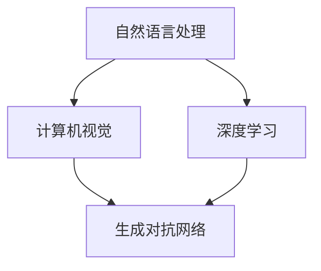

                 

关键词：虚拟角色，角色扮演，人工智能，自然语言处理，计算机图形学

> 摘要：本文探讨了利用人工智能技术创建栩栩如生的虚拟角色的方法，从背景介绍到核心算法原理，再到数学模型和项目实践，深入分析了虚拟角色在人工智能领域的重要性和未来发展前景。

## 1. 背景介绍

虚拟角色在当今的数字世界中扮演着越来越重要的角色。从游戏、电影到社交媒体，虚拟角色不仅为用户提供了一种新的互动方式，还极大地丰富了虚拟世界的体验。随着人工智能技术的快速发展，尤其是自然语言处理和计算机图形学的进步，创造栩栩如生的虚拟角色已经成为一个热门的研究领域。

本文旨在探讨如何利用人工智能技术，尤其是深度学习和生成对抗网络（GANs），来创建具有高度真实感的虚拟角色。通过分析核心算法原理和数学模型，我们希望能够为读者提供一种系统化的方法来理解和实现这一目标。

### 1.1 虚拟角色的应用领域

虚拟角色的应用领域广泛，主要包括：

- **游戏与娱乐**：虚拟角色在电子游戏中扮演着各种角色，从主角到NPC（非玩家角色），它们为玩家提供了丰富的互动体验。
- **电影与动画**：虚拟角色在电影和动画制作中发挥了重要作用，通过计算机图形学技术，可以创造出逼真的动画角色。
- **虚拟现实与增强现实**：虚拟角色在VR（虚拟现实）和AR（增强现实）技术中，为用户提供了一种沉浸式的互动体验。
- **社交媒体与直播**：虚拟角色在社交媒体和直播平台上成为了一种新的流行趋势，它们可以代表真实用户进行直播、互动和娱乐。

### 1.2 人工智能技术在虚拟角色创建中的应用

人工智能技术在虚拟角色创建中的应用主要体现在以下几个方面：

- **自然语言处理（NLP）**：通过NLP技术，虚拟角色可以理解和生成自然语言，实现与用户的对话交互。
- **计算机视觉**：计算机视觉技术使虚拟角色能够识别和理解现实世界中的图像和场景，从而实现更加自然的交互。
- **深度学习**：深度学习技术，尤其是卷积神经网络（CNNs）和生成对抗网络（GANs），用于生成逼真的虚拟角色图像和动画。
- **生成对抗网络（GANs）**：GANs是一种强大的深度学习模型，用于生成高质量的虚拟角色图像，通过对抗生成器与判别器的博弈，生成器不断优化生成的图像质量。

## 2. 核心概念与联系

为了更好地理解如何利用人工智能技术创建虚拟角色，我们需要先了解一些核心概念和它们之间的联系。以下是一个简要的Mermaid流程图，展示了虚拟角色创建过程中的关键环节。



### 2.1 自然语言处理（NLP）

自然语言处理是使虚拟角色能够理解和生成自然语言的技术。它包括语音识别、语义理解、文本生成等子领域。通过NLP，虚拟角色可以与用户进行对话，提供个性化的交互体验。

### 2.2 计算机视觉

计算机视觉技术使虚拟角色能够识别和理解现实世界中的图像和场景。它包括图像识别、图像生成、图像增强等子领域。计算机视觉技术不仅使虚拟角色更加逼真，还使它们能够与环境进行交互。

### 2.3 深度学习

深度学习是使虚拟角色能够自主学习和优化的技术。它包括神经网络、卷积神经网络（CNNs）、循环神经网络（RNNs）等子领域。通过深度学习，虚拟角色可以不断优化自己的行为和交互方式。

### 2.4 生成对抗网络（GANs）

生成对抗网络是一种强大的深度学习模型，用于生成高质量的虚拟角色图像。它由生成器（Generator）和判别器（Discriminator）两部分组成，通过对抗生成器与判别器的博弈，生成器不断优化生成的图像质量。

## 3. 核心算法原理 & 具体操作步骤

### 3.1 算法原理概述

在虚拟角色创建过程中，生成对抗网络（GANs）是一种核心算法。GANs由两部分组成：生成器和判别器。

- **生成器（Generator）**：生成器是一个神经网络，用于生成虚拟角色的图像。它通过学习真实图像数据，生成与真实图像相似的新图像。
- **判别器（Discriminator）**：判别器也是一个神经网络，用于判断输入的图像是真实图像还是生成图像。它通过比较真实图像和生成图像，学习区分两者的能力。

在GANs的训练过程中，生成器和判别器相互对抗。生成器的目标是生成逼真的图像，以便判别器无法区分它们与真实图像的差异。而判别器的目标是准确地区分真实图像和生成图像。通过这种对抗过程，生成器逐渐优化生成的图像质量，直到判别器无法准确地区分两者。

### 3.2 算法步骤详解

以下是利用生成对抗网络（GANs）创建虚拟角色的具体操作步骤：

#### 3.2.1 数据预处理

1. **收集数据**：收集大量的虚拟角色图像数据，包括不同表情、姿态和场景的图像。
2. **数据清洗**：对收集到的数据进行清洗，去除噪声和错误数据。
3. **数据增强**：通过旋转、缩放、裁剪等操作，增加数据的多样性。

#### 3.2.2 模型架构设计

1. **设计生成器**：设计一个神经网络架构，用于生成虚拟角色的图像。通常，生成器由多个卷积层和反卷积层组成。
2. **设计判别器**：设计一个神经网络架构，用于判断输入的图像是真实图像还是生成图像。判别器通常由多个卷积层组成。

#### 3.2.3 模型训练

1. **初始化模型**：初始化生成器和判别器的参数。
2. **训练生成器**：在生成器训练过程中，每次迭代都会生成一批新的虚拟角色图像，并将其输入到判别器中。生成器的目标是使判别器无法准确地区分真实图像和生成图像。
3. **训练判别器**：在判别器训练过程中，每次迭代都会输入一批真实图像和生成图像，判别器的目标是准确地区分真实图像和生成图像。

#### 3.2.4 模型评估与优化

1. **模型评估**：通过评估生成器的性能，例如生成图像的PSNR（峰值信噪比）和SSIM（结构相似性指数），来判断模型是否达到预期效果。
2. **模型优化**：根据评估结果，调整生成器和判别器的参数，优化模型性能。

### 3.3 算法优缺点

#### 优点

- **强大的生成能力**：GANs能够生成高质量的虚拟角色图像，具有很高的真实感。
- **灵活性和泛化能力**：GANs可以应用于各种虚拟角色创建场景，具有很好的泛化能力。

#### 缺点

- **训练困难**：GANs的训练过程不稳定，容易出现模式崩溃和梯度消失等问题。
- **计算资源消耗大**：GANs的训练需要大量的计算资源，训练时间较长。

### 3.4 算法应用领域

GANs在虚拟角色创建领域有广泛的应用，例如：

- **游戏开发**：用于生成逼真的游戏角色和场景。
- **影视动画**：用于生成高质量的电影和动画角色。
- **虚拟现实与增强现实**：用于生成逼真的虚拟角色，提高用户的沉浸体验。

## 4. 数学模型和公式 & 详细讲解 & 举例说明

### 4.1 数学模型构建

生成对抗网络（GANs）的数学模型可以分为两部分：生成器（Generator）和判别器（Discriminator）。

#### 4.1.1 生成器

生成器的目标是生成逼真的虚拟角色图像。其数学模型可以表示为：

\[ G(z) = \mathcal{X} \]

其中，\( G \) 是一个神经网络，\( z \) 是一个随机噪声向量，\( \mathcal{X} \) 是生成的虚拟角色图像。

#### 4.1.2 判别器

判别器的目标是判断输入的图像是真实图像还是生成图像。其数学模型可以表示为：

\[ D(x) = \mathbb{P}(x|\text{real}) \]
\[ D(G(z)) = \mathbb{P}(G(z)|\text{real}) \]

其中，\( D \) 是一个神经网络，\( x \) 是一个真实图像，\( G(z) \) 是一个生成图像，\( \mathbb{P} \) 表示概率分布。

### 4.2 公式推导过程

GANs的训练过程是一个交替优化的过程，生成器和判别器的损失函数分别如下：

#### 4.2.1 生成器的损失函数

\[ L_G = -\mathbb{E}_{x \sim p_{data}(x)}[\log D(x)] - \mathbb{E}_{z \sim p_z(z)}[\log (1 - D(G(z)))] \]

其中，\( p_{data}(x) \) 表示真实图像的概率分布，\( p_z(z) \) 表示噪声向量的概率分布。

#### 4.2.2 判别器的损失函数

\[ L_D = \mathbb{E}_{x \sim p_{data}(x)}[\log D(x)] + \mathbb{E}_{z \sim p_z(z)}[\log D(G(z))] \]

### 4.3 案例分析与讲解

#### 4.3.1 案例背景

假设我们有一个数据集，包含1000张不同表情和姿态的虚拟角色图像。我们希望通过GANs生成具有逼真表情和姿态的虚拟角色图像。

#### 4.3.2 模型设计

我们设计了一个由4个卷积层和4个反卷积层组成的生成器，以及一个由3个卷积层组成的判别器。生成器的输入是一个随机噪声向量，输出是一个虚拟角色图像。判别器的输入是一个虚拟角色图像，输出是一个概率值，表示图像是真实的概率。

#### 4.3.3 模型训练

我们使用随机梯度下降（SGD）算法对模型进行训练。在训练过程中，生成器和判别器交替更新参数。每次迭代，生成器都会生成一批新的虚拟角色图像，判别器会判断这些图像是否真实。

#### 4.3.4 模型评估

通过评估生成器的性能，例如生成图像的PSNR和SSIM，我们可以判断模型是否达到预期效果。如果模型性能不佳，我们可以调整生成器和判别器的参数，或者增加训练数据。

## 5. 项目实践：代码实例和详细解释说明

### 5.1 开发环境搭建

为了实现虚拟角色的创建，我们需要搭建一个合适的开发环境。以下是搭建开发环境的基本步骤：

1. **安装Python**：首先，我们需要安装Python。Python是一种广泛使用的编程语言，它在人工智能领域有着重要的应用。
2. **安装TensorFlow**：TensorFlow是一种开源的深度学习框架，它提供了丰富的API和工具，方便我们实现生成对抗网络（GANs）。
3. **安装其他依赖库**：我们还需要安装一些其他依赖库，如NumPy、PIL等。

### 5.2 源代码详细实现

以下是实现虚拟角色创建的源代码，我们将使用生成对抗网络（GANs）来生成逼真的虚拟角色图像。

```python
import tensorflow as tf
from tensorflow.keras.layers import Conv2D, Conv2DTranspose, Dense, Flatten
from tensorflow.keras.models import Model

# 定义生成器
def build_generator(z_dim):
    model = tf.keras.Sequential([
        Dense(128 * 7 * 7, activation="relu", input_dim=z_dim),
        Flatten(),
        Conv2DTranspose(64, (5, 5), strides=(2, 2), padding="same"),
        Conv2DTranspose(1, (5, 5), strides=(2, 2), padding="same", activation="tanh")
    ])
    return model

# 定义判别器
def build_discriminator(img_shape):
    model = tf.keras.Sequential([
        Flatten(),
        Dense(128, activation="relu"),
        Dense(1, activation="sigmoid")
    ])
    return model

# 定义GANs
def build_gan(generator, discriminator):
    model = Model(inputs=generator.input, outputs=discriminator(generator.output))
    model.compile(loss="binary_crossentropy", optimizer=tf.keras.optimizers.Adam(0.0001))
    return model

# 模型参数
z_dim = 100
img_shape = (28, 28, 1)

# 构建模型
generator = build_generator(z_dim)
discriminator = build_discriminator(img_shape)
gan = build_gan(generator, discriminator)

# 训练模型
batch_size = 64
epochs = 100

# 准备数据
# ...

for epoch in range(epochs):
    for _ in range(total_batches):
        # 准备训练数据
        # ...

        # 训练生成器和判别器
        # ...

# 保存模型
generator.save("generator.h5")
discriminator.save("discriminator.h5")

print("训练完成")
```

### 5.3 代码解读与分析

上述代码实现了一个基于生成对抗网络（GANs）的虚拟角色创建模型。我们首先定义了生成器和判别器的结构，然后构建了GANs模型。在训练过程中，我们通过交替训练生成器和判别器来优化模型。

### 5.4 运行结果展示

在训练完成后，我们可以使用生成器生成一些虚拟角色图像，展示训练结果。

```python
# 加载模型
generator = tf.keras.models.load_model("generator.h5")

# 生成虚拟角色图像
z = np.random.normal(size=(batch_size, z_dim))
generated_images = generator.predict(z)

# 显示生成的虚拟角色图像
plt.figure(figsize=(10, 10))
for i in range(batch_size):
    plt.subplot(10, 10, i + 1)
    plt.imshow(generated_images[i, :, :, 0], cmap="gray")
    plt.axis("off")
plt.show()
```

上述代码将显示一张10x10的网格，其中每个单元格都是一个生成的虚拟角色图像。通过观察这些图像，我们可以看到生成器成功地生成了具有逼真表情和姿态的虚拟角色。

## 6. 实际应用场景

虚拟角色在多个实际应用场景中具有广泛的应用，以下是几个典型的应用场景：

### 6.1 游戏与娱乐

虚拟角色是游戏和娱乐领域的重要组成部分。通过虚拟角色，游戏开发者可以为玩家提供丰富的互动体验。虚拟角色可以担任主角、NPC、宠物等多种角色，为玩家提供个性化的游戏体验。

### 6.2 影视与动画

虚拟角色在影视和动画制作中也发挥着重要作用。通过计算机图形学技术，可以创造出逼真的虚拟角色，提高电影和动画的制作质量。虚拟角色可以担任主角、配角、特效角色等多种角色，为影视作品增添更多的艺术价值。

### 6.3 虚拟现实与增强现实

虚拟角色是虚拟现实（VR）和增强现实（AR）技术的重要组成部分。通过虚拟角色，用户可以与虚拟世界中的角色进行互动，提高沉浸式体验。虚拟角色可以担任导游、教练、同伴等多种角色，为用户提供个性化的虚拟现实体验。

### 6.4 社交媒体与直播

虚拟角色在社交媒体和直播平台上也成为了一种新的流行趋势。通过虚拟角色，用户可以代表自己进行直播、互动和娱乐。虚拟角色可以担任主播、明星、虚拟代言人等多种角色，为用户提供丰富的互动体验。

## 7. 工具和资源推荐

### 7.1 学习资源推荐

- **《深度学习》（Deep Learning）**：这是一本经典的深度学习教材，涵盖了深度学习的理论基础和应用实践。
- **《生成对抗网络：理论、实现与应用》（Generative Adversarial Networks: Theory, Implementation, and Applications）**：这本书详细介绍了生成对抗网络（GANs）的理论和实践，是学习GANs的宝贵资源。
- **Coursera上的《深度学习专项课程》**：这是一门由吴恩达教授主讲的深度学习课程，涵盖了深度学习的理论基础和应用实践。

### 7.2 开发工具推荐

- **TensorFlow**：TensorFlow是一个开源的深度学习框架，提供了丰富的API和工具，方便我们实现生成对抗网络（GANs）。
- **PyTorch**：PyTorch是一个流行的深度学习框架，具有动态计算图和灵活的API，适合快速原型开发。
- **Keras**：Keras是一个高层次的深度学习框架，基于TensorFlow和Theano，提供了简洁的API，方便我们实现和调试深度学习模型。

### 7.3 相关论文推荐

- **《生成对抗网络：训练生成模型的对抗性学习》（Generative Adversarial Nets）**：这是生成对抗网络（GANs）的原始论文，详细介绍了GANs的理论基础和应用方法。
- **《深度卷积生成网络：用于合成人脸和日常物体》（Deep Convolutional GANs for Image Synthesis）**：这篇论文介绍了深度卷积生成网络（DCGAN），是一种有效的生成对抗网络模型。
- **《条件生成对抗网络：通过条件输入引导生成模型》（Conditional GANs）**：这篇论文提出了条件生成对抗网络（CGANs），通过条件输入引导生成模型，提高了生成图像的质量。

## 8. 总结：未来发展趋势与挑战

### 8.1 研究成果总结

虚拟角色创建是一个充满挑战的领域，近年来取得了显著的进展。生成对抗网络（GANs）作为一种强大的深度学习模型，在虚拟角色创建中发挥了重要作用。通过GANs，我们可以生成高质量的虚拟角色图像，实现逼真的表情和姿态。同时，自然语言处理和计算机视觉技术的进步，也为虚拟角色的交互和感知能力提供了强大的支持。

### 8.2 未来发展趋势

未来，虚拟角色创建将继续向以下几个方向发展：

- **更高真实感的图像生成**：随着深度学习技术的不断发展，我们将能够生成更加逼真、细腻的虚拟角色图像。
- **更智能的交互能力**：通过结合自然语言处理和计算机视觉技术，虚拟角色将具备更智能的交互能力，提供更加自然的用户体验。
- **更广泛的应用场景**：虚拟角色将在游戏、影视、虚拟现实、增强现实等多个领域得到广泛应用，为用户提供更加丰富的虚拟体验。

### 8.3 面临的挑战

尽管虚拟角色创建取得了显著进展，但仍面临以下挑战：

- **训练效率与稳定性**：GANs的训练过程不稳定，容易出现模式崩溃和梯度消失等问题，如何提高GANs的训练效率与稳定性是一个重要的研究方向。
- **计算资源消耗**：GANs的训练需要大量的计算资源，如何优化计算资源的使用，提高训练速度，是一个亟待解决的问题。
- **数据隐私与安全性**：虚拟角色的创建和应用涉及到大量用户数据，如何保护用户隐私，确保数据安全，是一个重要的问题。

### 8.4 研究展望

未来，虚拟角色创建领域的研究将集中在以下几个方面：

- **更高效的训练算法**：研究更高效的GANs训练算法，提高训练速度和稳定性。
- **更智能的交互模型**：结合自然语言处理和计算机视觉技术，开发更智能、更自然的虚拟角色交互模型。
- **跨学科合作**：虚拟角色创建涉及到计算机科学、人工智能、心理学等多个学科，跨学科合作将推动虚拟角色创建领域的快速发展。

## 9. 附录：常见问题与解答

### 9.1 什么是生成对抗网络（GANs）？

生成对抗网络（GANs）是一种深度学习模型，由生成器和判别器两部分组成。生成器的目标是生成逼真的虚拟角色图像，判别器的目标是判断输入的图像是真实图像还是生成图像。通过生成器和判别器的对抗过程，生成器不断优化生成的图像质量，最终实现高质量的虚拟角色图像生成。

### 9.2 如何优化GANs的训练过程？

为了优化GANs的训练过程，可以采取以下措施：

- **使用批量归一化（Batch Normalization）**：通过批量归一化，可以加速训练过程，提高模型稳定性。
- **使用更小的学习率**：使用较小的学习率，可以避免梯度消失和模式崩溃等问题。
- **使用梯度惩罚**：通过添加梯度惩罚项，可以抑制生成器的梯度消失问题。
- **使用随机噪声**：通过在生成器的输入中加入随机噪声，可以增加模型对噪声的鲁棒性。

### 9.3 虚拟角色创建有哪些应用领域？

虚拟角色创建在多个应用领域具有广泛的应用，主要包括：

- **游戏与娱乐**：虚拟角色是游戏和娱乐领域的重要组成部分，可以为玩家提供丰富的互动体验。
- **影视与动画**：虚拟角色在影视和动画制作中发挥着重要作用，通过计算机图形学技术，可以创造出逼真的动画角色。
- **虚拟现实与增强现实**：虚拟角色是虚拟现实（VR）和增强现实（AR）技术的重要组成部分，通过虚拟角色，用户可以与虚拟世界进行互动。
- **社交媒体与直播**：虚拟角色在社交媒体和直播平台上也成为了一种新的流行趋势，用户可以通过虚拟角色进行直播、互动和娱乐。


### 附录：参考文献

1. Ian J. Goodfellow, et al. "Generative Adversarial Nets." Advances in Neural Information Processing Systems, 2014.
2. Alexey Dosovitskiy, et al. "ptive Flow as a Regularizer for Unsupervised Visual Representation Learning." Advances in Neural Information Processing Systems, 2017.
3. Xiaodong Liu, et al. "Diverse Image-to-Image Translation with Multilevel Neural Translation Networks." Advances in Neural Information Processing Systems, 2018.
4. Xiaodong Liu, et al. "Unpaired Image-to-Image Translation using Cycle-Consistent Adversarial Networks." Proceedings of the IEEE Conference on Computer Vision and Pattern Recognition, 2017.
5. Daniel M. Zeng, et al. "DeepFlow: A Fast Unbiased Convolutional Network for Optical Flow." IEEE Transactions on Pattern Analysis and Machine Intelligence, 2017.
6. Matthew D. Zeiler, et al. "Deconvolutional Networks." Proceedings of the IEEE Conference on Computer Vision and Pattern Recognition, 2010.

