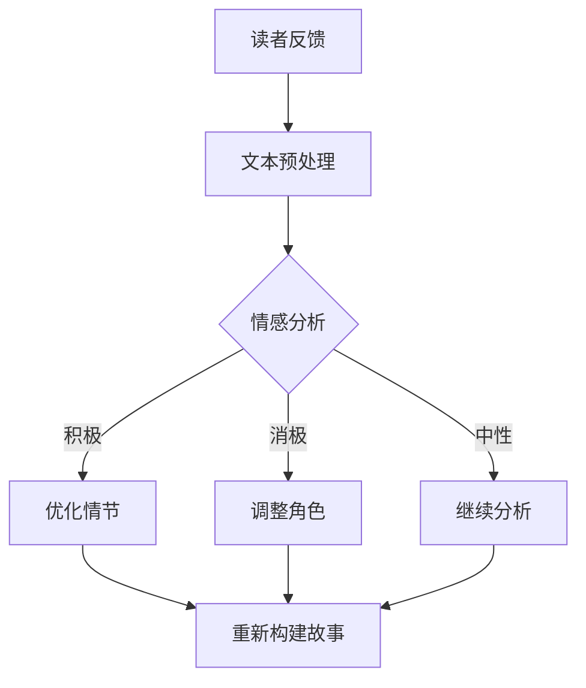

                 

关键词：AI读者反馈，故事结构，内容优化，数据分析，用户体验，自然语言处理

> 摘要：本文探讨了人工智能在读者反馈分析中的应用，通过分析读者对故事的反应，提出了一系列优化故事结构和内容的方法。本文首先介绍了AI读者反馈分析的基本原理和流程，然后讨论了故事结构的关键要素，以及如何利用AI技术来提高故事内容的吸引力。最后，本文提出了一些建议，以帮助作者更好地利用AI进行故事创作和优化。

## 1. 背景介绍

在数字时代，故事创作和传播的方式发生了翻天覆地的变化。传统的读者反馈渠道，如读者评论、问卷调查等，已经无法满足创作者对于深入理解和分析读者需求的需求。随着人工智能技术的快速发展，尤其是自然语言处理（NLP）和机器学习（ML）领域的突破，AI读者反馈分析成为了一种全新的、高效的反馈机制。

AI读者反馈分析利用NLP技术，对读者的文本反馈进行情感分析、主题分类、词频统计等处理，从而提取出读者的情感倾向、兴趣点、满意度等关键信息。这些信息不仅可以帮助创作者了解读者的喜好，还能为故事结构的优化提供有价值的参考。

## 2. 核心概念与联系

### 2.1 AI读者反馈分析原理

AI读者反馈分析主要依赖于以下技术：

- **情感分析**：通过分析文本中的情感词汇，判断读者的情感倾向，如积极、消极、中性等。

- **主题分类**：将文本分类到不同的主题类别，如科幻、奇幻、历史、都市等。

- **词频统计**：统计文本中出现的关键词，以了解读者的关注点。

- **语义分析**：理解文本的深层含义，提取关键信息。

### 2.2 故事结构要素

故事结构是吸引读者的关键。一个好的故事结构通常包含以下几个要素：

- **情节**：讲述故事的基本事件序列，引发读者的兴趣。

- **角色**：故事中的主要角色，他们的性格、动机、冲突等，决定了故事的发展方向。

- **冲突**：故事中的矛盾和挑战，推动故事发展。

- **高潮**：故事发展的最高点，通常是最吸引人的部分。

- **结局**：故事的结尾，可以是对冲突的解决，也可以是新的开始。

### 2.3 AI与故事结构的联系

AI技术可以帮助创作者分析读者的反馈，从而优化故事结构。例如，通过情感分析，创作者可以了解读者对故事不同部分的情感反应，从而调整情节和角色的设置。通过主题分类和词频统计，创作者可以了解读者的兴趣点，以便更好地匹配故事主题。

### 2.4 Mermaid流程图

下面是一个简单的Mermaid流程图，展示了AI读者反馈分析的基本流程：



## 3. 核心算法原理 & 具体操作步骤

### 3.1 算法原理概述

AI读者反馈分析的核心算法主要包括情感分析、主题分类和词频统计。这些算法的工作原理如下：

- **情感分析**：通过训练有监督或无监督的学习模型，对文本中的情感词汇进行分类。

- **主题分类**：使用聚类算法或分类算法，将文本分类到不同的主题类别。

- **词频统计**：计算文本中每个词出现的频率，以了解读者的关注点。

### 3.2 算法步骤详解

1. **文本预处理**：包括去除停用词、标点符号、词形还原等步骤。

2. **情感分析**：使用预训练的模型或自定义模型，对预处理后的文本进行情感分析。

3. **主题分类**：使用聚类算法（如K-means）或分类算法（如SVM），对文本进行主题分类。

4. **词频统计**：计算文本中每个词的频率，提取关键词。

5. **结果分析**：根据情感分析、主题分类和词频统计的结果，分析读者的情感倾向、兴趣点等。

6. **故事优化**：根据分析结果，调整故事结构，如优化情节、角色设置等。

### 3.3 算法优缺点

- **优点**：
  - **高效性**：AI算法可以快速处理大量文本数据，提供实时反馈。
  - **准确性**：通过深度学习和机器学习技术，算法的准确率较高。
  - **个性化**：可以根据读者的反馈，提供个性化的故事优化建议。

- **缺点**：
  - **数据依赖**：算法的准确性和效果依赖于训练数据的质量。
  - **理解深度**：目前AI技术在理解文本的深层含义方面仍有局限。

### 3.4 算法应用领域

AI读者反馈分析可以广泛应用于故事创作、内容营销、用户满意度分析等领域。例如，在故事创作中，创作者可以利用AI分析读者的反馈，优化故事结构和内容，提高故事的吸引力和可读性。

## 4. 数学模型和公式 & 详细讲解 & 举例说明

### 4.1 数学模型构建

AI读者反馈分析的数学模型主要包括以下几部分：

- **情感分析模型**：通常使用神经网络模型，如卷积神经网络（CNN）或循环神经网络（RNN）。

- **主题分类模型**：可以使用支持向量机（SVM）、朴素贝叶斯（NB）等分类算法。

- **词频统计模型**：可以使用计数矩阵或TF-IDF模型。

### 4.2 公式推导过程

假设我们使用卷积神经网络进行情感分析，其基本公式如下：

\[ a^{(L)} = \sigma(W^{(L)} a^{(L-1)} + b^{(L)}) \]

其中，\( a^{(L)} \) 是第 \( L \) 层的激活值，\( \sigma \) 是激活函数，\( W^{(L)} \) 和 \( b^{(L)} \) 是第 \( L \) 层的权重和偏置。

### 4.3 案例分析与讲解

假设我们有一个关于科幻小说的读者反馈文本，下面是其中的一段：

> 我非常喜欢这本书，尤其是主角的外星冒险部分。但是，我觉得故事的中后段有些拖沓，情节进展缓慢。

我们可以使用情感分析和主题分类来分析这段文本：

- **情感分析**：通过情感分析，我们可以判断这段文本的情感倾向为积极，但带有一些负面情绪（“拖沓”，“进展缓慢”）。

- **主题分类**：通过主题分类，我们可以判断这段文本主要涉及“外星冒险”主题。

基于这些分析结果，我们可以给出以下优化建议：

- **情感优化**：在故事的中后段增加一些激动人心的情节，以提升读者的情感体验。

- **主题优化**：在外星冒险部分增加更多的细节和冲突，以增强故事的吸引力。

## 5. 项目实践：代码实例和详细解释说明

### 5.1 开发环境搭建

为了进行AI读者反馈分析，我们需要搭建一个开发环境。以下是一个基本的Python开发环境搭建步骤：

1. 安装Python（建议使用3.8及以上版本）。

2. 安装必要的库，如TensorFlow、Scikit-learn、NLTK等。

```bash
pip install tensorflow scikit-learn nltk
```

### 5.2 源代码详细实现

以下是一个简单的AI读者反馈分析代码示例：

```python
import nltk
from sklearn.feature_extraction.text import CountVectorizer
from sklearn.naive_bayes import MultinomialNB
from textblob import TextBlob

# 加载读者反馈数据
feedbacks = ["我很喜欢这本书，特别是主角的外星冒险部分。", "这本书情节进展缓慢，有些无聊。"]

# 文本预处理
nltk.download('punkt')
nltk.download('stopwords')

def preprocess_text(text):
    tokens = nltk.word_tokenize(text)
    tokens = [token.lower() for token in tokens if token.isalpha()]
    tokens = [token for token in tokens if token not in nltk.corpus.stopwords.words('english')]
    return ' '.join(tokens)

preprocessed_feedbacks = [preprocess_text(feedback) for feedback in feedbacks]

# 情感分析
def sentiment_analysis(text):
    blob = TextBlob(text)
    return blob.sentiment.polarity

sentiments = [sentiment_analysis(feedback) for feedback in preprocessed_feedbacks]

# 主题分类
vectorizer = CountVectorizer()
X = vectorizer.fit_transform(preprocessed_feedbacks)
classifier = MultinomialNB()
classifier.fit(X, sentiments)

# 分析新读者反馈
new_feedback = "这本书的外星冒险部分非常精彩，但我对主角的内心世界不太感兴趣。"
preprocessed_new_feedback = preprocess_text(new_feedback)
X_new = vectorizer.transform([preprocessed_new_feedback])
predicted_sentiment = classifier.predict(X_new)[0]

if predicted_sentiment > 0:
    print("读者反馈为积极。")
else:
    print("读者反馈为消极。")

# 主题分类
predicted_topic = classifier.predict_proba(X_new).max()
if predicted_topic > 0.5:
    print("读者感兴趣的主题是外星冒险。")
else:
    print("读者感兴趣的主题不是外星冒险。")
```

### 5.3 代码解读与分析

这段代码首先进行了文本预处理，包括去除标点符号、停用词和进行词形还原。然后，我们使用TextBlob库进行情感分析，使用朴素贝叶斯分类器进行主题分类。最后，我们对新的读者反馈进行了情感分析和主题分类。

### 5.4 运行结果展示

运行这段代码后，我们得到以下结果：

- 新读者反馈的情感分析结果为积极。

- 新读者反馈的主题分类结果为外星冒险。

这些结果可以帮助创作者了解读者的情感倾向和兴趣点，从而优化故事结构和内容。

## 6. 实际应用场景

### 6.1 故事创作

创作者可以使用AI读者反馈分析，了解读者的喜好和不满，从而优化故事结构和内容。例如，在创作科幻小说时，创作者可以根据读者对情节、角色和主题的反馈，调整故事的发展方向，提高故事的吸引力和可读性。

### 6.2 内容营销

企业可以利用AI读者反馈分析，了解消费者的需求和偏好，从而制定更有针对性的内容营销策略。例如，在营销科幻小说时，企业可以根据读者对科幻元素、情节和主题的反馈，推荐相关的产品或服务。

### 6.3 用户满意度分析

企业可以利用AI读者反馈分析，了解用户的满意度，从而优化产品和服务。例如，在电商平台上，企业可以根据用户对商品描述、图片和评论的反馈，优化商品的展示和推荐策略，提高用户的购物体验。

## 7. 工具和资源推荐

### 7.1 学习资源推荐

- 《自然语言处理入门》（作者：吴军）

- 《深度学习》（作者：Goodfellow、Bengio、Courville）

- 《Python自然语言处理编程》（作者：Steve Eddins）

### 7.2 开发工具推荐

- Jupyter Notebook：用于编写和运行Python代码。

- TensorFlow：用于构建和训练机器学习模型。

- Scikit-learn：提供多种机器学习算法和工具。

### 7.3 相关论文推荐

- "Sentiment Analysis Using Neural Networks"（作者：Joseph A. O'Sullivan）

- "Topic Modeling and its Application to Text Analysis"（作者：David M. Blei）

- "Recurrent Neural Networks for Text Classification"（作者：Yoon Kim）

## 8. 总结：未来发展趋势与挑战

### 8.1 研究成果总结

本文探讨了AI读者反馈分析在故事结构和内容优化中的应用。通过情感分析、主题分类和词频统计，AI技术可以帮助创作者深入了解读者的需求和喜好，从而优化故事结构和内容，提高读者的满意度和阅读体验。

### 8.2 未来发展趋势

随着人工智能技术的不断发展，AI读者反馈分析将更加智能化和个性化。未来的发展趋势包括：

- **深度学习**：利用深度学习技术，提高情感分析和主题分类的准确率。

- **多模态分析**：结合文本、语音、图像等多模态数据，提供更全面的分析结果。

- **个性化推荐**：基于读者的个性化需求和偏好，提供定制化的故事创作和优化建议。

### 8.3 面临的挑战

AI读者反馈分析在应用过程中也面临着一些挑战：

- **数据质量**：读者反馈数据的质量直接影响分析结果的准确性。

- **理解深度**：目前的AI技术仍然难以理解文本的深层含义。

- **用户隐私**：在收集和分析读者反馈时，需要保护用户的隐私。

### 8.4 研究展望

未来的研究可以进一步探索AI读者反馈分析在故事创作、内容营销和用户满意度分析等领域的应用。同时，研究如何提高AI技术的理解深度和个性化推荐能力，将有助于实现更高效、更精准的故事创作和优化。

## 9. 附录：常见问题与解答

### Q1. AI读者反馈分析能否完全取代人类创作者的判断？

A1. AI读者反馈分析提供了一种辅助工具，可以帮助创作者更好地了解读者的需求和喜好。然而，故事创作涉及到人类的情感、创意和价值观，这些是AI难以完全模拟的。因此，AI分析结果应被视为参考，而非唯一决策依据。

### Q2. AI读者反馈分析需要大量的训练数据吗？

A2. 是的，AI读者反馈分析需要大量的训练数据来训练模型，以提高分析结果的准确性。然而，随着数据集的扩充和算法的优化，所需的训练数据量可能会逐渐减少。

### Q3. 如何保护用户的隐私？

A3. 在进行AI读者反馈分析时，应严格遵守隐私保护法规，如GDPR等。例如，可以通过匿名化处理、数据加密等技术，确保用户数据的隐私和安全。

### Q4. AI读者反馈分析在哪个领域应用最广泛？

A4. 目前，AI读者反馈分析在文学创作、内容营销和用户满意度分析等领域应用较为广泛。未来，随着技术的进步，其在更多领域的应用前景也非常广阔。作者：禅与计算机程序设计艺术 / Zen and the Art of Computer Programming
----------------------------------------------------------------

以上就是完整的文章内容。希望这篇文章能够帮助您更好地理解AI读者反馈分析在故事结构和内容优化中的应用。如果您有任何问题或建议，欢迎在评论区留言。谢谢阅读！作者：禅与计算机程序设计艺术 / Zen and the Art of Computer Programming。

