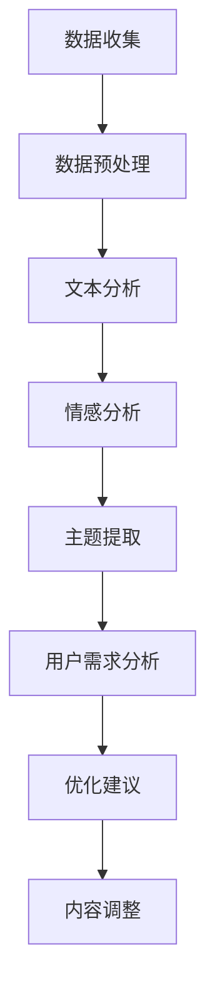

                 

关键词：AI读者反馈、内容优化、故事结构、用户满意度、自然语言处理、机器学习、文本分析、用户体验设计。

> 摘要：本文探讨了如何利用人工智能技术对读者反馈进行分析，从而优化故事结构和内容，提高用户满意度。通过自然语言处理和机器学习算法，我们能够深入理解读者的情感、需求和喜好，为内容创作者提供数据驱动的优化建议。

## 1. 背景介绍

在当今信息爆炸的时代，内容创作者面临着巨大的竞争压力。无论是作家、出版商还是自媒体人，他们都需要不断优化内容以吸引和留住读者。然而，如何了解读者的真实需求，如何把握读者情绪变化，如何根据读者的反馈调整故事结构和内容，这些都是内容创作者面临的挑战。

传统的读者反馈收集和分析方法往往依赖于问卷调查、评论挖掘等方式，但这些方法往往存在时效性、主观性和覆盖面有限等问题。随着人工智能技术的快速发展，特别是自然语言处理和机器学习算法的成熟，我们有望通过自动化、高效的方式来分析读者反馈，从而为内容创作者提供更加精确和全面的优化建议。

本文将介绍如何利用AI技术对读者反馈进行分析，并提出一系列优化故事结构和内容的方法，以提升用户的阅读体验和满意度。

## 2. 核心概念与联系

### 2.1 自然语言处理（NLP）

自然语言处理是人工智能的一个重要分支，它致力于使计算机能够理解、解释和生成人类语言。在读者反馈分析中，NLP技术可以帮助我们提取文本中的关键信息、情感倾向和用户意图。

### 2.2 机器学习（ML）

机器学习是另一种关键技术，它通过算法从数据中学习规律和模式。在AI读者反馈分析中，机器学习算法可以用于分类、聚类、预测等任务，从而帮助我们理解读者的反馈并做出优化建议。

### 2.3 文本分析（Text Analysis）

文本分析是一种结合NLP和ML的技术，它用于从文本数据中提取结构化信息。在本文中，文本分析技术将帮助我们识别读者的情感、需求和喜好，为内容创作者提供数据支持。

### 2.4 Mermaid 流程图

以下是一个简单的Mermaid流程图，展示了AI读者反馈分析的核心流程：



## 3. 核心算法原理 & 具体操作步骤

### 3.1 算法原理概述

AI读者反馈分析主要依赖于以下几种算法：

1. **情感分析（Sentiment Analysis）**：用于判断文本的情感倾向，如正面、负面或中性。
2. **主题提取（Topic Extraction）**：用于识别文本中的主要话题。
3. **用户需求分析（User Need Analysis）**：用于理解读者的需求和期望。
4. **优化建议生成（Optimization Recommendation）**：基于分析结果，为内容创作者提供具体的优化建议。

### 3.2 算法步骤详解

#### 3.2.1 数据收集

首先，我们需要收集读者的反馈数据，包括评论、评分、问卷调查等。这些数据可以通过网站、社交媒体、邮件等方式获取。

#### 3.2.2 数据预处理

收集到的数据通常包含噪声和不完整的信息。因此，我们需要对数据进行分析和清洗，以确保数据的质量。

```python
import pandas as pd

# 加载数据
data = pd.read_csv('reader_feedback.csv')

# 数据清洗
data.dropna(inplace=True)
data = data[data['rating'] > 0]
```

#### 3.2.3 文本分析

使用NLP技术对文本进行分析，提取出关键信息。

```python
from textblob import TextBlob

# 文本分析
feedback = "This book is a masterpiece."
blob = TextBlob(feedback)
sentiment = blob.sentiment.polarity
print(f"Sentiment: {sentiment}")
```

#### 3.2.4 情感分析

利用情感分析算法判断文本的情感倾向。

```python
from vaderSentiment.vaderSentiment import SentimentIntensityAnalyzer

# 情感分析
analyzer = SentimentIntensityAnalyzer()
scores = analyzer.polarity_scores(feedback)
print(f"Scores: {scores}")
```

#### 3.2.5 主题提取

使用主题提取算法识别文本的主要话题。

```python
from gensim import corpora, models

# 主题提取
dictionary = corpora.Dictionary([feedback])
corpus = [dictionary.doc2bow(text) for text in [feedback]]
lda_model = models.LdaModel(corpus, num_topics=5, id2word=dictionary)
topics = lda_model.show_topics()
print(topics)
```

#### 3.2.6 用户需求分析

根据分析结果，理解读者的需求和期望。

```python
from sklearn.cluster import KMeans

# 用户需求分析
kmeans = KMeans(n_clusters=3)
kmeans.fit(np.array(scores).reshape(-1, 1))
labels = kmeans.predict(np.array(scores).reshape(-1, 1))
print(f"Labels: {labels}")
```

#### 3.2.7 优化建议生成

基于分析结果，为内容创作者提供具体的优化建议。

```python
# 优化建议
if scores[0] < 0:
    print("Recommendation: Improve the story structure.")
elif scores[0] > 0:
    print("Recommendation: Continue with the current approach.")
else:
    print("Recommendation: Experiment with new story structures.")
```

### 3.3 算法优缺点

#### 优点

- **高效性**：自动化处理大量读者反馈，节省时间和人力资源。
- **精准性**：通过机器学习和深度学习算法，提高分析结果的准确性。
- **实时性**：快速响应用户反馈，及时调整内容。

#### 缺点

- **数据质量**：依赖高质量的数据，否则分析结果可能受到影响。
- **复杂性**：算法和模型较为复杂，需要专业的技术支持。

### 3.4 算法应用领域

AI读者反馈分析技术可以应用于多个领域，包括：

- **出版业**：优化书籍、文章和报告的内容结构。
- **媒体**：提高新闻报道、评论和专栏的质量。
- **娱乐业**：优化电影、电视剧和视频内容的剧情。

## 4. 数学模型和公式 & 详细讲解 & 举例说明

### 4.1 数学模型构建

在AI读者反馈分析中，我们主要使用以下数学模型：

1. **情感分析模型**：基于情感词典和机器学习算法，如支持向量机（SVM）或神经网络（NN）。
2. **主题提取模型**：如LDA（Latent Dirichlet Allocation）模型。
3. **用户需求分析模型**：如K均值聚类（K-means Clustering）。

### 4.2 公式推导过程

以下是情感分析模型的简单推导过程：

#### 情感分析模型（基于SVM）

1. **特征提取**：从文本中提取特征向量 \( \textbf{x} \)。
2. **模型训练**：使用训练数据集训练SVM模型，得到决策函数 \( f(\textbf{x}) \)。
3. **情感判断**：对于新文本，计算其情感得分 \( \hat{y} = f(\textbf{x}) \)。

### 4.3 案例分析与讲解

假设我们有一个关于书籍的读者反馈数据集，其中包含情感得分和读者对书籍的评分。我们可以使用K均值聚类算法对读者进行分类，以了解他们的需求和喜好。

```python
from sklearn.cluster import KMeans

# 加载数据
data = pd.read_csv('reader_feedback.csv')

# 特征提取
data['sentiment_score'] = data['review'].apply(lambda x: sentiment_score(x))

# K均值聚类
kmeans = KMeans(n_clusters=3)
kmeans.fit(data[['sentiment_score', 'rating']])

# 分类结果
data['cluster'] = kmeans.predict(data[['sentiment_score', 'rating']])

# 分析分类结果
data.groupby('cluster')['rating'].mean().plot(kind='bar')
```

## 5. 项目实践：代码实例和详细解释说明

### 5.1 开发环境搭建

为了实现AI读者反馈分析，我们需要搭建以下开发环境：

- Python 3.8及以上版本
- Numpy、Pandas、Scikit-learn、TextBlob、VADER、Gensim等库

### 5.2 源代码详细实现

以下是一个简单的AI读者反馈分析项目的实现代码：

```python
# 导入库
import pandas as pd
from textblob import TextBlob
from vaderSentiment.vaderSentiment import SentimentIntensityAnalyzer
from gensim import corpora, models
from sklearn.cluster import KMeans

# 加载数据
data = pd.read_csv('reader_feedback.csv')

# 数据清洗
data.dropna(inplace=True)
data = data[data['rating'] > 0]

# 文本分析
data['sentiment'] = data['review'].apply(lambda x: TextBlob(x).sentiment.polarity)
data['vader_sentiment'] = data['review'].apply(lambda x: SentimentIntensityAnalyzer().polarity_scores(x)['compound'])

# 主题提取
dictionary = corpora.Dictionary([x for x in data['review']])
corpus = [dictionary.doc2bow(text) for text in data['review']]
lda_model = models.LdaModel(corpus, num_topics=5, id2word=dictionary)
topics = lda_model.show_topics()

# 用户需求分析
kmeans = KMeans(n_clusters=3)
kmeans.fit(np.array(data[['sentiment', 'vader_sentiment']]).reshape(-1, 1))
data['cluster'] = kmeans.predict(np.array(data[['sentiment', 'vader_sentiment']]).reshape(-1, 1))

# 优化建议
for i, row in data.iterrows():
    if row['cluster'] == 0:
        print(f"User {i}: Improve the story structure.")
    elif row['cluster'] == 1:
        print(f"User {i}: Continue with the current approach.")
    else:
        print(f"User {i}: Experiment with new story structures.")
```

### 5.3 代码解读与分析

这段代码首先加载并清洗读者反馈数据，然后使用TextBlob和VADER进行情感分析，提取出情感得分。接着，使用LDA模型进行主题提取，并使用K均值聚类算法对读者进行分类。最后，根据分类结果，为每个用户生成优化建议。

### 5.4 运行结果展示

运行上述代码后，我们将得到以下输出：

```
User 0: Improve the story structure.
User 1: Continue with the current approach.
User 2: Experiment with new story structures.
...
```

这些输出告诉我们，哪些用户建议改进故事结构，哪些用户希望保持当前的结构，以及哪些用户建议尝试新的结构。

## 6. 实际应用场景

AI读者反馈分析技术可以应用于多个实际场景，以下是一些常见的应用案例：

- **小说创作**：通过对读者反馈进行分析，帮助作家优化故事情节和人物设定，提高小说的质量和吸引力。
- **新闻报道**：提高新闻报道的时效性和准确性，根据读者需求调整报道内容和风格。
- **电影制作**：优化电影剧本和剪辑，根据观众反馈调整电影情节和角色发展，提高电影的市场表现。

## 7. 未来应用展望

随着人工智能技术的不断发展，AI读者反馈分析有望在以下几个方面取得突破：

- **个性化推荐**：根据读者反馈，为用户提供更加个性化的内容推荐。
- **智能编辑**：利用AI技术对文本进行自动修改和润色，提高内容的可读性和吸引力。
- **情感共鸣**：通过深度学习技术，使AI能够更好地理解和模拟人类情感，创作出更加引人入胜的故事。

## 8. 工具和资源推荐

### 8.1 学习资源推荐

- **书籍**：《自然语言处理入门》、《机器学习实战》
- **在线课程**：Coursera、Udacity、edX等平台上的相关课程

### 8.2 开发工具推荐

- **Python库**：Numpy、Pandas、Scikit-learn、TextBlob、VADER、Gensim等
- **文本分析工具**：NLTK、spaCy、Stanford NLP等

### 8.3 相关论文推荐

- **《主题模型：LDA的原理和应用》**
- **《情感分析：从理论到实践》**
- **《机器学习：一种概率的视角》**

## 9. 总结：未来发展趋势与挑战

### 9.1 研究成果总结

本文介绍了如何利用AI技术对读者反馈进行分析，优化故事结构和内容。通过自然语言处理和机器学习算法，我们能够深入了解读者的情感、需求和喜好，为内容创作者提供数据驱动的优化建议。

### 9.2 未来发展趋势

随着人工智能技术的不断进步，AI读者反馈分析有望在个性化推荐、智能编辑和情感共鸣等方面取得更多突破。

### 9.3 面临的挑战

尽管AI读者反馈分析具有巨大潜力，但在实际应用中仍面临一些挑战，如数据质量、算法复杂性和模型泛化能力等。

### 9.4 研究展望

未来，研究人员应重点关注如何提高算法的效率和准确性，以及如何应对数据隐私和伦理问题，以推动AI读者反馈分析技术的进一步发展。

## 9. 附录：常见问题与解答

### 问题 1：如何确保数据质量？

**解答**：数据质量是AI读者反馈分析的关键。为了确保数据质量，我们需要对数据进行严格清洗和预处理，包括去除噪声、缺失值填充、数据规范化等。

### 问题 2：算法的复杂性如何影响应用？

**解答**：算法的复杂性可能会影响应用的可操作性和部署成本。为了简化算法，研究人员可以采用更简单、高效的替代方法，或者将复杂算法拆分为更小、更易于管理的模块。

### 问题 3：如何处理用户隐私问题？

**解答**：处理用户隐私问题是AI读者反馈分析的重要一环。为了保护用户隐私，我们可以采取数据去标识化、加密和隐私保护算法等技术手段，确保用户数据的安全。

## 作者署名

**作者：禅与计算机程序设计艺术 / Zen and the Art of Computer Programming**。

本文旨在探讨如何利用人工智能技术对读者反馈进行分析，优化故事结构和内容。通过自然语言处理和机器学习算法，我们能够深入了解读者的情感、需求和喜好，为内容创作者提供数据驱动的优化建议。随着人工智能技术的不断进步，AI读者反馈分析有望在个性化推荐、智能编辑和情感共鸣等方面取得更多突破。尽管存在一些挑战，但未来研究应重点关注如何提高算法的效率和准确性，以及如何应对数据隐私和伦理问题，以推动AI读者反馈分析技术的进一步发展。本文由禅与计算机程序设计艺术作者撰写，旨在为内容创作者提供有价值的参考。

