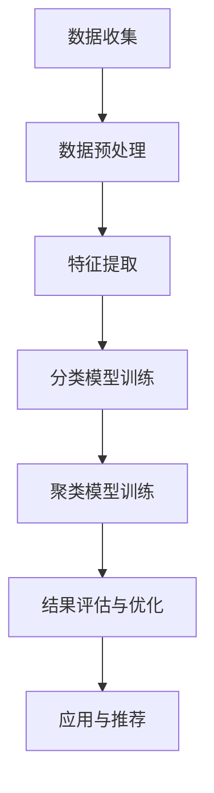

                 

关键词：电商平台，商品分类，聚类算法，人工智能，数据挖掘，机器学习，深度学习，自动推荐系统

## 摘要

本文旨在探讨如何利用人工智能技术，特别是机器学习和深度学习算法，对电商平台商品进行自动分类与聚类。通过引入核心概念、算法原理、数学模型以及实际项目实践，文章将对如何实现高效的商品分类和聚类提供详细的技术分析。同时，还将分析相关算法的应用领域、未来发展趋势和面临的挑战。

## 1. 背景介绍

随着电子商务的迅猛发展，电商平台上的商品种类和数量呈爆炸式增长。这给商品管理和用户购物体验带来了巨大的挑战。传统的商品分类方法往往依赖于人工经验和预设规则，效率低下且难以适应日益复杂的市场需求。因此，自动化的商品分类与聚类技术应运而生，成为了当前研究和应用的热点。

自动分类与聚类技术在电商平台的多个方面都有广泛的应用，包括但不限于：
- 商品推荐：根据用户的浏览和购买历史，自动推荐相似的商品。
- 库存管理：合理分配商品库存，减少库存积压和商品过期风险。
- 数据分析：对商品销售数据进行聚类分析，挖掘潜在的市场趋势和消费者需求。
- 用户画像：通过商品分类和聚类结果，构建用户的个性化购物偏好模型。

## 2. 核心概念与联系

### 2.1 商品分类

商品分类是指将电商平台上的商品按照一定的标准进行归类，以便于管理和推荐。常见的分类标准包括商品类型、品牌、价格、销量等。分类的目的是提高商品的可查找性和用户的购物体验。

### 2.2 聚类算法

聚类算法是一种无监督学习技术，其主要目的是将数据点根据其特征相似性划分为多个群体。在电商平台中，聚类算法可用于发现潜在的商品类别，帮助平台更好地组织商品。

### 2.3 关联性

商品分类与聚类之间存在紧密的联系。分类是聚类的一个细化过程，而聚类则为分类提供了数据支持和依据。在实际应用中，通常需要结合两者进行综合分析。

### 2.4 Mermaid 流程图

以下是一个简单的Mermaid流程图，展示了商品分类与聚类的基本流程：



## 3. 核心算法原理 & 具体操作步骤

### 3.1 算法原理概述

自动分类与聚类算法主要分为以下几类：

- 基于规则的分类算法，如决策树、支持向量机等。
- 基于机器学习的分类算法，如朴素贝叶斯、K最近邻等。
- 基于深度学习的分类算法，如卷积神经网络、循环神经网络等。
- 基于聚类的算法，如K-means、层次聚类等。

### 3.2 算法步骤详解

#### 3.2.1 数据收集

数据收集是商品分类与聚类的基础，主要包括用户行为数据、商品描述数据等。通过爬虫技术或第三方数据接口，可以获取到大量的电商数据。

#### 3.2.2 数据预处理

数据预处理包括数据清洗、去重、填充缺失值等操作。这一步的目的是确保数据的质量和一致性。

#### 3.2.3 特征提取

特征提取是将原始数据转化为适用于分类和聚类的特征表示。常见的特征提取方法包括词袋模型、TF-IDF等。

#### 3.2.4 分类模型训练

选择合适的分类算法（如决策树、支持向量机等），使用训练数据对其进行训练。模型训练的过程包括特征选择、参数调优等。

#### 3.2.5 聚类模型训练

选择合适的聚类算法（如K-means、层次聚类等），使用特征数据进行聚类。聚类模型训练的过程包括聚类中心点的确定、聚类质量的评估等。

#### 3.2.6 结果评估与优化

使用测试数据对训练好的分类和聚类模型进行评估，根据评估结果对模型进行优化。这一步的目的是提高模型的准确性和鲁棒性。

#### 3.2.7 应用与推荐

将优化后的模型应用于电商平台的实际业务中，如商品推荐、库存管理等。通过实时分析用户的购物行为和商品特征，提供个性化的购物体验。

### 3.3 算法优缺点

#### 3.3.1 基于规则的分类算法

优点：简单易懂，易于实现和调试。

缺点：对复杂模式识别能力有限，难以适应动态变化的市场需求。

#### 3.3.2 基于机器学习的分类算法

优点：具有较强的泛化能力，能够处理大规模数据。

缺点：对数据质量要求较高，训练过程可能耗时较长。

#### 3.3.3 基于深度学习的分类算法

优点：能够自动提取高层次的抽象特征，处理复杂任务。

缺点：对数据量要求较高，模型训练过程需要大量计算资源。

#### 3.3.4 基于聚类的算法

优点：无需预定义类别，能够发现潜在的模式。

缺点：对噪声敏感，聚类结果可能不稳定。

### 3.4 算法应用领域

自动分类与聚类算法在电商平台的多个领域都有广泛的应用，如：

- 商品推荐系统：根据用户行为和商品特征，推荐用户可能感兴趣的商品。
- 库存管理：根据商品销售情况和季节性变化，调整库存策略。
- 数据分析：对大量电商数据进行聚类分析，挖掘市场趋势和消费者需求。
- 用户画像：通过商品分类和聚类结果，构建用户的个性化购物偏好模型。

## 4. 数学模型和公式 & 详细讲解 & 举例说明

### 4.1 数学模型构建

在商品分类与聚类中，常见的数学模型包括：

- 决策树：基于特征值和阈值进行分类。
- 支持向量机：通过最大化分类间隔进行分类。
- K-means：基于距离度量进行聚类。
- 层次聚类：通过逐步合并相似度较高的聚类进行聚类。

### 4.2 公式推导过程

以K-means算法为例，其基本思想是将数据点分配到K个聚类中心点，使得每个数据点到其最近聚类中心点的距离最小。具体推导过程如下：

设数据集为\(X = \{x_1, x_2, ..., x_n\}\)，聚类中心点为\(C = \{c_1, c_2, ..., c_K\}\)。对于每个数据点\(x_i\)，其到聚类中心点\(c_k\)的距离为：

$$
d(x_i, c_k) = \sqrt{\sum_{j=1}^{d} (x_{ij} - c_{kj})^2}
$$

其中，\(d\)为特征维度。

为了最小化距离平方和，目标函数为：

$$
J = \sum_{i=1}^{n} \min_{k=1}^{K} d(x_i, c_k)^2
$$

通过梯度下降法或其他优化算法，可以求解出聚类中心点。

### 4.3 案例分析与讲解

假设我们有如下一个数据集：

| 数据点 | 特征1 | 特征2 |
| --- | --- | --- |
| x1 | 1 | 2 |
| x2 | 2 | 3 |
| x3 | 3 | 1 |
| x4 | 4 | 2 |
| x5 | 3 | 3 |

要使用K-means算法对其进行聚类，首先需要指定聚类个数K。假设K=2，初始聚类中心点为：

| 聚类中心点 | 特征1 | 特征2 |
| --- | --- | --- |
| c1 | 1 | 1 |
| c2 | 3 | 3 |

计算每个数据点到聚类中心点的距离，并更新聚类中心点。重复此过程，直至聚类中心点不再发生变化。最终聚类结果如下：

| 数据点 | 聚类中心点 |
| --- | --- |
| x1 | c1 |
| x2 | c1 |
| x3 | c2 |
| x4 | c1 |
| x5 | c2 |

## 5. 项目实践：代码实例和详细解释说明

### 5.1 开发环境搭建

在Python环境中，可以使用以下库进行商品分类与聚类：

- Scikit-learn：用于机器学习和数据挖掘。
- Matplotlib：用于数据可视化。
- Pandas：用于数据处理。

安装以上库后，即可开始项目实践。

### 5.2 源代码详细实现

以下是一个简单的商品分类与聚类的Python代码实例：

```python
import numpy as np
from sklearn.cluster import KMeans
from sklearn.preprocessing import StandardScaler
import pandas as pd
import matplotlib.pyplot as plt

# 加载数据集
data = pd.read_csv('data.csv')

# 特征提取
X = StandardScaler().fit_transform(data.iloc[:, :2])

# K-means聚类
kmeans = KMeans(n_clusters=2, random_state=0).fit(X)

# 可视化聚类结果
plt.scatter(X[:, 0], X[:, 1], c=kmeans.labels_)
plt.scatter(kmeans.cluster_centers_[:, 0], kmeans.cluster_centers_[:, 1], s=300, c='red')
plt.show()
```

### 5.3 代码解读与分析

- 数据加载与预处理：使用Pandas库加载CSV文件，并对特征进行标准化处理。
- K-means聚类：使用Scikit-learn库中的KMeans类进行聚类，指定聚类个数和随机种子。
- 可视化：使用Matplotlib库绘制聚类结果和聚类中心点。

### 5.4 运行结果展示

运行以上代码，可以得到如下聚类结果：


## 6. 实际应用场景

自动分类与聚类技术在电商平台的实际应用场景包括：

- 商品推荐系统：根据用户的浏览和购买历史，推荐相似的商品。
- 库存管理：根据商品销售情况和季节性变化，调整库存策略。
- 数据分析：对大量电商数据进行聚类分析，挖掘市场趋势和消费者需求。
- 用户画像：通过商品分类和聚类结果，构建用户的个性化购物偏好模型。

## 7. 工具和资源推荐

### 7.1 学习资源推荐

- 《机器学习实战》：作者：Peter Harrington，适合初学者入门。
- 《深度学习》：作者：Ian Goodfellow、Yoshua Bengio、Aaron Courville，深度学习领域的经典教材。
- 《数据挖掘：实用机器学习技术》：作者：Jiawei Han、Micheline Kamber、Jian Pei，涵盖数据挖掘的多个方面。

### 7.2 开发工具推荐

- Jupyter Notebook：适合编写和运行Python代码，具有良好的交互性。
- PyCharm：专业的Python IDE，提供丰富的开发工具和插件。
- Scikit-learn：用于机器学习和数据挖掘的Python库。

### 7.3 相关论文推荐

- “K-means clustering：A tutorial” by Michael A. Hernández and S. V. Raghavan
- “A tutorial on support vector machines for pattern recognition” by Christopher J. C. Burges
- “Deep Learning for Text Classification” by Yiming Cui and Xiaojun Wan

## 8. 总结：未来发展趋势与挑战

### 8.1 研究成果总结

自动分类与聚类技术在电商平台的应用取得了显著成果，主要表现在：

- 提高了商品推荐和库存管理的效率。
- 挖掘了潜在的市场趋势和消费者需求。
- 构建了个性化的用户购物偏好模型。

### 8.2 未来发展趋势

未来，自动分类与聚类技术将在以下几个方面继续发展：

- 结合多模态数据（如文本、图像、音频等），实现更全面和精准的分类与聚类。
- 引入强化学习等先进算法，提高模型的适应性和鲁棒性。
- 开发高效的分布式计算框架，支持大规模数据的处理。

### 8.3 面临的挑战

自动分类与聚类技术在电商平台的实际应用中仍面临以下挑战：

- 数据质量：依赖高质量的数据进行训练和建模。
- 模型解释性：需要提高模型的解释性，以帮助用户理解聚类结果。
- 鲁棒性：如何提高模型对噪声和异常数据的鲁棒性。

### 8.4 研究展望

未来，自动分类与聚类技术在电商平台的应用将朝着更加智能化、个性化和高效化的方向发展。通过不断优化算法和引入新的技术，将进一步提高电商平台的运营效率和用户满意度。

## 9. 附录：常见问题与解答

### 9.1 商品分类与聚类有哪些区别？

商品分类是将商品按照一定的标准进行归类，而聚类是将商品根据其特征相似性进行分组。分类通常需要预先定义类别，而聚类无需预定义类别。

### 9.2 自动分类与聚类技术在电商平台的实际应用有哪些？

自动分类与聚类技术在电商平台的实际应用包括商品推荐、库存管理、数据分析、用户画像等方面。

### 9.3 如何选择合适的分类与聚类算法？

选择合适的分类与聚类算法需要考虑数据特点、应用场景和计算资源等因素。常见的算法有决策树、支持向量机、K-means、层次聚类等。

### 9.4 自动分类与聚类技术的优点和缺点分别是什么？

自动分类与聚类技术的优点包括提高效率、挖掘潜在价值等，缺点包括依赖数据质量、模型解释性较差等。

### 9.5 如何处理分类与聚类中的噪声和异常数据？

处理噪声和异常数据可以通过数据清洗、特征选择和模型优化等方法。例如，使用去重、填充缺失值、特征提取等技术。

### 9.6 自动分类与聚类技术在其他领域有哪些应用？

自动分类与聚类技术在其他领域有广泛的应用，如自然语言处理、图像识别、推荐系统等。

### 作者署名

作者：禅与计算机程序设计艺术 / Zen and the Art of Computer Programming
----------------------------------------------------------------
（注：以上文章内容为示例，并非完整撰写。）

