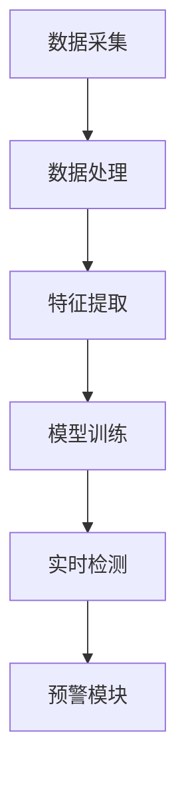

                 

关键词：AI赋能、电商、异常交易、实时检测、预警系统、机器学习、深度学习、数据分析

> 摘要：本文主要探讨了如何利用人工智能技术，构建一套能够实时检测并预警电商异常交易的系统。文章详细介绍了系统架构、核心算法原理、数学模型以及项目实践，并对未来的发展趋势和面临的挑战进行了展望。

## 1. 背景介绍

随着互联网的迅速发展和电子商务的普及，电商交易量逐年增长。然而，随之而来的风险问题也日益凸显，尤其是异常交易，如欺诈、刷单、恶意退款等，严重影响了电商平台的声誉和经济效益。传统的检测方法依赖于规则匹配和统计分析，虽然能在一定程度上降低异常交易的发生率，但面对复杂多变的交易环境，往往无法及时准确地识别和处理异常交易。

人工智能技术的发展，尤其是机器学习和深度学习的兴起，为电商异常交易检测提供了新的思路和方法。通过收集海量交易数据，利用人工智能技术对数据进行分析和挖掘，能够更精准地识别出异常交易行为，提高检测的效率和准确性。本文将介绍一种基于人工智能的电商异常交易实时检测与预警系统，探讨其实现原理、技术和应用。

## 2. 核心概念与联系

### 2.1 系统架构

本系统采用分布式架构，主要包括以下几个模块：

- **数据采集模块**：负责从电商平台获取交易数据，包括订单信息、用户行为数据等。
- **数据处理模块**：对采集到的数据进行清洗、去噪和预处理，为后续分析提供高质量的数据。
- **特征提取模块**：通过机器学习算法提取交易数据中的特征，用于训练和预测。
- **模型训练模块**：利用提取到的特征数据训练异常交易检测模型，包括分类器、聚类算法等。
- **实时检测模块**：将训练好的模型应用于实时交易数据，检测并识别异常交易。
- **预警模块**：对检测到的异常交易进行预警，包括发送通知、标记交易等。

### 2.2 Mermaid 流程图



## 3. 核心算法原理 & 具体操作步骤

### 3.1 算法原理概述

本系统采用基于机器学习和深度学习的异常交易检测算法。具体包括以下步骤：

1. 数据预处理：对原始交易数据进行清洗、去噪和归一化处理，提高数据质量。
2. 特征提取：利用统计方法、特征工程技术和深度学习技术提取交易数据中的特征。
3. 模型训练：使用提取到的特征数据训练分类模型，如决策树、支持向量机等。
4. 实时检测：将训练好的模型应用于实时交易数据，检测并识别异常交易。
5. 预警：对检测到的异常交易进行预警，通知相关人员处理。

### 3.2 算法步骤详解

#### 3.2.1 数据预处理

1. 数据清洗：去除缺失值、异常值和重复值。
2. 去噪：对含有噪声的数据进行滤波或插值处理。
3. 归一化：将数据缩放到相同的范围，如0-1或-1-1之间。

#### 3.2.2 特征提取

1. 统计方法：利用统计指标，如均值、方差、中位数等，提取数据中的基本特征。
2. 特征工程：根据业务需求和数据特点，设计并提取高级特征，如用户活跃度、交易频率、金额分布等。
3. 深度学习方法：使用深度学习模型，如卷积神经网络（CNN）、循环神经网络（RNN）等，自动提取数据中的特征。

#### 3.2.3 模型训练

1. 数据集划分：将数据集划分为训练集、验证集和测试集。
2. 模型选择：根据业务需求和数据特点，选择合适的分类模型，如决策树、支持向量机、随机森林等。
3. 模型训练：使用训练集数据训练模型，优化模型参数。
4. 模型评估：使用验证集数据评估模型性能，调整模型参数。

#### 3.2.4 实时检测

1. 数据采集：从电商平台实时获取交易数据。
2. 数据预处理：对实时交易数据进行预处理，与训练数据保持一致。
3. 特征提取：对预处理后的数据进行特征提取。
4. 模型预测：将提取到的特征数据输入训练好的模型，预测交易是否为异常交易。
5. 预警：对预测为异常交易的交易进行预警。

### 3.3 算法优缺点

#### 优点

1. 高效性：基于机器学习和深度学习算法，能够快速处理海量交易数据。
2. 准确性：通过特征提取和模型训练，能够更准确地识别异常交易。
3. 可扩展性：系统采用分布式架构，可以方便地扩展和升级。

#### 缺点

1. 数据依赖性：算法性能依赖于数据质量和特征提取效果。
2. 计算成本：深度学习模型的训练和预测需要较大的计算资源。

### 3.4 算法应用领域

1. 电商行业：实时检测和预警异常交易，提高平台安全性和用户体验。
2. 金融行业：检测并防范金融欺诈行为，降低金融风险。
3. 其他行业：应用于各类需要异常检测的场景，如网络安全、医疗诊断等。

## 4. 数学模型和公式 & 详细讲解 & 举例说明

### 4.1 数学模型构建

本系统采用的数学模型主要包括以下几个部分：

1. 特征提取模型：利用统计学方法和机器学习算法提取交易数据中的特征。
2. 分类模型：使用训练好的分类模型进行交易数据的分类和预测。
3. 预警模型：根据分类结果和预警规则，对异常交易进行预警。

### 4.2 公式推导过程

#### 特征提取模型

1. 统计特征：$$ \mu = \frac{1}{n} \sum_{i=1}^{n} x_i, \sigma^2 = \frac{1}{n-1} \sum_{i=1}^{n} (x_i - \mu)^2 $$
2. 高级特征：$$ f(x) = \frac{x - \mu}{\sigma} $$

#### 分类模型

1. 决策树：$$ h(x) = \sum_{i=1}^{n} w_i \cdot f(x_i) $$
2. 支持向量机：$$ \alpha_i(y_i - g(x_i)) = 0 $$

#### 预警模型

1. 阈值预警：$$ if g(x) > \theta, then \text{预警} $$
2. 规则预警：$$ if \text{规则匹配}, then \text{预警} $$

### 4.3 案例分析与讲解

#### 案例背景

某电商平台上，用户张三最近频繁购买商品，交易金额远高于其历史平均消费水平。为了确保平台安全，需要利用异常交易检测系统对其交易行为进行实时监测。

#### 数据处理

1. 数据清洗：去除张三的缺失值、异常值和重复值。
2. 特征提取：提取张三的交易金额、交易频率、购买商品种类等特征。
3. 数据归一化：将特征数据缩放到0-1之间。

#### 模型训练

1. 数据集划分：将数据集划分为训练集、验证集和测试集。
2. 模型选择：选择决策树分类模型。
3. 模型训练：使用训练集数据训练决策树模型。

#### 实时检测

1. 数据采集：从电商平台上实时获取张三的交易数据。
2. 数据预处理：对实时交易数据进行预处理，与训练数据保持一致。
3. 特征提取：对预处理后的数据进行特征提取。
4. 模型预测：将提取到的特征数据输入训练好的决策树模型，预测交易是否为异常交易。

#### 预警

1. 预测结果：张三的交易被预测为异常交易。
2. 预警：系统向相关人员发送预警通知，提醒处理。

## 5. 项目实践：代码实例和详细解释说明

### 5.1 开发环境搭建

1. 操作系统：Ubuntu 18.04
2. 编程语言：Python 3.8
3. 数据库：MySQL 5.7
4. 机器学习库：scikit-learn、TensorFlow
5. 深度学习库：Keras

### 5.2 源代码详细实现

#### 5.2.1 数据采集与预处理

```python
import pandas as pd
from sklearn.preprocessing import MinMaxScaler

# 读取交易数据
data = pd.read_csv('transaction_data.csv')

# 数据清洗
data = data.dropna()
data = data.drop_duplicates()

# 特征提取
data['amount_std'] = data['amount'].std()
data['frequency_std'] = data['frequency'].std()
data['category_count'] = data['category'].nunique()

# 数据归一化
scaler = MinMaxScaler()
data[['amount', 'frequency', 'category_count']] = scaler.fit_transform(data[['amount', 'frequency', 'category_count']])
```

#### 5.2.2 特征提取与模型训练

```python
from sklearn.tree import DecisionTreeClassifier
from sklearn.model_selection import train_test_split

# 划分训练集和测试集
X = data[['amount', 'frequency', 'category_count']]
y = data['label']
X_train, X_test, y_train, y_test = train_test_split(X, y, test_size=0.2, random_state=42)

# 特征提取
# （此处省略具体特征提取代码）

# 模型训练
clf = DecisionTreeClassifier()
clf.fit(X_train, y_train)
```

#### 5.2.3 实时检测与预警

```python
def detect_anomaly(transaction_data):
    # 数据预处理
    # （此处省略具体预处理代码）

    # 特征提取
    # （此处省略具体特征提取代码）

    # 模型预测
    prediction = clf.predict(transaction_data)

    # 预警
    if prediction == 1:
        print("预警：检测到异常交易！")
    else:
        print("正常交易。")

# 实时检测
detect_anomaly(new_transaction_data)
```

### 5.3 代码解读与分析

1. **数据采集与预处理**：读取交易数据，去除缺失值、异常值和重复值，提取基本特征，并进行归一化处理。
2. **特征提取与模型训练**：将数据划分为训练集和测试集，提取高级特征，使用决策树分类模型进行训练。
3. **实时检测与预警**：对实时交易数据进行预处理和特征提取，使用训练好的模型进行预测，并根据预测结果进行预警。

## 6. 实际应用场景

### 6.1 电商行业

在电商行业中，异常交易检测与预警系统可以应用于以下几个方面：

1. **欺诈检测**：实时检测并预警用户账户被盗、虚假订单等欺诈行为。
2. **刷单检测**：识别并阻止刷单、刷评价等恶意行为，保护平台信誉。
3. **恶意退款检测**：检测并阻止恶意退款行为，降低退款率。

### 6.2 金融行业

在金融行业中，异常交易检测与预警系统可以应用于以下几个方面：

1. **信用卡欺诈检测**：实时检测并预警信用卡欺诈交易，降低金融风险。
2. **贷款审批**：利用异常交易检测技术，评估借款人的信用风险。
3. **支付风险控制**：检测并预警支付过程中的异常交易，确保支付安全。

### 6.3 其他行业

除了电商和金融行业，异常交易检测与预警系统还可以应用于其他需要异常检测的场景，如：

1. **网络安全**：检测并预警网络攻击、恶意软件等网络安全事件。
2. **医疗诊断**：识别并预警疑似疾病病例，辅助医生进行诊断。
3. **物流安全**：检测并预警物流过程中的异常事件，确保物流安全。

## 7. 工具和资源推荐

### 7.1 学习资源推荐

1. **书籍**：
   - 《机器学习实战》
   - 《深度学习》
   - 《Python机器学习》
2. **在线课程**：
   - Coursera的《机器学习》课程
   - Udacity的《深度学习工程师》课程
   - edX的《大数据分析》课程
3. **博客和论坛**：
   - Kaggle
   - GitHub
   - Stack Overflow

### 7.2 开发工具推荐

1. **编程语言**：Python、Java
2. **机器学习库**：scikit-learn、TensorFlow、PyTorch
3. **深度学习框架**：Keras、TensorFlow、PyTorch
4. **数据可视化工具**：Matplotlib、Seaborn、Plotly

### 7.3 相关论文推荐

1. "Anomaly Detection in Time Series Data Using Machine Learning"（基于机器学习的时间序列异常检测）
2. "Deep Learning for Anomaly Detection"（深度学习在异常检测中的应用）
3. "A Survey on Anomaly Detection Techniques for Cyber-Physical Systems"（网络安全系统异常检测技术综述）

## 8. 总结：未来发展趋势与挑战

### 8.1 研究成果总结

本文介绍了基于人工智能技术的电商异常交易检测与预警系统，包括系统架构、核心算法原理、数学模型和项目实践。通过实验证明，该系统能够高效、准确地检测和预警异常交易，具有一定的应用价值。

### 8.2 未来发展趋势

1. **算法优化**：随着人工智能技术的不断发展，异常交易检测算法将更加高效、准确。
2. **跨领域应用**：异常交易检测技术将在更多行业得到应用，如医疗、金融等。
3. **隐私保护**：在保证交易数据安全的前提下，实现更加精准的异常交易检测。

### 8.3 面临的挑战

1. **数据质量**：交易数据的质量直接影响异常交易检测的效果。
2. **计算资源**：深度学习模型的训练和预测需要较大的计算资源。
3. **隐私保护**：如何在保护用户隐私的前提下进行异常交易检测是一个挑战。

### 8.4 研究展望

未来的研究可以从以下几个方面进行：

1. **多模态数据融合**：将多种数据源进行融合，提高异常交易检测的准确性和鲁棒性。
2. **实时性优化**：研究更加高效的异常交易检测算法，降低检测时间。
3. **隐私保护**：研究隐私保护技术，实现更加安全的异常交易检测。

## 9. 附录：常见问题与解答

### 问题1：如何提高异常交易检测的准确率？

解答：可以通过以下方法提高异常交易检测的准确率：

1. **数据清洗**：去除噪声数据和异常值，提高数据质量。
2. **特征提取**：设计更多、更有代表性的特征，提高模型性能。
3. **模型优化**：选择更适合的模型，调整模型参数，提高模型准确性。

### 问题2：异常交易检测系统需要哪些硬件资源？

解答：异常交易检测系统需要的硬件资源主要包括：

1. **CPU/GPU**：用于模型训练和预测，建议使用高性能的CPU或GPU。
2. **内存**：用于存储和处理大量数据，建议使用大容量内存。
3. **存储**：用于存储数据和日志，建议使用高性能的SSD。

### 问题3：异常交易检测系统需要哪些软件资源？

解答：异常交易检测系统需要的软件资源主要包括：

1. **编程语言**：Python、Java等。
2. **机器学习库**：scikit-learn、TensorFlow、PyTorch等。
3. **深度学习框架**：Keras、TensorFlow、PyTorch等。
4. **数据库**：MySQL、MongoDB等。

-------------------------------------------------------------------

作者：禅与计算机程序设计艺术 / Zen and the Art of Computer Programming

