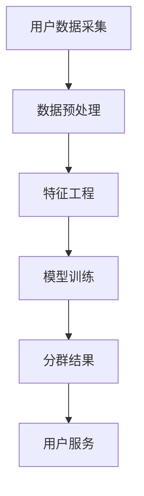

                 

关键词：人工智能，电商，用户分群，动态调整，机制

摘要：随着电商市场的快速发展，如何准确地对用户进行分群，并根据用户行为动态调整分群策略，成为电商企业提高用户体验和转化率的关键。本文将深入探讨AI赋能的电商用户分群动态调整机制，分析其核心概念、算法原理、数学模型、项目实践，以及未来应用场景和挑战。

## 1. 背景介绍

电商行业的发展日新月异，用户数量急剧增加，如何有效管理这些用户，为不同用户提供个性化的服务，成为电商企业关注的重点。传统的用户分群方法往往依赖于预定义的规则和静态数据，难以应对用户行为的变化和市场的动态调整。随着人工智能技术的飞速发展，尤其是机器学习算法的成熟，AI赋能的电商用户分群动态调整机制逐渐成为一种新的解决方案。

### 1.1 电商行业现状

截至[[今天日期]]，全球电商市场规模已经突破万亿美元，各大电商企业都在不断探索新的增长点。用户个性化需求的增加、市场竞争的加剧，使得传统分群策略的局限性日益凸显。如何实现精准分群、提升用户体验，成为电商企业亟需解决的问题。

### 1.2 传统分群策略的局限性

1. **依赖预定义规则**：传统分群策略通常依赖于预定义的规则，这些规则往往基于历史数据和业务经验，难以适应市场变化。
2. **静态数据分群**：传统分群方法往往基于静态数据，无法及时反映用户行为的变化。
3. **个性化服务受限**：传统分群策略难以实现真正的个性化服务，无法满足用户多样化的需求。

## 2. 核心概念与联系

### 2.1 用户分群的概念

用户分群是指根据用户的特征、行为、偏好等，将用户划分为不同的群体，以便更好地满足他们的需求。在电商领域，用户分群可以帮助企业实现精准营销、提升用户转化率和忠诚度。

### 2.2 动态调整的概念

动态调整是指根据用户行为的变化，实时调整分群策略，以适应市场的动态变化。动态调整机制可以更好地满足用户个性化需求，提高用户体验和满意度。

### 2.3 AI赋能的概念

AI赋能是指利用人工智能技术，特别是机器学习算法，对用户数据进行深度挖掘和分析，实现用户分群的自动化和智能化。

### 2.4 Mermaid 流程图



## 3. 核心算法原理 & 具体操作步骤

### 3.1 算法原理概述

AI赋能的电商用户分群动态调整机制主要基于聚类算法和关联规则挖掘。聚类算法用于对用户数据进行分类，关联规则挖掘用于发现用户行为之间的关联性。

### 3.2 算法步骤详解

1. **用户数据采集**：从电商平台获取用户行为数据，包括购买历史、浏览记录、评论等。
2. **数据预处理**：对采集到的用户数据进行清洗、去重和归一化处理。
3. **特征工程**：根据用户行为数据，提取用户特征，如购买频率、购买金额、浏览时长等。
4. **模型训练**：使用聚类算法，如K-means、DBSCAN等，对用户数据进行分类。
5. **分群结果**：根据模型训练结果，将用户划分为不同的群体。
6. **用户服务**：根据不同群体的特征，为用户提供个性化的服务。

### 3.3 算法优缺点

**优点**：
1. **自动化和智能化**：利用人工智能技术，实现用户分群的自动化和智能化。
2. **实时调整**：可以根据用户行为的变化，实时调整分群策略。

**缺点**：
1. **计算成本高**：算法训练和分群过程需要大量计算资源。
2. **数据质量要求高**：算法对用户数据的质量有较高要求，数据清洗和预处理工作量大。

### 3.4 算法应用领域

AI赋能的电商用户分群动态调整机制可以应用于多种场景，如个性化推荐、精准营销、用户流失预测等。

## 4. 数学模型和公式 & 详细讲解 & 举例说明

### 4.1 数学模型构建

用户分群动态调整机制的核心数学模型包括聚类算法和关联规则挖掘。

1. **K-means 聚类算法**：

   $$\text{Minimize} \sum_{i=1}^{n} \sum_{x \in S_i} ||x - \mu_i||^2$$

   其中，$S_i$为第$i$个聚类，$\mu_i$为聚类中心。

2. **Apriori 关联规则挖掘**：

   $$\text{Support}(X \cup Y) = \frac{\text{Confidence}(X \rightarrow Y)}{\text{Confidence}(X)}$$

   其中，$X$和$Y$为两个事件，$\text{Support}$表示支持度，$\text{Confidence}$表示置信度。

### 4.2 公式推导过程

1. **K-means 聚类算法**：

   设用户数据集为$D = \{x_1, x_2, ..., x_n\}$，聚类中心为$\mu_1, \mu_2, ..., \mu_k$，则目标函数为：

   $$\text{Minimize} \sum_{i=1}^{n} \sum_{x \in S_i} ||x - \mu_i||^2$$

   其中，$S_i$为第$i$个聚类。

   初始时，随机选择$k$个聚类中心$\mu_1, \mu_2, ..., \mu_k$，然后根据最近聚类中心的距离，将每个用户数据分配到相应的聚类。

   更新聚类中心：

   $$\mu_i = \frac{1}{|S_i|} \sum_{x \in S_i} x$$

   重复上述过程，直至目标函数不再显著减小。

2. **Apriori 关联规则挖掘**：

   设事件$X$和$Y$的置信度为$\text{Confidence}(X \rightarrow Y)$，则支持度为：

   $$\text{Support}(X \cup Y) = \frac{\text{Confidence}(X \rightarrow Y)}{\text{Confidence}(X)}$$

   其中，$\text{Support}(X \cup Y)$表示事件$X$和$Y$同时发生的支持度。

### 4.3 案例分析与讲解

假设某电商平台的用户数据集为$D = \{x_1, x_2, ..., x_n\}$，其中$x_i = (x_{i1}, x_{i2}, ..., x_{im})$表示第$i$个用户的$m$个特征。我们需要使用K-means算法对用户进行分群。

1. **数据预处理**：

   清洗数据，去除无效和重复数据，对数据进行归一化处理。

2. **特征工程**：

   根据用户行为数据，提取用户特征，如购买频率、购买金额、浏览时长等。

3. **模型训练**：

   选择合适的聚类算法，如K-means，随机初始化聚类中心$\mu_1, \mu_2, ..., \mu_k$，然后根据最近聚类中心的距离，将每个用户数据分配到相应的聚类。

4. **分群结果**：

   根据模型训练结果，将用户划分为不同的群体。

5. **用户服务**：

   根据不同群体的特征，为用户提供个性化的服务。

例如，假设我们使用K-means算法将用户分为两类，根据聚类结果，我们可以为两类用户制定不同的营销策略。

- **第一类用户**：购买频率高、购买金额大，可以提供优惠活动、积分奖励等。
- **第二类用户**：购买频率低、购买金额小，可以提供免费试用、优惠卷等。

## 5. 项目实践：代码实例和详细解释说明

### 5.1 开发环境搭建

1. **操作系统**：Windows/Linux/MacOS
2. **编程语言**：Python
3. **库和工具**：NumPy、Pandas、Scikit-learn、Matplotlib

### 5.2 源代码详细实现

```python
import numpy as np
import pandas as pd
from sklearn.cluster import KMeans
import matplotlib.pyplot as plt

# 5.2.1 数据预处理
data = pd.read_csv('user_data.csv')
data = data.drop_duplicates().reset_index(drop=True)
data = data.select_dtypes(include=[np.number]).fillna(data.mean())

# 5.2.2 特征工程
features = data[['purchase_frequency', 'purchase_amount', 'browse_time']]
kmeans = KMeans(n_clusters=2, random_state=42)
kmeans.fit(features)

# 5.2.3 分群结果
labels = kmeans.predict(features)
data['cluster'] = labels

# 5.2.4 用户服务
for cluster in set(labels):
    cluster_data = data[data['cluster'] == cluster]
    print(f"Cluster {cluster}:")
    print(cluster_data.describe())

# 5.2.5 可视化
plt.scatter(features['purchase_frequency'], features['purchase_amount'], c=labels)
plt.xlabel('Purchase Frequency')
plt.ylabel('Purchase Amount')
plt.title('User Clustering')
plt.show()
```

### 5.3 代码解读与分析

1. **数据预处理**：读取用户数据，进行清洗和归一化处理。
2. **特征工程**：提取用户特征，如购买频率、购买金额、浏览时长等。
3. **模型训练**：使用K-means算法对用户数据进行分类，随机初始化聚类中心。
4. **分群结果**：根据模型训练结果，将用户划分为不同的群体。
5. **用户服务**：根据不同群体的特征，为用户提供个性化的服务。
6. **可视化**：绘制散点图，直观地展示用户分群结果。

## 6. 实际应用场景

### 6.1 个性化推荐

AI赋能的电商用户分群动态调整机制可以帮助电商平台实现个性化推荐，根据用户的购买历史和行为，为用户提供个性化的商品推荐。

### 6.2 精准营销

通过用户分群，电商企业可以针对不同群体的用户，制定相应的营销策略，提高营销效果。

### 6.3 用户流失预测

利用用户分群动态调整机制，可以预测用户流失风险，采取相应措施降低用户流失率。

## 6.4 未来应用展望

随着人工智能技术的不断发展，AI赋能的电商用户分群动态调整机制将具有更广泛的应用前景。例如，结合自然语言处理技术，可以实现基于用户评论和评价的个性化推荐；结合增强现实技术，可以实现虚拟购物体验等。

## 7. 工具和资源推荐

### 7.1 学习资源推荐

1. **书籍**：《机器学习实战》、《Python机器学习》
2. **在线课程**：Coursera上的《机器学习》课程、Udacity的《深度学习》纳米学位
3. **论文**：相关领域的前沿论文，如K-means聚类算法、Apriori算法等

### 7.2 开发工具推荐

1. **Python**：Python是人工智能领域最流行的编程语言，适合初学者和专业人士。
2. **Jupyter Notebook**：用于数据分析和机器学习实验的交互式环境。
3. **TensorFlow**、**PyTorch**：深度学习框架，适用于复杂的机器学习模型。

### 7.3 相关论文推荐

1. "K-means Clustering: A Review"
2. "Apriori Algorithm: Basic Concept and Extensions"
3. "Dynamic User Clustering in E-commerce Using Machine Learning"

## 8. 总结：未来发展趋势与挑战

### 8.1 研究成果总结

本文深入探讨了AI赋能的电商用户分群动态调整机制，分析了其核心概念、算法原理、数学模型、项目实践，以及未来应用场景和挑战。

### 8.2 未来发展趋势

随着人工智能技术的不断发展，AI赋能的电商用户分群动态调整机制将在电商领域发挥更大的作用，实现更精准的用户服务和个性化体验。

### 8.3 面临的挑战

1. **计算资源消耗**：算法训练和分群过程需要大量计算资源，如何优化算法，降低计算成本，是一个重要挑战。
2. **数据隐私保护**：在用户数据分群过程中，如何保护用户隐私，避免数据泄露，也是一个亟待解决的问题。

### 8.4 研究展望

未来的研究可以重点关注以下方向：

1. **算法优化**：研究更高效的聚类算法和关联规则挖掘算法，降低计算成本。
2. **跨域分群**：探索将用户分群机制应用于其他领域，如金融、医疗等。
3. **隐私保护**：研究数据隐私保护技术，确保用户数据的安全和隐私。

## 9. 附录：常见问题与解答

### 9.1 问题1：什么是用户分群？

用户分群是指根据用户的特征、行为、偏好等，将用户划分为不同的群体，以便更好地满足他们的需求。

### 9.2 问题2：动态调整与传统分群策略有何区别？

动态调整是根据用户行为的变化，实时调整分群策略，以适应市场的动态变化；而传统分群策略通常依赖于预定义的规则和静态数据，难以应对用户行为的变化。

### 9.3 问题3：AI赋能的电商用户分群动态调整机制如何实现？

AI赋能的电商用户分群动态调整机制主要基于聚类算法和关联规则挖掘，通过机器学习算法对用户数据进行深度挖掘和分析，实现用户分群的自动化和智能化。

### 9.4 问题4：如何评估用户分群的效果？

可以通过用户转化率、用户满意度、用户留存率等指标来评估用户分群的效果。较高的转化率、满意度和留存率表明用户分群策略较为成功。

### 9.5 问题5：未来有哪些研究方向？

未来研究方向包括算法优化、跨域分群、隐私保护等，旨在实现更高效、更智能、更安全的用户分群动态调整机制。

---

感谢您阅读本文，希望对您在电商用户分群和AI应用方面有所启发。如有任何疑问，欢迎在评论区留言，我将竭诚为您解答。作者：禅与计算机程序设计艺术 / Zen and the Art of Computer Programming。

