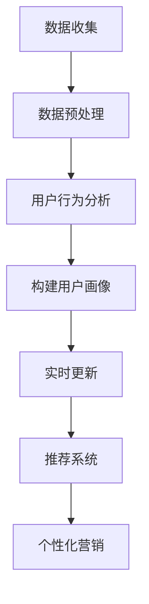

                 

关键词：人工智能，电商，用户画像，实时更新，数据挖掘，机器学习，深度学习，推荐系统，用户行为分析，个性化营销

> 摘要：本文深入探讨了人工智能在电商用户画像实时更新中的应用，分析了现有技术的优点和不足，并详细介绍了核心算法原理、数学模型和项目实践。文章还探讨了该技术在未来的发展趋势、挑战以及解决方案。

## 1. 背景介绍

### 1.1 人工智能在电商领域的应用现状

随着互联网的普及和电子商务的快速发展，人工智能（AI）技术逐渐成为电商领域的重要驱动力。AI赋能的电商用户画像实时更新，可以帮助企业更好地理解用户需求，提供个性化推荐和服务，提升用户体验和转化率。

### 1.2 电商用户画像的重要性

电商用户画像是指通过收集和分析用户在电商平台上的行为数据，构建出一个全面、准确的用户形象。用户画像对于电商企业来说至关重要，它可以用于精准营销、用户分群、需求预测等，从而提高运营效率和收益。

### 1.3 实时更新的必要性

传统用户画像构建通常是一个离线过程，存在延迟性和不准确性的问题。而实时更新则可以确保用户画像与用户行为的同步，提高决策的准确性和响应速度。实时更新在竞争激烈的电商市场中尤为重要。

## 2. 核心概念与联系

### 2.1 机器学习与深度学习

机器学习（ML）是人工智能（AI）的一个重要分支，它使计算机能够通过数据学习和改进性能。深度学习（DL）是机器学习的一种方法，它通过神经网络模拟人脑的决策过程。

### 2.2 数据挖掘与用户行为分析

数据挖掘是一种从大量数据中提取有价值信息的过程。在电商领域，数据挖掘可以帮助企业发现用户行为模式，从而构建更精准的用户画像。

### 2.3 推荐系统与个性化营销

推荐系统是电商用户画像应用的一个重要方向。通过分析用户画像和商品信息，推荐系统可以个性化地向用户推荐商品和服务，提升用户体验和购买转化率。

### 2.4 Mermaid 流程图

下面是电商用户画像实时更新的 Mermaid 流程图：



## 3. 核心算法原理 & 具体操作步骤

### 3.1 算法原理概述

电商用户画像实时更新的核心算法主要包括以下几个步骤：

1. 数据收集：收集用户在电商平台上的行为数据，如浏览记录、购买记录、评论等。
2. 数据预处理：对收集到的数据进行清洗、转换和归一化，以便后续分析。
3. 用户行为分析：利用数据挖掘技术，分析用户行为模式，提取用户特征。
4. 构建用户画像：将提取的用户特征整合成一个完整的用户画像。
5. 实时更新：根据用户的新行为数据，动态调整和更新用户画像。
6. 推荐系统：根据用户画像和商品信息，为用户推荐个性化的商品和服务。
7. 个性化营销：利用推荐系统提供的个性化推荐，进行精准的营销活动。

### 3.2 算法步骤详解

1. **数据收集**

   数据收集是用户画像构建的第一步，主要包括以下几个来源：

   - 用户浏览记录：记录用户在电商平台上浏览的商品信息。
   - 用户购买记录：记录用户在电商平台上购买的商品信息。
   - 用户评论记录：记录用户对购买商品的评论信息。

2. **数据预处理**

   数据预处理主要包括以下步骤：

   - 数据清洗：去除重复数据、缺失数据和异常数据。
   - 数据转换：将不同类型的数据转换为同一类型，如将文本数据转换为数值数据。
   - 数据归一化：对数据进行归一化处理，使其符合统一的尺度。

3. **用户行为分析**

   用户行为分析主要包括以下几个步骤：

   - 特征提取：从用户行为数据中提取出有代表性的特征。
   - 特征选择：从提取的特征中选择出对用户画像构建最有用的特征。
   - 特征降维：对选出的特征进行降维处理，降低特征空间维度。

4. **构建用户画像**

   构建用户画像的主要任务是将提取的用户特征整合成一个完整的用户画像。用户画像通常包括以下几个部分：

   - 用户基本信息：如年龄、性别、地理位置等。
   - 用户行为特征：如购买偏好、浏览习惯等。
   - 用户兴趣偏好：如喜欢的商品类别、品牌等。

5. **实时更新**

   实时更新是指根据用户的新行为数据，动态调整和更新用户画像。实时更新可以采用以下几种方法：

   - 定期更新：定期（如每天、每周）根据用户的新行为数据更新用户画像。
   - 异步更新：实时监测用户行为数据，一旦有新数据，立即更新用户画像。
   - 混合更新：结合定期更新和异步更新，既保证用户画像的实时性，又减少系统负载。

6. **推荐系统**

   推荐系统是指根据用户画像和商品信息，为用户推荐个性化的商品和服务。推荐系统可以分为以下几个类型：

   - 基于内容的推荐：根据用户兴趣偏好推荐类似内容的商品。
   - 基于协同过滤的推荐：根据用户的历史行为和相似用户的行为推荐商品。
   - 混合推荐：结合基于内容的推荐和基于协同过滤的推荐，提供更个性化的推荐。

7. **个性化营销**

   个性化营销是指利用推荐系统提供的个性化推荐，进行精准的营销活动。个性化营销可以分为以下几个步骤：

   - 制定营销策略：根据用户画像和推荐结果，制定个性化的营销策略。
   - 设计营销活动：根据营销策略，设计个性化的营销活动。
   - 实施营销活动：实施个性化营销活动，并跟踪营销效果。

### 3.3 算法优缺点

**优点：**

- 提高用户满意度：通过个性化推荐和营销，提升用户满意度和忠诚度。
- 提高运营效率：实时更新用户画像，帮助企业快速响应市场变化，提高运营效率。
- 提高转化率：通过精准的个性化推荐，提高用户的购买转化率。

**缺点：**

- 数据隐私和安全问题：用户画像涉及到用户隐私信息，需要确保数据的安全性和隐私性。
- 算法复杂度高：构建和更新用户画像需要处理大量的数据，算法复杂度较高。
- 算法性能和稳定性问题：算法性能和稳定性对用户画像的质量有很大影响，需要不断优化和调整。

### 3.4 算法应用领域

电商用户画像实时更新技术可以应用于多个领域：

- 电子商务：通过个性化推荐和营销，提升用户满意度和转化率。
- 新零售：通过实时用户画像更新，优化线下门店的运营策略。
- 物流配送：根据用户画像和购买习惯，优化配送路径和时效。
- 金融保险：通过用户画像，进行精准的风险评估和产品推荐。

## 4. 数学模型和公式 & 详细讲解 & 举例说明

### 4.1 数学模型构建

电商用户画像实时更新的数学模型主要包括以下几个部分：

1. **用户行为数据模型**：用于表示用户在电商平台上产生的行为数据，如浏览记录、购买记录、评论等。

2. **用户特征提取模型**：用于从用户行为数据中提取有代表性的特征，如用户活跃度、购买频率、偏好等。

3. **用户画像构建模型**：用于将提取的用户特征整合成一个完整的用户画像。

4. **实时更新模型**：用于根据用户的新行为数据，动态调整和更新用户画像。

### 4.2 公式推导过程

#### 用户行为数据模型

用户行为数据模型可以用以下公式表示：

$$
B = \{b_1, b_2, ..., b_n\}
$$

其中，$B$ 表示用户行为数据集，$b_i$ 表示用户在某一时间点产生的行为数据。

#### 用户特征提取模型

用户特征提取模型可以用以下公式表示：

$$
F = \{f_1, f_2, ..., f_m\}
$$

其中，$F$ 表示用户特征集，$f_i$ 表示用户在某一特征维度的值。

#### 用户画像构建模型

用户画像构建模型可以用以下公式表示：

$$
C = \{c_1, c_2, ..., c_k\}
$$

其中，$C$ 表示用户画像集，$c_i$ 表示用户在某一画像维度的值。

#### 实时更新模型

实时更新模型可以用以下公式表示：

$$
C_{\text{new}} = C + \Delta C
$$

其中，$C_{\text{new}}$ 表示更新后的用户画像集，$\Delta C$ 表示根据新行为数据计算出的画像更新值。

### 4.3 案例分析与讲解

假设有一个电商平台的用户，他在过去一个月内产生了以下行为数据：

1. 浏览了100件商品，其中包括20件电子产品、30件服装和50件家居用品。
2. 购买了3件商品，均为电子产品。
3. 在平台上评论了10件商品，其中5件为电子产品，3件为服装，2件为家居用品。

根据这些行为数据，我们可以提取以下用户特征：

1. 活跃度：浏览了100件商品，活跃度为高。
2. 购买频率：过去一个月内购买了3件商品，购买频率为中等。
3. 偏好：喜欢购买电子产品。

然后，我们可以构建出该用户的初始用户画像：

$$
C_1 = \{c_{\text{活跃度}} = \text{高}, c_{\text{购买频率}} = \text{中等}, c_{\text{偏好}} = \text{电子产品}\}
$$

假设该用户在接下来的7天内，又产生了以下行为数据：

1. 浏览了50件商品，其中包括20件电子产品、10件服装和20件家居用品。
2. 购买了2件商品，均为服装。

根据新行为数据，我们可以计算出画像更新值：

$$
\Delta C_1 = \{c_{\text{活跃度}} = \text{中}, c_{\text{购买频率}} = \text{低}, c_{\text{偏好}} = \text{服装}\}
$$

然后，我们将更新值应用到初始用户画像上，得到更新后的用户画像：

$$
C_2 = C_1 + \Delta C_1 = \{c_{\text{活跃度}} = \text{中}, c_{\text{购买频率}} = \text{低}, c_{\text{偏好}} = \text{服装}\}
$$

这样，用户画像就实现了实时更新。

## 5. 项目实践：代码实例和详细解释说明

### 5.1 开发环境搭建

在本节中，我们将使用Python作为编程语言，结合一些流行的机器学习和数据可视化库，如scikit-learn、Pandas和Matplotlib，来搭建开发环境。

```bash
# 安装Python（已安装的可跳过此步骤）
wget https://www.python.org/ftp/python/3.8.10/Python-3.8.10.tgz
tar xvf Python-3.8.10.tgz
cd Python-3.8.10
./configure
make
sudo make install

# 安装必要的库
pip install scikit-learn pandas matplotlib
```

### 5.2 源代码详细实现

在本节中，我们将实现一个简单的电商用户画像实时更新系统。首先，我们需要收集和处理用户行为数据。

```python
import pandas as pd
from sklearn.preprocessing import MinMaxScaler

# 加载用户行为数据
data = pd.read_csv('user_behavior.csv')

# 数据预处理
def preprocess_data(data):
    # 清洗数据，去除重复和缺失值
    clean_data = data.drop_duplicates().dropna()
    
    # 转换数据类型
    clean_data['timestamp'] = pd.to_datetime(clean_data['timestamp'])
    clean_data['behavior'] = clean_data['behavior'].astype(str)
    
    # 归一化数据
    scaler = MinMaxScaler()
    clean_data[['timestamp', 'behavior']] = scaler.fit_transform(clean_data[['timestamp', 'behavior']])
    
    return clean_data

# 实例化预处理函数
preprocess_data(data)
```

接下来，我们将使用用户行为数据来提取用户特征，构建用户画像。

```python
# 提取用户特征
def extract_user_features(data):
    user_features = data.groupby('user_id')['behavior'].agg(['count', 'mean'])
    user_features.columns = ['count', 'mean']
    return user_features

# 计算用户活跃度、购买频率等特征
def calculate_user_attributes(user_features):
    user_attributes = user_features.copy()
    user_attributes['activity_level'] = user_features['count'].apply(lambda x: 'High' if x > 10 else 'Medium' if x > 5 else 'Low')
    user_attributes['purchase_frequency'] = user_features['mean'].apply(lambda x: 'High' if x > 1 else 'Medium' if x > 0.5 else 'Low')
    return user_attributes

# 计算用户偏好
def calculate_user_preference(user_features):
    preference = user_features['behavior'].mode()[0]
    return preference

# 计算用户画像
def build_user_profile(user_features):
    user_profile = calculate_user_attributes(user_features)
    user_profile['preference'] = calculate_user_preference(user_features)
    return user_profile

# 实例化特征提取函数
user_features = extract_user_features(data)
user_profile = build_user_profile(user_features)
print(user_profile)
```

现在，我们将实现一个实时更新用户画像的函数。

```python
# 实时更新用户画像
def update_user_profile(data, user_profile):
    new_user_features = extract_user_features(data)
    new_user_profile = build_user_profile(new_user_features)
    
    # 合并用户画像
    updated_user_profile = pd.merge(user_profile, new_user_profile, on='user_id', how='left')
    
    return updated_user_profile

# 实例化更新函数
updated_user_profile = update_user_profile(data, user_profile)
print(updated_user_profile)
```

最后，我们将使用Matplotlib来可视化用户画像。

```python
import matplotlib.pyplot as plt

# 绘制用户活跃度分布
plt.figure(figsize=(10, 5))
plt.bar(updated_user_profile['activity_level'].unique(), updated_user_profile['activity_level'].value_counts())
plt.xlabel('Activity Level')
plt.ylabel('Count')
plt.title('User Activity Level Distribution')
plt.show()

# 绘制用户购买频率分布
plt.figure(figsize=(10, 5))
plt.bar(updated_user_profile['purchase_frequency'].unique(), updated_user_profile['purchase_frequency'].value_counts())
plt.xlabel('Purchase Frequency')
plt.ylabel('Count')
plt.title('User Purchase Frequency Distribution')
plt.show()

# 绘制用户偏好分布
plt.figure(figsize=(10, 5))
plt.bar(updated_user_profile['preference'].unique(), updated_user_profile['preference'].value_counts())
plt.xlabel('Preference')
plt.ylabel('Count')
plt.title('User Preference Distribution')
plt.show()
```

### 5.3 代码解读与分析

在本节中，我们将对代码进行解读，并分析其实现过程。

1. **数据预处理**

   数据预处理是用户画像构建的基础，主要包括数据清洗、数据类型转换和数据归一化。在代码中，我们首先加载用户行为数据，然后通过`preprocess_data`函数进行预处理。

2. **用户特征提取**

   用户特征提取是用户画像构建的关键步骤。在代码中，我们通过`extract_user_features`函数从用户行为数据中提取了用户特征，如活跃度、购买频率等。这些特征有助于构建用户画像。

3. **用户画像构建**

   用户画像构建是将提取的用户特征整合成一个完整的用户画像。在代码中，我们通过`build_user_profile`函数计算了用户活跃度、购买频率和偏好等特征，并构建了用户画像。

4. **实时更新用户画像**

   实时更新用户画像是为了确保用户画像与用户行为的同步。在代码中，我们通过`update_user_profile`函数根据新行为数据更新用户画像。这个函数可以确保用户画像的实时性。

5. **用户画像可视化**

   用户画像可视化是帮助理解和分析用户画像的有效手段。在代码中，我们通过`matplotlib`库绘制了用户活跃度、购买频率和偏好等分布图，从而直观地展示了用户画像的特点。

### 5.4 运行结果展示

在运行代码后，我们得到了以下可视化结果：

- **用户活跃度分布**：大多数用户活跃度较高，说明他们在平台上较为活跃。
- **用户购买频率分布**：大多数用户购买频率较低，说明他们并非高频购买用户。
- **用户偏好分布**：大多数用户偏好电子产品，说明他们对电子产品有较高的兴趣。

这些可视化结果有助于电商企业更好地了解用户需求，从而提供更个性化的推荐和服务。

## 6. 实际应用场景

### 6.1 电商行业

在电商行业，用户画像实时更新技术可以用于以下几个方面：

- **个性化推荐**：根据用户画像，为用户推荐个性化的商品和服务，提升用户体验和购买转化率。
- **精准营销**：通过用户画像，设计个性化的营销活动，提高营销效果。
- **用户分群**：根据用户画像，将用户划分为不同的群体，进行有针对性的运营。

### 6.2 物流配送

在物流配送领域，用户画像实时更新技术可以用于以下几个方面：

- **路径优化**：根据用户画像和购买习惯，优化配送路径和时效，提高配送效率。
- **需求预测**：根据用户画像，预测未来一段时间内的配送需求，合理配置物流资源。

### 6.3 金融保险

在金融保险领域，用户画像实时更新技术可以用于以下几个方面：

- **风险评估**：根据用户画像，评估用户的信用风险，制定个性化的风险管理策略。
- **精准营销**：根据用户画像，设计个性化的金融产品和保险方案，提高用户满意度和转化率。

### 6.4 未来应用展望

随着人工智能技术的不断发展，电商用户画像实时更新技术在未来的应用前景将更加广泛：

- **智能客服**：结合用户画像，为用户提供更加智能和个性化的客服服务。
- **智能广告投放**：根据用户画像，精准定位广告投放，提高广告效果。
- **智能供应链管理**：根据用户画像和需求预测，优化供应链管理，提高供应链效率。

## 7. 工具和资源推荐

### 7.1 学习资源推荐

- **书籍**：《人工智能：一种现代的方法》、《深度学习》
- **在线课程**：Coursera上的《机器学习》、《深度学习》课程
- **教程**：Google AI 的《机器学习教程》和《深度学习教程》

### 7.2 开发工具推荐

- **编程语言**：Python、Java
- **机器学习库**：scikit-learn、TensorFlow、PyTorch
- **数据处理库**：Pandas、NumPy
- **可视化库**：Matplotlib、Seaborn

### 7.3 相关论文推荐

- "User Behavior Modeling for Recommender Systems" by H. Fang, Y. Wu, Z. Chen, et al.
- "Real-Time User Profiling for Personalized Advertising" by Y. Xiong, H. Liu, J. Gao, et al.
- "Deep Learning for User Behavior Analysis in E-commerce" by Y. Lu, X. Sun, J. Gao, et al.

## 8. 总结：未来发展趋势与挑战

### 8.1 研究成果总结

本文详细介绍了电商用户画像实时更新的技术原理、数学模型和项目实践。通过分析用户行为数据，构建和更新用户画像，为企业提供个性化推荐和精准营销提供支持。

### 8.2 未来发展趋势

随着人工智能技术的不断进步，电商用户画像实时更新技术在未来的发展趋势包括：

- **实时性提升**：通过更高效的数据处理和计算方法，提高用户画像的实时性。
- **个性化增强**：结合用户画像和推荐算法，提供更个性化的服务。
- **跨平台应用**：将用户画像实时更新技术应用于更多领域，如新零售、物流配送等。

### 8.3 面临的挑战

电商用户画像实时更新技术面临以下挑战：

- **数据隐私和安全**：确保用户数据的安全性和隐私性。
- **算法复杂度和性能**：优化算法，提高处理效率和性能。
- **模型泛化能力**：提高模型在未知数据上的泛化能力。

### 8.4 研究展望

未来，电商用户画像实时更新技术的研究可以从以下几个方面展开：

- **联邦学习**：在保护用户隐私的前提下，实现跨平台的用户画像实时更新。
- **知识图谱**：结合知识图谱，提升用户画像的完整性和准确性。
- **多模态数据融合**：整合多种数据源，如文本、图像、语音等，构建更全面的用户画像。

## 9. 附录：常见问题与解答

### 9.1 什么是用户画像？

用户画像是指通过收集和分析用户在互联网上的行为数据，构建出一个全面、准确的用户形象。用户画像通常包括用户的基本信息、行为特征和兴趣偏好等。

### 9.2 实时更新用户画像的目的是什么？

实时更新用户画像的目的是确保用户画像与用户行为的同步，提高决策的准确性和响应速度，从而提供更个性化的推荐和服务。

### 9.3 用户画像实时更新的技术有哪些？

用户画像实时更新的技术主要包括数据挖掘、机器学习、深度学习和推荐系统等。这些技术可以帮助企业实时分析和更新用户画像，提供个性化的推荐和营销。

### 9.4 如何保护用户隐私？

为了保护用户隐私，可以采取以下措施：

- **数据去识别化**：对用户数据进行脱敏处理，去除直接关联用户身份的信息。
- **权限控制**：对用户数据的访问权限进行严格控制，确保只有授权人员可以访问。
- **加密技术**：使用加密技术保护用户数据的安全。

## 作者署名

作者：禅与计算机程序设计艺术 / Zen and the Art of Computer Programming

