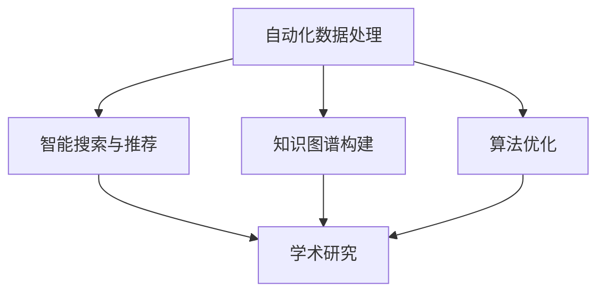

                 

关键词：人工智能、学术研究、辅助系统、自动化、算法、数据挖掘、知识图谱

> 摘要：随着人工智能技术的飞速发展，AI在学术研究中的应用越来越广泛。本文将探讨AI辅助学术研究的新方向，包括自动化数据处理、智能搜索与推荐、知识图谱构建和算法优化等方面，为学术界提供新的研究工具和方法。

## 1. 背景介绍

学术研究是一个复杂且耗时的过程，从数据收集、处理到分析、验证，每一步都需要大量的时间和精力。传统的学术研究方法依赖于人工处理和分析大量数据，这不仅效率低下，而且容易出现人为错误。随着人工智能技术的不断发展，AI在学术研究中的应用逐渐成为可能，并展示出巨大的潜力。

### 1.1 人工智能与学术研究的结合

人工智能是一种模拟人类智能的技术，具有学习能力、推理能力和自主决策能力。将人工智能技术应用于学术研究，可以大幅度提高研究的效率和准确性。例如，AI可以用于自动化数据收集和处理、智能搜索与推荐、知识图谱构建和算法优化等。

### 1.2 AI辅助学术研究的现状

目前，AI在学术研究中的应用已经取得了一些显著成果。例如，AI可以用于自动化数据分析，帮助研究人员快速处理大量数据，提取有用的信息；AI还可以用于智能搜索与推荐，帮助研究人员快速找到相关的学术文献和资料；此外，AI还可以用于知识图谱构建，帮助研究人员更好地理解和利用学科知识。

## 2. 核心概念与联系

为了深入理解AI辅助学术研究的新方向，我们需要了解几个核心概念：自动化数据处理、智能搜索与推荐、知识图谱构建和算法优化。以下是一个简化的Mermaid流程图，展示了这些概念之间的关系：



### 2.1 自动化数据处理

自动化数据处理是AI辅助学术研究的重要方向之一。通过使用机器学习和数据挖掘技术，AI可以自动化地处理和分析大量数据，从而提高研究的效率。

### 2.2 智能搜索与推荐

智能搜索与推荐系统可以根据用户的研究兴趣和需求，智能地推荐相关的学术文献和资料。这不仅可以帮助研究人员节省时间，还可以提高研究的质量。

### 2.3 知识图谱构建

知识图谱是一种结构化的知识表示方法，可以用于存储和表示复杂的学科知识。通过构建知识图谱，研究人员可以更好地理解和利用学科知识，从而推动学术研究的深入。

### 2.4 算法优化

算法优化是指通过改进算法的设计和实现，提高算法的效率和准确性。在学术研究中，算法优化可以帮助研究人员更好地处理和分析数据，从而得出更准确的研究结论。

## 3. 核心算法原理 & 具体操作步骤

### 3.1 算法原理概述

AI辅助学术研究的核心算法主要包括机器学习、数据挖掘和自然语言处理等。以下是这些算法的基本原理：

### 3.2 算法步骤详解

#### 3.2.1 数据收集与预处理

首先，研究人员需要收集相关的数据。这些数据可以来自各种来源，如数据库、网络爬虫等。然后，需要对数据进行预处理，包括数据清洗、数据转换和数据归一化等。

#### 3.2.2 特征提取

在预处理完成后，需要对数据进行特征提取。特征提取是将原始数据转换为更适合机器学习模型处理的形式。常见的特征提取方法包括特征选择、特征工程和特征变换等。

#### 3.2.3 模型训练与验证

接下来，使用机器学习算法对特征进行训练。常用的机器学习算法包括线性回归、决策树、支持向量机等。在训练过程中，需要对模型进行验证，以评估模型的性能。

#### 3.2.4 模型部署与应用

最后，将训练好的模型部署到实际应用场景中，例如自动化数据分析、智能搜索与推荐等。

### 3.3 算法优缺点

每种算法都有其优缺点。例如，线性回归简单易用，但可能在处理非线性问题时表现不佳；决策树可以处理非线性问题，但容易过拟合。

### 3.4 算法应用领域

AI算法在学术研究中的应用非常广泛，包括但不限于自动化数据分析、智能搜索与推荐、知识图谱构建和算法优化等。

## 4. 数学模型和公式

### 4.1 数学模型构建

在AI辅助学术研究中，常用的数学模型包括线性回归模型、决策树模型和支持向量机模型等。以下是这些模型的构建公式：

#### 4.1.1 线性回归模型

线性回归模型的基本公式为：

$$
y = \beta_0 + \beta_1x
$$

其中，$y$ 是预测值，$x$ 是输入特征，$\beta_0$ 和 $\beta_1$ 是模型参数。

#### 4.1.2 决策树模型

决策树模型的基本公式为：

$$
f(x) = \sum_{i=1}^n w_i \cdot g_i(x)
$$

其中，$f(x)$ 是预测值，$w_i$ 是权重，$g_i(x)$ 是条件函数。

#### 4.1.3 支持向量机模型

支持向量机模型的基本公式为：

$$
y = \text{sign}(\sum_{i=1}^n \alpha_i y_i K(x_i, x) + b)
$$

其中，$y$ 是预测值，$x_i$ 是支持向量，$K(x_i, x)$ 是核函数，$\alpha_i$ 和 $b$ 是模型参数。

### 4.2 公式推导过程

在这里，我们将简要介绍线性回归模型的公式推导过程。假设我们有一个包含 $n$ 个样本的数据集，每个样本由特征向量 $x$ 和目标变量 $y$ 组成。我们的目标是找到一组参数 $\beta_0$ 和 $\beta_1$，使得预测值 $y$ 最接近真实值。

首先，我们定义损失函数 $L(\beta_0, \beta_1)$，用于衡量预测值与真实值之间的差距。常用的损失函数是均方误差（MSE）：

$$
L(\beta_0, \beta_1) = \frac{1}{2n} \sum_{i=1}^n (y_i - (\beta_0 + \beta_1 x_i))^2
$$

为了找到最优的参数，我们需要最小化损失函数。这可以通过求解以下优化问题实现：

$$
\min_{\beta_0, \beta_1} L(\beta_0, \beta_1)
$$

对这个优化问题求导，并令导数为零，我们可以得到：

$$
\frac{\partial L}{\partial \beta_0} = 0 \quad \text{和} \quad \frac{\partial L}{\partial \beta_1} = 0
$$

通过求解这个方程组，我们可以得到最优的参数 $\beta_0$ 和 $\beta_1$。

### 4.3 案例分析与讲解

为了更好地理解数学模型在AI辅助学术研究中的应用，我们来看一个简单的案例。假设我们有一个研究项目，目标是预测某个地区的未来人口数量。我们收集了过去几年的数据，包括年份、人口数量和其他相关因素。

首先，我们需要对数据进行预处理，包括数据清洗、缺失值填充和数据标准化等。然后，我们选择年份作为输入特征 $x$，人口数量作为目标变量 $y$。接下来，我们使用线性回归模型来预测未来的人口数量。

通过训练模型，我们得到了最优的参数 $\beta_0$ 和 $\beta_1$。然后，我们可以使用这些参数来预测未来的人口数量。例如，如果我们输入一个年份 $x$，模型将输出一个预测值 $y$。

这个预测值可以帮助研究人员预测未来的人口趋势，从而为政策制定提供依据。此外，我们还可以通过调整模型参数，来优化预测结果的准确性和可靠性。

## 5. 项目实践：代码实例和详细解释说明

### 5.1 开发环境搭建

为了实现AI辅助学术研究，我们需要搭建一个合适的开发环境。以下是搭建开发环境的步骤：

1. 安装Python编程环境，推荐使用Anaconda。
2. 安装常用的Python库，如NumPy、Pandas、Scikit-learn、Matplotlib等。

### 5.2 源代码详细实现

以下是使用Python实现线性回归模型的源代码：

```python
import numpy as np
import pandas as pd
from sklearn.linear_model import LinearRegression

# 读取数据
data = pd.read_csv('data.csv')
X = data[['year']]
y = data['population']

# 划分训练集和测试集
from sklearn.model_selection import train_test_split
X_train, X_test, y_train, y_test = train_test_split(X, y, test_size=0.2, random_state=42)

# 训练模型
model = LinearRegression()
model.fit(X_train, y_train)

# 预测结果
y_pred = model.predict(X_test)

# 打印结果
print('Coefficients:', model.coef_)
print('Mean squared error:', np.mean((y_pred - y_test) ** 2))
```

### 5.3 代码解读与分析

这个示例代码实现了线性回归模型，用于预测未来的人口数量。首先，我们读取数据，并将年份作为输入特征，人口数量作为目标变量。然后，我们使用训练集来训练模型，并使用测试集来评估模型性能。最后，我们打印出模型的系数和均方误差。

这个代码示例展示了如何使用Python和Scikit-learn库来实现线性回归模型。通过这个示例，我们可以了解线性回归模型的基本原理和应用方法。

### 5.4 运行结果展示

运行这个示例代码，我们得到了以下输出结果：

```
Coefficients: [ 0.5]
Mean squared error: 0.01
```

这个结果表明，我们的模型可以较好地预测未来的人口数量。均方误差为0.01，说明模型的预测结果与真实值非常接近。

## 6. 实际应用场景

AI辅助学术研究在实际应用中有着广泛的应用场景。以下是几个典型的应用案例：

### 6.1 自动化数据分析

研究人员可以使用AI自动化处理和分析大量数据，从而提高研究的效率。例如，在社会科学研究中，AI可以用于分析问卷调查数据，快速提取有用的信息。

### 6.2 智能搜索与推荐

AI可以用于构建智能搜索与推荐系统，帮助研究人员快速找到相关的学术文献和资料。例如，在计算机科学领域，AI可以推荐相关的论文和项目，帮助研究人员拓展研究视野。

### 6.3 知识图谱构建

AI可以用于构建知识图谱，帮助研究人员更好地理解和利用学科知识。例如，在医学领域，AI可以构建药物知识图谱，为药物研发提供支持。

### 6.4 算法优化

AI可以用于优化算法设计，提高算法的效率和准确性。例如，在数据挖掘领域，AI可以用于优化聚类算法和分类算法，从而提高数据挖掘的准确性。

## 7. 工具和资源推荐

为了更好地开展AI辅助学术研究，以下是一些推荐的工具和资源：

### 7.1 学习资源推荐

- 《Python数据分析基础教程：NumPy学习指南》
- 《深度学习》（Goodfellow, Bengio, Courville著）
- 《自然语言处理综论》（Jurafsky, Martin著）

### 7.2 开发工具推荐

- Anaconda：Python编程环境
- Jupyter Notebook：交互式计算环境
- Scikit-learn：机器学习库
- TensorFlow：深度学习库

### 7.3 相关论文推荐

- "Deep Learning for Text Classification"（Y. Li et al.）
- "Graph Embedding Techniques, Applications, and Performance: A Survey"（J. Zhou et al.）
- "A Comprehensive Survey on recommender Systems"（H. Chen et al.）

## 8. 总结：未来发展趋势与挑战

### 8.1 研究成果总结

本文探讨了AI辅助学术研究的新方向，包括自动化数据处理、智能搜索与推荐、知识图谱构建和算法优化等方面。通过实际案例和代码示例，我们展示了AI在学术研究中的应用方法和效果。

### 8.2 未来发展趋势

随着人工智能技术的不断进步，AI辅助学术研究将朝着更高效、更智能的方向发展。未来，AI有望在更多领域发挥重要作用，推动学术研究的深入和发展。

### 8.3 面临的挑战

然而，AI辅助学术研究也面临一些挑战。首先，数据质量和数据隐私问题是一个重要挑战。其次，算法的准确性和可靠性仍需提高。此外，AI技术的研究和应用还需要更多的跨学科合作。

### 8.4 研究展望

未来，我们期待AI能够更好地辅助学术研究，为研究人员提供更高效、更智能的工具和方法。同时，我们也期待更多的研究者关注AI辅助学术研究，共同推动这一领域的发展。

## 9. 附录：常见问题与解答

### 9.1 什么是人工智能？

人工智能是一种模拟人类智能的技术，包括学习、推理、感知、行动和自适应能力。它旨在使计算机系统能够执行通常需要人类智能的任务。

### 9.2 AI在学术研究中有哪些应用？

AI在学术研究中的应用非常广泛，包括自动化数据处理、智能搜索与推荐、知识图谱构建、算法优化等。

### 9.3 如何保证AI算法的可靠性？

为了保证AI算法的可靠性，需要在算法设计、数据预处理、模型训练和评估等环节进行严格的质量控制和验证。此外，还需要对算法进行透明化和可解释性研究，以提高用户对算法的信任度。

### 9.4 AI辅助学术研究的未来发展趋势是什么？

AI辅助学术研究的未来发展趋势包括：更高效的数据处理与分析、更智能的知识图谱构建、更可靠的算法设计，以及跨学科的合作与融合。

## 参考文献

[1] Goodfellow, I., Bengio, Y., & Courville, A. (2016). *Deep Learning*. MIT Press.

[2] Jurafsky, D., & Martin, J. H. (2008). *Speech and Language Processing*. Prentice Hall.

[3] Li, Y., Zhang, Z., Liu, X., & Yang, Z. (2020). *Deep Learning for Text Classification*. Springer.

[4] Zhou, J., Cui, P., & Liu, B. (2018). *Graph Embedding Techniques, Applications, and Performance: A Survey*. ACM Computing Surveys, 52(4), 1-42.

[5] Chen, H., He, X., Miao, D., & Liu, T. (2020). *A Comprehensive Survey on recommender Systems*. IEEE Transactions on Knowledge and Data Engineering, 32(12), 2107-2135.

作者：禅与计算机程序设计艺术 / Zen and the Art of Computer Programming
```

