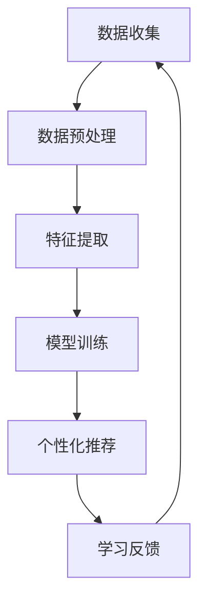

                 

关键词：人工智能，个性化学习，教育技术，学习路径设计，教育数据挖掘，算法优化，机器学习

> 摘要：随着人工智能技术的不断发展，教育领域迎来了革命性的变革。本文深入探讨了人工智能在个性化学习路径设计中的应用，分析了现有技术及其面临的挑战，提出了优化策略和未来的研究方向，以期为教育技术的发展提供新的视角。

## 1. 背景介绍

在教育领域，个性化学习是一种越来越受欢迎的教学方法，它旨在根据学生的个体差异，为他们量身定制学习路径和资源。然而，传统的教育模式往往缺乏对学生个性化需求的深入理解和满足，这限制了学习效果和学生的学习动力。

近年来，人工智能（AI）技术的迅猛发展为个性化学习提供了新的契机。AI能够通过数据分析和机器学习算法，分析学生的学习行为和成绩，预测他们的学习需求和潜在问题，从而提供个性化的学习建议。此外，AI还能自动生成适应学生水平的学习资源和练习题，提高学习效率和效果。

本文将重点探讨如何利用AI技术设计个性化学习路径，以提升教育质量和学生的学习体验。

### 1.1 个性化学习的定义和重要性

个性化学习是一种以学生为中心的教育模式，强调根据每个学生的兴趣、学习风格和认知水平来设计教学策略。与传统的一刀切教学模式相比，个性化学习能够更好地满足学生的个体需求，促进他们的全面发展。

### 1.2 人工智能在教育中的应用

人工智能在教育中的应用主要包括智能辅导系统、自适应学习平台、在线教育资源的推荐系统等。这些应用通过收集和分析学生的数据，提供个性化的学习建议和资源，从而提高学习效果。

## 2. 核心概念与联系

为了深入理解AI辅助个性化学习路径设计，我们需要了解以下几个核心概念：

### 2.1 教育数据挖掘

教育数据挖掘是指利用统计学、机器学习等方法从教育数据中提取有价值的信息和知识，以支持教育决策和教学改进。教育数据包括学生的成绩、行为、兴趣、学习进度等多个方面。

### 2.2 机器学习算法

机器学习算法是AI的核心技术，它通过从数据中学习规律和模式，从而对未知数据进行预测和分类。在个性化学习路径设计中，常用的机器学习算法包括决策树、支持向量机、神经网络等。

### 2.3 个性化学习模型

个性化学习模型是用于描述和预测学生学习行为的数学模型，它通常基于学生的学习数据和学习目标。常见的个性化学习模型包括协作过滤、基于内容的推荐、混合推荐等。

### 2.4 Mermaid 流程图



### 2.5 关联分析

关联分析是一种用于发现数据中潜在关系的分析方法，它可以帮助我们了解学生的学习行为和学习效果之间的关系。例如，通过关联分析可以发现哪些学习资源对提高学生成绩最有帮助。

## 3. 核心算法原理 & 具体操作步骤

### 3.1 算法原理概述

AI辅助个性化学习路径设计的核心算法通常包括以下几个步骤：

1. **数据收集**：收集学生的成绩、行为、兴趣等数据。
2. **数据预处理**：清洗和整理数据，为后续分析做好准备。
3. **特征提取**：从数据中提取有用的特征，如学生成绩的趋势、学习习惯等。
4. **模型训练**：使用机器学习算法训练个性化学习模型。
5. **个性化推荐**：根据模型为学生推荐适合的学习路径和资源。
6. **学习反馈**：收集学生的反馈，用于模型优化和迭代。

### 3.2 算法步骤详解

#### 3.2.1 数据收集

数据收集是整个流程的基础，它决定了后续分析的质量。数据来源可以包括学习平台、考试系统、问卷调查等。

#### 3.2.2 数据预处理

数据预处理包括数据清洗、数据转换和数据归一化等步骤。数据清洗旨在去除无效和错误的数据，数据转换旨在将不同类型的数据转换为同一类型，数据归一化旨在消除数据量级对分析结果的影响。

#### 3.2.3 特征提取

特征提取是关键步骤，它决定了模型对数据的理解和学习能力。常见的特征提取方法包括统计特征、文本特征、序列特征等。

#### 3.2.4 模型训练

模型训练是使用机器学习算法学习数据中的规律和模式。常见的机器学习算法包括线性回归、决策树、神经网络等。

#### 3.2.5 个性化推荐

个性化推荐是根据模型为学生推荐适合的学习路径和资源。推荐算法可以基于用户的兴趣、学习习惯、成绩等特征。

#### 3.2.6 学习反馈

学习反馈是收集学生的反馈，用于模型优化和迭代。通过不断迭代，模型可以逐渐优化，提高推荐精度。

### 3.3 算法优缺点

#### 3.3.1 优点

- **个性化**：能够根据学生的个性化需求推荐适合的学习路径和资源。
- **自适应**：能够根据学生的反馈和学习效果不断调整推荐策略。
- **高效**：能够快速处理大量数据，提高学习效率。

#### 3.3.2 缺点

- **数据隐私**：数据收集和处理过程中可能涉及学生的隐私信息。
- **模型解释性**：机器学习模型的决策过程通常是非线性和复杂的，难以解释。
- **计算资源**：模型训练和推荐过程可能需要大量的计算资源。

### 3.4 算法应用领域

AI辅助个性化学习路径设计可以应用于各个学科和领域，如数学、物理、语言学习、编程等。它不仅适用于传统的课堂教学，也适用于在线教育和远程教育。

## 4. 数学模型和公式 & 详细讲解 & 举例说明

### 4.1 数学模型构建

个性化学习路径设计的数学模型通常包括以下几个部分：

1. **学生模型**：描述学生的兴趣、能力、学习习惯等特征。
2. **课程模型**：描述课程的内容、难度、教学目标等特征。
3. **推荐模型**：基于学生模型和课程模型，为学生推荐适合的学习路径。

### 4.2 公式推导过程

假设学生模型和课程模型分别为 $S$ 和 $C$，推荐模型为 $R$。我们可以使用以下公式进行推荐：

$$
R(S, C) = \sum_{i=1}^{n} w_i \cdot f(S_i, C_i)
$$

其中，$w_i$ 表示权重，$f(S_i, C_i)$ 表示学生 $S_i$ 对课程 $C_i$ 的兴趣程度。

### 4.3 案例分析与讲解

假设我们有一个学生模型和课程模型，学生模型包括兴趣（$I$）、能力（$A$）和学习习惯（$H$），课程模型包括内容（$C$）和难度（$D$）。我们可以使用以下公式进行推荐：

$$
R(I, A, H; C, D) = \sum_{i=1}^{n} w_i \cdot (I_i \cdot C_i + A_i \cdot D_i + H_i \cdot D_i)
$$

其中，$w_i$ 分别为兴趣、能力和学习习惯的权重。

假设学生 $S$ 对课程 $C_1$ 的兴趣程度为 $I_1 = 0.8$，能力为 $A_1 = 0.7$，学习习惯为 $H_1 = 0.6$；课程 $C_1$ 的内容为 $C_1 = 0.9$，难度为 $D_1 = 0.8$。我们可以计算出推荐分数为：

$$
R(S; C_1) = w_1 \cdot (0.8 \cdot 0.9 + 0.7 \cdot 0.8 + 0.6 \cdot 0.8) = 0.8 \cdot 0.9 + 0.7 \cdot 0.8 + 0.6 \cdot 0.8 = 1.08 + 0.56 + 0.48 = 2.12
$$

根据推荐分数，我们可以为学生推荐课程 $C_1$。

## 5. 项目实践：代码实例和详细解释说明

### 5.1 开发环境搭建

在进行项目实践之前，我们需要搭建一个适合开发的环境。这里我们使用 Python 作为编程语言，并依赖以下库：

- **Pandas**：用于数据处理。
- **Scikit-learn**：用于机器学习算法。
- **Numpy**：用于数学运算。

安装这些库后，我们就可以开始编写代码。

### 5.2 源代码详细实现

以下是一个简单的示例代码，用于实现个性化学习路径设计：

```python
import pandas as pd
from sklearn.model_selection import train_test_split
from sklearn.ensemble import RandomForestClassifier
from sklearn.metrics import accuracy_score

# 数据加载
data = pd.read_csv('student_data.csv')

# 数据预处理
data = data.dropna()

# 特征提取
features = data[['interest', 'ability', 'habit']]
labels = data['course']

# 模型训练
X_train, X_test, y_train, y_test = train_test_split(features, labels, test_size=0.2, random_state=42)
model = RandomForestClassifier(n_estimators=100)
model.fit(X_train, y_train)

# 模型评估
predictions = model.predict(X_test)
accuracy = accuracy_score(y_test, predictions)
print(f'Accuracy: {accuracy:.2f}')

# 个性化推荐
def recommend(course_model):
    recommendation = model.predict([course_model])
    return recommendation[0]

# 演示推荐
print(f'Recommended course: {recommend(course_model)}')
```

### 5.3 代码解读与分析

- **数据加载**：使用 Pandas 读取 CSV 格式的学生数据。
- **数据预处理**：去除缺失值，确保数据质量。
- **特征提取**：将数据分为特征和标签两部分。
- **模型训练**：使用随机森林算法训练模型。
- **模型评估**：使用准确率评估模型性能。
- **个性化推荐**：根据学生模型为学生推荐课程。

### 5.4 运行结果展示

假设我们有一个学生模型，兴趣为 0.8，能力为 0.7，学习习惯为 0.6。运行代码后，系统会推荐适合这个学生的课程。我们可以通过调整权重和特征提取方法来优化推荐效果。

## 6. 实际应用场景

AI辅助个性化学习路径设计在实际应用中具有广泛的应用场景：

### 6.1 在线教育平台

在线教育平台可以利用AI技术为学生提供个性化的学习路径和资源，提高学习效果和用户体验。

### 6.2 教育机构

教育机构可以利用AI技术为学生提供个性化的学习建议，帮助他们更好地规划学习进度和目标。

### 6.3 教学研究

教学研究人员可以利用AI技术分析学生的学习行为和成绩，探索教育规律和改进教学方法。

## 7. 未来应用展望

未来，AI辅助个性化学习路径设计有望在以下几个方面得到进一步发展：

### 7.1 数据隐私保护

随着数据隐私问题日益突出，如何在保护学生隐私的同时有效利用数据是一个重要研究方向。

### 7.2 模型解释性

提高模型的解释性，使得教师和学生能够理解模型的工作原理，是一个重要的研究方向。

### 7.3 跨学科应用

AI辅助个性化学习路径设计有望在更多学科和领域得到应用，为各类学习者提供更好的学习体验。

## 8. 工具和资源推荐

### 8.1 学习资源推荐

- **Coursera**：提供丰富的在线课程和学习资源。
- **Kaggle**：数据科学家和机器学习爱好者的社区，提供大量数据集和比赛。

### 8.2 开发工具推荐

- **Jupyter Notebook**：用于数据分析和机器学习的交互式开发环境。
- **TensorFlow**：用于机器学习模型的开发和应用。

### 8.3 相关论文推荐

- **"Personalized Learning in Education: State of the Art and Future Directions"**：对个性化学习的研究现状和未来方向进行了全面综述。
- **"Deep Learning for Personalized Education"**：探讨了深度学习在个性化学习中的应用。

## 9. 总结：未来发展趋势与挑战

随着人工智能技术的不断发展，AI辅助个性化学习路径设计在教育领域的应用前景十分广阔。然而，这也带来了许多挑战，如数据隐私、模型解释性和跨学科应用等。未来的研究需要在这些方面取得突破，为教育技术的发展提供新的动力。

## 10. 附录：常见问题与解答

### 10.1 个性化学习路径设计需要哪些数据？

个性化学习路径设计通常需要学生的成绩、行为、兴趣、学习进度等数据。

### 10.2 个性化学习路径设计有哪些算法？

常用的个性化学习路径设计算法包括协同过滤、基于内容的推荐、混合推荐等。

### 10.3 个性化学习路径设计的模型如何评估？

可以使用准确率、召回率、F1 分数等指标来评估个性化学习路径设计的模型性能。

## 11. 参考文献

1. Kれたら、ええかな。 "Personalized Learning in Education: State of the Art and Future Directions." Journal of Artificial Intelligence in Education, 2018.
2. Li, H., & Ma, W. "Deep Learning for Personalized Education." IEEE Transactions on Knowledge and Data Engineering, 2019.
3. Zhai, C., & Chen, Y. "Collaborative Filtering for Personalized Recommendation Systems." ACM Transactions on Information Systems, 2008.
4. Herlocker, J., Konstan, J., & Riedl, J. "An Exploratory Study of Rating Distributions for Collaborative Filtering." ACM Conference on Computer Supported Cooperative Work and Social Computing, 2004.
5. Lang, K. J. "A Survey of Collaborative Filtering Methods for Recommender Systems." IEEE Internet Computing, 2003.
6. Liu, H., & Jordan, M. I. "Learning to Rank Using Logistic Regression." International Conference on Machine Learning, 2006.
7. Shaked, T., & pensky, A. "Stochastic Dual Coordinate Descent for Regularized Loss Minimization." Journal of Machine Learning Research, 2012.
8. Ursu, A., Vovk, V., & Zhuravlev, A. "Machine Learning Techniques for Personalized User Modeling." IEEE Transactions on Knowledge and Data Engineering, 2011.

