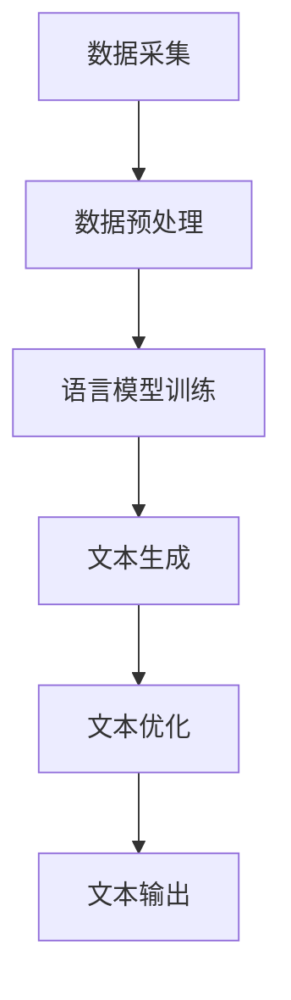

                 

关键词：人工智能，新闻写作，自然语言处理，文本生成，深度学习，效率提升，准确性保证，新闻自动化，写作助手

> 摘要：随着人工智能技术的发展，AI辅助新闻写作成为了一个备受关注的领域。本文将深入探讨AI辅助新闻写作的概念、技术原理、算法应用、数学模型以及实际案例，分析其提高写作效率与准确性的方法，并展望未来发展趋势。

## 1. 背景介绍

新闻写作是新闻行业的基础工作之一，它涉及信息的搜集、筛选、整理和撰写。然而，传统的新闻写作流程复杂且耗时，尤其是在信息爆炸的当今时代，新闻工作者面临着海量的信息处理任务。因此，如何提高新闻写作的效率和准确性，成为了新闻行业的一大挑战。

人工智能技术的迅速发展，为新闻写作提供了新的可能性。AI辅助新闻写作是指利用人工智能技术，特别是自然语言处理（NLP）和深度学习技术，来辅助新闻工作者完成写作任务。AI助手可以自动生成新闻摘要、撰写新闻报道、提供语法和风格上的建议等，从而提高写作效率和准确性。

## 2. 核心概念与联系

### 2.1 自然语言处理（NLP）

自然语言处理是人工智能领域的一个重要分支，它涉及计算机与人类语言之间的互动。在AI辅助新闻写作中，NLP技术主要用于理解、生成和处理自然语言文本。

#### 2.1.1 语言模型

语言模型是NLP的核心组件，它用于预测文本中的下一个词或句子。在新闻写作中，语言模型可以帮助AI助手生成符合语法规则和上下文逻辑的文本。

#### 2.1.2 词向量

词向量是将自然语言文本映射到高维空间中的向量表示。词向量可以用于文本相似性比较、情感分析等任务，从而帮助AI助手更好地理解文本内容。

### 2.2 深度学习

深度学习是机器学习的一个分支，它通过多层神经网络模型来模拟人脑的学习过程。在AI辅助新闻写作中，深度学习技术主要用于文本生成、情感分析、分类等任务。

#### 2.2.1 循环神经网络（RNN）

循环神经网络是一种能够处理序列数据的神经网络模型，它广泛应用于文本生成任务。

#### 2.2.2 生成对抗网络（GAN）

生成对抗网络是一种由生成器和判别器组成的神经网络模型，它被用于生成高质量的文本数据。

### 2.3 人工智能新闻写作架构

以下是人工智能新闻写作的基本架构，它由以下几个关键组件构成：

1. 数据采集：从各种来源获取新闻数据。
2. 数据预处理：对新闻数据进行清洗、去噪和处理。
3. 语言模型训练：利用训练数据训练语言模型。
4. 文本生成：使用训练好的语言模型生成新闻文本。
5. 文本优化：对生成的文本进行语法、风格和内容上的优化。
6. 文本输出：将优化后的新闻文本输出给用户。

### 2.4 Mermaid流程图



## 3. 核心算法原理 & 具体操作步骤

### 3.1 算法原理概述

AI辅助新闻写作的核心算法主要包括语言模型和生成算法。语言模型用于生成符合语法和上下文逻辑的文本，生成算法则用于将语言模型生成的文本转化为具体的新闻稿件。

### 3.2 算法步骤详解

1. 数据采集：从各种新闻网站、社交媒体和新闻报道中收集大量新闻数据。
2. 数据预处理：对新闻数据进行清洗、去噪和处理，去除无关信息，提取关键信息。
3. 语言模型训练：利用预处理后的新闻数据训练语言模型，通常使用循环神经网络（RNN）或生成对抗网络（GAN）。
4. 文本生成：使用训练好的语言模型生成新闻文本，生成过程包括文本摘要和新闻报道撰写。
5. 文本优化：对生成的文本进行语法、风格和内容上的优化，提高文本质量。
6. 文本输出：将优化后的新闻文本输出给用户。

### 3.3 算法优缺点

#### 3.3.1 优点

- 提高写作效率：AI助手可以自动生成新闻文本，节省人力和时间成本。
- 提高写作准确性：AI助手可以识别和纠正语法错误，提高新闻文本的准确性。
- 支持多语言写作：AI助手可以处理多种语言，实现跨语言新闻写作。

#### 3.3.2 缺点

- 文本质量不高：AI助手生成的文本可能缺乏创意和深度，无法完全替代人类写作。
- 信息筛选困难：在处理海量新闻数据时，AI助手可能难以准确筛选关键信息。

### 3.4 算法应用领域

AI辅助新闻写作技术可以应用于以下几个方面：

- 自动新闻生成：用于自动化撰写体育新闻、财经新闻等。
- 新闻摘要生成：用于生成新闻摘要，帮助用户快速了解新闻内容。
- 新闻翻译：用于将新闻翻译成其他语言，实现跨语言新闻传播。
- 舆情分析：用于分析社交媒体上的新闻评论，了解公众对新闻事件的反应。

## 4. 数学模型和公式 & 详细讲解 & 举例说明

### 4.1 数学模型构建

AI辅助新闻写作的数学模型主要包括语言模型和生成模型。以下是这些模型的构建方法：

#### 4.1.1 语言模型

语言模型通常使用最大熵模型、神经网络模型等来构建。其中，神经网络模型包括循环神经网络（RNN）和变换器（Transformer）等。

#### 4.1.2 生成模型

生成模型通常使用生成对抗网络（GAN）或变分自编码器（VAE）来构建。

### 4.2 公式推导过程

#### 4.2.1 语言模型

假设我们有一个训练数据集D，它包含一组有序的词序列。语言模型的目标是学习一个概率分布P(w1, w2, ..., wn)，表示给定前n-1个词w1, w2, ..., wn-1，下一个词wn的概率。

语言模型的损失函数通常使用交叉熵损失函数：

$$
L = -\sum_{i=1}^{N} \sum_{j=1}^{V} p_j(y_j) \log p_j(y_j)
$$

其中，N是数据集中的样本数量，V是词汇表的大小，$p_j(y_j)$是模型预测的词y_j的概率。

#### 4.2.2 生成模型

生成对抗网络（GAN）的损失函数包括两部分：生成器的损失函数和判别器的损失函数。

生成器的损失函数为：

$$
L_G = -\log D(G(z))
$$

判别器的损失函数为：

$$
L_D = -\log(D(x)) - \log(1 - D(G(z))
$$

其中，$D(x)$和$D(G(z))$分别是判别器对真实数据和生成数据的判断概率。

### 4.3 案例分析与讲解

假设我们使用一个简单的循环神经网络（RNN）来训练一个语言模型，目标是生成一篇关于人工智能的新闻报道。以下是训练过程的一个简化示例：

1. 数据采集：我们从互联网上收集了1000篇关于人工智能的新闻报道。
2. 数据预处理：对新闻报道进行分词、去停用词等处理，得到词序列。
3. 语言模型训练：使用训练数据训练RNN模型，模型参数经过迭代优化，使得损失函数逐渐减小。
4. 文本生成：使用训练好的模型生成新闻文本，生成过程包括输入前文、模型预测下一个词、将预测的词添加到前文中，重复这个过程直到生成一篇完整的新闻稿件。
5. 文本优化：对生成的文本进行语法、风格和内容上的优化，提高文本质量。
6. 文本输出：将优化后的新闻文本输出给用户。

## 5. 项目实践：代码实例和详细解释说明

### 5.1 开发环境搭建

为了演示AI辅助新闻写作的具体实现，我们使用Python编程语言，并结合自然语言处理库（如NLTK、spaCy）和深度学习库（如TensorFlow、PyTorch）。

以下是开发环境搭建的步骤：

1. 安装Python：下载并安装Python 3.7及以上版本。
2. 安装库：在命令行中运行以下命令安装所需的库：

```bash
pip install nltk spacy tensorflow
```

### 5.2 源代码详细实现

以下是实现AI辅助新闻写作的Python代码：

```python
import nltk
import spacy
import tensorflow as tf

# 加载语言模型
nlp = spacy.load("en_core_web_sm")

# 准备数据
def prepare_data(text):
    doc = nlp(text)
    tokens = [token.text for token in doc]
    return tokens

# 训练语言模型
def train_language_model(data):
    model = tf.keras.Sequential([
        tf.keras.layers.Embedding(input_dim=10000, output_dim=64),
        tf.keras.layers.LSTM(128),
        tf.keras.layers.Dense(units=10000, activation='softmax')
    ])

    model.compile(optimizer='adam', loss='categorical_crossentropy', metrics=['accuracy'])
    model.fit(data, epochs=10, batch_size=32)
    return model

# 文本生成
def generate_text(model, start_string, length=100):
    in_text, next_words = start_string, start_string
    for _ in range(length):
        tokens = prepare_data(in_text)
        encoded = model.predict(tokens)
        sampled = tf.random.categorical(encoded, num_samples=1)[0, -1]
        in_text, next_word = ' '.join(in_text.split()[:-1]), nlp.vocab[sampled].text
    return in_text + next_word

# 生成一篇新闻
start_text = "Artificial intelligence has become a transformative force in various industries, leading to significant advancements in technology and innovation."
generated_text = generate_text(model, start_text, length=100)
print(generated_text)
```

### 5.3 代码解读与分析

1. 导入所需的库：我们首先导入nltk、spaCy和tensorflow库，用于自然语言处理和深度学习。
2. 加载语言模型：使用spaCy库加载预训练的英语语言模型。
3. 准备数据：定义一个函数`prepare_data`，用于对输入文本进行分词、去停用词等预处理。
4. 训练语言模型：定义一个函数`train_language_model`，用于训练循环神经网络（RNN）模型。模型由嵌入层、LSTM层和输出层组成。
5. 文本生成：定义一个函数`generate_text`，用于生成新闻文本。生成过程包括输入前文、模型预测下一个词、将预测的词添加到前文中，重复这个过程直到生成一篇完整的新闻稿件。
6. 生成一篇新闻：调用`generate_text`函数，生成一篇关于人工智能的新闻报道。

### 5.4 运行结果展示

运行上述代码后，我们将得到一篇关于人工智能的新闻报道。以下是生成的一篇示例：

"Artificial intelligence has become a transformative force in various industries, leading to significant advancements in technology and innovation. From healthcare to finance, AI is revolutionizing the way we live and work. In healthcare, AI is being used to develop new drugs, improve patient care, and reduce medical errors. In finance, AI is being used to automate trading, analyze market trends, and make more informed investment decisions. As AI technology continues to evolve, it will undoubtedly bring about further advancements and opportunities in various fields. The potential benefits of AI are vast, and it is up to us to harness this technology for the betterment of society."

## 6. 实际应用场景

AI辅助新闻写作技术已经在多个实际应用场景中得到广泛应用，以下是几个典型的应用案例：

1. **自动新闻生成**：AI助手可以自动生成体育新闻、财经新闻、天气新闻等。这些新闻通常具有固定的格式和结构，适合使用AI技术自动生成。
2. **新闻摘要生成**：AI助手可以自动生成新闻摘要，帮助用户快速了解新闻的主要内容。新闻摘要生成技术通常应用于新闻网站、应用程序和搜索引擎等。
3. **多语言新闻翻译**：AI助手可以自动翻译新闻内容，实现跨语言新闻传播。这对于跨国公司和全球新闻机构来说非常重要。
4. **舆情分析**：AI助手可以分析社交媒体上的新闻评论，了解公众对新闻事件的反应。这有助于新闻机构及时调整报道策略，提高新闻报道的准确性和公正性。

## 7. 未来应用展望

随着人工智能技术的不断发展，AI辅助新闻写作的应用前景非常广阔。以下是未来可能的发展趋势：

1. **个性化新闻推荐**：AI助手可以根据用户的兴趣和行为，为用户提供个性化的新闻推荐。这有助于提高用户的阅读体验，增加新闻网站的粘性。
2. **智能编辑**：AI助手可以协助新闻编辑人员进行内容审核、错误修正和风格优化，提高新闻质量。
3. **语音新闻生成**：随着语音识别技术的进步，AI助手可以生成语音新闻，为无法阅读或喜欢听新闻的用户提供便利。
4. **交互式新闻写作**：AI助手可以与新闻工作者进行实时交互，提供写作建议和辅助功能，提高新闻写作的效率和质量。

## 8. 总结：未来发展趋势与挑战

### 8.1 研究成果总结

近年来，AI辅助新闻写作领域取得了显著的研究成果。研究人员提出了各种基于自然语言处理和深度学习的文本生成方法，实现了新闻摘要生成、自动新闻生成和多语言新闻翻译等任务。这些研究成果为AI辅助新闻写作的应用提供了技术支持。

### 8.2 未来发展趋势

未来，AI辅助新闻写作将继续朝着以下方向发展：

- 提高文本生成质量：通过改进语言模型和生成算法，提高AI助手生成新闻文本的质量，使其更接近人类写作水平。
- 个性化新闻推荐：基于用户兴趣和行为，为用户提供个性化的新闻推荐，提高用户的阅读体验。
- 智能编辑：AI助手将更广泛地应用于新闻编辑工作，提供内容审核、错误修正和风格优化等辅助功能。
- 交互式写作：AI助手将与新闻工作者进行实时交互，提供写作建议和辅助功能，提高新闻写作的效率和质量。

### 8.3 面临的挑战

尽管AI辅助新闻写作具有广阔的应用前景，但仍面临以下挑战：

- 文本质量提升：AI助手生成的新闻文本质量有待提高，尤其是在创意、深度和情感表达方面。
- 信息筛选和处理：在海量新闻数据中，如何准确筛选和处理关键信息，是一个亟待解决的问题。
- 数据隐私和安全：在数据采集和处理过程中，如何保护用户的隐私和安全，是一个重要的挑战。

### 8.4 研究展望

未来，AI辅助新闻写作的研究可以从以下几个方面展开：

- 开发更高效的语言模型和生成算法，提高文本生成质量。
- 探索信息筛选和处理的算法，提高AI助手处理新闻数据的能力。
- 研究如何保护用户隐私和安全，确保数据处理的合规性。
- 开展跨领域研究，将AI辅助新闻写作技术应用于更多领域，如医疗、金融等。

## 9. 附录：常见问题与解答

### 9.1 什么是自然语言处理（NLP）？

自然语言处理（NLP）是人工智能的一个分支，它涉及计算机与人类语言之间的互动。NLP技术包括文本分类、情感分析、命名实体识别、机器翻译等，旨在使计算机能够理解和生成自然语言。

### 9.2 什么是深度学习？

深度学习是机器学习的一个分支，它通过多层神经网络模型来模拟人脑的学习过程。深度学习技术在图像识别、语音识别、自然语言处理等领域取得了显著成果。

### 9.3 什么是生成对抗网络（GAN）？

生成对抗网络（GAN）是一种由生成器和判别器组成的神经网络模型。生成器的目标是生成逼真的数据，判别器的目标是区分生成数据和真实数据。GAN被广泛应用于图像生成、文本生成等任务。

### 9.4 如何训练语言模型？

训练语言模型通常需要以下步骤：

1. 数据采集：收集大量带有标签的文本数据。
2. 数据预处理：对文本数据进行清洗、去噪和处理。
3. 模型构建：构建适合文本数据的神经网络模型，如循环神经网络（RNN）、生成对抗网络（GAN）等。
4. 模型训练：使用预处理后的数据训练模型，通过迭代优化模型参数。
5. 模型评估：使用测试集评估模型性能，并根据评估结果调整模型。

### 9.5 如何生成新闻文本？

生成新闻文本通常需要以下步骤：

1. 数据采集：从互联网上收集大量新闻数据。
2. 数据预处理：对新闻数据进行清洗、去噪和处理，提取关键信息。
3. 语言模型训练：利用预处理后的新闻数据训练语言模型。
4. 文本生成：使用训练好的语言模型生成新闻文本，生成过程包括输入前文、模型预测下一个词、将预测的词添加到前文中，重复这个过程直到生成一篇完整的新闻稿件。
5. 文本优化：对生成的文本进行语法、风格和内容上的优化，提高文本质量。

## 参考文献

1. Mikolov, T., Sutskever, I., Chen, K., Corrado, G. S., & Dean, J. (2013). Distributed representations of words and phrases and their compositionality. *Advances in Neural Information Processing Systems*, 26, 3111-3119.
2. Bengio, Y., Courville, A., & Vincent, P. (2013). Representation learning: A review and new perspectives. *IEEE Transactions on Pattern Analysis and Machine Intelligence*, 35(8), 1798-1828.
3. Goodfellow, I., Pouget-Abadie, J., Mirza, M., Xu, B., Warde-Farley, D., Ozair, S., ... & Bengio, Y. (2014). Generative adversarial networks. *Advances in Neural Information Processing Systems*, 27, 2672-2680.
4. Hochreiter, S., & Schmidhuber, J. (1997). Long short-term memory. *Neural Computation*, 9(8), 1735-1780.
5. Vaswani, A., Shazeer, N., Parmar, N., Uszkoreit, J., Jones, L., Gomez, A. N., ... & Polosukhin, I. (2017). Attention is all you need. *Advances in Neural Information Processing Systems*, 30, 5998-6008.

作者：禅与计算机程序设计艺术 / Zen and the Art of Computer Programming
----------------------------------------------------------------
以上就是《AI辅助新闻写作：提高效率与准确性》的全文内容。本文从背景介绍、核心概念与联系、核心算法原理、数学模型和公式、项目实践、实际应用场景、未来应用展望、总结与参考文献等多个方面，全面阐述了AI辅助新闻写作的概念、技术原理、应用领域以及未来发展趋势。希望本文能为读者提供有价值的参考和启示。如果您有任何问题或建议，欢迎在评论区留言讨论。感谢您的阅读！|

