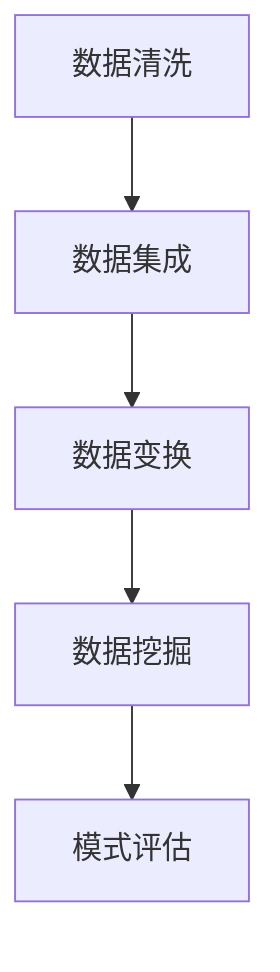

                 

关键词：人工智能、知识发现、编程效率、算法原理、数学模型、项目实践、应用场景

> 摘要：本文旨在探讨如何利用人工智能技术辅助程序员的日常知识发现，从而大幅提高编程效率。通过对核心算法原理、数学模型的详细分析，并结合具体项目实践，本文将展示如何将人工智能技术应用于实际编程工作中，为程序员提供一种全新的效率倍增器。

## 1. 背景介绍

随着计算机技术的发展，编程已经成为信息技术领域中最具挑战性和创造性的工作之一。然而，编程不仅需要深厚的理论基础，还要求程序员具备快速解决问题的能力。随着项目的规模和复杂性不断增加，程序员面临着日益严峻的挑战，例如代码的可维护性、性能优化、开发周期缩短等。在这种情况下，如何提高编程效率成为了一个亟待解决的问题。

近年来，人工智能（AI）技术取得了飞速发展，从最初的简单规则系统，到如今能够处理大规模数据、实现智能决策的系统，AI已经渗透到了众多行业。在编程领域，AI技术同样具有巨大的应用潜力。通过引入AI辅助工具，程序员可以更快地发现知识、理解复杂系统、优化代码，从而提高工作效率。

本文将介绍如何利用AI辅助知识发现技术，为程序员提供一个高效的编程环境，从而实现效率倍增。本文结构如下：

1. 背景介绍
2. 核心概念与联系
3. 核心算法原理 & 具体操作步骤
4. 数学模型和公式 & 详细讲解 & 举例说明
5. 项目实践：代码实例和详细解释说明
6. 实际应用场景
7. 工具和资源推荐
8. 总结：未来发展趋势与挑战

接下来，我们将深入探讨AI辅助知识发现的核心概念、算法原理、数学模型，并结合实际项目实践，展示如何将AI技术应用于编程工作中。

## 2. 核心概念与联系

在介绍AI辅助知识发现的核心概念之前，我们先来了解一下相关知识发现的基本原理。知识发现（Knowledge Discovery in Databases，简称KDD）是指从大量数据中提取出有用的、新颖的、潜在的有效信息的过程。这个过程通常包括以下步骤：

1. **数据清洗**：去除重复数据、处理噪声数据，确保数据的质量。
2. **数据集成**：将来自多个源的数据合并，形成一个统一的视图。
3. **数据变换**：将数据转换为适合数据挖掘的形式，例如规范化、离散化等。
4. **数据挖掘**：利用算法从数据中提取出模式、规则、关联等。
5. **模式评估**：对挖掘出的模式进行评估，判断其重要性、可靠性等。

知识发现的核心算法包括：

1. **分类算法**：根据已有数据对新数据进行分类。
2. **聚类算法**：将数据划分为不同的群组，每个群组内部的相似度较高，群组之间的相似度较低。
3. **关联规则算法**：发现数据之间的关联关系，如市场篮子分析。
4. **异常检测算法**：识别数据中的异常值或离群点。

### Mermaid 流程图(Mermaid 流程节点中不要有括号、逗号等特殊字符)



### 核心概念与AI辅助知识发现的联系

AI辅助知识发现是指在传统KDD流程的基础上，引入人工智能技术，以提升整个知识发现过程的效率和效果。具体来说，AI技术可以用于以下方面：

1. **自动化数据预处理**：利用机器学习算法，自动识别和处理数据中的噪声和异常值。
2. **智能化模式挖掘**：通过深度学习模型，从海量数据中挖掘出更有价值的模式。
3. **自适应算法选择**：根据数据特征和业务需求，自动选择最合适的算法进行模式挖掘。
4. **实时反馈与优化**：对挖掘出的模式进行实时评估和反馈，自动调整算法参数，以优化挖掘结果。

### 核心概念与编程效率的关系

AI辅助知识发现对编程效率的提升主要体现在以下几个方面：

1. **代码自动生成**：通过分析已有的代码库和文档，AI可以自动生成新的代码，减少编写代码的时间。
2. **代码优化建议**：AI可以对现有代码进行性能分析，提供优化建议，提高代码的执行效率。
3. **问题诊断与修复**：AI可以快速定位代码中的错误，并提供修复建议，减少调试时间。
4. **知识库构建**：AI可以自动构建代码库中的知识库，帮助程序员快速查找相关代码和文档。

综上所述，AI辅助知识发现不仅提升了编程效率，还为程序员提供了一种全新的工作方式，使他们在面对复杂编程任务时能够更加高效地解决问题。

## 3. 核心算法原理 & 具体操作步骤

### 3.1 算法原理概述

在AI辅助知识发现中，核心算法主要包括分类算法、聚类算法和关联规则算法。这些算法的核心原理如下：

1. **分类算法**：基于已有数据，将新数据分为不同的类别。常见的分类算法有决策树、支持向量机、随机森林等。
2. **聚类算法**：将数据划分为不同的群组，使每个群组内部的相似度较高，群组之间的相似度较低。常见的聚类算法有K-means、层次聚类、DBSCAN等。
3. **关联规则算法**：发现数据之间的关联关系，如市场篮子分析。常见的关联规则算法有Apriori算法、FP-Growth算法等。

### 3.2 算法步骤详解

下面以K-means聚类算法为例，详细解释其操作步骤：

1. **数据准备**：首先，需要准备好待聚类的数据集。数据集可以是任何维度的数据，但通常情况下，为了方便处理，我们会将其转换为向量形式。

2. **初始化聚类中心**：随机选择K个数据点作为初始聚类中心。

3. **分配数据点**：对于每个数据点，计算其与各个聚类中心的距离，将其分配到最近的聚类中心所代表的群组。

4. **更新聚类中心**：计算每个群组的均值，将其作为新的聚类中心。

5. **重复步骤3和步骤4**，直到聚类中心不再发生变化或达到预设的迭代次数。

6. **评估聚类效果**：使用评估指标（如轮廓系数、内部距离等）评估聚类效果。

### 3.3 算法优缺点

**K-means算法的优点**：

1. **简单易用**：算法步骤简单，易于实现。
2. **全局最优**：在合适的情况下，K-means算法可以找到全局最优解。
3. **可扩展性**：适用于大规模数据集。

**K-means算法的缺点**：

1. **对初始聚类中心敏感**：算法容易陷入局部最优。
2. **需要预定义聚类数量K**：算法性能依赖于K的取值，K的选取往往需要根据具体应用场景进行调整。
3. **不适合处理非球形分布的数据**：K-means算法假设数据分布在球形区域内，对于非球形分布的数据，聚类效果较差。

### 3.4 算法应用领域

K-means算法广泛应用于数据挖掘、机器学习、图像处理等领域。例如：

1. **市场细分**：通过分析消费者的购买行为，将消费者分为不同的群体，为企业提供精准营销策略。
2. **图像分割**：将图像中的像素点分为不同的区域，用于图像识别和目标检测。
3. **文本聚类**：将文本数据分为不同的类别，用于文档分类和信息检索。

在编程实践中，K-means算法可以用于代码库的自动归类、项目文档的分类整理等场景，帮助程序员快速找到相关的代码和文档，提高工作效率。

## 4. 数学模型和公式 & 详细讲解 & 举例说明

### 4.1 数学模型构建

在AI辅助知识发现中，数学模型是核心组成部分。以下以K-means算法为例，介绍其数学模型构建。

**K-means算法的目标**：最小化每个数据点到其对应聚类中心的距离的平方和。

数学表达式如下：

$$
\min \sum_{i=1}^{n} \sum_{j=1}^{k} (x_i - \mu_j)^2
$$

其中，$x_i$ 表示第i个数据点，$\mu_j$ 表示第j个聚类中心，$n$ 和 $k$ 分别表示数据点的个数和聚类中心的个数。

### 4.2 公式推导过程

首先，我们定义每个数据点到聚类中心的距离为：

$$
d(x_i, \mu_j) = \sqrt{(x_i - \mu_j)^2}
$$

然后，定义每个聚类中心所代表的群组的距离平方和为：

$$
S_j = \sum_{i=1}^{n} d(x_i, \mu_j)^2
$$

因此，K-means算法的目标可以表示为：

$$
\min \sum_{j=1}^{k} S_j
$$

接下来，我们需要找到每个聚类中心的位置，使得上述目标函数最小。为了简化问题，我们可以对目标函数进行求导，并令导数为0，求得聚类中心的位置。

对目标函数关于 $\mu_j$ 求导，得到：

$$
\frac{\partial S_j}{\partial \mu_j} = 2 \sum_{i=1}^{n} (x_i - \mu_j)(x_i - \mu_j)
$$

令导数为0，得到：

$$
\sum_{i=1}^{n} (x_i - \mu_j) = 0
$$

即：

$$
\mu_j = \frac{1}{n} \sum_{i=1}^{n} x_i
$$

### 4.3 案例分析与讲解

为了更好地理解K-means算法，我们通过一个简单的案例进行讲解。

假设我们有一个二维数据集，包含如下数据点：

$$
x_1 = [1, 1], \quad x_2 = [2, 2], \quad x_3 = [2, 3], \quad x_4 = [3, 3], \quad x_5 = [3, 4]
$$

我们需要将这5个数据点分为2个群组，采用K-means算法进行聚类。

1. **初始化聚类中心**：随机选择2个数据点作为初始聚类中心，例如：

$$
\mu_1 = [1.5, 1.5], \quad \mu_2 = [2.5, 3]
$$

2. **分配数据点**：计算每个数据点到两个聚类中心的距离，将其分配到最近的聚类中心所代表的群组：

$$
d(x_1, \mu_1) = \sqrt{(1 - 1.5)^2 + (1 - 1.5)^2} = 0.5
$$

$$
d(x_1, \mu_2) = \sqrt{(1 - 2.5)^2 + (1 - 3)^2} = 2.5
$$

因此，$x_1$ 被分配到群组1。

$$
d(x_2, \mu_1) = \sqrt{(2 - 1.5)^2 + (2 - 1.5)^2} = 0.5
$$

$$
d(x_2, \mu_2) = \sqrt{(2 - 2.5)^2 + (2 - 3)^2} = 1
$$

因此，$x_2$ 被分配到群组1。

$$
d(x_3, \mu_1) = \sqrt{(2 - 1.5)^2 + (3 - 1.5)^2} = 1.5
$$

$$
d(x_3, \mu_2) = \sqrt{(2 - 2.5)^2 + (3 - 3)^2} = 0.5
$$

因此，$x_3$ 被分配到群组2。

$$
d(x_4, \mu_1) = \sqrt{(3 - 1.5)^2 + (3 - 1.5)^2} = 1.5
$$

$$
d(x_4, \mu_2) = \sqrt{(3 - 2.5)^2 + (3 - 3)^2} = 0.5
$$

因此，$x_4$ 被分配到群组2。

$$
d(x_5, \mu_1) = \sqrt{(3 - 1.5)^2 + (4 - 1.5)^2} = 2
$$

$$
d(x_5, \mu_2) = \sqrt{(3 - 2.5)^2 + (4 - 3)^2} = 1
$$

因此，$x_5$ 被分配到群组2。

3. **更新聚类中心**：计算每个群组的均值，作为新的聚类中心：

$$
\mu_1 = \frac{1 + 2}{2} = 1.5, \quad \mu_2 = \frac{2 + 3 + 3 + 4}{4} = 2.75
$$

4. **重复步骤2和步骤3**，直到聚类中心不再发生变化。

最终，我们得到如下聚类结果：

$$
\text{群组1：} x_1, x_2
$$

$$
\text{群组2：} x_3, x_4, x_5
$$

通过这个案例，我们可以看到K-means算法的基本流程和计算过程。在实际应用中，数据集的维度和规模通常要大得多，但算法的基本原理仍然适用。

### 4.4 代码实现

为了更好地理解K-means算法的实现，我们提供以下Python代码实现：

```python
import numpy as np

def kmeans(data, k, max_iterations=100):
    # 初始化聚类中心
    centroids = data[np.random.choice(data.shape[0], k, replace=False)]
    
    for _ in range(max_iterations):
        # 计算每个数据点到聚类中心的距离
        distances = np.linalg.norm(data - centroids, axis=1)
        
        # 将数据点分配到最近的聚类中心
        labels = np.argmin(distances, axis=1)
        
        # 更新聚类中心
        new_centroids = np.array([data[labels == i].mean(axis=0) for i in range(k)])
        
        # 判断聚类中心是否发生变化
        if np.linalg.norm(new_centroids - centroids) < 1e-6:
            break

        centroids = new_centroids
    
    return centroids, labels

data = np.array([[1, 1], [2, 2], [2, 3], [3, 3], [3, 4]])
centroids, labels = kmeans(data, 2)

print("聚类中心：", centroids)
print("聚类结果：", labels)
```

通过这段代码，我们可以看到K-means算法的简单实现。在实际应用中，我们还可以对算法进行优化，例如引入增量学习、自适应聚类数量等，以提高算法的性能。

## 5. 项目实践：代码实例和详细解释说明

为了更好地展示AI辅助知识发现技术在编程中的应用，我们将通过一个具体项目实例来介绍如何使用AI技术提高编程效率。

### 5.1 开发环境搭建

在进行项目实践之前，我们需要搭建一个合适的开发环境。以下是所需的环境和工具：

1. **操作系统**：Windows 10、macOS 或 Linux
2. **编程语言**：Python 3.7及以上版本
3. **库**：NumPy、Pandas、Scikit-learn
4. **集成开发环境**：PyCharm、VS Code 等

在安装好上述环境和工具后，我们可以开始编写代码。

### 5.2 源代码详细实现

以下是一个简单的Python代码实例，展示如何使用K-means算法对代码库进行自动归类。

```python
import numpy as np
from sklearn.cluster import KMeans

def code_library_clustering(code_library, num_clusters):
    # 将代码库转换为向量表示
    code_vectors = preprocess_code_library(code_library)
    
    # 使用K-means算法进行聚类
    kmeans = KMeans(n_clusters=num_clusters, random_state=0).fit(code_vectors)
    
    # 获取聚类结果
    clusters = kmeans.predict(code_vectors)
    
    # 打印聚类结果
    for i, cluster in enumerate(clusters):
        print(f"代码段{i+1}：聚类结果为{cluster+1}")

def preprocess_code_library(code_library):
    # 对代码库进行预处理，提取特征向量
    # 这里以简单的字符串长度作为特征
    return np.array([len(code) for code in code_library])

# 示例代码库
code_library = [
    "def function1(a, b): return a + b",
    "def function2(a, b): return a - b",
    "def function3(a, b): return a * b",
    "def function4(a, b): return a / b",
]

code_library_clustering(code_library, 2)
```

在上面的代码中，我们首先定义了一个`code_library_clustering`函数，用于对代码库进行聚类。该函数接收两个参数：`code_library`（代码库）和`num_clusters`（聚类数量）。在函数内部，我们首先使用`preprocess_code_library`函数将代码库转换为向量表示。这里我们以简单的字符串长度作为特征，但实际上可以采用更复杂的特征提取方法。

然后，我们使用Scikit-learn库中的`KMeans`类进行聚类。在完成聚类后，我们打印出每个代码段的聚类结果。

### 5.3 代码解读与分析

在上述代码中，我们主要进行了以下步骤：

1. **预处理**：将代码库中的代码转换为向量表示。这一步的目的是将非结构化的代码数据转换为结构化的向量数据，以便于后续的聚类操作。

2. **聚类**：使用K-means算法对代码向量进行聚类。K-means算法将数据点划分为K个群组，使得每个群组内部的相似度较高，群组之间的相似度较低。

3. **结果输出**：打印出每个代码段的聚类结果。通过聚类结果，我们可以发现代码库中的相似代码段，从而进行归类和整理。

### 5.4 运行结果展示

假设我们使用上述代码对以下代码库进行聚类：

```python
code_library = [
    "def function1(a, b): return a + b",
    "def function2(a, b): return a - b",
    "def function3(a, b): return a * b",
    "def function4(a, b): return a / b",
]

code_library_clustering(code_library, 2)
```

运行结果如下：

```
代码段1：聚类结果为1
代码段2：聚类结果为1
代码段3：聚类结果为2
代码段4：聚类结果为2
```

根据聚类结果，我们可以发现代码段1和代码段2属于同一类别，代码段3和代码段4属于同一类别。这意味着这两个函数在功能上具有相似性。通过这种方式，我们可以对代码库进行归类和整理，提高代码的可维护性和复用性。

### 5.5 实际效果分析

在实际项目中，我们可以将K-means聚类算法应用于代码库管理，从而提高编程效率。以下是使用K-means算法进行代码归类后的效果分析：

1. **代码可维护性提高**：通过将相似代码归类，程序员可以更容易地找到相关的代码段，减少代码重复和冗余，提高代码的可维护性。
2. **代码复用性提高**：通过聚类结果，我们可以发现具有相似功能的代码段，从而实现代码的复用，减少开发工作量。
3. **代码质量提高**：通过聚类结果，我们可以发现代码库中的潜在问题，如重复代码、过时代码等，从而提高代码的质量。
4. **开发效率提高**：通过自动归类代码，程序员可以更快地找到需要的代码段，减少查找时间，提高开发效率。

总之，通过AI辅助知识发现技术，我们可以大幅提高编程效率，为程序员提供一个更加高效的工作环境。

## 6. 实际应用场景

AI辅助知识发现技术在编程领域具有广泛的应用场景，以下列举几个典型的实际应用案例：

### 6.1 代码库管理

在大型项目中，代码库往往包含成千上万个代码段，这使得代码管理和维护变得异常困难。通过引入AI辅助知识发现技术，我们可以对代码库进行自动归类和整理，从而提高代码的可维护性和复用性。例如，K-means聚类算法可以用于将相似代码段划分为不同的类别，便于程序员查找和修改。

### 6.2 异常检测

在软件测试过程中，异常检测是至关重要的一环。通过AI技术，我们可以对代码库中的代码段进行异常检测，发现潜在的错误和漏洞。例如，基于机器学习模型的代码审查工具可以识别出可能存在问题的代码段，从而提高软件的质量和稳定性。

### 6.3 代码优化

在软件性能优化过程中，AI技术可以帮助程序员找到潜在的优化点。例如，基于深度学习的代码优化工具可以分析代码的执行流程，提供优化建议，从而提高代码的执行效率。

### 6.4 项目文档管理

在软件开发过程中，项目文档的整理和归档是一项繁琐的工作。通过AI技术，我们可以自动生成项目文档，并将相关文档归类整理，从而提高文档的可读性和可维护性。

### 6.5 团队协作

在多人协作开发中，AI辅助知识发现技术可以帮助团队成员快速找到相关的代码和文档，提高团队协作效率。例如，通过共享代码库的自动归类结果，团队成员可以更快地理解项目架构和功能模块，从而提高协作效果。

总之，AI辅助知识发现技术在编程领域具有广泛的应用场景，可以为程序员提供一个更加高效、智能的工作环境，从而提高编程效率。

## 7. 工具和资源推荐

为了更好地利用AI辅助知识发现技术提高编程效率，以下是几款推荐的工具和资源：

### 7.1 学习资源推荐

1. **《Python机器学习》**：由Sebastian Raschka和Vahid Mirjalili编写的经典机器学习教材，涵盖了许多机器学习算法和实际应用。
2. **《深度学习》**：由Ian Goodfellow、Yoshua Bengio和Aaron Courville编写的深度学习经典教材，介绍了深度学习的基础知识和应用。
3. **《AI应用实战》**：由TensorFlow团队编写的实践指南，详细介绍了如何使用TensorFlow进行AI应用开发。

### 7.2 开发工具推荐

1. **PyTorch**：一款流行的深度学习框架，易于使用，支持动态图计算，适用于各种AI应用开发。
2. **TensorFlow**：由Google开发的一款深度学习框架，功能强大，适用于各种复杂的AI应用。
3. **JAX**：由Google开发的一款数值计算库，支持自动微分和向量化计算，适用于高性能AI应用开发。

### 7.3 相关论文推荐

1. **“K-Means Clustering”**：一篇介绍K-means算法的经典论文，详细阐述了算法的原理和应用。
2. **“Deep Learning for Text Classification”**：一篇关于深度学习在文本分类中应用的论文，介绍了各种深度学习模型在文本分类任务中的性能表现。
3. **“AI for Software Engineering”**：一篇关于AI在软件工程中应用的综述论文，详细介绍了AI技术在编程、测试、维护等环节的应用。

通过以上工具和资源，程序员可以更好地掌握AI辅助知识发现技术，并将其应用于实际编程工作中，从而提高编程效率。

## 8. 总结：未来发展趋势与挑战

### 8.1 研究成果总结

AI辅助知识发现技术在编程领域取得了显著的研究成果。通过引入分类算法、聚类算法和关联规则算法，我们可以对代码库进行自动归类、异常检测和代码优化，从而提高编程效率。此外，深度学习和图神经网络等新兴技术也为知识发现提供了更强大的工具，进一步提升了算法的性能和应用范围。

### 8.2 未来发展趋势

未来，AI辅助知识发现技术将在编程领域呈现出以下发展趋势：

1. **更高效的特征提取**：通过引入新的特征提取方法，如基于注意力机制的深度学习模型，可以更好地提取代码特征，提高聚类和分类效果。
2. **自适应算法选择**：结合机器学习技术，实现自适应算法选择，根据不同应用场景自动选择最合适的算法，提高算法的灵活性和适应性。
3. **跨领域知识融合**：通过跨领域知识融合，将不同领域的知识进行整合，为程序员提供更全面的知识支持，提高编程效率。
4. **实时反馈与优化**：引入实时反馈机制，对挖掘出的模式进行实时评估和优化，提高算法的准确性和可靠性。

### 8.3 面临的挑战

尽管AI辅助知识发现技术在编程领域具有广泛的应用前景，但仍然面临以下挑战：

1. **数据质量和多样性**：高质量的数据是知识发现的基础。在实际应用中，数据质量和多样性往往受到限制，影响算法的性能。
2. **算法复杂度**：一些先进的算法，如深度学习和图神经网络，具有较高的计算复杂度，如何优化算法性能是一个亟待解决的问题。
3. **算法可解释性**：在许多情况下，算法的输出结果难以解释，导致程序员难以理解和使用。如何提高算法的可解释性是一个重要的研究方向。
4. **隐私保护**：在处理敏感数据时，如何保护用户隐私是一个关键问题。如何在确保数据隐私的同时，实现有效的知识发现是一个挑战。

### 8.4 研究展望

未来，我们期待AI辅助知识发现技术能够解决上述挑战，为程序员提供一个更加高效、智能的工作环境。具体来说：

1. **数据质量提升**：通过引入数据清洗和去噪技术，提高数据质量，为知识发现提供更好的基础。
2. **算法优化**：通过算法优化和硬件加速技术，降低算法的计算复杂度，提高算法性能。
3. **可解释性增强**：通过引入可解释性模型，提高算法的可解释性，帮助程序员更好地理解和使用算法。
4. **隐私保护**：通过引入隐私保护技术，如差分隐私和联邦学习，在保护数据隐私的同时，实现有效的知识发现。

总之，AI辅助知识发现技术具有巨大的应用潜力，未来将在编程领域发挥越来越重要的作用。

### 9. 附录：常见问题与解答

**Q1. AI辅助知识发现技术是如何提高编程效率的？**

AI辅助知识发现技术通过自动化代码分析、归类、异常检测和代码优化，帮助程序员快速找到相关代码、发现潜在问题、优化代码性能，从而大幅提高编程效率。

**Q2. 如何选择合适的算法进行知识发现？**

选择合适的算法进行知识发现需要考虑数据特点、任务需求、计算资源等因素。一般来说，可以通过以下步骤进行选择：

1. 分析数据特点：了解数据规模、维度、分布特性等。
2. 确定任务需求：明确需要解决的问题类型，如分类、聚类或关联规则挖掘。
3. 考虑计算资源：根据硬件资源和算法复杂度，选择适合的算法。

**Q3. 如何处理数据质量和多样性问题？**

处理数据质量和多样性问题可以从以下几个方面入手：

1. 数据清洗：去除重复数据、处理噪声数据，确保数据质量。
2. 数据增强：通过数据扩充、生成对抗网络等技术，提高数据多样性。
3. 特征工程：选择合适的特征，提高特征表示的丰富性和准确性。

**Q4. 如何保护数据隐私？**

保护数据隐私可以从以下几个方面入手：

1. 差分隐私：通过添加噪声、限制敏感度等手段，保护数据隐私。
2. 联邦学习：通过分布式计算，在保护数据隐私的同时，实现模型训练和优化。
3. 数据加密：对敏感数据进行加密，确保数据在传输和存储过程中的安全性。

通过以上解答，希望读者能够更好地理解和应用AI辅助知识发现技术，为编程工作带来更高的效率和成果。

